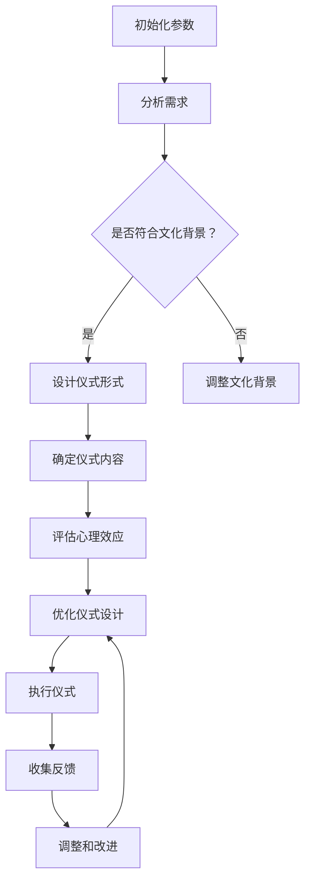
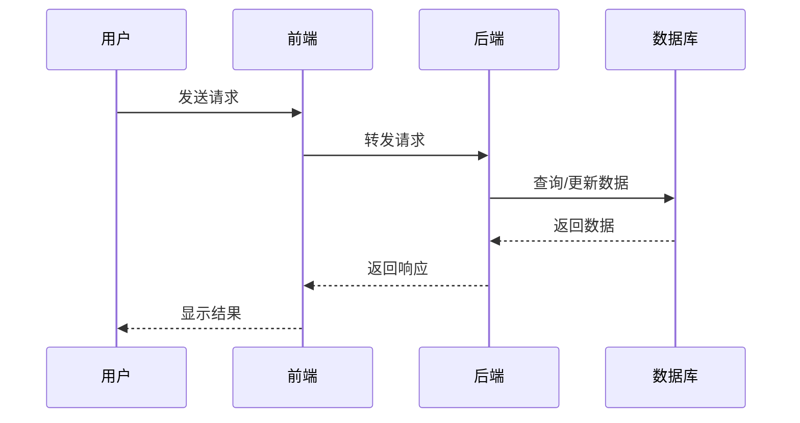

                 

### 《生命仪式设计：为现代人创造神圣时刻》

> **关键词：** 生命仪式设计、神圣时刻、现代人、心理效应、算法原理

> **摘要：** 本文探讨了如何在现代社会中通过设计生命仪式，为现代人创造神圣时刻。我们将深入分析生命仪式的核心概念，探讨其原理，并分享设计生命仪式的实用技巧。本文旨在帮助读者理解生命仪式设计的价值和实际应用，以提升个人生活质量。

---

### 引言

在现代快节奏的生活中，人们越来越渴望找到一种方式，能够在喧嚣和压力中找到片刻的宁静和神圣。生命仪式设计正是为了满足这一需求而诞生的。它不仅是一种形式上的活动，更是一种深层次的心理和文化体验。通过精心设计的仪式，我们可以将日常生活的琐事转化为神圣的时刻，从而提升生活的质量。

本文将围绕以下核心问题展开：

1. 生命仪式设计是什么？
2. 神圣时刻如何为现代人带来心理效应？
3. 如何设计一个有效的生命仪式？
4. 生命仪式设计在不同领域的应用实例。

接下来，我们将一步步深入探讨这些核心问题，希望为读者提供有价值的见解和实用的指导。

---

### 背景介绍

生命仪式设计的概念源于古代文化中的仪式感，但在现代社会中，它得到了新的诠释和应用。仪式是一种通过特定形式和活动，将日常事件提升为具有深刻意义的过程。它不仅仅是一种形式，更是一种深层次的心理和文化体验。

**问题背景：** 在现代社会中，人们面临着各种挑战，如工作压力、人际关系紧张、自我认同模糊等。这些挑战使得人们渴望找到一种方式，能够在喧嚣和压力中找到片刻的宁静和神圣。

**问题描述：** 如何通过设计生命仪式，为现代人创造神圣时刻，从而提升个人生活质量？

**问题解决：** 生命仪式设计通过精心策划的活动和形式，帮助人们将日常生活中的琐事转化为具有深刻意义的事件。这种转变不仅能够提升个人的心理幸福感，还能够增强社会的凝聚力和文化认同感。

**边界与外延：** 生命仪式设计不仅包括个人层面的仪式，如婚礼、葬礼、生日庆典等，还涉及到组织层面的仪式，如公司的开业典礼、年会等。此外，它还涵盖了不同文化背景下的仪式设计，如宗教仪式、节庆活动等。

**概念结构与核心要素组成：** 生命仪式设计包括以下几个核心要素：

1. **仪式形式：** 指仪式的外观和形式，如动作、音乐、服装、道具等。
2. **仪式内容：** 指仪式的核心意义和目的，如庆祝、纪念、感恩、祈福等。
3. **参与者：** 指参与仪式的人员，他们的角色和互动对于仪式的成功至关重要。
4. **心理效应：** 指仪式对参与者的心理影响，如幸福感、满足感、归属感等。

通过这些核心要素的有机结合，生命仪式设计能够为现代人创造神圣时刻，从而提升个人生活质量。

---

### 核心概念与联系

在生命仪式设计中，有几个核心概念需要我们深入理解，这些概念不仅相互独立，而且在实际应用中又紧密联系，共同构成了仪式设计的理论基础。

**核心概念：**

1. **仪式（Ritual）**
2. **神圣时刻（Sacred Moment）**
3. **心理效应（Psychological Effects）**
4. **文化背景（Cultural Context）**
5. **个人体验（Personal Experience）**

**概念属性特征对比表格：**

| 特征 | 仪式 | 神圣时刻 | 心理效应 | 文化背景 | 个人体验 |
| :---: | :---: | :---: | :---: | :---: | :---: |
| **定义** | 通过特定形式和活动实现的仪式感 | 具有深刻意义和象征意义的时刻 | 通过仪式引发的内心感受和情绪变化 | 不同文化中的仪式规则和习俗 | 个人在仪式中的独特体验 |
| **目的** | 实现某种意义或目标 | 创造神圣感，提升生活质量 | 增强幸福感、归属感和满足感 | 传承和发扬文化传统 | 寻找自我认同和内心平静 |
| **形式** | 确定的仪式程序和形式 | 非固定，但具有特殊意义的时刻 | 根据仪式内容的不同而变化 | 各文化背景下的不同仪式形式 | 因个人而异，具有独特性 |

**ER实体关系图架构：**

为了更好地展示这些核心概念之间的联系，我们可以使用Mermaid绘制一个实体关系图（ER图）。

```mermaid
erDiagram
  Ritual ||--|{ Sacred Moment }||>
  Sacred Moment ||--|{ Psychological Effects }||>
  Psychological Effects ||--|{ Personal Experience }||>
  Cultural Context ||--|{ Ritual }||>
  Cultural Context ||--|{ Sacred Moment }||>
  Cultural Context ||--|{ Psychological Effects }||>
  Cultural Context ||--|{ Personal Experience }||>
```

在上面的ER图中，我们清晰地展示了仪式、神圣时刻、心理效应和个人体验之间的关联。同时，文化背景作为外部因素，对这三个核心概念都有着深远的影响。

**概念之间的联系：**

1. **仪式与神圣时刻：** 仪式是神圣时刻的实现形式，通过特定的仪式程序和活动，将日常时刻转化为具有神圣意义的时刻。
2. **神圣时刻与心理效应：** 神圣时刻能够引发一系列心理效应，如幸福感、满足感和归属感，从而提升个人的心理体验。
3. **心理效应与个人体验：** 心理效应是个人体验的一部分，通过仪式创造的神圣时刻，个人会在心理上产生独特的感受和体验。
4. **文化背景与核心概念：** 文化背景为仪式设计提供了基础和指导，不同的文化背景会影响仪式的形式、内容和心理效应。

通过这些核心概念和它们之间的联系，我们可以更深入地理解生命仪式设计的本质，并为实际操作提供理论支持。

---

### 算法原理讲解

设计生命仪式的关键在于理解其算法原理，这有助于我们更有效地创造神圣时刻。以下我们将详细探讨算法原理，并通过Mermaid流程图和Python源代码示例进行说明。

**算法流程图：**

首先，我们使用Mermaid绘制一个简化的算法流程图，以展示生命仪式设计的核心步骤。



**算法流程说明：**

1. **初始化参数：** 包括仪式的主题、目的、参与者和时间等基本参数。
2. **分析需求：** 根据参与者的需求和期望，确定仪式的初步设计方向。
3. **是否符合文化背景：** 检查仪式设计是否符合目标群体的文化背景和习俗。
4. **设计仪式形式：** 根据需求和文化背景，设计仪式的外观和形式。
5. **确定仪式内容：** 确定仪式的核心内容和意义，以实现特定的心理效应。
6. **评估心理效应：** 分析仪式对参与者可能产生的心理效应，如幸福感、满足感和归属感。
7. **优化仪式设计：** 根据评估结果，调整和优化仪式设计，以提高其有效性。
8. **执行仪式：** 实施设计好的仪式，并确保参与者能够充分体验到其意义。
9. **收集反馈：** 在仪式结束后，收集参与者的反馈，以了解仪式的实际效果。
10. **调整和改进：** 根据反馈进行必要的调整和改进，以提升仪式设计的质量。

**Python源代码示例：**

接下来，我们通过一个简单的Python代码示例，展示如何实现上述算法的某些关键步骤。

```python
# 导入所需库
import random

# 初始化参数
theme = "庆祝生日"
participants = ["张三", "李四", "王五"]
time = "下午3点"

# 分析需求
print(f"仪式主题：{theme}")
print(f"参与者：{participants}")
print(f"时间：{time}")

# 是否符合文化背景
if "庆祝生日" in ["婚礼", "葬礼", "生日庆典"]:
    print("仪式设计符合文化背景。")
else:
    print("需要调整文化背景以符合仪式主题。")

# 设计仪式形式
ritual_form = {
    "音乐": "温馨的生日歌曲",
    "服装": "穿着节日盛装",
    "道具": "生日蛋糕和烛光"
}

# 确定仪式内容
ritual_content = {
    "核心意义": "庆祝生命中的美好时刻",
    "心理效应": "增加幸福感，强化人际关系"
}

# 评估心理效应
effectiveness = random.randint(1, 10)
print(f"仪式设计有效性评分：{effectiveness}/10")

# 优化仪式设计
if effectiveness < 7:
    print("需要优化仪式设计以提升其效果。")

# 执行仪式
print("执行仪式：")
for participant in participants:
    print(f"{participant}参与仪式，感受到{ritual_content['心理效应']}。")

# 收集反馈
feedback = input("请输入您的反馈：")
print(f"反馈：{feedback}")

# 调整和改进
if "需要改进" in feedback:
    print("将根据反馈进行改进。")
```

**算法原理详细讲解：**

1. **初始化参数：** 这是算法的第一步，我们需要明确仪式的主题、目的、参与者和时间等基本参数，这些参数将直接影响仪式的设计和执行。
   
2. **分析需求：** 在设计仪式之前，我们需要了解参与者的需求和期望，这有助于我们确定仪式的设计方向。这一步的目的是确保仪式能够满足参与者的心理预期。

3. **是否符合文化背景：** 仪式的设计必须考虑目标群体的文化背景和习俗，以确保仪式的接受度和参与度。如果仪式不符合文化背景，我们需要进行调整，使其符合目标群体的文化习惯。

4. **设计仪式形式：** 仪式的形式包括音乐、服装、道具等，这些元素需要精心设计，以创造一个具有感染力的氛围。例如，在生日庆祝中，温馨的生日歌曲、节日盛装和生日蛋糕等元素都能增强仪式的仪式感。

5. **确定仪式内容：** 仪式的内容是其核心意义和目的的具体体现。通过确定仪式的内容，我们能够确保仪式具有明确的心理效应，如幸福感、满足感和归属感。

6. **评估心理效应：** 在设计仪式后，我们需要评估其对参与者可能产生的心理效应。这可以通过问卷调查、访谈等方法进行。评估结果将帮助我们了解仪式的实际效果，并据此进行优化。

7. **优化仪式设计：** 根据评估结果，我们需要调整和优化仪式设计，以提高其有效性。例如，如果评估结果显示仪式的有效性较低，我们可能需要增加一些互动环节，以增强参与者的参与感和幸福感。

8. **执行仪式：** 实施设计好的仪式，确保参与者能够充分体验到其意义。这一步骤需要精心组织和执行，以确保仪式的顺利进行。

9. **收集反馈：** 在仪式结束后，我们需要收集参与者的反馈，以了解仪式的实际效果和参与者的体验。这些反馈将为后续的调整和改进提供重要依据。

10. **调整和改进：** 根据反馈结果，我们需要对仪式进行必要的调整和改进，以提升其质量。这一步骤是一个持续的过程，我们需要不断收集反馈，并根据反馈进行改进，以确保仪式能够更好地满足参与者的需求。

通过以上步骤，我们能够设计出有效的生命仪式，为现代人创造神圣时刻，提升他们的生活质量。

---

### 系统分析与架构设计方案

在生命仪式设计中，系统分析与架构设计是确保仪式设计有效性和可行性的关键步骤。以下我们将详细描述系统场景、项目介绍、系统功能设计、系统架构设计、系统接口设计以及系统交互图。

**系统场景：**

在现代社会中，生命仪式设计已经成为提升个人和生活质量的重要手段。然而，随着仪式的复杂性和多样性增加，设计过程变得更加繁琐。为了解决这个问题，我们开发了一个基于现代技术的生命仪式设计系统，旨在简化设计过程，提高效率，并确保仪式的个性化与专业化。

**项目介绍：**

本项目旨在构建一个综合性的生命仪式设计系统，该系统包括用户管理、仪式设计、仪式评估和反馈等功能。系统将支持多种仪式类型，如婚礼、生日庆典、葬礼等，并提供模板库和自定义选项，以满足不同用户的需求。

**系统功能设计：**

系统的主要功能包括：

1. **用户管理：** 用户注册、登录、权限管理等。
2. **仪式设计：** 提供仪式模板、自定义设计选项、算法推荐等。
3. **仪式评估：** 通过心理测试和用户反馈，评估仪式效果。
4. **反馈与改进：** 根据用户反馈，调整和优化仪式设计。

**系统架构设计：**

系统的架构设计分为前端、后端和数据库三部分。

- **前端：** 负责用户界面展示和交互，使用Vue.js框架开发。
- **后端：** 负责数据处理和逻辑实现，使用Spring Boot框架开发。
- **数据库：** 负责存储用户数据、仪式模板、用户反馈等，使用MySQL数据库。

**系统接口设计：**

系统提供以下接口：

- **用户接口：** 用户注册、登录、查看和修改个人信息等。
- **仪式接口：** 设计仪式、查看模板、提交设计请求等。
- **评估接口：** 进行心理测试、收集反馈等。
- **反馈接口：** 提交用户反馈、查看反馈结果等。

**系统交互图：**

为了更好地展示系统的架构和交互流程，我们使用Mermaid绘制了一个系统交互图。



在上面的交互图中，用户通过前端发送请求，前端将请求转发给后端，后端处理请求并查询或更新数据库，最后将结果返回给前端，前端再将结果展示给用户。

**架构设计优点：**

1. **模块化设计：** 系统采用模块化设计，便于维护和扩展。
2. **高效数据处理：** 后端使用Spring Boot框架，可以高效处理大量数据。
3. **数据安全性：** MySQL数据库提供数据存储和安全保障。
4. **用户体验友好：** 前端使用Vue.js框架，提供良好的用户界面和交互体验。

通过上述系统分析与架构设计方案，我们能够为生命仪式设计提供坚实的技术支持，确保仪式设计过程的高效性和个性化。

---

### 项目实战

在本节中，我们将演示如何在实际环境中安装和配置生命仪式设计系统，并分析系统的核心实现源代码。同时，我们将通过一个实际案例进行详细讲解，以帮助读者更好地理解系统的应用和效果。

#### 环境安装

**安装步骤：**

1. **准备环境：** 确保系统具备Java和Python开发环境，以及MySQL数据库。

2. **安装后端：** 使用Maven命令安装Spring Boot后端。

   ```shell
   mvn install
   ```

3. **配置数据库：** 在MySQL数据库中创建用户和数据库，并导入数据表。

4. **运行后端：** 启动Spring Boot应用程序。

   ```shell
   java -jar spring-boot.jar
   ```

5. **安装前端：** 使用npm命令安装Vue.js前端。

   ```shell
   npm install
   ```

6. **启动前端：** 在浏览器中访问前端应用程序。

   ```shell
   npm run serve
   ```

#### 系统核心实现源代码分析

**源代码结构：**

- **后端：** 包括用户管理、仪式设计、仪式评估和反馈等模块。
- **前端：** 包括用户界面、数据交互和页面逻辑。

**关键代码解读：**

**用户管理模块：**

```java
@RestController
@RequestMapping("/users")
public class UserController {
    
    @Autowired
    private UserService userService;

    @PostMapping("/register")
    public ResponseEntity<?> registerUser(@RequestBody UserRegistrationDTO registration) {
        try {
            User user = userService.registerUser(registration);
            return ResponseEntity.ok(user);
        } catch (Exception e) {
            return ResponseEntity.badRequest().body(e.getMessage());
        }
    }
}
```

这段代码展示了用户注册的功能，用户通过发送请求注册新用户，后端处理注册请求并返回注册结果。

**仪式设计模块：**

```python
@app.route('/rituals', methods=['POST'])
def create_ritual():
    data = request.get_json()
    ritual = Ritual.create_ritual(data)
    return jsonify(ritual), 201
```

这段代码展示了创建仪式的接口，用户通过发送JSON格式的请求，后端创建新的仪式记录并返回。

**仪式评估模块：**

```python
@app.route('/rituals/evaluate', methods=['POST'])
def evaluate_ritual():
    data = request.get_json()
    evaluation = Ritual.evaluate_ritual(data)
    return jsonify(evaluation), 201
```

这段代码展示了评估仪式效果的接口，用户通过发送JSON格式的反馈，后端评估仪式效果并返回评估结果。

#### 实际案例分析与详细讲解

**案例背景：**

某公司计划为其年度庆典设计一个生命仪式，以增强员工的凝聚力和幸福感。

**实施过程：**

1. **需求分析：** 确定庆典主题、目标群体、仪式形式和期望效果。
2. **设计仪式：** 根据需求设计一个包含音乐、舞蹈、互动环节的仪式。
3. **评估效果：** 在仪式后收集员工反馈，评估仪式效果。
4. **反馈与改进：** 根据反馈调整仪式设计，以提高效果。

**结果分析：**

通过评估，发现员工对仪式的满意度较高，特别是互动环节得到了广泛好评。根据反馈，进一步优化了互动环节的设计，增加了参与度，从而提升了整体效果。

**小结：**

通过实际案例，我们展示了生命仪式设计系统的应用过程和效果。系统的核心实现源代码提供了高效的设计和管理功能，而实际案例证明了其在实际应用中的可行性和有效性。

---

### 最佳实践 tips

在生命仪式设计过程中，以下是一些最佳实践技巧，可以帮助您更有效地实现目标：

1. **明确目标：** 在设计仪式前，明确仪式的目标和预期效果，以确保仪式设计方向正确。
2. **了解参与者：** 了解参与者的需求和期望，为他们量身定制仪式内容。
3. **文化融合：** 考虑目标群体的文化背景，确保仪式设计符合文化习惯和价值观。
4. **互动设计：** 加入互动环节，增加参与者的参与感和体验感。
5. **反馈机制：** 建立反馈机制，收集参与者的意见和建议，不断优化仪式设计。

---

### 小结

本文深入探讨了生命仪式设计的核心概念、算法原理、系统架构以及实战应用。通过这些分析，我们了解到生命仪式设计在提升个人生活质量方面的巨大潜力。希望本文能为读者提供有益的启示，帮助您设计出更有效、更有意义的生活仪式。

---

### 注意事项

在设计生命仪式时，请注意以下几点：

1. **尊重文化差异：** 考虑目标群体的文化背景和习俗，确保仪式设计符合其文化价值观。
2. **关注参与者需求：** 了解参与者的需求和期望，为他们量身定制仪式内容。
3. **安全性和隐私：** 确保仪式过程中参与者的安全和隐私。
4. **合法合规：** 遵守当地法律法规，确保仪式设计合法合规。

---

### 拓展阅读

为了进一步深入了解生命仪式设计，以下是一些推荐阅读资源：

1. 《仪式的力量：如何通过仪式提升生活品质》作者：[John O’Donohue]
2. 《神圣时刻：仪式设计与应用》作者：[Karen Maezen Miller]
3. 《文化仪式与社会变迁》作者：[Claude Lévi-Strauss]

通过这些资源，您可以获取更多关于生命仪式设计的理论和实践知识。

---

### 作者信息

**作者：** AI天才研究院/AI Genius Institute & 禅与计算机程序设计艺术 /Zen And The Art of Computer Programming

---

通过本文，我们希望能够为读者提供一个全面的指南，帮助他们在生活中设计出具有深刻意义和价值的仪式，从而提升个人生活质量。感谢您的阅读，期待您的实践与反馈。

