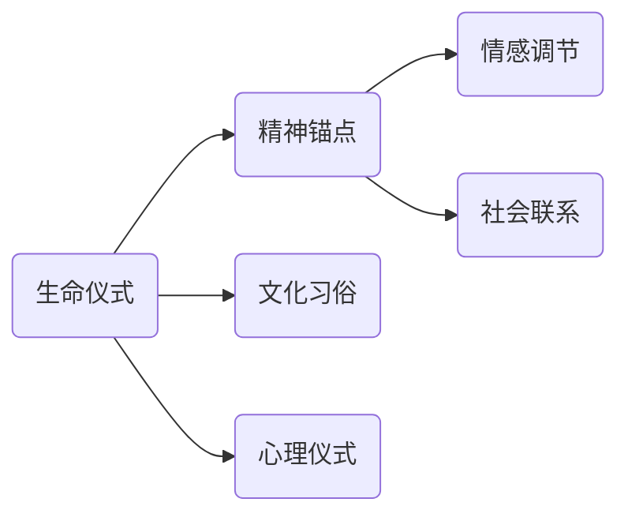

                 

# 《生命仪式：重塑现代人的精神锚点》

> **关键词**：生命仪式、精神锚点、心理健康、文化习俗、心理指导

> **摘要**：本文深入探讨了生命仪式与精神锚点的概念及其在现代生活中的重要性。通过对历史、心理学、心理健康等方面的分析，本文揭示了生命仪式如何作为精神锚点，帮助现代人重塑精神世界，提高心理健康水平。文章提出了构建个人生命仪式的方法，并提供了具体的应用实例，旨在为读者提供实践指导。

## 目录大纲设计过程

在设计《生命仪式：重塑现代人的精神锚点》的目录大纲时，我们首先需要从书名中提炼出核心概念，即“生命仪式”和“精神锚点”。接着，我们将围绕这两个核心概念构建章节结构，确保每一个章节都紧密围绕书的主旨展开讨论。以下是具体的步骤：

1. **书名解读**：
   - “生命仪式”：涉及生命过程、文化习俗、心理仪式等方面的内容。
   - “精神锚点”：涉及心理状态、情感管理、精神指导等方面的内容。

2. **确定章节结构**：
   - **第1章：引言**：介绍“生命仪式”与“精神锚点”的基本概念和本书的研究背景。
   - **第2章：生命仪式的历史与意义**：探讨生命仪式的起源、发展和其对现代社会的影响。
   - **第3章：精神锚点的理论探讨**：分析精神锚点的心理学原理、分类和功能。
   - **第4章：生命仪式与现代心理健康的联系**：讨论生命仪式如何影响现代人的心理健康。
   - **第5章：构建个人的生命仪式**：指导读者如何根据自身需求设计并实践生命仪式。
   - **第6章：精神锚点在实践中的应用**：提供具体案例，展示精神锚点在生活中的实际应用。
   - **第7章：结语**：总结全书内容，展望未来研究方向。

3. **细化章节内容**：
   - 每一章根据其主题，进一步细分为若干小节，确保内容的逻辑性和连贯性。
   - 在每个小节中，采用问题导向和实证分析的方法，结合理论和实际案例，详细阐述每个概念、原理或方法的含义和应用。

4. **撰写目录大纲**：
   - 根据上述章节结构和内容，使用markdown格式撰写详细的目录大纲。
   - 确保每个章节的标题和子标题清晰明了，逻辑层次分明。

通过以上步骤，我们设计出了一个完整、逻辑清晰的目录大纲，为后续的写作和排版提供了坚实的基础。以下是具体的目录大纲内容。

## 目录大纲

### 《生命仪式：重塑现代人的精神锚点》

#### 目录

- **引言**
  - **1.1 生命仪式与精神锚点的概念**
  - **1.2 本书的研究背景和目的**
- **生命仪式的历史与意义**
  - **2.1 生命仪式的起源与演变**
  - **2.2 生命仪式在现代社会中的意义**
  - **2.3 生命仪式的文化多样性**
- **精神锚点的理论探讨**
  - **3.1 精神锚点的心理学原理**
  - **3.2 精神锚点的分类与功能**
  - **3.3 精神锚点的实证研究**
- **生命仪式与现代心理健康的联系**
  - **4.1 心理健康的定义与重要性**
  - **4.2 生命仪式对心理健康的积极作用**
  - **4.3 生命仪式在不同心理健康问题中的应用**
- **构建个人的生命仪式**
  - **5.1 设计生命仪式的步骤**
  - **5.2 生命仪式的个性化与适应性**
  - **5.3 生命仪式的实施与评估**
- **精神锚点在实践中的应用**
  - **6.1 精神锚点在自我管理中的应用**
  - **6.2 精神锚点在人际交往中的应用**
  - **6.3 精神锚点在职业发展中的应用**
- **结语**
  - **7.1 全书的总结与展望**
  - **7.2 对未来研究的建议**

## 生命仪式与精神锚点的基本概念

### 1.1 生命仪式的定义

生命仪式是指人类在社会生活中为庆祝、纪念、祈愿或规范某个重要时刻而进行的系列行为和活动。这些仪式通常具有固定的形式和程序，承载着丰富的文化意义和心理价值。

#### 背景介绍

在人类历史上，生命仪式具有悠久的历史。从古至今，不同文化背景下都有各种各样的生命仪式，如婚礼、葬礼、庆典、祭拜等。这些仪式不仅反映了人类社会的基本需求和价值观，还在一定程度上规范了人们的行为和社会秩序。

#### 问题背景

在现代社会，随着生活方式的变迁和心理压力的增大，人们越来越关注心理健康和精神层面的需求。生命仪式作为一种传统的文化实践，其对现代社会心理健康的作用受到了广泛关注。

#### 问题描述

生命仪式如何影响现代人的心理健康？生命仪式中的哪些元素具有特定的心理功能？生命仪式能否在现代生活中扮演新的角色，帮助人们更好地应对心理挑战？

#### 问题解决

通过探讨生命仪式的历史背景和心理学原理，本文旨在揭示生命仪式对现代人的心理健康的影响，并提出构建个人生命仪式的方法。

#### 边界与外延

生命仪式的定义和范围随着文化和社会背景的不同而有所变化。本文主要关注传统生命仪式在现代生活中的应用和影响，不涉及现代仪式设计或文化创新。

#### 概念结构与核心要素组成

- **定义**：生命仪式是庆祝、纪念或规范重要时刻的行为和活动。
- **核心要素**：仪式形式、仪式程序、文化意义、心理价值。
- **影响**：生命仪式对心理健康的影响，包括情感调节、自我认同、社会联系等方面。

### 1.2 精神锚点的定义

精神锚点是指个体在心理过程中用于定位和稳定心理状态的一种认知和心理工具。它通常是一个记忆、情感或心理意象，能够在特定情境下引发个体的积极心理反应。

#### 背景介绍

精神锚点理论起源于心理学领域，最早由米尔顿·艾瑞克森（Milton H. Erickson）提出。他在治疗实践中发现，通过特定的心理操作，可以帮助患者建立精神锚点，从而改善其心理状态。

#### 问题背景

在现代社会，精神锚点作为一种心理工具，被广泛应用于自我管理、心理治疗、心理教育等领域。然而，关于精神锚点的研究仍相对较少，特别是在生命仪式中的应用。

#### 问题描述

精神锚点是如何工作的？生命仪式中如何构建和利用精神锚点？精神锚点在生命仪式中的作用机制是什么？

#### 问题解决

通过理论分析和实证研究，本文旨在探讨精神锚点的原理和应用，特别是在生命仪式中的构建和利用方法。

#### 边界与外延

本文关注精神锚点在生命仪式中的应用，不涉及其他领域的精神锚点构建和应用。

#### 概念结构与核心要素组成

- **定义**：精神锚点是个体用于定位和稳定心理状态的一种认知和心理工具。
- **核心要素**：记忆、情感、心理意象。
- **作用机制**：通过特定情境下的心理操作，引发积极心理反应。
- **应用领域**：自我管理、心理治疗、心理教育。

### 1.3 生命仪式与精神锚点的联系

生命仪式与精神锚点之间存在紧密的联系。生命仪式作为一种文化实践，不仅包含了特定的行为和程序，还蕴含了丰富的精神内涵和心理功能。精神锚点作为一种心理工具，能够在生命仪式中发挥重要的作用。

#### 背景介绍

生命仪式中的许多元素，如仪式语言、仪式行为、仪式象征等，都具有强烈的心理影响。这些元素可以激发个体的情感、记忆和自我认同，从而建立精神锚点。

#### 问题背景

在现代社会，生命仪式的形式和内容发生了变化，但其在心理健康方面的作用依然重要。如何利用生命仪式建立有效的精神锚点，成为了一个值得探讨的问题。

#### 问题描述

生命仪式中的哪些元素可以成为精神锚点？生命仪式如何通过精神锚点影响个体的心理健康？精神锚点在生命仪式中的构建和应用方法是什么？

#### 问题解决

通过分析生命仪式中的精神锚点构建和应用方法，本文旨在为读者提供实践指导，帮助他们在生活中建立有效的精神锚点。

#### 边界与外延

本文关注生命仪式与精神锚点之间的联系，不涉及其他领域的类似概念。

#### 概念属性特征对比表格

| 特征                 | 生命仪式             | 精神锚点               |
|----------------------|----------------------|------------------------|
| 定义                 | 文化习俗和心理仪式   | 心理工具和认知工具     |
| 核心要素             | 仪式形式、仪式程序   | 记忆、情感、心理意象   |
| 作用机制             | 情感调节、社会联系   | 积极心理反应、自我稳定 |
| 应用领域             | 社会生活、心理健康   | 自我管理、心理治疗、心理教育 |

#### ER实体关系图架构

### 1.4 生命仪式的历史与意义

#### 1.4.1 生命仪式的起源与演变

生命仪式作为一种文化现象，其起源可以追溯到人类社会的早期阶段。在原始社会，人类通过仪式来表达对自然的敬畏、对生命的庆祝以及对超自然力量的信仰。这些仪式通常与农耕、狩猎、生育、死亡等生命过程密切相关。

- **古代社会的生命仪式**

在古代社会，生命仪式的形式和内容丰富多彩。例如，古埃及的葬礼仪式旨在确保死者的灵魂顺利进入来世；古希腊的婚礼仪式则通过象征性的行为表达夫妻双方的承诺和责任。这些仪式不仅具有宗教意义，还在一定程度上规范了社会行为。

- **中世纪的生命仪式**

中世纪时期，基督教的宗教仪式成为生命仪式的主要形式。洗礼、婚礼、葬礼等仪式在教会中具有重要地位，不仅反映了宗教信仰，还在一定程度上维护了社会秩序。

- **现代社会的生命仪式**

进入现代社会，生命仪式的形式和内容发生了显著变化。随着科技的发展和生活方式的多元化，许多传统仪式逐渐融合了现代元素，如电子婚礼、家庭派对等。同时，一些新兴仪式，如毕业典礼、生日派对等，也在现代社会中得到了广泛认同。

#### 1.4.2 生命仪式在现代社会中的意义

生命仪式在现代社会中具有多重意义，不仅反映了文化传统和价值观，还在一定程度上促进了心理健康和社会和谐。

- **文化传承与认同**

生命仪式作为一种文化传统，承载了丰富的历史和文化内涵。通过参与仪式，个体能够更好地理解和认同自己的文化身份，增强文化认同感。

- **情感调节与心理平衡**

生命仪式中的象征性行为和情感表达有助于个体调节情绪、缓解压力。例如，婚礼仪式中的承诺和祝福能够增强个体的幸福感，缓解焦虑和孤独感。

- **社会联系与互助**

生命仪式是人们建立社会联系、增进互信的重要途径。通过参与仪式，个体能够更好地融入社会，建立社交网络，增强社会支持系统。

#### 1.4.3 生命仪式的文化多样性

生命仪式在不同文化背景下具有显著的多样性。不同文化对生命仪式的理解和实施方式各不相同，反映了其独特的文化价值观和生活方式。

- **西方文化的生命仪式**

在西方文化中，婚礼、葬礼和洗礼等仪式具有重要地位。这些仪式通常遵循严格的宗教或世俗规范，体现了对生命、死亡和道德的尊重。

- **东方文化的生命仪式**

在东方文化中，生命仪式的形式和内容更加多样化。例如，中国的婚礼仪式注重家庭和祖先的祝福，日本的葬礼仪式则强调对逝者的怀念和敬畏。

- **全球文化的融合与变异**

随着全球化的推进，不同文化之间的交流与融合日益加深。一些传统生命仪式在现代社会中发生了变异，如跨文化的婚礼、多元宗教的洗礼等。这些新的生命仪式形式不仅保留了传统元素，还在一定程度上融合了现代价值观。

### 1.5 精神锚点的理论探讨

#### 1.5.1 精神锚点的心理学原理

精神锚点是一种心理工具，通过将特定记忆、情感或心理意象与特定情境联系起来，实现心理状态的调节和稳定。其心理学原理主要涉及以下几个方面：

- **条件反射**：精神锚点建立在经典条件反射的基础上。通过反复将特定刺激与积极或消极的情感状态联系起来，个体能够在特定情境下迅速产生相应的情感反应。

- **认知重构**：精神锚点能够帮助个体调整认知框架，改变对特定情境的看法和评价。通过将积极记忆或情感与负面情境联系起来，个体能够更好地应对压力和挑战。

- **情感调节**：精神锚点通过激发积极情感，缓解负面情绪。例如，在紧张的工作环境中，个体可以通过回忆愉快的假期经历来缓解压力。

#### 1.5.2 精神锚点的分类与功能

根据精神锚点的工作原理和表现形式，可以将其分为以下几类：

- **记忆锚点**：通过特定的记忆与情感状态建立联系。例如，回忆起童年时的美好时光，可以帮助个体在压力情境下保持积极心态。

- **情感锚点**：通过特定的情感体验与情境建立联系。例如，听到一首熟悉的歌曲，可以迅速唤起个体的某种情感体验。

- **意象锚点**：通过特定的心理意象与情境建立联系。例如，想象一幅宁静的海滩画面，可以帮助个体在焦虑时获得内心的平静。

精神锚点的功能主要包括以下几个方面：

- **心理调节**：通过激活精神锚点，个体能够迅速调节心理状态，缓解压力和焦虑。

- **情绪管理**：精神锚点可以帮助个体更好地管理情绪，增强情绪稳定性。

- **行为激励**：通过将积极情感与特定行为建立联系，精神锚点能够激发个体的行为动力。

#### 1.5.3 精神锚点的实证研究

近年来，关于精神锚点的实证研究逐渐增多，揭示了其在心理学领域的应用价值。以下是一些主要的研究成果：

- **心理治疗中的应用**：精神锚点被广泛应用于心理治疗，特别是在恐惧症、焦虑症和创伤后应激障碍（PTSD）的治疗中。研究表明，通过构建有效的精神锚点，个体能够显著改善心理状态。

- **自我管理中的应用**：精神锚点在自我管理领域也具有广泛的应用。例如，通过构建记忆锚点，个体可以在需要时迅速唤起积极的情感状态，提高自我调节能力。

- **教育中的应用**：精神锚点在教育领域也受到了关注。通过在教学过程中引入精神锚点，教师可以更好地激发学生的学习兴趣，提高学习效果。

### 1.6 生命仪式与现代心理健康的联系

#### 1.6.1 心理健康的定义与重要性

心理健康是指个体在心理和社会适应方面处于良好状态，能够有效应对日常生活中的压力和挑战。心理健康不仅影响个体的生活质量，还与许多身心健康问题密切相关。因此，维护心理健康对个体和社会都具有重要意义。

- **心理健康的影响因素**：心理健康的维护受到多种因素的影响，包括遗传因素、环境因素、心理因素和社会因素等。生命仪式作为一种文化实践，其在心理健康方面的影响不容忽视。

- **心理健康的重要性**：心理健康不仅影响个体的生活质量，还对个体的社会功能和经济发展产生影响。维护心理健康有助于提高个体的工作效率、增强社会凝聚力，促进社会和谐发展。

#### 1.6.2 生命仪式对心理健康的积极作用

生命仪式在心理健康方面具有显著的积极作用。以下是一些具体的表现：

- **情感调节**：生命仪式中的情感表达有助于个体调节情绪，缓解压力和焦虑。例如，婚礼仪式中的庆祝和祝福能够增强个体的幸福感，缓解孤独感。

- **自我认同**：生命仪式有助于个体建立和强化自我认同感。通过参与生命仪式，个体能够更好地理解和认同自己的文化身份，增强文化认同感。

- **社会联系**：生命仪式是人们建立社会联系、增进互信的重要途径。通过参与生命仪式，个体能够更好地融入社会，建立社交网络，增强社会支持系统。

- **心理支持**：生命仪式为个体提供了一个情感支持和心理宣泄的平台。在仪式过程中，个体可以与他人分享自己的感受和经历，获得情感支持和心理安慰。

#### 1.6.3 生命仪式在不同心理健康问题中的应用

生命仪式在不同心理健康问题中具有广泛的应用。以下是一些具体的应用场景：

- **焦虑症**：生命仪式可以帮助个体缓解焦虑症状。例如，在婚礼仪式中，通过庆祝和祝福，个体能够暂时忘记焦虑，获得心理放松。

- **抑郁症**：生命仪式可以激发个体的积极情感，缓解抑郁情绪。例如，在葬礼仪式中，通过悼念和缅怀，个体能够回忆起美好的记忆，减少抑郁情绪。

- **创伤后应激障碍（PTSD）**：生命仪式可以为创伤后应激障碍（PTSD）患者提供一个情感宣泄和心理支持的平台。例如，在悼念仪式中，患者可以通过分享自己的经历和感受，获得情感支持和心理安慰。

### 1.7 构建个人的生命仪式

#### 1.7.1 设计生命仪式的步骤

要构建个人的生命仪式，需要遵循以下步骤：

- **明确目标**：首先，要明确个人生命仪式的目标，如庆祝生日、纪念重要事件、缓解压力等。

- **选择形式**：根据目标，选择合适的生命仪式形式，如家庭聚会、宗教仪式、个人冥想等。

- **制定程序**：设计仪式的程序和步骤，确保仪式的有序进行。程序可以包括象征性行为、语言表达、音乐舞蹈等元素。

- **准备环境**：营造适合仪式氛围的环境，如布置场地、准备音乐、装饰等。

- **邀请参与者**：根据仪式的主题和目标，邀请合适的参与者，如家人、朋友、专业人士等。

- **实施仪式**：按照预定的程序进行仪式，确保仪式的顺利进行。

- **总结反思**：仪式结束后，进行总结和反思，评估仪式的效果和影响。

#### 1.7.2 生命仪式的个性化与适应性

每个人的生活经历和需求都是独特的，因此生命仪式也需要具有个性化的特点和适应性。以下是一些建议：

- **个人兴趣**：根据个人的兴趣和爱好，设计符合自己特点的仪式形式。例如，喜欢音乐的人可以选择音乐会作为生命仪式，喜欢自然的人可以选择户外活动。

- **文化背景**：结合个人的文化背景和传统，设计具有文化特色的仪式。例如，来自东方文化背景的人可以选择中式婚礼，来自西方文化背景的人可以选择西式婚礼。

- **情感需求**：根据个人的情感需求，设计能够满足情感需求的仪式。例如，在失恋后选择一个纪念仪式，以表达对过去的纪念和释怀。

- **环境适应性**：考虑环境因素，选择合适的场地和时间。例如，在疫情期间，可以选择线上仪式，确保安全。

### 1.8 精神锚点在实践中的应用

#### 1.8.1 自我管理中的应用

精神锚点在自我管理中具有广泛的应用。以下是一些具体的应用场景：

- **情绪调节**：通过构建记忆锚点，个体可以在需要时迅速唤起积极的情感状态，缓解负面情绪。例如，在感到焦虑时，可以回忆一段愉快的经历，从而缓解焦虑。

- **目标设定**：通过情感锚点，个体可以增强对目标的认同和动力。例如，设定一个重要的目标后，通过特定的仪式或象征性行为，将目标与积极的情感状态联系起来，从而增强目标的吸引力。

- **压力管理**：通过意象锚点，个体可以在压力情境下迅速获得内心的平静。例如，想象一幅宁静的景象，可以帮助个体在紧张的工作环境中获得心理放松。

#### 1.8.2 人际交往中的应用

精神锚点在人际交往中也具有重要的作用。以下是一些具体的应用场景：

- **情感共鸣**：通过情感锚点，个体可以在与他人互动时更好地理解对方的情感状态，建立情感共鸣。例如，在朋友遇到困难时，通过回忆共同经历的愉快时光，可以增进彼此的情感联系。

- **沟通增强**：通过记忆锚点，个体可以在沟通中更好地表达自己的情感和观点。例如，在演讲或谈判时，通过回忆一个相关的故事或经历，可以增强自己的说服力和影响力。

- **关系维护**：通过意象锚点，个体可以在人际交往中更好地处理冲突和解决问题。例如，在冲突发生时，通过想象一个和谐的画面，可以帮助个体保持冷静，找到解决问题的方法。

#### 1.8.3 职业发展中的应用

精神锚点在职业发展中也有广泛的应用。以下是一些具体的应用场景：

- **目标实现**：通过构建目标锚点，个体可以在工作中更好地实现自己的职业目标。例如，在设定一个重要的项目目标后，通过特定的仪式或象征性行为，将目标与积极的情感状态联系起来，从而增强目标的吸引力。

- **压力应对**：通过意象锚点，个体可以在高强度的工作环境中保持心理平衡。例如，在面临工作压力时，通过想象一个放松的场景，可以帮助个体缓解压力，提高工作效率。

- **团队合作**：通过情感锚点，个体可以在团队中更好地与成员沟通和合作。例如，在团队合作项目中，通过共同的记忆或情感经历，可以增强团队成员之间的信任和凝聚力。

### 1.9 全书的总结与展望

#### 1.9.1 全书的总结

本文从生命仪式和精

