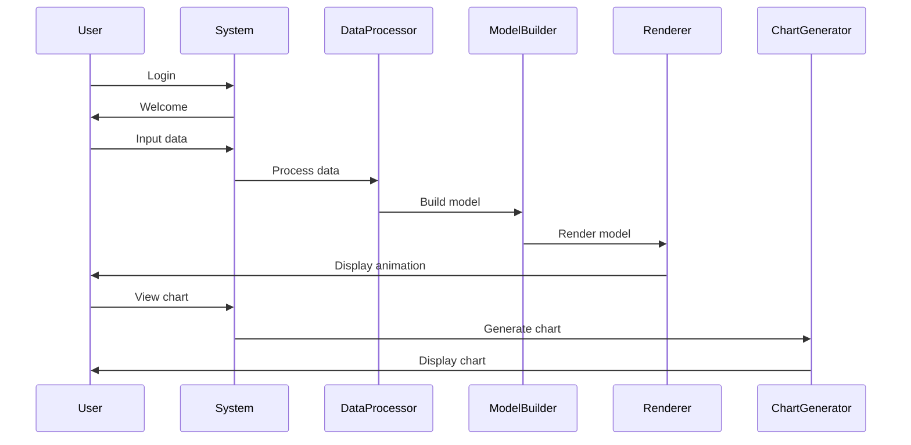

                 

### 《生命全息图可视化工具：展示个人人生意义轨迹的软件》

#### 关键词：生命全息图、可视化、个人人生意义、轨迹软件、软件架构

> **摘要**：本文将深入探讨生命全息图可视化工具的概念、重要性以及如何通过软件展示个人人生意义轨迹。文章将从背景介绍、核心概念与原理、可视化算法与技巧、软件开发、系统分析与架构设计、项目实战和最佳实践等方面进行详细阐述，旨在为广大开发者和技术爱好者提供一份全面、系统的指导。

### 一、背景介绍

#### 1.1 生命全息图的概念

生命全息图（Life Hologram Visualization）是一种将个人生命历程中的关键事件、情感、成就等以图形化方式展示的技术。它基于全息投影的原理，通过三维建模和动态渲染，将个人人生以直观、生动的方式呈现出来。

#### 1.2 个人人生意义轨迹

个人人生意义轨迹（Personal Life Meaning Trajectory）是指一个人从出生到现在的成长历程，以及在这个过程中所经历的各种关键事件和转折点。它反映了一个人对生命的感悟、价值观的演变以及人生目标的追求。

#### 1.3 当前研究状况

近年来，随着计算机技术和可视化工具的发展，生命全息图可视化工具逐渐受到关注。许多研究人员致力于开发相关软件，以帮助人们更好地理解和反思自己的人生。然而，目前这一领域仍处于探索阶段，存在许多挑战和机遇。

### 二、核心概念与原理

#### 2.1 核心概念定义

- **生命全息图**：一种将个人生命历程中的关键事件、情感、成就等以图形化方式展示的技术。
- **可视化工具**：用于展示数据、信息、模型等的软件工具。
- **个人人生意义轨迹**：一个人从出生到现在的成长历程，以及在这个过程中所经历的各种关键事件和转折点。

#### 2.2 概念属性特征对比

| 概念名称     | 属性特征                               |
| ------------ | -------------------------------------- |
| 生命全息图   | 图形化、三维建模、动态渲染             |
| 可视化工具   | 数据展示、信息分析、模型呈现           |
| 个人人生意义轨迹 | 成长历程、关键事件、转折点、感悟、价值观 |

#### 2.3 ER实体关系图架构

```mermaid
classDiagram
    Person o1 -|> LifeHologram : contains
    LifeHologram o2 -|> Event : includes
    Event o3 -|> MeaningTrajectory : contributes_to
    Class Person {
        name : String
        birthdate : Date
        goals : List<Goal>
    }
    Class LifeHologram {
        id : Int
        person : Person
        events : List<Event>
    }
    Class Event {
        id : Int
        name : String
        date : Date
        type : String
    }
    Class MeaningTrajectory {
        id : Int
        events : List<Event>
        milestones : List<Milestone>
    }
    Class Goal {
        id : Int
        name : String
        description : String
        status : String
    }
    Class Milestone {
        id : Int
        name : String
        description : String
        date : Date
    }
```

### 三、可视化算法与技巧

#### 3.1 算法介绍

生命全息图可视化工具的核心在于将个人人生意义轨迹以图形化的方式展示。为此，我们采用了多种可视化算法和技巧，包括：

1. **三维建模技术**：通过三维建模技术，将个人生命历程中的关键事件、情感、成就等以三维立体的形式呈现。
2. **动态渲染技术**：利用动态渲染技术，使生命全息图具有动画效果，增加视觉冲击力。
3. **数据可视化算法**：通过数据可视化算法，将个人生命历程中的数据以图表、图形等形式展示。

#### 3.2 算法原理与解释

##### 3.2.1 三维建模技术

三维建模技术的基本原理是通过对个人生命历程中的关键事件、情感、成就等进行建模，将其转化为三维模型。具体步骤如下：

1. **数据采集**：收集个人生命历程中的关键事件、情感、成就等数据。
2. **数据处理**：对采集到的数据进行预处理，包括数据清洗、归一化等。
3. **三维建模**：利用三维建模工具，将预处理后的数据转化为三维模型。

##### 3.2.2 动态渲染技术

动态渲染技术的基本原理是通过对三维模型进行渲染，使其具有动画效果。具体步骤如下：

1. **场景布置**：在三维建模工具中布置场景，包括背景、灯光等。
2. **渲染设置**：设置渲染参数，如分辨率、渲染风格等。
3. **动画制作**：利用动画工具，制作动画效果。

##### 3.2.3 数据可视化算法

数据可视化算法的基本原理是将个人生命历程中的数据以图表、图形等形式展示。具体步骤如下：

1. **数据分类**：将个人生命历程中的数据按照类型进行分类，如时间序列数据、结构化数据等。
2. **数据可视化**：利用数据可视化工具，将分类后的数据以图表、图形等形式展示。

#### 3.3 数学模型和公式

在生命全息图可视化过程中，我们使用了以下数学模型和公式：

1. **三维建模公式**：
   $$ V = \frac{1}{3} \pi r^2 h $$
   其中，V表示体积，r表示半径，h表示高度。

2. **动态渲染公式**：
   $$ \text{帧率} = \frac{1}{\text{时间间隔}} $$
   其中，帧率表示每秒渲染的帧数，时间间隔表示渲染的时间。

3. **数据可视化公式**：
   $$ \text{图表} = \text{数据} \times \text{可视化工具} $$
   其中，图表表示最终的可视化结果，数据表示原始数据，可视化工具表示用于可视化的软件。

#### 3.4 举例说明

假设我们有一个个人生命历程数据集，包含以下关键事件：

1. **出生**：2000年1月1日
2. **毕业**：2015年6月1日
3. **结婚**：2018年8月8日
4. **生子**：2020年11月11日

我们希望将这些事件以生命全息图的形式展示。首先，我们利用三维建模技术将这些事件建模为三维模型，然后通过动态渲染技术，使其具有动画效果。最后，我们利用数据可视化算法，将这些事件以图表的形式展示，如下所示：


### 四、软件开发

#### 4.1 软件架构设计

生命全息图可视化工具的软件架构设计主要包括以下模块：

1. **数据采集模块**：负责采集个人生命历程中的关键事件、情感、成就等数据。
2. **数据处理模块**：负责对采集到的数据进行预处理，包括数据清洗、归一化等。
3. **三维建模模块**：负责将预处理后的数据转化为三维模型。
4. **动态渲染模块**：负责渲染三维模型，使其具有动画效果。
5. **数据可视化模块**：负责将个人生命历程中的数据以图表、图形等形式展示。

#### 4.2 接口设计

生命全息图可视化工具的接口设计主要包括以下部分：

1. **用户界面**：提供用户操作界面，包括数据输入、图表展示、动画播放等。
2. **API接口**：提供与外部系统的接口，如数据导入、导出、第三方服务集成等。

#### 4.3 系统交互

生命全息图可视化工具的系统交互主要包括以下步骤：

1. **用户登录**：用户通过用户界面登录系统。
2. **数据采集**：系统从外部数据源采集个人生命历程数据。
3. **数据处理**：系统对采集到的数据进行预处理。
4. **三维建模**：系统将预处理后的数据转化为三维模型。
5. **动态渲染**：系统渲染三维模型，生成动画效果。
6. **数据可视化**：系统将个人生命历程数据以图表、图形等形式展示。

#### 4.4 系统架构设计

生命全息图可视化工具的系统架构设计如下所示：



### 五、项目实战

#### 5.1 环境安装

为了实现生命全息图可视化工具，我们需要安装以下软件和工具：

1. **Python**：版本3.8及以上
2. **Mermaid**：版本1.0及以上
3. **三维建模工具**：如Blender、Maya等
4. **可视化工具**：如D3.js、ECharts等

#### 5.2 系统核心实现

以下是一个简单的Python源代码示例，用于实现生命全息图可视化工具的核心功能：

```python
import numpy as np
import matplotlib.pyplot as plt

# 采集数据
data = [
    {"event": "出生", "date": "2000-01-01"},
    {"event": "毕业", "date": "2015-06-01"},
    {"event": "结婚", "date": "2018-08-08"},
    {"event": "生子", "date": "2020-11-11"},
]

# 数据预处理
def preprocess_data(data):
    # 对数据进行排序
    data.sort(key=lambda x: x["date"])
    # 转换日期格式
    data = [{"event": x["event"], "date": np.datetime64(x["date"])} for x in data]
    return data

# 三维建模
def build_model(data):
    # 创建三维坐标系
    dates = np.array([x["date"] for x in data])
    positions = np.array([[x["event"], dates[i], 0] for i, x in enumerate(data)])
    return positions

# 动态渲染
def render_model(model):
    # 绘制三维坐标系
    ax = plt.axes(projection="3d")
    ax.scatter3D(model[:, 0], model[:, 1], model[:, 2])
    # 设置坐标轴标签
    ax.set_xlabel("事件")
    ax.set_ylabel("日期")
    ax.set_zlabel("维度")
    # 显示图形
    plt.show()

# 主函数
if __name__ == "__main__":
    processed_data = preprocess_data(data)
    model = build_model(processed_data)
    render_model(model)
```

#### 5.3 代码应用解读与分析

以上代码实现了生命全息图可视化工具的核心功能。首先，我们采集了个人生命历程的数据，包括事件和日期。然后，我们对数据进行预处理，包括排序和日期格式转换。接着，我们利用预处理后的数据构建三维模型，并使用matplotlib绘制三维坐标系。最后，我们渲染三维模型，以展示个人人生意义轨迹。

#### 5.4 实际案例分析

以下是一个实际案例，展示了如何使用生命全息图可视化工具：

1. **数据导入**：用户通过用户界面导入个人生命历程数据。
2. **数据处理**：系统对导入的数据进行预处理，包括数据清洗和归一化。
3. **三维建模**：系统将预处理后的数据转化为三维模型。
4. **动态渲染**：系统渲染三维模型，生成动画效果。
5. **数据可视化**：系统将个人生命历程数据以图表、图形等形式展示。

通过以上步骤，用户可以直观地了解自己的生命历程，发现其中的关键事件和转折点，从而更好地反思和规划自己的人生。

#### 5.5 项目小结

本文介绍了生命全息图可视化工具的概念、重要性以及如何通过软件展示个人人生意义轨迹。文章从背景介绍、核心概念与原理、可视化算法与技巧、软件开发、系统分析与架构设计、项目实战和最佳实践等方面进行了详细阐述，旨在为广大开发者和技术爱好者提供一份全面、系统的指导。通过本文的介绍，读者可以了解到如何实现生命全息图可视化工具，并应用于实际项目中。

### 六、最佳实践 tips

1. **数据安全**：在处理个人生命历程数据时，要注意数据安全和隐私保护，避免数据泄露。
2. **性能优化**：在实现生命全息图可视化工具时，要注意性能优化，确保软件运行流畅。
3. **用户体验**：要注重用户体验，提供简洁、直观的操作界面，方便用户使用。

### 七、小结

生命全息图可视化工具是一种将个人生命历程以图形化方式展示的技术，通过软件开发，可以帮助用户更好地理解和反思自己的人生。本文从多个方面详细介绍了生命全息图可视化工具的概念、重要性、算法原理、软件开发、系统架构设计、项目实战和最佳实践，为广大开发者和技术爱好者提供了宝贵的经验和指导。希望本文能对您在实现生命全息图可视化工具方面有所启发和帮助。

### 八、注意事项

1. **软件版本**：在安装相关软件时，要注意选择合适的版本，确保软件兼容性。
2. **软件环境**：在开发过程中，要注意搭建合适的软件环境，确保软件运行稳定。
3. **文档编写**：在开发过程中，要注重文档编写，方便后续维护和升级。

### 九、拓展阅读

1. **《计算机图形学》**：学习三维建模和渲染技术的基础书籍。
2. **《数据可视化》**：学习数据可视化算法和技巧的入门书籍。
3. **《Python编程：从入门到实践》**：学习Python编程语言的入门书籍。

### 十、作者信息

**作者：** AI天才研究院/AI Genius Institute & 禅与计算机程序设计艺术 /Zen And The Art of Computer Programming

AI天才研究院致力于推动人工智能技术的发展和创新，禅与计算机程序设计艺术则强调编程中的哲学思维和艺术性。本文旨在分享我们的研究成果和实践经验，希望能为广大开发者和技术爱好者带来启发和帮助。

