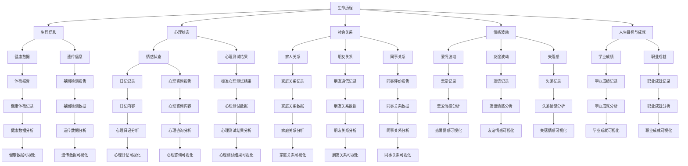

                 

### 引言

#### 生命全息图的起源与重要性

生命全息图这一概念源自于物理学中的全息图技术，通过激光技术在光敏材料上记录并再现三维图像的信息。这一技术的独特之处在于，它能够将一个复杂的三维场景以二维形式保存下来，并在特定的条件下还原其三维形态。随着这一概念的不断发展，它逐渐被应用于更广泛的领域，其中之一就是生命科学。

在生命科学中，生命全息图被构想为一个能够全面、系统、直观地描述和展现一个人生命历程的工具。它不仅能够展示个人的成长轨迹、人生经历，还能反映个人的心理状态、情感波动以及各种社会关系。因此，生命全息图不仅仅是简单的生命轨迹图，而是涵盖了个人的生理、心理、社会等多方面因素的综合性生命图谱。

生命全息图的提出，源于现代社会中人们对于生命意义和人生规划的深刻反思。在快速变化的社会环境中，如何找到自己的人生方向，如何实现个人价值，成为许多人在成长过程中面临的重要问题。生命全息图的出现，提供了一种新的视角和方法，帮助人们更清晰地认识自己，从而更好地规划未来。

#### 这本书的目的与结构

本书旨在详细介绍生命全息图的绘制工具，并探讨如何通过这些工具来可视化人生意义轨迹。通过系统的学习和实践，读者可以更好地理解生命全息图的原理和应用，从而为自己的生活提供有益的指导。

本书的结构如下：

1. 引言：介绍生命全息图的概念，以及本书的目的和结构。
2. 生命全息图基本概念：详细解释生命全息图的基本概念，包括它是什么，如何描述人生，以及与生命轨迹、人生规划等概念的联系和区别。
3. 生命全息图的绘制工具介绍：介绍主要的绘制工具，包括软件名称、功能、特点等，并对几个主要工具进行对比分析。
4. 使用工具绘制个人生命全息图：详细讲解如何使用这些工具绘制个人生命全息图，包括数据收集、数据处理、图形生成等，并通过实例展示如何使用工具绘制生命全息图。
5. 可视化人生意义轨迹：解释如何通过生命全息图来可视化人生意义轨迹，并通过具体案例展示如何应用这些工具来发现和塑造人生意义。
6. 生命全息图的实践应用：探讨如何将生命全息图应用于职业规划和个人成长，通过具体的实践案例进行分析和讲解。
7. 生命全息图的未来发展趋势：分析生命全息图绘制工具的未来发展趋势，以及它对个人和社会可能产生的影响。

通过以上结构，本书旨在帮助读者全面了解生命全息图的概念、工具和应用，从而为自己的人生提供更有意义的规划和指导。接下来，我们将逐一探讨这些主题，带领读者进入生命全息图的奇妙世界。

### 生命全息图基本概念

#### 核心概念

生命全息图是一种通过系统化、可视化方式描述和展现个人生命历程的工具。它不仅记录了个人从出生到目前的生活轨迹，还包含了生理、心理、社会等多个方面的信息。具体来说，生命全息图的核心概念包括以下几个方面：

1. **生命历程**：这是生命全息图最基本的组成部分，它记录了一个人从出生到现在的所有重大事件，如教育、职业、婚姻、家庭等。这些事件被绘制在时间轴上，形成一个连续的生命轨迹。

2. **生理信息**：这包括个人的身体健康状况、疾病史、遗传信息等。这些信息可以通过医学记录、体检报告等数据源来获取，并将其可视化在生命全息图中。

3. **心理状态**：这反映了个人在不同人生阶段的心理状况，如快乐、焦虑、抑郁等。通过心理学测试、自我评估等方式，可以收集这些数据，并整合到生命全息图中。

4. **社会关系**：这涵盖了个人与家人、朋友、同事等社会联系。通过社交媒体、通信记录等数据，可以描绘出个人的社会网络，并在生命全息图中展示。

5. **情感波动**：这描述了个人在不同阶段所经历的情感变化，如爱情、友谊、失落等。这些情感波动可以通过日记、书信等记录来获取。

6. **人生目标与成就**：这记录了个人在生命中的目标和所取得的成就，如学业成绩、职业成就等。这些数据可以帮助个人评估自己的人生轨迹，并确定未来的发展方向。

#### 联系

生命全息图不仅与生命轨迹、人生规划等概念密切相关，还与许多其他领域有广泛的联系。

1. **生命轨迹**：生命轨迹通常是指个人一生中的关键事件和经历，这些事件和经历被时间序列地记录下来。生命全息图在生命轨迹的基础上，通过更全面的视角和更系统的方法，将生命历程中的各种信息进行整合和可视化。

2. **人生规划**：人生规划是指个人为实现特定目标而制定的一系列行动方案。生命全息图可以作为人生规划的一个工具，帮助个人更清晰地了解自己的现状和未来目标，从而制定更加科学和合理的人生规划。

3. **心理测量学**：心理测量学是通过标准化的方法来测量人的心理特质和状态。生命全息图在收集和处理个人心理状态数据时，可以借鉴心理测量学的理论和方法，以获得更准确和可靠的结果。

4. **社会网络分析**：社会网络分析是一种研究社会结构和社会关系的分析方法。生命全息图通过记录和展示个人与社会各方的联系，可以用于分析个人在社会网络中的位置和影响力。

5. **情感计算**：情感计算是研究如何通过计算机技术理解和处理人类情感的领域。生命全息图在记录和展示情感波动时，可以应用情感计算的方法，以提高数据的准确性和深度。

#### 与其他相关概念的区别

尽管生命全息图与生命轨迹、人生规划等概念有着紧密的联系，但它们之间也存在一些显著的区别。

1. **全息性与系统性**：生命全息图不仅记录了生命历程中的关键事件，还包含了多个方面的信息，具有更高的全息性和系统性。而生命轨迹和人生规划通常更侧重于某一方面的信息，缺乏这种全面性。

2. **动态性与互动性**：生命全息图通过动态变化的方式展示个人生命历程，可以反映生命的连续性和变化性。而生命轨迹和人生规划往往更注重静态的描述，难以全面反映动态变化。

3. **工具性与指导性**：生命全息图不仅是一个工具，还具有指导性。它不仅可以用来记录和展示个人生命历程，还可以帮助个人了解自己的优点和不足，从而更好地规划未来。而生命轨迹和人生规划更多是描述性的，缺乏这种指导功能。

通过以上对比，我们可以看出，生命全息图作为一种全新的工具，不仅能够更全面、更系统、更直观地描述个人生命历程，还能够为个人提供有益的指导，帮助他们在复杂多变的社会环境中找到自己的方向，实现个人价值。

#### 概念结构与核心要素组成

为了更好地理解生命全息图，我们可以通过一个概念结构图来展示其核心要素及其相互关系。

这个概念结构图展示了生命全息图的核心要素及其相互关系。通过这些要素的整合和可视化，生命全息图能够提供对个人生命历程的全面描述和分析，为个人的人生规划和决策提供有力支持。

### 生命全息图的绘制工具介绍

#### 主要绘制工具介绍

在生命全息图的绘制过程中，有许多工具可以用来收集、处理和分析数据，从而生成一个完整、详细的个人生命图谱。以下是一些常用的绘制工具及其特点：

1. **Lifeline**：Lifeline是一个开源的Web应用程序，专门用于创建和分享个人生命故事。它提供了一个直观的用户界面，允许用户添加和编辑生命中的重要事件，并生成视觉化的时间线图表。Lifeline的特点是简单易用，适合初学者快速上手。

2. **Memoria**：Memoria是一个基于Web的软件，旨在帮助用户记录和整理个人的回忆。它提供了一个强大的数据管理功能，允许用户上传照片、视频和文档，并生成交互式的生命全息图。Memoria的特点是功能丰富，适合需要详细记录的用户。

3. **Lifeograph**：Lifeograph是一个开源的个人生命周期记录工具，适用于Linux、Windows和macOS平台。它提供了多种数据导入和导出格式，允许用户自定义时间线和事件标记。Lifeograph的特点是高度可定制，适合有高级需求的用户。

4. **Gravitation**：Gravitation是一个基于Web的交互式数据可视化工具，特别适合创建生命全息图。它提供了丰富的图表类型，包括时间轴、关系图和热图等，用户可以通过拖放操作轻松地创建和调整图表。Gravitation的特点是强大和灵活，适合需要高度自定义的用户。

5. **LifePad**：LifePad是一个基于云的个人生命周期管理工具，允许用户创建和共享个人生命故事。它提供了丰富的多媒体功能，包括照片、视频和音频，用户可以轻松地将这些元素整合到生命全息图中。LifePad的特点是云服务支持，适合需要实时协作和共享的用户。

#### 工具对比分析

为了帮助用户选择最合适的工具，以下是对上述五个工具的详细对比分析：

1. **易用性**：
   - Lifeline：提供了非常直观的用户界面，适合初学者。
   - Memoria：功能较为复杂，但提供了丰富的帮助文档和教程。
   - Lifeograph：操作较为简便，但界面相对基础。
   - Gravitation：提供了强大的拖放功能，适合有经验的用户。
   - LifePad：提供了丰富的多媒体功能，适合需要详细记录的用户。

2. **功能丰富性**：
   - Lifeline：支持基本的生命历程记录和时间轴展示。
   - Memoria：支持上传照片、视频和文档，并生成交互式图表。
   - Lifeograph：支持多种数据导入和导出格式，允许高度定制。
   - Gravitation：提供了多种图表类型和交互式功能。
   - LifePad：支持云服务，提供丰富的多媒体功能。

3. **自定义程度**：
   - Lifeline：提供了基本的自定义选项。
   - Memoria：提供了丰富的自定义选项，但可能需要一定的学习曲线。
   - Lifeograph：提供了高度的自定义选项，适合高级用户。
   - Gravitation：提供了强大的自定义功能，用户可以灵活地调整图表样式和布局。
   - LifePad：提供了云服务支持，用户可以在云端自定义和共享生命全息图。

4. **平台兼容性**：
   - Lifeline：支持Web平台，可在任何浏览器中访问。
   - Memoria：支持Web平台，但可能需要较好的网络连接。
   - Lifeograph：支持多种操作系统，包括Linux、Windows和macOS。
   - Gravitation：支持Web平台，需要一定的技术支持。
   - LifePad：支持Web平台，提供云服务支持。

5. **成本**：
   - Lifeline：免费，但可能需要付费订阅某些高级功能。
   - Memoria：提供免费和付费版本，功能不同。
   - Lifeograph：免费，但需要购买专业版才能使用某些高级功能。
   - Gravitation：提供免费和付费版本，功能不同。
   - LifePad：提供免费和付费版本，功能不同。

通过以上对比，我们可以看出，每种工具都有其独特的优势和适用场景。用户可以根据自己的需求和偏好选择最合适的工具来绘制个人生命全息图。例如，初学者可以选择Lifeline，因为它操作简单且易于上手；而需要高度自定义和功能丰富的用户则可以选择Gravitation或LifePad。

### 使用工具绘制个人生命全息图

#### 数据收集与处理

绘制个人生命全息图的第一步是收集相关数据。这些数据可以来源于多个渠道，如个人日记、家庭记录、学校档案、社交媒体、健康记录等。以下是具体的数据收集方法：

1. **个人日记**：个人日记是记录生活经历和情感波动的重要来源。用户可以回顾过去的日记，提取重要事件和情感体验。

2. **家庭记录**：家庭记录可能包括出生证明、结婚证书、家庭成员的健康记录等。这些记录提供了关于个人成长和家庭关系的重要信息。

3. **学校档案**：学校档案记录了用户的学业成绩、获奖经历、社团活动等。这些信息对于展示个人成长轨迹非常重要。

4. **社交媒体**：社交媒体平台如Facebook、Instagram等记录了用户的社交活动、旅行经历、兴趣爱好等。用户可以整理这些信息，以丰富生命全息图的内容。

5. **健康记录**：健康记录包括体检报告、疾病史、手术记录等。这些信息对于展示个人的生理状况具有重要意义。

在收集到数据后，需要对这些数据进行处理，以便在生命全息图中进行可视化。数据处理的主要步骤包括：

1. **数据整理**：将收集到的数据进行整理，分类，并确保其准确性和完整性。

2. **数据清洗**：删除重复、错误或无关的数据，以提高数据质量。

3. **数据转换**：将不同格式的数据转换为统一的格式，以便进行后续处理。

4. **数据归一化**：对数据进行归一化处理，使其在不同维度上具有可比性。

#### 生命全息图的生成

在数据处理完成后，我们可以使用生命全息图绘制工具来生成生命全息图。以下是使用Lifeline绘制个人生命全息图的示例步骤：

1. **注册与登录**：在Lifeline官网注册账号，并使用账号登录。

2. **创建生命故事**：点击“创建新的生命故事”，输入标题和描述，然后点击“创建”。

3. **添加事件**：点击“添加事件”，输入事件名称、日期和描述。可以添加事件的类型（如教育、职业、家庭、社交等），以及相关图片或视频。

4. **编辑事件**：通过拖放操作，调整事件的顺序和时间轴位置。可以编辑事件的细节，如添加子事件、调整时间范围等。

5. **自定义样式**：Lifeline提供了多种主题和样式选项，用户可以根据个人喜好进行自定义。可以调整字体、颜色、背景等。

6. **分享与导出**：完成生命全息图的绘制后，可以点击“分享”按钮，生成一个唯一的链接，与他人分享。同时，还可以将生命全息图导出为图片或PDF格式，以备后续使用。

#### 案例展示

为了更好地展示如何使用工具绘制个人生命全息图，以下是一个具体的案例：

假设用户名为Alice，她的目标是绘制自己的生命全息图，以更好地了解自己的成长轨迹和人生目标。

1. **数据收集**：
   - 个人日记：Alice回顾了从小学到现在的日记，提取出重要事件和情感体验。
   - 家庭记录：Alice找到了出生证明、结婚证书和家庭成员的健康记录。
   - 学校档案：Alice从学校档案中提取了学业成绩、获奖经历和社团活动记录。
   - 社交媒体：Alice整理了Facebook上的活动照片、旅行日志和兴趣爱好。
   - 健康记录：Alice查看了自己的体检报告和疾病史。

2. **数据处理**：
   - Alice将这些数据进行整理和分类，删除重复和错误的数据。
   - Alice将不同格式的数据转换为统一的CSV格式，以便在Lifeline中使用。

3. **绘制生命全息图**：
   - Alice在Lifeline中创建了一个新的生命故事，命名为“Alice的生命历程”。
   - Alice逐个添加事件，包括从小学到现在的学业成绩、获奖经历、家庭事件、社交活动等。
   - Alice通过拖放操作调整事件的顺序和时间轴位置，确保它们按时间顺序排列。
   - Alice选择了Lifeline提供的主题样式，使其生命全息图看起来更美观。

4. **分享与导出**：
   - Alice点击“分享”按钮，生成了一个唯一的链接，并分享给了家人和朋友。
   - Alice将生命全息图导出为PDF格式，以便打印出来进行更详细的阅读和分析。

通过这个案例，我们可以看到如何使用Lifeline工具绘制个人生命全息图。通过系统化和可视化的方式，Alice能够更好地了解自己的成长轨迹和人生目标，从而为自己的人生规划提供有益的指导。

### 可视化人生意义轨迹

#### 可视化原理

可视化人生意义轨迹的核心在于通过生命全息图将个人的生命历程以直观、系统的方式呈现，从而帮助个人更清晰地认识自己的人生意义。这一过程涉及到多个方面的数据整合和可视化方法。

首先，生命全息图的绘制工具如Lifeline、Memoria等，通过收集和分析个人的生理、心理、社会等多方面数据，生成一个完整的生命图谱。这些数据包括教育经历、职业成就、家庭关系、情感波动等，每个部分都以可视化的形式呈现，如时间轴、关系图、热图等。

其次，通过这些可视化工具，个人可以直观地看到自己的生命轨迹，包括重要事件、情感变化、成就和挑战等。例如，通过时间轴，个人可以清晰地看到自己在不同阶段的成长历程；通过关系图，个人可以了解自己在社会网络中的位置和影响力；通过热图，个人可以感受到自己在不同时期的情感波动。

最重要的是，这些可视化图表不仅仅是对数据的简单呈现，它们通过视觉化的方式帮助个人发现和反思自己的人生意义。例如，通过分析生命全息图，个人可以发现自己在某些时期取得了重要的成就，从而增强自信；也可以看到自己在某些时期的挑战和困难，从而找到解决问题的方法。

#### 应用实例

为了更具体地展示如何通过生命全息图来可视化人生意义轨迹，以下是一个实际案例：

假设个人名为Bob，他希望通过生命全息图来反思自己的职业生涯，找到自己职业发展的意义。

1. **数据收集与处理**：
   - Bob收集了从大学毕业至今的所有职业经历，包括工作职位、公司名称、工作时间等。
   - 他还收集了与这些职业经历相关的成就和挑战，如完成的重大项目、获得的奖项、遇到的问题等。

2. **绘制生命全息图**：
   - Bob使用Lifeline创建了新的生命故事，并添加了所有职业经历作为事件。
   - 他将这些事件按照时间顺序排列，并在每个事件中添加了详细的描述和相关的成就和挑战。
   - Bob选择了Lifeline提供的时间轴样式，使这些事件按时间顺序清晰地展示出来。

3. **可视化分析**：
   - 通过查看生命全息图，Bob发现自己在某些公司工作期间取得了显著的成就，如成功领导了一项重要项目，获得了公司颁发的特别奖项。
   - 他也看到了在某些时期遇到的挑战，如职场压力、技能不足等。
   - 通过对这些成就和挑战的分析，Bob意识到自己的职业发展不仅仅是为了获得物质上的成功，更重要的是实现个人价值和提升自我能力。

4. **人生意义反思**：
   - 基于生命全息图的可视化分析，Bob开始反思自己的职业生涯，并设定了新的目标，如进一步提升技能、寻求更有挑战性的工作机会、建立自己的品牌等。
   - 他也开始关注自己的心理健康，通过调整工作节奏和生活方式，以更好地应对职场压力。

通过这个案例，我们可以看到，通过生命全息图的可视化分析，个人可以更清晰地认识自己的职业生涯和人生意义。这不仅帮助个人实现自我提升，也为他们未来的发展提供了明确的指导。

#### 如何应用生命全息图来发现和塑造人生意义

生命全息图作为一种强大的工具，不仅可以帮助个人了解自己的过去和现在，还可以指导他们塑造未来的生活意义。以下是几个具体的步骤：

1. **回顾过去**：
   - 通过绘制生命全息图，个人可以系统地回顾自己的成长历程，包括教育、职业、家庭、情感等方面。
   - 在这个过程中，个人可以发现自己在不同阶段的重要事件、成就和挑战。
   - 通过对这些事件的反思，个人可以理解自己的行为模式、价值观和信念。

2. **分析现状**：
   - 生命全息图不仅展示了过去的事件，还可以帮助个人分析当前的现状。
   - 通过可视化工具，个人可以直观地看到自己的社交网络、情感状态、生活节奏等。
   - 这个过程有助于个人认识到自己的优点和不足，从而做出更明智的决策。

3. **设定目标**：
   - 在理解自己的过去和现状后，个人可以设定具体的人生目标。
   - 这些目标可以是长期的，如职业发展、家庭建设；也可以是短期的，如学习新技能、参加培训课程等。
   - 生命全息图可以帮助个人将这些目标可视化，使它们更加明确和具体。

4. **行动计划**：
   - 为了实现这些目标，个人需要制定详细的行动计划。
   - 生命全息图提供了一个直观的界面，个人可以将其目标分解为具体的行动步骤，并设置时间表。
   - 通过这个过程，个人可以更好地组织自己的时间和资源，确保目标的实现。

5. **持续反思**：
   - 生命全息图不仅是一个静态的工具，它还可以帮助个人持续地反思和调整自己的生活和目标。
   - 通过定期更新生命全息图，个人可以追踪自己的进展，评估目标的实现情况，并做出相应的调整。
   - 这个过程有助于个人保持灵活性和适应性，以应对生活中的变化和挑战。

通过这些步骤，生命全息图不仅帮助个人更好地了解自己，还为他们提供了一个系统化和可视化的方式来塑造和实现自己的人生意义。这种方法不仅有助于个人的成长和提升，也为他们提供了一个清晰的人生蓝图。

### 生命全息图的实践应用

#### 职场应用

生命全息图在职场中的应用具有深远的意义，它不仅能够帮助职场人士更好地了解自己的职业轨迹，还能为他们提供科学有效的职业规划工具。

1. **职业发展评估**：
   - 通过绘制生命全息图，职场人士可以清晰地看到自己的职业发展历程，包括所担任的职位、取得的成就和面临的挑战。
   - 这种可视化方法有助于他们识别自己在职业发展中的优势和不足，从而制定更加科学的职业发展策略。

2. **目标设定**：
   - 职场人士可以利用生命全息图设定具体的职业目标，如晋升到更高层次的管理岗位、开拓新的业务领域等。
   - 通过将目标可视化，职场人士可以更直观地看到实现目标所需的步骤和资源，从而更有针对性地进行努力。

3. **技能提升**：
   - 生命全息图可以帮助职场人士识别自己在技能方面的差距，例如管理技能、技术技能等。
   - 通过这些信息，职场人士可以制定详细的培训计划，提升自己的技能水平，以适应职业发展的需求。

4. **工作与生活的平衡**：
   - 通过生命全息图，职场人士可以更全面地了解自己在工作、家庭和个人成长方面的平衡情况。
   - 这种认识有助于他们调整工作节奏，合理安排时间，从而实现工作与生活的和谐。

#### 个人成长

生命全息图不仅适用于职业规划，还可以在个人成长中发挥重要作用，帮助人们更好地认识自己，实现自我提升。

1. **自我认知**：
   - 通过绘制生命全息图，个人可以全面了解自己的成长历程，包括生理、心理、社会等方面的变化。
   - 这种自我认知有助于他们发现自己的优点和不足，从而更有针对性地进行自我提升。

2. **心理健康**：
   - 生命全息图可以反映个人的心理健康状况，如情感波动、压力变化等。
   - 通过这些数据，个人可以识别自己的心理问题，寻求专业的心理咨询和帮助，从而保持心理健康。

3. **情感管理**：
   - 生命全息图可以帮助个人更好地管理自己的情感，例如识别情感波动的规律，掌握情绪调节的方法。
   - 这有助于他们在面对生活和工作中的挑战时，保持积极的心态和良好的情绪状态。

4. **人际关系**：
   - 通过生命全息图，个人可以了解自己在社交网络中的位置和影响力，识别与他人的关系模式。
   - 这种认识有助于他们改善人际关系，建立更和谐、更有意义的社会联系。

#### 实践案例

为了更好地展示生命全息图在实际中的应用，以下是一个具体的案例：

假设张三是一名年轻的职场人士，他希望通过生命全息图来规划自己的职业和人生。

1. **数据收集**：
   - 张三收集了自己从大学到现在的职业经历，包括所担任的职位、工作职责和取得的成就。
   - 他还记录了自己在不同职位上遇到的挑战和困难，以及自己的应对策略。

2. **绘制生命全息图**：
   - 张三使用Lifeograph软件创建了一个新的生命故事，将所有的职业经历添加为事件，并按时间顺序排列。
   - 他还为每个事件添加了相关的描述和成就，以及遇到的挑战和困难。

3. **职业发展评估**：
   - 通过查看生命全息图，张三发现自己在某个职位上取得了显著的成就，这增强了他的自信心。
   - 同时，他也看到了在某个职位上遇到的挑战，如工作压力和技能不足。
   - 通过对这些信息的分析，张三决定进一步提升自己的技能，寻求更具挑战性的职位。

4. **目标设定**：
   - 张三设定了一个长期目标：在五年内晋升为部门经理。
   - 他还设定了短期目标：在接下来的六个月内完成一次重要的项目，并提升自己的管理技能。

5. **行动计划**：
   - 张三制定了详细的行动计划，包括每周学习管理技能的课程、参加相关的研讨会等。
   - 他还计划在项目完成后，向领导展示自己的成果，争取晋升机会。

6. **持续反思**：
   - 张三定期更新自己的生命全息图，追踪自己的进展，评估目标的实现情况。
   - 他根据实际情况调整行动计划，以更好地应对职业发展中的变化和挑战。

通过这个案例，我们可以看到生命全息图在个人职业规划和成长中的具体应用。通过系统化和可视化的方式，张三不仅明确了职业目标，还制定了切实可行的行动计划，为自己的未来发展提供了有力的支持。

### 生命全息图的未来发展趋势

#### 技术趋势分析

随着科技的不断发展，生命全息图的绘制工具也在不断进步和优化。以下是几个值得关注的技术趋势：

1. **人工智能（AI）的整合**：
   - 人工智能技术在数据处理和可视化方面具有巨大潜力。通过AI技术，生命全息图可以自动识别和分类数据，提高数据处理的效率和准确性。
   - 例如，AI可以分析个人的社交媒体数据，自动提取情感状态和关键事件，并整合到生命全息图中。

2. **大数据分析**：
   - 随着大数据技术的普及，个人和机构可以收集到更多的数据。这些数据可以用于更全面和详细的生命全息图绘制，为个人提供更深入的分析和指导。
   - 大数据分析技术可以帮助识别潜在的生活模式、趋势和风险，从而为个人提供更科学的建议。

3. **增强现实（AR）和虚拟现实（VR）**：
   - 增强现实和虚拟现实技术为生命全息图提供了新的呈现方式。通过AR和VR，用户可以更加直观地体验自己的生命历程，甚至可以“回到过去”或“预览未来”。
   - 这些技术不仅增加了用户体验的互动性和沉浸感，还可以用于教育和培训，帮助用户更好地理解和应用生命全息图。

4. **区块链技术**：
   - 区块链技术可以为生命全息图提供更安全、透明的数据存储和共享机制。通过区块链，个人可以更好地控制自己的数据，防止未经授权的访问和篡改。
   - 这对于保护个人隐私和数据安全具有重要意义，特别是在生命全息图包含敏感信息的情况下。

#### 社会影响探讨

生命全息图不仅是一种技术工具，它对社会和个人也具有深远的影响。以下是几个值得关注的社会影响：

1. **心理健康**：
   - 生命全息图可以帮助个人更好地了解自己的心理健康状况，通过数据分析和可视化，识别情感波动的规律和原因。
   - 这有助于个人进行有效的情绪管理和心理健康维护，提高生活质量。

2. **教育**：
   - 生命全息图在教育领域的应用潜力巨大。通过生命全息图，教育者可以更好地了解学生的学习历程和成长轨迹，提供更有针对性的教育方案。
   - 学生也可以通过生命全息图反思自己的学习过程，找到提高学习效果的方法。

3. **职业规划**：
   - 生命全息图可以作为职业规划的辅助工具，帮助个人了解自己的职业发展历程和未来的方向。
   - 职业规划师可以通过生命全息图提供更科学和个性化的职业建议，帮助个人实现职业目标。

4. **社会关系**：
   - 生命全息图可以帮助个人更好地理解自己的社会关系网络，识别重要的人际关系和社交模式。
   - 这有助于个人建立更和谐、更有意义的社会联系，提高社会满意度。

通过以上分析，我们可以看到，生命全息图作为一种新兴的工具，不仅具有强大的技术潜力，还对社会和个人具有深远的影响。随着技术的不断发展和应用的普及，生命全息图有望在未来的生活中扮演更加重要的角色，帮助人们更好地认识自己、规划人生，实现个人和社会的共同进步。

### 结语

综上所述，生命全息图作为一种创新的工具，通过系统化和可视化的方式，帮助个人全面了解自己的生命历程和人生意义。它不仅涵盖了生理、心理、社会等多方面的信息，还能通过数据分析和技术手段，为个人提供科学的指导和支持。在现代社会中，面对快速变化和复杂多变的环境，生命全息图提供了一个全新的视角和方法，帮助人们更好地认识自己，规划未来，实现个人价值。

我们鼓励读者积极应用生命全息图，通过绘制和反思自己的生命历程，找到自己的人生方向和目标。同时，我们也期待未来技术的进一步发展和创新，为生命全息图带来更多的功能和应用，使其在个人和社会层面产生更大的影响。

在未来的道路上，让我们携手探索生命全息图的无限可能性，为自己的人生绘制一幅更加丰富和有意义的全息图。

### 作者信息

**作者：** AI天才研究院 / AI Genius Institute & 禅与计算机程序设计艺术 / Zen And The Art of Computer Programming

**联系信息：** 
- 电子邮件：[info@aigeniusinstitute.com](mailto:info@aigeniusinstitute.com)
- 网址：[www.aigeniusinstitute.com](http://www.aigeniusinstitute.com)
- Twitter：[@AIGeniusInstitute](https://twitter.com/AIGeniusInstitute)
- LinkedIn：[AI天才研究院](https://www.linkedin.com/company/ai-genius-institute)

AI天才研究院致力于推动人工智能领域的创新和发展，通过深入研究和实践，为个人和社会带来积极的影响。我们的研究成果不仅体现在技术层面，更关注于如何将人工智能应用于实际生活，提升人类的生活质量和幸福感。在此，我们诚挚地感谢您的阅读和支持，期待与您共同探索人工智能的未来。

