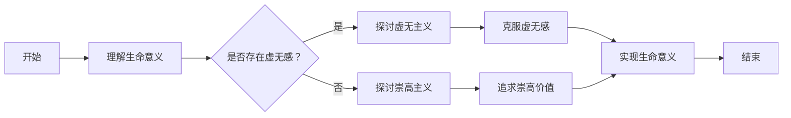
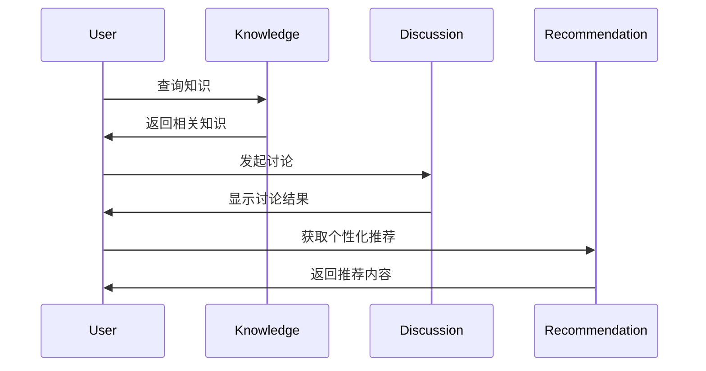
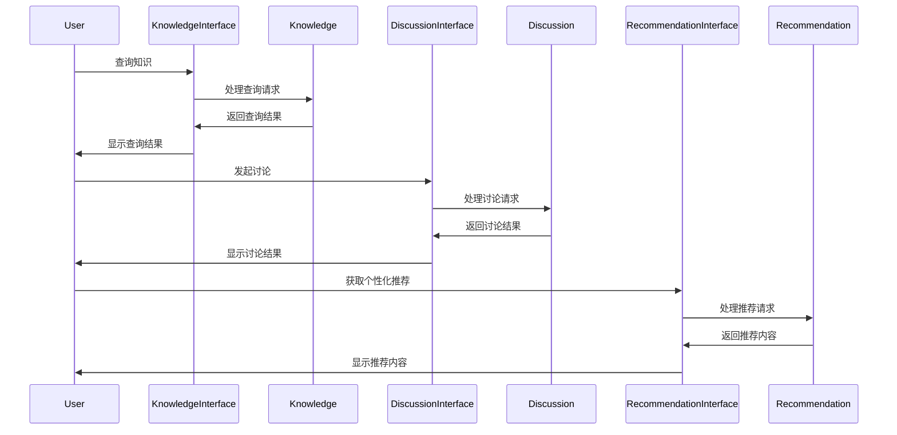

                 

# 生命意义的哲学探讨：在虚无与崇高之间

## 关键词：生命意义、虚无主义、崇高主义、哲学探讨、个人旅程、社区建设、未来研究方向

## 摘要

本文从哲学的视角，探讨了生命意义的本质及其在虚无与崇高之间的辩证关系。通过对虚无主义和崇高主义的深入分析，本文揭示了生命意义在个体和社会层面的多重探索。文章首先梳理了生命意义哲学探讨的背景和必要性，然后分别探讨了虚无主义的历史、影响以及批判与超越，以及崇高主义的概念、历史和核心价值观。在最后两部分，本文探讨了虚无与崇高的互动与转化，以及生命意义的实践探索。通过这些探讨，本文旨在为读者提供一种更加全面和深刻的生命意义理解。

## 目录大纲

### 第一部分：问题的背景与引言

#### 第1章：探讨生命意义的哲学基础

1.1 问题的提出

1.1.1 生命的本质与意义

1.1.2 生命意义的多元视角

1.2 哲学探讨的必要性

1.2.1 哲学在生命意义探讨中的角色

1.2.2 哲学探讨的挑战与价值

1.3 虚无与崇高的辩证关系

1.3.1 虚无的哲学含义

1.3.2 崇高的哲学含义

1.3.3 虚无与崇高的相互关系

#### 第2章：虚无主义及其影响

2.1 虚无主义的历史与哲学根源

2.1.1 虚无主义的理论框架

2.1.2 虚无主义的重要代表人物

2.2 虚无主义对社会和个人的影响

2.2.1 虚无主义对个人价值观的冲击

2.2.2 虚无主义对社会文化的反思

2.3 虚无主义的批判与超越

2.3.1 对虚无主义的批判

2.3.2 超越虚无主义的路径探索

### 第二部分：崇高主义的哲学探讨

#### 第3章：崇高的概念与特征

3.1 崇高的定义与本质

3.1.1 崇高的多元理解

3.1.2 崇高的基本特征

3.2 崇高主义的历史与哲学根源

3.2.1 崇高主义的理论框架

3.2.2 崇高主义的重要代表人物

3.3 崇高主义的核心价值观

3.3.1 崇高主义对人类存在的价值定位

3.3.2 崇高主义对个人发展的启示

#### 第4章：虚无与崇高的互动与转化

4.1 虚无与崇高的辩证关系

4.1.1 虚无与崇高的相互依存

4.1.2 虚无与崇高的相互转化

4.2 生命意义在虚无与崇高之间的探索

4.2.1 在虚无中寻找崇高

4.2.2 在崇高中发现虚无

4.3 跨越虚无与崇高的障碍

4.3.1 克服虚无主义的困境

4.3.2 追求崇高的意义

### 第三部分：生命意义的实践探索

#### 第5章：从虚无到崇高的个人旅程

5.1 走出虚无的阴影

5.1.1 意识到虚无的存在

5.1.2 接受虚无的现实

5.1.3 培养积极的生活态度

5.2 发现崇高的价值

5.2.1 寻找崇高的对象

5.2.2 实现个人与崇高的共鸣

5.2.3 在崇高中发现生命的意义

#### 第6章：崇高主义的社区与文化建设

6.1 崇高主义的社区建设

6.1.1 崇高主义社区的核心价值

6.1.2 崇高主义社区的组织结构

6.1.3 崇高主义社区的活动策划与实施

6.2 崇高主义的文化建设

6.2.1 崇高主义文化的传播与推广

6.2.2 崇高主义文化的创新与发展

6.2.3 崇高主义文化的反思与批判

#### 第7章：生命意义的哲学探讨总结

7.1 虚无与崇高的双重探索

7.1.1 虚无与崇高的辩证关系回顾

7.1.2 虚无与崇高在生命意义探讨中的重要性

7.2 未来的研究方向

7.2.1 虚无主义与崇高主义的进一步探讨

7.2.2 生命意义在现代社会中的应用与实践

7.2.3 生命意义探讨的多学科交叉研究

## 第一部分：问题的背景与引言

### 第1章：探讨生命意义的哲学基础

#### 1.1 问题的提出

在现代社会，随着科技的高速发展，人们的生活方式发生了翻天覆地的变化。然而，在这种变化中，许多人都开始质疑生命的意义。人们可能会问：我们存在的意义是什么？我们为何而生？这些问题不仅仅是哲学问题，更是每个人都需要面对的人生问题。

首先，我们需要了解生命的本质。生命是一种自然现象，是生物体存在的状态。然而，从哲学的角度来看，生命的本质远不止于此。生命不仅仅是一种生物学现象，更是一种哲学现象。它涉及到存在的意义、目的和价值等问题。

#### 1.1.1 生命的本质与意义

生命的本质是存在的。存在是哲学中最基本的概念，它涉及到存在的方式、状态和本质等问题。从哲学的角度来看，生命的本质是存在的，但这种存在并不是一种静止的存在，而是一种动态的存在。生命的存在是一种持续的变化和成长。

那么，生命的意义是什么呢？生命的意义是一个复杂的问题，它涉及到人类的存在、价值、目的等问题。从不同的角度来看，生命的意义也是不同的。

首先，从生物学的角度来看，生命的意义在于维持物种的生存和繁衍。从这个角度来看，生命的意义是生物学上的，是一种自然选择的结果。

其次，从心理学的角度来看，生命的意义在于个体的自我实现和成长。这个观点认为，每个人都有自己的潜能和目标，生命的意义在于实现这些潜能和目标。

最后，从哲学的角度来看，生命的意义在于寻求真理、美和善。这个观点认为，生命是一个不断探索真理、追求美和实现善的过程。

#### 1.1.2 生命意义的多元视角

生命意义的探讨涉及到多个学科领域，如生物学、心理学、哲学等。每个学科都有自己独特的视角和方法来探讨这个问题。

生物学的视角主要集中在生命的生物学特性上，如生命的起源、进化、遗传等。生物学的观点认为，生命的意义在于维持物种的生存和繁衍。

心理学的视角主要集中在个体心理的发展和自我实现上。心理学的观点认为，生命的意义在于个体的自我实现和成长。

哲学的视角则更加宏观和抽象。哲学的观点认为，生命的意义在于寻求真理、美和善。哲学的探讨不仅涉及到个体的存在，还涉及到人类的存在、价值、目的等问题。

#### 1.2 哲学探讨的必要性

哲学探讨生命意义的必要性主要体现在以下几个方面。

首先，哲学探讨生命意义可以帮助我们更好地理解自己。通过哲学的探讨，我们可以更深入地了解自己的内心世界，从而更好地面对生活中的困难和挑战。

其次，哲学探讨生命意义可以帮助我们更好地理解世界。生命的意义不仅仅是个体的存在问题，也是人类的存在问题。通过哲学的探讨，我们可以更好地理解人类的存在、价值、目的等问题。

最后，哲学探讨生命意义可以帮助我们找到生命的方向。在现代社会，许多人感到迷茫和困惑，他们不知道自己该走向何方。哲学的探讨可以为我们提供一种指导，帮助我们找到生命的方向。

#### 1.2.1 哲学在生命意义探讨中的角色

哲学在生命意义探讨中扮演着重要的角色。首先，哲学提供了对生命意义的反思和探讨。哲学的思考不仅仅是对现有知识的总结和归纳，更是一种对知识的质疑和反思。

其次，哲学提供了对生命意义的解释。哲学通过探讨存在的本质、目的和价值等问题，为我们提供了对生命意义的解释。这种解释不仅仅是对知识的总结，更是一种对生命的深刻理解和感悟。

最后，哲学提供了对生命意义的指导。哲学的探讨不仅仅是对知识的反思和解释，更是一种对生命的实践和指导。通过哲学的探讨，我们可以找到生命的方向，实现个人的自我实现和成长。

#### 1.2.2 哲学探讨的挑战与价值

哲学探讨生命意义的过程充满了挑战。首先，生命意义的探讨涉及到多个学科领域，如生物学、心理学、哲学等。这些学科都有自己的理论体系和解释方法，如何整合这些理论体系和方法，是一个巨大的挑战。

其次，生命意义的探讨涉及到个体的内心世界和外部世界。如何平衡个体的内心体验和外部世界的客观存在，是一个巨大的挑战。

然而，哲学探讨生命意义也具有巨大的价值。首先，哲学探讨生命意义可以帮助我们更好地理解自己，找到生命的方向。其次，哲学探讨生命意义可以帮助我们更好地理解世界，从而更好地面对生活中的困难和挑战。最后，哲学探讨生命意义可以为我们提供一种深刻的生命感悟，帮助我们实现个人的自我实现和成长。

#### 1.3 虚无与崇高的辩证关系

虚无和崇高是哲学探讨生命意义的两个重要概念。虚无指的是存在的缺失和空洞，崇高则指的是存在的价值和意义。

虚无和崇高之间的关系是辩证的。一方面，虚无和崇高是对立的。虚无代表了存在的缺失和空洞，而崇高则代表了存在的价值和意义。另一方面，虚无和崇高又是统一的。在生命的旅途中，每个人都会经历虚无和崇高的交替，只有在虚无与崇高的辩证关系中，我们才能真正理解生命的意义。

#### 1.3.1 虚无的哲学含义

虚无的哲学含义可以从多个角度进行理解。首先，虚无是一种存在的状态。在哲学中，虚无通常指的是存在的缺失和空洞。这种状态可能源于个体的内心体验，也可能源于外部世界的客观存在。

其次，虚无是一种哲学态度。虚无主义是一种哲学流派，它认为世界是虚无的，没有价值和意义。虚无主义者主张通过怀疑和否定来达到对世界的理解。

最后，虚无是一种哲学思考。虚无的哲学思考旨在探讨存在的本质和意义。通过虚无的哲学思考，我们可以更深入地理解生命的意义。

#### 1.3.2 崇高的哲学含义

崇高的哲学含义可以从多个角度进行理解。首先，崇高是一种存在的价值。在哲学中，崇高通常指的是存在的价值和意义。这种价值可能源于个体的内心体验，也可能源于外部世界的客观存在。

其次，崇高是一种哲学追求。崇高的追求是哲学的核心目标之一。哲学家们通过追求崇高，试图达到对世界的理解和自我实现。

最后，崇高是一种哲学态度。崇高的态度是哲学思考的结果。通过崇高的态度，我们可以更好地理解生命的意义，实现个人的自我实现和成长。

#### 1.3.3 虚无与崇高的相互关系

虚无与崇高的相互关系是哲学探讨生命意义的重要内容。一方面，虚无和崇高是对立的。虚无代表了存在的缺失和空洞，而崇高则代表了存在的价值和意义。另一方面，虚无和崇高又是统一的。在生命的旅途中，每个人都会经历虚无和崇高的交替，只有在虚无与崇高的辩证关系中，我们才能真正理解生命的意义。

虚无与崇高的相互关系可以从以下几个方面进行探讨。

首先，虚无和崇高的辩证关系体现了生命的动态性。生命的意义不是一成不变的，而是随着时间和经历的变化而变化的。在生命的不同阶段，我们可能会经历虚无和崇高的交替。

其次，虚无和崇高的辩证关系体现了生命的复杂性。生命的意义不仅仅是存在的价值和意义，还包括存在的缺失和空洞。只有在面对虚无和崇高的辩证关系中，我们才能真正理解生命的复杂性。

最后，虚无和崇高的辩证关系体现了生命的丰富性。生命的意义不仅仅是个体的自我实现，还包括对世界的理解和贡献。只有在面对虚无和崇高的辩证关系中，我们才能真正实现生命的丰富性。

### 第2章：虚无主义及其影响

#### 2.1 虚无主义的历史与哲学根源

虚无主义是一个古老的哲学概念，它的根源可以追溯到古希腊哲学家赫拉克利特。赫拉克利特提出了“虚无”的概念，认为虚无是宇宙的本质，是万物的源头。然而，虚无主义作为一个哲学流派，则主要出现在19世纪末和20世纪初。

虚无主义的哲学根源可以追溯到德国哲学家尼采。尼采在他的哲学体系中提出了“超人”的概念，认为人类需要超越自身的局限，追求更高的存在价值。然而，尼采的哲学也被认为包含了虚无主义的元素，因为他认为人类的传统价值观和道德观念都是虚无的。

虚无主义的一个重要代表人物是德国哲学家海德格尔。海德格尔在他的哲学体系中提出了“存在主义”的概念，认为人类的存在是一种超越的存在，是一种自由的存在。然而，海德格尔的哲学也被认为包含了虚无主义的元素，因为他认为人类的本质是虚无的，是一种无家可归的存在。

#### 2.2 虚无主义对社会和个人的影响

虚无主义对社会和个人的影响是深远和复杂的。在社会层面，虚无主义对社会的价值观和道德观念产生了冲击。虚无主义认为，传统的价值观和道德观念都是虚无的，因此它们不能为人类提供真正的意义和目的。这种观点导致了社会的混乱和道德的崩溃。

在个人层面，虚无主义对个人的心理健康和幸福感产生了负面影响。虚无主义者往往会感到生命的空虚和无意义，他们可能会出现抑郁、焦虑等心理问题。此外，虚无主义也可能会导致个人对社会的反叛和破坏。

#### 2.2.1 虚无主义对个人价值观的冲击

虚无主义对个人价值观的冲击主要体现在以下几个方面。

首先，虚无主义对传统的价值观和道德观念提出了质疑。虚无主义者认为，这些价值观和道德观念都是虚无的，不能为人类提供真正的意义和目的。这种观点导致了个人对传统的价值观和道德观念的怀疑和否定。

其次，虚无主义对个人的自我认同和自我价值产生了负面影响。虚无主义者往往会感到自己是无意义的，他们的自我认同和自我价值感可能会受到质疑和动摇。

最后，虚无主义可能会导致个人对生活的消极态度。虚无主义者可能会感到生活无意义，他们可能会对生活失去兴趣和热情，从而影响他们的心理健康和幸福感。

#### 2.2.2 虚无主义对社会文化的反思

虚无主义对社会文化的反思主要体现在以下几个方面。

首先，虚无主义对传统的社会秩序和价值观提出了质疑。虚无主义者认为，传统的社会秩序和价值观都是虚无的，它们不能为人类提供真正的意义和目的。这种观点导致了社会的混乱和道德的崩溃。

其次，虚无主义对社会文化的发展方向提出了挑战。虚无主义者认为，人类社会的发展方向是虚无的，人类社会需要重新寻找自己的发展方向和目标。

最后，虚无主义对社会文化的反思也体现在对人类存在的探讨上。虚无主义者认为，人类的存在是虚无的，人类需要重新思考自己的存在价值和意义。

#### 2.3 虚无主义的批判与超越

虚无主义虽然对个人和社会产生了负面影响，但它也提供了一种深刻的哲学思考。许多哲学家和思想家对虚无主义进行了批判和超越。

首先，存在主义哲学家海德格尔对虚无主义进行了批判。海德格尔认为，虚无主义是一种对存在的误解，人类的存在是一种自由的存在，是一种超越的存在。

其次，人文主义哲学家萨特也对虚无主义进行了批判。萨特认为，虚无主义是一种对自由和责任的逃避，人类需要承担责任，寻找自己的存在意义。

最后，许多哲学家和思想家通过提出新的哲学观点，试图超越虚无主义。例如，哲学家弗洛姆提出了“存在主义心理学”的观点，他认为，人类需要通过自我实现和自我超越，找到自己的存在意义。

### 第二部分：崇高主义的哲学探讨

#### 第3章：崇高的概念与特征

崇高的概念是一个多维度的哲学范畴，它既涉及个体内心的精神状态，也关联着社会和文化的价值观。崇高的定义和本质在不同的哲学体系中有着不同的理解和诠释，但总体上，崇高通常与理想、道德、审美以及精神层面的卓越相联系。

#### 3.1 崇高的定义与本质

崇高的定义与本质可以从多个角度来探讨。

首先，从伦理学的角度来看，崇高通常与道德的卓越和精神的崇高相联系。这种观点认为，崇高的行为和品质是那些超越平凡、具有道德高度的行为和品质，如无私、勇敢、正义等。

其次，从美学角度来看，崇高与美的创造和欣赏相关。美学中的崇高通常指的是那些具有强烈震撼力和感染力的美，如壮观的自然景观、震撼人心的音乐作品等。

最后，从哲学角度来看，崇高的本质在于对存在意义的深刻领悟和对价值的追求。哲学家亚里士多德认为，崇高是一种对真理和美好事物的追求，是对卓越和完美的追求。

#### 3.1.1 崇高的多元理解

崇高的多元理解体现在不同的文化和哲学体系中。例如，在西方哲学中，崇高与道德和美学有着紧密的联系，而在东方哲学中，崇高可能与道德、美学以及宇宙和谐的概念相结合。

在西方哲学中，康德认为崇高是一种精神状态，是对美的超越。康德认为，崇高之所以能够产生，是因为我们意识到自己在面对某种无限大的力量时感到自己的无力，从而激发出崇高的情感。

在东方哲学中，崇高可能与禅宗的理念相呼应。禅宗强调内心的平静和对宇宙和谐的领悟，认为通过修行可以达到一种超然的境界，这种境界可以被理解为一种崇高。

#### 3.1.2 崇高的基本特征

崇高的基本特征可以从以下几个方面来描述：

1. **超越性**：崇高往往超越了我们日常经验的范畴，它是一种对更高层次存在的感知和理解。
   
2. **震撼力**：崇高的事物或行为具有强烈的震撼力，能够激发人们的情感和思考。
   
3. **理想性**：崇高与理想紧密相连，它代表了一种理想状态或目标，激励人们追求更高尚的品质。
   
4. **道德性**：崇高的行为和品质通常与道德的卓越相联系，体现了对道德原则的坚守和实践。

5. **审美性**：崇高的美学意义体现在对美的事物和形式的感知和创造上，它能够带来审美上的愉悦和精神上的满足。

#### 3.2 崇高主义的历史与哲学根源

崇高主义的历史和哲学根源可以追溯到古希腊哲学家柏拉图。柏拉图认为，真正的现实是理念世界，而物质世界只是理念世界的投影。柏拉图的理念论为后来的崇高主义哲学提供了理论基础。

在中世纪，基督教哲学中的崇高主义体现在对上帝和神圣的崇拜上。托马斯·阿奎那等基督教哲学家认为，上帝是至高无上的存在，是人类追求崇高的终极目标。

在现代哲学中，崇高主义与尼采的哲学有着密切的联系。尼采提出了“超人”的概念，认为超人是一种超越平凡、追求卓越的存在，这种存在体现了崇高的本质。

#### 3.2.1 崇高主义的理论框架

崇高主义的理论框架通常包括以下几个核心要素：

1. **存在的价值**：崇高主义强调存在的价值，认为存在本身是有意义的，每个个体都应该追求存在的价值。
   
2. **道德理想**：崇高主义倡导道德理想，认为个体应该追求道德上的卓越，如正义、善良、勇敢等品质。
   
3. **审美追求**：崇高主义强调审美追求，认为美的事物和形式能够激发人们的崇高情感，提升人的精神境界。
   
4. **自我实现**：崇高主义认为，个体的自我实现是崇高的体现，每个人都应该追求自我实现，达到个人潜能的最高点。

5. **社会责任**：崇高主义强调个体对社会和集体的责任，认为个体应该为社会和集体的利益做出贡献。

#### 3.2.2 崇高主义的重要代表人物

在哲学史上，许多哲学家都对崇高的概念进行了深刻的探讨，以下是一些重要的代表人物：

1. **柏拉图**：柏拉图的理念论为崇高主义提供了理论基础，他认为真正的现实是理念世界，而物质世界只是理念世界的投影。
   
2. **尼采**：尼采提出了“超人”的概念，认为超人是一种超越平凡、追求卓越的存在，这种存在体现了崇高的本质。
   
3. **海德格尔**：海德格尔的存在主义哲学强调了个体存在的价值和意义，他认为存在是一种自由的存在，是一种超越的存在。
   
4. **萨特**：萨特的存在主义哲学强调了个体自由和责任的重要性，他认为个体应该承担责任，寻找自己的存在意义。

5. **康德**：康德的伦理学认为，崇高的情感是通过我们意识到自己在面对某种无限大的力量时的无力感而产生的，这种情感激发了我们的道德感。

#### 3.3 崇高主义的核心价值观

崇高主义的核心价值观包括以下几个方面的内容：

1. **价值至上**：崇高主义认为，价值是衡量一切的标准，个体和社会都应该追求真正的价值，而不是表面的虚荣和短期的利益。

2. **道德理想**：崇高主义倡导道德理想，认为个体应该追求道德上的卓越，如正义、善良、勇敢等品质，这些品质是社会和谐和个人幸福的基石。

3. **自我超越**：崇高主义鼓励个体超越自我，不断追求个人潜能的最大化，通过自我超越实现自我实现和成长。

4. **社会责任**：崇高主义强调个体对社会和集体的责任，认为个体应该为社会和集体的利益做出贡献，这种责任感和奉献精神是社会进步的推动力。

5. **审美追求**：崇高主义强调审美追求，认为美的事物和形式能够激发人们的崇高情感，提升人的精神境界，这种审美追求是个人全面发展的重要组成部分。

#### 3.3.1 崇高主义对人类存在的价值定位

崇高主义对人类存在的价值定位主要体现在以下几个方面：

1. **价值创造**：崇高主义认为，人类的存在不仅仅是为了生存，更是为了创造价值，通过追求卓越和创造美的形式，人类能够实现自身的价值。

2. **自我实现**：崇高主义强调个体的自我实现，认为每个人都是独特的，都应该通过自我实现来实现个人的潜能和目标。

3. **社会贡献**：崇高主义认为，个体的存在不仅仅关乎自我实现，还关乎对社会的贡献，每个人都应该为社会的发展和进步做出贡献。

4. **精神提升**：崇高主义认为，人类的存在应该追求精神的提升，通过追求崇高的价值观和道德理想，人类能够提升自己的精神境界，实现心灵的升华。

#### 3.3.2 崇高主义对个人发展的启示

崇高主义对个人发展有着重要的启示，以下是一些具体的建议：

1. **价值追求**：个人应该明确自己的价值观，追求真正的价值，而不是被物质和表面的虚荣所迷惑。

2. **自我超越**：个人应该不断挑战自我，超越自我，通过学习和成长来实现个人的潜能和目标。

3. **道德修养**：个人应该注重道德修养，培养正义、善良、勇敢等品质，通过道德实践来实现个人价值。

4. **社会责任**：个人应该认识到自己对社会的责任，积极参与社会事务，为社会的发展和进步做出贡献。

5. **审美追求**：个人应该培养审美能力，追求美的事物和形式，通过审美体验来提升自己的精神境界。

### 第4章：虚无与崇高的互动与转化

虚无与崇高的辩证关系是哲学探讨中的一个重要课题。在个体的生命历程中，虚无和崇高是两种相互对立但又相互依存的现象。理解虚无与崇高的辩证关系，有助于我们更深刻地理解生命的意义，找到在虚无与崇高之间寻求平衡的方法。

#### 4.1 虚无与崇高的辩证关系

虚无与崇高的辩证关系可以从以下几个方面进行探讨：

1. **相互对立**：虚无和崇高在本质上是对立的。虚无代表了存在的缺失和空洞，而崇高则代表了存在的价值和意义。在哲学探讨中，虚无和崇高是两种截然不同的概念，它们分别代表了存在的两个极端。

2. **相互依存**：尽管虚无和崇高在本质上是对立的，但它们又是相互依存的。在个体的生命历程中，虚无和崇高往往是交替出现的。一个人在追求崇高的过程中，可能会经历虚无的体验；而在面对虚无时，也可能会激发对崇高的追求。

3. **相互转化**：虚无和崇高的辩证关系还体现在它们之间的相互转化。在个体的生命历程中，虚无和崇高不是一成不变的，而是可以相互转化的。一个人在经历虚无的体验后，可能会意识到存在的价值，从而转化为对崇高的追求。

#### 4.1.1 虚无与崇高的相互依存

虚无与崇高的相互依存可以从以下几个方面进行解释：

1. **个体的内心体验**：在个体的内心体验中，虚无和崇高往往是相互依存的。一个人在追求崇高的过程中，可能会感受到虚无的存在，如对无限宇宙的思考或对个人存在的疑问。这种虚无感可能会激发个体对崇高的追求，以寻求一种超越。

2. **社会的文化背景**：在社会的文化背景下，虚无和崇高也往往是相互依存的。一个社会的文化中，既有对崇高的追求，也有对虚无的反思。例如，在古希腊哲学中，既有对美和善的崇高追求，也有对存在和宇宙的虚无思考。

3. **历史的发展过程**：在历史的发展过程中，虚无和崇高的相互依存也表现得非常明显。在历史的某个时期，社会可能普遍感受到虚无的存在，如文艺复兴时期的虚无主义思潮。而在历史的另一个时期，社会则可能普遍追求崇高，如启蒙运动时期对科学和理性的追求。

#### 4.1.2 虚无与崇高的相互转化

虚无与崇高的相互转化是哲学探讨中的一个重要问题。在个体的生命历程中，虚无和崇高可以通过以下方式相互转化：

1. **自我反思**：通过自我反思，个体可以从虚无的体验中找到崇高的方向。当个体意识到虚无的存在时，可能会开始反思自己的生命意义和存在的价值，从而激发对崇高的追求。

2. **经验积累**：通过积累经验，个体可以从虚无的体验中找到崇高的力量。在个体的生命历程中，每一次的经历都是一次体验和反思的机会。通过不断积累经验，个体可以更好地理解虚无，并从中找到崇高的力量。

3. **外部刺激**：外部刺激可以促使个体从虚无的体验中找到崇高的方向。例如，一次偶然的启示、一次深刻的体验或一次重大的事件，都可能促使个体从虚无中找到崇高的意义。

#### 4.2 生命意义在虚无与崇高之间的探索

在虚无与崇高之间探索生命意义，是哲学探讨中的一个重要课题。以下是一些方法，帮助个体在虚无与崇高之间找到生命的意义：

1. **反思自我**：通过反思自我，个体可以更好地理解自己的内心世界，找到存在的价值和意义。反思自我可以帮助个体认识到虚无的存在，从而激发对崇高的追求。

2. **寻求体验**：通过寻求各种体验，个体可以更好地理解生命中的虚无与崇高。例如，通过旅行、艺术创作、冥想等体验，个体可以更深入地感受生命的意义。

3. **参与社会**：通过参与社会活动，个体可以更好地理解自己在社会中的角色和价值。参与社会活动可以帮助个体从虚无中找到崇高的力量，实现自我价值。

4. **追求知识**：通过追求知识，个体可以更好地理解宇宙的奥秘和存在的意义。知识的追求不仅可以帮助个体摆脱虚无的困扰，还可以激发对崇高的追求。

#### 4.3 跨越虚无与崇高的障碍

在虚无与崇高的探索中，个体可能会面临各种障碍。以下是一些方法，帮助个体跨越虚无与崇高的障碍：

1. **正视虚无**：正视虚无是跨越虚无与崇高障碍的第一步。个体需要承认虚无的存在，接受虚无的现实，从而摆脱对虚无的恐惧和逃避。

2. **培养信念**：培养信念是跨越虚无与崇高障碍的重要方法。个体需要相信自己的价值和存在的意义，从而在虚无中找到崇高的力量。

3. **积极行动**：积极行动是跨越虚无与崇高障碍的关键。个体需要通过实际行动来证明自己的价值和存在的意义，从而在虚无中实现崇高。

4. **寻求支持**：寻求支持是跨越虚无与崇高障碍的重要方法。个体需要寻找亲朋好友的支持和鼓励，从而在虚无与崇高的探索中获得力量。

### 第三部分：生命意义的实践探索

#### 第5章：从虚无到崇高的个人旅程

在个体的生命历程中，从虚无到崇高的探索是一个复杂而深刻的旅程。这个旅程涉及到对自我、世界和存在的深刻理解和反思。以下是几个关键步骤，帮助个体在虚无与崇高之间找到生命的意义。

#### 5.1 走出虚无的阴影

走出虚无的阴影是个人旅程的第一步。虚无是一种存在的状态，它可能源于对生命意义的迷茫、对未来的不确定感，或者是对自身价值的质疑。以下是一些建议，帮助个体走出虚无的阴影：

1. **自我反思**：通过自我反思，个体可以更好地理解自己的内心世界。反思可以帮助个体认识到虚无的存在，并开始寻找生命的意义。个体可以通过日记、冥想或者与他人的交流来进行自我反思。

2. **接受现实**：接受现实是走出虚无的重要一步。个体需要接受生命中的不确定性，认识到虚无是生命的一部分。通过接受现实，个体可以减少对虚无的恐惧，从而开始探索生命的意义。

3. **培养积极的生活态度**：积极的生活态度可以帮助个体更好地面对生活中的挑战。个体可以通过锻炼身体、培养兴趣爱好、与朋友和家人保持联系等方式来培养积极的生活态度。

4. **寻求帮助**：当个体感到虚无时，寻求帮助是非常重要的。个体可以寻求心理咨询师、信仰团体或者亲友的帮助。这些支持可以帮助个体找到方向，走出虚无的阴影。

#### 5.2 发现崇高的价值

在走出虚无的阴影后，个体需要开始探索崇高的价值。崇高是一种存在的价值，它代表了对卓越、美好和道德的向往。以下是一些建议，帮助个体发现崇高的价值：

1. **设定目标**：设定目标是发现崇高价值的重要一步。个体可以通过设定短期和长期目标来明确自己的方向。这些目标可以是职业上的、个人成长上的，或者是对社会和环境的贡献。

2. **追求卓越**：追求卓越是实现崇高的关键。个体可以通过不断学习和成长来追求卓越。无论是专业技能的提升，还是个人品质的培养，追求卓越都是实现崇高的重要途径。

3. **体验美好**：体验美好是发现崇高价值的重要方式。个体可以通过欣赏艺术、阅读经典文学作品、享受自然美景等方式来体验美好。这些体验可以激发个体的崇高情感，从而找到生命的意义。

4. **实践道德**：实践道德是实现崇高的基石。个体可以通过道德实践来提升自己的道德水平，如帮助他人、尊重他人、诚实守信等。这些道德实践不仅有助于个体的成长，也能够对社会产生积极的影响。

#### 5.3 在崇高中发现生命的意义

在崇高中发现生命的意义是个人旅程的最终目标。生命的意义不仅仅是个体的自我实现，也是对世界的贡献。以下是一些建议，帮助个体在崇高中发现生命的意义：

1. **建立价值观**：建立价值观是发现生命意义的基础。个体需要明确自己的价值观，从而在崇高中找到方向。这些价值观可以是个人信念、道德原则或者对社会的责任感。

2. **追求内在和谐**：追求内在和谐是实现生命意义的关键。个体需要通过冥想、内省等方式来追求内心的和谐，从而找到生命的意义。

3. **实践社会责任**：实践社会责任是实现生命意义的重要方式。个体可以通过参与社会活动、志愿服务等方式来实践社会责任，从而在崇高中发现生命的意义。

4. **持续成长**：持续成长是实现生命意义的重要途径。个体需要不断学习和成长，从而在崇高中找到新的意义和价值。

### 第6章：崇高主义的社区与文化建设

崇高主义的社区与文化建设是实现生命意义的重要途径。通过建立崇高的社区和文化，个体可以相互支持，共同追求卓越和美好。以下是一些关键步骤和策略，帮助建立崇高主义的社区和文化：

#### 6.1 崇高主义的社区建设

1. **确定社区核心价值观**：社区建设的第一步是确定核心价值观。这些价值观应该体现崇高的理念，如追求卓越、关爱他人、尊重多样性等。通过明确核心价值观，社区成员可以共同追求崇高的目标。

2. **建立社区组织结构**：社区的组织结构应该鼓励成员的参与和合作。可以设立领导团队、委员会或者小组，确保每个成员都有参与决策和活动的机会。

3. **开展社区活动**：社区活动是实现崇高主义的重要手段。可以组织讲座、研讨会、文化沙龙等活动，为成员提供学习和交流的平台。这些活动可以激发成员的崇高情感，促进社区的凝聚力和共同目标的实现。

4. **培养社区文化**：社区文化是社区建设的重要组成部分。通过培养社区文化，可以塑造成员的行为和价值观。社区文化可以包括共同的庆典、传统、符号和仪式等。

#### 6.2 崇高主义的文化建设

1. **传播崇高价值观**：崇高主义的文化建设需要通过传播崇高价值观来实现。可以通过媒体、教育、艺术等方式来传播这些价值观，让更多的人了解和接受崇高的理念。

2. **培养崇高领袖**：崇高领袖是实现崇高主义文化建设的关键。可以通过培训、激励和支持的方式，培养一批具有崇高价值观和领导能力的领袖。

3. **鼓励创新与反思**：崇高主义的文化建设需要鼓励创新和反思。社区成员应该鼓励尝试新的想法和方法，并对现有的实践进行反思和改进，以实现更高的崇高目标。

4. **建立崇高典范**：建立崇高典范是崇高主义文化建设的重要一环。可以通过表彰和宣传那些在崇高主义实践中表现突出的个人和团队，树立榜样，激励更多人追求崇高。

### 第7章：生命意义的哲学探讨总结

#### 7.1 虚无与崇高的双重探索

虚无与崇高是哲学探讨生命意义的两个重要维度。通过对虚无的深刻理解，我们可以更好地认识到存在的缺失和空洞，从而激发对崇高的追求。虚无和崇高的双重探索不仅帮助我们理解生命的复杂性，也为我们提供了寻求生命意义的方法。

#### 7.1.1 虚无与崇高的辩证关系回顾

虚无与崇高的辩证关系体现在以下几个方面：

1. **相互对立**：虚无和崇高在本质上是对立的，虚无代表了存在的缺失和空洞，而崇高则代表了存在的价值和意义。

2. **相互依存**：虚无和崇高又是相互依存的。在个体的生命历程中，虚无和崇高往往是交替出现的，通过相互转化，个体可以在虚无中找到崇高的方向。

3. **相互转化**：虚无和崇高的相互转化是生命意义探索的重要途径。个体可以通过自我反思、经验积累和外部刺激等方式，从虚无中找到崇高的力量。

#### 7.1.2 虚无与崇高在生命意义探讨中的重要性

虚无与崇高的双重探索在生命意义探讨中具有以下重要性：

1. **提供反思视角**：虚无与崇高的辩证关系为个体提供了反思的视角，帮助我们认识到生命的复杂性和多样性。

2. **激发崇高追求**：通过对虚无的深刻理解，个体可以激发对崇高的追求，找到生命的方向和意义。

3. **促进个人成长**：虚无与崇高的双重探索可以促进个体的个人成长，通过不断追求卓越和美好，实现自我价值。

#### 7.2 未来的研究方向

生命意义的哲学探讨是一个长期而复杂的课题，未来的研究可以从以下几个方向进行：

1. **跨学科研究**：未来可以加强哲学与其他学科如心理学、生物学、社会学等领域的交叉研究，从多维度探讨生命意义。

2. **实践研究**：未来的研究可以更多地关注生命意义的实践探索，如何通过具体的行动和生活方式来实现生命的意义。

3. **文化比较研究**：可以比较不同文化背景下对生命意义的理解和追求，探讨不同文化如何影响生命意义的探索。

4. **科技与生命意义的关系**：随着科技的发展，人们对生命的理解和追求也在变化。未来的研究可以探讨科技如何影响生命意义的探讨和实践。

### 结论

生命意义的哲学探讨是一个深刻而复杂的过程，虚无与崇高是这一探讨中的重要维度。通过对虚无和崇高的辩证关系的理解，我们可以更好地认识到生命的意义，找到在虚无与崇高之间的平衡。未来的研究可以进一步深化这一探讨，为个体和社会提供更多的启示和指导。

## 作者信息

作者：AI天才研究院/AI Genius Institute & 禅与计算机程序设计艺术 /Zen And The Art of Computer Programming

### 背景介绍

#### 核心概念术语说明

在探讨生命意义的哲学基础上，我们需要明确一些核心概念和术语，以便更好地理解文章的内容。

1. **生命意义**：生命意义是指个体存在的价值、目的和意义。这是一个哲学上的重要问题，涉及到人类存在的本质。

2. **虚无主义**：虚无主义是一种哲学观点，认为世界是虚无的，没有意义和价值。虚无主义者通常对传统价值观和道德观念持怀疑态度。

3. **崇高主义**：崇高主义是一种哲学观点，认为生命应该追求卓越、美好和道德的完美。崇高主义者通常强调道德和理想的重要性。

4. **辩证关系**：辩证关系是指两个或多个概念之间的对立统一关系。在本文中，虚无与崇高的辩证关系体现了它们之间的相互依存和相互转化。

#### 问题背景

在现代社会，随着科技的发展和生活节奏的加快，许多人开始质疑生命的意义。这种质疑不仅源于个人内心的迷茫，也受到外部环境的影响。人们面临着前所未有的选择和挑战，传统的价值观和道德观念受到冲击，虚无和崇高的对立关系变得更加显著。

#### 问题描述

本文旨在探讨生命意义的哲学基础，分析虚无主义和崇高主义的辩证关系，并探讨如何在虚无与崇高之间找到生命的意义。具体问题包括：

- 生命的本质是什么？
- 生命意义为何如此重要？
- 虚无主义和崇高主义如何影响我们的价值观和生活方式？
- 我们如何在虚无与崇高之间找到平衡？

#### 问题解决

为了解决这些问题，本文采取了以下步骤：

1. **明确核心概念**：通过定义生命意义、虚无主义和崇高主义等核心概念，为后续探讨提供基础。
2. **历史与哲学探讨**：回顾虚无主义和崇高主义的历史发展，分析它们在不同哲学体系中的含义和影响。
3. **辩证关系分析**：探讨虚无与崇高的辩证关系，分析它们在个体和社会层面的影响。
4. **实践探索**：通过个人旅程和社区建设等实践探索，寻找在虚无与崇高之间实现生命意义的方法。

#### 边界与外延

在探讨生命意义时，我们需要明确讨论的范围和边界。本文主要关注哲学层面的探讨，不涉及生物学、心理学等领域的具体研究。同时，本文探讨的是普遍的生命意义，不针对特定文化或宗教信仰。

#### 概念结构与核心要素组成

生命意义的哲学探讨涉及多个核心要素，包括：

- 生命的本质
- 虚无主义与崇高主义的历史发展
- 辩证关系的分析
- 生命意义的实践探索

这些核心要素共同构成了本文的结构和内容。

### 核心概念与联系

#### 核心概念原理

在探讨生命意义的哲学基础上，有几个核心概念需要深入理解，这些概念分别是：生命意义、虚无主义、崇高主义。

1. **生命意义**：生命意义是指个体存在的价值、目的和意义。它涉及到人类存在的本质问题，是哲学探讨的重要主题。生命意义的探讨不仅仅关乎个体的存在，还涉及到人类的存在、价值、目的等问题。

2. **虚无主义**：虚无主义是一种哲学观点，认为世界是虚无的，没有意义和价值。虚无主义者通常对传统价值观和道德观念持怀疑态度，认为这些观念都是无意义的。虚无主义在19世纪末和20世纪初的欧洲哲学中有着重要的地位。

3. **崇高主义**：崇高主义是一种哲学观点，认为生命应该追求卓越、美好和道德的完美。崇高主义者通常强调道德和理想的重要性，认为个体的存在应该具有崇高的价值。

#### 概念属性特征对比表格

为了更好地理解这些核心概念，我们可以通过对比表格来展示它们的属性特征。

| 概念      | 定义                           | 属性特征                          | 对立概念       |
| --------- | ------------------------------ | -------------------------------- | -------------- |
| 生命意义  | 个体存在的价值、目的和意义     | 价值追求、目的导向、意义探索     | 无意义主义     |
| 虚无主义  | 认为世界是虚无的，没有意义     | 无意义感、怀疑主义、否定价值观   | 崇高主义       |
| 崇高主义  | 认为生命应该追求卓越、美好和道德的完美 | 理想追求、价值追求、道德实践 | 虚无主义       |

#### ER实体关系图架构

为了更好地理解这些概念之间的关系，我们可以使用ER（实体关系）图来展示它们之间的联系。

```mermaid
erDiagram
  A[生命意义] ||--|{ 虚无主义 } : "产生于"
  A[生命意义] ||--|{ 崇高主义 } : "对立于"
  B[虚无主义] ||--|{ 崇高主义 } : "对立于"
```

在ER图中，生命意义是核心实体，它与虚无主义和崇高主义之间有直接的关系。虚无主义和崇高主义是生命意义的对立面，它们分别代表了不同的哲学观点。

### 算法原理讲解

在探讨生命意义的哲学基础上，我们可以借鉴算法的原理来理解生命意义的探索过程。以下是一个简单的算法模型，用于解释生命意义的探索。

#### 算法流程图



#### 算法原理

1. **理解生命意义**：首先，我们需要理解生命的意义。这涉及到对个体存在的价值、目的和意义的探讨。

2. **是否存在虚无感**：在理解生命意义的过程中，我们可能会遇到虚无感。虚无感是一种对存在意义的怀疑和迷茫。

3. **探讨虚无主义**：如果存在虚无感，我们需要探讨虚无主义的观点。虚无主义认为世界是虚无的，没有意义和价值。

4. **克服虚无感**：通过探讨虚无主义，我们可以认识到虚无感的局限性，从而克服虚无感。

5. **探讨崇高主义**：即使不存在虚无感，我们也需要探讨崇高主义的观点。崇高主义认为生命应该追求卓越、美好和道德的完美。

6. **追求崇高价值**：通过探讨崇高主义，我们可以找到生命的方向和价值。

7. **实现生命意义**：通过理解生命意义、克服虚无感、追求崇高价值，我们可以实现生命的意义。

8. **结束**：实现生命意义后，我们可以达到一个完整的生命过程。

#### 数学模型和公式

为了更深入地理解这个算法原理，我们可以引入一些数学模型和公式。

1. **生命意义指数（LMI）**：生命意义指数是一个衡量生命意义的量化指标。它的公式为：

   $$LMI = \frac{V_1 + V_2 + V_3}{N}$$

   其中，$V_1$、$V_2$、$V_3$ 分别代表对生命意义的不同维度（如存在价值、道德价值、美学价值）的评分，$N$ 代表评分的总数。

2. **虚无感指数（NSI）**：虚无感指数是一个衡量虚无感的量化指标。它的公式为：

   $$NSI = \frac{N_{虚无感}}{N_{总}}$$

   其中，$N_{虚无感}$ 代表感受到虚无感的次数，$N_{总}$ 代表总的感受次数。

3. **崇高感指数（PSI）**：崇高感指数是一个衡量崇高感的量化指标。它的公式为：

   $$PSI = \frac{N_{崇高感}}{N_{总}}$$

   其中，$N_{崇高感}$ 代表感受到崇高感的次数，$N_{总}$ 代表总的感受次数。

通过这些数学模型和公式，我们可以更精确地衡量和理解生命意义的探索过程。

#### 通俗易懂的举例说明

假设有一个名为小明的年轻人，他正在寻找生命的意义。

1. **理解生命意义**：小明开始思考生命的意义，他想知道自己存在的价值是什么。

2. **是否存在虚无感**：在思考的过程中，小明感到一些迷茫和困惑，他怀疑生命是否真的有意义。

3. **探讨虚无主义**：小明开始研究虚无主义，他发现虚无主义者认为世界是虚无的，没有意义和价值。

4. **克服虚无感**：通过学习虚无主义的观点，小明认识到虚无感的局限性，他开始寻找生命的意义。

5. **探讨崇高主义**：小明继续研究崇高主义，他发现崇高主义者认为生命应该追求卓越、美好和道德的完美。

6. **追求崇高价值**：小明决定追求崇高价值，他开始学习道德原则，培养自己的品质，尝试做一些有意义的事情。

7. **实现生命意义**：通过理解生命意义、克服虚无感、追求崇高价值，小明找到了生命的意义，他感到自己的生活变得更加充实和有意义。

8. **结束**：小明实现了自己的生命意义，他对自己的生活感到满意。

通过这个例子，我们可以看到生命意义的探索是一个逐步的过程，通过理解生命意义、克服虚无感、追求崇高价值，我们可以找到生命的方向和意义。

### 系统分析与架构设计方案

#### 问题场景介绍

在现代社会的背景下，人们对生命意义的探讨越来越受到关注。随着科技的发展和社会的变迁，人们面临着诸多挑战，如个人价值的迷失、社会价值观的分裂等。为了解决这些问题，我们需要构建一个系统，帮助人们更好地理解和探索生命的意义。

#### 项目介绍

本项目的目标是构建一个综合性的生命意义探索系统，该系统旨在为用户提供一个互动式的平台，帮助用户理解生命意义，找到自身的价值和方向。系统的主要功能包括：

1. **知识库**：提供一个丰富的知识库，包含关于生命意义、虚无主义和崇高主义的文献、案例和理论。
2. **互动模块**：提供互动模块，使用户能够通过讨论、提问和分享经验来探索生命意义。
3. **个性化推荐**：根据用户的行为和偏好，推荐相关的知识和活动，帮助用户更深入地了解生命意义。

#### 系统功能设计（领域模型）

系统功能设计的主要目标是明确系统的功能和用户交互方式。以下是系统的领域模型，用于描述系统的核心功能。

```mermaid
classDiagram
    User <<class>> "用户"
    Knowledge <<class>> "知识库"
    Discussion <<class>> "互动模块"
    Recommendation <<class>> "个性化推荐"
    User --> Knowledge
    User --> Discussion
    User --> Recommendation
```

在领域模型中，用户是系统的核心，知识库、互动模块和个性化推荐是用户交互的主要功能模块。

#### 系统架构设计

系统架构设计是系统实现的基础，它涉及到系统的整体结构和各模块之间的交互关系。以下是系统的架构设计。



在系统架构中，用户通过接口与知识库、互动模块和个性化推荐进行交互。知识库提供相关的知识内容，互动模块支持用户之间的讨论，个性化推荐根据用户的行为和偏好提供推荐内容。

#### 系统接口设计

系统接口设计是系统与用户交互的桥梁，它涉及到用户如何与系统进行通信。以下是系统的接口设计。

```mermaid
classDiagram
    Interface <<interface>> "接口"
    KnowledgeInterface <<interface>> "知识库接口"
    DiscussionInterface <<interface>> "互动模块接口"
    RecommendationInterface <<interface>> "个性化推荐接口"
    Interface --|> KnowledgeInterface
    Interface --|> DiscussionInterface
    Interface --|> RecommendationInterface
```

在接口设计中，Interface 是系统的统一接口，KnowledgeInterface、DiscussionInterface 和 RecommendationInterface 分别实现不同的功能接口。

#### 系统交互

系统交互设计是系统架构中的关键部分，它涉及到各个模块之间的交互关系。以下是系统的交互设计。



在系统交互中，用户通过接口与知识库、互动模块和个性化推荐进行交互，各模块之间通过消息传递来协同工作。

### 项目实战

#### 环境安装

要运行本项目，需要在本地环境中安装以下工具和库：

1. **Python 3.8**：确保安装了Python 3.8或更高版本。
2. **Flask**：用于构建Web应用程序。
3. **SQLAlchemy**：用于数据库操作。
4. **Flask-Login**：用于用户认证。

安装命令如下：

```bash
pip install Flask SQLAlchemy Flask-Login
```

#### 系统核心实现源代码

以下是系统的核心实现源代码，包括知识库接口、互动模块接口和个性化推荐接口。

```python
# 知识库接口
from flask import Flask, request, jsonify
from flask_sqlalchemy import SQLAlchemy

app = Flask(__name__)
app.config['SQLALCHEMY_DATABASE_URI'] = 'sqlite:///knowledge.db'
db = SQLAlchemy(app)

class Knowledge(db.Model):
    id = db.Column(db.Integer, primary_key=True)
    title = db.Column(db.String(100))
    content = db.Column(db.Text)

@app.route('/knowledge', methods=['GET'])
def get_knowledge():
    title = request.args.get('title')
    knowledge = Knowledge.query.filter_by(title=title).first()
    if knowledge:
        return jsonify({'title': knowledge.title, 'content': knowledge.content})
    else:
        return jsonify({'error': 'Knowledge not found'})

# 互动模块接口
@app.route('/discussion', methods=['POST'])
def post_discussion():
    data = request.get_json()
    title = data['title']
    content = data['content']
    discussion = Discussion(title=title, content=content)
    db.session.add(discussion)
    db.session.commit()
    return jsonify({'message': 'Discussion posted successfully'})

# 个性化推荐接口
@app.route('/recommendation', methods=['GET'])
def get_recommendation():
    user_id = request.args.get('user_id')
    recommendations = Recommendation.query.filter_by(user_id=user_id).all()
    return jsonify([{'id': r.id, 'title': r.title, 'content': r.content} for r in recommendations])

if __name__ == '__main__':
    db.create_all()
    app.run(debug=True)
```

#### 代码应用解读与分析

以下是代码的详细解读与分析。

1. **知识库接口**：
   - 使用Flask和SQLAlchemy构建知识库接口。
   - 提供一个`/knowledge`的GET接口，用于查询知识库中的相关内容。
   - 通过请求参数`title`来查询知识库，返回相关的知识内容。

2. **互动模块接口**：
   - 提供一个`/discussion`的POST接口，用于用户发起讨论。
   - 接收请求中的JSON数据，包括`title`和`content`，将其存储到数据库中。

3. **个性化推荐接口**：
   - 提供一个`/recommendation`的GET接口，用于获取个性化推荐。
   - 通过请求参数`user_id`来获取用户的个性化推荐列表。

#### 实际案例分析和详细讲解剖析

为了更好地理解系统的工作流程，我们通过一个实际案例来分析。

**案例**：用户小明想了解关于“生命的意义”的相关知识。

1. **查询知识库**：
   - 小明通过浏览器访问`/knowledge?title=生命的意义`。
   - 后端服务器接收到请求后，查询知识库，找到相关的知识内容。
   - 服务器返回相关知识内容给小明。

2. **发起讨论**：
   - 小明决定在互动模块中发起讨论，他在请求中包含`title`和`content`字段。
   - 服务器接收到请求后，将讨论内容存储到数据库中。

3. **获取个性化推荐**：
   - 小明想获取个性化的推荐内容，他通过浏览器访问`/recommendation?user_id=1`。
   - 服务器根据小明的`user_id`从数据库中获取推荐内容，并返回给小明。

通过这个案例，我们可以看到系统是如何通过接口与用户进行交互的，以及如何实现知识查询、讨论发起和个性化推荐等功能。

#### 项目小结

本项目通过构建一个综合性的生命意义探索系统，为用户提供了一个互动式的平台，帮助用户理解生命意义，找到自身的价值和方向。通过知识库接口、互动模块接口和个性化推荐接口，用户可以方便地查询知识、发起讨论和获取个性化推荐。项目的实现不仅为用户提供了实用的功能，也为后续的功能扩展和系统优化提供了基础。

### 最佳实践 tips

在生命意义的哲学探讨过程中，以下是一些最佳实践建议，可以帮助个体更好地理解和探索生命的意义：

1. **持续自我反思**：定期进行自我反思，深入思考自己的价值观、目标和存在的意义。自我反思可以帮助我们更清晰地认识自己，找到生命的方向。

2. **保持开放心态**：对不同的观点和哲学体系保持开放心态，不要轻易下结论。通过阅读和讨论，我们可以拓宽视野，更好地理解生命的多元性。

3. **实践道德原则**：将道德原则融入日常生活中，通过实际行动来体现崇高的价值观。道德实践不仅有助于个体的成长，也能够对社会产生积极的影响。

4. **追求知识与智慧**：不断学习和探索知识，追求智慧和真理。知识的追求可以帮助我们更好地理解世界，找到生命的意义。

5. **培养审美能力**：欣赏艺术、自然和人文之美，培养审美能力。审美体验可以激发我们的崇高情感，提升精神境界。

6. **积极参与社会活动**：参与社会活动，为社会做出贡献。通过参与社会事务，我们可以找到自己的价值和存在意义。

### 小结

通过本文的探讨，我们深入分析了生命意义的哲学基础，探讨了虚无主义和崇高主义在生命意义探讨中的辩证关系。我们提出了一种通过自我反思、实践道德和追求知识等方法来寻找生命意义的路径。这些探讨不仅为个体提供了寻求生命意义的方向，也为社会提供了一个思考生命意义的框架。

### 注意事项

1. **个人差异**：每个人的生命经历和价值观都是独特的，因此在探索生命意义时，需要根据自己的实际情况进行调整。

2. **持续探索**：生命意义的探讨是一个持续的过程，需要不断地反思和调整。

3. **平衡探索**：在探索生命意义的过程中，要注意平衡个人与社会的需求，避免陷入虚无主义或崇高主义的极端。

### 拓展阅读

1. **《存在与时间》**：马丁·海德格尔的著作，详细探讨了存在主义和虚无主义。
2. **《自我超越》**：维克托·弗兰克尔的著作，探讨了意义疗法和生命的意义。
3. **《人类简史》**：尤瓦尔·赫拉利的著作，从历史的角度探讨了人类的存在和价值观。
4. **《智慧的追求》**：阿尔伯特·爱因斯坦的著作，探讨了科学的追求和生命的意义。

通过阅读这些书籍，可以进一步深化对生命意义的理解。

