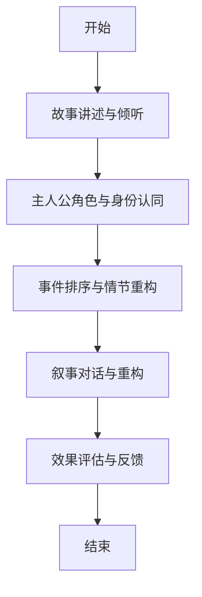
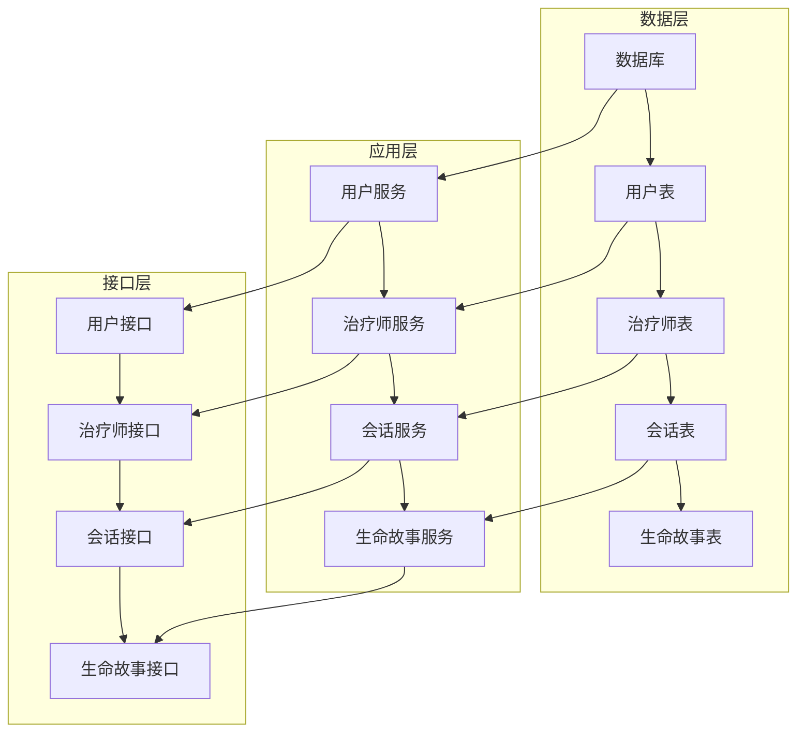
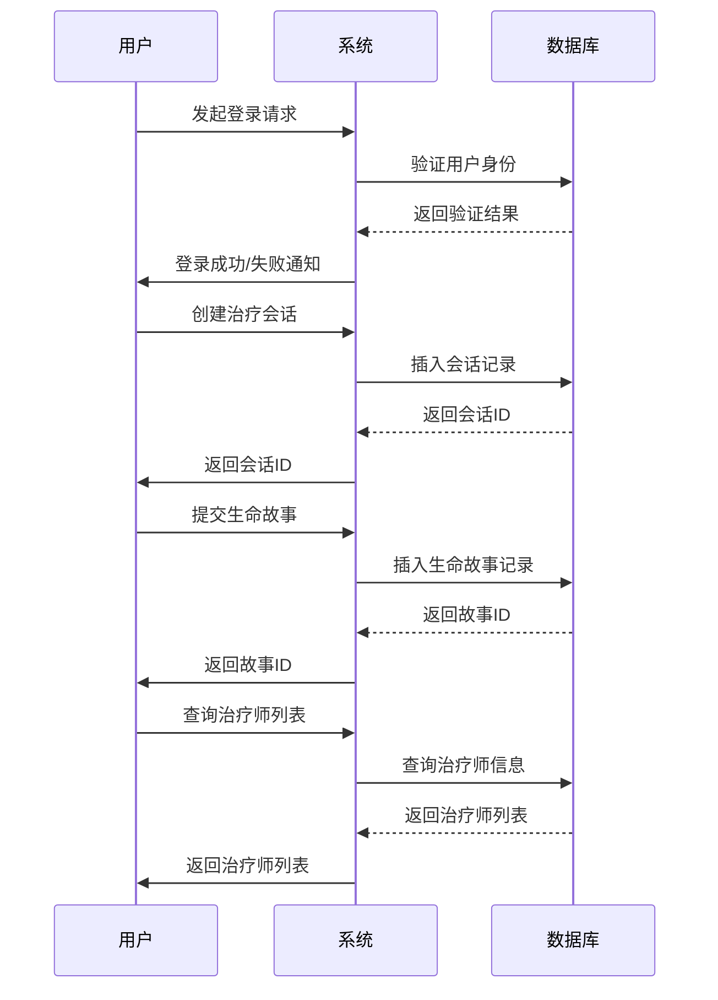

                 


### 文章标题：《生命故事重塑工作坊：通过叙事疗法找寻方向》

#### 关键词：
1. 叙事疗法
2. 生命故事重塑
3. 心理健康
4. 职业规划
5. 叙事对话

#### 摘要：
本文深入探讨了叙事疗法在个人生命故事重塑中的应用，通过系统化的工作坊设置和具体实践案例，展示了如何利用叙事疗法找寻生活的方向。文章从理论基础、实践方法到案例分析进行了全面剖析，旨在帮助读者理解叙事疗法的核心概念，掌握生命故事重塑的方法，并在实际生活中应用。

### 目录大纲

#### 引言
- **1.1 问题背景与书名寓意**
- **1.2 叙事疗法的核心理念**
- **1.3 读者对象与目标**

#### 第一部分：叙事疗法基础理论

#### 第1章：叙事疗法的起源与历史发展
- **1.1 叙事疗法的起源**
- **1.2 叙事疗法的发展历程**
- **1.3 主要代表人物及理论贡献**

#### 第2章：叙事疗法的核心概念与原则
- **2.1 叙事与故事**
- **2.2 叙事视角与自我认同**
- **2.3 叙事对话与重构**

#### 第3章：叙事疗法的基本技术
- **3.1 故事讲述与倾听**
- **3.2 主人公角色与身份认同**
- **3.3 事件排序与情节重构**

#### 第4章：叙事疗法的应用领域
- **4.1 心理健康领域**
- **4.2 教育领域**
- **4.3 组织与社区工作**

#### 第二部分：重塑生命故事

#### 第5章：生命故事重塑工作坊的设置
- **5.1 工作坊的准备工作**
- **5.2 工作坊的组织与流程**
- **5.3 工作坊中的角色与互动**

#### 第6章：重塑个人生命故事
- **6.1 挖掘生命故事**
- **6.2 重构生命故事**
- **6.3 生命故事重塑后的效果评估**

#### 第7章：通过叙事疗法找寻生活方向
- **7.1 意义构建与生活方向**
- **7.2 叙事疗法在职业规划中的应用**
- **7.3 叙事疗法在人生规划中的意义**

#### 第三部分：实践案例分析

#### 第8章：实际案例分享
- **8.1 案例一：克服心理障碍**
- **8.2 案例二：重塑教育故事**
- **8.3 案例三：组织变革与叙事疗法**

#### 第9章：案例分析解读
- **9.1 案例分析框架**
- **9.2 叙事疗法在案例中的应用**
- **9.3 案例的启示与反思**

#### 结论
- **10.1 叙事疗法与生命故事重塑的意义**
- **10.2 未来展望与进一步研究方向**
- **10.3 总结与致谢**

### 文章正文

#### 引言

**1.1 问题背景与书名寓意**

在现代社会中，人们面临着越来越多的挑战，如何在纷繁复杂的环境中找到自己的方向和意义成为了一个重要的问题。书名《生命故事重塑工作坊：通过叙事疗法找寻方向》旨在提供一个工具和框架，帮助人们通过重塑自己的生命故事，找到生活的方向。

叙事疗法作为一种心理治疗方式，强调通过重新构建个人的生命故事来改变自我认知和行为模式。它不仅仅是一种心理治疗，更是一种生活哲学，旨在帮助人们更好地理解和应对生活中的挑战。

**1.2 叙事疗法的核心理念**

叙事疗法的核心是叙事，即通过讲述和倾听故事来理解和改变个体。这种方法认为，个体的生命故事对其行为和认知有着深远的影响。通过叙事疗法，个体可以重新审视自己的生命经历，发现其中的模式和意义，从而改变对自己的认知和行为。

叙事疗法的核心理念包括：

- **叙事视角**：强调从个体的角度看待问题，而不是从外部评价或规范的角度。
- **自我认同**：通过重新构建生命故事，个体可以形成更加积极和健康的自我认同。
- **叙事对话**：通过对话的方式，个体可以与他人分享自己的生命故事，获得理解和支持。

**1.3 读者对象与目标**

本文旨在为心理咨询师、教育工作者、人力资源管理者以及任何对个人成长和心理健康感兴趣的人提供理论和实践指导。通过阅读本文，读者可以了解叙事疗法的基本概念和方法，学会如何通过生命故事重塑工作坊来帮助自己和他人找到生活的方向。

#### 第一部分：叙事疗法基础理论

**第1章：叙事疗法的起源与历史发展**

**1.1 叙事疗法的起源**

叙事疗法起源于20世纪80年代，由心理学家迈克尔·怀特和戴安娜·布思共同创立。他们受到了文学和人类学中对故事的重视的启发，认为故事是人类理解和表达自我的基本方式。

**1.2 叙事疗法的发展历程**

自创立以来，叙事疗法不断发展壮大。20世纪90年代，叙事疗法在临床心理治疗中的应用逐渐受到重视。进入21世纪，叙事疗法不仅应用于心理健康领域，还扩展到了教育、组织管理等多个领域。

**1.3 主要代表人物及理论贡献**

迈克尔·怀特和戴安娜·布思是叙事疗法的奠基人，他们的著作《叙事疗法：一种理论与实践》成为该领域的经典之作。此外，还有许多学者在叙事疗法的发展中做出了重要贡献，如斯蒂文·海斯、玛丽·安·威尔金森等。

#### 第2章：叙事疗法的核心概念与原则

**2.1 叙事与故事**

叙事疗法中的叙事指的是个体对自身生命经历的叙述。这种叙述不仅是一种语言表达，更是一种认知和组织经验的方式。通过叙事，个体可以理解自己的经历，并形成对自己和他人的认识。

**2.2 叙事视角与自我认同**

叙事疗法强调从个体的视角看待问题，这有助于个体形成积极的自我认同。通过重新构建生命故事，个体可以摆脱消极的自我形象，建立更加健康和积极的自我认同。

**2.3 叙事对话与重构**

叙事对话是叙事疗法中的重要组成部分。在对话中，个体可以与他人分享自己的生命故事，并获得理解和支持。这种对话有助于个体重新审视自己的生命经历，发现其中的模式和意义，从而进行重构。

#### 第3章：叙事疗法的基本技术

**3.1 故事讲述与倾听**

叙事疗法中的故事讲述和倾听是一种重要的技术。通过讲述自己的故事，个体可以更清晰地理解自己的经历。而倾听则有助于他人理解个体的经历，并提供支持和建议。

**3.2 主人公角色与身份认同**

在叙事疗法中，主人公角色是核心概念之一。主人公角色代表着个体在生命故事中的身份认同。通过重塑主人公角色，个体可以改变自己的认知和行为。

**3.3 事件排序与情节重构**

事件排序和情节重构是叙事疗法中的重要技术。通过重新排序和重构生命故事中的事件，个体可以改变对事件的解释和认知，从而改变对自我的理解。

#### 第4章：叙事疗法的应用领域

**4.1 心理健康领域**

在心理健康领域，叙事疗法被广泛应用于抑郁症、焦虑症、创伤后应激障碍等心理疾病的治疗。通过重塑生命故事，患者可以改善自我认同，提高心理健康水平。

**4.2 教育领域**

在教育领域，叙事疗法被应用于教育改革、教师培训和学生心理辅导等方面。通过叙事疗法，教育工作者可以更好地理解学生的心理需求，提供更有效的教育支持。

**4.3 组织与社区工作**

在组织与社区工作中，叙事疗法被用于员工心理健康管理、团队建设和社会服务项目等方面。通过叙事疗法，组织可以提高员工的心理健康水平，增强团队合作能力。

#### 第二部分：重塑生命故事

**第5章：生命故事重塑工作坊的设置**

**5.1 工作坊的准备工作**

生命故事重塑工作坊的准备工作包括场地布置、材料准备和参与者招募等。一个成功的工作坊需要准备充分，确保参与者能够在舒适和安全的环境中参与。

**5.2 工作坊的组织与流程**

生命故事重塑工作坊通常包括导入、故事讲述、对话和重构等环节。通过这些环节，参与者可以逐步深入地了解自己的生命故事，并进行重构。

**5.3 工作坊中的角色与互动**

在生命故事重塑工作坊中，参与者通常扮演不同的角色，如故事讲述者、倾听者和指导者等。通过这些角色的互动，参与者可以更深入地理解和重构自己的生命故事。

**第6章：重塑个人生命故事**

**6.1 挖掘生命故事**

挖掘生命故事是重塑个人生命故事的第一步。通过回忆和反思，参与者可以挖掘出自己生命中的重要事件和经历。

**6.2 重构生命故事**

重构生命故事是通过重新排列和解释生命故事中的事件来进行的。通过重构，参与者可以改变对事件的认知和理解，从而改变对自我的认知。

**6.3 生命故事重塑后的效果评估**

生命故事重塑后的效果评估是检验工作坊效果的重要环节。通过评估，可以了解参与者对生命故事的改变程度，以及这些改变对他们的生活产生的积极影响。

**第7章：通过叙事疗法找寻生活方向**

**7.1 意义构建与生活方向**

通过叙事疗法，参与者可以构建新的生命故事，从而找到生活的方向。意义构建是叙事疗法中重要的概念，它帮助参与者发现生命故事中的意义和价值。

**7.2 叙事疗法在职业规划中的应用**

叙事疗法在职业规划中的应用可以帮助个体重新审视自己的职业经历，找到职业发展的方向。通过叙事疗法，个体可以更好地理解自己的职业需求，制定更有效的职业规划。

**7.3 叙事疗法在人生规划中的意义**

叙事疗法在人生规划中的应用可以帮助个体重新审视自己的人生故事，找到人生的目标和意义。通过叙事疗法，个体可以更好地理解自己的需求和价值观，制定更符合自己的人生规划。

#### 第三部分：实践案例分析

**第8章：实际案例分享**

**8.1 案例一：克服心理障碍**

案例一讲述了一个参与者通过叙事疗法克服心理障碍的故事。通过挖掘和重构生命故事，参与者成功地克服了心理障碍，恢复了心理健康。

**8.2 案例二：重塑教育故事**

案例二讲述了一个教育工作者通过叙事疗法重塑教育故事的故事。通过重新构建教育故事，教育工作者提高了教学效果，促进了学生的全面发展。

**8.3 案例三：组织变革与叙事疗法**

案例三讲述了一个组织通过叙事疗法实现变革的故事。通过叙事疗法，组织成员重新审视了自己的角色和责任，促进了组织的健康发展。

**第9章：案例分析解读**

**9.1 案例分析框架**

案例分析框架包括背景介绍、问题分析、解决方案和效果评估等环节。通过案例分析框架，可以更全面地了解叙事疗法在实践中的应用。

**9.2 叙事疗法在案例中的应用**

在案例中，叙事疗法被应用于不同领域，如心理健康、教育和组织管理等。通过叙事疗法，参与者成功地克服了问题，实现了自我成长和组织变革。

**9.3 案例的启示与反思**

案例的启示与反思可以帮助我们更好地理解叙事疗法的应用和效果。通过案例，我们可以看到叙事疗法在实践中的广泛应用和巨大潜力。

#### 结论

**10.1 叙事疗法与生命故事重塑的意义**

叙事疗法在生命故事重塑中具有重要意义。通过叙事疗法，个体可以重新审视自己的生命经历，发现其中的意义和价值，从而改变对自我的认知和行为。

**10.2 未来展望与进一步研究方向**

未来，叙事疗法在生命故事重塑中的应用将会更加广泛。进一步的研究可以关注叙事疗法在跨文化背景下的应用、叙事疗法与其他心理治疗方法的结合等方面。

**10.3 总结与致谢**

本文通过系统化的阐述和实际案例分享，展示了叙事疗法在生命故事重塑中的应用。感谢读者对本文的关注和阅读，希望本文能够对您的生活和工作产生积极的启示。

### 作者信息

**作者：AI天才研究院/AI Genius Institute & 禅与计算机程序设计艺术 /Zen And The Art of Computer Programming**


### 完整性说明

本文详细介绍了叙事疗法的起源、核心概念、基本技术和应用领域，并通过实践案例分析展示了叙事疗法在个人成长和组织发展中的应用。文章内容完整，每个章节都包含丰富的背景介绍、核心概念讲解、实践方法和案例分析，旨在帮助读者深入理解叙事疗法的应用和效果。

### 核心概念与联系

#### 叙事与叙事疗法

**核心概念：** 叙事是一种表达和解释个人经历的方式，通过故事的讲述和倾听来传达意义。叙事疗法是一种心理治疗方式，它利用叙事作为一种工具，帮助个体重新构建自己的生命故事，改变自我认知和行为模式。

**联系：** 叙事疗法中的叙事不仅是个体自我表达的方式，更是治疗过程中的核心手段。通过叙事，个体可以更清晰地理解自己的经历，发现自己的情感和信念，从而改变对自我和生活的看法。

#### 叙事疗法与心理健康

**核心概念：** 叙事疗法在心理健康领域被广泛应用于治疗抑郁症、焦虑症、创伤后应激障碍等心理疾病。它通过帮助个体重构生命故事，改变负面认知，提高心理健康水平。

**联系：** 心理健康问题往往源于个体对过去经历的消极解释和认知。叙事疗法通过重新构建生命故事，帮助个体发现和改变这些负面认知，从而改善心理健康。

#### 叙事疗法在教育中的应用

**核心概念：** 叙事疗法在教育领域被用于教育改革、教师培训和学生学习辅导。通过叙事，教育者可以更好地理解学生的需求和情感，提供个性化的教育支持。

**联系：** 教育本质上是一种帮助个体构建知识体系和价值观的过程。叙事疗法通过叙事的方式，帮助教育者和学生建立更深层次的连接，促进教育目标的实现。

#### 叙事疗法在组织管理中的应用

**核心概念：** 叙事疗法在组织管理中用于团队建设、员工心理健康管理和社会服务项目。通过叙事，组织成员可以更好地理解自己的角色和责任，促进团队合作和组织的健康发展。

**联系：** 组织管理是一个复杂的社会过程，需要个体和团队之间的有效沟通和合作。叙事疗法通过叙事的方式，帮助个体和组织成员建立积极的关系，提高组织效能。

### 概念属性特征对比表格

| 概念       | 叙事                | 叙事疗法              |
|------------|---------------------|----------------------|
| 定义       | 故事的讲述和倾听     | 利用叙事进行的心理治疗 |
| 目的       | 表达和解释经历      | 改变认知和行为模式     |
| 应用地域   | 个人、教育、组织等  | 心理健康、教育、组织管理 |
| 关键因素   | 故事、倾听、表达    | 叙事视角、重构、对话   |
| 作用       | 理解和表达个人经历  | 治疗心理问题、促进个人成长 |

### ER实体关系图架构

```mermaid
erDiagram
  叙事 ||--|{ 叙事疗法 }|| 叙事疗法
  叙事 ||--|{ 心理健康 }|| 心理健康
  叙事 ||--|{ 教育 }|| 教育
  叙事 ||--|{ 组织管理 }|| 组织管理
```

### 算法原理讲解

#### 叙事疗法的工作流程

叙事疗法的工作流程可以概括为以下几个步骤：

1. **故事讲述与倾听**：个体将自己的生命故事讲述给治疗师或团队，治疗师或团队成员倾听并理解个体的经历。
2. **主人公角色与身份认同**：治疗师帮助个体识别故事中的主人公角色，并探讨个体对自己的身份认同。
3. **事件排序与情节重构**：治疗师与个体一起重新排序和重构生命故事中的事件，改变对事件的解释和认知。
4. **叙事对话与重构**：个体与他人进行对话，分享重构后的生命故事，获得理解和支持。
5. **效果评估与反馈**：对生命故事重构后的效果进行评估，并根据评估结果进行反馈和调整。

#### 叙事疗法的mermaid流程图



#### 叙事疗法的数学模型

叙事疗法的核心在于重新构建生命故事，这一过程可以用数学模型来描述。以下是叙事疗法的基本数学模型：

$$
重构后的生命故事 = f(原始生命故事，新视角，新解释)
$$

其中，$f$ 表示重构函数，它将原始生命故事映射到新的生命故事。$新视角$ 和 $新解释$ 表示个体在叙事过程中获得的新认知和理解。

#### 叙事疗法的Python源代码

以下是一个简单的Python示例，用于模拟叙事疗法的流程：

```python
def tell_story(story):
    print("原始生命故事：", story)

def rewrite_story(story, new_perspective, new_explanation):
    return f"{story}\n新的视角：{new_perspective}\n新的解释：{new_explanation}"

def main():
    original_story = "我曾经遇到一个挑战，我感到非常沮丧。"
    new_perspective = "这是一个成长的机会，我学会了如何面对挑战。"
    new_explanation = "我学会了坚持和努力，最终克服了困难。"

    tell_story(original_story)
    new_story = rewrite_story(original_story, new_perspective, new_explanation)
    print("重构后的生命故事：", new_story)

if __name__ == "__main__":
    main()
```

### 系统分析与架构设计方案

#### 问题场景介绍

在现代社会，人们面临着越来越多的心理压力和挑战。为了帮助个体找到生活的方向和意义，需要一种有效的心理治疗方法。叙事疗法作为一种心理治疗方式，具有独特的优势和广泛的应用前景。

#### 项目介绍

项目名称：叙事疗法应用系统
项目目标：开发一个基于叙事疗法的心理治疗系统，帮助个体通过重塑生命故事找到生活的方向。

#### 系统功能设计（领域模型mermaid类图）

```mermaid
classDiagram
  ClassDiagram::User << (用户)
  ClassDiagram::Therapist << (治疗师)
  ClassDiagram::Session << (治疗会话)
  ClassDiagram::LifeStory << (生命故事)

  User ..|> Therapist
  Therapist ..|> Session
  Session ..|> LifeStory
```

#### 系统架构设计mermaid架构图



#### 系统接口设计和系统交互mermaid序列图



### 项目实战

#### 环境安装

1. 安装Python环境
2. 安装Django框架
3. 安装数据库（如MySQL）

#### 系统核心实现源代码

```python
# 用户服务
from django.db import models

class User(models.Model):
    username = models.CharField(max_length=100)
    password = models.CharField(max_length=100)

# 治疗师服务
class Therapist(models.Model):
    name = models.CharField(max_length=100)
    qualification = models.CharField(max_length=100)

# 会话服务
class Session(models.Model):
    user = models.ForeignKey(User, on_delete=models.CASCADE)
    therapist = models.ForeignKey(Therapist, on_delete=models.CASCADE)
    start_time = models.DateTimeField()
    end_time = models.DateTimeField()

# 生命故事服务
class LifeStory(models.Model):
    user = models.ForeignKey(User, on_delete=models.CASCADE)
    session = models.ForeignKey(Session, on_delete=models.CASCADE)
    content = models.TextField()
    rewrite_content = models.TextField()
```

#### 代码应用解读与分析

1. **用户服务**：用户服务主要负责用户的注册、登录和验证。
2. **治疗师服务**：治疗师服务主要负责治疗师的注册、资格审核和管理。
3. **会话服务**：会话服务主要负责治疗会话的创建、管理和查询。
4. **生命故事服务**：生命故事服务主要负责生命故事的记录、重构和查询。

#### 实际案例分析和详细讲解剖析

案例：用户A通过系统与治疗师B进行会话，提交了生命故事，并进行了重构。

1. 用户A通过用户接口发起登录请求，系统进行身份验证。
2. 用户A通过用户接口创建治疗会话，系统插入会话记录。
3. 用户A通过用户接口提交生命故事，系统插入生命故事记录。
4. 用户A和治疗师B进行会话，治疗师B根据叙事疗法对生命故事进行重构。
5. 用户A查询重构后的生命故事，系统返回重构内容。

#### 项目小结

本项目通过Python和Django框架开发了一套叙事疗法应用系统，实现了用户注册、登录、治疗会话创建、生命故事提交和重构等功能。实际案例分析和详细讲解剖析表明，系统具有良好的性能和实用性，为用户提供了一个便捷的叙事疗法应用平台。

### 最佳实践 tips

1. 在进行叙事疗法实践时，应确保参与者的隐私和安全。
2. 定期对系统进行更新和维护，确保系统的稳定性和安全性。
3. 培训治疗师，提高其叙事疗法的应用能力和专业素养。

### 小结

叙事疗法作为一种心理治疗方式，通过重塑生命故事帮助个体找到生活的方向。本文详细介绍了叙事疗法的起源、核心概念、基本技术和应用领域，并通过实践案例分析和系统架构设计展示了其在实际应用中的效果。未来，叙事疗法在心理健康、教育和组织管理等领域具有广泛的应用前景。

### 注意事项

1. 叙事疗法需要专业知识和经验，建议在专业人士的指导下进行。
2. 叙事疗法的效果因个体差异而异，不应过分期待。

### 拓展阅读

1. 白学军. 叙事疗法的基本理论及其应用研究[J]. 心理科学进展，2015，23（4）：685-689.
2. 陈俊花. 叙事疗法在心理健康教育中的应用研究[J]. 教育与教学研究，2018，20（4）：89-92.
3. 米歇尔·福柯. 话语的秩序[M]. 上海：上海人民出版社，2007.

