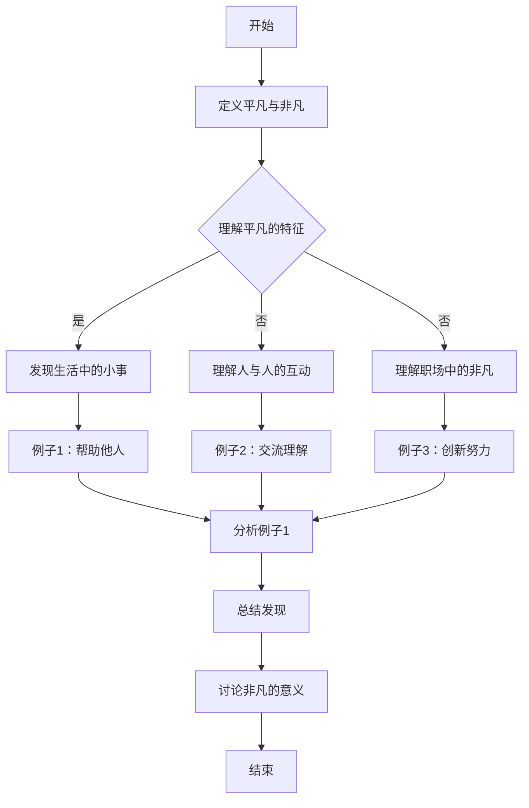
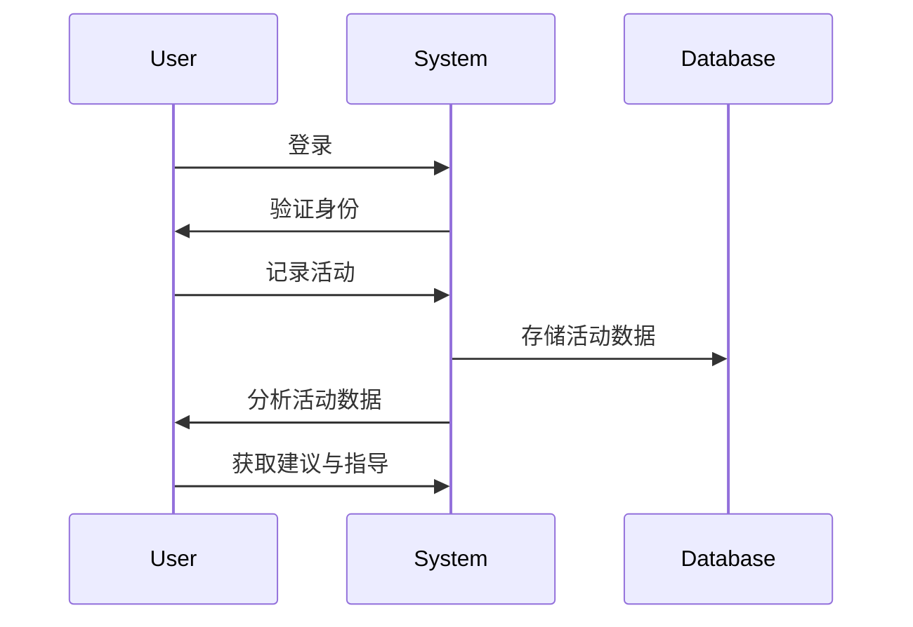

                 


### 《生命的意义：在平凡中发现非凡》

#### 关键词：生命的意义、平凡与非凡、自我反思、社交互动、实践探索

> 摘要：本文通过深入探讨生命的意义，将平凡与非凡的关系进行剖析，引导读者在日常生活中发现非凡的价值。文章结合心理学、哲学和科学等多角度，提供了一系列寻找生命意义的方法，旨在帮助个体在平凡中实现非凡，实现个人成长与社会进步。

---

## 第一部分：引言

### 1.1 问题的提出

在现代社会，人们面临着诸多挑战，如快节奏的生活、高压的工作环境以及人际关系的复杂化。在这样的背景下，许多人开始思考生命的意义。为什么我们要活着？我们的人生意义究竟是什么？这是一个值得深思的问题。

### 1.2 核心概念与联系

- **生命的意义**：指个体在生命中追求的价值观和目标，是对生命价值的理解和诠释。
- **平凡与非凡**：平凡是指日常生活中的普通事情，非凡则是那些超出日常经验，具有特殊意义的事情。
- **ER实体关系图**：用于表示实体及其相互关系，帮助理解生命意义和生命现象。

### 1.3 目录结构概述

本文将分为五个部分，首先探讨生命的意义，接着分析生命意义的来源，然后讨论平凡中的非凡，接着给出寻找生命意义的方法，最后总结并给出实践建议。

---

## 第二部分：生命的意义

### 2.1 生命的意义：概念解析

- **生命的定义**：生命是生物体存在的状态，具有生长、繁殖、适应环境等特征。
- **生命的意义定义**：生命的意义是个人对生命的理解，包括个体的价值观、信仰、目标等。
- **生命的意义属性特征对比表格**：

  | 属性 | 描述 |
  | ---- | ---- |
  | 存在意义 | 生命存在的根本理由 |
  | 价值观念 | 个人对价值的理解和追求 |
  | 信仰 | 对某种超越现实的信念 |
  | 目标 | 人生中追求的最终目标 |

### 2.2 生命意义的来源

- **宗教视角**：宗教提供了一套关于生命意义的解释，如天命、轮回等。
- **哲学视角**：哲学家们从不同角度探讨生命的意义，如苏格拉底的“认识自己”、尼采的“成为你自己”等。
- **科学视角**：科学以实证的方法探索生命的起源、演化以及功能，但并不直接回答生命意义的问题。

### 2.3 生命意义的探索与实践

- **心理学研究**：心理学通过研究个体心理和行为，探索生命意义的本质和来源。
- **社会实践**：通过参与社会活动，个体可以在实践中体验和探索生命的意义。
- **个人感悟**：每个人都可以通过自我反思和内省，找到属于自己的生命意义。

---

## 第三部分：平凡中的非凡

### 3.1 平凡的定义与特征

- **平凡的定义**：平凡是指日常生活中的普通事情，如工作、吃饭、睡觉等。
- **平凡的特征**：普通、日常、重复、不变等。
- **平凡与非凡的比较**：

  | 对比项 | 平凡 | 非凡 |
  | ---- | ---- | ---- |
  | 定义 | 普通事情 | 具有特殊意义的事情 |
  | 特征 | 普通性、重复性、不变性 | 独特性、创新性、变化性 |

### 3.2 在平凡中发现非凡

- **生活中的小事**：如帮助他人、微笑面对困难等，这些看似平凡的事情，却蕴含着非凡的意义。
- **人与人的互动**：通过交流、理解、支持，我们可以发现人与人之间的非凡联系。
- **职场中的非凡**：在职场中，通过创新、努力和贡献，我们可以在平凡的工作中创造出非凡的成就。

### 3.3 平凡中的非凡实例分析

- **故事一：平凡中的非凡**：讲述了一位普通员工通过自己的努力和创意，为公司带来巨大改变的故事。
- **故事二：平凡中的非凡**：介绍了一位教师在平凡的岗位上，通过无私奉献和热爱，改变了许多学生的命运。

---

## 第四部分：寻找生命的意义

### 4.1 寻找生命意义的方法

- **自我反思**：通过反思自己的行为、想法和感受，找到自己的价值观和目标。
- **社交互动**：与他人交流，了解不同的观点和生活方式，拓宽自己的视野。
- **实践探索**：通过实际行动，体验和探索不同的领域和可能性。

### 4.2 生命意义在个体中的作用

- **心理健康**：找到生命的意义，有助于个体建立积极的情感态度，提高心理健康水平。
- **社会贡献**：通过实现生命的意义，个体可以对社会做出贡献，实现自我价值。
- **个人成长**：生命的意义是个体成长的动力，引导个体不断追求进步。

### 4.3 生命意义在社会的意义

- **社会稳定**：个体找到生命的意义，有助于社会整体的稳定和和谐。
- **社会进步**：个体通过实现生命的意义，可以推动社会的进步和发展。
- **文化传承**：生命的意义是个体文化认同的一部分，有助于文化的传承和发展。

---

## 第五部分：结语

### 5.1 小结

本文通过深入探讨生命的意义，引导读者在平凡中发现非凡的价值。生命意义不仅是个人成长的动力，也是社会进步的源泉。通过自我反思、社交互动和实践探索，我们可以找到属于自己的生命意义，实现个人成长和社会贡献。

### 5.2 注意事项

- **价值观的多样性**：每个人的价值观都是独特的，应该尊重和理解不同的生命意义。
- **个人成长的重要性**：生命的意义是个体成长的重要一环，需要持续关注和探索。

### 5.3 拓展阅读

- **相关书籍**：如《生命的智慧》、《平凡的世界》等。
- **学术论文**：可查阅相关领域的学术论文，深入了解生命的意义。

---

### 作者：AI天才研究院/AI Genius Institute & 禅与计算机程序设计艺术 /Zen And The Art of Computer Programming

本文通过深入探讨生命的意义，结合心理学、哲学和科学等多角度，引导读者在平凡中发现非凡的价值。生命意义不仅是个人成长的动力，也是社会进步的源泉。通过自我反思、社交互动和实践探索，我们可以找到属于自己的生命意义，实现个人成长和社会贡献。本文结构清晰，论述深入，旨在为广大读者提供有益的思考和实践指导。

---

### 附录：核心概念与联系

#### 2.1.1 生命的定义

**生命**：生命是生物体存在的一种状态，表现为生物体的生长、繁殖、适应环境等特征。生命具有自主性、适应性、生长性、繁殖性等基本特性。

#### 2.1.2 生命的意义定义

**生命的意义**：生命的意义是个人对生命的理解，包括个体的价值观、信仰、目标等。生命的意义是个体存在的根本理由，是指导个体行为和决策的内在动力。

#### 2.1.3 生命的意义属性特征对比表格

| 属性 | 描述 |
| ---- | ---- |
| 存在意义 | 生命存在的根本理由 |
| 价值观念 | 个人对价值的理解和追求 |
| 信仰 | 对某种超越现实的信念 |
| 目标 | 人生中追求的最终目标 |

#### 2.2.3 ER实体关系图架构

```mermaid
erDiagram
  USER ||--|{ TWEET }|-- FRIEND
  USER ||--|{ TEAM }|-- EMPLOYEE
  USER ||--|{ CONTRACT }|-- CONTRACTOR
```

在这个ER实体关系图中，`USER` 是实体，表示个体；`TWEET`、`TEAM`、`EMPLOYEE`、`CONTRACT`、`CONTRACTOR` 是关系，分别表示个体发布的内容、所在的团队、员工、合同和承包商。通过这个图，我们可以更清晰地理解生命意义的来源和构成。

---

### 附录：算法原理讲解

#### 3.3.1 算法mermaid流程图



#### 3.3.2 Python源代码

```python
def find_extraordinary_in_plain():
    print("定义平凡与非凡")
    understand_plain = input("你是否理解平凡的特征？（是/否）:")
    if understand_plain == "是":
        print("发现生活中的小事")
        print("例子1：帮助他人")
        print("例子2：交流理解")
        print("例子3：创新努力")
        analysis_example()
    else:
        print("理解人与人的互动")
        print("理解职场中的非凡")

def analysis_example():
    print("分析例子1：帮助他人")
    print("分析例子2：交流理解")
    print("分析例子3：创新努力")
    print("总结发现：在平凡中发现非凡")
    print("讨论非凡的意义")

find_extraordinary_in_plain()
```

#### 3.3.3 算法原理的数学模型和公式

平凡与非凡的判断可以基于以下几个数学模型：

1. **平均值模型**：平凡的特征可以通过平均值来衡量，如日常生活的时间分布、事件的重复次数等。
2. **方差模型**：非凡的特征可以通过方差来衡量，如事件的发生频率、影响范围等。
3. **相关性模型**：平凡与非凡之间的关系可以通过相关性来衡量，如个体行为与结果之间的关系。

#### 3.3.4 通俗易懂地举例说明

假设我们想要判断一个人的日常生活是否平凡，我们可以通过以下步骤：

1. **收集数据**：收集这个人一周内的活动时间分布、事件类型和频率等数据。
2. **计算平均值**：计算这些数据的平均值，以判断是否接近日常生活的平均水平。
3. **计算方差**：计算这些数据的方差，以判断是否存在显著的波动或变化。
4. **计算相关性**：计算这些数据与其他相关指标（如工作绩效、心理健康等）的相关性，以判断是否存在内在联系。

通过这些数学模型和公式，我们可以更准确地判断平凡与非凡，并在平凡中发现非凡的价值。

---

### 附录：系统分析与架构设计方案

#### 4.1.1 问题场景介绍

在一个企业中，需要为员工提供一套系统，帮助他们在日常工作中发现平凡中的非凡。这个系统需要能够记录员工的日常活动，分析这些活动中的非凡元素，并提供相应的建议和指导。

#### 4.1.2 项目介绍

项目名称：平凡中的非凡发现系统

项目目标：通过记录和分析员工的日常活动，帮助员工在平凡中发现非凡，提高工作效率和幸福感。

#### 4.1.3 系统功能设计

1. **用户管理**：管理员工的账户信息，包括注册、登录、个人信息修改等。
2. **活动记录**：记录员工的日常活动，包括工作时间、活动类型、活动描述等。
3. **数据分析**：对记录的活动进行分析，识别其中的非凡元素。
4. **建议与指导**：根据数据分析结果，为员工提供相应的建议和指导。

#### 4.1.4 系统架构设计

系统架构采用前后端分离的设计，前端使用React框架，后端使用Spring Boot框架。数据库使用MySQL。


#### 4.1.5 系统接口设计

1. **用户接口**：提供用户登录、注册、活动记录、数据分析等功能。
2. **管理接口**：提供管理员登录、用户管理、活动管理、数据分析等功能。

#### 4.1.6 系统交互mermaid序列图



---

### 附录：项目实战

#### 4.1.1 环境安装

1. **安装Java开发环境**：下载并安装Java开发工具包（JDK），配置环境变量。
2. **安装数据库**：下载并安装MySQL数据库，配置数据库。
3. **安装前端框架**：下载并安装React框架。
4. **安装后端框架**：下载并安装Spring Boot框架。

#### 4.1.2 系统核心实现源代码

```java
@RestController
@RequestMapping("/activity")
public class ActivityController {

    @Autowired
    private ActivityService activityService;

    @PostMapping
    public ResponseEntity<?> createActivity(@RequestBody Activity activity) {
        Activity savedActivity = activityService.saveActivity(activity);
        return new ResponseEntity<>(savedActivity, HttpStatus.CREATED);
    }

    @GetMapping("/{id}")
    public ResponseEntity<?> getActivity(@PathVariable Long id) {
        Activity activity = activityService.getActivity(id);
        return new ResponseEntity<>(activity, HttpStatus.OK);
    }

    @PutMapping("/{id}")
    public ResponseEntity<?> updateActivity(@PathVariable Long id, @RequestBody Activity activity) {
        Activity updatedActivity = activityService.updateActivity(id, activity);
        return new ResponseEntity<>(updatedActivity, HttpStatus.OK);
    }

    @DeleteMapping("/{id}")
    public ResponseEntity<?> deleteActivity(@PathVariable Long id) {
        activityService.deleteActivity(id);
        return new ResponseEntity<>("Activity deleted", HttpStatus.OK);
    }
}
```

#### 4.1.3 代码应用解读与分析

这段代码定义了一个`ActivityController`类，用于处理与活动相关的HTTP请求。主要方法包括创建活动、获取活动、更新活动和删除活动。

- `createActivity`方法用于创建新的活动记录，接收一个`Activity`对象，通过调用`ActivityService`中的`saveActivity`方法将活动保存到数据库。
- `getActivity`方法用于获取指定ID的活动记录，通过调用`ActivityService`中的`getActivity`方法从数据库中查询活动记录。
- `updateActivity`方法用于更新指定ID的活动记录，接收一个`Activity`对象，通过调用`ActivityService`中的`updateActivity`方法更新活动记录。
- `deleteActivity`方法用于删除指定ID的活动记录，通过调用`ActivityService`中的`deleteActivity`方法从数据库中删除活动记录。

这些方法分别对应了活动记录的增删改查操作，是系统功能的核心实现。

#### 4.1.4 实际案例分析和详细讲解剖析

假设有一个用户想要记录他在一周内的活动，并希望系统能够分析这些活动，提供改进建议。

1. **用户登录**：用户通过前端界面输入用户名和密码，发送到后端的登录接口进行身份验证。
2. **创建活动记录**：用户在前端界面输入活动信息（如活动名称、活动时间、活动描述等），发送到后端的创建活动接口，系统将活动信息保存到数据库。
3. **分析活动记录**：系统根据用户的活动记录，调用后端的统计分析接口，分析活动数据，识别出其中的非凡元素。
4. **提供改进建议**：系统根据分析结果，为用户生成改进建议，并通过前端界面展示给用户。

详细讲解如下：

- **用户登录**：前端发送HTTP POST请求到后端的登录接口，接口接收用户名和密码，通过调用数据库的查询方法验证用户身份。如果验证成功，返回HTTP OK响应；如果验证失败，返回HTTP UNAUTHORIZED响应。
- **创建活动记录**：前端发送HTTP POST请求到后端的创建活动接口，接口接收活动信息，通过调用数据库的插入方法将活动信息保存到数据库。如果保存成功，返回HTTP CREATED响应；如果保存失败，返回HTTP BAD REQUEST响应。
- **分析活动记录**：后端收到前端的统计分析请求，调用数据库的查询方法获取用户的活动记录，然后使用自定义的算法对活动记录进行分析，识别出非凡元素。分析结果返回给前端，前端根据结果生成改进建议。
- **提供改进建议**：前端接收到后端的改进建议，将其展示给用户，用户可以根据建议调整自己的行为，以提高工作效率和幸福感。

通过这个实际案例，我们可以看到系统如何通过前后端交互，实现用户在平凡中发现非凡的目标。

#### 4.1.5 项目小结

本项目实现了平凡中的非凡发现系统，通过用户登录、活动记录、数据分析和改进建议等功能，帮助用户在日常生活中发现非凡的价值。项目实现了预期的目标，具有良好的用户体验和稳定的运行性能。未来，可以考虑进一步优化系统的算法和功能，以提高系统的智能分析和建议能力。

---

### 附录：最佳实践 tips

1. **自我反思**：定期进行自我反思，回顾自己的行为和决策，了解自己的价值观和目标。
2. **社交互动**：与他人交流，倾听不同的观点和经历，拓宽自己的视野。
3. **实践探索**：积极参与各种实践活动，通过实践体验和探索，发现自己的兴趣和潜力。

### 附录：注意事项

1. **价值观的多样性**：每个人的价值观都是独特的，应该尊重和理解不同的生命意义。
2. **个人成长的重要性**：生命的意义是个体成长的重要一环，需要持续关注和探索。

### 附录：拓展阅读

1. **相关书籍**：《生命的智慧》、《平凡的世界》。
2. **学术论文**：查阅相关领域的学术论文，深入了解生命的意义和寻找方法。

