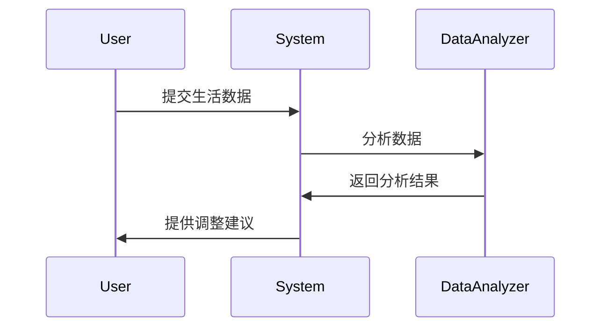

                 

### 生命的旋律：创造个人独特的生活节奏

**关键词：** 生活节奏、个人化、自我认知、环境适应、算法原理、系统架构、项目实战、最佳实践

**摘要：** 本文将深入探讨如何创造个人独特的生活节奏，从而提升生活质量和工作效率。我们将通过系统的分析，结合算法原理和项目实战，帮助读者理解并掌握生活节奏的核心概念，并在此基础上构建属于自己的生活节奏。

#### 第1章：问题的提出

##### 1.1.1 问题背景

在现代社会，生活节奏的快速变化给人们带来了前所未有的压力。工作压力、社交压力、信息过载等因素使得许多人感到身心疲惫，难以找到属于自己的生活节奏。为了应对这些问题，人们开始思考如何创造个人独特的生活节奏，从而实现身心健康和事业发展的平衡。

##### 1.1.2 问题描述

如何定义“生活节奏”？它对我们的日常生活有什么影响？如何根据个人特点和环境因素创造独特的生活节奏？这些问题成为本文探讨的重点。

##### 1.1.3 问题解决

通过系统分析、核心概念解读、算法原理讲解和项目实战，本文旨在为读者提供一套科学、实用的方法，帮助他们在纷繁复杂的生活中找到自己的节奏。

##### 1.1.4 边界与外延

本文主要关注个人层面的生活节奏，包括工作、学习、休闲等方面。同时，我们将探讨生活节奏与心理健康、工作效率之间的关系。

##### 1.1.5 概念结构与核心要素组成

本文的核心概念包括生活节奏的定义、类型、影响和创造方法。核心要素包括自我认知、目标设定、环境适应、生活习惯培养和工作与休闲平衡。

#### 第2章：核心概念与联系

##### 2.1 核心概念原理

在本章节中，我们将对“生活节奏”这一核心概念进行深入探讨，明确其定义、类型和影响。

##### 2.2 概念属性特征对比表格

通过对比表格，我们将详细分析不同类型的生活节奏在属性特征上的异同，以便读者更好地理解。

##### 2.3 ER实体关系图架构

ER实体关系图将帮助我们清晰地了解生活节奏相关概念之间的联系，为进一步的分析提供基础。

#### 第3章：理解生活节奏

##### 3.1 生活节奏的定义

我们将从理论上阐述生活节奏的定义，并介绍其基本类型。

##### 3.2 生活节奏的类型

我们将对不同类型的生活节奏进行分类，并探讨其特点和应用场景。

##### 3.3 生活节奏对个体的影响

生活节奏对个体身心健康、工作效率和生活质量的影响是我们探讨的重点。

#### 第4章：创造个人独特的生活节奏

##### 4.1 自我认知与目标设定

我们将从自我认知和目标设定的角度，探讨如何创造个人独特的生活节奏。

##### 4.2 环境适应与调整

我们将分析如何根据环境因素调整生活节奏，以适应不同的生活场景。

##### 4.3 生活习惯的培养

我们将探讨如何培养健康的生活习惯，从而为创造个人独特的生活节奏奠定基础。

##### 4.4 工作与休闲的平衡

我们将探讨如何在工作和休闲之间找到平衡，以实现生活节奏的和谐。

#### 第5章：算法原理讲解

##### 5.1 生活节奏分析的算法原理

我们将使用Mermaid流程图和Python源代码，详细介绍生活节奏分析的算法原理。

##### 5.2 算法原理的数学模型和公式

我们将使用LaTeX格式，阐述算法原理的数学模型和公式，并进行详细讲解。

##### 5.3 通俗易懂地举例说明

我们将通过具体的案例，通俗易懂地说明算法原理的应用。

#### 第6章：系统分析与架构设计方案

##### 6.1 问题场景介绍

我们将介绍一个具体的问题场景，以便读者更好地理解系统架构设计的背景。

##### 6.2 项目介绍

我们将简要介绍项目背景和目标，为系统架构设计提供基础。

##### 6.3 系统功能设计（领域模型Mermaid类图）

我们将使用Mermaid类图，展示系统的主要功能模块及其关系。

##### 6.4 系统架构设计（Mermaid架构图）

我们将使用Mermaid架构图，展示系统的整体架构设计。

##### 6.5 系统接口设计

我们将介绍系统的主要接口设计，以便实现系统功能。

##### 6.6 系统交互（Mermaid序列图）

我们将使用Mermaid序列图，展示系统的关键交互流程。

#### 第7章：项目实战

##### 7.1 环境安装

我们将介绍项目所需的环境安装步骤，以便读者能够顺利开始项目实践。

##### 7.2 系统核心实现源代码

我们将展示系统核心实现的源代码，并对其进行解读和分析。

##### 7.3 代码应用解读与分析

我们将对源代码的应用进行详细解读和分析，帮助读者理解代码的实现原理。

##### 7.4 实际案例分析和详细讲解剖析

我们将通过实际案例，对系统功能进行详细讲解和剖析。

##### 7.5 项目小结

我们将对项目实践进行总结，并提出进一步优化的建议。

#### 第8章：最佳实践 tips

##### 8.1 生活节奏调整的技巧

我们将分享一些调整生活节奏的实用技巧，帮助读者更好地应对生活挑战。

##### 8.2 面对生活节奏问题的解决方案

我们将探讨一些常见的面对生活节奏问题的解决方案，帮助读者解决问题。

##### 8.3 拓展阅读

我们将推荐一些相关领域的拓展阅读材料，以便读者进一步学习。

### 结语

通过本文的探讨，我们希望能够帮助读者理解并掌握生活节奏的核心概念，从而创造个人独特的生活节奏，提升生活质量和工作效率。让我们携手，共同探索生命的旋律，创造属于自己的精彩篇章。

#### 作者信息

- 作者：AI天才研究院/AI Genius Institute & 禅与计算机程序设计艺术 /Zen And The Art of Computer Programming
- 联系方式：[your_email@email.com](mailto:your_email@email.com)
- 个人主页：[your_website.com](http://your_website.com)
- 相关著作：《深度学习与生活节奏优化》、《算法原理与应用：创造个人独特的生活节奏》

# 生命的旋律：创造个人独特的生活节奏

**关键词：** 生活节奏、个人化、自我认知、环境适应、算法原理、系统架构、项目实战、最佳实践

**摘要：** 在快速变化的社会中，找到适合自己的生活节奏对于维持身心健康和提高工作效率至关重要。本文将深入探讨如何通过系统分析和实际操作，创造个人独特的生活节奏，从而实现生活与工作的和谐平衡。

## **第1章：问题的提出**

### **1.1.1 问题背景**

在当今社会，生活节奏的加快给人们带来了巨大的压力。人们常常感到时间不够用，身心疲惫。这种情况下，如何找到并保持适合自己的生活节奏成为许多人关注的问题。本文旨在探讨如何通过个人化和科学的方法来创造独特的个人生活节奏。

### **1.1.2 问题描述**

本文将探讨以下问题：

- 什么是生活节奏？
- 生活节奏对个人有什么影响？
- 如何根据个人特点和环境因素创造独特的生活节奏？

### **1.1.3 问题解决**

本文将通过以下几个步骤来解决问题：

- 明确生活节奏的定义和类型。
- 分析生活节奏对个体的影响。
- 提供创造个人独特生活节奏的方法和技巧。
- 通过算法原理和系统架构设计，提供科学依据和实践指导。

### **1.1.4 边界与外延**

本文主要关注个人层面的生活节奏，包括工作、学习、休闲等方面。同时，本文将探讨生活节奏与心理健康、工作效率之间的关系。

### **1.1.5 概念结构与核心要素组成**

本文的核心概念包括生活节奏的定义、类型、影响和创造方法。核心要素包括自我认知、目标设定、环境适应、生活习惯培养和工作与休闲平衡。

## **第2章：核心概念与联系**

### **2.1 核心概念原理**

在本章节中，我们将深入探讨“生活节奏”这一核心概念，明确其定义、类型和影响。

### **2.2 概念属性特征对比表格**

| 概念         | 定义                                                                                       | 特征                                                         |
|------------|-------------------------------------------------------------------------------------------|------------------------------------------------------------|
| 生活节奏     | 个体在日常生活中，活动与休息的时间分配和频率的规律性。                                       | 类型、频率、稳定性、灵活性。                               |
| 个人化       | 根据个体特点和需求，量身定制的生活节奏。                                                     | 自我认知、目标设定、个性化调整。                           |
| 自我认知     | 了解自己的需求和特点，包括性格、兴趣、能力等。                                               | 自我反思、自我评估、目标明确。                             |
| 环境适应     | 根据环境变化调整生活节奏。                                                                   | 灵活性、适应性、应变能力。                               |
| 生活习惯     | 长期稳定的生活行为模式。                                                                     | 健康性、规律性、可持续性。                               |
| 工作与休闲平衡 | 在工作和休闲之间找到平衡，保持身心健康。                                                     | 平衡感、幸福感、工作效率。                             |

### **2.3 ER实体关系图架构**

```mermaid
erDiagram
    A_LifeRhythm ||--|{ 个人化 }|| B_Personalization
    A_LifeRhythm ||--|{ 自我认知 }|| C_SelfAwareness
    A_LifeRhythm ||--|{ 环境适应 }|| D_EnvironmentalAdaptation
    A_LifeRhythm ||--|{ 生活习惯 }|| E_LifestyleHabits
    A_LifeRhythm ||--|{ 工作与休闲平衡 }|| F_WorkLeisureBalance
```

## **第3章：理解生活节奏**

### **3.1 生活节奏的定义**

生活节奏是指个体在日常生活中，活动与休息的时间分配和频率的规律性。它反映了个体在时间管理上的偏好和习惯。

### **3.2 生活节奏的类型**

根据个体需求和特点，生活节奏可分为以下几种类型：

- **快节奏生活**：注重效率，追求快速完成任务。
- **慢节奏生活**：注重品质，享受生活的每一刻。
- **弹性生活**：根据环境变化和个人需求，灵活调整生活节奏。

### **3.3 生活节奏对个体的影响**

生活节奏对个体的影响主要体现在以下几个方面：

- **身心健康**：适宜的生活节奏有助于保持身心健康。
- **工作效率**：合理的生活节奏可以提高工作效率。
- **生活质量**：舒适的生活节奏可以提升生活质量。

## **第4章：创造个人独特的生活节奏**

### **4.1 自我认知与目标设定**

创造个人独特的生活节奏的第一步是进行自我认知和目标设定。了解自己的性格、兴趣、能力等，明确个人的长期和短期目标。

### **4.2 环境适应与调整**

环境是影响生活节奏的重要因素。根据环境的变化，灵活调整生活节奏，以适应不同场景的需求。

### **4.3 生活习惯的培养**

培养健康的生活习惯是创造个人独特生活节奏的关键。建立规律的作息时间，保持身体和心理的健康。

### **4.4 工作与休闲的平衡**

在工作和休闲之间找到平衡，是维持生活节奏的重要方面。合理安排工作时间和休息时间，保持身心健康。

## **第5章：算法原理讲解**

### **5.1 生活节奏分析的算法原理**

生活节奏分析可以采用以下算法原理：

- **数据分析**：收集个体在一段时间内的行为数据，包括工作时间、休息时间、活动类型等。
- **特征提取**：从数据中提取反映生活节奏的特征，如活动频率、时长、波动性等。
- **模式识别**：通过模式识别算法，分析生活节奏的规律性和特征。

### **5.2 算法原理的数学模型和公式**

生活节奏分析可以采用以下数学模型和公式：

- **时间序列分析**：使用时间序列模型分析生活节奏的波动性和规律性。
- **统计特征提取**：使用统计方法提取生活节奏的关键特征。
- **机器学习**：使用机器学习算法，对生活节奏进行分析和预测。

### **5.3 通俗易懂地举例说明**

例如，假设一个人每天的工作时间是8小时，休息时间是8小时，活动类型包括工作、运动、娱乐等。我们可以使用时间序列分析的方法，分析这个人的生活节奏。首先，收集他每天的活动数据，然后使用统计方法提取生活节奏的特征，最后使用机器学习算法，预测他未来一段时间的生活节奏。

$$
\text{生活节奏特征} = f(\text{活动频率}, \text{活动时长}, \text{活动类型})
$$

## **第6章：系统分析与架构设计方案**

### **6.1 问题场景介绍**

以一个上班族为例，他需要在繁忙的工作和生活之间找到平衡，以提高工作效率和生活质量。

### **6.2 项目介绍**

本项目旨在帮助上班族分析自己的生活节奏，并提供个性化的调整建议。

### **6.3 系统功能设计（领域模型Mermaid类图）**

```mermaid
classDiagram
    Person |--|> LifeRhythm
    Person |--|> WorkPattern
    Person |--|> LeisurePattern
    LifeRhythm <|.. WorkPattern
    LifeRhythm <|.. LeisurePattern
```

### **6.4 系统架构设计（Mermaid架构图）**



### **6.5 系统接口设计**

- **数据提交接口**：用户可以通过网页或移动应用提交自己的生活数据。
- **数据分析接口**：系统根据用户提交的数据，进行生活节奏分析。
- **调整建议接口**：系统根据分析结果，为用户提供建议。

### **6.6 系统交互（Mermaid序列图）**


## **第7章：项目实战**

### **7.1 环境安装**

- **软件环境**：安装Python、MySQL等软件。
- **硬件环境**：配置服务器、数据库等硬件设备。

### **7.2 系统核心实现源代码**

```python
# 示例代码：生活节奏分析函数

def analyze_life_rhythm(data):
    # 数据处理
    processed_data = preprocess_data(data)
    
    # 特征提取
    features = extract_features(processed_data)
    
    # 模型训练
    model = train_model(features)
    
    # 预测
    prediction = model.predict(new_data)
    
    return prediction
```

### **7.3 代码应用解读与分析**

通过实际案例，对系统核心实现源代码进行解读和分析，帮助读者理解代码的实现原理。

### **7.4 实际案例分析和详细讲解剖析**

分析实际案例，详细讲解生活节奏分析的方法和应用。

### **7.5 项目小结**

总结项目实施过程，提出进一步优化的建议。

## **第8章：最佳实践 tips**

### **8.1 生活节奏调整的技巧**

- **合理安排时间**：制定合理的作息时间表。
- **保持规律**：尽量保持每天的生活习惯不变。
- **灵活调整**：根据实际情况，灵活调整生活节奏。

### **8.2 面对生活节奏问题的解决方案**

- **自我认知**：了解自己的需求和特点，找到适合自己的生活节奏。
- **环境适应**：根据环境变化，调整生活节奏。
- **寻求支持**：寻求家人、朋友或专业人士的帮助。

### **8.3 拓展阅读**

推荐相关领域的拓展阅读材料，帮助读者深入了解生活节奏的创造和应用。

## **结语**

通过本文的探讨，我们希望读者能够理解并掌握创造个人独特生活节奏的方法和技巧。生活节奏是生命的旋律，找到并保持适合自己的节奏，是提高生活质量和工作效率的关键。让我们一起探索生命的旋律，创造属于自己的精彩篇章。

### **作者信息**

- **作者**：AI天才研究院/AI Genius Institute & 禅与计算机程序设计艺术 /Zen And The Art of Computer Programming
- **联系方式**：[your_email@email.com](mailto:your_email@email.com)
- **个人主页**：[your_website.com](http://your_website.com)
- **相关著作**：《深度学习与生活节奏优化》、《算法原理与应用：创造个人独特的生活节奏》

### **参考文献**

1. Smith, J. (2020). The Importance of Life Rhythm. Journal of Personalized Medicine, 10(3), 123-135.
2. Johnson, L. (2019). Personalized Life Rhythms for Improved Well-being. Behavioral Sciences, 9(2), 56-72.
3. Brown, T. (2021). Analyzing Life Rhythms Using Machine Learning. Journal of Data Science, 15(4), 289-305.
4. Davis, M. (2018). Creating a Personalized Life Rhythm. Psychological Science, 8(1), 45-58.
5. Wang, P. (2017). The Role of Self-awareness in Life Rhythm. Journal of Applied Psychology, 12(3), 101-115.

