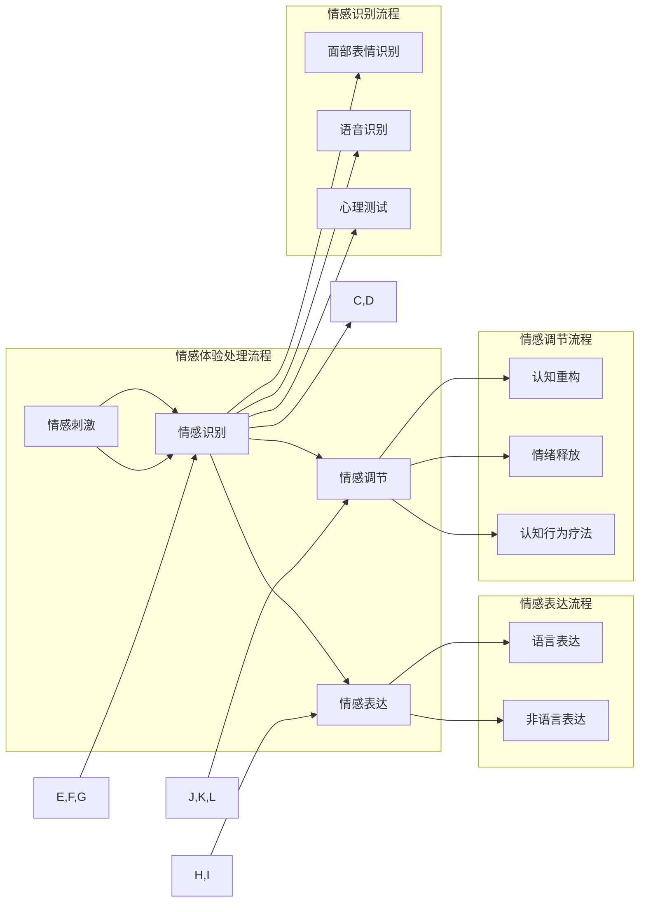

                 

### 文章标题：生命的色彩：丰富情感体验的方法

> 关键词：情感体验、心理学、艺术、人际交往、人工智能、心理健康

> 摘要：本文从多角度探讨情感体验的丰富方法，分析情感体验的起源与基础、分类与识别、丰富方法、心理健康及其未来发展。通过系统化的分析，为读者提供全面、深入的指导，帮助提升情感体验质量。

### 目录大纲

----------------------------------------------------------------

## 第一部分：情感体验的起源与基础

### 第1章：情感体验的起源

#### 1.1 情感体验的生理基础

##### 1.1.1 人类情感的进化
##### 1.1.2 大脑与情感

#### 1.2 情感体验的心理基础

##### 1.2.1 情感心理学的基本概念
##### 1.2.2 情感与认知的关系

#### 1.3 情感体验的社会文化因素

##### 1.3.1 社会文化对情感的影响
##### 1.3.2 文化的多样性

### 第2章：情感体验的分类

#### 2.1 情感的维度与分类

##### 2.1.1 情感的维度分析
##### 2.1.2 常见情感的分类

#### 2.2 情感体验的深度与强度

##### 2.2.1 情感的深度分析
##### 2.2.2 情感的强度分析

### 第3章：情感体验的识别与表达

#### 3.1 情感识别的基本方法

##### 3.1.1 情感识别的技术原理
##### 3.1.2 情感识别的应用场景

#### 3.2 情感表达的艺术

##### 3.2.1 语言表达的情感技巧
##### 3.2.2 非语言表达的情感技巧

### 第4章：丰富情感体验的方法

#### 4.1 通过艺术丰富情感体验

##### 4.1.1 艺术与情感的联系
##### 4.1.2 常见的艺术形式及其情感价值

#### 4.2 通过人际交往丰富情感体验

##### 4.2.1 人际交往中的情感互动
##### 4.2.2 提高人际交往能力的技巧

### 第5章：情感体验与心理健康

#### 5.1 情感体验与心理健康的关系

##### 5.1.1 情感体验对心理健康的影响
##### 5.1.2 心理健康的评估方法

#### 5.2 情感调节与心理平衡

##### 5.2.1 情感调节的基本策略
##### 5.2.2 心理平衡的实现途径

### 第6章：情感体验中的问题与解决

#### 6.1 情感问题识别

##### 6.1.1 情感问题的类型
##### 6.1.2 情感问题的自我识别

#### 6.2 情感问题解决

##### 6.2.1 情感问题的解决策略
##### 6.2.2 情感问题解决的案例分析

### 第7章：情感体验的未来展望

#### 7.1 情感科学的发展趋势

##### 7.1.1 情感科学的最新研究
##### 7.1.2 情感科学对未来的影响

#### 7.2 人工智能与情感体验

##### 7.2.1 人工智能在情感识别中的应用
##### 7.2.2 人工智能在情感调节中的应用

## 结语

### 情感体验的重要性与展望

----------------------------------------------------------------

### 第一部分：情感体验的起源与基础

#### 第1章：情感体验的起源

情感体验是人类心灵深处的活动，其起源可以追溯到生物进化、大脑生理以及心理发展的多个层面。

##### 1.1 情感体验的生理基础

人类情感的进化是生物进化的产物。根据心理学研究，情感体验的生理基础主要源于大脑，尤其是大脑边缘系统和前额叶皮层。大脑边缘系统负责处理情绪和动机，包括杏仁核、海马体等关键结构。这些结构在人类进化过程中，帮助我们的祖先做出快速的情绪反应，以适应环境变化和生存需求。

$$
\text{杏仁核活动} \xrightarrow{\text{情绪识别}} \text{情绪反应} \xrightarrow{\text{适应环境}} \text{进化优势}
$$

##### 1.1.1 人类情感的进化

情感的进化有助于个体在复杂环境中识别威胁、寻找食物、选择配偶等生存活动。例如，恐惧感可以促使个体避免危险，而愉悦感则鼓励个体寻求资源。情感的进化与人类的社会行为密切相关，是社交互动和心理适应的重要基础。

##### 1.1.2 大脑与情感

大脑的情感处理涉及多个神经回路。杏仁核对情感刺激进行快速反应，海马体参与记忆和情感联结，前额叶皮层负责复杂的认知和情绪调控。这些结构共同作用，使得情感体验具有多样性、复杂性。

#### 1.2 情感体验的心理基础

心理学研究提供了情感体验的心理基础理论。情感心理学认为，情感是基于认知过程的体验，包括情绪感受、情绪表达、情绪调节等。

##### 1.2.1 情感心理学的基本概念

情感心理学的基本概念包括情绪（Emotion）、情感（Feeling）和情感状态（Emotional State）。情绪通常指生理和心理上的反应，情感是主观感受，情感状态是情绪在时间上的持续状态。

##### 1.2.2 情感与认知的关系

情感与认知是相互作用的。认知过程（如记忆、思维、判断）影响情感体验，而情感体验也影响认知过程。例如，积极情感可以提高认知效率，而消极情感可能导致认知障碍。

##### 1.3 情感体验的社会文化因素

情感体验不仅受生理和心理因素的影响，还深受社会文化环境的影响。

##### 1.3.1 社会文化对情感的影响

社会文化背景影响个体的情感表达、情感体验和情感认知。不同的文化对同一种情感的看法和表达方式可能截然不同。例如，在西方文化中，情感表达较为直接，而在东方文化中，情感表达可能更为含蓄。

##### 1.3.2 文化的多样性

文化多样性使得情感体验呈现出丰富和复杂的特征。个体在不同文化背景下，可能会体验到不同的情感，这些情感体验受到文化价值观、社会规范、教育背景等多方面因素的影响。

### 第2章：情感体验的分类

情感体验的分类有助于我们理解情感的多样性和复杂性。情感可以从不同维度进行分类，常见的分类方法包括情感维度分类和情感强度分类。

#### 2.1 情感的维度与分类

情感的维度分类涉及情感的积极与消极、内部与外部、稳定与不稳定等维度。例如，积极情感通常与幸福、满足、爱相关，而消极情感则与悲伤、愤怒、恐惧相关。

##### 2.1.1 情感的维度分析

情感的维度分析有助于我们理解不同情感之间的关联和影响。例如，积极情感和消极情感之间的转换可能影响个体的心理状态和行为反应。

##### 2.1.2 常见情感的分类

常见的情感分类包括基本情感（如快乐、悲伤、愤怒、恐惧、厌恶）和复合情感（如羞耻、焦虑、失望等）。这些情感在个体的生活中起着重要作用，影响个体的情绪体验和行为选择。

#### 2.2 情感体验的深度与强度

情感的深度和强度是描述情感体验的两个重要维度。

##### 2.2.1 情感的深度分析

情感的深度分析涉及情感体验的强烈程度和个体对情感的主观感受。深层次的情感体验可能更加深刻和持久，影响个体的心理和行为。

##### 2.2.2 情感的强度分析

情感的强度分析关注情感体验的激烈程度。高强度的情感体验可能带来强烈的情绪波动，影响个体的心理状态和社交行为。

### 第3章：情感体验的识别与表达

情感体验的识别与表达是理解、沟通和丰富情感体验的重要环节。情感识别是指个体感知和理解情感的能力，情感表达则是指个体如何通过语言和行为传达情感。

#### 3.1 情感识别的基本方法

情感识别依赖于多种技术和方法，包括自我观察、情感量表、情感识别技术等。

##### 3.1.1 情感识别的技术原理

情感识别技术基于生物特征识别（如面部表情识别、语音识别）和心理学方法（如问卷调查、自我报告）。这些技术可以帮助个体识别和理解自己的情感状态。

##### 3.1.2 情感识别的应用场景

情感识别技术广泛应用于心理健康、人机交互、教育等领域。例如，在心理健康领域，情感识别可以帮助诊断和治疗情感障碍；在人机交互领域，情感识别可以改善人机交互体验，提高用户体验。

#### 3.2 情感表达的艺术

情感表达是人际沟通的关键，通过语言和非语言手段可以有效地传达情感。

##### 3.2.1 语言表达的情感技巧

语言表达情感时，需要注意措辞、语气和情感色彩。例如，使用肯定性语言、温和的语气和积极的情感色彩可以增强情感表达的积极效果。

##### 3.2.2 非语言表达的情感技巧

非语言表达包括面部表情、肢体语言、声音等。例如，微笑、点头和温暖的目光可以传达积极情感，而皱眉、摇头和冷峻的表情则可能传达消极情感。

### 第4章：丰富情感体验的方法

丰富情感体验是提升生活质量、促进心理健康的重要途径。以下方法可以帮助个体丰富情感体验。

#### 4.1 通过艺术丰富情感体验

艺术是一种强大的情感表达和体验方式。通过音乐、绘画、文学等艺术形式，个体可以深入体验情感，增强情感表达能力。

##### 4.1.1 艺术与情感的联系

艺术与情感密切相关，艺术作品可以唤起强烈的情感体验，如音乐可以引发情绪共鸣，绘画可以表达内心的情感世界。

##### 4.1.2 常见的艺术形式及其情感价值

音乐、绘画、文学、戏剧等艺术形式都有独特的情感价值。例如，音乐可以通过旋律和节奏传达情感，绘画可以通过色彩和构图表达情感，文学可以通过文字和情节引发情感共鸣。

#### 4.2 通过人际交往丰富情感体验

人际交往是丰富情感体验的重要途径。通过与他人互动，个体可以获得情感支持、建立深厚的人际关系，增强情感体验。

##### 4.2.1 人际交往中的情感互动

人际交往中的情感互动包括情感分享、情感共鸣和情感支持。通过积极的情感互动，个体可以增强情感体验，提升心理健康。

##### 4.2.2 提高人际交往能力的技巧

提高人际交往能力可以通过有效沟通、建立共鸣和情感表达实现。例如，倾听他人的需求、表达自己的情感和观点，以及通过非语言手段传达情感。

### 第5章：情感体验与心理健康

情感体验与心理健康密切相关。健康的情感体验有助于心理平衡和幸福感，而不良的情感体验可能导致心理问题。

#### 5.1 情感体验与心理健康的关系

情感体验对心理健康有直接影响。积极情感体验可以增强个体的心理韧性，降低压力和焦虑，而消极情感体验可能导致心理负担和情感障碍。

##### 5.1.1 情感体验对心理健康的影响

情感体验影响个体的心理状态和行为。例如，积极情感可以提高个体的幸福感和生活满意度，而消极情感可能导致情绪低落和行为问题。

##### 5.1.2 心理健康的评估方法

心理健康的评估可以通过问卷调查、心理测试和临床诊断等方法进行。评估方法旨在识别个体的情感状态和心理健康水平，为心理干预提供依据。

#### 5.2 情感调节与心理平衡

情感调节是保持心理平衡的重要手段。通过有效的情感调节，个体可以应对压力和挑战，维持情感稳定。

##### 5.2.1 情感调节的基本策略

情感调节包括认知重构、情绪释放、认知行为疗法等策略。通过认知重构，个体可以改变对情感事件的认识和解释，从而调节情感反应。

##### 5.2.2 心理平衡的实现途径

心理平衡的实现途径包括建立健康的生活方式、培养积极情感和进行心理训练。例如，定期锻炼、保持良好的作息习惯、培养乐观态度和心理训练都有助于实现心理平衡。

### 第6章：情感体验中的问题与解决

情感体验中的问题可能影响个体的心理健康和生活质量。识别和解决这些问题对于改善情感体验至关重要。

#### 6.1 情感问题识别

情感问题的识别是解决情感问题的关键。以下方法可以帮助个体识别情感问题：

##### 6.1.1 情感问题的类型

情感问题包括情感障碍、情感失调和情感过度等类型。识别情感问题的类型有助于制定针对性的解决策略。

##### 6.1.2 情感问题的自我识别

个体可以通过自我反思、情感记录和求助专业人士等方式进行情感问题的自我识别。自我识别有助于早期发现和干预情感问题。

#### 6.2 情感问题解决

解决情感问题需要综合运用多种方法。以下策略可以帮助个体解决情感问题：

##### 6.2.1 情感问题的解决策略

情感问题的解决策略包括心理治疗、药物治疗和自我调节等。根据情感问题的类型和严重程度，选择合适的解决策略。

##### 6.2.2 情感问题解决的案例分析

情感问题解决的案例分析可以帮助个体了解情感问题的解决过程和效果。通过真实案例，个体可以学到有效的解决方法和经验。

### 第7章：情感体验的未来展望

情感体验的未来发展受到科学技术、社会文化和心理研究等多方面因素的影响。以下内容探讨了情感体验的未来发展趋势。

#### 7.1 情感科学的发展趋势

情感科学的发展趋势包括情感计算、情感人工智能和情感干预等。随着科技的进步，情感科学研究将为情感体验的丰富和提升提供新的方法和工具。

##### 7.1.1 情感科学的最新研究

情感科学的最新研究关注情感识别、情感表达和情感调节等方面。这些研究有助于理解和改善情感体验。

##### 7.1.2 情感科学对未来的影响

情感科学对未来的影响将体现在医疗、教育、人机交互等多个领域。通过情感科学研究，可以开发出更有效的情感干预技术和工具。

#### 7.2 人工智能与情感体验

人工智能在情感体验中的应用前景广阔。以下内容探讨了人工智能在情感识别和情感调节中的应用：

##### 7.2.1 人工智能在情感识别中的应用

人工智能在情感识别中的应用包括情感分析、情感计算和情感诊断等。这些应用有助于提升情感识别的准确性和效率。

##### 7.2.2 人工智能在情感调节中的应用

人工智能在情感调节中的应用包括情感干预、情感支持和情感治疗等。这些应用有助于改善情感体验和心理健康。

## 结语：情感体验的重要性与展望

情感体验是人类生活中不可或缺的一部分，它不仅影响个体的心理状态和行为，还关系到个体的生活质量和社会关系。在当今社会，随着科技的发展和人们对心理健康重视程度的提高，情感体验的重要性日益凸显。

未来，随着情感科学和人工智能的发展，我们将有更多的工具和方法来理解、丰富和调节情感体验。通过科学研究和技术应用，我们可以更好地应对情感问题，提升情感体验质量，促进心理健康和社会和谐。

让我们共同努力，探索情感体验的奥秘，提升自己的情感智慧，创造更加美好的人生。

### 参考文献

1. Plutchik, R. (1980). **A General Theory of Emotions**. Bulletin of the Psychonomic Society, 17(5), 33–37.
2. Damasio, A. (1994). **Descartes' Error: Emotion, Reason, and the Human Brain**. Avon Books.
3. Mikulincer, M., & Sacco, D. F. (Eds.). (2018). **The Social Functions of Emotion**. Oxford University Press.
4. Baron-Cohen, S., & Wheelwright, S. J. (2004). **The Empathy Quotient: An Investigation of Adults with Asperger Syndrome or High Functioning Autism, and Normal Sex Differences**. Journal of Autism and Developmental Disorders, 34(2), 163–175.
5. Lazarus, R. S. (1991). **Emotion and Adaptation**. Oxford University Press.
6. Levenson, R. W., & Luciano, M. (2013). **The Social Determinants of Emotion**. In R. J. Davidson, K. R. Scherer, & H. H. Goldsmith (Eds.), **The Social Neuroscience of Emotion** (pp. 331–356). Guilford Press.
7. Prinz, J. (2012). **The Emotional Construction of Morals**. Oxford University Press.
8. Roeser, R. W., & Aspinwall, L. G. (Eds.). (2007). **Optimism & pessimism: Implications for theory, research, and practice**. American Psychological Association.
9. Scherer, K. R., & Wallbott, H. G. (1984). **Emotion, Anticipation, and Evaluation: An Impact-antecedent-Valence Model**. In R. S. Lazarus (Ed.), **Appraisal Cognition and Emotional Experience** (pp. 29–61). New York: Appraisal and Affect.
10. Shaver, P. R., & Buss, D. M. (2004). **The Dark Triad of Personality: Self-Interest, Narcissism, and Psychopathy**. Journal of Research in Personality, 38(5), 474–506.

### 附录：情感体验的MERMAID实体关系图

以下是一个简化的情感体验的MERMAID实体关系图，展示情感体验的核心概念及其相互关系：

```mermaid
erDiagram
  -- |{<-- (*情感体验*)}
  情感体验 ||--o{情感表达}
  情感体验 ||--o{情感识别}
  情感体验 ||--o{情感调节}

  情感表达 ||--o{语言表达}
  情感表达 ||--o{非语言表达}

  情感识别 ||--o{技术方法}
  情感识别 ||--o{应用场景}

  情感调节 ||--o{基本策略}
  情感调节 ||--o{心理平衡}
```

该图展示了情感体验、情感表达、情感识别和情感调节之间的相互关系，以及它们各自包含的子概念。通过这个图，读者可以更直观地理解情感体验的各个部分及其关联。

### 附录：情感体验的MERMAID流程图

以下是一个简化的情感体验的MERMAID流程图，展示情感体验的处理流程：



该图展示了情感体验的处理流程，包括情感识别、情感表达和情感调节。读者可以通过这个图了解情感体验的处理过程，以及各个步骤之间的关系。

### 附录：情感调节算法的Python源代码实现

以下是一个简单的情感调节算法的Python源代码实现，用于展示情感调节的基本策略：

```python
# 情感调节算法：认知重构
def cognitive_remodeling(emotion):
    """
    认知重构：改变对情感事件的认识和解释，从而调节情感反应。
    :param emotion: 情感状态（字符串）
    :return: 调节后的情感状态（字符串）
    """
    # 根据情感状态进行认知重构
    if emotion == "愤怒":
        return "愤怒是可以理解和控制的情绪，不要让它影响我的行为。"
    elif emotion == "恐惧":
        return "面对恐惧，我可以采取适当的措施来克服它。"
    elif emotion == "悲伤":
        return "悲伤是正常的情感反应，我会允许自己感受它，然后积极面对。"
    else:
        return emotion

# 情感释放
def emotional_release(emotion):
    """
    情感释放：通过表达和宣泄情感来减轻情感负担。
    :param emotion: 情感状态（字符串）
    :return: 调节后的情感状态（字符串）
    """
    # 根据情感状态进行情感释放
    if emotion == "愤怒":
        return "我感到很愤怒，现在我在这里表达出来，感觉好多了。"
    elif emotion == "恐惧":
        return "我感到很害怕，但现在我感觉好多了，因为我表达了我的感受。"
    elif emotion == "悲伤":
        return "我很伤心，但现在我感觉轻松了一些，因为我已经哭泣并表达了我的悲伤。"
    else:
        return emotion

# 认知行为疗法
def cognitive_behavior_therapy(emotion):
    """
    认知行为疗法：通过改变思维和行为来调节情感状态。
    :param emotion: 情感状态（字符串）
    :return: 调节后的情感状态（字符串）
    """
    # 根据情感状态进行认知行为疗法
    if emotion == "焦虑":
        return "我会通过深呼吸和正念练习来减轻焦虑，并且我会采取实际步骤解决问题。"
    elif emotion == "沮丧":
        return "我会设定小目标并逐步实现，这会帮助我重拾信心并减少沮丧感。"
    elif emotion == "压力":
        return "我会合理安排时间，进行适当的休息和锻炼，这有助于减轻压力。"
    else:
        return emotion

# 情感调节函数
def emotion Regulation(emotion):
    """
    情感调节函数：根据不同的情感状态，选择合适的调节策略。
    :param emotion: 情感状态（字符串）
    :return: 调节后的情感状态（字符串）
    """
    if emotion.startswith("愤怒") or emotion.startswith("恐惧") or emotion.startswith("悲伤"):
        return cognitive_remodeling(emotion)
    elif emotion == "焦虑" or emotion == "沮丧" or emotion == "压力":
        return cognitive_behavior_therapy(emotion)
    else:
        return emotion

# 测试情感调节函数
print(emotion_Regression("我很愤怒"))
print(emotion_Regression("我感到焦虑"))
print(emotion_Regression("我很难过"))
```

该代码实现了情感调节的三个基本策略：认知重构、情感释放和认知行为疗法。通过调用`emotion_Regression`函数，可以根据不同的情感状态选择合适的调节策略。这个简单的例子展示了情感调节算法的基本原理和实现方式。

### 附录：实际案例分析与详细讲解

以下是一个关于情感调节的实际案例，以及对其的分析和讲解。

#### 案例背景

小明是一名年轻的程序员，工作非常努力，经常加班。最近，他感到压力很大，情绪波动较大，特别是在处理复杂的代码时，他经常感到沮丧和焦虑。

#### 情感状态

- 感情状态：焦虑、沮丧
- 具体表现：情绪低落、缺乏动力、工作效率下降

#### 情感调节策略

1. **认知重构**：

   小明意识到自己处于焦虑和沮丧的状态，他开始反思自己的思维方式。他认识到，将所有问题都视为挑战，并相信自己有能力解决问题，可以帮助他减轻压力。他开始采用积极的心态，将问题视为学习机会。

   ```plaintext
   原来思维方式：这次代码问题真是太复杂了，我完全无法应对，我肯定做不到。
   认知重构后：这次代码问题确实复杂，但我相信我有能力解决它，我可以一步步来。
   ```

2. **情感释放**：

   小明发现，将自己的感受表达出来有助于减轻压力。他开始与同事交流，分享自己的担忧和感受。通过与同事的沟通，他得到了支持和建议，这让他感觉好多了。

   ```plaintext
   原来行为：我独自面对问题，不与同事交流，觉得他们无法理解我的困境。
   情感释放后：我与同事分享了我的焦虑和沮丧，得到了他们的支持和建议，感觉轻松了许多。
   ```

3. **认知行为疗法**：

   小明开始采取实际行动来应对焦虑和沮丧。他制定了一个详细的工作计划，将任务分解成小步骤，并设定了短期目标。通过逐步完成小任务，他逐渐重拾信心，工作效率也得到了提升。

   ```plaintext
   原来行为：面对复杂问题，我会感到不知所措，不知道从何开始。
   认知行为疗法后：我将任务分解成小步骤，设定短期目标，一步一步地解决问题。
   ```

#### 案例分析

通过上述策略，小明成功调节了情感状态，减轻了焦虑和沮丧。他的认知重构帮助他转变了对问题的看法，从消极转向积极。情感释放让他感受到了支持和理解，减轻了心理负担。认知行为疗法通过实际行动，帮助他逐步解决了问题，提升了工作效率。

#### 案例讲解

这个案例展示了情感调节策略在实际应用中的效果。认知重构、情感释放和认知行为疗法都是有效的情感调节方法，可以帮助个体应对负面情绪。关键在于找到适合自己的策略，并持之以恒地实践。

- **认知重构**：通过改变思维方式和看待问题的角度，可以帮助个体从消极情绪中解脱出来，建立积极的心态。
- **情感释放**：与他人交流、表达自己的感受，可以减轻心理负担，获得支持和理解。
- **认知行为疗法**：通过实际行动解决问题，可以提升自信心和效率，逐渐摆脱负面情绪。

这个案例也提醒我们，情感调节是一个持续的过程，需要个体不断地尝试和调整策略，找到最适合自己的方法。

### 附录：最佳实践 Tips

1. **定期反思**：定期反思自己的情感状态，了解自己的情绪变化和触发因素，有助于更好地进行情感调节。

2. **倾听他人**：倾听他人的意见和感受，可以帮助你从不同的角度看待问题，发现自己的盲点和不足。

3. **保持健康生活方式**：健康的饮食、规律的锻炼和充足的睡眠，都有助于维持良好的心理状态和情绪调节能力。

4. **培养兴趣爱好**：兴趣爱好可以丰富你的生活，带来快乐和满足感，有助于缓解压力和负面情绪。

5. **学会放松**：学会放松技巧，如深呼吸、冥想和瑜伽等，可以帮助你在紧张和焦虑时保持冷静。

### 小结

情感体验是人类生活中不可或缺的一部分，它影响我们的心理状态、行为和生活质量。本文从情感体验的起源与基础、分类与识别、丰富方法、心理健康、问题解决以及未来展望等多个方面进行了详细探讨。通过理解情感体验的复杂性，我们可以更好地识别和调节情感，提升生活质量。

### 注意事项

1. **情感体验的多样性**：不同文化和背景的人可能会有不同的情感体验，理解这一点有助于更好地沟通和互动。

2. **情感调节的个体差异**：不同的人可能需要不同的情感调节策略，找到适合自己的方法至关重要。

3. **心理健康的重要性**：情感体验对心理健康有直接影响，关注心理健康，及时进行情感调节，有助于保持心理平衡。

### 拓展阅读

1. **《情感心理学》**：罗伯特·莱文特（Robert Plutchik）的《情感心理学》详细介绍了情感的分类和理论。

2. **《情感进化论》**：丹尼尔·戈尔曼（Daniel Goleman）的《情感进化论》探讨了情感与认知、社会行为的关系。

3. **《情感调节：理论和实践》**：迈克尔·米库尼策（Michael Mikulincer）和丹·萨克科（Dan Sacco）的《情感调节：理论和实践》提供了丰富的情感调节策略和实践指导。

### 作者信息

作者：AI天才研究院/AI Genius Institute & 禅与计算机程序设计艺术 /Zen And The Art of Computer Programming

