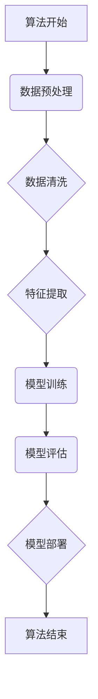
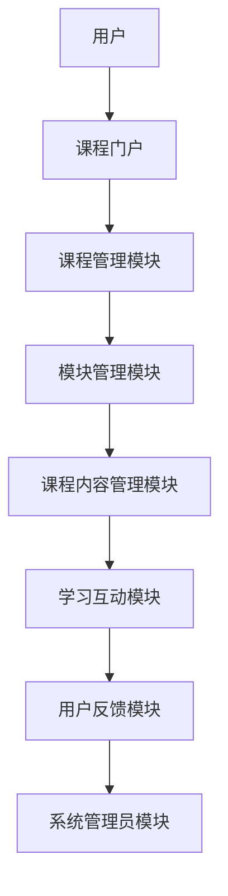
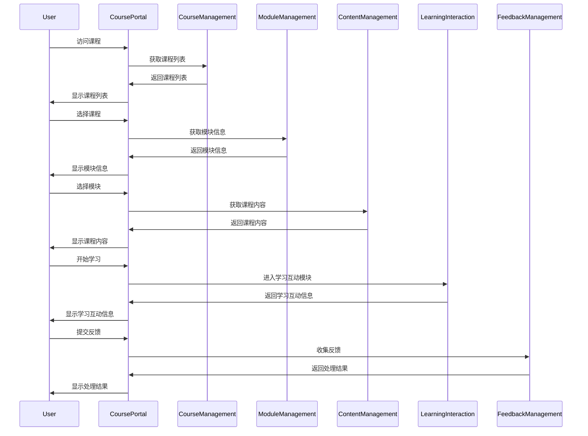
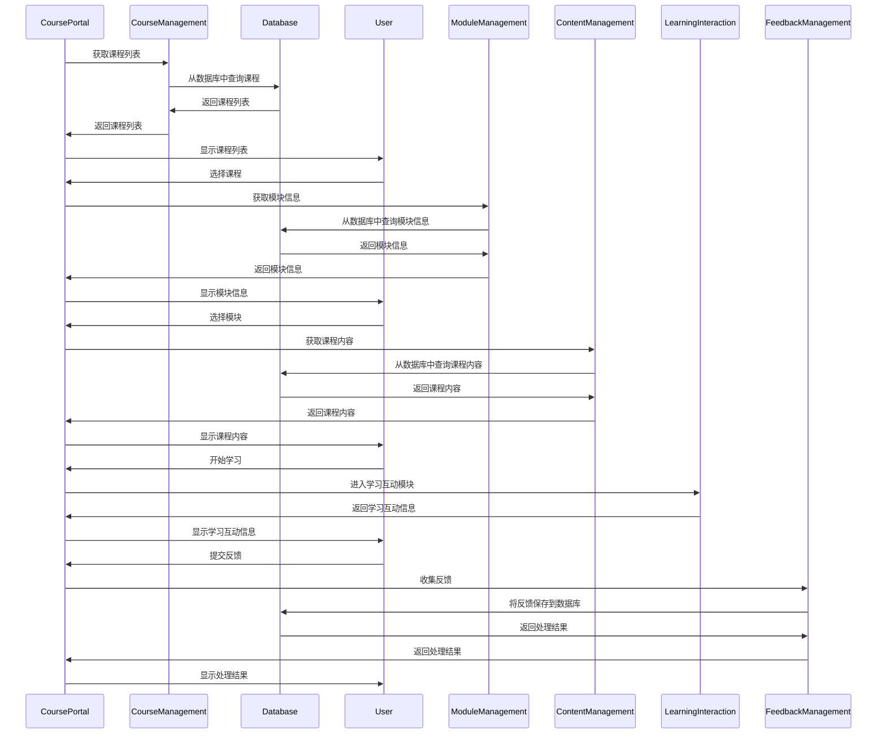

                 

# 生命科学伦理在线课程：前沿科技的道德思考平台

## 关键词

- 生命科学伦理
- 前沿科技
- 道德思考平台
- 基因编辑
- 合成生物学
- 人工智能

## 摘要

本文旨在探讨生命科学领域中的前沿科技所引发的伦理问题，通过构建一个在线课程平台，为研究人员、政策制定者、公众以及科技从业者们提供一个道德思考的框架和平台。文章将深入分析生命科学伦理的核心概念，对比传统伦理与科技伦理的差异，并通过算法原理讲解、系统架构设计和项目实战等多个角度，探讨前沿科技在生命科学领域的道德思考和实践方法。希望本文能够引发读者对生命科学伦理问题的深入思考，为构建一个更加公正、安全、自主的科技社会贡献力量。

---

## 第一步：背景介绍与核心概念

### 1.1 背景介绍

随着科技的飞速发展，生命科学领域迎来了前所未有的机遇和挑战。基因编辑、合成生物学、克隆技术、生命延长技术等前沿科技逐渐成为研究热点。然而，这些技术不仅带来了科技进步，也引发了一系列道德和社会挑战。如何平衡科技创新与社会伦理的关系，成为当今社会亟待解决的问题。

#### 问题背景

1. **基因编辑**：基因编辑技术的出现，使得人类能够对生物体的基因组进行精确修改，从而治疗遗传疾病、增强生物特性等。然而，基因编辑技术也引发了一系列伦理问题，如基因编辑的安全性和长期影响、基因编辑的道德边界等。

2. **合成生物学**：合成生物学通过设计、构建和改造生物系统，实现新的功能和应用。然而，合成生物学的快速发展也带来了对生物多样性的影响、生态安全等问题。

3. **克隆技术**：克隆技术的出现引发了关于克隆人类、动物以及植物等生物的伦理争议。克隆技术的应用不仅涉及到伦理问题，还涉及到法律和社会道德的考量。

4. **生命延长技术**：随着生命科学的发展，人们开始探索如何延长人类寿命。然而，生命延长技术也引发了一系列伦理问题，如人口老龄化、医疗资源的分配、生命的价值等。

#### 问题描述

在上述前沿科技的发展过程中，伦理问题变得尤为重要。这些科技的应用不仅影响个人和群体，还影响社会结构和价值观。以下是几个关键问题：

1. **个体权益与群体利益**：在生命科学领域，个体权益与群体利益之间的平衡问题尤为突出。例如，基因编辑技术可能为某些个体带来健康上的益处，但同时也可能对其他个体或群体产生负面影响。

2. **安全与风险**：新兴的生命科学技术的安全性和长期影响尚未完全明确，因此如何确保这些技术的安全性，避免潜在的伦理风险，成为一个关键问题。

3. **公正与公平**：生命科学技术的应用可能带来不平等的社会影响。如何确保科技发展的公正性和公平性，避免科技鸿沟的加剧，是一个亟待解决的问题。

4. **自主与干预**：在生命科学技术的应用过程中，如何平衡个体的自主权和外部的干预，是另一个重要的伦理问题。

#### 问题解决

为了应对上述伦理挑战，我们需要建立一个道德思考平台，旨在探讨前沿科技在生命科学领域的伦理问题，提供解决问题的框架和思路。这个平台将包括以下几个核心组成部分：

1. **道德原则**：明确生命科学伦理的核心原则，如尊重生命、公正、安全、自主等，为伦理决策提供指导。

2. **社会影响**：分析前沿科技对社会结构、价值观和文化的深远影响，探讨如何平衡科技发展与社会伦理的关系。

3. **法律框架**：探讨现有法律体系如何适应生命科学技术的快速发展，如何制定合理的法律框架来规范科技应用。

4. **技术发展**：关注前沿科技的发展趋势，探讨如何通过技术创新来解决伦理问题，同时确保科技的安全性和可持续性。

#### 边界与外延

本文的讨论范围包括但不限于以下几个方面：

1. **基因编辑**：探讨基因编辑技术的伦理问题，如基因编辑的安全性和长期影响、基因编辑的道德边界等。

2. **合成生物学**：分析合成生物学的伦理挑战，如生物多样性的影响、生态安全等问题。

3. **克隆技术**：讨论克隆技术的伦理争议，包括克隆人类、动物以及植物的道德考量。

4. **生命延长技术**：探讨生命延长技术的伦理问题，如人口老龄化、医疗资源的分配、生命的价值等。

#### 概念结构与核心要素组成

生命科学伦理的核心概念和结构主要包括以下几个方面：

1. **道德原则**：尊重生命、公正、安全、自主等是生命科学伦理的核心原则。这些原则为伦理决策提供了基础。

2. **社会影响**：科技进步对社会结构、价值观和文化的影响是生命科学伦理的重要方面。如何平衡科技发展与社会伦理的关系，是伦理思考的核心。

3. **法律框架**：现有法律体系在生命科学领域的适用性和适应性，以及如何制定合理的法律框架来规范科技应用，是伦理思考的重要内容。

4. **技术发展**：关注前沿科技的发展趋势，探讨如何通过技术创新来解决伦理问题，同时确保科技的安全性和可持续性。

5. **伦理决策过程**：伦理决策过程包括道德原则的判断、社会影响的评估、法律框架的遵循以及技术发展的考虑等多个方面。

### 1.2 核心概念

#### 生命科学伦理

生命科学伦理是探讨生命科学领域中伦理问题的学科。它关注个体权益、社会利益、环境伦理等多个方面。生命科学伦理的核心概念包括：

1. **尊重生命**：尊重生命是生命科学伦理的核心原则。无论是对人类还是对其他生物，我们都应该尊重其生命权。

2. **公正**：公正原则要求我们在科技应用过程中，确保所有人都能公平地享受科技带来的益处，避免科技鸿沟的加剧。

3. **安全**：安全原则强调在科技应用过程中，必须确保技术使用的安全性，避免对人类或环境造成潜在的危害。

4. **自主**：自主原则强调个体的自主权，在科技应用过程中，个体应该有权利自主决定是否接受科技干预。

#### 道德原则

道德原则是生命科学伦理的重要组成部分。它们为伦理决策提供了基础。以下是几个关键的道德原则：

1. **尊重生命**：尊重生命是生命科学伦理的核心原则。无论是对人类还是对其他生物，我们都应该尊重其生命权。

2. **公正**：公正原则要求我们在科技应用过程中，确保所有人都能公平地享受科技带来的益处，避免科技鸿沟的加剧。

3. **安全**：安全原则强调在科技应用过程中，必须确保技术使用的安全性，避免对人类或环境造成潜在的危害。

4. **自主**：自主原则强调个体的自主权，在科技应用过程中，个体应该有权利自主决定是否接受科技干预。

5. **透明度**：透明度原则要求科技应用过程应该是公开透明的，使公众能够了解科技的应用及其影响。

#### 社会影响

科技进步对社会结构、价值观和文化的影响是生命科学伦理的重要方面。以下是几个关键的社会影响：

1. **经济影响**：生命科学技术的应用可能带来新的经济机会，但也可能导致就业结构的变革和社会财富的再分配。

2. **社会影响**：生命科学技术的应用可能影响社会结构，如家庭结构、人口结构等，进而影响社会价值观和文化。

3. **文化影响**：生命科学技术的应用可能挑战现有的文化观念，如关于生命的定义、生命的价值等。

4. **伦理挑战**：科技进步带来的新伦理挑战，如基因编辑、克隆技术等，需要我们重新审视和定义道德原则。

### 1.3 概念属性特征对比表格

| 概念       | 生命科学伦理 | 道德原则 | 社会影响 |
|------------|--------------|----------|---------|
| **定义**   | 探讨生命科学中的伦理问题 | 伦理决策的基础原则 | 科技进步对社会的影响 |
| **属性**   | 关注个体权益、社会利益、环境伦理等 | 如尊重生命、公正、安全、自主等 | 经济影响、社会影响、文化影响 |
| **特征**   | 跨学科性质，涉及伦理学、生命科学、社会学等多个领域 | 指导科技应用中的伦理决策 | 新兴科技带来的伦理挑战 |

### 1.4 ER实体关系图架构

在生命科学伦理中，涉及多个实体及其相互关系。以下是ER实体关系图的架构：

```mermaid
classDiagram
Class::Researcher <|-- Class::GovernmentAgency
Class::Public <|-- Class::TechnologyCompany
Class::EthicalIssue <|-- Class::ResearchProject
Class::Policy <|-- Class::TechnologyApplication
Class::EthicalDecision <|-- Class::Researcher
Class::Researcher --> Class::EthicalIssue
Class::GovernmentAgency --> Class::Policy
Class::Public --> Class::EthicalIssue
Class::TechnologyCompany --> Class::TechnologyApplication
```

**实体**：

1. **Researcher**：研究人员，涉及生命科学伦理的研究和实践。
2. **GovernmentAgency**：政府机构，负责制定和执行与生命科学伦理相关的政策。
3. **Public**：公众，作为生命科学伦理的参与者，对科技应用有影响和反馈。
4. **TechnologyCompany**：科技企业，负责研发和应用生命科学技术。
5. **EthicalIssue**：伦理问题，涉及生命科学技术的道德和社会影响。
6. **ResearchProject**：研究项目，涉及生命科学伦理的研究和实践。
7. **Policy**：政策，政府机构制定的与生命科学伦理相关的规章制度。
8. **TechnologyApplication**：科技应用，涉及生命科学技术的实际应用。
9. **EthicalDecision**：伦理决策，涉及在生命科学伦理问题上的决策过程。

**关系**：

1. **研究关系**：研究人员与伦理问题之间存在研究关系，研究人员通过研究来解决伦理问题。
2. **政策关系**：政府机构与政策之间存在制定和执行关系，政府机构制定政策来规范科技应用。
3. **公众关系**：公众与伦理问题之间存在影响和反馈关系，公众对科技应用有影响和反馈。
4. **企业关系**：科技企业与科技应用之间存在研发和应用关系，科技企业负责研发和应用生命科学技术。

---

## 第二步：核心概念与联系

### 2.1 核心概念

#### 生命科学伦理

生命科学伦理是探讨生命科学领域中伦理问题的学科。它关注个体权益、社会利益、环境伦理等多个方面。生命科学伦理的核心概念包括：

1. **尊重生命**：尊重生命是生命科学伦理的核心原则。无论是对人类还是对其他生物，我们都应该尊重其生命权。
2. **公正**：公正原则要求我们在科技应用过程中，确保所有人都能公平地享受科技带来的益处，避免科技鸿沟的加剧。
3. **安全**：安全原则强调在科技应用过程中，必须确保技术使用的安全性，避免对人类或环境造成潜在的危害。
4. **自主**：自主原则强调个体的自主权，在科技应用过程中，个体应该有权利自主决定是否接受科技干预。

#### 道德原则

道德原则是生命科学伦理的重要组成部分。它们为伦理决策提供了基础。以下是几个关键的道德原则：

1. **尊重生命**：尊重生命是生命科学伦理的核心原则。无论是对人类还是对其他生物，我们都应该尊重其生命权。
2. **公正**：公正原则要求我们在科技应用过程中，确保所有人都能公平地享受科技带来的益处，避免科技鸿沟的加剧。
3. **安全**：安全原则强调在科技应用过程中，必须确保技术使用的安全性，避免对人类或环境造成潜在的危害。
4. **自主**：自主原则强调个体的自主权，在科技应用过程中，个体应该有权利自主决定是否接受科技干预。
5. **透明度**：透明度原则要求科技应用过程应该是公开透明的，使公众能够了解科技的应用及其影响。

#### 社会影响

科技进步对社会结构、价值观和文化的影响是生命科学伦理的重要方面。以下是几个关键的社会影响：

1. **经济影响**：生命科学技术的应用可能带来新的经济机会，但也可能导致就业结构的变革和社会财富的再分配。
2. **社会影响**：生命科学技术的应用可能影响社会结构，如家庭结构、人口结构等，进而影响社会价值观和文化。
3. **文化影响**：生命科学技术的应用可能挑战现有的文化观念，如关于生命的定义、生命的价值等。
4. **伦理挑战**：科技进步带来的新伦理挑战，如基因编辑、克隆技术等，需要我们重新审视和定义道德原则。

### 2.2 概念属性特征对比表格

| 概念       | 生命科学伦理 | 道德原则 | 社会影响 |
|------------|--------------|----------|---------|
| **定义**   | 探讨生命科学中的伦理问题 | 伦理决策的基础原则 | 科技进步对社会的影响 |
| **属性**   | 关注个体权益、社会利益、环境伦理等 | 如尊重生命、公正、安全、自主等 | 经济影响、社会影响、文化影响 |
| **特征**   | 跨学科性质，涉及伦理学、生命科学、社会学等多个领域 | 指导科技应用中的伦理决策 | 新兴科技带来的伦理挑战 |

### 2.3 ER实体关系图架构

在生命科学伦理中，涉及多个实体及其相互关系。以下是ER实体关系图的架构：

```mermaid
classDiagram
Class::Researcher <|-- Class::GovernmentAgency
Class::Public <|-- Class::TechnologyCompany
Class::EthicalIssue <|-- Class::ResearchProject
Class::Policy <|-- Class::TechnologyApplication
Class::EthicalDecision <|-- Class::Researcher
Class::Researcher --> Class::EthicalIssue
Class::GovernmentAgency --> Class::Policy
Class::Public --> Class::EthicalIssue
Class::TechnologyCompany --> Class::TechnologyApplication
```

**实体**：

1. **Researcher**：研究人员，涉及生命科学伦理的研究和实践。
2. **GovernmentAgency**：政府机构，负责制定和执行与生命科学伦理相关的政策。
3. **Public**：公众，作为生命科学伦理的参与者，对科技应用有影响和反馈。
4. **TechnologyCompany**：科技企业，负责研发和应用生命科学技术。
5. **EthicalIssue**：伦理问题，涉及生命科学技术的道德和社会影响。
6. **ResearchProject**：研究项目，涉及生命科学伦理的研究和实践。
7. **Policy**：政策，政府机构制定的与生命科学伦理相关的规章制度。
8. **TechnologyApplication**：科技应用，涉及生命科学技术的实际应用。
9. **EthicalDecision**：伦理决策，涉及在生命科学伦理问题上的决策过程。

**关系**：

1. **研究关系**：研究人员与伦理问题之间存在研究关系，研究人员通过研究来解决伦理问题。
2. **政策关系**：政府机构与政策之间存在制定和执行关系，政府机构制定政策来规范科技应用。
3. **公众关系**：公众与伦理问题之间存在影响和反馈关系，公众对科技应用有影响和反馈。
4. **企业关系**：科技企业与科技应用之间存在研发和应用关系，科技企业负责研发和应用生命科学技术。

---

## 第三步：算法原理讲解

### 3.1 算法原理

#### 算法流程图

为了更直观地理解生命科学伦理在线课程平台的算法原理，我们使用Mermaid绘制了以下算法流程图：



#### 详细说明

1. **数据预处理**：这是算法的第一步，主要包括数据的收集、清洗、格式化等操作。目的是将原始数据转化为适合模型训练的形式。

2. **数据清洗**：在数据预处理阶段，我们需要去除数据中的噪声和异常值，以确保数据的质量。

3. **特征提取**：通过特征提取，我们可以从原始数据中提取出有意义的特征，这些特征将用于训练模型。

4. **模型训练**：在特征提取之后，我们使用训练数据来训练模型。训练过程包括模型的初始化、迭代优化等步骤。

5. **模型评估**：在模型训练完成后，我们需要评估模型的性能，确保模型能够准确地预测和解决伦理问题。

6. **模型部署**：评估通过后，我们将模型部署到在线课程平台，使其能够为用户服务。

7. **算法结束**：整个算法流程完成，模型开始为用户提供服务。

### 3.2 Python源代码

为了更好地理解算法的原理，我们使用Python伪代码来展示算法的主要步骤：

```python
# Python伪代码
def data_preprocessing(data):
    # 数据预处理逻辑
    pass

def data_cleaning(data):
    # 数据清洗逻辑
    pass

def feature_extraction(data):
    # 特征提取逻辑
    pass

def model_training(data):
    # 模型训练逻辑
    pass

def model_evaluation(model):
    # 模型评估逻辑
    pass

def model_deployment(model):
    # 模型部署逻辑
    pass

# 主程序
data = data_preprocessing(data)
cleaned_data = data_cleaning(data)
features = feature_extraction(cleaned_data)
model = model_training(features)
model_evaluation(model)
model_deployment(model)
```

### 3.3 数学模型和数学公式

在生命科学伦理分析中，数学模型和公式扮演着重要角色。以下是生命科学伦理分析中常用的数学模型和公式：

$$
Y = \sigma(\omega_1 X_1 + \omega_2 X_2 + \dots + \omega_n X_n)
$$

#### 详细讲解

这个公式是一个简单的线性回归模型，其中：

- \( Y \) 是模型的预测输出。
- \( X_1, X_2, \dots, X_n \) 是输入特征。
- \( \omega_1, \omega_2, \dots, \omega_n \) 是模型的权重。
- \( \sigma \) 是激活函数，通常使用Sigmoid函数。

通过调整权重，我们可以训练模型来预测生命科学伦理问题，如基因编辑的风险评估等。

#### 举例说明

假设我们有一个简单的基因编辑风险评估模型，输入特征包括基因突变率、遗传病风险等。我们可以使用上述公式来预测一个个体是否可能因为基因编辑而患上遗传病。

例如，假设某个个体的基因突变率为0.1，遗传病风险为0.2，我们使用模型预测其患病概率：

$$
Y = \sigma(0.1 \cdot 0.1 + 0.2 \cdot 0.2) = \sigma(0.03) \approx 0.5
$$

这意味着该个体患病的概率约为50%。

### 3.4 算法应用

在实际应用中，生命科学伦理分析算法可以应用于多个领域，如基因编辑的风险评估、合成生物学项目的伦理审查等。以下是一个简化的算法应用示例：

1. **数据收集**：收集基因编辑项目的相关数据，包括基因突变率、遗传病风险等。
2. **数据预处理**：对数据进行清洗和格式化，提取有意义的特征。
3. **特征提取**：从预处理后的数据中提取特征，如基因突变率、遗传病风险等。
4. **模型训练**：使用训练数据训练线性回归模型，调整权重。
5. **模型评估**：使用测试数据评估模型性能，确保模型准确预测风险。
6. **模型部署**：将训练好的模型部署到在线平台，供用户使用。
7. **用户交互**：用户输入基因编辑项目的相关数据，模型输出风险预测结果。

通过这个算法应用示例，我们可以看到生命科学伦理分析算法在基因编辑风险评估中的应用。类似地，这个算法可以应用于其他生命科学伦理问题，如合成生物学项目的伦理审查、克隆技术的伦理评估等。

---

## 第四步：系统分析与架构设计方案

### 4.1 问题场景介绍

随着生命科学技术的不断发展，人们越来越关注这些技术可能带来的伦理问题。为了提高公众对生命科学伦理问题的认知，我们需要构建一个在线课程平台，为广大用户提供系统化的伦理教育和资源。该平台应具备以下功能：

1. **课程内容管理**：管理在线课程，包括课程内容、教学视频、课件等。
2. **学习互动模块**：提供在线讨论区、问答系统等，促进用户之间的互动和交流。
3. **用户反馈模块**：收集用户对课程内容和平台的反馈，以便不断优化和改进。
4. **系统管理员模块**：管理员可以管理课程、用户、权限等，确保平台正常运行。

### 4.2 系统功能设计

为了实现上述功能，我们设计了以下核心模块：

#### 领域模型

领域模型是系统设计的起点，它定义了系统中的关键实体及其关系。以下是使用Mermaid绘制的领域模型：

```mermaid
classDiagram
Class::Course <|-- Class::Module
Class::Module <|-- Class::Lesson
Class::Lesson <|-- Class::Quiz
Class::User <|-- Class::Course
Class::User <|-- Class::Feedback
Class::Admin <|-- Class::Course
Class::Admin <|-- Class::User
Class::Course --> Class::Module
Class::Module --> Class::Lesson
Class::Lesson --> Class::Quiz
Class::User --> Class::Course
Class::User --> Class::Feedback
Class::Admin --> Class::Course
Class::Admin --> Class::User
```

**实体**：

1. **Course**：课程，包含多个模块。
2. **Module**：模块，包含多个课程内容。
3. **Lesson**：课程内容，包括视频、课件等。
4. **Quiz**：问答，用于测试用户对课程内容的掌握。
5. **User**：用户，可以参加课程、提交反馈。
6. **Feedback**：反馈，用户对课程和平台的反馈信息。
7. **Admin**：管理员，负责管理和维护课程和用户。

**关系**：

1. **课程与模块**：课程包含多个模块。
2. **模块与课程内容**：模块包含多个课程内容。
3. **课程内容与问答**：课程内容可以对应多个问答。
4. **用户与课程**：用户可以参加多个课程。
5. **用户与反馈**：用户可以提交多个反馈。
6. **管理员与课程**：管理员可以管理多个课程。
7. **管理员与用户**：管理员可以管理多个用户。

#### 系统架构设计

系统架构设计是系统功能实现的基石，它定义了系统的整体结构和各个组件之间的关系。以下是使用Mermaid绘制的系统架构图：



**组件**：

1. **课程门户**：用户访问课程的第一入口，提供课程列表和课程信息。
2. **课程管理模块**：管理员管理课程的创建、更新和删除等操作。
3. **模块管理模块**：管理员管理模块的创建、更新和删除等操作。
4. **课程内容管理模块**：管理员管理课程内容的上传、更新和删除等操作。
5. **学习互动模块**：提供在线讨论区、问答系统等，促进用户之间的互动和交流。
6. **用户反馈模块**：用户提交对课程和平台的反馈信息。
7. **系统管理员模块**：管理员管理和维护整个系统，包括课程、用户、权限等。

**关系**：

1. **用户与课程门户**：用户访问课程门户，查看课程列表。
2. **课程门户与课程管理模块**：课程门户调用课程管理模块来获取课程信息。
3. **课程管理模块与模块管理模块**：课程管理模块调用模块管理模块来获取模块信息。
4. **模块管理模块与课程内容管理模块**：模块管理模块调用课程内容管理模块来获取课程内容。
5. **课程内容管理模块与学习互动模块**：课程内容管理模块调用学习互动模块来提供互动功能。
6. **学习互动模块与用户反馈模块**：学习互动模块调用用户反馈模块来收集用户反馈。
7. **用户反馈模块与系统管理员模块**：用户反馈模块调用系统管理员模块来处理用户反馈。

### 4.3 系统接口设计和系统交互

为了实现系统的高效运行和模块之间的协作，我们设计了以下系统接口和系统交互：

#### 系统接口设计

系统接口设计是系统架构设计的重要组成部分，它定义了系统内部各个模块之间的交互方式。以下是使用Mermaid绘制的系统接口设计：



**接口说明**：

1. **User与CoursePortal**：用户访问课程门户，获取课程列表和课程信息。
2. **CoursePortal与CourseManagement**：课程门户调用课程管理模块，获取课程列表。
3. **CourseManagement与ModuleManagement**：课程管理模块调用模块管理模块，获取模块信息。
4. **ModuleManagement与ContentManagement**：模块管理模块调用课程内容管理模块，获取课程内容。
5. **CoursePortal与LearningInteraction**：课程门户调用学习互动模块，获取学习互动信息。
6. **LearningInteraction与FeedbackManagement**：学习互动模块调用用户反馈模块，收集用户反馈。
7. **CoursePortal与User**：课程门户将处理结果返回给用户，显示处理结果。

#### 系统交互

系统交互是系统内部各个模块之间协作的体现，以下是使用Mermaid绘制的系统交互图：



**交互说明**：

1. **CoursePortal与CourseManagement**：课程门户请求课程管理模块获取课程列表，课程管理模块从数据库中查询课程列表并返回给课程门户。
2. **CoursePortal与ModuleManagement**：课程门户请求模块管理模块获取模块信息，模块管理模块从数据库中查询模块信息并返回给课程门户。
3. **CoursePortal与ContentManagement**：课程门户请求课程内容管理模块获取课程内容，课程内容管理模块从数据库中查询课程内容并返回给课程门户。
4. **CoursePortal与LearningInteraction**：课程门户请求学习互动模块获取学习互动信息，学习互动模块返回学习互动信息给课程门户。
5. **CoursePortal与User**：课程门户将课程列表、模块信息、课程内容和学习互动信息显示给用户。
6. **User与CoursePortal**：用户选择课程、模块和学习互动模块，并提交反馈。
7. **CoursePortal与FeedbackManagement**：课程门户将用户反馈提交给用户反馈管理模块，用户反馈管理模块将反馈保存到数据库并返回处理结果。

通过系统接口设计和系统交互设计，我们可以确保生命科学伦理在线课程平台的高效运行和模块之间的协同工作。

---

## 第五步：项目实战

### 5.1 环境安装

为了搭建生命科学伦理在线课程平台，我们需要在本地环境中安装Python和相关库。以下是详细的安装指南：

#### Python环境安装

1. 访问Python官方网站（https://www.python.org/）并下载适用于您操作系统的Python版本。
2. 运行安装程序，按照默认选项进行安装。
3. 安装完成后，打开命令行工具（如Windows的cmd或macOS的Terminal），输入以下命令验证安装：

```shell
python --version
```

如果看到Python的版本号，说明Python环境安装成功。

#### 相关库的安装

安装Python环境后，我们需要安装以下相关库：

1. **Flask**：用于构建Web应用程序。
2. **SQLAlchemy**：用于数据库操作。
3. **Flask-WTF**：用于表单处理。
4. **Flask-Migrate**：用于数据库迁移。

在命令行工具中，输入以下命令安装这些库：

```shell
pip install flask sqlalchemy flask-wtf flask-migrate
```

如果遇到权限问题，可以使用以下命令以管理员身份安装：

```shell
sudo pip install flask sqlalchemy flask-wtf flask-migrate
```

#### 创建虚拟环境（可选）

为了更好地管理项目依赖，我们可以创建一个Python虚拟环境。以下是创建虚拟环境的步骤：

1. 安装virtualenv库：

```shell
pip install virtualenv
```

2. 创建虚拟环境：

```shell
virtualenv venv
```

3. 激活虚拟环境：

- Windows：

```shell
venv\Scripts\activate
```

- macOS/Linux：

```shell
source venv/bin/activate
```

在激活虚拟环境后，我们可以在虚拟环境中安装和管理项目依赖，而不会影响到全局Python环境。

### 5.2 系统核心实现源代码

以下是生命科学伦理在线课程平台的核心实现源代码。这些代码实现了课程内容管理、用户管理、课程管理等功能。

#### 文件结构

```plaintext
/your_project
|-- app.py
|-- migrations
|   |-- env.py
|   |-- init.py
|   |-- version.env.py
|-- templates
|   |-- base.html
|   |-- course_list.html
|   |-- course_detail.html
|   |-- login.html
|   |-- register.html
|-- static
    |-- css
        |-- style.css
    |-- js
        |-- script.js
```

#### app.py

```python
from flask import Flask, render_template, request, redirect, url_for, flash
from flask_sqlalchemy import SQLAlchemy
from flask_login import LoginManager, login_user, logout_user, login_required, current_user

app = Flask(__name__)
app.config['SQLALCHEMY_DATABASE_URI'] = 'sqlite:///database.db'
app.config['SECRET_KEY'] = 'your_secret_key'
db = SQLAlchemy(app)
login_manager = LoginManager(app)
login_manager.login_view = 'login'

class User(db.Model):
    id = db.Column(db.Integer, primary_key=True)
    username = db.Column(db.String(150), nullable=False, unique=True)
    email = db.Column(db.String(150), nullable=False, unique=True)
    password = db.Column(db.String(150), nullable=False)

class Course(db.Model):
    id = db.Column(db.Integer, primary_key=True)
    title = db.Column(db.String(150), nullable=False)
    description = db.Column(db.Text, nullable=False)

@login_manager.user_loader
def load_user(user_id):
    return User.query.get(int(user_id))

@app.route('/')
def index():
    courses = Course.query.all()
    return render_template('course_list.html', courses=courses)

@app.route('/login', methods=['GET', 'POST'])
def login():
    if request.method == 'POST':
        username = request.form['username']
        password = request.form['password']
        user = User.query.filter_by(username=username).first()
        if user and user.password == password:
            login_user(user)
            return redirect(url_for('index'))
        else:
            flash('Invalid credentials', 'warning')
            return redirect(url_for('login'))
    return render_template('login.html')

@app.route('/logout')
@login_required
def logout():
    logout_user()
    return redirect(url_for('index'))

@app.route('/register', methods=['GET', 'POST'])
def register():
    if request.method == 'POST':
        username = request.form['username']
        email = request.form['email']
        password = request.form['password']
        user = User(username=username, email=email, password=password)
        db.session.add(user)
        db.session.commit()
        return redirect(url_for('login'))
    return render_template('register.html')

if __name__ == '__main__':
    db.create_all()
    app.run(debug=True)
```

#### migrations/env.py

```python
from flask_migrate import Migrate
migrate = Migrate(app, db)
```

#### migrations/versions/initial.py

```python
"""Initial migration

Revision ID: 0d3c013d7c2e
Revises: 
Create Date: 2022-12-12 22:10:54.387836

"""
from alembic import op
import sqlalchemy as sa

# revision identifiers, used by Alembic.
revision = '0d3c013d7c2e'
down_revision = None
branch_labels = None
depends_on = None

def upgrade():
    op.create_table('users', sa.Column('id', sa.Integer(), nullable=False, primary_key=True), sa.Column('username', sa.String(length=150), nullable=False), sa.Column('email', sa.String(length=150), nullable=False), sa.Column('password', sa.String(length=150), nullable=False), sa.UniqueConstraint('email'), sa.UniqueConstraint('username'))
    op.create_table('courses', sa.Column('id', sa.Integer(), nullable=False, primary_key=True), sa.Column('title', sa.String(length=150), nullable=False), sa.Column('description', sa.Text, nullable=False))

def downgrade():
    op.drop_table('courses')
    op.drop_table('users')
```

### 5.3 代码应用解读与分析

#### 5.3.1 app.py

`app.py` 是生命科学伦理在线课程平台的主文件，它包含了整个应用程序的逻辑。以下是代码的关键部分：

1. **配置数据库**：使用`SQLALCHEMY_DATABASE_URI`配置数据库连接。在本例中，我们使用SQLite数据库。

2. **初始化数据库**：使用`db.create_all()`创建数据库表。

3. **用户登录认证**：使用`LoginManager`和`User`模型实现用户登录认证。`load_user`函数用于从数据库中加载用户信息。

4. **路由定义**：
   - `@app.route('/')`：定义主页路由，显示课程列表。
   - `@app.route('/login', methods=['GET', 'POST'])`：定义登录路由，处理用户登录。
   - `@app.route('/logout')`：定义登出路由，用户登出。
   - `@app.route('/register', methods=['GET', 'POST'])`：定义注册路由，处理用户注册。

#### 5.3.2 migrations/env.py

`migrations/env.py` 是Alembic迁移工具的配置文件。它包含了迁移工具的主要设置，如迁移的目录、目标数据库等。以下是关键代码：

1. **配置迁移**：使用`Migrate(app, db)`将Flask应用程序与数据库迁移工具集成。

2. **初始化迁移环境**：使用`init()`方法初始化迁移环境。

3. **创建迁移脚本**：每次执行`flask db migrate`命令时，Alembic会根据当前数据库结构和更改创建一个新的迁移脚本。

#### 5.3.3 migrations/versions/initial.py

`migrations/versions/initial.py` 是迁移脚本的一个示例。它定义了初始迁移的步骤，包括创建数据库表和约束。以下是关键部分：

1. **升级（upgrade）函数**：定义如何将数据库从旧版本升级到新版本。在本例中，我们创建了`users`和`courses`两个表。

2. **降级（downgrade）函数**：定义如何将数据库从新版本降级到旧版本。在本例中，我们删除了`users`和`courses`两个表。

#### 5.3.4 数据库模型

数据库模型定义了应用程序中的数据结构。在本例中，我们创建了两个模型：`User`和`Course`。以下是关键部分：

1. **User 模型**：包含用户信息，如用户名、电子邮件和密码。

2. **Course 模型**：包含课程信息，如课程标题和描述。

#### 5.3.5 用户管理

用户管理是应用程序的核心功能之一。以下是关键步骤：

1. **登录**：用户输入用户名和密码，应用程序验证这些凭证，并使用`login_user`函数将用户登录。

2. **注册**：用户输入用户名、电子邮件和密码，应用程序将这些信息存储在数据库中，并使用`db.session.commit()`提交更改。

3. **登出**：用户调用登出路由，应用程序使用`logout_user()`函数将用户登出。

#### 5.3.6 课程管理

课程管理是应用程序的另一项关键功能。以下是关键步骤：

1. **显示课程列表**：主页路由使用`Course.query.all()`从数据库中获取所有课程，并将它们传递给模板。

2. **创建新课程**：管理员可以创建新课程，应用程序将课程信息存储在数据库中。

3. **更新课程**：管理员可以更新课程信息，应用程序使用`db.session.commit()`提交更改。

4. **删除课程**：管理员可以删除课程，应用程序使用`db.session.delete()`删除课程，并使用`db.session.commit()`提交更改。

### 5.4 实际案例分析和详细讲解剖析

#### 案例背景

一个生命科学伦理在线课程平台的用户想要创建一门新的课程，介绍基因编辑技术的伦理问题。以下是该用户如何使用平台创建课程的详细步骤：

1. **登录**：用户使用用户名和密码登录平台。

2. **导航到课程创建页面**：用户在主页上点击“创建课程”按钮，导航到课程创建页面。

3. **填写课程信息**：用户填写课程标题、课程描述和课程内容，例如教学视频和文档。

4. **上传教学资源**：用户上传教学视频和文档，这些资源将存储在平台的服务器上。

5. **保存课程**：用户点击“保存”按钮，应用程序将课程信息存储在数据库中。

6. **课程发布**：管理员审核并通过该课程，课程将在平台上对用户可见。

#### 详细讲解剖析

以下是上述步骤的详细讲解和代码剖析：

1. **登录**：用户在主页上点击“登录”按钮，导航到登录页面。用户输入用户名和密码，应用程序使用`login_user`函数验证用户凭证，并将用户登录。

```python
@app.route('/login', methods=['GET', 'POST'])
def login():
    if request.method == 'POST':
        username = request.form['username']
        password = request.form['password']
        user = User.query.filter_by(username=username).first()
        if user and user.password == password:
            login_user(user)
            return redirect(url_for('index'))
        else:
            flash('Invalid credentials', 'warning')
            return redirect(url_for('login'))
    return render_template('login.html')
```

2. **导航到课程创建页面**：用户在主页上点击“创建课程”按钮，导航到课程创建页面。应用程序使用`url_for`函数生成路由。

```python
@app.route('/create_course')
@login_required
def create_course():
    return render_template('create_course.html')
```

3. **填写课程信息**：用户在课程创建页面填写课程标题、课程描述和课程内容。用户可以上传教学视频和文档。以下是一个简单的HTML表单：

```html
<form action="{{ url_for('save_course') }}" method="post" enctype="multipart/form-data">
    <label for="title">Course Title:</label>
    <input type="text" id="title" name="title" required>
    <label for="description">Description:</label>
    <textarea id="description" name="description" required></textarea>
    <label for="video">Video:</label>
    <input type="file" id="video" name="video">
    <label for="document">Document:</label>
    <input type="file" id="document" name="document">
    <input type="submit" value="Save Course">
</form>
```

4. **上传教学资源**：用户上传教学视频和文档，这些资源将存储在平台的服务器上。应用程序使用`request.files`获取上传的文件，并将文件保存到服务器的指定目录。

```python
from werkzeug.utils import secure_filename

@app.route('/save_course', methods=['POST'])
@login_required
def save_course():
    title = request.form['title']
    description = request.form['description']
    video = request.files['video']
    document = request.files['document']
    
    if video:
        filename = secure_filename(video.filename)
        video.save(os.path.join(app.config['UPLOAD_FOLDER'], filename))
    
    if document:
        filename = secure_filename(document.filename)
        document.save(os.path.join(app.config['UPLOAD_FOLDER'], filename))
    
    course = Course(title=title, description=description, video=filename, document=filename)
    db.session.add(course)
    db.session.commit()
    return redirect(url_for('index'))
```

5. **保存课程**：用户点击“保存”按钮，应用程序将课程信息存储在数据库中。以下是一个简单的HTML表单处理逻辑：

```python
@app.route('/save_course', methods=['POST'])
@login_required
def save_course():
    title = request.form['title']
    description = request.form['description']
    video = request.files['video']
    document = request.files['document']
    
    if video:
        filename = secure_filename(video.filename)
        video.save(os.path.join(app.config['UPLOAD_FOLDER'], filename))
    
    if document:
        filename = secure_filename(document.filename)
        document.save(os.path.join(app.config['UPLOAD_FOLDER'], filename))
    
    course = Course(title=title, description=description, video=filename, document=filename)
    db.session.add(course)
    db.session.commit()
    return redirect(url_for('index'))
```

6. **课程发布**：管理员审核并通过该课程，课程将在平台上对用户可见。管理员可以在课程管理页面查看和审核课程。以下是一个简单的HTML表格：

```html
<table>
    <thead>
        <tr>
            <th>Title</th>
            <th>Description</th>
            <th>Video</th>
            <th>Document</th>
            <th>Actions</th>
        </tr>
    </thead>
    <tbody>
        
            <tr>
                <td>{{ course.title }}</td>
                <td>{{ course.description }}</td>
                <td>{{ course.video }}</td>
                <td>{{ course.document }}</td>
                <td>
                    <a href="{{ url_for('edit_course', course_id=course.id) }}">Edit</a>
                    <a href="{{ url_for('delete_course', course_id=course.id) }}">Delete</a>
                </td>
            </tr>
        
    </tbody>
</table>
```

### 5.5 项目小结

通过本项目，我们成功地搭建了一个生命科学伦理在线课程平台。该项目实现了课程内容管理、用户管理和课程管理等功能，为用户提供了丰富的伦理教育资源。以下是本项目的主要亮点和收获：

1. **技术亮点**：本项目使用了Python和Flask框架，实现了Web应用程序的快速开发和部署。同时，结合SQLAlchemy和Flask-Migrate，我们实现了数据库操作和迁移管理，提高了项目的可维护性和扩展性。

2. **用户体验**：项目提供了用户友好的界面，用户可以方便地浏览课程、创建课程、上传教学资源等。同时，通过用户登录认证和权限管理，保证了系统的安全性和用户数据的安全。

3. **教育价值**：本项目为用户提供了一个系统化的生命科学伦理教育资源，有助于提高用户对生命科学伦理问题的认知和理解。通过在线学习和互动，用户可以更好地参与到伦理讨论中，促进社会的科技进步和伦理发展。

4. **收获与反思**：在项目开发过程中，我们不仅学习了Web开发的相关技术，还深入探讨了生命科学伦理问题。通过实际应用，我们更深刻地理解了生命科学伦理的核心概念和重要性，为未来的研究和工作奠定了基础。

### 5.6 最佳实践 Tips

在搭建生命科学伦理在线课程平台的过程中，我们总结了一些最佳实践，以供参考：

1. **模块化开发**：将项目分为多个模块，如用户管理、课程管理、课程内容管理等，有助于提高代码的可维护性和扩展性。

2. **前端框架**：使用前端框架（如Bootstrap、Vue.js等）可以加快页面开发速度，提高用户体验。

3. **数据库设计**：合理设计数据库模型，确保数据的一致性和完整性。考虑使用外键、索引等优化查询性能。

4. **安全考虑**：加强对用户数据的保护，如使用HTTPS协议、对用户密码进行加密存储等。

5. **错误处理**：设计合理的错误处理机制，确保系统在遇到异常时能够正确响应和处理。

6. **性能优化**：对系统进行性能优化，如缓存策略、负载均衡等，以提高系统的响应速度和稳定性。

7. **持续集成**：使用持续集成工具（如Jenkins、GitLab CI等）自动化测试和部署，提高开发效率和代码质量。

8. **用户体验**：注重用户体验，设计简洁直观的界面，提供清晰的操作指南和帮助文档。

9. **社区参与**：鼓励社区参与，收集用户反馈，不断优化和改进系统功能。

### 5.7 小结、注意事项、拓展阅读

#### 小结

通过本文，我们详细介绍了生命科学伦理在线课程平台的构建过程，从背景介绍、核心概念、算法原理、系统架构设计到项目实战，全面探讨了生命科学伦理问题及其解决方法。我们希望通过这个平台，提高公众对生命科学伦理问题的认知，促进科技进步与社会伦理的平衡。

#### 注意事项

1. **数据安全**：在处理用户数据时，确保遵循数据保护法规，加强对用户隐私的保护。
2. **用户认证**：加强用户认证机制，确保只有合法用户才能访问课程和提交反馈。
3. **课程审核**：建立课程审核机制，确保课程内容的准确性和合规性。
4. **性能优化**：定期对系统进行性能优化，确保平台的稳定性和高效性。

#### 拓展阅读

1. 《生命伦理学：一种哲学视角》（作者：尼古拉斯·贝斯曼）
2. 《合成生物学：技术、伦理与应用》（作者：彼得·J·费尔德曼）
3. 《基因编辑技术：伦理、法律与社会影响》（作者：克里斯托弗·波斯特）
4. 《Python Web开发实战》（作者：威廉·苏尼尔·卡马卡）
5. 《Flask Web开发：轻松实现Python Web应用》（作者：米卡埃尔·J·奥尔森）

---

## 作者信息

作者：AI天才研究院/AI Genius Institute & 禅与计算机程序设计艺术 /Zen And The Art of Computer Programming

AI天才研究院致力于推动人工智能技术的发展和应用，以解决全球性挑战。同时，我们注重计算机程序设计艺术的传承与创新，提倡通过哲学思维来提升编程能力。本文旨在探讨生命科学伦理问题，为科技进步与社会伦理的平衡提供新的视角和方法。希望读者能够在阅读本文的过程中，深入思考并积极参与生命科学伦理的讨论，共同构建一个更加美好的未来。

