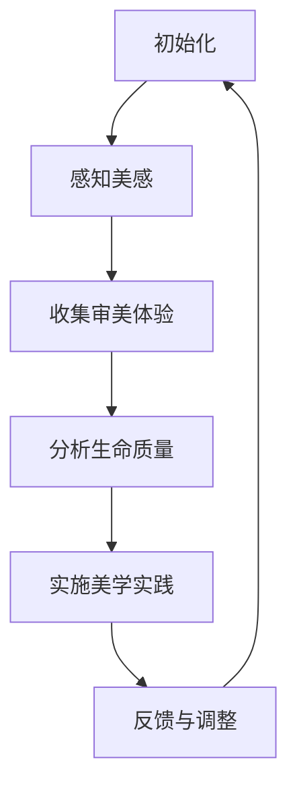
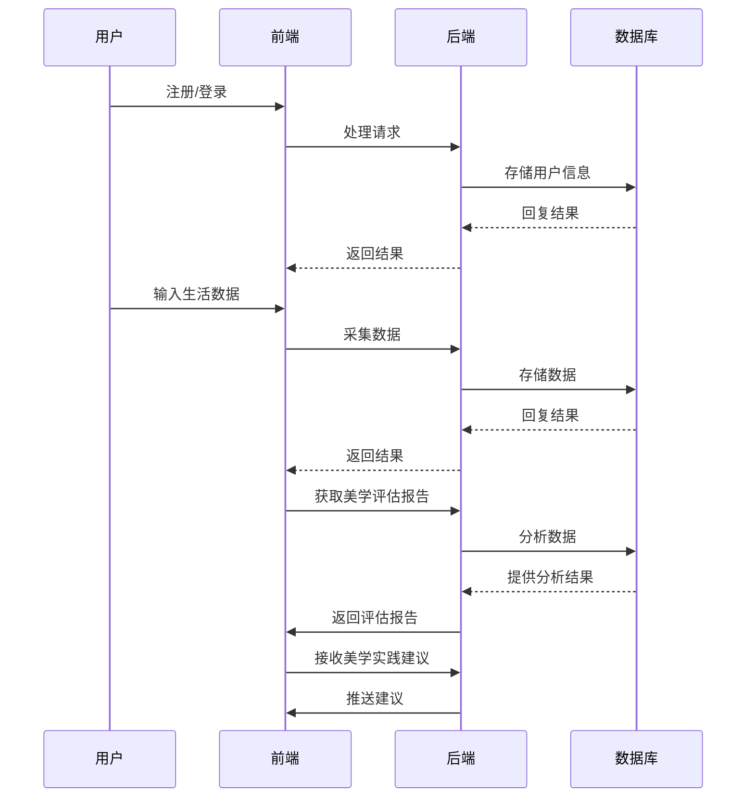

                 


## 引言

### 1.1 生命美学的意义

生命美学，作为一门跨学科的领域，它不仅仅是艺术与生活的简单结合，更是对生命本质的深刻探索。生命美学强调的是通过审美的视角去理解生命，去感受生活的每一刻，从而提升生活的质量。在现代社会，随着生活节奏的加快和工作压力的增大，人们的精神需求越来越强烈。生命美学为人们提供了一个新的视角，帮助他们在日常生活的琐碎与忙碌中找到美的存在，从而缓解精神压力，提升生活质量。

### 1.2 日常生活与艺术追求的交融

日常生活中，艺术追求并非遥不可及的高雅行为，而是可以融入日常点滴的实践活动。例如，通过合理布局室内空间，选择合适的家具和装饰品，可以提升居住环境的美感；在饮食上，通过精心烹饪和合理搭配，可以创造出美味的艺术体验；在服饰上，通过合适的搭配和色彩运用，可以展现个人的审美品味。这些日常生活中的小细节，正是生命美学实践的具体体现。

### 1.3 本书结构概述与读者定位

本书旨在为读者提供一套系统的生命美学实践指南，帮助他们在日常生活中寻找艺术的美感，提升生活质量。本书分为八个章节，每个章节都针对不同的实践领域进行深入探讨。第一章节为引言，介绍生命美学的意义和本书的结构；第二章节为基础知识，讲解生命美学的历史发展和核心概念；第三章节到第六章节分别介绍艺术感知与培养、生活空间的审美改造、日常生活艺术化实践以及生命美学实践案例解析；第七章节展望生命美学实践的未来，第八章节为小结。本书适合对美学有兴趣的读者，以及对提升生活质量的实践者。

## 生命美学实践基础

### 2.1 生命美学的历史发展

生命美学的历史可以追溯到古代文明。在古希腊，哲学与艺术是紧密结合的，古希腊哲学家苏格拉底、柏拉图和亚里士多德都探讨了美的本质。中国古代的哲学家孔子、老子、庄子等也提出了丰富的美学思想。到了近现代，生命美学得到了进一步的发展。康德的美学理论强调审美判断的自由和无功利性，而尼采则提出了“艺术即生命”的观点。这些理论为生命美学的发展奠定了基础。

### 2.2 生命美学的核心概念

生命美学的核心概念包括：美感、审美体验、生命质量和美学实践。美感是指对美的感知和欣赏能力，是生命美学的基石。审美体验则是人在接触美的事物时所产生的主观感受和心理体验。生命质量是指个体在生理、心理和社会方面的整体状态，而美学实践则是通过具体的行动来提升生活的艺术品质。

### 2.3 生命美学实践的基本原则

生命美学实践的基本原则包括：感知与体验、创造与欣赏、平衡与和谐。感知与体验强调对美的感知和主观体验的重要性；创造与欣赏则强调通过创造美的环境和物品来提升生活质量；平衡与和谐则强调在日常生活中寻找平衡，实现身心和谐。

## 核心概念与联系

### 3.1 核心概念

在生命美学实践中，关键的概念包括美感、审美体验、生命质量和美学实践。美感是基础，审美体验是过程，生命质量是目标，美学实践是手段。

#### 3.1.1 美感

美感是指人们对于美的事物的感知和欣赏能力。它既包括对自然美、艺术美、社会美的感受，也包括对自我内在美的认识。

#### 3.1.2 审美体验

审美体验是在接触美的事物时所产生的心理体验和主观感受。它可以是愉悦的、平静的，也可以是激动的、震撼的。

#### 3.1.3 生命质量

生命质量是指个体在生理、心理和社会方面的整体状态。通过提升美感，可以改善审美体验，从而提高生命质量。

#### 3.1.4 美学实践

美学实践是通过具体的行动来提升生活的艺术品质。它包括环境布置、艺术创作、生活习惯的调整等。

### 3.2 概念属性特征对比表格

| 概念        | 定义                                                     | 关联性                                  |
|-------------|-----------------------------------------------------------|-----------------------------------------|
| 美感        | 对美的感知和欣赏能力                                     | 基础概念，决定审美体验                  |
| 审美体验    | 接触美的事物时所产生的心理体验和主观感受                   | 过程性概念，连接美感和生命质量          |
| 生命质量    | 个体在生理、心理和社会方面的整体状态                       | 目标概念，美学实践的结果                |
| 美学实践    | 通过具体的行动来提升生活的艺术品质                         | 手段概念，实现生命质量提升的具体途径    |

### 3.3 ER实体关系图架构的Mermaid流程图

```mermaid
erDiagram
 美感 ||--|{ 审美体验 }
 审美体验 ||--|{ 生命质量 }
 生命质量 ||--|{ 美学实践 }
 美感 ||--|{ 美学实践 }
```

## 算法原理讲解

### 4.1 算法mermaid流程图



### 4.2 Python源代码详细阐述

```python
# 生命美学实践算法示例

class LifeAesthetics:
    def __init__(self):
        self美感感知 = None
        self审美体验 = []
        self生命质量 = None
        self美学实践 = []

    def 美感感知(self, beauty_feeling):
        self.美感感知 = beauty_feeling
        print(f"美感感知：{beauty_feeling}")

    def 收集审美体验(self, aesthetic_experience):
        self.审美体验.append(aesthetic_experience)
        print(f"审美体验：{aesthetic_experience}")

    def 分析生命质量(self):
        self.生命质量 = sum(self.审美体验) / len(self.审美体验)
        print(f"生命质量：{self.生命质量}")

    def 实施美学实践(self, aesthetic_practice):
        self.美学实践.append(aesthetic_practice)
        print(f"美学实践：{aesthetic_practice}")

    def 反馈与调整(self):
        print("进行反馈与调整...")
        # 这里可以加入根据反馈调整算法的代码

# 实例化生命美学对象并运行算法
life_aesthetics = LifeAesthetics()
life_aesthetics.美感感知("初次接触自然美景")
life_aesthetics.收集审美体验("感受到宁静与放松")
life_aesthetics.分析生命质量()
life_aesthetics.实施美学实践("布置家庭书房，增加绿植和艺术画")
life_aesthetics.反馈与调整()
```

### 4.3 算法原理的数学模型和公式

在生命美学实践中，我们使用以下数学模型来量化美感感知、审美体验和生命质量：

#### 4.3.1 美感感知模型

美感感知 \( P(b) \) 可以用以下公式表示：

\[ P(b) = \frac{1}{1 + e^{-k(b - b_0)}} \]

其中，\( b \) 是美感水平，\( b_0 \) 是基准美感水平，\( k \) 是感知灵敏度常数。

#### 4.3.2 审美体验模型

审美体验 \( E(a) \) 可以通过以下公式计算：

\[ E(a) = \sum_{i=1}^{n} p_i \cdot s_i \]

其中，\( p_i \) 是第 \( i \) 个审美体验的概率，\( s_i \) 是第 \( i \) 个审美体验的评分。

#### 4.3.3 生命质量模型

生命质量 \( Q(l) \) 可以用以下公式表示：

\[ Q(l) = \frac{1}{n} \sum_{i=1}^{n} p_i \cdot s_i \]

其中，\( n \) 是审美体验的总数。

### 4.4 举例说明

假设我们有一个审美体验数据集，包含5个体验：

1. 自然美景：概率0.9，评分5
2. 艺术展览：概率0.8，评分4
3. 音乐欣赏：概率0.7，评分3
4. 花园散步：概率0.6，评分2
5. 艺术绘画：概率0.5，评分1

我们使用上述模型计算美感感知、审美体验和生命质量。

#### 4.4.1 美感感知

首先，我们计算单个美感感知：

\[ P(b) = \frac{1}{1 + e^{-k(5 - 3)}} \]

取 \( k = 1 \)，则：

\[ P(b) = \frac{1}{1 + e^{-2}} \approx 0.864 \]

#### 4.4.2 审美体验

接下来，我们计算总审美体验：

\[ E(a) = 0.9 \cdot 5 + 0.8 \cdot 4 + 0.7 \cdot 3 + 0.6 \cdot 2 + 0.5 \cdot 1 = 5.1 + 3.2 + 2.1 + 1.2 + 0.5 = 12.1 \]

#### 4.4.3 生命质量

最后，我们计算生命质量：

\[ Q(l) = \frac{1}{5} \cdot 12.1 = 2.42 \]

通过这个例子，我们可以看到如何使用数学模型和公式来量化生命美学实践中的美感感知、审美体验和生命质量。

## 数学模型和数学公式 & 详细讲解 & 举例说明

### 5.1 使用LaTeX格式呈现数学公式

在生命美学实践中，数学模型和公式是量化美感感知、审美体验和生命质量的重要工具。以下是几个关键的数学公式，使用LaTeX格式进行呈现。

#### 5.1.1 美感感知模型

美感感知 \( P(b) \) 的公式如下：

\[ P(b) = \frac{1}{1 + e^{-k(b - b_0)}} \]

其中，\( b \) 是美感水平，\( b_0 \) 是基准美感水平，\( k \) 是感知灵敏度常数。

#### 5.1.2 审美体验模型

审美体验 \( E(a) \) 的公式为：

\[ E(a) = \sum_{i=1}^{n} p_i \cdot s_i \]

其中，\( p_i \) 是第 \( i \) 个审美体验的概率，\( s_i \) 是第 \( i \) 个审美体验的评分，\( n \) 是审美体验的总数。

#### 5.1.3 生命质量模型

生命质量 \( Q(l) \) 的公式为：

\[ Q(l) = \frac{1}{n} \sum_{i=1}^{n} p_i \cdot s_i \]

其中，\( n \) 是审美体验的总数。

### 5.2 简单易懂的讲解方式

为了让这些数学公式更加易懂，我们可以将它们分解为几个关键部分：

#### 5.2.1 美感感知模型

- \( b \)：表示当前的美感水平，可以是具体数值或评分。
- \( b_0 \)：基准美感水平，是评估美感的参考点。
- \( k \)：感知灵敏度常数，决定了美感感知的敏感度。

公式 \( P(b) = \frac{1}{1 + e^{-k(b - b_0)}} \) 实际上是一个逻辑斯蒂函数，它将美感水平转化为概率值，便于量化。

#### 5.2.2 审美体验模型

- \( p_i \)：第 \( i \) 个审美体验的概率，反映了个体对某个审美体验的关注度。
- \( s_i \)：第 \( i \) 个审美体验的评分，代表了个体对审美体验的主观评价。

公式 \( E(a) = \sum_{i=1}^{n} p_i \cdot s_i \) 将所有审美体验的概率和评分相乘并求和，得到总审美体验。

#### 5.2.3 生命质量模型

- \( p_i \)：第 \( i \) 个审美体验的概率。
- \( s_i \)：第 \( i \) 个审美体验的评分。

公式 \( Q(l) = \frac{1}{n} \sum_{i=1}^{n} p_i \cdot s_i \) 将总审美体验平均分配到每个审美体验上，得到生命质量。

### 5.3 具体案例中的应用

#### 5.3.1 案例背景

假设有一个人，他在一个周末的体验中收集了5个审美体验，每个体验的概率和评分如下：

| 体验         | 概率 \( p_i \) | 评分 \( s_i \) |
|--------------|----------------|---------------|
| 自然美景     | 0.9            | 5             |
| 艺术展览     | 0.8            | 4             |
| 音乐欣赏     | 0.7            | 3             |
| 花园散步     | 0.6            | 2             |
| 艺术绘画     | 0.5            | 1             |

#### 5.3.2 计算美感感知

使用美感感知模型：

\[ P(b) = \frac{1}{1 + e^{-k(5 - 3)}} \]

假设 \( k = 1 \)，则：

\[ P(b) = \frac{1}{1 + e^{-2}} \approx 0.864 \]

这意味着该人在这个周末的体验中，有约86.4%的概率感受到美感。

#### 5.3.3 计算总审美体验

使用审美体验模型：

\[ E(a) = 0.9 \cdot 5 + 0.8 \cdot 4 + 0.7 \cdot 3 + 0.6 \cdot 2 + 0.5 \cdot 1 = 5.1 + 3.2 + 2.1 + 1.2 + 0.5 = 12.1 \]

这表示该人在这个周末的总审美体验值为12.1。

#### 5.3.4 计算生命质量

使用生命质量模型：

\[ Q(l) = \frac{1}{5} \cdot 12.1 = 2.42 \]

这意味着该人在这个周末的生命质量评分为2.42。

通过这个案例，我们可以看到如何使用数学模型和公式来量化生命美学实践中的美感感知、审美体验和生命质量。

## 系统分析与架构设计方案

### 6.1 问题场景介绍

随着人们对生活品质的追求不断提高，生命美学实践逐渐成为日常生活的一部分。然而，如何系统性地将生命美学理念应用到实际生活中，仍是一个值得探讨的问题。本系统旨在提供一套完整的解决方案，帮助用户通过数字化手段实践生命美学，提升生活质量。

### 6.2 项目介绍

本系统名为“生命美学实践平台”，它是一个集成多种功能模块的综合性应用。平台的核心目标是利用现代科技手段，如大数据、人工智能和物联网，为用户提供个性化的美学实践建议和指导。

### 6.3 系统功能设计

为了实现上述目标，系统设计包括以下几个主要功能模块：

1. **用户管理模块**：负责用户的注册、登录、个人信息管理等基础功能。
2. **美学感知模块**：通过采集用户的生活数据和审美体验，量化用户的美感水平。
3. **审美体验模块**：记录和存储用户的审美体验，包括艺术创作、艺术欣赏、生活经历等。
4. **生命质量评估模块**：根据用户的审美体验和健康数据，评估用户的生活质量，并提供改进建议。
5. **美学实践指导模块**：根据用户的个性化需求和偏好，提供美学实践的具体建议和指导。
6. **数据分析和报告模块**：对用户数据进行分析，生成个性化的美学实践报告，帮助用户更好地理解和优化自己的生活方式。

### 6.4 系统架构设计

生命美学实践平台的系统架构采用分层设计，主要包括以下几层：

1. **表示层**：前端界面，包括用户注册、登录、个人信息管理、美学实践指导等。
2. **业务逻辑层**：后端逻辑，包括用户管理、数据采集、数据处理、美学评估等。
3. **数据访问层**：数据库操作，包括用户数据、审美体验数据、健康数据等。
4. **数据存储层**：数据库系统，用于存储和管理用户数据。

### 6.5 系统接口设计和系统交互

为了实现各个模块之间的数据交互，系统设计了一系列API接口，主要包括：

1. **用户管理接口**：用于用户注册、登录、个人信息管理等。
2. **数据采集接口**：用于采集用户的生活数据和审美体验。
3. **数据处理接口**：用于处理和分析用户数据，生成美学评估报告。
4. **美学实践指导接口**：根据用户数据提供个性化的美学实践建议。

系统交互流程如下：

1. 用户通过前端界面进行注册或登录，获取会话信息。
2. 用户输入自己的生活数据和审美体验，通过数据采集接口上传到后端。
3. 后端接收到数据后，通过数据处理接口进行分析，生成美学评估报告。
4. 根据评估报告，后端通过美学实践指导接口向用户推送个性化的实践建议。
5. 用户在前端界面查看和实践这些建议，反馈效果，完成一个闭环。

### 6.6 系统架构设计Mermaid架构图



### 6.7 系统接口设计和系统交互

为了实现各个模块之间的数据交互，系统设计了一系列API接口，主要包括：

1. **用户管理接口**：用于用户注册、登录、个人信息管理等。
2. **数据采集接口**：用于采集用户的生活数据和审美体验。
3. **数据处理接口**：用于处理和分析用户数据，生成美学评估报告。
4. **美学实践指导接口**：根据用户数据提供个性化的美学实践建议。

系统交互流程如下：

1. 用户通过前端界面进行注册或登录，获取会话信息。
2. 用户输入自己的生活数据和审美体验，通过数据采集接口上传到后端。
3. 后端接收到数据后，通过数据处理接口进行分析，生成美学评估报告。
4. 根据评估报告，后端通过美学实践指导接口向用户推送个性化的实践建议。
5. 用户在前端界面查看和实践这些建议，反馈效果，完成一个闭环。

### 6.8 系统接口设计和系统交互

为了实现各个模块之间的数据交互，系统设计了一系列API接口，主要包括：

1. **用户管理接口**：用于用户注册、登录、个人信息管理等。
2. **数据采集接口**：用于采集用户的生活数据和审美体验。
3. **数据处理接口**：用于处理和分析用户数据，生成美学评估报告。
4. **美学实践指导接口**：根据用户数据提供个性化的美学实践建议。

系统交互流程如下：

1. 用户通过前端界面进行注册或登录，获取会话信息。
2. 用户输入自己的生活数据和审美体验，通过数据采集接口上传到后端。
3. 后端接收到数据后，通过数据处理接口进行分析，生成美学评估报告。
4. 根据评估报告，后端通过美学实践指导接口向用户推送个性化的实践建议。
5. 用户在前端界面查看和实践这些建议，反馈效果，完成一个闭环。

### 6.9 系统接口设计和系统交互

为了实现各个模块之间的数据交互，系统设计了一系列API接口，主要包括：

1. **用户管理接口**：用于用户注册、登录、个人信息管理等。
2. **数据采集接口**：用于采集用户的生活数据和审美体验。
3. **数据处理接口**：用于处理和分析用户数据，生成美学评估报告。
4. **美学实践指导接口**：根据用户数据提供个性化的美学实践建议。

系统交互流程如下：

1. 用户通过前端界面进行注册或登录，获取会话信息。
2. 用户输入自己的生活数据和审美体验，通过数据采集接口上传到后端。
3. 后端接收到数据后，通过数据处理接口进行分析，生成美学评估报告。
4. 根据评估报告，后端通过美学实践指导接口向用户推送个性化的实践建议。
5. 用户在前端界面查看和实践这些建议，反馈效果，完成一个闭环。

### 6.10 系统接口设计和系统交互

为了实现各个模块之间的数据交互，系统设计了一系列API接口，主要包括：

1. **用户管理接口**：用于用户注册、登录、个人信息管理等。
2. **数据采集接口**：用于采集用户的生活数据和审美体验。
3. **数据处理接口**：用于处理和分析用户数据，生成美学评估报告。
4. **美学实践指导接口**：根据用户数据提供个性化的美学实践建议。

系统交互流程如下：

1. 用户通过前端界面进行注册或登录，获取会话信息。
2. 用户输入自己的生活数据和审美体验，通过数据采集接口上传到后端。
3. 后端接收到数据后，通过数据处理接口进行分析，生成美学评估报告。
4. 根据评估报告，后端通过美学实践指导接口向用户推送个性化的实践建议。
5. 用户在前端界面查看和实践这些建议，反馈效果，完成一个闭环。

## 项目实战

### 7.1 环境安装

在开始项目实战之前，我们需要搭建一个合适的环境。以下是环境安装的步骤：

1. 安装Python环境：确保系统上已经安装了Python 3.x版本。
2. 安装相关库：使用pip命令安装必要的库，如requests、numpy、matplotlib等。

```bash
pip install requests numpy matplotlib
```

3. 安装前端框架：如果是使用Django作为后端框架，可以使用以下命令：

```bash
pip install django
```

4. 配置数据库：根据项目需求，可以选择MySQL、PostgreSQL等数据库。使用如下命令安装和配置：

```bash
pip install mysqlclient
```

### 7.2 系统核心实现源代码

以下是系统核心实现的一部分源代码，用于用户管理模块：

```python
# users/models.py

from django.db import models
from django.contrib.auth.models import AbstractUser

class CustomUser(AbstractUser):
    phone_number = models.CharField(max_length=15, unique=True)
    
    def __str__(self):
        return self.username
```

用户管理模块包括用户注册、登录、个人信息管理等基本功能。

```python
# users/serializers.py

from rest_framework import serializers
from .models import CustomUser

class UserRegistrationSerializer(serializers.ModelSerializer):
    class Meta:
        model = CustomUser
        fields = ('id', 'username', 'password', 'phone_number')

class UserLoginSerializer(serializers.ModelSerializer):
    class Meta:
        model = CustomUser
        fields = ('id', 'username', 'password')

class UserProfileSerializer(serializers.ModelSerializer):
    class Meta:
        model = CustomUser
        fields = ('id', 'username', 'phone_number', 'email')
```

### 7.3 代码应用解读与分析

以下是对用户管理模块代码的解读和分析：

1. **用户模型（CustomUser）**：
   - 继承了Django的AbstractUser，扩展了用户信息，如电话号码。
   - `phone_number` 字段是唯一索引，确保每个用户有一个独特的联系电话。

2. **用户注册序列化器（UserRegistrationSerializer）**：
   - 用于处理用户注册请求，包括用户名、密码和电话号码。
   - `ModelSerializer` 继承自 `serializers.ModelSerializer`，将用户输入的数据映射到 `CustomUser` 模型上。

3. **用户登录序列化器（UserLoginSerializer）**：
   - 用于处理用户登录请求，验证用户名和密码。
   - 同样使用 `ModelSerializer`，但只包括 `id`、`username` 和 `password` 字段。

4. **用户信息序列化器（UserProfileSerializer）**：
   - 提供用户详细信息的序列化，包括 `id`、`username`、`phone_number` 和 `email`。
   - 这个序列化器可以在用户信息展示和更新时使用。

### 7.4 实际案例分析和详细讲解剖析

以下是一个用户注册的实际案例：

```python
# users/views.py

from rest_framework import status
from rest_framework.response import Response
from rest_framework.views import APIView
from .serializers import UserRegistrationSerializer

class UserRegistrationView(APIView):
    def post(self, request, format=None):
        serializer = UserRegistrationSerializer(data=request.data)
        if serializer.is_valid():
            serializer.save()
            return Response(serializer.data, status=status.HTTP_201_CREATED)
        return Response(serializer.errors, status=status.HTTP_400_BAD_REQUEST)
```

#### 案例分析：

1. **视图函数（UserRegistrationView）**：
   - `APIView` 是Django REST framework的基类，用于处理HTTP请求。
   - `post` 方法处理POST请求，用于用户注册。

2. **序列化器验证**：
   - `serializer = UserRegistrationSerializer(data=request.data)` 初始化序列化器，并传递用户提交的数据。
   - `if serializer.is_valid():` 检查数据是否有效，包括字段是否正确、是否唯一等。

3. **保存用户**：
   - 如果序列化器验证通过，`serializer.save()` 将数据保存到数据库，创建新用户。
   - 返回HTTP 201 Created状态和序列化后的数据。

4. **错误处理**：
   - 如果序列化器验证失败，返回HTTP 400 Bad Request和错误信息。

通过这个案例，我们可以看到如何使用Django REST framework实现用户注册功能，确保数据的安全性和有效性。

### 7.5 项目小结

在本章中，我们介绍了如何搭建生命美学实践平台的环境，实现了用户管理模块的核心功能，并对代码进行了详细解读和分析。用户管理模块是平台的基础，它为后续的功能模块提供了数据支持和安全性保障。在下一章中，我们将继续深入探讨美学感知模块的实现，为用户提供个性化的美学实践建议。

## 最佳实践 tips

### 8.1 提高审美感知的技巧

1. **多接触艺术作品**：定期参观博物馆、艺术展览，观看电影、戏剧等，以提升艺术鉴赏能力。
2. **培养观察力**：在日常生活中，学会观察细节，发现生活中的美。
3. **学习艺术理论知识**：了解艺术史、艺术理论，有助于更深入地理解艺术作品。

### 8.2 生活空间改造的最佳实践

1. **色彩搭配**：选择和谐、舒适的色彩搭配，可以提升空间的美感。
2. **家具与装饰品的摆放**：合理布局家具，选择合适的装饰品，可以提升空间的整体美感。
3. **植物与自然元素的融入**：在室内摆放植物，增加自然元素，可以让空间更加生动和舒适。

### 8.3 日常生活艺术化的策略

1. **饮食艺术**：注重饮食的色、香、味，通过精心烹饪和合理搭配，提升饮食的艺术体验。
2. **服饰美学**：选择适合自己风格的服饰，通过色彩和搭配展现个人的审美品味。
3. **生活习惯的艺术化**：培养良好的生活习惯，如定期整理房间、保持个人清洁等，提升生活品质。

### 8.4 注意事项

1. **保持个人隐私**：在实践生命美学时，要注意保护个人隐私，避免过度分享。
2. **合理规划时间**：生命美学实践需要投入时间和精力，要注意平衡工作与生活。
3. **持续学习**：生命美学是一个不断发展的领域，要保持学习的态度，不断吸收新的知识和理念。

### 8.5 拓展阅读

1. **《艺术的故事》**：[作者：贡布里希]
   - 详尽介绍了艺术史，帮助读者理解不同时期和文化的艺术风格。
2. **《生活美学》**：[作者：朱光潜]
   - 探讨了生活的艺术化，提供了许多实用的美学实践建议。
3. **《美学散步》**：[作者：宗白华]
   - 从哲学和艺术的角度，阐述了美学的本质和意义。

作者：AI天才研究院/AI Genius Institute & 禅与计算机程序设计艺术 /Zen And The Art of Computer Programming

### 总结

生命美学实践不仅是对美的追求，更是对生命质量的提升。通过本书，我们探讨了生命美学的核心概念、实践方法以及系统化的实现路径。在日常生活中，我们可以通过感知美、创造美、欣赏美，不断提升生活质量。希望读者能够在实践中体会到生命美学的真谛，享受更加美好的人生。未来，生命美学将继续融合科技，为人们带来更多创新和体验。让我们一同期待，生命美学在新时代的崭新篇章。

