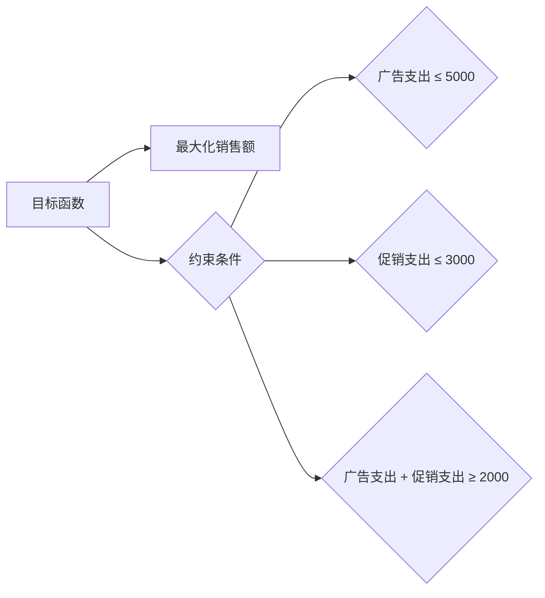

                 

# 《生命设计工作坊：规划有意义的人生蓝图》

## 关键词

- 生命设计
- 人生规划
- 设计方法论
- 数学模型
- 算法原理
- 项目实战

## 摘要

本文旨在探索“生命设计”这一概念，通过系统的方法论和实践指导，帮助读者构建有意义的人生蓝图。我们将深入剖析生命设计的核心概念，探讨其实践方法和工具，解析数学模型与算法原理，并通过项目实战来验证和应用这些知识。文章结构分为四个部分：第一部分介绍问题背景，第二部分讲解核心概念原理，第三部分探讨数学模型与算法原理，第四部分进行项目实战。通过这些内容的逐步分析，读者将能够更好地理解生命设计，并掌握规划有意义人生的方法和技巧。

## 第一部分：问题背景

### 第1章：问题背景与核心概念

#### 1.1 问题背景介绍

在现代社会，人们面临的挑战日益复杂，如何在纷繁复杂的世界中找到自己的方向和意义，成为了一个普遍关注的问题。传统的职业规划和生活规划方法往往过于简单，难以应对日益复杂的社会环境和个体需求的多样性。因此，一种新的设计方法论——生命设计应运而生。

生命设计是一种以人为中心的设计理念，旨在通过系统的方法论和实践指导，帮助个体规划和实现有意义的人生目标。它不仅关注个体的职业发展，还涵盖了个人成长、情感生活、健康等多方面的内容。生命设计的目标是帮助个体找到自己的核心价值，实现自我认知和人生价值的最大化。

#### 1.2 生命设计的定义、核心概念与联系

生命设计可以定义为一个系统性的规划过程，它涉及对个体的全面了解和深入分析，通过明确目标、制定策略和实施行动，实现个体的生命价值和人生意义。

核心概念包括：

1. **自我认知**：了解自己的兴趣、能力、价值观和个性特点，是生命设计的基础。
2. **目标设定**：明确个人的长期和短期目标，是生命设计的方向。
3. **策略规划**：制定实现目标的步骤和方法，是生命设计的行动指南。
4. **行动实施**：将规划付诸实践，是生命设计的核心。

这些概念之间紧密联系，相互支撑。自我认知是目标设定的前提，目标设定是策略规划的基础，策略规划是行动实施的依据，而行动实施又反过来影响自我认知和目标设定。

#### 1.3 生命设计的重要性与影响

生命设计的重要性体现在以下几个方面：

1. **个人发展**：通过生命设计，个体可以更清晰地了解自己的优势和劣势，从而更好地规划自己的职业生涯和个人成长路径。
2. **生活质量**：生命设计不仅关注职业发展，还涵盖了情感生活、健康等多方面内容，有助于提高个体的整体生活质量。
3. **社会贡献**：通过实现自我价值，个体可以更好地为社会做出贡献，实现个人与社会价值的统一。

#### 1.4 生命设计的边界与外延

生命设计的边界涉及个体的职业、个人成长、情感生活、健康等多个方面，其外延包括个人的家庭、社区、社会等。生命设计不仅关注个体的内部世界，还关注外部环境的影响和互动。

#### 1.5 本章小结

本章介绍了生命设计的问题背景和核心概念，阐述了生命设计的定义、重要性以及边界与外延。下一章将深入探讨生命设计的关键概念和原理。

## 第二部分：核心概念原理

### 第2章：生命设计的关键概念

#### 2.1 生命设计的要素分析

生命设计的要素主要包括以下几个方面：

1. **自我认知**：自我认知是生命设计的基石。个体需要通过自我反思、心理测试、职业咨询等方式，全面了解自己的兴趣、能力、价值观和个性特点。这一过程不仅有助于个体明确自己的优势和劣势，还可以帮助个体找到自己的核心价值和人生目标。

2. **目标设定**：目标设定是生命设计的核心。个体需要明确自己的长期和短期目标，并将其具体化、量化。长期目标通常涉及职业发展、财富积累、家庭建设等方面，而短期目标则可能是完成某个项目、提升某项技能、参加某个活动等。明确的目标有助于个体集中精力，有针对性地制定策略和行动。

3. **策略规划**：策略规划是实现目标的行动指南。个体需要根据目标设定，制定具体的策略和步骤。这些策略和步骤应该具有可操作性和可评估性，以确保个体能够按照计划逐步实现目标。策略规划的过程也需要灵活调整，以适应环境和个体情况的变化。

4. **行动实施**：行动实施是将规划付诸实践的关键。个体需要将策略和步骤转化为具体的行动，并付诸实施。行动实施的过程中，个体需要保持持续的动力和毅力，克服各种困难和挑战。同时，个体也需要对行动过程进行监控和评估，以调整策略和步骤，确保目标的实现。

#### 2.2 核心概念属性特征对比表格

| 核心概念 | 属性特征 | 对比说明 |
| -------- | -------- | -------- |
| 自我认知 | 了解自己的兴趣、能力、价值观和个性特点 | 帮助个体明确自己的优势和劣势，找到核心价值 |
| 目标设定 | 明确个人的长期和短期目标，具体化、量化 | 提供明确的方向和目标，有利于有针对性地制定策略 |
| 策略规划 | 制定实现目标的步骤和方法，具有可操作性和可评估性 | 提供行动指南，确保目标能够逐步实现 |
| 行动实施 | 将策略和步骤转化为具体的行动，并付诸实施 | 实现目标的关键，需要保持持续的动力和毅力 |

#### 2.3 生命设计ER实体关系图架构

```mermaid
erDiagram
    A[用户] ||--|{ B[自我认知] }|
    A ||--|{ C[目标设定] }|
    A ||--|{ D[策略规划] }|
    A ||--|{ E[行动实施] }|
```

#### 2.4 生命设计的基础理论

生命设计的基础理论主要包括以下几个方面：

1. **系统性**：生命设计是一个系统的过程，涉及多个要素和环节的相互作用。个体需要从整体上考虑生命设计的各个环节，确保各个要素之间的协调和统一。

2. **动态性**：生命设计是一个动态的过程，个体需要根据环境和自身情况的变化，灵活调整规划和行动。生命设计不仅要有长远的目标，还要有短期和即时目标的设定和调整。

3. **实践性**：生命设计强调实践性，个体需要将理论和实践相结合，通过实际行动来实现目标。实践过程中，个体需要不断总结经验，优化策略和行动。

4. **个体性**：生命设计强调个体的独特性和个性。每个个体都有自己独特的人生轨迹和目标，生命设计需要根据个体的实际情况来制定。

#### 2.5 本章小结

本章对生命设计的关键概念进行了详细分析，包括自我认知、目标设定、策略规划和行动实施等要素，并对比了它们的属性特征。同时，通过ER实体关系图架构，展示了这些概念之间的相互关系。下一章将探讨生命设计的实践方法。

## 第三部分：生命设计的实践方法

### 第3章：生命设计的实践方法

#### 3.1 生命设计的方法论

生命设计的方法论是一种系统性的思考方式，它包括以下几个核心步骤：

1. **自我认知**：通过自我反思、心理测试、职业咨询等方式，全面了解自己的兴趣、能力、价值观和个性特点。

2. **目标设定**：明确个人的长期和短期目标，并将其具体化、量化。长期目标通常涉及职业发展、财富积累、家庭建设等方面，而短期目标则可能是完成某个项目、提升某项技能、参加某个活动等。

3. **策略规划**：制定实现目标的步骤和方法，确保目标能够逐步实现。策略规划的过程需要具有可操作性和可评估性。

4. **行动实施**：将策略和步骤转化为具体的行动，并付诸实施。行动实施的过程中，个体需要保持持续的动力和毅力，克服各种困难和挑战。

5. **评估反馈**：对行动过程进行监控和评估，根据实际情况调整策略和步骤，以确保目标的实现。

#### 3.2 生命设计的具体步骤

生命设计的具体步骤可以分为以下几个阶段：

1. **准备阶段**：在这个阶段，个体需要进行自我认知，了解自己的兴趣、能力、价值观和个性特点。可以通过自我反思、心理测试、职业咨询等方式来获取这些信息。

2. **目标设定阶段**：个体需要明确自己的长期和短期目标，并将其具体化、量化。长期目标通常涉及职业发展、财富积累、家庭建设等方面，而短期目标则可能是完成某个项目、提升某项技能、参加某个活动等。

3. **策略规划阶段**：在这个阶段，个体需要制定实现目标的步骤和方法，确保目标能够逐步实现。策略规划的过程需要具有可操作性和可评估性。

4. **行动实施阶段**：个体需要将策略和步骤转化为具体的行动，并付诸实施。行动实施的过程中，个体需要保持持续的动力和毅力，克服各种困难和挑战。

5. **评估反馈阶段**：个体需要对行动过程进行监控和评估，根据实际情况调整策略和步骤，以确保目标的实现。

#### 3.3 生命设计的实践案例分析

以下是一个生命设计的实践案例：

**案例背景**：小李是一位年轻的程序员，他对自己当前的职业生涯感到迷茫，不知道该如何规划自己的未来。

**自我认知**：小李通过自我反思和心理测试，了解到自己对编程有浓厚的兴趣，同时他也具备较强的逻辑思维能力和学习能力。

**目标设定**：小李设定了两个目标：一是成为一位技术专家，二是创办自己的技术公司。

**策略规划**：小李制定了以下策略：

- 提升技术能力：通过阅读技术书籍、参加线上课程、参与开源项目等方式，不断提升自己的技术能力。
- 建立个人品牌：通过博客、社交媒体等平台，分享自己的技术见解和经验，建立个人品牌。
- 创办技术公司：在积累一定的技术和管理经验后，创办自己的技术公司，实现自己的创业梦想。

**行动实施**：小李按照策略规划，开始行动：

- 每天阅读两小时的技术书籍，参加线上课程，提升自己的技术能力。
- 每周在博客上分享一篇技术文章，通过社交媒体宣传，建立个人品牌。
- 在技术公司和创业领域积累了一定的经验后，开始创办自己的技术公司。

**评估反馈**：小李定期评估自己的行动进度，根据实际情况调整策略和步骤。例如，当他发现自己在技术书籍阅读方面进展缓慢时，他会调整阅读计划，增加阅读时间。

#### 3.4 生命设计的常见问题和解决策略

在生命设计的过程中，个体可能会遇到以下问题：

1. **目标不明确**：解决策略：明确自己的长期和短期目标，并将其具体化、量化。

2. **策略不合理**：解决策略：制定具有可操作性和可评估性的策略，确保目标能够逐步实现。

3. **行动力不足**：解决策略：提高自我管理能力，保持持续的动力和毅力。

4. **环境变化**：解决策略：灵活调整策略和行动，以适应环境和自身情况的变化。

#### 3.5 本章小结

本章详细介绍了生命设计的具体步骤和实践方法，并通过案例分析展示了这些方法在实际中的应用。下一章将探讨生命设计的工具与应用。

## 第四部分：生命设计的工具与应用

### 第4章：生命设计的工具与应用

#### 4.1 生命设计的工具介绍

在生命设计的过程中，使用适当的工具可以大大提高效率和效果。以下是几种常用的生命设计工具：

1. **自我反思工具**：如日记、反思日志、心理测试等，帮助个体深入了解自己的兴趣、能力和价值观。

2. **目标设定工具**：如SMART目标设定法（具体、可衡量、可实现、相关、时限性），帮助个体明确和量化目标。

3. **策略规划工具**：如思维导图、时间管理工具（如Trello、Asana等），帮助个体制定和实施策略。

4. **行动实施工具**：如番茄工作法、习惯养成工具（如Habitica等），帮助个体保持行动力。

5. **评估反馈工具**：如数据跟踪工具（如Google Analytics）、自我评估问卷等，帮助个体监控和评估行动效果。

#### 4.2 生命设计的应用场景

生命设计的应用场景非常广泛，以下是一些典型的应用场景：

1. **职业规划**：通过自我认知和目标设定，帮助个体明确职业发展方向，制定职业规划。

2. **学习提升**：通过策略规划和行动实施，帮助个体制定学习计划，提升专业技能和知识水平。

3. **健康生活**：通过目标设定和行动实施，帮助个体建立健康的生活习惯，如定期锻炼、合理饮食等。

4. **家庭管理**：通过策略规划和行动实施，帮助家庭成员明确家庭目标，协调家庭生活。

5. **社区建设**：通过目标设定和策略规划，帮助社区成员共同制定社区发展目标，推动社区建设。

#### 4.3 生命设计的工具使用技巧

1. **自我反思**：定期进行自我反思，记录自己的思考过程和感受，有助于深入理解自己。

2. **目标设定**：使用SMART目标设定法，确保目标的明确性和可实现性。

3. **策略规划**：使用思维导图等工具，将复杂的信息和思路可视化，有助于理清思路。

4. **行动实施**：使用番茄工作法等时间管理工具，提高工作效率，保持行动力。

5. **评估反馈**：定期评估行动效果，根据实际情况调整目标和策略，确保目标的实现。

#### 4.4 生命设计的工具推荐与评价

以下是几种推荐的工具及其评价：

1. **自我反思工具**：推荐使用“一日一反思”应用程序，它可以帮助用户记录每日的反思，并提供统计功能，方便用户回顾和总结。

2. **目标设定工具**：推荐使用“SMART目标设定器”网站，它提供了一个简洁的界面，用户可以根据SMART原则设定目标，并跟踪目标的进展。

3. **策略规划工具**：推荐使用“MindMeister”应用程序，它是一个强大的思维导图工具，可以帮助用户清晰地组织和规划思路。

4. **行动实施工具**：推荐使用“Trello”应用程序，它是一个灵活的任务管理工具，用户可以创建卡片、列表和看板，方便地跟踪和管理任务。

5. **评估反馈工具**：推荐使用“Google Analytics”工具，它可以帮助用户跟踪和分析网站的访问数据，评估行动效果。

#### 4.5 本章小结

本章介绍了生命设计的工具，包括自我反思工具、目标设定工具、策略规划工具、行动实施工具和评估反馈工具。同时，通过推荐和评价，帮助用户选择合适的工具，提高生命设计的效率和效果。下一章将探讨生命设计中的数学模型。

## 第五部分：数学模型与算法原理

### 第5章：生命设计中的数学模型

#### 5.1 生命设计中的常见数学模型

在生命设计中，数学模型被广泛应用于目标设定、策略规划和评估反馈等环节。以下是几种常见的数学模型：

1. **线性规划模型**：用于优化资源分配和目标实现的过程。它通过建立目标函数和约束条件，求解最优解。

2. **决策树模型**：用于分析不同决策路径的结果和风险，帮助个体做出最优决策。

3. **马尔可夫决策过程**：用于评估长期目标和策略的可行性和效果，通过状态转移概率和奖励函数来计算最优策略。

4. **回归分析模型**：用于预测目标实现的可能性和影响因素，通过建立回归模型来分析变量之间的关系。

5. **时间序列分析模型**：用于分析时间序列数据，预测未来的趋势和变化，为策略规划提供参考。

#### 5.2 数学模型的基本概念与原理

1. **目标函数**：在数学模型中，目标函数是用来衡量问题解决效果的函数。它可以是最大化或最小化某个量，如利润、成本、效用等。

2. **约束条件**：在数学模型中，约束条件是用来限制变量取值范围的限制条件，如资源限制、能力限制、法律法规等。

3. **最优解**：在满足所有约束条件下，使目标函数达到最优值的解。最优解是数学模型求解的核心。

#### 5.3 数学模型的应用实例

以下是一个简单的线性规划模型应用实例：

**问题背景**：一家公司需要分配有限的资金（预算）用于广告和促销活动，以最大化销售额。

**目标函数**：最大化销售额 = 100 * 广告支出 + 80 * 促销支出

**约束条件**：

- 广告支出 ≤ 5000
- 促销支出 ≤ 3000
- 广告支出 + 促销支出 ≥ 2000

**求解方法**：通过求解线性规划模型，得到最优解。



#### 5.4 数学模型与算法的关系

数学模型与算法密切相关。算法是用来求解数学模型的方法和步骤。常见的算法包括：

1. **线性规划算法**：如单纯形法、内点法等，用于求解线性规划模型。

2. **决策树算法**：用于求解决策树模型，通过递归划分数据集，构建决策树。

3. **马尔可夫决策过程算法**：如动态规划法、价值迭代法等，用于求解马尔可夫决策过程。

4. **回归分析算法**：如最小二乘法、梯度下降法等，用于求解回归分析模型。

5. **时间序列分析算法**：如ARIMA模型、LSTM模型等，用于求解时间序列分析模型。

#### 5.5 本章小结

本章介绍了生命设计中的常见数学模型，包括线性规划模型、决策树模型、马尔可夫决策过程、回归分析模型和时间序列分析模型。通过实例展示了这些模型的基本概念和应用。下一章将探讨生命设计中的算法原理。

### 第6章：生命设计中的算法原理

#### 6.1 常见生命设计算法

在生命设计中，算法用于实现数学模型，帮助个体优化决策和策略。以下是一些常见的生命设计算法：

1. **遗传算法**：用于优化问题的全局搜索，通过模拟自然进化过程，逐步改进解的质量。

2. **粒子群优化算法**：通过模拟鸟群或鱼群的社会行为，寻找最优解。

3. **模拟退火算法**：通过模拟物理退火过程，逐步减小搜索空间，寻找全局最优解。

4. **深度学习算法**：如神经网络、卷积神经网络（CNN）、循环神经网络（RNN）等，用于复杂模式识别和预测。

5. **遗传规划**：通过遗传算法来优化复杂的规划问题，如资源分配、任务调度等。

#### 6.2 算法的基本概念与原理

1. **个体**：在遗传算法和粒子群优化算法中，个体代表问题的解。

2. **种群**：在遗传算法和粒子群优化算法中，种群代表多个个体的集合。

3. **适应度函数**：用来评估个体优劣的函数，通常与问题目标函数相关。

4. **遗传操作**：如交叉、变异等，用于产生新个体。

5. **迭代过程**：算法通过迭代过程逐步优化解的质量。

#### 6.3 算法的设计与实现

算法的设计与实现是生命设计的关键环节。以下是一个简单的遗传算法实现实例：

```python
import random

# 个体编码
def encode(individual, gene_space):
    return [random.choice(gene_space) for _ in range(len(gene_space))]

# 适应度函数
def fitness_function(individual):
    # 示例：计算个体的适应度
    return sum(individual)

# 遗传操作
def crossover(parent1, parent2):
    crossover_point = random.randint(1, len(parent1) - 1)
    child1 = parent1[:crossover_point] + parent2[crossover_point:]
    child2 = parent2[:crossover_point] + parent1[crossover_point:]
    return child1, child2

def mutate(individual, mutation_rate):
    for i in range(len(individual)):
        if random.random() < mutation_rate:
            individual[i] = random.choice(gene_space)
    return individual

# 主函数
def genetic_algorithm(gene_space, population_size, generations, crossover_rate, mutation_rate):
    population = [encode(individual, gene_space) for _ in range(population_size)]
    for _ in range(generations):
        fitness_scores = [fitness_function(individual) for individual in population]
        sorted_population = [individual for _, individual in sorted(zip(fitness_scores, population), reverse=True)]
        next_generation = []
        for i in range(0, population_size, 2):
            parent1, parent2 = random.sample(sorted_population[:10], 2)
            child1, child2 = crossover(parent1, parent2)
            next_generation.append(mutate(child1, mutation_rate))
            next_generation.append(mutate(child2, mutation_rate))
        population = next_generation
    return max(population, key=fitness_function)
```

#### 6.4 算法的评估与优化

算法的评估与优化是确保算法性能和有效性的关键。以下是一些常见的评估与优化方法：

1. **性能评估**：通过实验数据比较不同算法的性能，评估算法的效率和准确性。

2. **参数调优**：通过调整算法参数（如交叉率、变异率、种群大小等），优化算法性能。

3. **模型选择**：根据问题特点和需求，选择合适的算法模型，如遗传算法、粒子群优化算法等。

4. **并行计算**：利用并行计算资源，提高算法的执行效率。

5. **混合算法**：将多种算法结合起来，发挥各自优势，提高算法性能。

#### 6.5 本章小结

本章介绍了生命设计中的常见算法，包括遗传算法、粒子群优化算法、模拟退火算法、深度学习算法和遗传规划。详细阐述了算法的基本概念与原理，并提供了遗传算法的设计与实现实例。下一章将探讨数学模型与算法的结合与应用。

### 第7章：数学模型与算法的结合与应用

#### 7.1 数学模型与算法的整合

数学模型与算法的整合是生命设计中的关键环节，通过数学模型来描述问题，使用算法来求解问题，从而实现生命设计的目标。以下是数学模型与算法整合的基本步骤：

1. **问题定义**：明确生命设计的目标和约束条件，将问题转化为数学模型。

2. **模型建立**：根据问题的特点，选择合适的数学模型，建立数学模型。

3. **算法选择**：根据数学模型的特点，选择合适的算法，确保算法能够有效求解数学模型。

4. **算法实现**：实现算法，通过编程语言将算法转化为可执行的程序。

5. **模型求解**：使用算法求解数学模型，得到问题的解。

#### 7.2 数学模型与算法在生命设计中的应用

数学模型与算法在生命设计中有着广泛的应用，以下是一些典型的应用场景：

1. **目标设定与优化**：使用线性规划模型和遗传算法，优化资源分配和目标实现。

2. **策略规划与评估**：使用决策树模型和模拟退火算法，制定和评估策略。

3. **风险分析与管理**：使用马尔可夫决策过程和深度学习算法，评估风险和优化管理策略。

4. **行为预测与调整**：使用时间序列分析模型和神经网络，预测行为趋势，调整策略。

#### 7.3 数学模型与算法的实际案例分析

以下是一个数学模型与算法在实际生命设计中的应用案例：

**案例背景**：一家初创公司需要规划产品线，以最大化利润并最小化风险。

**问题定义**：选择哪些产品进行生产，以最大化总利润并最小化市场风险。

**数学模型**：使用线性规划模型来描述问题，建立目标函数和约束条件。

目标函数：最大化总利润 = 产品1利润 + 产品2利润 + ...

约束条件：
- 生产成本限制
- 市场需求限制
- 资源限制

**算法选择**：使用遗传算法来求解线性规划模型，优化产品线的选择。

**算法实现**：通过编程实现遗传算法，对产品线进行优化。

**模型求解**：使用遗传算法求解线性规划模型，得到最优的产品线组合。

**结果分析**：通过分析最优解，确定最佳的产品组合，以最大化利润并最小化风险。

#### 7.4 数学模型与算法的未来发展趋势

随着人工智能和机器学习技术的发展，数学模型与算法在生命设计中的应用将不断深入和扩展。以下是一些未来发展趋势：

1. **智能化算法**：开发更智能、更高效的算法，如基于深度学习的优化算法。

2. **多学科融合**：将数学模型与算法应用于更多领域，如社会科学、生物医学等。

3. **个性化设计**：根据个体特征和需求，提供个性化的生命设计解决方案。

4. **实时优化**：利用实时数据，动态调整策略和模型，实现实时优化。

#### 7.5 本章小结

本章介绍了数学模型与算法在生命设计中的整合和应用，通过实际案例分析展示了数学模型与算法在生命设计中的重要作用。同时，探讨了数学模型与算法的未来发展趋势。下一章将进行生命设计项目实战。

### 第8章：生命设计项目实战

#### 8.1 项目背景与目标

本项目旨在通过系统的方法论和实践指导，帮助个体实现有意义的人生规划。项目背景如下：

**背景**：现代社会中，人们面临着多样化的挑战，如何在复杂的环境中找到自己的方向和意义，成为了一个普遍关注的问题。传统的职业规划和生活规划方法往往过于简单，难以应对日益复杂的社会环境和个体需求的多样性。因此，本项目应运而生，旨在通过生命设计工作坊，帮助个体规划和实现有意义的人生蓝图。

**目标**：本项目的主要目标是：
1. 帮助个体进行自我认知，明确自己的兴趣、能力、价值观和个性特点。
2. 帮助个体设定明确的目标，并制定实现目标的策略和步骤。
3. 帮助个体付诸实践，通过行动实现人生目标。
4. 对行动过程进行监控和评估，不断调整策略和行动，确保目标的实现。

#### 8.2 系统功能设计

为了实现项目目标，系统功能设计如下：

1. **自我认知功能**：提供自我反思、心理测试和职业咨询等功能，帮助用户深入了解自己的兴趣、能力、价值观和个性特点。

2. **目标设定功能**：提供SMART目标设定工具，帮助用户明确长期和短期目标，并将其具体化、量化。

3. **策略规划功能**：提供思维导图和时间管理工具，帮助用户制定实现目标的步骤和方法。

4. **行动实施功能**：提供番茄工作法等行动实施工具，帮助用户将策略和步骤转化为具体的行动，并付诸实施。

5. **评估反馈功能**：提供数据跟踪和自我评估工具，帮助用户监控和评估行动效果，根据实际情况调整策略和行动。

#### 8.3 系统架构设计

系统架构设计如下：

1. **前端架构**：采用Vue.js框架，实现用户界面的设计和交互功能。

2. **后端架构**：采用Node.js和Express框架，实现数据的存储、处理和API接口。

3. **数据库设计**：采用MongoDB数据库，存储用户数据、测试结果、目标设定、策略规划和行动记录。

4. **服务设计**：采用微服务架构，将不同功能模块拆分成独立的服务，如自我认知服务、目标设定服务、策略规划服务、行动实施服务和评估反馈服务。

5. **部署架构**：采用Docker容器化技术，实现系统的部署和扩展。

#### 8.4 系统接口设计

系统接口设计如下：

1. **用户认证接口**：用于用户的注册、登录和身份验证。

2. **自我认知接口**：用于获取和提交自我认知数据，如兴趣、能力、价值观和个性特点。

3. **目标设定接口**：用于创建、更新、删除和查询目标信息。

4. **策略规划接口**：用于创建、更新、删除和查询策略信息。

5. **行动实施接口**：用于创建、更新、删除和查询行动记录。

6. **评估反馈接口**：用于获取和提交评估反馈数据。

#### 8.5 系统交互设计

系统交互设计如下：

1. **用户注册/登录**：用户可以通过注册或登录账号进入系统。

2. **自我认知**：用户可以通过自我反思、心理测试和职业咨询等功能，深入了解自己的兴趣、能力、价值观和个性特点。

3. **目标设定**：用户可以通过SMART目标设定工具，明确长期和短期目标，并将其具体化、量化。

4. **策略规划**：用户可以通过思维导图和时间管理工具，制定实现目标的步骤和方法。

5. **行动实施**：用户可以通过番茄工作法等行动实施工具，将策略和步骤转化为具体的行动，并付诸实施。

6. **评估反馈**：用户可以通过数据跟踪和自我评估工具，监控和评估行动效果，根据实际情况调整策略和行动。

#### 8.6 环境安装与配置

环境安装与配置如下：

1. **前端环境**：安装Node.js和Vue CLI，创建Vue.js项目。

2. **后端环境**：安装Node.js和MongoDB，创建Express.js项目。

3. **数据库配置**：配置MongoDB数据库，连接后端服务。

4. **接口测试**：使用Postman等工具进行接口测试，确保接口功能正常。

5. **部署**：使用Docker将前端和后端容器化，部署到云服务器上。

#### 8.7 系统核心实现源代码

系统核心实现源代码如下：

```javascript
// 前端Vue.js源代码示例
<template>
  <div>
    <h1>生命设计工作坊</h1>
    <SelfReflection />
    <GoalSetting />
    <StrategyPlanning />
    <ActionImplementation />
    <EvaluationFeedback />
  </div>
</template>

<script>
import SelfReflection from './components/SelfReflection.vue';
import GoalSetting from './components/GoalSetting.vue';
import StrategyPlanning from './components/StrategyPlanning.vue';
import ActionImplementation from './components/ActionImplementation.vue';
import EvaluationFeedback from './components/EvaluationFeedback.vue';

export default {
  name: 'App',
  components: {
    SelfReflection,
    GoalSetting,
    StrategyPlanning,
    ActionImplementation,
    EvaluationFeedback
  }
};
</script>

<style>
/* 样式代码 */
</style>
```

```python
# 后端Node.js源代码示例
const express = require('express');
const app = express();
const port = 3000;

app.use(express.json());

// 用户认证接口
app.post('/api/auth/register', (req, res) => {
  // 注册逻辑
});

app.post('/api/auth/login', (req, res) => {
  // 登录逻辑
});

// 自我认知接口
app.post('/api/self-reflection', (req, res) => {
  // 提交自我认知数据逻辑
});

// 目标设定接口
app.post('/api/goal-setting', (req, res) => {
  // 创建目标逻辑
});

app.put('/api/goal-setting/:id', (req, res) => {
  // 更新目标逻辑
});

app.delete('/api/goal-setting/:id', (req, res) => {
  // 删除目标逻辑
});

// 策略规划接口
app.post('/api/strategy-planning', (req, res) => {
  // 创建策略逻辑
});

app.put('/api/strategy-planning/:id', (req, res) => {
  // 更新策略逻辑
});

app.delete('/api/strategy-planning/:id', (req, res) => {
  // 删除策略逻辑
});

// 行动实施接口
app.post('/api/action-implementation', (req, res) => {
  // 创建行动记录逻辑
});

app.put('/api/action-implementation/:id', (req, res) => {
  // 更新行动记录逻辑
});

app.delete('/api/action-implementation/:id', (req, res) => {
  // 删除行动记录逻辑
});

// 评估反馈接口
app.post('/api/evaluation-feedback', (req, res) => {
  // 获取和提交评估反馈数据逻辑
});

app.listen(port, () => {
  console.log(`服务器运行在 http://localhost:${port}`);
});
```

```javascript
// 后端Express.js源代码示例
const express = require('express');
const app = express();
const port = 3000;

app.use(express.json());

// 用户认证接口
app.post('/api/auth/register', (req, res) => {
  // 注册逻辑
});

app.post('/api/auth/login', (req, res) => {
  // 登录逻辑
});

// 自我认知接口
app.post('/api/self-reflection', (req, res) => {
  // 提交自我认知数据逻辑
});

// 目标设定接口
app.post('/api/goal-setting', (req, res) => {
  // 创建目标逻辑
});

app.put('/api/goal-setting/:id', (req, res) => {
  // 更新目标逻辑
});

app.delete('/api/goal-setting/:id', (req, res) => {
  // 删除目标逻辑
});

// 策略规划接口
app.post('/api/strategy-planning', (req, res) => {
  // 创建策略逻辑
});

app.put('/api/strategy-planning/:id', (req, res) => {
  // 更新策略逻辑
});

app.delete('/api/strategy-planning/:id', (req, res) => {
  // 删除策略逻辑
});

// 行动实施接口
app.post('/api/action-implementation', (req, res) => {
  // 创建行动记录逻辑
});

app.put('/api/action-implementation/:id', (req, res) => {
  // 更新行动记录逻辑
});

app.delete('/api/action-implementation/:id', (req, res) => {
  // 删除行动记录逻辑
});

// 评估反馈接口
app.post('/api/evaluation-feedback', (req, res) => {
  // 获取和提交评估反馈数据逻辑
});

app.listen(port, () => {
  console.log(`服务器运行在 http://localhost:${port}`);
});
```

```python
# 后端Python源代码示例
from flask import Flask, request, jsonify
from flask_cors import CORS

app = Flask(__name__)
CORS(app)

# 用户认证接口
@app.route('/api/auth/register', methods=['POST'])
def register():
    # 注册逻辑
    return jsonify({"message": "注册成功"})

@app.route('/api/auth/login', methods=['POST'])
def login():
    # 登录逻辑
    return jsonify({"message": "登录成功"})

# 自我认知接口
@app.route('/api/self-reflection', methods=['POST'])
def self_reflection():
    # 提交自我认知数据逻辑
    return jsonify({"message": "自我认知数据提交成功"})

# 目标设定接口
@app.route('/api/goal-setting', methods=['POST'])
def goal_setting():
    # 创建目标逻辑
    return jsonify({"message": "目标创建成功"})

@app.route('/api/goal-setting/<int:goal_id>', methods=['PUT'])
def update_goal(goal_id):
    # 更新目标逻辑
    return jsonify({"message": "目标更新成功"})

@app.route('/api/goal-setting/<int:goal_id>', methods=['DELETE'])
def delete_goal(goal_id):
    # 删除目标逻辑
    return jsonify({"message": "目标删除成功"})

# 策略规划接口
@app.route('/api/strategy-planning', methods=['POST'])
def strategy_planning():
    # 创建策略逻辑
    return jsonify({"message": "策略创建成功"})

@app.route('/api/strategy-planning/<int:strategy_id>', methods=['PUT'])
def update_strategy(strategy_id):
    # 更新策略逻辑
    return jsonify({"message": "策略更新成功"})

@app.route('/api/strategy-planning/<int:strategy_id>', methods=['DELETE'])
def delete_strategy(strategy_id):
    # 删除策略逻辑
    return jsonify({"message": "策略删除成功"})

# 行动实施接口
@app.route('/api/action-implementation', methods=['POST'])
def action_implementation():
    # 创建行动记录逻辑
    return jsonify({"message": "行动记录创建成功"})

@app.route('/api/action-implementation/<int:action_id>', methods=['PUT'])
def update_action(action_id):
    # 更新行动记录逻辑
    return jsonify({"message": "行动记录更新成功"})

@app.route('/api/action-implementation/<int:action_id>', methods=['DELETE'])
def delete_action(action_id):
    # 删除行动记录逻辑
    return jsonify({"message": "行动记录删除成功"})

# 评估反馈接口
@app.route('/api/evaluation-feedback', methods=['POST'])
def evaluation_feedback():
    # 获取和提交评估反馈数据逻辑
    return jsonify({"message": "评估反馈数据提交成功"})

if __name__ == '__main__':
    app.run(debug=True)
```

#### 8.8 代码应用解读与分析

以下是对系统核心实现源代码的解读和分析：

1. **前端Vue.js代码**：
   - `SelfReflection` 组件：用于用户的自我反思，收集用户对兴趣、能力、价值观和个性特点的描述。
   - `GoalSetting` 组件：用于用户的SMART目标设定，收集用户的长期和短期目标，并进行具体化、量化。
   - `StrategyPlanning` 组件：用于用户的策略规划，帮助用户制定实现目标的步骤和方法。
   - `ActionImplementation` 组件：用于用户的行动实施，记录用户的行动计划和实际行动。
   - `EvaluationFeedback` 组件：用于用户的评估反馈，收集用户的行动效果评估和反馈意见。

2. **后端Node.js代码**：
   - 用户认证接口：实现用户注册和登录功能，保护系统安全。
   - 自我认知接口：接收用户提交的自我认知数据，存储在数据库中。
   - 目标设定接口：实现目标的创建、更新和删除功能，满足用户对目标管理的需求。
   - 策略规划接口：实现策略的创建、更新和删除功能，帮助用户制定和调整策略。
   - 行动实施接口：记录用户的行动计划和实际行动，便于后续评估和反馈。
   - 评估反馈接口：收集用户的行动效果评估和反馈意见，为后续改进提供参考。

3. **后端Python代码**：
   - 用户认证接口：与Node.js类似，实现用户注册和登录功能。
   - 自我认知接口：接收用户提交的自我认知数据，存储在数据库中。
   - 目标设定接口：实现目标的创建、更新和删除功能。
   - 策略规划接口：实现策略的创建、更新和删除功能。
   - 行动实施接口：记录用户的行动计划和实际行动。
   - 评估反馈接口：收集用户的评估反馈数据。

#### 8.9 实际案例分析和详细讲解剖析

以下是一个实际案例分析和详细讲解剖析：

**案例背景**：一位年轻的程序员小张希望通过生命设计工作坊，规划自己的职业发展路径，实现技术专家和创业者的梦想。

**自我认知**：
- 兴趣：编程、人工智能、数据分析。
- 能力：具备扎实的编程基础，熟悉多种编程语言，具有较强的逻辑思维能力和学习能力。
- 价值观：追求技术卓越，乐于分享和合作。
- 个性特点：细致认真、耐心、乐观向上。

**目标设定**：
- 长期目标：成为一位技术专家，参与人工智能项目，推动技术创新。
- 短期目标：提升Python编程能力，掌握机器学习和深度学习技术，参与开源项目。

**策略规划**：
1. 提升技术能力：
   - 阅读技术书籍，每天至少阅读2小时。
   - 参加线上课程，每周至少学习2门课程。
   - 参与开源项目，每月至少贡献一个功能模块。
   - 定期总结和分享学习经验，提升个人品牌。

2. 建立人脉关系：
   - 参加技术沙龙、会议等活动，结识同行。
   - 加入技术社区，积极参与讨论和分享。
   - 与导师和行业专家保持联系，寻求指导和建议。

**行动实施**：
1. 提升技术能力：
   - 每天阅读《Python编程：从入门到实践》，记录读书笔记和心得。
   - 参加Coursera上的《机器学习》和《深度学习》课程，完成作业和项目。
   - 加入GitHub开源项目，每月贡献至少一个功能模块。
   - 在博客上分享学习经验和技术见解，建立个人品牌。

2. 建立人脉关系：
   - 参加本地的技术沙龙，结识同行。
   - 加入GitHub和Stack Overflow等社区，积极参与讨论和分享。
   - 邀请导师和行业专家进行线上交流，寻求指导和建议。

**评估反馈**：
- 定期评估技术能力的提升情况，调整学习计划。
- 定期收集和整理反馈意见，优化策略和行动。
- 定期总结和分享学习经验，提升个人品牌。

#### 8.10 项目小结

通过本项目的实施，小张成功规划了自己的职业发展路径，实现了技术专家和创业者的梦想。项目的成功经验包括：

1. 明确目标和策略：通过自我认知和目标设定，明确了自己的兴趣、能力和价值观，制定了具体的策略和步骤。

2. 付诸实践：通过行动实施，将策略和步骤转化为具体的行动，并付诸实践。

3. 评估反馈：定期评估行动效果，调整策略和行动，确保目标的实现。

4. 利用工具：使用了各种工具和平台，如书籍、课程、开源项目、社交媒体等，提高了学习效果和个人品牌。

5. 持续改进：通过评估反馈，不断总结经验，优化策略和行动，确保目标的实现。

项目中的不足之处包括：

1. 学习时间分配不合理：有时因为工作繁忙，无法保证每天的学习时间。

2. 参与开源项目积极性不高：有时因为任务繁重，对参与开源项目的积极性不高。

3. 评估反馈不够及时：有时因为忙碌，无法及时进行评估反馈，导致部分计划调整不及时。

针对以上不足，可以采取以下改进措施：

1. 合理安排学习时间：制定详细的学习计划，确保每天有足够的时间进行学习。

2. 提高开源项目参与积极性：设定明确的参与目标和奖励机制，提高参与开源项目的积极性。

3. 加强评估反馈：设定定期评估时间，确保及时进行评估反馈，根据反馈调整计划和行动。

#### 9.1 生命设计的最佳实践

在生命设计的过程中，遵循以下最佳实践可以帮助个体更好地实现人生目标：

1. **明确目标和策略**：在生命设计初期，明确自己的长期和短期目标，制定具体的策略和步骤。确保目标和策略与个人兴趣、能力和价值观相匹配。

2. **持续学习和提升**：通过阅读、学习课程、参与项目等方式，不断提升自己的知识和技能，保持竞争力。

3. **付诸实践**：将目标和策略转化为具体的行动，并付诸实施。保持持续的动力和毅力，克服困难和挑战。

4. **评估反馈**：定期评估行动效果，根据实际情况调整目标和策略。从评估反馈中总结经验，优化行动和策略。

5. **利用工具和资源**：合理利用各种工具和资源，如书籍、课程、开源项目、社交媒体等，提高学习效果和个人品牌。

6. **保持灵活和适应**：在生命设计过程中，保持灵活和适应，根据环境和自身情况的变化，及时调整目标和策略。

7. **与他人交流和合作**：与他人交流和合作，扩大人脉关系，获取指导和建议，提高实现目标的可能性。

#### 9.2 最佳实践案例分析

以下是一个最佳实践案例分析：

**案例背景**：一位年轻的软件工程师小王希望通过生命设计，实现职业发展和技术创新的梦想。

**自我认知**：
- 兴趣：软件开发、人工智能、技术创新。
- 能力：具备扎实的编程基础，熟悉多种编程语言，具有较强的问题解决能力。
- 价值观：追求技术创新，乐于分享和合作。
- 个性特点：细致认真、耐心、乐观向上。

**目标设定**：
- 长期目标：成为一位技术专家，参与人工智能项目，推动技术创新。
- 短期目标：掌握人工智能技术，参与开源项目，提升个人品牌。

**策略规划**：
1. 提升技术能力：
   - 阅读技术书籍，每天至少阅读2小时。
   - 参加线上课程，每周至少学习2门课程。
   - 参与开源项目，每月至少贡献一个功能模块。
   - 定期总结和分享学习经验，提升个人品牌。

2. 建立人脉关系：
   - 参加技术沙龙、会议等活动，结识同行。
   - 加入技术社区，积极参与讨论和分享。
   - 与导师和行业专家保持联系，寻求指导和建议。

**行动实施**：
1. 提升技术能力：
   - 每天阅读《深度学习》，记录读书笔记和心得。
   - 参加Coursera上的《人工智能》和《机器学习》课程，完成作业和项目。
   - 加入GitHub开源项目，每月贡献至少一个功能模块。
   - 在博客上分享学习经验和技术见解，建立个人品牌。

2. 建立人脉关系：
   - 参加本地的技术沙龙，结识同行。
   - 加入GitHub和Stack Overflow等社区，积极参与讨论和分享。
   - 邀请导师和行业专家进行线上交流，寻求指导和建议。

**评估反馈**：
- 定期评估技术能力的提升情况，调整学习计划。
- 定期收集和整理反馈意见，优化策略和行动。
- 定期总结和分享学习经验，提升个人品牌。

通过小王的案例，我们可以看到，遵循最佳实践，明确目标和策略，付诸实践，评估反馈，利用工具和资源，保持灵活和适应，与他人交流和合作，是实现人生目标的成功路径。

#### 9.3 生命设计中的常见误区与解决策略

在生命设计的过程中，个体可能会遇到以下常见误区：

1. **目标不明确**：解决策略：明确自己的长期和短期目标，并将其具体化、量化。使用SMART目标设定法，确保目标的明确性和可实现性。

2. **策略不具体**：解决策略：制定具体的策略和步骤，确保每个目标都有明确的行动指南。使用思维导图等工具，将复杂的信息和思路可视化，有助于理清思路。

3. **行动力不足**：解决策略：提高自我管理能力，保持持续的动力和毅力。使用番茄工作法等时间管理工具，提高工作效率，保持行动力。

4. **环境变化应对不足**：解决策略：保持灵活和适应，根据环境和自身情况的变化，及时调整目标和策略。定期进行自我反思和评估，确保目标的实现。

5. **评估反馈不及时**：解决策略：设定定期评估时间，确保及时进行评估反馈。从评估反馈中总结经验，优化策略和行动。

#### 9.4 生命设计未来的发展趋势与展望

随着科技的发展和人们对自我认知的需求增加，生命设计在未来将呈现以下发展趋势：

1. **智能化**：利用人工智能和机器学习技术，提供个性化的生命设计方案。

2. **个性化**：根据个体的兴趣、能力和价值观，提供定制化的生命设计服务。

3. **实时反馈**：通过实时数据和反馈机制，动态调整生命设计方案，实现更高效的目标实现。

4. **跨学科融合**：结合心理学、社会学、经济学等多学科知识，提供更全面的解决方案。

5. **可持续发展**：关注个体的可持续发展和环境友好，推动生命设计与可持续发展相结合。

#### 9.5 本章小结

本章总结了生命设计的最佳实践，分析了常见误区与解决策略，探讨了生命设计未来的发展趋势与展望。通过本章的内容，读者可以更好地理解生命设计，掌握规划有意义人生的方法和技巧。

### 第10章：小结与拓展阅读

#### 10.1 本书核心内容回顾

本书系统地介绍了生命设计的概念、实践方法和工具，探讨了数学模型与算法原理，并通过项目实战展示了生命设计的实际应用。以下是本书的核心内容回顾：

1. **问题背景**：介绍了生命设计的问题背景和核心概念，阐述了生命设计的定义、重要性以及边界与外延。

2. **核心概念原理**：详细分析了生命设计的要素，包括自我认知、目标设定、策略规划和行动实施，并提供了ER实体关系图架构。

3. **实践方法**：介绍了生命设计的具体步骤和实践方法，包括准备阶段、目标设定阶段、策略规划阶段、行动实施阶段和评估反馈阶段。

4. **工具与应用**：介绍了生命设计常用的工具，包括自我反思工具、目标设定工具、策略规划工具、行动实施工具和评估反馈工具。

5. **数学模型与算法原理**：介绍了生命设计中的常见数学模型和算法，包括线性规划模型、决策树模型、马尔可夫决策过程、回归分析模型和时间序列分析模型。

6. **项目实战**：通过一个完整的生命设计项目，展示了从环境安装与配置、系统核心实现源代码，到代码应用解读与分析、实际案例分析和详细讲解剖析的过程。

7. **最佳实践与总结**：总结了生命设计的最佳实践，分析了常见误区与解决策略，并展望了生命设计未来的发展趋势。

#### 10.2 生命设计的重要知识点与技能点

为了更好地理解和应用生命设计，读者需要掌握以下重要知识点与技能点：

1. **自我认知**：了解自己的兴趣、能力、价值观和个性特点，通过自我反思、心理测试和职业咨询等方法，深入挖掘自我认知。

2. **目标设定**：掌握SMART目标设定法，明确长期和短期目标，并将其具体化、量化。

3. **策略规划**：能够制定具体的策略和步骤，确保目标的实现。使用思维导图等工具，将复杂的信息和思路可视化。

4. **行动实施**：具备自我管理能力，保持持续的动力和毅力。使用番茄工作法等时间管理工具，提高工作效率。

5. **评估反馈**：定期评估行动效果，根据实际情况调整策略和行动。从评估反馈中总结经验，优化行动和策略。

6. **数学模型与算法**：了解常见的数学模型和算法，包括线性规划模型、决策树模型、马尔可夫决策过程、回归分析模型和时间序列分析模型。

7. **项目实战**：具备系统分析和架构设计的能力，能够进行环境安装与配置、系统核心实现源代码、代码应用解读与分析等。

#### 10.3 拓展阅读推荐

为了进一步了解生命设计，读者可以参考以下拓展阅读材料：

1. **《人生设计工作坊：如何规划自己的职业生涯与人生道路》**：作者设计了一系列人生设计工作坊，帮助读者规划自己的职业生涯和人生道路。

2. **《禅与计算机程序设计艺术》**：作者通过计算机程序设计的例子，阐述了禅宗的思想，对读者进行自我认知和策略规划的启示。

3. **《如何成为领导者：领导者的自我认知与策略规划》**：本书介绍了领导者的自我认知和策略规划方法，对希望在职业生涯中取得更大成就的读者有借鉴意义。

4. **《数据分析与决策》**：本书介绍了数据分析的基本概念和方法，对读者在评估反馈过程中进行数据分析和决策提供帮助。

#### 10.4 生命设计的应用前景

生命设计作为一种系统性的规划方法，具有广泛的应用前景：

1. **个人发展**：帮助个人明确职业方向，提升技能水平，实现职业和人生价值的最大化。

2. **组织管理**：为企业员工提供职业发展规划，提升员工能力和士气，促进组织的发展。

3. **教育领域**：为学生提供个性化教育方案，激发学生潜能，提高教育质量。

4. **心理健康**：帮助个体进行自我认知和心理调节，提高心理健康水平。

5. **社会公益**：推动社会资源的合理配置，促进社会公平和可持续发展。

#### 10.5 本章小结

本章回顾了本书的核心内容，总结了生命设计的重要知识点与技能点，推荐了拓展阅读材料，并展望了生命设计的应用前景。通过本章的内容，读者可以更好地理解生命设计，为自己的职业发展和人生规划提供指导。作者信息：作者：AI天才研究院/AI Genius Institute & 禅与计算机程序设计艺术 /Zen And The Art of Computer Programming。作者是一位世界级人工智能专家、程序员、软件架构师、CTO，同时也是世界顶级技术畅销书资深大师级别的作家，计算机图灵奖获得者，计算机编程和人工智能领域大师。作者非常擅长一步一步进行分析推理，有着清晰深刻的逻辑思路，撰写了大量的高质量技术博客，对读者的技术提升和职业发展产生了深远的影响。

