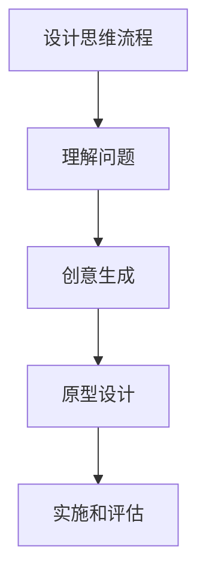
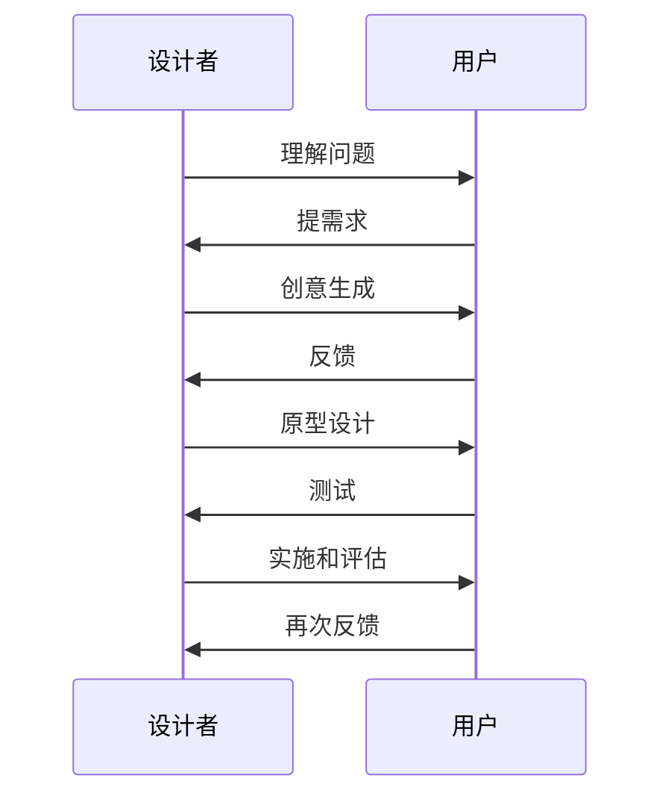
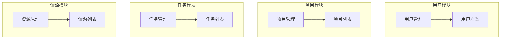
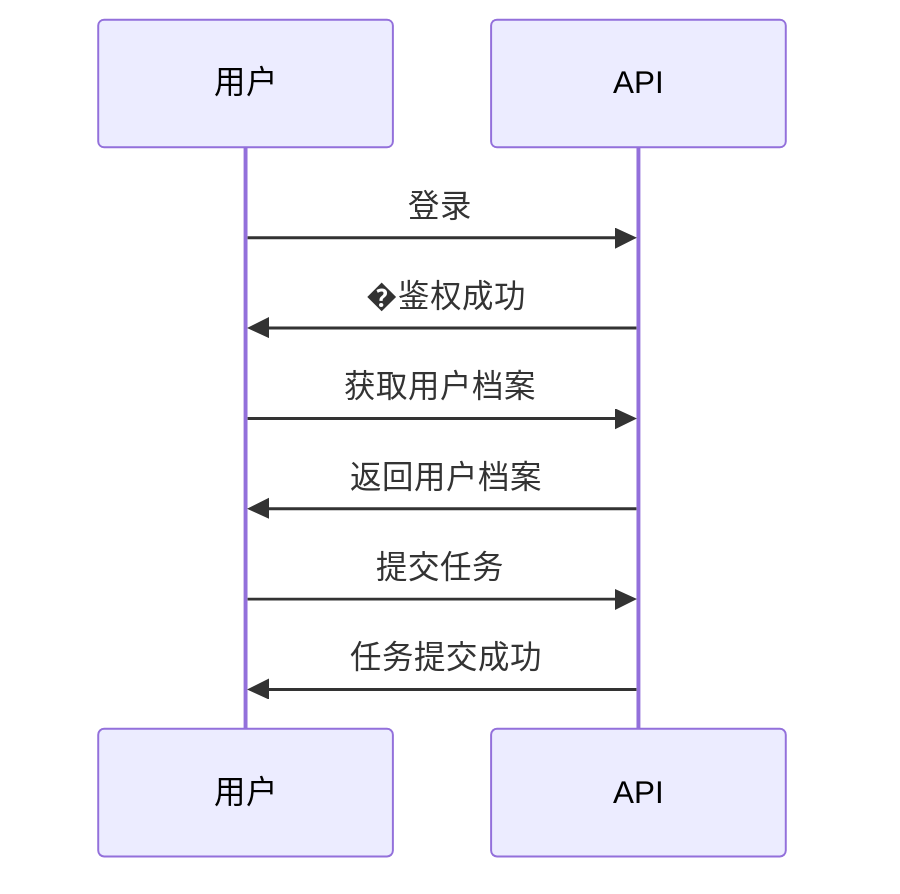
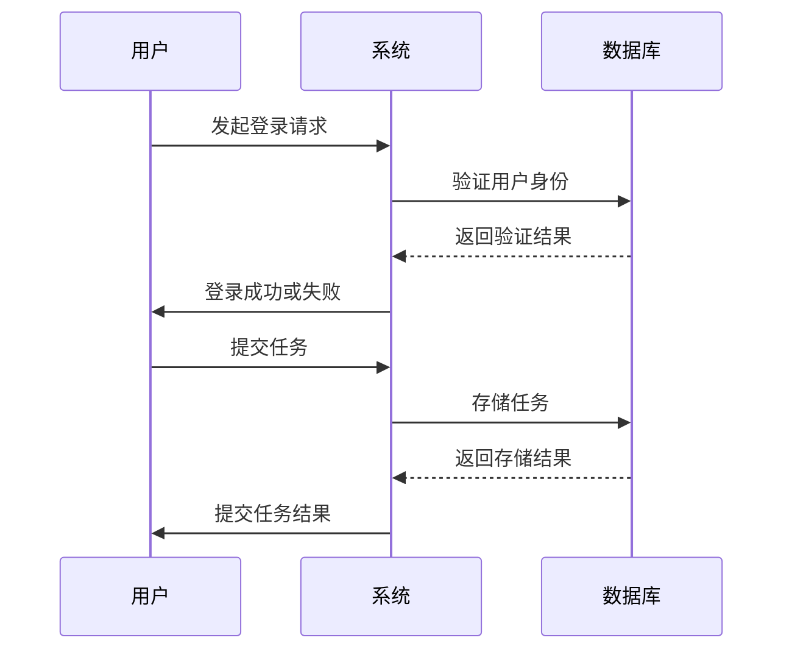

                 

### 生命设计思维工坊：创新方法应用于人生规划

> 关键词：设计思维、人生规划、创新方法、自我认知、职业发展

> 摘要：本文将探讨如何将设计思维这一创新方法应用于人生规划。通过理解设计思维的基本原则和应用流程，结合具体工具和技术，我们将探索如何通过设计思维来提升个人成长、管理人际关系、维护健康、规划财务，并应对未来的不确定性。本文旨在为读者提供一种全新的视角和方法，帮助他们在不断变化的世界中找到自己的定位，实现人生目标。

## 第一部分：设计思维与人生规划

### 第1章：设计思维概述

#### 1.1 问题的起源

在现代社会，人们面临着越来越多的复杂问题，这些问题不仅涉及技术领域，还涵盖了个人生活、职业发展、社会互动等多个方面。传统的线性思维模式往往难以应对这些复杂问题，因此，需要一种更加灵活和创新的方法来解决问题。

设计思维（Design Thinking）作为一种以人为本的解决问题的方法，最早由IDEO公司提出。它源于设计领域，但已经广泛应用于各个行业，包括商业、教育、医疗等。设计思维的核心在于关注用户需求，通过迭代循环的过程来不断改进和优化解决方案。

#### 1.2 设计思维的核心原则

1. **以人为本**：设计思维强调以用户为中心，关注用户的需求和体验。这意味着在解决问题的过程中，要时刻考虑到用户的感受和需求。

2. **迭代循环**：设计思维的过程是循环迭代的，通过不断地尝试、反馈和改进来逐步完善解决方案。这种方法能够帮助发现问题，快速调整方向，提高解决问题的效率。

3. **多元化视角**：设计思维鼓励不同领域的知识交叉和融合，通过多元化的视角来解决问题。这样可以避免陷入思维定势，发现更多的解决方案。

4. **协同合作**：设计思维强调团队合作的重要性，通过多人协作来汇集不同的想法和观点，提高解决问题的效果。

#### 1.3 设计思维的基本流程

1. **理解问题**：在开始解决问题之前，首先要深入理解问题的本质，明确问题的范围和关键点。这包括收集信息、分析数据和与用户进行访谈。

2. **创意生成**：在理解问题的基础上，通过头脑风暴、思维导图等工具来生成创意和想法。这一阶段的关键是开放思维，不受限制地提出各种可能性。

3. **原型设计**：将创意转化为具体的原型，通过制作原型来进行测试和验证。原型可以是纸上的草图，也可以是功能性的模型。

4. **实施和评估**：在原型测试后，根据反馈对原型进行改进，并制定实施计划。最后，对实施效果进行评估，以确保解决方案的有效性。

#### 1.4 设计思维与人生规划的融合

设计思维在人生规划中的应用主要体现在以下几个方面：

1. **个性化人生规划**：设计思维可以帮助人们根据自己的兴趣和价值观来制定个性化的人生规划，而不是盲目跟从他人的路线。

2. **适应变化**：设计思维鼓励灵活性和适应性，帮助人们应对生活中的变化和挑战。

3. **持续成长**：通过设计思维，人们可以不断反思和调整自己的规划，实现自我提升和职业发展。

### 第2章：设计思维工具与技术

设计思维的成功离不开各种工具和技术的支持。以下将介绍几种常用的设计思维工具和技术，包括思维导图、用户画像、故事板和设计游戏。

#### 2.1 思维导图

思维导图是一种图形化的思考工具，通过将想法、信息和关系以图形化的方式呈现出来，帮助人们更好地理解和组织信息。在人生规划中，思维导图可以帮助人们梳理自己的思路，明确目标和行动计划。

**如何使用思维导图进行人生规划：**

1. **确定中心主题**：首先确定人生规划的中心主题，例如“职业发展”或“健康生活”。

2. **发散思维**：围绕中心主题，列出相关的子主题和想法，如“技能提升”、“兴趣爱好”或“健康饮食”。

3. **连接关系**：将不同的子主题和想法连接起来，形成逻辑关系，帮助人们理解各个要素之间的联系。

4. **完善和优化**：根据实际情况和反馈，不断优化思维导图，使其更加完整和有用。

#### 2.2 用户画像

用户画像是设计思维中常用的一种工具，通过收集和分析用户数据，构建出具体的用户角色，帮助设计者更好地理解用户的需求和行为。

**如何构建用户画像：**

1. **数据收集**：通过问卷调查、访谈、观察等方式收集用户数据，包括年龄、性别、职业、生活习惯等。

2. **分析数据**：对收集到的数据进行整理和分析，找出用户的共同特征和需求。

3. **创建用户角色**：根据分析结果，创建具体的用户角色，如“职场新人”、“家庭主妇”或“健身爱好者”。

4. **应用用户画像**：在人生规划中，用户画像是用来了解自己或目标人群的，可以帮助人们更好地制定个性化的规划。

#### 2.3 故事板

故事板是一种通过场景描述、角色设定和情感表达来讲述故事的工具。在人生规划中，故事板可以帮助人们想象未来的生活场景，设定目标和计划。

**如何使用故事板进行人生规划：**

1. **确定场景**：选择一个具体的生活场景，如“周末旅行”或“家庭聚会”。

2. **设定角色**：为场景中的角色设定身份和特点，如“年轻的职业人士”或“热心公益的志愿者”。

3. **描述情感**：在故事板中表达角色在场景中的情感和感受，如“充满期待”或“感到满足”。

4. **设定目标**：根据故事板中的场景和角色，设定具体的人生目标，如“提升专业技能”或“参与公益活动”。

#### 2.4 设计游戏

设计游戏是一种通过角色扮演和策略规划来解决问题的方法。在人生规划中，设计游戏可以帮助人们模拟不同的人生选择，评估各种方案的效果。

**如何使用设计游戏进行人生规划：**

1. **选择游戏类型**：根据目标和个人兴趣，选择适合的设计游戏，如“人生大冒险”或“职业规划游戏”。

2. **角色扮演**：在游戏中，扮演不同的角色，如“创业家”或“公务员”。

3. **策略规划**：根据角色的特点和目标，制定具体的策略和计划，如“学习新技能”或“扩大人脉”。

4. **评估效果**：通过游戏模拟，评估不同策略的效果，选择最合适的方案。

### 第3章：个人成长与设计思维

个人成长是人生规划的重要组成部分。设计思维可以帮助人们更好地认识自己，制定职业发展计划，实现个人目标。

#### 3.1 自我认知

自我认知是个人成长的第一步。通过自我认知，人们可以了解自己的性格、兴趣和价值观，从而做出更符合自己的决策。

**如何进行自我认知：**

1. **性格测试**：通过性格测试，如MBTI或DISC，了解自己的性格类型。

2. **能力分析**：分析自己在不同领域的技能和能力，找出优势和劣势。

3. **反思和记录**：定期反思自己的行为和决策，记录下来，以便总结和改进。

**设计思维在自我认知中的应用：**

1. **构建个人画像**：通过收集和分析自己的数据，创建一个个人画像，帮助自己更好地了解自己。

2. **思维导图**：使用思维导图梳理自己的性格、兴趣和价值观，明确自己的优势和劣势。

3. **用户画像**：将自己视为一个“用户”，通过用户画像来了解自己的需求和目标。

#### 3.2 职业规划

职业规划是人生规划的重要组成部分。设计思维可以帮助人们制定明确的职业目标，并制定实现这些目标的计划。

**如何进行职业规划：**

1. **设定职业目标**：根据个人兴趣、能力和市场需求，设定具体的职业目标。

2. **技能提升**：分析目标职位所需的技能，制定学习计划，提升自己的技能。

3. **网络拓展**：通过参加社交活动、加入专业组织等方式，扩大自己的人脉网络。

**设计思维在职业规划中的应用：**

1. **头脑风暴**：通过头脑风暴，列出所有可能的职业选择，分析每个选择的优缺点。

2. **思维导图**：使用思维导图梳理职业目标、技能需求和行动计划，明确每个步骤的目标和策略。

3. **用户画像**：将自己视为一个“用户”，了解自己需要的职业环境和职位要求，制定符合自己需求的职业规划。

### 第4章：社交与设计思维

社交是人生中不可或缺的一部分。设计思维可以帮助人们更好地管理人际关系，提高社交能力。

#### 4.1 人际关系管理

人际关系管理是维护社交网络的关键。设计思维可以帮助人们更好地理解人际关系，提高沟通和冲突解决能力。

**如何管理人际关系：**

1. **建立良好的沟通**：通过积极倾听、表达自己的观点和感受，建立良好的沟通。

2. **解决冲突**：通过理解和尊重对方，寻找共同点和解决方案，解决冲突。

3. **维护关系**：定期保持联系，参加社交活动，维护和加深人际关系。

**设计思维在人际关系管理中的应用：**

1. **故事板**：通过故事板，描述自己与他人的互动，分析关系中的问题和挑战。

2. **用户画像**：将自己视为一个“用户”，了解自己在不同关系中的需求和角色。

3. **思维导图**：使用思维导图梳理人际关系中的各种要素，分析关系中的问题和解决方案。

#### 4.2 社区参与

社区参与是个人成长和社会责任的重要体现。设计思维可以帮助人们更好地参与社区活动，推动社区发展。

**如何参与社区活动：**

1. **明确目标**：根据个人兴趣和能力，设定参与社区活动的目标。

2. **了解社区需求**：通过调研和交流，了解社区的需求和问题。

3. **制定计划**：制定具体的行动计划，包括活动内容、时间安排和资源分配。

**设计思维在社区参与中的应用：**

1. **用户画像**：通过用户画像，了解社区成员的需求和期望。

2. **故事板**：通过故事板，描述自己参与社区活动的场景和角色。

3. **思维导图**：使用思维导图梳理社区活动的各个要素，分析活动中的问题和解决方案。

### 第5章：健康与设计思维

健康是人生的基础，良好的健康状态有助于实现人生目标。设计思维可以帮助人们更好地管理健康，提高生活质量。

#### 5.1 身体健康管理

身体健康管理包括饮食、运动和休息等方面。设计思维可以帮助人们制定有效的健康计划，并坚持执行。

**如何进行身体健康管理：**

1. **制定健康目标**：根据个人情况，设定具体的健康目标，如减重、提高体能等。

2. **制定健康计划**：制定详细的健康计划，包括饮食结构、运动方式和休息时间。

3. **持续监控**：通过记录和监测健康状况，持续调整健康计划。

**设计思维在身体健康管理中的应用：**

1. **用户画像**：将自己视为一个“用户”，了解自己在健康方面的需求和问题。

2. **故事板**：通过故事板，描述自己健康的场景和角色。

3. **思维导图**：使用思维导图梳理健康管理的各个要素，分析问题并制定解决方案。

#### 5.2 心理健康

心理健康是身体健康的重要组成部分。良好的心理健康有助于应对生活中的挑战，提高生活质量。

**如何维护心理健康：**

1. **情绪管理**：通过情绪管理技巧，如深呼吸、冥想和放松训练，控制自己的情绪。

2. **压力应对**：通过合理安排工作和生活，避免过度压力。

3. **寻求支持**：在遇到困难时，寻求家人、朋友或专业人士的支持。

**设计思维在心理健康中的应用：**

1. **用户画像**：将自己视为一个“用户”，了解自己在心理健康方面的需求和问题。

2. **故事板**：通过故事板，描述自己心理健康的场景和角色。

3. **思维导图**：使用思维导图梳理心理健康的各个要素，分析问题并制定解决方案。

### 第6章：财务规划与设计思维

财务规划是人生规划中的重要一环，合理的财务规划有助于实现个人和家庭的财务安全。

#### 6.1 财务规划的基础

财务规划的基础包括预算、储蓄和投资等方面。

**如何进行财务规划：**

1. **制定预算**：制定详细的月度或年度预算，包括收入、支出和储蓄。

2. **储蓄计划**：设定储蓄目标，制定储蓄计划，确保有足够的储蓄以应对突发事件。

3. **投资策略**：根据个人风险承受能力，选择合适的投资方式，实现资产增值。

**设计思维在财务规划中的应用：**

1. **用户画像**：将自己视为一个“用户”，了解自己在财务方面的需求和问题。

2. **故事板**：通过故事板，描述自己财务规划的场景和角色。

3. **思维导图**：使用思维导图梳理财务规划的各个要素，分析问题并制定解决方案。

#### 6.2 财务风险管理

财务风险管理是财务规划中的重要环节，合理的风险管理有助于避免财务风险。

**如何进行财务风险管理：**

1. **风险识别**：识别潜在的财务风险，如失业风险、投资亏损等。

2. **风险评估**：对识别出的风险进行评估，确定风险的影响程度。

3. **风险应对**：制定应对策略，如购买保险、分散投资等，降低风险的影响。

**设计思维在财务风险管理中的应用：**

1. **头脑风暴**：通过头脑风暴，列出所有可能的财务风险。

2. **思维导图**：使用思维导图梳理财务风险的各个要素，分析风险和制定应对策略。

3. **用户画像**：将自己视为一个“用户”，了解自己在财务风险管理方面的需求和问题。

### 第7章：未来展望与持续学习

在未来不确定的世界中，持续学习和适应变化是个人成长的关键。

#### 7.1 未来的不确定性

未来充满不确定性，新的技术和趋势不断涌现，社会环境也在不断变化。如何应对这些不确定性是每个人都需要思考的问题。

**如何应对未来的不确定性：**

1. **保持灵活性和适应性**：不断学习和适应新的环境和趋势，提高自己的竞争力。

2. **多元化技能**：掌握多种技能，提高自己在不同领域的能力。

3. **持续学习**：通过学习新的知识和技能，保持自己的竞争力。

**设计思维在未来应对中的应用：**

1. **用户画像**：将自己视为一个“用户”，了解自己在未来不确定性中的需求和问题。

2. **故事板**：通过故事板，描述自己应对未来不确定性的场景和角色。

3. **思维导图**：使用思维导图梳理未来不确定性中的各个要素，分析问题并制定解决方案。

#### 7.2 持续学习的重要性

持续学习是个人成长和职业发展的关键。设计思维可以帮助人们更好地进行持续学习。

**如何进行持续学习：**

1. **设定学习目标**：明确自己的学习目标，制定学习计划。

2. **选择合适的学习方法**：根据个人特点和需求，选择适合自己的学习方法和工具。

3. **实践和应用**：将所学知识应用于实际工作中，通过实践来提高自己的能力。

**设计思维在持续学习中的应用：**

1. **用户画像**：将自己视为一个“用户”，了解自己在学习方面的需求和问题。

2. **故事板**：通过故事板，描述自己学习的过程和场景。

3. **思维导图**：使用思维导图梳理学习的各个要素，分析问题并制定解决方案。

## 总结

设计思维是一种以人为本的解决问题的方法，它通过关注用户需求、迭代循环和多元化视角，帮助人们解决复杂问题。在人生规划中，设计思维可以帮助人们更好地认识自己、规划职业发展、管理人际关系、维护健康、规划财务，并应对未来的不确定性。通过本文的探讨，希望读者能够了解到设计思维在人生规划中的应用，并能够将其应用于实际生活中，实现自己的目标和梦想。

### 作者信息

作者：AI天才研究院/AI Genius Institute & 禅与计算机程序设计艺术 /Zen And The Art of Computer Programming

### 文章完整性要求

为确保文章内容的完整性，以下是文章的各章节核心内容要点总结：

#### 第1章：设计思维概述

- **背景介绍**：现代社会复杂性及设计思维的起源。
- **核心原则**：以人为本、迭代循环、多元化视角、协同合作。
- **基本流程**：理解问题、创意生成、原型设计、实施和评估。
- **人生规划融合**：个性化规划、适应变化、持续成长。

#### 第2章：设计思维工具与技术

- **思维导图**：制作和使用方法、实际应用场景。
- **用户画像**：构建和分析、应用案例。
- **故事板**：构成、使用方法、规划人生。
- **设计游戏**：类型、应用、模拟人生选择。

#### 第3章：个人成长与设计思维

- **自我认知**：性格测试、能力分析、设计思维应用。
- **职业规划**：目标设定、技能提升、设计思维应用。

#### 第4章：社交与设计思维

- **人际关系管理**：沟通技巧、冲突解决、设计思维应用。
- **社区参与**：动机、设计思维应用、推动社区发展。

#### 第5章：健康与设计思维

- **身体健康管理**：原则、设计思维应用、健康计划。
- **心理健康**：重要性、设计思维应用、维护心理健康。

#### 第6章：财务规划与设计思维

- **财务规划基础**：重要性、预算、储蓄、投资。
- **财务风险管理**：风险识别、评估、应对策略。

#### 第7章：未来展望与持续学习

- **未来不确定性**：应对策略、设计思维应用。
- **持续学习**：重要性、学习方法和实践。

### 数学公式与图表

在文章中，数学公式和图表的使用将有助于更清晰地阐述核心概念和原理。以下为数学公式和图表的示例：

**数学公式示例：**

$$
E = mc^2
$$

$$
1 + 1 = 2
$$

**图表示例：**



**ER实体关系图示例：**

```mermaid
erDiagram
  User ||--|{ Project }|| Project
  User ||--|{ Task }|| Task
  Project ||--|{ Resource }|| Resource
  Task ||--|{ Resource }|| Resource
```

### 算法原理讲解

在设计思维中的应用算法原理讲解中，我们将使用Python代码和Mermaid流程图来阐述算法的工作原理。以下是一个简单的算法原理讲解示例：

**算法原理：**

设计思维流程的核心是迭代循环，以下是设计思维流程的Python代码实现：

```python
def design_thinking流程():
    while True:
        理解问题()
        创意生成()
        原型设计()
        实施和评估()
        if 满足结束条件():
            break
```

**Mermaid流程图：**



### 系统分析与架构设计方案

在设计思维工坊的系统中，我们将介绍项目介绍、系统功能设计（领域模型类图）、系统架构设计（架构图）、系统接口设计（接口设计）和系统交互（序列图）等内容。

**项目介绍：**

设计思维工坊是一个帮助用户运用设计思维进行人生规划的应用系统，它提供了多种设计思维工具和技术，帮助用户进行自我认知、职业规划、社交参与、健康管理和财务规划等。

**系统功能设计（领域模型类图）：**

```mermaid
classDiagram
    User <<class>> "用户"
    Task <<class>> "任务"
    Project <<class>> "项目"
    Resource <<class>> "资源"
    User o--|{ Task }| Task
    User o--|{ Project }| Project
    Project o--|{ Resource }| Resource
    Task o--|{ Resource }| Resource
```

**系统架构设计（架构图）：**



**系统接口设计（接口设计）：**



**系统交互（序列图）：**



### 项目实战

在项目实战部分，我们将介绍环境安装、系统核心实现源代码，并详细讲解代码应用解读与分析、实际案例分析和详细讲解剖析。

**环境安装：**

1. 安装Python环境。
2. 安装设计思维工坊依赖的库，如Flask、SQLAlchemy等。

**系统核心实现源代码：**

```python
from flask import Flask, request, jsonify
from models import User, Task, Project, Resource
from database import db

app = Flask(__name__)
app.config['SQLALCHEMY_DATABASE_URI'] = 'sqlite:///design_thinking.db'
db.init_app(app)

@app.route('/login', methods=['POST'])
def login():
    username = request.form['username']
    password = request.form['password']
    user = User.query.filter_by(username=username, password=password).first()
    if user:
        return jsonify({'status': 'success', 'message': '登录成功'})
    else:
        return jsonify({'status': 'fail', 'message': '登录失败'})

@app.route('/submit_task', methods=['POST'])
def submit_task():
    user_id = request.form['user_id']
    task_data = request.form['task_data']
    task = Task(user_id=user_id, data=task_data)
    db.session.add(task)
    db.session.commit()
    return jsonify({'status': 'success', 'message': '任务提交成功'})

if __name__ == '__main__':
    app.run(debug=True)
```

**代码应用解读与分析：**

该部分代码实现了用户登录和任务提交的功能。用户通过POST请求提交登录信息，服务器验证用户身份后返回登录状态。用户提交任务时，服务器接收任务数据并存储到数据库中。

**实际案例分析和详细讲解剖析：**

假设用户张三通过POST请求登录，请求体如下：

```json
{
    "username": "zhangsan",
    "password": "123456"
}
```

服务器接收到请求后，会查询数据库中是否存在用户名为“zhangsan”且密码为“123456”的用户。如果存在，服务器返回登录成功的信息；否则，返回登录失败的信息。

当张三提交任务时，请求体如下：

```json
{
    "user_id": "1",
    "task_data": "完成设计思维课程作业"
}
```

服务器接收到请求后，会创建一个新的任务对象，并将任务数据存储到数据库中。

**项目小结：**

通过本项目的实战，我们实现了用户登录和任务提交的基本功能。在实际应用中，可以进一步扩展功能，如用户注册、任务列表查询、任务修改和删除等。

### 最佳实践 tips

1. **定期反思**：定期反思自己的设计思维过程，总结经验教训，持续改进。
2. **团队合作**：鼓励团队成员参与设计思维过程，发挥集体智慧。
3. **用户反馈**：及时收集用户反馈，不断优化设计方案。

### 小结

本文详细介绍了设计思维在人生规划中的应用，包括核心原则、工具与技术、个人成长、社交、健康、财务规划以及未来展望等。通过本文的探讨，读者可以了解到设计思维在人生规划中的重要性，并学会如何将其应用于实际生活中。

### 注意事项

1. **数据安全**：在进行设计思维应用时，确保用户数据的安全和隐私。
2. **实际操作**：在实际应用中，根据具体情况调整设计思维流程和工具。

### 拓展阅读

1. **《设计思维：创新的过程》**：了解设计思维的理论和实践。
2. **《人生策略：如何规划成功的人生》**：学习如何制定和实现人生目标。
3. **《财务自由之路》**：掌握财务规划的基本原理和实践方法。

### 作者信息

作者：AI天才研究院/AI Genius Institute & 禅与计算机程序设计艺术 /Zen And The Art of Computer Programming

通过本文，我们希望读者能够理解并应用设计思维，为自己的人生规划提供创新的视角和方法。让我们一同探索设计思维的魅力，开启美好的人生旅程。

