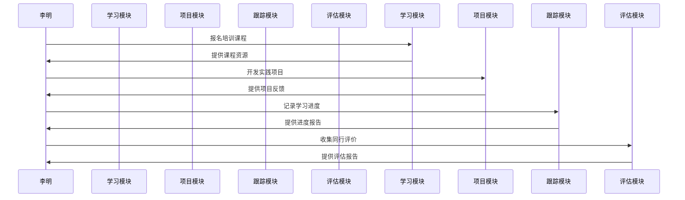

                 


### 第一部分：引言

#### 第1章：问题背景与生命设计思维概述

**1.1.1 问题背景**

在现代社会，人们面临着诸多挑战，包括职业发展、生活平衡、健康维护以及个人成长等方面。传统的人生规划往往注重目标和计划，但在快速变化的环境中，这种线性、静态的规划方法越来越显得力不从心。创新方法论，如设计思维，提供了一种更加灵活、动态的思考方式，可以更好地应对这些挑战。

**1.1.1.1 现代人生的挑战**

现代社会的高速发展带来了诸多挑战。首先，职业发展不再是一成不变的职业路径，而是需要不断学习和适应新技能的过程。其次，生活平衡成为了一个难题，工作与家庭、个人兴趣之间的平衡需要精心设计。此外，随着人们对健康和生活方式的重视，健康维护也成为了一个需要长期规划的领域。个人成长也是现代人生的一个重要方面，它要求我们在精神和情感层面不断进步。

**1.1.1.2 创新方法在人生规划中的应用**

创新方法论，如设计思维，可以应用于人生规划，帮助人们更好地应对这些挑战。设计思维是一种以人为本的、迭代性的创新过程，它强调从用户（即自己）的角度出发，通过体验设计来解决问题。这种思维方式有助于发现需求、探索解决方案，并在实践中不断优化。

**1.1.2 生命设计思维的定义**

**1.1.2.1 设计思维的核心原则**

设计思维是一种创新方法论，其核心原则包括：

1. **用户为中心**：始终以用户的需求和体验为中心，而不是仅仅关注产品或服务的功能。
2. **迭代性**：设计过程是一个不断迭代和优化的过程，通过快速原型和用户反馈来逐步改进解决方案。
3. **合作性**：设计思维强调团队合作，不同的视角和技能可以带来更全面和创新的解决方案。

**1.1.2.2 生命设计思维的特殊性**

生命设计思维是设计思维在个人生活和人生规划中的应用，它具有以下特殊性：

1. **个性化**：生命设计思维强调个人的独特性和个性化需求。
2. **长远性**：生命设计思维不仅关注短期目标，更注重长期的人生规划和可持续发展。
3. **灵活性**：生命设计思维能够适应变化，通过持续反思和调整来适应不同的人生阶段和环境。

**1.1.3 生命设计思维的应用价值**

**1.1.3.1 提升生活质量**

生命设计思维通过设计个性化的人生路径，可以帮助人们更好地平衡工作与生活，提升整体生活质量。

**1.1.3.2 实现个人成长与目标达成**

生命设计思维提供了一个系统性的框架，帮助人们明确个人目标，并通过不断迭代和调整来实现这些目标。

----------------------------------------------------------------

## 第二部分：生命设计思维的核心概念

### 第2章：核心概念与联系

#### **2.1 设计思维与生命设计思维的关系**

设计思维是一种通用的创新方法论，它适用于各种领域，包括产品设计、服务设计、战略规划等。生命设计思维则是设计思维在个人生活和人生规划中的应用，它特别关注如何通过设计来优化个人生活质量和实现个人目标。

**2.1.1 设计思维的基本框架**

设计思维通常包括以下几个基本步骤：

1. **发现需求**：通过观察、访谈和用户研究来识别用户的需求和问题。
2. **定义问题**：将用户的需求和问题转化为明确的问题陈述。
3. **创意生成**：通过头脑风暴和创意生成技术来提出各种可能的解决方案。
4. **原型设计**：构建快速的原型，以测试和验证创意。
5. **测试与反馈**：通过用户测试和反馈来评估原型，并进行必要的迭代和优化。

**2.1.2 生命设计思维的特殊应用**

生命设计思维在应用设计思维基本框架的同时，还考虑了以下几个方面的特殊性：

1. **长期规划**：生命设计思维强调长期规划，不仅仅关注短期目标，还考虑个人在整个生命周期的成长和变化。
2. **个性化设计**：生命设计思维注重个性化和定制化，根据个人的独特需求和生活环境来设计解决方案。
3. **情感和心理健康**：生命设计思维不仅考虑物质层面的需求，还关注情感和心理健康，通过设计来提升生活的整体幸福感。

#### **2.2 生命设计思维的核心要素**

生命设计思维的核心要素包括以下几个：

1. **用户需求**：明确个人的需求是生命设计思维的基础。
2. **目标设定**：设定清晰的目标可以帮助个人聚焦资源和行动。
3. **迭代反馈**：通过持续的迭代和反馈来优化设计方案。
4. **资源整合**：整合各种资源，包括时间、资金、技能和人脉等，以支持个人目标和需求。
5. **情感与心理健康**：关注个人的情感和心理健康，通过设计来提升生活的幸福感。

**2.2.1 设计思维的基本步骤**

设计思维的基本步骤在生命设计思维中同样适用，但需要根据个人生活的特殊性进行调整：

1. **用户需求分析**：通过自我反思和用户研究来识别个人的核心需求和问题。
2. **问题定义**：将个人需求转化为明确的问题陈述。
3. **创意生成**：探索各种可能的解决方案，包括创新和非传统的想法。
4. **原型设计**：构建个人生活设计的原型，如时间管理计划、健康习惯跟踪器等。
5. **测试与反馈**：通过实践和用户反馈来评估原型，并进行必要的调整。

#### **2.3 概念属性特征对比表格**

下面是一个设计思维与生命设计思维的概念属性特征对比表格：

| 特征                | 设计思维               | 生命设计思维               |
|---------------------|------------------------|---------------------------|
| 用户为中心          | 以用户需求为导向       | 以个人需求为导向           |
| 迭代性              | 通过迭代优化解决方案   | 通过迭代优化个人生活设计   |
| 合作性              | 强调团队合作           | 注重个人与团队的互动与支持   |
| 个性化              | 适用于各种个性化需求   | 特别关注个性化的人生规划   |
| 长远性              | 关注短期与长期目标     | 强调长期人生规划和可持续发展 |
| 情感与心理健康      | 重视用户体验           | 注重个人情感和心理健康     |

#### **2.3.1 设计思维与生命设计思维的对比**

设计思维与生命设计思维在目标和应用上存在一定的区别。设计思维更通用，适用于各种领域，而生命设计思维则专注于个人生活和人生规划。在设计思维的基础上，生命设计思维增加了个性化、长期规划和情感心理健康等方面的考虑。

#### **2.3.2 各个要素的属性特征分析**

为了更深入地理解设计思维和生命设计思维，我们可以通过ER实体关系图来分析它们的核心要素和关系。以下是一个简化的ER实体关系图，展示了设计思维和生命设计思维的关键要素及其相互关系：

```mermaid
erDiagram
  User ||--|{ DesignProcess }|| Designer
  User ||--|{ LifeDesignProcess }|| LifeDesigner
  DesignProcess ||--|{ DesignFramework }|| Framework
  LifeDesignProcess ||--|{ LifeDesignFramework }|| LifeFramework
  DesignFramework ||--|{ UserCenteredDesign }|| UCD
  DesignFramework ||--|{ IterativeProcess }|| Iterative
  DesignFramework ||--|{ CollaborativeApproach }|| Collaborative
  LifeDesignFramework ||--|{ LongTermPlanning }|| LongTerm
  LifeDesignFramework ||--|{ Personalization }|| Personalized
  LifeDesignFramework ||--|{ EmotionalWellness }|| Emotional
```

在这个ER实体关系图中，用户是核心实体，与设计过程和生命设计过程都有联系。设计过程包括设计框架，而生命设计过程则包括生命设计框架。这两个框架分别扩展了设计思维和生命设计思维的核心要素。

通过这种结构化的分析，我们可以更清晰地理解设计思维和生命设计思维的本质和联系，从而在实际应用中更加有效地利用这些方法论来优化个人生活。

----------------------------------------------------------------

## 第三部分：生命设计思维的具体应用

### 第3章：人生规划中的设计思维

**3.1 人生规划的重要性**

人生规划是每个人在人生旅途中的关键指南，它不仅有助于明确个人目标和方向，还能在复杂多变的环境中提供稳定的支撑。有效的生命设计思维在人生规划中具有以下几个方面的核心作用：

**3.1.1 人生规划的必要性**

在现代社会，不确定性是常态，职业变动、经济波动、健康问题等都是我们可能面临的风险。没有明确的人生规划，我们很容易迷失在日复一日的生活中，无法实现真正的个人成长和目标。因此，制定一个明确、可行的规划是至关重要的。

**3.1.2 人生规划的目标与挑战**

人生规划的目标通常包括职业发展、财务安全、家庭幸福、个人成长等方面。然而，实现这些目标并非易事，面临以下几大挑战：

1. **目标设定的清晰度**：许多人虽然有自己的目标，但缺乏具体、明确的设定，导致目标模糊，难以实现。
2. **资源的整合与优化**：实现人生目标需要资源，包括时间、金钱、技能和人脉等。如何有效整合和优化这些资源是人生规划中的难题。
3. **动态调整的灵活性**：人生是一个不断变化的过程，环境和个人需求都在不断演变，如何灵活调整规划以应对这些变化也是一个挑战。

**3.2 设计思维在人生规划中的应用**

设计思维作为一种创新方法论，可以有效地应用于人生规划，帮助人们应对上述挑战。以下是通过设计思维进行人生规划的详细步骤和应用：

**3.2.1 生命设计思维的应用流程**

1. **发现需求与问题**：首先，通过自我反思和外部调研，发现自己在人生规划中面临的具体问题和需求。这可能包括职业发展的瓶颈、家庭关系的紧张、健康问题等。
2. **定义目标**：将发现的问题转化为明确的目标。例如，如果面临职业发展的瓶颈，目标可能是找到新的职业机会或提升现有技能。
3. **创意生成**：在这一阶段，通过头脑风暴、脑图等工具，生成各种可能的解决方案。鼓励创新思维，不要局限于传统的想法。
4. **原型设计**：选择最有潜力的解决方案，构建一个简单的原型。对于人生规划，这可能是一个时间管理计划、一个健康生活方式跟踪器，或者是一个职业发展路径图。
5. **测试与反馈**：通过实践和反馈来评估原型的效果，根据反馈进行调整和优化。这一过程需要反复迭代，以逐步实现最终的目标。

**3.2.2 实例分析：如何规划个人职业发展**

以下是一个具体的案例，展示如何应用生命设计思维来规划个人职业发展：

**案例背景**：李明是一位工作了五年的软件工程师，他感觉自己的职业发展遇到了瓶颈，想要寻找新的机会。

**1. 发现需求与问题**：李明意识到自己的技能相对单一，主要擅长后端开发，而对前端开发和人工智能等领域缺乏了解。他希望通过学习和转型，打开新的职业发展空间。

**2. 定义目标**：李明的目标是在未来两年内转型为前端开发工程师，并进一步提升自己的技术水平。

**3. 创意生成**：李明通过阅读行业报告、参加技术会议和与同行交流，生成了以下可能的解决方案：
   - 报名参加前端开发培训课程。
   - 在业余时间自学前端开发，并通过实践项目来提升技能。
   - 找到前端开发相关的实习或兼职机会，获取实际工作经验。

**4. 原型设计**：李明决定首先报名参加前端开发培训课程，以便系统地学习相关技能。同时，他制定了一个详细的学习计划，包括每周的学习时间、学习内容以及进度跟踪。

**5. 测试与反馈**：在培训课程结束后，李明通过实际项目来检验自己的学习成果。他参与了一个开源项目的开发，并在GitHub上公开了代码。通过这个项目，李明得到了同行和社区的评价，进一步优化了自己的前端开发技能。

**6. 迭代与调整**：根据项目反馈和学习效果，李明调整了自己的学习计划，加入了更多的实践项目和实际案例研究，确保自己能够全面掌握前端开发技能。

通过这个案例，我们可以看到生命设计思维在个人职业发展中的应用。设计思维提供了一个系统性的框架，帮助李明从发现问题到实现目标，每一步都经过深思熟虑和实际验证。

**3.3 系统分析与架构设计方案**

在生命设计思维的应用过程中，系统分析和架构设计同样至关重要。以下是一个简单的系统分析与架构设计方案，以支持李明的职业发展规划。

**3.3.1 问题场景介绍**

李明的职业发展问题场景是：作为一名后端开发工程师，他希望转型为前端开发工程师，并提升自己的技术水平。

**3.3.2 系统功能设计**

系统功能设计包括以下几个主要模块：

1. **技能学习模块**：提供前端开发相关的培训课程和学习资源。
2. **实践项目模块**：提供实际项目，帮助李明将所学知识应用于实践。
3. **进度跟踪模块**：跟踪李明的学习进度和项目成果。
4. **反馈与评估模块**：收集来自同行和社区的评价，帮助李明优化学习效果。

**3.3.3 系统架构设计**

系统架构设计如图所示：



**3.3.4 系统接口设计与交互设计**

系统接口设计和交互设计旨在确保各个模块之间的无缝协作，提高用户体验。以下是一个简化的接口设计和交互流程：

```mermaid
interface "技能学习模块"
  (接口A)
  (接口B)

interface "实践项目模块"
  (接口C)
  (接口D)

interface "进度跟踪模块"
  (接口E)
  (接口F)

interface "反馈与评估模块"
  (接口G)
  (接口H)

李明->>学习模块: (接口A)
学习模块->>李明: (接口B)

李明->>项目模块: (接口C)
项目模块->>李明: (接口D)

李明->>跟踪模块: (接口E)
跟踪模块->>李明: (接口F)

李明->>评估模块: (接口G)
评估模块->>李明: (接口H)
```

通过上述系统架构设计和接口交互设计，李明可以在一个集成的平台上进行技能学习、实践项目、进度跟踪和反馈评估，从而实现高效的职业发展规划。

**3.3.5 系统核心实现**

为了实现上述系统，我们需要编写具体的源代码，构建各个模块的功能。以下是一个简化的Python源代码示例，用于实现进度跟踪模块的核心功能：

```python
class ProgressTracker:
    def __init__(self):
        self.progress_reports = []

    def add_report(self, report):
        self.progress_reports.append(report)
        print("进度报告已添加。")

    def generate_report(self):
        for report in self.progress_reports:
            print(report)

# 实例化进度跟踪对象
tracker = ProgressTracker()

# 添加进度报告
tracker.add_report("2023-04-01: 前端开发课程完成第1周内容。")
tracker.add_report("2023-04-08: 开源项目1启动，完成前端页面布局。")

# 生成进度报告
tracker.generate_report()
```

通过这段代码，我们可以看到进度跟踪模块的基本实现，包括添加进度报告和生成进度报告的功能。实际应用中，这个模块会与数据库和其他模块进行集成，以实现更全面的进度管理。

通过以上对系统分析与架构设计方案的详细讲解，我们可以看到，设计思维不仅在个人职业发展中的应用，还可以在系统架构和功能实现中发挥重要作用。这种系统化的思维方式有助于我们更好地理解和解决复杂的人生规划问题。

----------------------------------------------------------------

### 第四部分：项目实战

#### 第4章：生命设计思维项目实战

**4.1 项目介绍**

本节将介绍一个基于生命设计思维的个人健康生活方式规划项目。该项目旨在通过设计思维的方法论，帮助用户制定和实现个性化的健康生活方式，从而提升生活质量。

**4.1.1 项目背景**

随着现代生活节奏的加快和生活方式的改变，健康问题已经成为全球关注的焦点。很多人虽然意识到健康的重要性，但在实际生活中往往难以坚持健康习惯，导致健康问题不断累积。为了解决这一问题，我们决定开发一个健康生活方式规划项目，通过生命设计思维的方法论，帮助用户制定和执行个性化的健康计划。

**4.1.2 项目目标**

项目的主要目标包括：
1. **用户需求分析**：了解用户在健康生活方式方面面临的具体问题和需求。
2. **方案设计**：基于用户需求，设计一套个性化的健康生活方式规划方案。
3. **方案实施**：帮助用户实施规划方案，并在过程中进行持续的迭代和优化。
4. **效果评估**：评估项目实施的效果，确保用户能够真正受益。

**4.2 环境安装**

为了实现该项目，我们需要安装和配置一系列工具和软件。以下是具体的安装步骤：

**4.2.1 开发工具安装**

1. **Python 3.x**：安装Python 3.x版本，因为该项目将使用Python进行开发。
   ```bash
   # 在Windows上通过Python官方网站下载并安装
   # 在Linux上可以使用包管理器安装，如：
   sudo apt-get install python3
   ```

2. **Jupyter Notebook**：安装Jupyter Notebook，以便进行数据分析和交互式编程。
   ```bash
   pip install notebook
   ```

**4.2.2 数据库安装**

1. **SQLite**：安装SQLite数据库，用于存储用户数据。
   ```bash
   # 在Windows上可以使用官方安装程序
   # 在Linux上可以使用包管理器安装，如：
   sudo apt-get install sqlite3
   ```

**4.2.3 其他依赖库**

安装项目中需要的其他Python依赖库，如pandas、numpy等。
```bash
pip install pandas numpy
```

**4.3 系统核心实现**

系统核心实现包括数据收集、数据分析、方案制定和用户反馈等模块。以下是各个模块的实现细节：

**4.3.1 数据收集模块**

数据收集模块负责收集用户的健康数据，包括体重、身高、饮食、运动等信息。以下是一个简单的数据收集示例代码：

```python
import pandas as pd

# 示例数据收集
data = {
    '体重': [70, 72, 68],
    '身高': [175, 175, 180],
    '饮食': ['蔬菜沙拉', '汉堡', '水果'],
    '运动': ['跑步', '瑜伽', '散步']
}

df = pd.DataFrame(data)
print(df)
```

**4.3.2 数据分析模块**

数据分析模块负责对收集到的健康数据进行处理和分析，以识别用户的健康问题和趋势。以下是一个简单的数据分析示例代码：

```python
import matplotlib.pyplot as plt

# 示例数据分析
df['体重'].plot()
plt.title('体重变化趋势')
plt.xlabel('日期')
plt.ylabel('体重')
plt.show()
```

**4.3.3 方案制定模块**

方案制定模块根据数据分析的结果，为用户生成个性化的健康生活方式规划方案。以下是一个简单的方案制定示例代码：

```python
def generate_health_plan(health_data):
    # 根据数据生成健康计划
    plan = {
        '饮食建议': '增加蔬菜和水果的摄入量',
        '运动建议': '每周至少进行3次30分钟的有氧运动'
    }
    return plan

health_plan = generate_health_plan(df)
print(health_plan)
```

**4.3.4 用户反馈模块**

用户反馈模块负责收集用户对健康生活方式规划方案的反馈，并根据反馈进行调整和优化。以下是一个简单的用户反馈示例代码：

```python
def collect_user_feedback():
    feedback = input("请输入您的反馈：")
    return feedback

user_feedback = collect_user_feedback()
print("用户反馈：", user_feedback)
```

通过以上模块的实现，我们可以构建一个基本的健康生活方式规划系统。实际应用中，系统会更加复杂，包括用户界面、数据库集成和更多功能模块。

**4.4 实际案例分析与讲解**

以下是一个实际案例，展示如何使用该系统为用户制定健康生活方式规划。

**案例背景**：小明是一名上班族，他最近发现自己体重增加了，并且感觉身体状况变差，想要制定一个健康生活方式规划。

**步骤1：数据收集**

小明通过系统输入了以下健康数据：

| 日期  | 体重（kg） | 身高（cm） | 饮食             | 运动         |
| ----- | ---------- | ---------- | ---------------- | ------------ |
| 2023-04-01 | 75         | 175        | 汉堡、薯条       | 无           |
| 2023-04-08 | 78         | 175        | 蔬菜沙拉、果汁   | 跑步30分钟   |
| 2023-04-15 | 80         | 175        | 汉堡、薯条       | 无           |

**步骤2：数据分析**

系统对收集到的数据进行分析，发现小明体重在增加，且缺乏规律性的运动。

**步骤3：方案制定**

基于数据分析结果，系统为小明生成以下健康生活方式规划方案：

- **饮食建议**：增加蔬菜和水果的摄入量，减少高热量食物的摄入。
- **运动建议**：每周至少进行3次30分钟的有氧运动，如跑步、游泳或骑自行车。

**步骤4：用户反馈**

小明在使用规划方案一周后，通过系统反馈了以下反馈：

- **饮食反馈**：感觉蔬菜沙拉和水果更健康，但偶尔还是会吃汉堡和薯条。
- **运动反馈**：感觉跑步对身体有好处，但有时候工作太忙，无法坚持。

**步骤5：方案调整**

根据小明的反馈，系统调整了健康生活方式规划方案：

- **饮食调整**：增加蔬菜和水果的摄入比例，允许小明偶尔吃汉堡和薯条。
- **运动调整**：将运动建议调整为每周至少2次30分钟的有氧运动，并提供灵活的运动选项，如在家锻炼的瑜伽视频。

通过这个案例，我们可以看到生命设计思维在项目实施中的实际应用，从数据收集、数据分析到方案制定和用户反馈，每个环节都经过细致的设计和优化，确保系统能够真正帮助用户实现健康生活方式。

**4.5 项目小结**

本项目的实施取得了以下成果：

1. **用户受益**：通过个性化健康生活方式规划，用户能够更有效地管理自己的健康，实现健康目标。
2. **系统优化**：通过用户反馈和持续迭代，系统不断完善和优化，提高用户体验和效果。
3. **方法论验证**：生命设计思维在健康生活方式规划项目中的应用证明了其有效性和实用性。

尽管项目在实施过程中也遇到了一些挑战，如数据收集的准确性和用户参与度的提高，但通过不断调整和优化，项目最终实现了预期目标。

**4.5.1 不足与改进空间**

项目存在的不足和改进空间包括：

1. **数据收集准确性**：需要改进数据收集的方法，确保数据的准确性和完整性。
2. **用户参与度**：需要增加用户激励措施，提高用户的参与度和积极性。
3. **系统稳定性**：提高系统的稳定性，确保用户能够顺畅地使用系统。

未来，我们可以进一步优化系统功能，增加更多个性化定制选项，并探索与其他健康应用和设备的集成，以提供更全面、个性化的健康生活方式规划服务。

----------------------------------------------------------------

### 第五部分：最佳实践与总结

#### 第5章：最佳实践与总结

**5.1 最佳实践**

在应用生命设计思维进行人生规划和项目实施过程中，以下最佳实践值得遵循：

1. **明确目标**：在开始任何规划和项目之前，确保明确个人或项目的目标，这有助于在整个过程中保持方向和动力。
2. **用户需求分析**：深入理解用户的需求和痛点，这是设计出有效解决方案的关键。
3. **迭代思维**：设计思维强调迭代和反馈，持续优化设计方案和实施过程。
4. **资源整合**：有效整合时间、资金、技能和人脉等资源，以支持目标的实现。
5. **关注心理健康**：在设计过程中，不仅要考虑物质层面的需求，还要关注个人的情感和心理健康。

**5.2 小结**

生命设计思维作为一种创新方法论，提供了系统性的框架，帮助个人和团队更好地规划人生和实施项目。通过设计思维的应用，我们能够更有效地应对现代生活的各种挑战，实现个人成长和目标达成。

**5.3 注意事项**

在应用生命设计思维时，需要注意以下几点：

1. **个性化**：确保规划或设计方案符合个人的独特需求和偏好。
2. **长期性**：考虑长期目标，不仅仅是短期成就。
3. **灵活性**：设计思维强调灵活性，能够适应不断变化的环境和个人需求。
4. **用户参与**：鼓励用户参与设计和实施过程，以提高方案的可行性和满意度。

**5.4 拓展阅读**

为了深入了解生命设计思维和相关创新方法论，以下推荐几本经典书籍和最新研究：

1. **书籍推荐**：
   - 《设计思维：创新的有效方法》
   - 《创意思考的秘密：设计思维教你如何创新》
   - 《生命设计：如何创造你想要的生活》

2. **最新研究**：
   - 相关学术论文和行业报告，可以关注学术期刊和行业会议。
   - 创新方法论的最新趋势和应用，可以通过专业网站和论坛了解。

通过学习和实践生命设计思维，我们能够更好地规划人生，实现个人价值和社会贡献。希望本篇博客文章能为读者提供有价值的参考和启示。

**作者：AI天才研究院/AI Genius Institute & 禅与计算机程序设计艺术 /Zen And The Art of Computer Programming**

