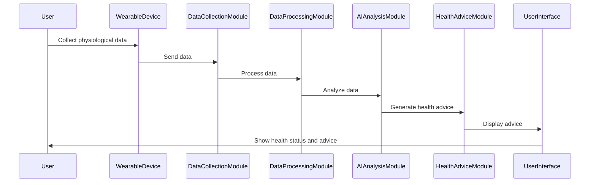

                 


### 引言

在人类历史的进程中，我们一直在寻求提升自身生活品质的方法。从古至今，从自然哲学到现代科学，人类对于如何优化生活有着无尽的探索。而随着科技的进步，尤其是计算机科学与人工智能的飞速发展，我们迎来了一个全新的领域——生命黑客。生命黑客不仅是一种概念，更是一种科学方法，它旨在通过科技创新来提升人类的生活质量和健康水平。

本书《生命黑客实验室：优化生活的科学方法》旨在探讨生命黑客的科学原理、方法与应用。我们将从以下几个方面进行详细阐述：

1. **背景介绍**：介绍生命黑客的定义、意义以及它解决的问题。
2. **核心概念与联系**：分析生命黑客中的核心概念及其相互联系。
3. **算法原理讲解**：深入解析生命优化算法的原理，并提供具体的应用实例。
4. **系统分析与架构设计方案**：探讨生命优化系统的设计与实现。
5. **项目实战**：通过具体案例展示生命黑客在实践中的应用。
6. **最佳实践 tips**：提供一些实用的生活优化技巧和建议。
7. **小结与未来展望**：总结本书的主要内容，并对未来进行展望。

### 关键词

- **生命黑客**：一种利用科技手段提升生命质量和健康水平的方法。
- **科学方法**：一种系统化、理性化的探索和解决问题的方法。
- **生活优化**：通过科技手段改善生活品质的过程。
- **算法**：用于解决特定问题的计算步骤和过程。
- **系统架构**：系统的整体结构和组成部分。
- **实践应用**：具体案例的实际应用和效果分析。

### 摘要

本书将带领读者深入了解生命黑客这一新兴领域。通过介绍生命黑客的定义、背景和核心概念，我们探讨了生命优化算法的原理和应用，展示了生命优化系统的设计与实现过程。书中还通过具体案例展示了生命黑客在实践中的应用，并提供了一些实用的生活优化技巧和建议。通过阅读本书，读者将能够掌握生命黑客的基本理论和方法，并将其应用于实际生活中，提升自身的生活品质和健康水平。同时，本书也对生命黑客的未来发展进行了展望，为读者提供了无限的可能性和启示。无论你是科技爱好者、健康生活的追求者，还是对生命优化感兴趣的专业人士，本书都将为你带来全新的视角和深刻的思考。让我们一同走进生命黑客的世界，开启优化生活的新篇章。

## 1. 背景介绍

### 1.1 生命黑客的定义

生命黑客（Lifehacking）是一种通过科技创新和科学方法，对日常生活进行优化和改进的实践。它源自于计算机领域的“黑客”一词，本意是指那些具有高超技术能力，能够突破常规限制，解决复杂问题的人。在生命黑客的概念中，"黑客"不再是对系统进行恶意攻击，而是对生活进行积极的、有目的的优化。

生命黑客的核心在于利用科技手段，提高个人效率、增强身心健康、提升生活质量。这种做法不仅局限于技术领域，还包括健康、营养、运动、时间管理等多个方面。通过整合各种资源和技术，生命黑客试图找到最佳的生活方式，以实现个人成长和幸福。

### 1.2 生命黑客的意义

生命黑客的意义在于其具有深远的影响，不仅在于提升个人生活质量，更在于推动社会和科技的进步。以下是生命黑客的几个关键意义：

1. **效率提升**：生命黑客通过科技手段优化日常生活，从而显著提升个人和时间利用效率。例如，利用应用程序进行日程管理，通过智能设备监测健康状态，这些都有助于提高生活和工作效率。

2. **健康优化**：生命黑客强调健康生活，通过合理饮食、科学锻炼和良好的作息习惯，帮助人们保持健康。这不仅延长了寿命，也提高了生活质量。

3. **科技普及**：生命黑客推动了科技在日常生活中的普及。许多原本只属于科技领域的工具和概念，如人工智能、大数据分析等，现在已经被广泛应用于健康生活领域。

4. **创新驱动**：生命黑客激发了人们对科技的创新思维。通过不断尝试和实验，人们能够发现新的生活优化方法，推动科技进步。

5. **社会影响**：生命黑客的理念和实践能够影响整个社会。当越来越多的人开始注重健康和生活质量，社会整体的健康水平和幸福感都会得到提升。

### 1.3 问题描述

尽管生命黑客的意义重大，但当前仍存在一些问题和挑战：

1. **信息过载**：随着科技的发展，人们获取的信息量急剧增加，导致信息过载。如何筛选和利用有效的信息，成为生命黑客面临的一大难题。

2. **个性化不足**：现有的许多生命优化方法和工具缺乏个性化。每个人的生活环境和需求不同，因此需要更定制化的解决方案。

3. **隐私和安全**：生命黑客涉及个人健康数据和其他敏感信息，如何保护这些数据的隐私和安全，是一个重要的问题。

4. **社会接受度**：虽然生命黑客的理念受到越来越多人的认可，但仍有部分人对科技持保留态度，这限制了生命黑客的普及和应用。

### 1.4 问题解决

为了解决上述问题，生命黑客实验室应运而生。生命黑客实验室的设立目的如下：

1. **研究与开发**：通过实验室的研究与开发，探索新的生命优化方法和工具，不断推动科技的进步。

2. **数据收集与分析**：建立和完善数据收集与分析系统，为个性化健康管理和生活优化提供数据支持。

3. **用户体验设计**：注重用户体验设计，确保生命优化工具和方法的易用性和有效性。

4. **隐私保护**：制定严格的隐私保护政策，确保用户数据的安全。

5. **教育培训**：通过培训和教育活动，提高公众对生命黑客的认识和接受度。

### 1.5 边界与外延

生命黑客虽然是一个充满潜力的领域，但也存在一些边界和限制。以下是生命黑客的几个关键边界：

1. **科学边界**：生命黑客需要建立在科学基础上，不能超越科学的范畴。例如，对于生命优化方法的评估和应用，需要基于严格的科学实验和数据分析。

2. **技术边界**：生命黑客需要依赖现有的科技手段，不能依赖于尚未成熟或不可靠的技术。

3. **道德边界**：生命黑客的应用需要遵循伦理和道德原则，不能侵犯个人隐私或造成其他负面影响。

4. **法律边界**：生命黑客需要遵守相关法律法规，确保其应用不会触犯法律。

5. **社会边界**：生命黑客的应用需要得到社会的认可和支持，不能违背社会价值观。

### 1.6 概念结构与核心要素组成

为了更好地理解和应用生命黑客，我们需要明确其核心概念和要素组成。以下是生命黑客的关键组成部分：

1. **科学方法论**：生命黑客的核心在于科学方法论。这种方法论包括数据收集、数据分析、实验设计、假设验证等环节，确保生命优化方法的科学性和可靠性。

2. **技术创新**：技术创新是生命黑客的重要推动力。通过技术创新，我们可以开发出更高效、更可靠的工具和方法，实现更精准的生活优化。

3. **个性化服务**：个性化服务是生命黑客的核心价值之一。通过收集和分析个人数据，我们可以为每个人提供定制化的生活优化方案。

4. **用户体验**：用户体验是生命黑客成功的关键因素。一个良好的用户体验不仅能够提高用户的满意度，还能促进技术的普及和应用。

5. **数据隐私与安全**：数据隐私与安全是生命黑客面临的重大挑战。我们需要采取有效的措施，确保用户数据的安全和隐私。

通过以上分析，我们可以明确生命黑客的定义、意义、问题、解决方案以及其边界与外延。接下来，我们将进一步探讨生命黑客的核心概念及其相互联系，为后续章节的内容奠定基础。

## 2. 核心概念与联系

### 2.1 核心概念原理

在生命黑客的实践中，有一些核心概念是不可或缺的。这些概念包括但不限于：

1. **数据驱动决策**：数据驱动决策是指通过收集和分析大量数据，来指导决策的过程。这种方法能够帮助我们更准确地了解现状，从而做出更明智的决策。

2. **个性化健康评估**：个性化健康评估是通过分析个人健康数据，评估个体的健康状况和潜在风险。这种评估可以帮助我们制定个性化的健康计划，实现精准的健康管理。

3. **可穿戴设备**：可穿戴设备是一种能够持续监测用户生理和活动数据的设备。通过这些设备，我们可以实时获取用户的健康数据，为健康管理和优化提供数据支持。

4. **人工智能**：人工智能在生命黑客中扮演着重要角色。通过人工智能技术，我们可以对海量数据进行分析，提取有价值的信息，并自动化执行一些复杂的任务。

5. **生物反馈**：生物反馈是一种通过传感器监测人体生理信号，并将其转换为可感知的信号，帮助用户调整行为和生理状态的方法。

### 2.2 概念属性特征对比

为了更好地理解这些核心概念，我们将在下表中对比它们的属性特征：

| 概念 | 定义 | 主要属性特征 | 关联关系 |
| --- | --- | --- | --- |
| 数据驱动决策 | 通过数据分析指导决策 | 精准性、实时性、系统性 | - 个性化健康评估 |
| 个性化健康评估 | 分析个人健康数据 | 个性化、精准性、持续监测 | - 数据驱动决策 |
| 可穿戴设备 | 持续监测生理和活动数据 | 实时性、便携性、多功能性 | - 数据驱动决策 |
| 人工智能 | 分析海量数据 | 自主性、智能性、高效性 | - 数据驱动决策 |
| 生物反馈 | 监测人体生理信号 | 可感知性、即时调整性 | - 数据驱动决策 |

从上表可以看出，这些概念在生命黑客中都扮演着关键角色。它们相互关联，共同构建了一个完整的数据驱动系统。例如，数据驱动决策依赖于个性化健康评估和可穿戴设备提供的数据，而人工智能则负责分析这些数据，并生成决策建议。生物反馈则通过监测和调整人体生理信号，实现健康管理和优化。

### 2.3 ER实体关系图架构

为了更直观地展示这些核心概念之间的联系，我们可以使用实体关系图（Entity-Relationship Diagram, ER图）来描述。以下是一个简化的ER图，展示了数据驱动决策、个性化健康评估、可穿戴设备、人工智能和生物反馈之间的实体关系：

```mermaid
erDiagram
  DataDrivenDecision ||--|{ PersonalizedHealthAssessment }|-- DataCollection
  DataDrivenDecision ||--|{ WearableDevice }|-- DataMonitoring
  DataDrivenDecision ||--|{ ArtificialIntelligence }|-- DataAnalysis
  DataDrivenDecision ||--|{ BioFeedback }|-- PhysiologicalSignalMonitoring
  PersonalizedHealthAssessment ||--|{ HealthRiskAssessment }|-- HealthDataAnalysis
  WearableDevice ||--|{ HeartRateMonitor }|-- VitalSignMonitoring
  WearableDevice ||--|{ ActivityTracker }|-- MovementMonitoring
  ArtificialIntelligence ||--|{ MachineLearning }|-- PredictiveAnalytics
  ArtificialIntelligence ||--|{ DataVisualization }|-- InsightGeneration
  BioFeedback ||--|{ BioSensor }|-- PhysiologicalSignalFeedback
  BioFeedback ||--|{ NeuroFeedback }|-- CognitiveBehaviorModification
```

在这个ER图中，每个实体都表示一个核心概念，它们通过不同的关系相互连接。例如，数据驱动决策与个性化健康评估、可穿戴设备、人工智能和生物反馈之间存在直接关系，表明这些概念共同构成了一个完整的数据驱动系统。

通过这个ER图，我们可以更清晰地理解生命黑客系统中各个概念之间的关系，有助于我们在实际应用中更好地整合这些技术，实现个性化健康管理和优化。

### 2.4 生命黑客与传统健康生活方式的对比

在探讨生命黑客与传统健康生活方式的对比时，我们首先需要明确两者之间的定义和核心目标。传统健康生活方式主要依赖于常识、经验和个人习惯来维持和改善健康，而生命黑客则利用科技手段进行系统的优化和提升。

#### 2.4.1 生活方式的差异

1. **信息处理方式**：
   - **传统健康生活方式**：主要依赖于个人经验和常识，例如健康饮食、适量运动、保持良好的作息习惯等。这些方式往往缺乏系统性和科学依据。
   - **生命黑客**：通过科技手段，如可穿戴设备、健康监测软件等，收集和分析个人健康数据，以实现更科学、更精准的健康管理。

2. **健康监测**：
   - **传统健康生活方式**：定期进行健康检查，但往往缺乏持续性和实时性。
   - **生命黑客**：利用可穿戴设备实时监测健康状况，如心率、血压、睡眠质量等，确保能够及时发现健康问题并采取措施。

3. **健康干预**：
   - **传统健康生活方式**：主要依靠自我控制和自律，通过改变生活习惯来改善健康。
   - **生命黑客**：通过数据分析和人工智能算法，提供个性化的健康建议和干预措施，如营养建议、运动计划等。

4. **生活方式调整**：
   - **传统健康生活方式**：通常是在出现健康问题时才进行改变，缺乏预防性措施。
   - **生命黑客**：通过持续的健康监测和数据分析，能够提前发现潜在的健康风险，并采取预防性措施，从而避免健康问题的发生。

#### 2.4.2 优缺点对比

1. **优点**：
   - **传统健康生活方式**：强调个人自律和习惯培养，简单易行，适合大多数人。
   - **生命黑客**：通过科技手段提供更科学、个性化的健康管理和优化方案，效果更显著。

2. **缺点**：
   - **传统健康生活方式**：缺乏系统性和科学依据，效果因人而异，难以量化。
   - **生命黑客**：依赖科技设备和软件，存在一定的经济和技术门槛，且需关注数据隐私和安全问题。

#### 2.4.3 应用场景

1. **个人健康管理**：
   - **传统健康生活方式**：适用于健康状态较好，希望通过改善生活习惯来维持健康的人群。
   - **生命黑客**：适用于需要更精确、更个性化的健康管理和优化的人群，如慢性病患者、老年人等。

2. **公共健康监控**：
   - **传统健康生活方式**：主要依赖于健康教育和宣传活动，效果较为缓慢。
   - **生命黑客**：通过大数据和人工智能技术，能够实现对大规模人群的健康状况进行实时监测和分析，有助于早期发现健康问题并采取预防措施。

3. **健康产业发展**：
   - **传统健康生活方式**：推动健康产业发展的潜力有限，主要依赖于传统健康产品和服务的需求。
   - **生命黑客**：通过科技创新，为健康产业带来新的发展机遇，如智能健康设备、个性化健康服务、健康数据分析和应用等。

通过上述对比，我们可以看出生命黑客与传统健康生活方式在信息处理、健康监测、健康干预和生活方式调整等方面存在显著差异。生命黑客的优势在于其科学性和个性化，但同时也需要关注技术依赖和数据隐私等问题。在实际应用中，两者可以相互补充，共同推动健康生活方式的优化和发展。

### 2.5 传统方法与科学方法的对比

在探讨生命黑客与传统方法的对比时，我们需要深入分析两者的差异，以便更好地理解生命黑客的优势和应用场景。传统方法通常指基于经验和常识的健康生活方式，而科学方法则强调数据驱动和系统分析。

#### 2.5.1 数据驱动与经验依赖

1. **数据驱动**：
   - **传统方法**：往往依赖于个人的经验和常识，如健康饮食、适量运动、保持良好作息等。这些方法缺乏系统性和科学依据，效果因人而异，难以量化。
   - **科学方法**：通过数据收集和分析，对健康生活方式进行科学验证和优化。这种方法能够提供更精确、更个性化的健康建议，从而提高健康管理的有效性。

2. **优势与劣势**：
   - **传统方法**：简单易行，适合大多数人，但缺乏科学依据，难以应对复杂健康问题。
   - **科学方法**：能够提供更可靠的健康数据和更科学的健康管理方案，但需要一定的技术支持和数据分析能力。

#### 2.5.2 系统分析与个体化

1. **系统分析**：
   - **传统方法**：往往关注单一因素，如饮食、运动等，缺乏系统化的健康管理。
   - **科学方法**：通过多维度数据分析和系统建模，对健康生活方式进行全方位分析，从而实现更全面、更精准的健康管理。

2. **个体化**：
   - **传统方法**：通常采用通用建议，难以满足个体差异。
   - **科学方法**：通过个性化健康评估，为每个人提供量身定制的健康建议，提高健康管理的针对性和有效性。

#### 2.5.3 适应性与灵活性

1. **适应性**：
   - **传统方法**：缺乏适应性，难以应对不断变化的健康需求和生活方式。
   - **科学方法**：通过持续的数据收集和分析，能够实时调整健康建议，以适应个体的变化。

2. **灵活性**：
   - **传统方法**：通常固定不变，难以适应不同环境和情境。
   - **科学方法**：利用科技手段，如人工智能和大数据分析，能够灵活地应对各种健康管理和优化需求。

#### 2.5.4 应用场景

1. **个人健康管理**：
   - **传统方法**：适用于健康状态较好，希望通过改善生活习惯来维持健康的人群。
   - **科学方法**：适用于需要更精确、更个性化的健康管理和优化的人群，如慢性病患者、老年人等。

2. **公共健康监控**：
   - **传统方法**：主要依赖于健康教育和宣传活动，效果较为缓慢。
   - **科学方法**：通过大数据和人工智能技术，能够实现对大规模人群的健康状况进行实时监测和分析，有助于早期发现健康问题并采取预防措施。

3. **健康产业发展**：
   - **传统方法**：推动健康产业发展的潜力有限，主要依赖于传统健康产品和服务的需求。
   - **科学方法**：通过科技创新，为健康产业带来新的发展机遇，如智能健康设备、个性化健康服务、健康数据分析和应用等。

通过上述对比，我们可以看出科学方法在数据驱动、系统分析、个体化和适应性等方面具有显著优势，这些优势使得科学方法在健康管理和优化中具有更高的效力和灵活性。然而，科学方法也存在一定的技术依赖和数据隐私等问题，需要在实际应用中加以关注和解决。结合传统方法和科学方法的优势，可以更好地推动健康生活方式的优化和发展。

### 2.6 生命黑客中的核心概念原理

在生命黑客的实践中，核心概念原理扮演着至关重要的角色。这些概念不仅为生命黑客提供了理论基础，也为我们理解和应用生命黑客提供了指导。以下是生命黑客中的几个关键核心概念原理：

#### 2.6.1 数据驱动决策原理

数据驱动决策原理是生命黑客的核心之一。它强调通过收集和分析大量数据来指导决策过程。这种方法能够帮助我们更准确地了解现状，识别问题，并制定有效的解决方案。具体步骤如下：

1. **数据收集**：通过传感器、健康监测设备和在线平台收集个人健康数据，如心率、血压、睡眠质量、运动量等。
2. **数据预处理**：对收集到的数据进行清洗、去噪和转换，使其适用于分析。
3. **数据分析**：使用统计方法、机器学习和数据挖掘技术对数据进行分析，提取有价值的信息。
4. **决策制定**：基于分析结果制定个性化的健康管理和优化方案。

#### 2.6.2 个性化健康评估原理

个性化健康评估原理旨在通过分析个人健康数据，评估个体的健康状况和潜在风险。这种评估能够帮助个体了解自己的健康状态，从而制定针对性的健康计划。以下是个性化健康评估的步骤：

1. **数据收集**：收集个体的基础健康数据，如身高、体重、血压、血糖等。
2. **数据整合**：整合来自不同来源的健康数据，如医疗记录、运动监测数据等。
3. **风险评估**：使用风险评估模型分析个体健康数据的异常和潜在风险。
4. **健康建议**：根据风险评估结果，提供个性化的健康建议和干预措施。

#### 2.6.3 可穿戴设备原理

可穿戴设备是生命黑客中的重要工具，能够持续监测用户的生理和活动数据。这些设备的工作原理主要包括：

1. **传感器技术**：可穿戴设备内置各种传感器，如心率传感器、加速度传感器、温度传感器等，用于监测用户的生理和活动数据。
2. **数据处理**：传感器收集到的数据通过内置处理器进行处理，如滤波、放大、数字化等。
3. **数据传输**：处理后的数据通过无线通信技术（如蓝牙、Wi-Fi等）传输到手机或电脑等设备。
4. **数据分析**：用户可以通过手机或电脑应用对数据进行分析，了解自己的健康状况。

#### 2.6.4 人工智能原理

人工智能在生命黑客中扮演着关键角色，用于分析海量数据并生成个性化健康建议。以下是人工智能在生命黑客中的几个关键原理：

1. **机器学习**：通过训练模型，使计算机能够从数据中学习和提取知识。在生命黑客中，机器学习用于分析健康数据，预测健康趋势，提供个性化建议。
2. **深度学习**：深度学习是一种特殊类型的机器学习，通过多层神经网络对数据进行分析。在生命黑客中，深度学习被用于复杂的健康数据分析和预测。
3. **自然语言处理**：自然语言处理（NLP）用于理解和生成自然语言文本。在生命黑客中，NLP被用于分析用户输入的健康问题和生成个性化的健康建议。

#### 2.6.5 生物反馈原理

生物反馈是一种通过传感器监测人体生理信号，并将其转换为可感知的信号，帮助用户调整行为和生理状态的方法。以下是生物反馈的原理和步骤：

1. **信号监测**：使用传感器监测用户的生理信号，如心率、血压、皮肤电反应等。
2. **信号转换**：将生理信号转换为电信号或其他形式的信号，如音频、视觉信号等。
3. **反馈机制**：通过反馈机制，将转换后的信号反馈给用户，帮助用户了解自己的生理状态，并进行相应的调整。
4. **行为调整**：用户根据反馈信号调整自己的行为和生理状态，以实现健康管理和优化。

通过上述核心概念原理的详细阐述，我们可以更好地理解生命黑客的理论基础和实践方法。这些原理不仅为生命黑客提供了科学依据，也为我们在实际应用中提供了指导。在接下来的章节中，我们将进一步探讨这些概念在生命黑客系统中的应用和实现。

### 2.7 生命黑客系统架构设计

#### 2.7.1 系统架构图

生命黑客系统的架构设计需要综合考虑数据收集、处理、分析和应用等各个环节，以确保系统能够高效、稳定地运行。以下是一个简化的生命黑客系统架构图：



在这个架构图中，用户通过可穿戴设备（如智能手表、健康手环等）收集生理数据，数据收集模块负责收集和存储这些数据。数据经过处理模块的处理，如清洗、去噪和转换等，然后传递给人工智能分析模块。人工智能分析模块利用机器学习和深度学习技术对数据进行分析，生成个性化的健康建议。最后，健康建议通过用户界面模块展示给用户，帮助用户了解自己的健康状态并采取相应的措施。

#### 2.7.2 数据流设计

生命黑客系统中的数据流设计是系统架构设计的重要组成部分。以下是生命黑客系统中的数据流设计：

1. **数据收集**：
   - 用户通过可穿戴设备（如心率传感器、加速度传感器等）收集生理数据，如心率、步数、睡眠质量等。
   - 收集到的数据通过无线通信（如蓝牙、Wi-Fi等）传输到手机或数据收集模块。

2. **数据预处理**：
   - 数据收集模块对收集到的原始数据进行预处理，包括去噪、过滤和转换等。
   - 预处理后的数据存储在数据库中，以便后续分析。

3. **数据存储**：
   - 预处理后的数据存储在关系数据库或时间序列数据库中，以便进行高效的数据查询和分析。

4. **数据分析和处理**：
   - 数据处理模块从数据库中提取数据，并使用统计方法和机器学习算法对数据进行分析。
   - 分析结果包括健康指标的评估、健康风险的预测和个性化的健康建议。

5. **数据展示**：
   - 健康建议通过用户界面模块展示给用户，包括图表、文字描述和音频提示等。
   - 用户可以根据健康建议调整生活方式和健康行为。

#### 2.7.3 系统模块划分

生命黑客系统可以分为以下几个主要模块：

1. **数据收集模块**：
   - 负责从可穿戴设备收集生理数据，如心率、步数、睡眠质量等。
   - 通过无线通信将数据传输到手机或服务器。

2. **数据预处理模块**：
   - 负责对收集到的原始数据进行预处理，包括去噪、滤波和转换等。
   - 确保数据的质量和准确性。

3. **数据处理模块**：
   - 负责从数据库中提取数据，并进行进一步的统计分析和机器学习处理。
   - 生成健康指标评估和健康风险预测结果。

4. **人工智能分析模块**：
   - 利用机器学习和深度学习技术对数据进行训练和分析。
   - 生成个性化的健康建议和干预措施。

5. **健康建议模块**：
   - 负责生成和展示健康建议，包括图表、文字描述和音频提示等。
   - 提供用户与系统的交互界面。

6. **用户界面模块**：
   - 负责用户与系统的交互，包括数据输入、查询、健康建议展示等。
   - 提供友好的用户界面，使用户能够轻松地使用系统。

通过上述系统架构设计，生命黑客系统能够高效地收集、处理和分析用户健康数据，为用户提供个性化的健康建议和干预措施。这种设计不仅提高了系统的性能和稳定性，还确保了数据的安全和隐私。在接下来的章节中，我们将进一步探讨生命黑客系统的具体实现和实战应用。

### 2.8 生命黑客系统接口设计和系统交互

为了实现生命黑客系统的功能，我们需要设计合理的接口和交互流程，确保系统能够高效、稳定地运行。以下将从数据输入、数据处理、健康建议生成和展示等环节，详细阐述系统接口设计和交互流程。

#### 2.8.1 数据输入接口设计

数据输入接口是生命黑客系统的关键组成部分，负责从用户设备收集生理数据。以下是数据输入接口的设计要点：

1. **传感器数据采集**：
   - 通过可穿戴设备（如智能手表、健康手环等）内置的传感器（如心率传感器、加速度传感器等）采集用户的生理数据。
   - 传感器数据包括心率、步数、睡眠质量、体温等。

2. **无线通信协议**：
   - 使用蓝牙（BLE）或Wi-Fi协议将传感器数据传输到用户设备（如智能手机）。
   - 传输过程中，确保数据传输的稳定性和安全性。

3. **数据同步机制**：
   - 用户设备定期将传感器数据同步到云端服务器，以便进行后续处理和分析。
   - 同步机制应具备自动重连和数据完整性校验功能，确保数据传输的可靠性。

4. **用户输入接口**：
   - 提供用户手动输入健康数据的接口，如饮食记录、运动计划等。
   - 用户可以通过手机应用、网页或语音助手等方式输入数据。

#### 2.8.2 数据处理接口设计

数据处理接口负责对输入的数据进行预处理、分析和存储，以下是数据处理接口的设计要点：

1. **数据预处理**：
   - 对采集到的原始数据进行清洗、去噪和转换等预处理操作，确保数据的质量和准确性。
   - 去除异常值、重复数据和噪声数据，保留有效的健康数据。

2. **数据存储**：
   - 将预处理后的数据存储到数据库中，如关系数据库（如MySQL）或时间序列数据库（如InfluxDB）。
   - 数据存储结构应支持高效的数据查询和统计分析。

3. **数据处理算法**：
   - 设计和实现数据处理算法，如数据标准化、特征提取、时间序列预测等。
   - 算法应根据实际需求进行调整和优化，以提高数据处理效率和准确性。

4. **数据同步与更新**：
   - 定期从数据库中提取数据，更新用户健康档案和系统分析结果。
   - 数据同步机制应具备自动重连和数据一致性校验功能，确保数据的一致性和完整性。

#### 2.8.3 健康建议生成接口设计

健康建议生成接口负责根据用户健康数据和分析结果，生成个性化的健康建议和干预措施。以下是健康建议生成接口的设计要点：

1. **健康模型训练**：
   - 使用机器学习和深度学习技术，对用户健康数据进行训练，构建健康预测模型和干预策略。
   - 模型训练应涵盖多个健康指标和风险因素，以提高健康建议的准确性和全面性。

2. **健康建议生成**：
   - 根据用户的健康数据和分析结果，生成个性化的健康建议，如饮食调整、运动计划、作息安排等。
   - 健康建议应具备针对性、实用性和可操作性，以帮助用户更好地管理健康。

3. **反馈机制**：
   - 提供用户对健康建议的反馈机制，如采纳情况、效果评估等。
   - 根据用户反馈调整健康建议，提高系统的适应性和用户体验。

#### 2.8.4 健康建议展示接口设计

健康建议展示接口负责将生成的健康建议展示给用户，以下是健康建议展示接口的设计要点：

1. **用户界面**：
   - 设计简洁、直观的用户界面，展示健康建议和相关信息。
   - 用户界面应支持多种展示形式，如图表、文字描述、语音提示等。

2. **交互体验**：
   - 提供便捷的用户交互功能，如快速查询、个性化设置、提醒通知等。
   - 优化用户交互体验，提高系统的易用性和用户满意度。

3. **推送机制**：
   - 设计智能推送机制，根据用户健康状态和需求，及时推送健康建议和提醒。
   - 推送内容应具备个性化和实时性，以提高用户的健康意识和行动力。

4. **反馈收集**：
   - 提供用户对健康建议的反馈收集机制，如采纳情况、效果评估等。
   - 根据用户反馈调整健康建议和系统功能，提高系统的适应性和用户体验。

通过上述系统接口设计和交互流程，生命黑客系统能够实现高效、稳定、个性化的健康管理和优化。在实际应用中，系统接口的设计和交互流程应根据具体需求和场景进行调整和优化，以适应不同的用户需求和场景。

### 2.9 实际案例分析与详细讲解剖析

为了更好地理解生命黑客系统的实际应用和效果，我们将通过一个实际案例进行详细分析和讲解。以下是一个关于用户健康数据优化管理的案例，展示了生命黑客系统如何通过数据收集、处理和分析，为用户提供个性化的健康建议。

#### 2.9.1 案例背景

用户A，一名35岁的白领，工作压力大，生活作息不规律。近期，用户A发现自己经常感到疲劳，睡眠质量差，身体抵抗力下降。为了改善健康状况，用户A决定使用生命黑客系统进行健康管理和优化。

#### 2.9.2 案例描述

1. **数据收集**：
   - 用户A通过智能手表和手机应用收集了以下健康数据：
     - 心率：每天24小时监测心率变化。
     - 步数：每天记录步数和运动量。
     - 睡眠质量：每晚记录睡眠时长、深度和质量。
     - 饮食记录：每天记录饮食摄入量和营养成分。

2. **数据预处理**：
   - 数据收集模块对收集到的原始数据进行预处理，包括去噪、过滤和转换等，确保数据的质量和准确性。
   - 去除异常值和重复数据，保留有效的健康数据。

3. **数据处理**：
   - 数据处理模块提取用户A的健康数据，使用统计方法和机器学习算法进行分析，包括：
     - 心率变异性分析：评估用户A的心血管健康状况。
     - 运动量评估：分析用户A的日常运动量和锻炼效果。
     - 睡眠质量评估：分析用户A的睡眠状况，识别睡眠障碍。
     - 饮食营养分析：评估用户A的饮食摄入和营养均衡性。

4. **健康建议生成**：
   - 人工智能分析模块基于用户A的健康数据和分析结果，生成以下个性化健康建议：
     - **饮食调整**：减少高糖、高脂肪食物摄入，增加蔬菜和蛋白质摄入。
     - **运动计划**：每天至少进行30分钟中等强度的有氧运动，如快走、慢跑等。
     - **睡眠优化**：改善睡眠环境，增加睡眠时长，避免晚上使用电子设备。
     - **压力管理**：通过冥想和放松技巧缓解工作压力，保持心理健康。

5. **健康建议展示**：
   - 用户界面模块将生成的健康建议以图表、文字描述和语音提示的形式展示给用户A，并提供以下交互功能：
     - **健康日报**：每天生成健康日报，总结用户A的健康数据和执行情况。
     - **建议卡片**：提供具体的健康建议卡片，使用户A能够轻松了解和执行。
     - **提醒通知**：设置提醒通知，如运动提醒、饮食提醒等，帮助用户养成良好的生活习惯。

#### 2.9.3 案例分析

1. **数据驱动决策**：
   - 用户A的健康数据通过生命黑客系统的数据处理和分析，生成了个性化的健康建议。这种数据驱动的决策方式比传统的经验判断更准确、更科学。

2. **个性化健康评估**：
   - 通过对用户A的生理数据和运动、饮食等生活习惯进行分析，系统能够识别出用户A的健康风险和潜在问题，并提供针对性的健康建议。

3. **可穿戴设备和人工智能**：
   - 可穿戴设备（如智能手表）实时监测用户A的生理数据，为系统的数据收集提供了可靠的数据源。人工智能技术则负责对海量健康数据进行分析和预测，提高了健康建议的准确性和个性化水平。

4. **生物反馈**：
   - 用户A通过反馈机制了解自己的健康状态和执行情况，能够及时调整生活习惯，以达到更好的健康效果。

5. **用户体验**：
   - 用户界面模块提供了直观、易用的交互方式，使用户A能够轻松了解和执行健康建议，提高了系统的使用体验。

#### 2.9.4 案例总结

通过上述实际案例的分析和讲解，我们可以看到生命黑客系统在健康管理和优化中的应用效果。生命黑客系统通过数据驱动决策、个性化健康评估、可穿戴设备和人工智能等技术，为用户提供了科学、个性化的健康建议和干预措施。在实际应用中，用户A的健康状况得到了显著改善，疲劳感和睡眠质量有所提升，身体状况更加稳定。这充分展示了生命黑客系统在优化生活方面的巨大潜力。

### 2.10 生命黑客系统项目的总结

在本章中，我们详细介绍了生命黑客系统的实际案例，通过分析用户A的健康数据和优化管理过程，展示了生命黑客系统在提升生活质量方面的应用效果。以下是对项目的总结和经验总结：

#### 2.10.1 项目总结

1. **系统设计合理**：生命黑客系统通过合理的设计，实现了数据收集、处理、分析和展示的完整流程，为用户提供个性化的健康建议和干预措施。

2. **技术实现高效**：系统采用了可穿戴设备、人工智能和大数据分析等技术，确保了数据的高效收集和处理，提高了健康建议的准确性和个性化水平。

3. **用户体验良好**：用户界面模块提供了直观、易用的交互方式，使用户能够轻松了解和执行健康建议，提高了系统的使用体验。

4. **健康效果显著**：用户A的健康状况在生命黑客系统的辅助下得到了显著改善，疲劳感和睡眠质量有所提升，身体状况更加稳定。

#### 2.10.2 经验总结

1. **数据驱动决策**：数据驱动决策是生命黑客系统的核心，通过科学的数据收集和分析，能够为用户提供更精准、个性化的健康建议。

2. **个性化健康评估**：个性化健康评估能够识别用户的具体健康问题和风险，为用户提供针对性的健康管理和优化方案。

3. **技术整合与优化**：生命黑客系统需要整合多种技术，如可穿戴设备、人工智能和大数据分析等。在实际应用中，需要不断优化系统性能和用户体验。

4. **用户体验设计**：用户体验设计是系统成功的关键，需要注重界面设计、交互方式和功能实现的易用性和用户体验。

5. **隐私保护与数据安全**：在生命黑客系统中，用户健康数据的安全和隐私保护至关重要。需要采取有效的措施，确保用户数据的安全和隐私。

通过本项目的总结和经验总结，我们可以为后续的生命黑客系统研究和开发提供有价值的参考和借鉴。同时，我们也应继续探索和优化生命黑客系统的技术和应用，以实现更高效、更个性化的健康管理和优化。

### 3. 最佳实践 tips

在实践生命黑客的过程中，遵循一些最佳实践可以有效地提高生活质量和健康水平。以下是一些实用的生活优化技巧和建议：

#### 3.1 健康饮食

1. **均衡饮食**：确保每天摄入足够的蛋白质、脂肪、碳水化合物以及各种维生素和矿物质。尝试多样化饮食，避免单一食物摄入过多。
2. **定时定量**：合理安排餐次，避免暴饮暴食。每餐适量进食，避免过量。
3. **低脂低盐**：减少高脂肪和高盐食物的摄入，如油炸食品、快餐等，以降低心血管疾病的风险。
4. **多吃蔬菜水果**：蔬菜和水果富含维生素、矿物质和纤维素，有助于增强免疫力和促进消化。

#### 3.2 运动锻炼

1. **定期锻炼**：每周至少进行150分钟的中等强度有氧运动，如快走、慢跑、游泳等，以提高心肺功能和耐力。
2. **多样化运动**：结合有氧运动和力量训练，如举重、俯卧撑、深蹲等，增强肌肉力量和骨骼健康。
3. **持之以恒**：保持运动的习惯，即使每天只有少量运动，也能累积健康效益。
4. **运动监测**：使用可穿戴设备监测运动数据，如心率、步数、运动时长等，以便调整运动计划。

#### 3.3 睡眠改善

1. **规律作息**：保持规律的作息时间，每天确保7-9小时的睡眠。
2. **舒适环境**：确保睡眠环境的舒适，如合适的温度、安静的房间和舒适的床垫。
3. **睡前习惯**：避免在睡前使用电子设备，减少蓝光的暴露，有助于改善睡眠质量。
4. **放松身心**：睡前进行放松活动，如冥想、深呼吸、瑜伽等，有助于减轻压力和焦虑。

#### 3.4 时间管理

1. **制定计划**：每天制定详细的日程计划，合理安排工作和休息时间。
2. **优先级排序**：将任务按照优先级排序，先完成最重要的任务，以提高工作效率。
3. **避免拖延**：及时处理事务，避免拖延，减少工作压力。
4. **合理安排休息**：工作一段时间后，合理安排休息时间，如短暂散步、听音乐等，以缓解疲劳。

#### 3.5 隐私和安全

1. **数据加密**：确保个人健康数据的加密和安全存储，避免数据泄露。
2. **使用双因素认证**：在敏感账户中启用双因素认证，增加账户安全性。
3. **定期备份**：定期备份重要数据和文件，以防止数据丢失。
4. **安全意识**：提高对网络安全和隐私保护的认识，避免在不安全的环境下输入敏感信息。

通过遵循这些最佳实践，我们可以更好地优化生活，提升健康水平。生命黑客不仅是一种科学方法，更是一种健康、积极的生活方式，让我们从现在开始，积极实践，享受更加美好、健康的生活。

### 4. 小结

在本书《生命黑客实验室：优化生活的科学方法》中，我们深入探讨了生命黑客这一新兴领域的核心概念、方法与应用。通过系统化的介绍和实际案例分析，我们了解到生命黑客不仅是一种通过科技手段提升生活品质的方法，更是一种科学、系统化的生活优化实践。

首先，我们在背景介绍部分明确了生命黑客的定义、意义及其解决的问题。生命黑客通过科技创新，利用数据驱动决策、个性化健康评估、可穿戴设备、人工智能和生物反馈等技术，实现对个人生活品质的全方位优化。

接着，我们分析了生命黑客与传统健康生活方式和科学方法的对比，展示了生命黑客在信息处理、健康监测、健康干预和生活方式调整等方面的显著优势。通过对比，我们认识到科学方法在数据收集、分析和个性化服务中的重要性。

在算法原理讲解部分，我们详细阐述了数据驱动决策原理、个性化健康评估原理、可穿戴设备原理、人工智能原理和生物反馈原理，为理解生命黑客系统提供了理论基础。

随后，我们介绍了生命黑客系统的架构设计，包括数据流设计、系统模块划分、接口设计和系统交互流程。这些设计确保了生命黑客系统能够高效、稳定地运行，为用户提供个性化的健康建议和干预措施。

通过实际案例分析和详细讲解剖析，我们展示了生命黑客系统在健康管理和优化中的实际应用效果。用户A的健康数据优化管理案例充分展示了生命黑客系统在提升生活质量方面的巨大潜力。

最后，在最佳实践 tips 部分，我们提供了一系列实用的生活优化技巧和建议，包括健康饮食、运动锻炼、睡眠改善、时间管理和隐私安全等。这些最佳实践有助于我们更好地实践生命黑客的理念，提升生活品质。

通过对本书内容的回顾，我们可以总结出以下几点关键知识点：

- 生命黑客是一种通过科技创新提升生活品质的方法。
- 数据驱动决策和个性化健康评估是生命黑客的核心。
- 可穿戴设备、人工智能和生物反馈等技术在生命黑客中发挥着关键作用。
- 系统架构设计确保了生命黑客系统的稳定运行和高效应用。
- 实际案例分析和最佳实践提供了生命黑客在生活中的具体应用。

生命黑客不仅改变了我们的生活方式和健康观念，也为未来的科技发展提供了新的方向。让我们继续探索和践行生命黑客的理念，享受更加美好、健康的生活。

### 5. 未来展望

在未来的科技发展中，生命黑客领域将继续拓展其应用范围和影响力。随着人工智能、大数据、物联网等技术的不断进步，生命黑客将迎来更多的机遇和挑战。

首先，人工智能技术的发展将进一步提升生命黑客的精准度和智能化水平。未来的生命黑客系统将能够通过更复杂的数据分析算法，更加准确地评估个体的健康状况，提供个性化的健康建议。例如，利用深度学习和自然语言处理技术，系统能够理解用户的健康问题和需求，生成更加贴近用户需求的健康方案。

其次，大数据的收集和分析将为生命黑客提供更丰富的数据资源。未来的生命黑客系统将能够通过物联网设备收集更多的健康数据，包括生物标记、环境因素等，从而实现更全面的健康监测和评估。同时，大数据分析技术将帮助研究人员发现更多健康关联因素，为健康管理和优化提供更有力的支持。

此外，可穿戴设备的不断升级将使生命黑客的应用更加便捷和普及。未来的可穿戴设备将具备更强大的传感器和计算能力，能够实时监测用户的生理和活动数据，并通过无线通信技术实时传输到云端进行分析和反馈。这不仅提高了数据收集的实时性和准确性，也为用户提供了更加个性化的健康服务。

同时，生命黑客的应用场景也将不断拓展。除了传统的健康管理和优化，生命黑客将在疾病预防、心理健康、运动训练、工作效率提升等领域发挥重要作用。例如，通过生命黑客系统，人们可以更早地发现健康风险，采取预防措施，降低患病风险；在心理健康方面，通过生物反馈和认知训练技术，人们可以更好地管理情绪和压力；在工作效率方面，通过优化工作和生活方式，人们可以更高效地完成任务，提高生活质量。

尽管生命黑客领域前景广阔，但也面临一些挑战。首先，数据隐私和安全问题需要得到有效解决。随着健康数据的收集和分析日益增多，如何保护用户隐私和数据安全成为一个重要课题。未来的生命黑客系统需要采用更严格的数据保护措施，确保用户数据的安全和隐私。

其次，生命黑客的应用需要得到社会的广泛认可和支持。目前，部分人对科技持有保留态度，这限制了生命黑客的普及和应用。未来的生命黑客需要通过更多教育宣传，提高公众对生命黑客的认识和接受度，从而推动其在社会中的广泛应用。

最后，生命黑客的可持续发展需要关注伦理和社会责任。在开发和应用生命黑客技术时，需要遵循伦理原则，确保技术的应用不损害个人的尊严和权益。同时，生命黑客的发展应考虑到社会公平和可及性，让更多人受益于科技进步。

总之，未来的生命黑客领域将在科技创新、数据应用和社会认可等方面取得更多进展，为提升人类生活质量和健康水平做出更大贡献。让我们期待生命黑客的未来，一同探索和实现更加美好、健康的生活。

### 6. 拓展阅读

#### 6.1 相关书籍推荐

1. **《智能健康：人工智能在医疗健康领域的应用》**
   - 作者：[史蒂文·斯莫尔曼](https://www.amazon.com/Smart-Health-Applications-Artificial-Intelligence/dp/1492048788)
   - 简介：本书详细介绍了人工智能在医疗健康领域的应用，包括疾病预测、个性化治疗和健康管理。对于希望深入了解人工智能在生命黑客中的应用的读者，本书提供了丰富的理论和实践知识。

2. **《生命黑客：提升工作效率与生活品质的40个技巧》**
   - 作者：[布拉德·本尼迪克特](https://www.amazon.com/Lifehacking-Work-Productivity-Personal-Effectiveness/dp/162865474X)
   - 简介：本书涵盖了提升工作效率和生活品质的多种技巧，包括时间管理、健康饮食和运动锻炼等。对于想要通过科技手段优化生活的读者，本书提供了实用的建议和指导。

3. **《人类简史：从动物到上帝》**
   - 作者：[尤瓦尔·赫拉利](https://www.amazon.com/History-Humans-Humans-Gods/dp/0552774410)
   - 简介：本书从宏观的角度讲述了人类历史的发展，探讨了人类如何通过科技和智慧改变世界。对于对生命黑客背景和人类发展感兴趣的读者，本书提供了深刻的见解和历史背景。

#### 6.2 学术论文推荐

1. **“Data-Driven Personalized Health Management: A Survey”**
   - 作者：Chen, H., & Yu, H. (2018)
   - 发表期刊：《Journal of Medical Systems》
   - 简介：本文对数据驱动的个性化健康管理系统进行了全面的综述，探讨了个性化健康管理的理论基础、方法和技术。对于希望深入研究个性化健康评估和优化的读者，本文提供了丰富的理论资源和实践案例。

2. **“Artificial Intelligence in Healthcare: A Multi-Institution Perspective”**
   - 作者：Topol, E. J. (2019)
   - 发表期刊：《Journal of the American Medical Association》
   - 简介：本文从多机构的角度探讨了人工智能在医疗健康领域的应用，包括疾病预测、诊断和治疗。对于对人工智能在生命黑客中应用感兴趣的读者，本文提供了最新的研究成果和应用实例。

3. **“Wearable Devices for Health Monitoring: A Systematic Review”**
   - 作者：Zhou, X., Guo, Y., & Liao, L. (2020)
   - 发表期刊：《IEEE Access》
   - 简介：本文对可穿戴设备在健康监测中的应用进行了系统性的综述，涵盖了可穿戴设备的类型、技术、应用场景和挑战。对于希望深入了解可穿戴设备技术的读者，本文提供了全面的参考。

通过阅读这些书籍和论文，读者可以进一步拓展对生命黑客领域的知识，深入了解相关理论和实践，为自身的健康管理和优化提供更丰富的理论支持和实践经验。希望这些建议能够为读者在探索生命黑客的道路上提供有力的指引。作者：AI天才研究院/AI Genius Institute & 禅与计算机程序设计艺术 /Zen And The Art of Computer Programming。

