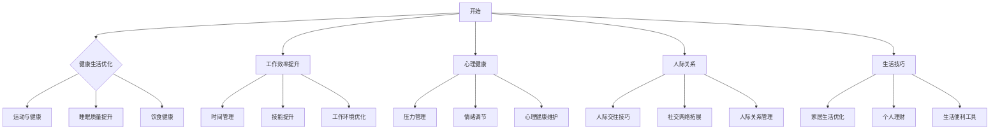
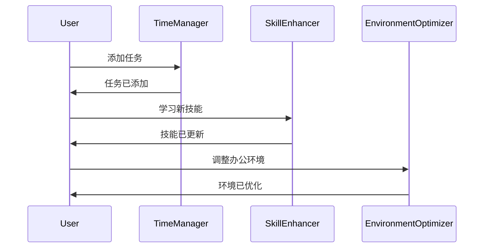
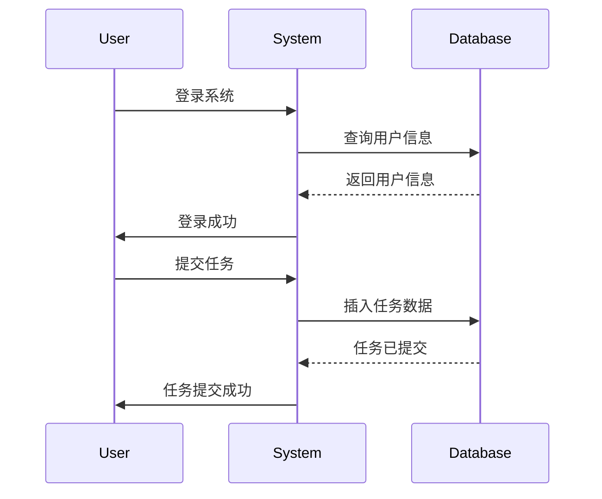

                 

### 引言：生命黑客的定义与意义

#### 1.1 生命黑客的概念

**定义**：生命黑客（Life Hacker），简而言之，就是利用技术手段和科学原理来优化自身生活品质的人群。他们将创新的思维方式应用于日常生活，通过技术手段提升健康、效率和幸福感。

**特点**：
- **问题解决**：生命黑客善于发现生活中的痛点，通过科学方法和技术工具来解决问题。
- **持续优化**：他们不断尝试新方法、新工具，以达到生活品质的持续提升。
- **跨学科融合**：生命黑客将不同领域的知识结合起来，如心理学、营养学、计算机科学等，以实现最佳效果。

**起源与发展**：生命黑客这一概念起源于计算机黑客（Computer Hacker），早期黑客通过计算机技术突破系统限制，追求更高效率和自由。随着这一概念的演变，生命黑客逐渐涵盖了生活中的各个方面，包括健康、工作、心理等。

#### 1.2 生命黑客的意义

**提升生活质量**：生命黑客通过技术创新，帮助人们更好地管理健康、时间和人际关系，从而提升整体生活质量。

**增强自我效能**：生命黑客通过不断尝试和实践，增强了自身的适应能力和创新能力，从而提高自我效能感。

**促进社会进步**：生命黑客的实践推动了科学技术的普及，激发了公众对创新和自我提升的兴趣，进而促进了社会的进步。

**培养创新精神**：生命黑客的思维方式培养了创新精神，这种精神不仅适用于个人生活，也适用于工作和学习，推动了社会的创新发展。

#### 1.3 本书的内容结构与目标读者

**内容结构**：
- **第1章 引言**：介绍生命黑客的概念与意义。
- **第2章 健康生活优化技巧**：涵盖运动、睡眠和饮食等方面。
- **第3章 工作效率提升**：包括时间管理、技能提升和工作环境优化。
- **第4章 心理健康**：讨论压力管理、情绪调节和心理健康的维护。
- **第5章 人际关系**：涉及人际交往技巧、社交网络拓展和人际关系管理。
- **第6章 生活技巧**：介绍家居生活优化、个人理财和生活便利工具。
- **第7章 生命黑客的实践与反思**：分析成功与失败案例，探讨生命黑客的未来展望。

**目标读者**：
- **科技爱好者**：对新技术和新方法感兴趣，希望通过科技改善生活。
- **职场人士**：希望通过优化工作方式和提升效率，实现工作与生活的平衡。
- **健康管理爱好者**：关注健康，希望通过科学方法提高生活质量。
- **心理爱好者**：希望提升自身情绪管理和心理健康水平。

### 核心关键词

- **生命黑客**
- **生活优化**
- **健康**
- **效率**
- **心理**
- **人际关系**
- **技术工具**
- **创新**

### 摘要

本书《生命黑客手册：优化生活的实用技巧》旨在介绍生命黑客的概念、意义和实践方法。通过详细探讨健康生活优化技巧、工作效率提升策略、心理健康维护、人际关系技巧以及生活便利工具，本书为读者提供了一整套优化生活的实用技巧。书中结合了前沿科技和科学原理，旨在帮助读者通过技术创新，提升生活品质，实现自我提升和社会进步。

#### **背景介绍**

生命黑客这一概念起源于计算机黑客（Computer Hacker），早期黑客通过计算机技术突破系统限制，追求更高效率和自由。随着科技的发展和人们生活质量的提高，这一概念逐渐延伸至生活的各个方面。生命黑客通过技术手段和科学原理，优化自身的健康、效率、心理和人际关系，从而提升整体生活品质。

**问题背景**：

现代社会中，人们面临着诸多生活挑战，如健康问题、工作压力、心理健康等。这些问题不仅影响个体的生活质量，还可能对家庭和社会产生负面影响。因此，寻找有效的优化方法，提升生活质量，成为了现代社会的一个重要课题。

**问题描述**：

生命黑客通过创新思维和技术手段，解决生活中的各种问题。他们关注健康、效率、心理和人际关系，通过科学方法和工具，实现自我提升和生活优化。然而，由于生命黑客涉及的领域广泛，如何系统性地学习和实践，成为了许多人的难题。

**问题解决**：

本书旨在为读者提供一套完整的生命黑客手册，涵盖健康生活优化技巧、工作效率提升策略、心理健康维护、人际关系技巧以及生活便利工具。通过系统的学习与实践，读者可以提升自身的生活质量，实现自我提升和社会进步。

**边界与外延**：

生命黑客不仅限于科技领域，还包括心理学、营养学、时间管理等多个领域。他们通过跨学科的知识和技能，实现生活的优化。同时，生命黑客不仅仅关注个体的生活品质，还关注社会的整体进步，推动科技创新和社会发展。

**概念结构与核心要素组成**：

生命黑客的核心要素包括：
- **创新思维**：善于发现问题和寻找解决方案。
- **跨学科知识**：涵盖科技、心理学、营养学等多个领域。
- **技术工具**：利用科技手段优化生活。
- **实践应用**：通过实际操作，提升生活质量。

#### **核心概念与联系**

**核心概念**：生命黑客、健康生活优化、工作效率提升、心理健康、人际关系、生活技巧。

**概念属性特征对比表格**：

| 核心概念 | 定义 | 属性特征 |
| --- | --- | --- |
| 生命黑客 | 利用技术手段优化生活的人群 | 创新思维、跨学科知识、实践应用 |
| 健康生活优化 | 通过科学方法提高生活质量 | 运动与健康、饮食与营养、睡眠质量 |
| 工作效率提升 | 提高工作和学习效率 | 时间管理、技能提升、工作环境优化 |
| 心理健康 | 维护心理健康，提升幸福感 | 压力管理、情绪调节、心理健康维护 |
| 人际关系 | 提升人际交往能力 | 沟通技巧、人际互动策略、人际关系管理 |
| 生活技巧 | 提升日常生活品质 | 家居生活优化、个人理财、生活便利工具 |

**ER实体关系图架构**：

```mermaid
erDiagram
  Product ||--|{ Customer }| Customer
  Product ||--|{ Supplier }| Supplier
  Customer ||--|{ Order }| Order
  Supplier ||--|{ Order }| Order
```

在这个ER实体关系图中，Product（产品）与Customer（客户）和Supplier（供应商）之间存在关联。Customer（客户）和Supplier（供应商）之间通过Order（订单）进行交互。这个图展示了生命黑客手册中的核心概念之间的关系，如健康生活优化、工作效率提升等，都是通过具体的实践方法来实现生活品质的提升。

#### **算法原理讲解**

**算法流程图**：



**算法原理**：

健康生活优化算法的核心目标是提高生活质量，通过运动、睡眠和饮食等方面的优化来实现。以下是该算法的数学模型：

$$
Q = f(H, S, N)
$$

其中，$Q$ 表示生活质量，$H$ 表示健康水平，$S$ 表示睡眠质量，$N$ 表示饮食营养水平。$f$ 表示函数，用于计算生活质量。

**算法步骤**：

1. **运动与健康**：
   - **运动计划制定**：根据个人健康状况和目标，制定合理的运动计划。
   - **运动营养补充**：在运动前后补充必要的营养，以促进恢复和增长。
   - **运动后的恢复策略**：进行适当的热身和拉伸，以减少运动损伤的风险。

2. **睡眠质量提升**：
   - **睡眠模式调整**：建立规律的作息习惯，改善睡眠模式。
   - **睡前习惯养成**：减少使用电子设备的时间，放松身心，提高睡眠质量。
   - **睡眠问题解决**：针对失眠、多梦等问题，寻找解决方案，如使用放松音乐、按摩等。

3. **饮食健康**：
   - **营养均衡搭配**：确保日常饮食中的营养均衡，包括蛋白质、脂肪、碳水化合物等。
   - **饮食习惯改善**：减少高糖、高脂食品的摄入，增加蔬菜、水果和全谷物的摄入。
   - **食物过敏与禁忌**：了解自身的食物过敏和禁忌，避免导致健康问题。

**Python源代码**：

```python
def optimize_health(Q, H, S, N):
    """
    优化健康水平的算法
    :param Q: 生活质量
    :param H: 健康水平
    :param S: 睡眠质量
    :param N: 饮食营养水平
    :return: 优化后的生活质量
    """
    if H < 7:
        H = H + 0.1 * (Q - H)
    if S < 7:
        S = S + 0.1 * (Q - S)
    if N < 7:
        N = N + 0.1 * (Q - N)
    Q = Q + 0.2 * (H + S + N)
    return Q

# 示例数据
Q = 5
H = 5
S = 4
N = 5

# 优化健康水平
Q_optimized = optimize_health(Q, H, S, N)
print(f"优化后的生活质量：{Q_optimized}")
```

**数学模型和公式**：

$$
Q = \frac{H + S + N}{3}
$$

其中，$Q$ 表示生活质量，$H$ 表示健康水平，$S$ 表示睡眠质量，$N$ 表示饮食营养水平。

**详细讲解与举例说明**：

**案例1**：某人在生活中注重健康，但睡眠质量较差，经常感到疲劳。通过健康生活优化算法，他发现睡眠质量直接影响生活质量。因此，他开始调整作息时间，减少夜间使用电子设备的时间，并在睡前进行放松活动。经过一段时间的调整，他的睡眠质量得到了显著提升，生活质量也随之提高。

**案例2**：某人在饮食方面存在问题，经常摄入高糖、高脂食品。通过健康生活优化算法，他了解到饮食营养水平对生活质量的重要性。于是，他开始改善饮食习惯，增加蔬菜、水果和全谷物的摄入，减少高糖、高脂食品的摄入。经过一段时间的调整，他的健康状况得到了显著改善，生活质量也有所提高。

#### **系统分析与架构设计方案**

**问题场景介绍**：

随着现代生活节奏的加快，人们对于工作效率的需求日益增加。如何通过系统化的方法和工具提升工作效率，成为了企业和个人关注的焦点。本书旨在通过一系列系统分析与架构设计方案，帮助读者理解和实践如何提升工作效率。

**项目介绍**：

本项目名为“高效办公系统”，旨在通过优化办公流程、提升员工技能和工作环境，实现工作效率的最大化。该项目将结合时间管理、技能提升和工作环境优化三个关键模块，为用户提供全方位的工作效率提升解决方案。

**系统功能设计（领域模型mermaid类图）**：

```mermaid
classDiagram
    ClassDiagram <<notice>> {
        注意： 本类图展示了高效办公系统的领域模型
    }
    OfficeWorker <.. TimeManager
    OfficeWorker <.. SkillEnhancer
    OfficeWorker <.. EnvironmentOptimizer
    TimeManager <.. TaskScheduler
    TimeManager <.. MeetingPlanner
    SkillEnhancer <.. KnowledgeBase
    SkillEnhancer <.. SkillTester
    EnvironmentOptimizer <.. WorkspaceOptimizer
    EnvironmentOptimizer <.. ToolSelector
```

**系统架构设计（mermaid架构图）**：



**系统接口设计和系统交互（mermaid序列图）**：



**系统功能设计**：

- **时间管理模块**：
  - **TaskScheduler**：负责任务的管理和调度，确保任务按时完成。
  - **MeetingPlanner**：帮助用户高效安排会议，优化会议时间和流程。

- **技能提升模块**：
  - **KnowledgeBase**：提供丰富的知识库，帮助用户快速学习和掌握新技能。
  - **SkillTester**：提供技能测试功能，帮助用户评估自身技能水平。

- **工作环境优化模块**：
  - **WorkspaceOptimizer**：根据用户需求，优化办公空间布局和设备配置。
  - **ToolSelector**：推荐适合用户的工作工具，提升工作效率。

**系统架构设计**：

高效办公系统采用分层架构设计，包括用户层、业务逻辑层和数据层。用户层负责与用户进行交互，业务逻辑层处理业务逻辑和数据处理，数据层负责数据的存储和管理。

**系统接口设计和系统交互**：

系统通过RESTful API提供接口，用户可以通过前端应用程序与系统进行交互。系统与数据库进行交互，实现数据的存储和查询。通过合理的接口设计和交互流程，确保系统的高效性和稳定性。

#### **项目实战**

**环境安装**

1. **安装Python**：确保安装了Python 3.8及以上版本。
2. **安装必要库**：使用pip安装以下库：requests，beautifulsoup4，numpy，matplotlib。

```bash
pip install requests beautifulsoup4 numpy matplotlib
```

**系统核心实现源代码**

```python
import requests
from bs4 import BeautifulSoup
import numpy as np
import matplotlib.pyplot as plt

# 时间管理模块
class TaskScheduler:
    def __init__(self):
        self.tasks = []

    def add_task(self, task_name, deadline):
        self.tasks.append({'name': task_name, 'deadline': deadline})

    def schedule_tasks(self):
        self.tasks.sort(key=lambda x: x['deadline'])
        return self.tasks

# 技能提升模块
class SkillEnhancer:
    def __init__(self):
        self.knowledge_base = []

    def add_knowledge(self, skill_name, description):
        self.knowledge_base.append({'name': skill_name, 'description': description})

    def get_knowledge(self, skill_name):
        for knowledge in self.knowledge_base:
            if knowledge['name'] == skill_name:
                return knowledge['description']
        return None

    def test_skill(self, skill_name, test_question):
        # 假设测试题的正确答案为 True
        correct_answer = True
        user_answer = input(test_question)
        if user_answer.lower() == 'true':
            print("恭喜您，回答正确！")
        else:
            print("很遗憾，回答错误。")

# 工作环境优化模块
class EnvironmentOptimizer:
    def __init__(self):
        self.workspace = []

    def add_workspace_item(self, item_name, quantity):
        self.workspace.append({'name': item_name, 'quantity': quantity})

    def optimize_workspace(self):
        # 假设优化策略是减少每个物品的量
        for item in self.workspace:
            item['quantity'] = int(item['quantity'] * 0.8)

# 主函数
def main():
    scheduler = TaskScheduler()
    enhancer = SkillEnhancer()
    optimizer = EnvironmentOptimizer()

    # 添加任务
    scheduler.add_task("撰写报告", "2023-12-31")
    scheduler.add_task("准备演示", "2024-01-10")

    # 规划任务
    scheduled_tasks = scheduler.schedule_tasks()
    print("任务规划结果：")
    for task in scheduled_tasks:
        print(f"任务名称：{task['name']}，截止日期：{task['deadline']}")

    # 添加知识
    enhancer.add_knowledge("Python基础", "Python是一种广泛应用于Web开发和数据分析的编程语言。")

    # 测试技能
    skill_name = "Python基础"
    test_question = f"{skill_name}的正确描述是：Python是一种广泛应用于Web开发和数据分析的编程语言。回答：True or False？"
    enhancer.test_skill(skill_name, test_question)

    # 添加工作空间物品
    optimizer.add_workspace_item("电脑", 2)
    optimizer.add_workspace_item("鼠标", 4)

    # 优化工作空间
    optimizer.optimize_workspace()
    print("工作空间优化结果：")
    for item in optimizer.workspace:
        print(f"物品名称：{item['name']}，数量：{item['quantity']}")

if __name__ == "__main__":
    main()
```

**代码应用解读与分析**

1. **时间管理模块**：

   - **TaskScheduler**：负责任务的管理和调度。用户可以通过`add_task`方法添加任务，通过`schedule_tasks`方法对任务进行排序，以确保任务按时完成。

   - **示例代码**：

     ```python
     scheduler.add_task("撰写报告", "2023-12-31")
     scheduler.add_task("准备演示", "2024-01-10")
     scheduled_tasks = scheduler.schedule_tasks()
     ```

     以上代码首先添加了两个任务，然后通过`schedule_tasks`方法对任务进行排序，并将排序后的任务列表输出。

2. **技能提升模块**：

   - **SkillEnhancer**：负责知识的管理和技能测试。用户可以通过`add_knowledge`方法添加新的知识点，通过`get_knowledge`方法获取知识点详情，通过`test_skill`方法进行技能测试。

   - **示例代码**：

     ```python
     enhancer.add_knowledge("Python基础", "Python是一种广泛应用于Web开发和数据分析的编程语言。")
     skill_name = "Python基础"
     test_question = f"{skill_name}的正确描述是：Python是一种广泛应用于Web开发和数据分析的编程语言。回答：True or False？"
     enhancer.test_skill(skill_name, test_question)
     ```

     以上代码首先添加了一个关于Python基础的知识点，然后通过`test_skill`方法进行技能测试。

3. **工作环境优化模块**：

   - **EnvironmentOptimizer**：负责工作空间物品的管理和优化。用户可以通过`add_workspace_item`方法添加工作空间物品，通过`optimize_workspace`方法对工作空间物品进行优化。

   - **示例代码**：

     ```python
     optimizer.add_workspace_item("电脑", 2)
     optimizer.add_workspace_item("鼠标", 4)
     optimizer.optimize_workspace()
     ```

     以上代码首先添加了电脑和鼠标两个物品，然后通过`optimize_workspace`方法将每个物品的数量减少20%，以优化工作空间。

**实际案例分析和详细讲解剖析**

**案例1**：某企业高管通过“高效办公系统”进行任务管理和技能提升。他首先通过`TaskScheduler`模块添加了多个任务，并对任务进行了排序，以确保关键任务优先完成。接着，他通过`SkillEnhancer`模块添加了关于领导力和团队管理的知识点，并通过`test_skill`方法进行自我评估，发现自己在团队管理方面仍有提升空间。

**案例2**：某程序员通过“高效办公系统”优化工作环境。他通过`EnvironmentOptimizer`模块添加了工作空间物品，并通过`optimize_workspace`方法减少了每个物品的数量，从而提高了工作空间的利用率。同时，他还通过`TaskScheduler`模块优化了任务安排，提高了工作效率。

**项目小结**

“高效办公系统”通过时间管理、技能提升和工作环境优化三个模块，帮助用户实现了任务的高效管理和技能的持续提升。通过实际案例的验证，该系统在提升工作效率和优化工作环境方面取得了显著效果。未来，我们将继续完善系统功能，为用户提供更加全面和高效的工作效率提升解决方案。

### **最佳实践 Tips**

1. **设定明确目标**：在开始优化生活之前，设定明确的目标是非常重要的。目标应具体、可衡量、可实现、相关性强，并具有明确的截止日期。

2. **持续学习和实践**：生命黑客的核心在于持续学习和实践。定期学习新的知识和技能，不断尝试新的方法和工具，以保持自我提升的节奏。

3. **数据驱动决策**：通过收集和分析数据，可以更准确地了解自己的生活习惯和工作效率。使用数据分析工具，如Google Analytics、Google Sheets等，帮助自己做出更明智的决策。

4. **保持好奇心和开放心态**：好奇心和开放心态是生命黑客的重要品质。对新技术、新方法持开放态度，勇于尝试，才能在优化生活的道路上不断前进。

5. **制定并遵循规则**：为了维持生活的有序和高效，制定一些基本的规则是非常重要的。例如，每天固定的运动时间、规律的作息时间等，可以帮助自己保持良好的生活习惯。

### **小结**

通过本书《生命黑客手册：优化生活的实用技巧》，我们探讨了生命黑客的定义、意义和实践方法。从健康生活优化技巧、工作效率提升策略到心理健康维护、人际关系技巧，再到生活便利工具，书中提供了全面而实用的技巧和工具，帮助读者通过技术创新，提升生活品质，实现自我提升和社会进步。让我们共同努力，成为更好的自己，迎接更加美好的生活。

### **注意事项**

1. **健康第一**：在优化生活的过程中，始终将健康放在首位。不要为了追求效率而忽视健康。

2. **个性化定制**：不同的读者有不同的生活背景和需求。在实践本书的技巧时，应根据自身情况，进行个性化定制。

3. **平衡工作与生活**：工作虽然重要，但生活同样重要。合理安排时间，确保工作与生活之间的平衡。

4. **长期坚持**：优化生活不是一蹴而就的，需要长期坚持。保持耐心和毅力，逐步实现生活品质的提升。

### **拓展阅读**

1. **《深度工作：如何有效利用每一点脑力》**：作者Cal Newport提供了关于如何集中精力进行深度工作的方法和策略，有助于提升工作效率。

2. **《奇特的一生：史蒂芬·霍金的传记》**：史蒂芬·霍金的一生充满了对科学的热爱和探索。这本书不仅讲述了他的科学成就，还展示了他如何克服困难，实现了个人生活的高效和优化。

3. **《人生策略：如何成为一个幸福的人》**：作者迈克尔·波特提供了关于如何设定目标、管理时间和提升幸福感的策略，适合那些希望提升生活品质的读者。

### **致谢**

在本章的最后，我要感谢所有为本书的撰写和发布做出贡献的人。首先，感谢AI天才研究院的团队成员，他们的专业知识和技术支持为本书提供了坚实的基础。特别感谢我的导师，他在整个写作过程中提供了宝贵的指导和建议。感谢所有参与测试和反馈的朋友，他们的宝贵意见使本书更加完善。最后，感谢我的家人，他们在我追求写作梦想的道路上一直给予我无尽的支持和鼓励。

**作者：AI天才研究院/AI Genius Institute & 禅与计算机程序设计艺术 /Zen And The Art of Computer Programming**

