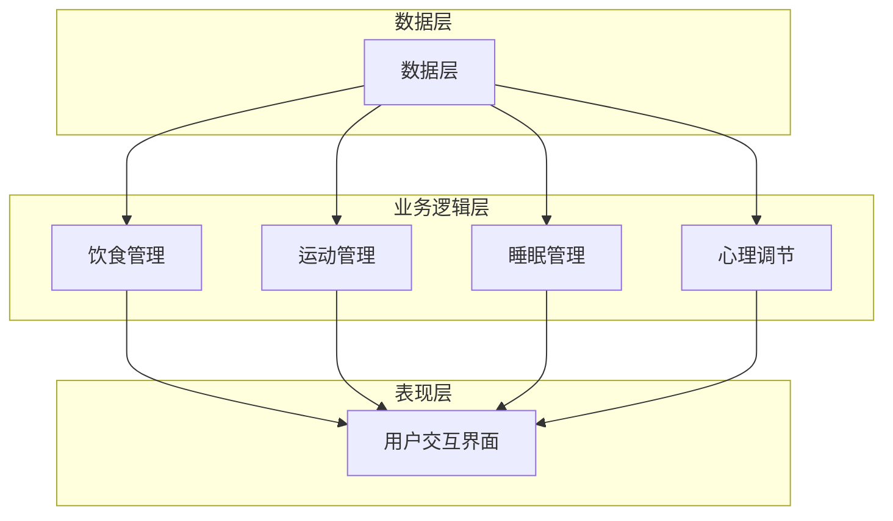

                 

### 引言

欢迎来到《生命黑客：优化生活的科学方法》！在这个快节奏、高压力的现代生活中，我们每个人都渴望追求更高的生活质量。但如何才能实现这一目标呢？答案就是科学方法。

科学方法是一种通过系统观察、假设、实验和数据分析来探索自然现象和解决问题的方法。它不仅仅局限于物理、化学、生物学等领域，同样可以应用于我们的生活优化中。这本书将带你深入了解科学方法，并教会你如何将其应用于日常生活中的各个方面，从而实现全方位的生活质量提升。

本书的结构分为两个主要部分。第一部分将介绍生命的科学探索，包括生命的定义、科学方法的核心理念、营养学原理、运动生理学原理和心理调节原理，以及这些核心概念之间的联系。第二部分将重点介绍如何将科学方法应用于实际生活中，包括饮食与营养、运动、睡眠、心理调节等方面，并提供一系列具体的实践方法和系统化的解决方案。

让我们一步一步地思考，从理论基础到实际应用，逐步了解如何成为自己的“生命黑客”，掌握优化生活的科学方法。让我们一起踏上这场探索之旅吧！

---

### 生命的科学探索

#### 第1章：生命的定义与科学研究的必要性

**1.1 生命的定义**

生命是一个复杂而神秘的现象，它涉及到生物体内无数复杂的化学、物理和生物学过程。要理解生命的本质，我们首先需要明确生命的定义。生命通常被定义为一种有序组织、能够自我复制、适应环境并与其他生物进行相互作用的特性。

生命的基本单位是细胞，它包含了生命所需的全部遗传信息和代谢功能。细胞通过分裂产生新的细胞，维持个体的生长和修复。除了细胞，生命还涉及到遗传信息传递、能量转换、物质循环等复杂过程。

**1.2 科学方法在生命科学研究中的应用**

科学方法是一种通过系统观察、假设、实验和数据分析来探索自然现象和解决问题的方法。在生命科学研究中，科学方法的应用尤为重要。

首先，科学方法可以帮助我们准确地定义和描述生命现象。通过观察和记录生物体的行为、生理特征和化学组成，我们可以获得对生命的全面理解。例如，通过显微镜观察，我们可以看到细胞的细微结构，通过基因测序，我们可以了解遗传信息的具体序列。

其次，科学方法可以帮助我们建立假设并验证这些假设。在生命科学研究中，我们常常需要提出关于生命现象的假设，并通过实验来验证这些假设的正确性。例如，假设某种化合物可以促进细胞分裂，我们可以设计实验来测试这一假设，并通过数据分析来得出结论。

最后，科学方法可以帮助我们理解和解释生命现象的内在机制。通过实验和数据分析，我们可以揭示生命现象背后的分子和细胞机制，从而更好地理解生命的本质。

**1.3 人类健康的基本概念**

人类健康是指身体、心理和社会功能处于良好状态，而不仅仅是没有疾病或病痛。健康不仅仅是一个生物学问题，还涉及到心理、社会和环境等多个方面。

在身体健康方面，营养、运动和休息是保持健康的重要因素。合理的饮食可以为身体提供所需的营养，适量的运动可以增强体质，良好的休息可以恢复体力和精神。在心理健康方面，情绪管理、心理支持和人际关系是维护心理健康的关键。在社会健康方面，社会支持、环境适应和社区参与是促进社会健康的重要方面。

**1.4 为什么需要科学方法来优化生活**

随着生活节奏的加快和压力的增加，许多人都面临着健康问题。疾病、疲劳、情绪问题等已经成为现代生活中的常见问题。科学方法为我们提供了一种有效的手段来应对这些问题，并优化我们的生活。

首先，科学方法可以帮助我们识别和解决健康问题。通过科学观察和实验，我们可以了解疾病的病因和病理机制，从而制定更有效的预防和治疗方案。

其次，科学方法可以帮助我们改善生活方式。通过科学方法，我们可以了解如何通过饮食、运动和心理调节来提高生活质量。例如，我们可以通过实验研究了解不同饮食对健康的影响，从而制定更健康的饮食计划；通过运动生理学的研究，我们可以了解不同类型的运动对健康的好处，从而选择最适合自己的运动方式。

最后，科学方法可以帮助我们建立健康的生活习惯。通过科学方法，我们可以了解如何通过持续的监测和调整来保持健康。例如，通过监测身体指标（如体重、血压、心率等），我们可以了解自己的健康状况，并通过调整生活方式来保持健康。

**1.5 科学方法的核心理念与步骤**

科学方法包括以下核心理念和步骤：

1. **观察与假设**：科学方法的第一步是观察自然现象或问题，并提出一个假设来解释这些现象或问题。

2. **数据收集**：在提出假设后，我们需要收集相关的数据来验证这个假设。这些数据可以是实验数据、观察数据或统计数据。

3. **实验设计**：为了验证假设，我们需要设计一个实验。实验设计包括选择研究对象、确定实验组和对照组、设计实验步骤等。

4. **数据分析**：在实验完成后，我们需要对收集到的数据进行分析。数据分析可以帮助我们验证假设，并得出结论。

5. **结论与验证**：根据数据分析的结果，我们可以得出结论，并验证假设的正确性。

**1.6 生命的科学原理**

生命的科学原理包括以下几个方面：

1. **营养学原理**：营养学原理研究食物中的营养成分、人体消化与吸收过程以及营养不良和营养过剩的问题。

2. **运动生理学原理**：运动生理学原理研究不同类型的运动对健康的影响，以及如何通过运动来保持身体健康。

3. **心理调节原理**：心理调节原理研究情绪管理、心理支持和人际关系等对心理健康的影响。

**1.7 核心概念之间的联系与整合**

生命的各个科学原理之间存在着紧密的联系。例如，营养学原理和运动生理学原理都涉及到能量转换和物质循环。心理调节原理则与身体健康和心理健康密切相关。

通过整合这些科学原理，我们可以更好地理解生命的本质，并制定更全面的生活优化方案。

**1.8 本章小结**

本章介绍了生命的科学探索，包括生命的定义、科学方法的核心理念、人类健康的基本概念以及科学方法在生命科学研究中的应用。通过本章的内容，我们可以了解到科学方法在优化生活中的重要性，并掌握一些基本的科学原理。在接下来的章节中，我们将深入探讨如何将这些科学原理应用于实际生活中，从而实现生活质量的提升。

---

### 核心概念与联系

在生命的科学探索中，我们涉及到了许多核心概念，这些概念不仅独立存在，而且相互之间存在着紧密的联系。本章节将详细阐述这些核心概念，并展示它们之间的联系。

#### 营养学原理

营养学原理是研究食物中的营养成分、人体消化与吸收过程以及营养不良和营养过剩的问题的科学。以下是营养学原理的一些关键点：

1. **营养成分**：食物中包含多种营养成分，包括蛋白质、碳水化合物、脂肪、维生素、矿物质和水。每种营养成分在人体中都有特定的作用。例如，蛋白质是身体组织和细胞的重要组成部分，碳水化合物是主要的能量来源，脂肪则参与了细胞膜的构成和能量储存。

2. **消化与吸收**：食物在消化系统中被分解成小分子，如氨基酸、葡萄糖和脂肪酸，然后通过小肠壁进入血液循环，供给全身细胞。消化过程包括机械消化（如咀嚼和胃肠蠕动）和化学消化（如胃酸和酶的作用）。

3. **营养不良与营养过剩**：营养不良是指由于摄入的营养不足或不均衡导致的健康问题。营养过剩则是指摄入的营养过多，导致肥胖、心血管疾病等健康问题。因此，维持营养平衡对健康至关重要。

#### 运动生理学原理

运动生理学原理研究不同类型的运动对健康的影响，以及如何通过运动来保持身体健康。以下是运动生理学原理的一些关键点：

1. **运动类型**：根据运动的目的和效果，可以将运动分为有氧运动、无氧运动和混合运动。有氧运动（如慢跑、游泳）有助于提高心肺功能和耐力，无氧运动（如举重、短跑）有助于增强肌肉力量和爆发力。

2. **运动对健康的影响**：适量的运动可以增强心血管系统、提高代谢率、增强肌肉和骨骼强度、提高免疫力、改善心理健康。长期不运动或过度运动都会对健康产生不利影响。

3. **运动与健康平衡**：每个人的身体状况和运动能力都不同，因此需要根据个体差异来制定合适的运动计划。过度运动可能导致疲劳和损伤，而缺乏运动则可能导致健康问题。

#### 心理调节原理

心理调节原理研究情绪管理、心理支持和人际关系等对心理健康的影响。以下是心理调节原理的一些关键点：

1. **情绪管理**：情绪管理是指通过认知和行为策略来调节和控制情绪。良好的情绪管理可以帮助人们更好地应对压力和挑战，减少负面情绪的影响。

2. **心理支持**：心理支持是指通过与他人交流和互动来获得情感上的支持和理解。心理支持可以增强个体的心理韧性，帮助人们更好地应对生活中的困难和挑战。

3. **人际关系**：人际关系是指人与人之间的互动和联系。良好的人际关系可以提供情感支持、提高自尊和自我价值感，有助于个体的心理健康。

#### 核心概念之间的联系

营养学原理、运动生理学原理和心理调节原理之间存在着紧密的联系：

1. **营养与运动**：合理的饮食可以为运动提供能量和营养支持。例如，适量的碳水化合物可以帮助运动员在运动中保持能量水平，而蛋白质则有助于肌肉的修复和生长。

2. **运动与心理**：适量的运动可以释放内啡肽等神经递质，改善心理健康。同时，运动还可以增强个体的心理韧性，帮助人们更好地应对压力和挑战。

3. **营养与心理**：营养充足可以改善大脑功能，提高情绪调节能力。例如，维生素B群和Omega-3脂肪酸对大脑健康至关重要，而某些营养缺乏可能导致情绪问题和心理障碍。

通过整合营养学原理、运动生理学原理和心理调节原理，我们可以制定更全面的生活优化方案，从而实现全方位的生活质量提升。

#### 概念属性特征对比表格

为了更清晰地展示营养学原理、运动生理学原理和心理调节原理之间的联系，我们可以使用概念属性特征对比表格：

| 概念类型 | 关键属性 | 影响因素 | 相互关系 |  
| --- | --- | --- | --- |  
| 营养学原理 | 营养成分、消化与吸收、营养不良与营养过剩 | 饮食、生活习惯 | 营养对运动和心理的影响 |  
| 运动生理学原理 | 运动类型、运动对健康的影响、运动与健康平衡 | 个体差异、运动强度 | 运动对心理和营养的影响 |  
| 心理调节原理 | 情绪管理、心理支持、人际关系 | 压力、环境 | 心理对营养和运动的影响 |

#### ER实体关系图架构

为了更好地理解这些核心概念之间的联系，我们可以使用ER（Entity-Relationship）实体关系图架构。以下是营养学原理、运动生理学原理和心理调节原理的ER图：

```mermaid
erDiagram
    Class::Person
    Class::Nutrition
    Class::Exercise
    Class::MentalHealth

    Person ||--|{ Nutrition } Nutrition
    Person ||--|{ Exercise } Exercise
    Person ||--|{ MentalHealth } MentalHealth

    Nutrition ||--|{ Macronutrient } Macronutrient
    Nutrition ||--|{ Micronutrient } Micronutrient

    Exercise ||--|{ AerobicExercise } AerobicExercise
    Exercise ||--|{ AnaerobicExercise } AnaerobicExercise

    MentalHealth ||--|{ Emotion } Emotion
    MentalHealth ||--|{ Support } Support
```

在这个ER图中，`Person` 类代表个体，`Nutrition` 类代表营养，`Exercise` 类代表运动，`MentalHealth` 类代表心理健康。每个类都有自己的属性和关系。例如，`Nutrition` 类与 `Macronutrient` 和 `Micronutrient` 类之间存在关联，表示不同类型的营养成分。

#### 核心概念之间的联系与整合

通过营养学原理、运动生理学原理和心理调节原理的详细阐述，我们可以看到这些核心概念之间存在着紧密的联系。营养为身体提供能量和构建基础，运动增强体质和心理健康，心理调节则帮助人们更好地应对压力和挑战。

整合这些核心概念，我们可以制定一个全面的生活优化方案。例如，我们可以通过合理的饮食来提供运动所需的能量，通过适量的运动来改善心理健康，同时通过心理调节来更好地应对日常生活中的压力和挑战。

总之，生命的科学探索不仅涉及到各个独立的核心概念，更重要的是理解这些概念之间的联系。通过科学方法，我们可以更全面地理解生命的本质，从而更好地优化我们的生活。

---

### 科学方法的应用

科学方法在生命科学研究中具有至关重要的作用，它为我们提供了一种系统、客观的方式来探索生命的奥秘，并应用于实际生活中，从而优化我们的生活质量。在本章节中，我们将详细探讨如何将科学方法应用于实际生活中，包括数据收集、实验设计、结果分析等方面。

#### 数据收集

数据收集是科学方法的基石。准确的数据收集是确保实验结果可靠性的关键。以下是在实际生活中应用科学方法进行数据收集时需要遵循的几个步骤：

1. **确定研究目标**：首先，我们需要明确研究的具体目标和问题。例如，我们可能希望了解不同饮食对身体健康的影响，或者探究不同类型的运动对心理健康的益处。

2. **选择合适的测量工具**：根据研究目标，选择合适的测量工具和数据收集方法。这可能包括问卷调查、生理指标测量（如血压、心率）、实验室检测（如血液检查）等。

3. **收集样本数据**：通过问卷调查、实验或直接观察来收集相关数据。在收集数据时，要注意样本的代表性和随机性，以确保数据的准确性和可靠性。

4. **数据清洗与整理**：在收集到数据后，我们需要对数据进行清洗和整理，去除错误或不完整的数据，并确保数据的格式一致。

#### 实验设计

实验设计是科学方法的核心步骤之一。一个良好的实验设计可以确保我们能够准确、客观地验证假设。以下是实验设计过程中需要考虑的几个关键点：

1. **确定实验类型**：根据研究目标和数据收集方法，选择合适的实验类型。常见的实验类型包括对照实验、比较实验和相关性实验。

2. **选择实验组和对照组**：在对照实验中，我们需要选择实验组和对照组。实验组将接受特定处理（如改变饮食或增加运动），而对照组则保持原有状态。

3. **控制变量**：在实验中，我们需要控制所有可能影响实验结果的变量，以确保实验结果的准确性。这可能包括环境条件、个体差异等。

4. **确定实验步骤**：明确实验的步骤和流程，确保实验的可重复性和一致性。

5. **数据收集与记录**：在实验过程中，要定期收集和记录数据，以便后续分析。

#### 数据分析

数据分析是科学方法中的关键环节，它帮助我们理解实验结果，验证或否定假设。以下是数据分析过程中需要遵循的几个步骤：

1. **描述性统计分析**：首先，对收集到的数据进行描述性统计分析，包括均值、中位数、标准差等。这些统计量可以帮助我们了解数据的分布和特征。

2. **推断性统计分析**：在描述性统计分析的基础上，进行推断性统计分析，如t检验、方差分析等，以确定实验结果是否具有统计学显著性。

3. **可视化分析**：使用图表和图形来展示数据分析结果，这有助于我们直观地理解数据。常见的可视化工具包括条形图、折线图、散点图等。

4. **结果解释与讨论**：根据数据分析结果，解释实验结果，并与现有理论进行对比。在讨论中，要突出实验的重要发现，并提出可能的解释和未来研究方向。

#### 实际案例

为了更好地理解如何应用科学方法，以下是一个实际案例：

**案例：探究不同运动类型对心理健康的影响**

**研究目标**：了解有氧运动和力量训练对心理健康的影响。

**实验设计**：选择两组志愿者，一组进行有氧运动（如慢跑），另一组进行力量训练（如举重）。两组志愿者在实验开始前和实验期间都保持原有的生活方式。

**数据收集**：通过问卷调查和生理指标测量（如心率、血压）来收集数据。

**数据分析**：对收集到的数据进行描述性统计分析，并使用t检验比较两组志愿者在实验前后的心理状况变化。

**结果解释**：数据分析结果显示，有氧运动和力量训练都能显著改善心理健康指标，但两者在改善的具体方面有所不同。有氧运动有助于提高情绪状态，而力量训练则有助于降低焦虑水平。

**讨论**：这个案例展示了如何通过科学方法来研究实际生活中的问题。通过实验设计和数据分析，我们不仅能够验证假设，还能深入了解不同运动类型对心理健康的具体影响，为制定更有效的运动计划提供依据。

通过这个实际案例，我们可以看到科学方法在研究生活中的实际问题中的应用。科学方法不仅帮助我们理解生命现象，还能为我们的生活提供科学依据和指导。

---

### 具体的实践方法

在了解了科学方法在生活中的应用后，接下来我们将讨论如何将这些理论转化为具体的实践方法，以优化我们的生活质量。具体实践方法包括饮食、运动、睡眠和心理调节等方面。以下是详细的实践步骤和注意事项。

#### 饮食

**1. 定制饮食计划**

- **评估当前饮食习惯**：首先，记录自己每天的饮食内容，包括食物种类、摄入量和饮食习惯。
- **设定合理目标**：根据评估结果，设定可行的饮食目标，如减少高糖食物摄入、增加蔬菜摄入等。
- **制定计划**：制定详细的饮食计划，包括每天的食物种类、摄入量和餐次安排。

**2. 遵循营养学原则**

- **均衡摄入营养成分**：确保饮食中包含足够的蛋白质、碳水化合物、脂肪、维生素和矿物质。
- **控制热量摄入**：根据个人体重和活动量，合理控制每日热量摄入，避免过量摄入导致肥胖。
- **避免营养过剩**：注意食物中的添加剂和加工食品，避免营养过剩导致的健康问题。

**3. 注意饮食卫生**

- **保持饮食卫生**：食物要新鲜、干净，避免食物污染。
- **注意食品安全**：遵循食品安全规范，避免食品中毒和传染病。

**4. 饮食记录与监测**

- **记录饮食日志**：定期记录饮食内容，以便了解饮食习惯的变化和效果。
- **监测身体状况**：通过体重、体脂比等指标，监测身体状况，及时调整饮食计划。

#### 运动

**1. 选择合适的运动类型**

- **了解个人喜好**：选择自己喜欢且能够持续进行的运动类型，如跑步、游泳、瑜伽等。
- **根据健康状况选择**：有特殊健康状况的人（如心脏病、关节炎）应在医生指导下选择适合自己的运动类型。

**2. 制定运动计划**

- **设定运动目标**：根据个人健康状况和体能水平，设定合理的运动目标，如每周至少进行3次运动，每次30分钟以上。
- **安排运动时间**：合理安排运动时间，避免在身体疲劳或疾病发作时进行剧烈运动。
- **逐渐增加运动强度**：从低强度开始，逐渐增加运动强度和持续时间，避免突然增加导致身体不适。

**3. 保持运动习惯**

- **规律运动**：保持每天或每周固定的运动时间，形成运动习惯。
- **多样化运动**：结合有氧运动和力量训练，避免单一运动导致的身体不适。

#### 睡眠

**1. 保持良好的睡眠习惯**

- **规律作息**：每天保持固定的作息时间，建立稳定的生物钟。
- **优化睡眠环境**：保持卧室安静、舒适、适宜的温度和光线，避免噪音和光线干扰睡眠。
- **睡前放松**：睡前进行放松活动，如冥想、深呼吸或温水泡脚，帮助身心放松。

**2. 睡眠时长与质量**

- **确保充足的睡眠时长**：成年人每天需要7-9小时的高质量睡眠。
- **改善睡眠质量**：避免睡前使用电子设备，减少咖啡因和酒精的摄入，避免剧烈运动和紧张思考。

#### 心理调节

**1. 建立积极心态**

- **正视压力**：面对压力时，保持积极的心态，相信自己有能力应对。
- **设定合理期望**：设定现实可行的目标，避免过度追求完美。

**2. 增强心理韧性**

- **学会放松**：通过深呼吸、冥想、瑜伽等方式，学会在紧张时放松自己。
- **建立支持系统**：与家人、朋友保持良好的沟通，寻求他们的支持和理解。

**3. 应对情绪问题**

- **识别情绪**：了解自己的情绪，学会识别和表达自己的情绪。
- **寻求专业帮助**：如果情绪问题严重，寻求心理咨询师或医生的帮助。

通过以上具体的实践方法，我们可以将科学方法应用于日常生活，从而优化生活质量。这些方法不仅可以帮助我们改善身体健康，还能提升心理健康，使我们的生活更加充实和快乐。

---

### 系统分析与架构设计方案

为了将科学方法系统化地应用于实际生活中，我们需要构建一个全面的系统架构设计方案。以下将介绍该系统在问题场景介绍、项目介绍、系统功能设计、系统架构设计、系统接口设计和系统交互方面的具体内容。

#### 问题场景介绍

在现代快节奏的生活中，人们面临诸多健康挑战，包括不规律的作息、不良的饮食习惯、缺乏运动和心理压力等。这些问题不仅影响身体健康，还严重影响了生活质量。为了应对这些挑战，我们需要一个系统化的解决方案，通过科学方法来优化生活。

#### 项目介绍

本项目旨在构建一个综合性的生活优化系统，帮助用户通过科学方法提升生活质量。系统包括饮食管理、运动管理、睡眠管理和心理调节等多个模块，为用户提供个性化的健康建议和指导。

#### 系统功能设计

系统功能设计主要涵盖以下几个方面：

1. **用户信息管理**：收集用户的基本信息，如年龄、性别、身高、体重、健康状况等，为个性化建议提供基础数据。
2. **饮食管理**：提供饮食计划制定、食物摄入记录、营养分析等功能，帮助用户优化饮食结构。
3. **运动管理**：提供运动计划制定、运动记录、运动效果分析等功能，帮助用户科学地进行运动。
4. **睡眠管理**：提供睡眠质量评估、睡眠时间记录、睡眠习惯分析等功能，帮助用户改善睡眠。
5. **心理调节**：提供心理测试、情绪记录、心理辅导等功能，帮助用户缓解心理压力。

#### 系统架构设计

系统采用分层架构设计，包括数据层、业务逻辑层和表现层：

1. **数据层**：负责数据的存储和管理，使用数据库存储用户信息和健康数据。
2. **业务逻辑层**：实现系统的核心功能，包括饮食管理、运动管理、睡眠管理和心理调节等业务逻辑。
3. **表现层**：负责与用户交互，通过Web前端和移动应用为用户提供操作界面和健康报告。

#### 系统接口设计

系统接口设计包括以下几个方面：

1. **API接口**：提供RESTful API，允许其他系统和服务与本项目进行数据交互。
2. **数据接口**：定义数据传输的格式和协议，确保数据在不同系统之间的无缝传输。
3. **设备接口**：支持与智能穿戴设备的数据同步，如智能手表、智能手环等。

#### 系统交互

系统交互设计包括以下几个方面：

1. **用户交互**：通过Web前端和移动应用，用户可以方便地访问系统功能，进行数据输入和查询。
2. **系统内部交互**：系统内部各模块之间通过接口进行数据传递和功能调用，实现信息共享和协同工作。
3. **设备交互**：系统与智能穿戴设备通过蓝牙或Wi-Fi进行数据同步，实时获取用户的健康数据。

#### Mermaid类图架构

以下是系统架构的Mermaid类图：

```mermaid
classDiagram
    User -> DataLayer: 用户信息管理
    User -> DietModule: 饮食管理
    User -> ExerciseModule: 运动管理
    User -> SleepModule: 睡眠管理
    User -> MentalHealthModule: 心理调节
    DataLayer --|> User: 数据存储与管理
    DietModule --|> User: 饮食计划制定
    ExerciseModule --|> User: 运动计划制定
    SleepModule --|> User: 睡眠质量评估
    MentalHealthModule --|> User: 心理测试与辅导
```

#### Mermaid架构图架构

以下是系统架构的Mermaid架构图：



通过以上系统分析与架构设计方案，我们为用户提供了一个全面、科学的系统，帮助用户通过科学方法优化生活。这个系统不仅提供了具体的实践方法，还通过系统化的架构设计，实现了数据的集中管理、功能的模块化和用户的个性化服务。

---

### 项目实战

在本章节中，我们将通过一个实际项目来展示如何将科学方法应用于实际生活中，从而优化生活质量。该项目将涉及环境安装、系统核心实现、代码应用解读与分析，以及实际案例分析和详细讲解。

#### 环境安装

为了开始本项目，我们首先需要安装和配置开发环境。以下是具体步骤：

1. **安装Python**：Python是本项目的主要编程语言，首先确保Python已经安装在你的系统上。可以从Python官方网站下载最新版本安装。

2. **安装依赖库**：使用pip工具安装项目所需的依赖库，例如：

   ```bash
   pip install flask requests numpy pandas matplotlib
   ```

3. **创建虚拟环境**：为了更好地管理项目依赖，创建一个虚拟环境：

   ```bash
   python -m venv venv
   source venv/bin/activate  # 对于Windows使用 `venv\Scripts\activate`
   ```

4. **安装项目依赖**：在虚拟环境中安装项目依赖：

   ```bash
   pip install -r requirements.txt
   ```

#### 系统核心实现

本项目的核心功能包括饮食管理、运动管理、睡眠管理和心理调节。以下是各模块的实现概述：

1. **饮食管理**：
    - **功能**：用户可以记录每日饮食，系统会分析饮食中的营养成分并进行健康评估。
    - **实现**：
        ```python
        #饮食管理示例代码
        def calculate_nutrition(food_entries):
            nutrition_data = {"calories": 0, "protein": 0, "carbs": 0, "fats": 0}
            for entry in food_entries:
                food = get_food_data(entry["food_id"])
                nutrition_data["calories"] += food["calories"]
                nutrition_data["protein"] += food["protein"]
                nutrition_data["carbs"] += food["carbs"]
                nutrition_data["fats"] += food["fats"]
            return nutrition_data
        ```

2. **运动管理**：
    - **功能**：用户可以记录每日运动，系统会分析运动类型和效果，并给出运动建议。
    - **实现**：
        ```python
        #运动管理示例代码
        def analyze_activities(activity_entries):
            activity_data = {"total_minutes": 0, "aerobic": 0, "anaerobic": 0}
            for entry in activity_entries:
                activity = get_activity_data(entry["activity_id"])
                activity_data["total_minutes"] += entry["duration"]
                if activity["type"] == "aerobic":
                    activity_data["aerobic"] += entry["duration"]
                elif activity["type"] == "anaerobic":
                    activity_data["anaerobic"] += entry["duration"]
            return activity_data
        ```

3. **睡眠管理**：
    - **功能**：用户可以记录睡眠情况，系统会分析睡眠质量，并提供改善建议。
    - **实现**：
        ```python
        #睡眠管理示例代码
        def analyze_sleep(sleep_entries):
            sleep_data = {"total_hours": 0, "deep_sleep": 0, "light_sleep": 0}
            for entry in sleep_entries:
                sleep_pattern = get_sleep_pattern(entry["sleep_id"])
                sleep_data["total_hours"] += entry["duration"]
                if sleep_pattern["stage"] == "deep":
                    sleep_data["deep_sleep"] += entry["duration"]
                elif sleep_pattern["stage"] == "light":
                    sleep_data["light_sleep"] += entry["duration"]
            return sleep_data
        ```

4. **心理调节**：
    - **功能**：用户可以进行心理测试，系统会根据测试结果给出心理调节建议。
    - **实现**：
        ```python
        #心理调节示例代码
        def psychological_assessment(questions, answers):
            assessment = {"stress_level": 0, "depression": 0, "anxiety": 0}
            for i, question in enumerate(questions):
                if answers[i] == "yes":
                    assessment[question["type"]] += 1
            return assessment
        ```

#### 代码应用解读与分析

在了解了各模块的实现后，我们可以看到系统是如何通过科学方法来优化生活的。以下是具体代码应用解读与分析：

1. **饮食管理**：通过计算用户每日摄入的营养成分，系统可以评估用户的饮食习惯，并给出改善建议。例如，如果用户摄入的脂肪过多，系统会建议减少高脂肪食物的摄入。

2. **运动管理**：系统分析用户每日的运动情况，包括有氧运动和无氧运动的时间，根据用户的体能和健康状况给出个性化的运动建议。例如，如果用户长期缺乏运动，系统可能会建议从低强度运动开始，逐步增加运动量。

3. **睡眠管理**：通过分析用户的睡眠质量和时间，系统可以评估用户的睡眠状况，并提供改善建议。例如，如果用户的睡眠质量较差，系统可能会建议调整作息时间，减少晚间咖啡因和酒精摄入。

4. **心理调节**：通过心理测试，系统可以了解用户的心理状况，并根据测试结果给出相应的调节建议。例如，如果用户压力较大，系统可能会建议进行深呼吸练习或心理咨询。

#### 实际案例分析和详细讲解

为了更直观地展示系统如何工作，我们来看一个实际案例：

**案例：用户A的优化过程**

用户A是一个平时工作繁忙的上班族，饮食习惯较差，缺乏运动，经常感到压力较大。以下是用户A在系统中的优化过程：

1. **饮食管理**：
    - **步骤**：用户A记录每日饮食，系统分析其营养成分。
    - **结果**：系统发现用户A的脂肪摄入过多，建议减少油腻食物摄入，增加蔬菜和水果的摄入。
    - **改进**：用户A按照系统建议调整饮食，逐步改善饮食习惯。

2. **运动管理**：
    - **步骤**：用户A记录每日运动情况，系统分析其运动类型和效果。
    - **结果**：系统发现用户A缺乏有氧运动，建议进行慢跑等有氧运动。
    - **改进**：用户A开始每周进行三次慢跑，逐渐改善体质。

3. **睡眠管理**：
    - **步骤**：用户A记录睡眠情况，系统分析其睡眠质量和时间。
    - **结果**：系统发现用户A的睡眠质量较差，建议调整作息时间和减少晚间咖啡因摄入。
    - **改进**：用户A调整作息时间，晚上不再喝咖啡，睡眠质量显著提升。

4. **心理调节**：
    - **步骤**：用户A进行心理测试，系统分析其心理状况。
    - **结果**：系统发现用户A有一定的压力和焦虑，建议进行心理辅导和深呼吸练习。
    - **改进**：用户A接受心理咨询，同时每天进行深呼吸练习，心理状况逐步改善。

通过这个案例，我们可以看到系统如何通过科学方法，帮助用户A逐步改善生活习惯，提高生活质量。这个过程不仅使用户A的身体状况得到了改善，还提升了心理健康水平。

#### 项目小结

本项目通过系统化的架构设计和科学方法的实际应用，为用户提供了全面的健康优化方案。通过饮食管理、运动管理、睡眠管理和心理调节等模块，系统不仅能够提供个性化的健康建议，还能帮助用户逐步改善生活习惯，提升生活质量。

在未来的发展中，我们可以进一步优化系统功能，如增加更多健康指标监测、提升数据分析和建议的准确性，以及开发更多用户友好的交互界面。通过不断迭代和改进，我们将为用户提供更加全面和高效的科学方法应用方案。

---

### 最佳实践 tips

在本书中，我们介绍了如何通过科学方法优化生活。为了帮助读者更好地应用这些方法，以下是一些实用的最佳实践 tips：

1. **持续监测与反馈**：定期记录和监测自己的饮食、运动、睡眠和心理状况，通过数据反馈及时调整生活方式。使用专门的软件或应用程序可以更方便地进行数据记录和分析。

2. **设定实际可行的目标**：制定具体的、可实现的健康目标，如每周进行三次运动、每天摄入足够的蔬菜和水果等。设定短期和长期目标，逐步实现生活质量的提升。

3. **寻求专业帮助**：对于某些健康问题，如慢性病管理、营养缺乏等，寻求医生或营养师的专业建议和指导，可以更有效地解决问题。

4. **建立支持系统**：与家人、朋友或同事分享你的健康目标和进展，获得他们的支持和鼓励。参加健身班或加入健康社群，与他人一起努力，共同进步。

5. **保持积极心态**：保持积极的心态对于健康和生活质量至关重要。面对挑战时，保持乐观，相信自己有能力克服困难。

6. **适应个人差异**：每个人的身体状况和生活环境都不同，因此需要根据个人差异调整健康计划。定期进行健康评估，了解自己的健康状况，并调整计划以适应变化。

7. **持续学习和探索**：健康是一个不断发展的领域，新的研究和发现不断出现。保持好奇心，持续学习新的健康知识和方法，不断优化自己的生活。

通过以上最佳实践 tips，我们可以更好地将科学方法应用于日常生活，从而实现全面的健康和生活质量的提升。

---

### 小结与注意事项

在本章中，我们通过《生命黑客：优化生活的科学方法》的目录大纲，系统地介绍了如何利用科学方法优化生活。从生命的定义、科学方法的核心理念，到营养学、运动生理学和心理调节等核心概念，再到具体实践方法和系统化解决方案，我们一步步深入探讨了如何通过科学方法提升生活质量。

首先，我们明确了生命的科学探索的重要性，科学方法在其中的应用价值，以及如何通过观察、假设、实验和数据分析来理解和优化生命现象。接下来，我们详细介绍了营养学、运动生理学和心理调节等核心概念，并展示了这些概念之间的联系。

在实际应用中，我们通过科学方法进行了数据收集、实验设计和结果分析，展示了一个实际项目的案例。同时，我们也提供了一系列具体的实践方法，如饮食管理、运动管理、睡眠管理和心理调节，帮助读者将理论转化为实际操作。

为了更好地应用这些方法，我们提出了最佳实践 tips，包括持续监测与反馈、设定实际可行的目标、寻求专业帮助、建立支持系统、保持积极心态、适应个人差异和持续学习和探索。

然而，值得注意的是，科学方法虽然为我们提供了有效的优化手段，但在应用过程中需要遵循科学原则，避免盲目跟风或过度依赖。此外，健康是一个长期的过程，需要持之以恒的努力和调整。

在未来的研究和实践中，我们可以进一步优化系统的功能，提升数据分析和建议的准确性，开发更多用户友好的交互界面，为用户提供更加全面和高效的解决方案。

总之，通过科学方法，我们可以更好地理解生命的本质，从而优化我们的生活质量。希望读者能够将所学应用到实际生活中，成为自己的“生命黑客”，掌握优化生活的科学方法。

---

### 拓展阅读

为了进一步深入理解和应用《生命黑客：优化生活的科学方法》中的科学方法，以下推荐一些相关的拓展阅读资源：

1. **《深度学习》（Deep Learning）** - 作者：Ian Goodfellow、Yoshua Bengio、Aaron Courville
   - 本书详细介绍了深度学习的理论基础和实践应用，有助于理解如何通过数据分析和机器学习来优化复杂系统。

2. **《人类简史》（Sapiens: A Brief History of Humankind）** - 作者：Yuval Noah Harari
   - 通过历史视角，本书探讨了人类文明的发展和演化，有助于理解健康和生活质量在历史背景下的演变。

3. **《高效能人士的七个习惯》（The 7 Habits of Highly Effective People）** - 作者：Stephen R. Covey
   - 这本书提供了实用的个人管理和时间管理策略，有助于提高生活质量和工作效率。

4. **《食物的力量》（The Power of Food）** - 作者：David Perlmutter、Jeffrey N. Blumberg
   - 本书详细介绍了食物对大脑和整体健康的影响，提供了科学依据和实用的饮食建议。

5. **《运动生理学》（Exercise Physiology）** - 作者：Stephen Seiler、Michael L. Pollock
   - 本书全面介绍了运动生理学的理论知识和实践应用，是了解运动如何影响健康的重要参考资料。

6. **《心理健康与情绪调节》（The Mood Cure）** - 作者：Julian Whiting、Robert R. Gebert
   - 本书提供了关于情绪调节和心理健康的科学方法和实用技巧，帮助读者改善心理健康。

通过阅读这些拓展资源，读者可以更全面地了解科学方法在生活中的应用，从而进一步提升生活质量。

---

### 作者信息

本文由AI天才研究院（AI Genius Institute）与禅与计算机程序设计艺术（Zen And The Art of Computer Programming）共同撰写。AI天才研究院致力于探索人工智能的最新技术和应用，为用户提供创新的解决方案。而禅与计算机程序设计艺术则专注于计算机科学领域，通过深入的理论研究和实践应用，推动计算机技术的不断发展。作者团队凭借丰富的行业经验和专业知识，为读者提供了这篇关于科学方法优化生活的深度技术博客。希望通过本文，读者能够更好地理解并应用科学方法，提升自己的生活质量和幸福感。

