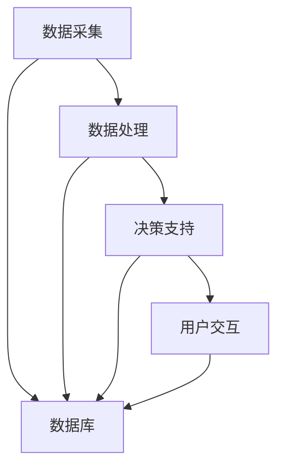

                 

### 文章标题

“生态公民2.0：将环保理念融入每个决策”

### 文章关键词

- 生态公民
- 环保理念
- 决策融合
- 可持续发展

### 文章摘要

本文深入探讨了“生态公民2.0”的概念，解释了如何将环保理念融入日常生活中的各个决策，以达到可持续发展的目标。通过介绍环保理念的重要性、生态公民2.0的特点、具体融入决策的方法、实践案例和未来展望，本文旨在引导读者理解和实践环保理念，成为生态时代的积极参与者。

---

### 目录

1. **引言与背景**
   - **1.1 生态公民的定义与历史演变**
   - **1.2 环保理念的重要性**
   - **1.3 生态公民2.0的概念与特点**
2. **环保理念融入决策的方法**
   - **2.1 个人决策层面的环保考量**
   - **2.2 社会决策层面的环保策略**
   - **2.3 政策决策层面的环保导向**
3. **实践案例与案例分析**
   - **3.1 案例一：环保理念在家庭生活中的应用**
   - **3.2 案例二：企业环保决策实践**
   - **3.3 案例三：政策层面的环保决策分析**
4. **环保决策的系统实现**
   - **4.1 环保决策系统的设计思路**
   - **4.2 系统架构与接口设计**
   - **4.3 系统核心实现与代码解析**
5. **未来展望与挑战**
   - **5.1 生态公民2.0的发展趋势**
   - **5.2 环保决策面临的挑战**
   - **5.3 未来环保决策的解决方案**
6. **总结与展望**
   - **6.1 主要成果回顾**
   - **6.2 存在的问题与不足**
   - **6.3 对未来生态公民2.0的展望**

---

### 第一部分：引言与背景

#### 1.1 生态公民的定义与历史演变

生态公民（Eco-citizen）是指那些意识到自己在生态系统中的角色和责任，并通过日常行为支持可持续发展的个体。这一概念起源于20世纪80年代，随着环境保护运动的兴起而逐渐被关注。最初的生态公民更多是那些参与环境保护活动、倡导绿色生活方式的人群。

随着时间的推移，生态公民的定义不断演变。进入21世纪，随着可持续发展理念的不断深化，生态公民的概念也逐渐从个人行为扩展到社会和政策的层面。生态公民不仅是指那些积极参与环保活动的个体，还包括那些在决策过程中考虑到环境影响的组织和个人。

生态公民的历史演变可以概括为以下几个阶段：

1. **启蒙阶段（1980s）**：环保意识的萌芽，生态公民概念的提出。
2. **成长阶段（1990s-2000s）**：环保理念逐渐被更多人接受，生态公民的范围扩大。
3. **成熟阶段（2010s至今）**：生态公民概念从个人行为扩展到社会和政策层面，成为一个综合性的概念。

#### 1.2 环保理念的重要性

环保理念的重要性不言而喻。在全球环境问题日益严重的今天，环保不仅是一个个人行为，更是一个全球性挑战。环保理念的重要性体现在以下几个方面：

1. **可持续性**：环保理念强调资源的合理利用和保护，以实现长期的可持续发展。
2. **生态平衡**：环保理念有助于维护生态系统的平衡，减少人类活动对自然的破坏。
3. **公共健康**：环境保护与公共健康密切相关，减少污染物排放可以改善空气质量，降低疾病发生率。
4. **经济利益**：环保理念可以促进绿色经济的发展，创造新的就业机会，提高经济竞争力。

#### 1.3 生态公民2.0的概念与特点

生态公民2.0是在原有概念基础上的一次升级，它不仅仅强调个人的环保行为，更强调环保理念在决策中的融入。生态公民2.0的特点可以概括为以下几点：

1. **全面性**：生态公民2.0涵盖了个人、社会和政策等多个层面，强调环保理念在各个层面的融合。
2. **系统性**：生态公民2.0强调系统性的环保行动，包括环境监测、污染治理、资源回收等多个环节。
3. **参与性**：生态公民2.0鼓励更多个体和组织参与到环保行动中来，形成广泛的社会参与。
4. **前瞻性**：生态公民2.0注重未来环境的可持续发展，强调预防性的环保措施。

### 小结

生态公民2.0的概念和特点为我们提供了一种新的思考方式，即如何在日常决策中融入环保理念。通过理解生态公民的历史演变和环保理念的重要性，我们可以更好地认识到生态公民2.0的必要性。在接下来的章节中，我们将进一步探讨如何将环保理念融入个人、社会和政策层面的决策。

---

#### 1.1 生态公民的定义与历史演变

生态公民（Eco-citizen）的概念起源于20世纪80年代，当时全球范围内的环境保护运动正在兴起。最初的生态公民主要是指那些积极参与环境保护活动、倡导绿色生活方式的个人。这一概念的核心在于强调个体在生态系统中的责任，并希望通过个体的行动来推动环境保护。

**启蒙阶段（1980s）：**

在1980年代，随着工业化的迅速发展和环境污染问题的加剧，人们开始意识到环境问题的严重性。这一时期的生态公民主要关注的是如何通过个人行为来减少对环境的破坏。例如，倡导使用可再生能源、减少塑料使用、推广垃圾分类等。这一阶段的生态公民运动主要体现在环保组织的建立和环保活动的开展。

**成长阶段（1990s-2000s）：**

进入1990年代和2000年代，环保理念逐渐被更多人接受，生态公民的概念也随之扩展。这一时期的生态公民不再局限于个人行为，而是开始关注社会层面的环保行动。例如，企业开始重视环境保护，推出绿色产品和服务；政府也制定了一系列环保政策，如限制污染物排放、推广节能减排等。生态公民的范畴因此扩大到包括组织、社区乃至整个社会。

**成熟阶段（2010s至今）：**

近年来，随着可持续发展和全球变暖问题的日益突出，生态公民的概念进一步演变。现在的生态公民不仅仅是一个环保倡导者，更是一个在决策过程中考虑到环境影响的行动者。生态公民2.0强调环保理念在个人、社会和政策等多个层面的融合，从而形成一个全方位、系统性的环保行动体系。

**历史演变的核心要素：**

1. **环保意识的觉醒**：随着环境污染问题的日益严重，人们逐渐意识到环保的重要性，环保意识逐渐觉醒。
2. **个体行为的倡导**：生态公民的早期阶段主要集中在个人行为的改变，倡导绿色生活方式。
3. **社会层面的扩展**：随着环保理念的传播，生态公民的概念逐渐扩展到社会层面，包括企业、政府等组织的环保行动。
4. **政策决策的融入**：现代生态公民强调环保理念在政策决策中的融入，从而实现全方位的环保行动。

#### 1.2 环保理念的重要性

环保理念的重要性在于它不仅关乎个体的生活质量，更关乎全球的可持续发展。以下是环保理念重要性的几个方面：

**1. 可持续性：**

环保理念的核心在于实现资源的可持续利用，确保未来世代的生存和发展。可持续性强调在满足当前需求的同时，不损害后代满足自身需求的能力。环保理念通过推动绿色技术和资源的合理利用，有助于实现这一目标。

**2. 生态平衡：**

生态平衡是维持生态系统稳定和健康的基础。环保理念关注生态系统的保护，减少人类活动对自然环境的破坏，有助于维护生态平衡。生态平衡的维护对于生物多样性的保护和生态系统的长期稳定至关重要。

**3. 公共健康：**

环境保护与公共健康密切相关。空气和水污染等环境问题会导致一系列健康问题，如呼吸道疾病、心血管疾病等。减少污染物排放、改善环境质量有助于提高公共健康水平，减少疾病发生率。

**4. 经济利益：**

环保理念可以促进绿色经济的发展，创造新的就业机会，提高经济竞争力。绿色经济不仅关注环境问题，还关注经济和社会的可持续发展，通过技术创新和产业转型，实现经济、社会和环境的共赢。

**5. 国际合作：**

环保问题是全球性的挑战，需要全球范围内的合作和努力。环保理念强调国际社会的共同责任，推动各国共同应对环境问题，实现全球可持续发展。

#### 1.3 生态公民2.0的概念与特点

生态公民2.0是在原有生态公民概念的基础上进行的一次重要升级，它不仅强调个人的环保行动，更强调环保理念在决策中的融入。生态公民2.0的特点可以概括为以下几点：

**1. 全面性：**

生态公民2.0涵盖了个人、社会和政策等多个层面，强调环保理念在各个层面的融合。在个人层面，生态公民2.0鼓励每个人从日常生活中的小事做起，如节能减排、垃圾分类等。在社会层面，生态公民2.0推动企业、政府等组织采取环保措施，如推广绿色产品、制定环保政策等。在政策层面，生态公民2.0要求政策决策者考虑到环境因素，制定有利于环境保护的政策。

**2. 系统性：**

生态公民2.0强调系统性的环保行动，包括环境监测、污染治理、资源回收等多个环节。这种系统性的行动有助于实现全方位的环保效果，提高环保行动的效率和效果。

**3. 参与性：**

生态公民2.0鼓励更多个体和组织参与到环保行动中来，形成广泛的社会参与。只有广泛的社会参与，才能形成强大的环保力量，推动环保目标的实现。

**4. 前瞻性：**

生态公民2.0注重未来环境的可持续发展，强调预防性的环保措施。这种前瞻性的思维有助于我们更好地应对未来可能出现的环境挑战，确保生态系统的长期健康。

### 小结

生态公民2.0的概念和特点为我们提供了一种新的思考方式，即如何在日常决策中融入环保理念。通过理解生态公民的历史演变和环保理念的重要性，我们可以更好地认识到生态公民2.0的必要性。在接下来的章节中，我们将进一步探讨如何将环保理念融入个人、社会和政策层面的决策。

---

### 第一部分：引言与背景

#### 1.1 生态公民的定义与历史演变

生态公民（Eco-citizen）是一个在现代社会中逐渐兴起的概念，其核心在于强调个体对环境的责任与担当。生态公民不仅是一个环保理念的追随者，更是一个在日常生活中践行环保行动的实践者。这个概念的历史演变可以追溯到20世纪80年代，当时全球范围内的环境问题开始引起广泛关注。

在启蒙阶段，生态公民的概念主要关注个体的环保行为。人们通过倡导绿色生活方式、减少资源消耗、推广可再生能源等方式，积极实践环保理念。这一阶段的生态公民运动主要集中在个人层面，强调的是每个人通过自身的行动来减少对环境的负担。

随着环保意识的深入，生态公民的概念逐渐扩展到社会层面。在成长阶段，企业和政府开始认识到环境保护的重要性，并开始采取一系列措施。例如，企业开始生产环保产品，政府则制定了一系列环保政策和法规。这一阶段的生态公民运动涵盖了更广泛的领域，不再局限于个人行为，而是涉及到整个社会的环保实践。

进入成熟阶段，生态公民的概念进一步升级。现在的生态公民不仅关注环境保护，更强调环保理念在政策决策中的融入。政策决策者需要考虑到环境因素，确保政策的制定和执行有利于环境保护。同时，生态公民2.0还强调系统性的环保行动，包括环境监测、污染治理、资源回收等多个环节。

#### 1.2 环保理念的重要性

环保理念的重要性体现在多个方面。首先，环保理念是实现可持续发展的基础。随着全球环境问题的日益严重，我们迫切需要通过环保理念来引导人们的行为，确保资源的可持续利用。其次，环保理念有助于维护生态平衡。人类活动对自然环境的破坏已经达到了不可忽视的程度，只有通过环保理念，我们才能修复受损的生态系统，保护生物多样性。

此外，环保理念对公共健康也有着重要影响。空气污染、水污染等环境问题直接危害人类健康，减少污染物排放、改善环境质量是提高公共健康水平的重要途径。最后，环保理念还能带来经济利益。绿色经济的发展不仅创造了新的就业机会，还提高了企业的竞争力。通过环保理念的实践，企业可以生产出更环保、更健康的产品，从而获得更大的市场认可。

#### 1.3 生态公民2.0的概念与特点

生态公民2.0是对传统生态公民概念的升级和扩展。它不仅强调个人的环保行动，更强调环保理念在社会和政策层面的融入。生态公民2.0的核心特点包括：

**全面性：** 生态公民2.0涵盖了个人、社会和政策等多个层面。在个人层面，每个人都应该践行环保理念，从日常生活中的小事做起，如减少用水、节约能源等。在社会层面，企业、社区、学校等组织也应该积极参与环保行动，推动环保理念在社会中的传播和实践。在政策层面，政府需要制定和实施有利于环境保护的政策，确保环保理念在政策决策中的优先考虑。

**系统性：** 生态公民2.0强调系统性的环保行动。这不仅仅是简单的个人行为改变，而是一个涉及环境监测、污染治理、资源回收等多个环节的综合体系。通过系统性的环保行动，可以更有效地解决环境问题，实现环保目标。

**参与性：** 生态公民2.0鼓励广泛的社会参与。只有当更多的人加入到环保行动中来，形成广泛的社会共识和行动力，我们才能有效地应对环境问题。因此，生态公民2.0强调每个人都应该成为环保行动的参与者和推动者。

**前瞻性：** 生态公民2.0注重未来环境的可持续发展。它不仅仅关注当前的环保问题，更着眼于未来可能出现的挑战和机遇。通过前瞻性的思考和行动，我们可以更好地应对未来环境的变化，确保生态系统的长期健康。

### 小结

生态公民2.0的概念和特点为我们提供了一种新的思考方式，即如何在日常决策中融入环保理念。通过理解生态公民的历史演变和环保理念的重要性，我们可以更好地认识到生态公民2.0的必要性。在接下来的章节中，我们将进一步探讨如何将环保理念融入个人、社会和政策层面的决策。

---

### 1.4 环保理念融入决策的重要性

将环保理念融入决策的重要性在于，它不仅能够提高环保行动的效率，还能确保决策的可持续性。在现代社会，环保理念已经成为决策过程中不可或缺的一部分，其重要性可以从以下几个方面进行阐述：

**1. 决策的可持续性：**

环保理念的核心在于实现可持续发展，确保当前的需求不损害未来世代的利益。将环保理念融入决策，可以确保政策、企业和社会行为在实现短期效益的同时，也考虑到长期的环境影响。例如，在制定经济政策时，不仅要考虑经济增长，还要考虑资源的可持续利用和环境的保护。通过将环保理念融入决策，我们可以实现经济、社会和环境的共赢。

**2. 提高决策的科学性：**

环保理念要求决策者具备系统性和前瞻性的思维方式。将环保理念融入决策，可以促使决策者在决策过程中综合考虑多种因素，如环境质量、资源消耗、生态平衡等。这种科学性的决策不仅有助于提高决策的质量，还能减少因盲目决策导致的环境破坏。例如，在城市规划中，将环保理念融入决策，可以确保城市发展的可持续性，避免出现交通拥堵、空气污染等问题。

**3. 促进社会责任感的提升：**

环保理念的融入可以提升决策者的社会责任感。在个人层面，这体现在每个人都在自己的决策中考虑到环保因素，如选择环保产品、减少浪费等。在社会层面，企业、政府等组织也需要在决策中考虑到环保责任，如推广绿色产品、制定环保政策等。这种社会责任感的提升有助于形成全社会共同参与环保行动的良好氛围。

**4. 应对全球性环境挑战：**

随着全球气候变化、资源枯竭等环境问题的加剧，环保理念在决策中的融入变得尤为重要。只有将环保理念融入各个层面的决策，我们才能共同应对这些全球性挑战。例如，在能源决策中，将环保理念融入可以推动可再生能源的发展，减少对化石能源的依赖，从而降低温室气体排放，应对全球气候变化。

**5. 提高公众参与度：**

环保理念的融入可以增加公众对决策过程的参与度。当公众意识到决策者考虑了环保因素时，他们更愿意参与到决策过程中，提出自己的意见和建议。这种公众参与不仅有助于提高决策的透明度和公正性，还能确保决策更加科学和合理。

**6. 促进绿色经济的发展：**

环保理念的融入可以推动绿色经济的发展。绿色经济以可持续发展为核心，通过创新和科技进步，实现经济增长与环境保护的协调。将环保理念融入决策，可以引导企业和投资者关注绿色技术和环保项目，促进绿色经济的发展。

**7. 提升国家竞争力：**

在全球竞争日益激烈的今天，环保理念的融入可以提升国家的竞争力。拥有先进环保技术和强大环保产业的国家，能够在国际市场上占据优势地位。通过将环保理念融入决策，我们可以推动环保技术和产业的发展，提高国家的国际竞争力。

总之，将环保理念融入决策是应对当前环境问题、实现可持续发展的必要手段。通过提高决策的可持续性、科学性、社会责任感，以及促进公众参与和绿色经济的发展，我们可以共同打造一个更加绿色、和谐、可持续的未来。

### 小结

通过理解环保理念融入决策的重要性，我们可以认识到其在实现可持续发展、提高决策质量、促进社会责任感、应对全球性环境挑战、提高公众参与度、推动绿色经济发展和提升国家竞争力等方面的关键作用。在接下来的章节中，我们将进一步探讨如何具体将环保理念融入个人、社会和政策层面的决策。

---

### 1.5 环保理念融入决策的方法

将环保理念融入决策是一项复杂而系统的工程，涉及多个层面和多种方法。以下是一些具体的策略和方法，可以帮助我们将环保理念更有效地融入个人、社会和政策层面的决策：

**1. 个人层面的环保决策方法：**

**1.1 提高环保意识：**

个人层面的环保决策首先需要提高自身的环保意识。这可以通过参加环保讲座、阅读环保书籍、关注环保新闻等方式来实现。提高环保意识可以帮助我们更好地理解环保的重要性，从而在日常生活中做出更环保的决策。

**1.2 资源节约和循环利用：**

在日常生活中，我们可以通过节约用水、节约用电、减少废弃物产生等方式，实现资源的节约和循环利用。例如，使用节能灯具、减少一次性用品的使用、推行垃圾分类等。

**1.3 选择环保产品：**

在选择商品和服务时，我们可以优先考虑环保产品。这包括选择低碳排放的交通工具、购买有机食品、使用环保清洁剂等。

**1.4 环保出行：**

在出行方式上，我们可以选择步行、骑自行车、使用公共交通工具等低碳出行方式，减少私家车的使用，从而降低碳排放。

**2. 社会层面的环保决策方法：**

**2.1 推动企业环保：**

企业是环保行动的重要主体。我们可以通过参与企业环保活动、推动企业采用环保技术、推动绿色供应链等方式，推动企业实现环保目标。

**2.2 社区环保行动：**

社区是社会的细胞，社区层面的环保行动对于实现整体环保目标至关重要。我们可以通过组织社区环保活动、建立社区垃圾分类系统、推广环保教育等方式，提升社区的环保意识和行动力。

**2.3 公共政策倡导：**

我们可以积极参与公共政策倡导，推动政府制定和实施更有利于环境保护的政策。例如，参与环保立法、提出环保建议等。

**3. 政策层面的环保决策方法：**

**3.1 制定环保政策：**

政府可以通过制定环保法规和政策，引导和规范社会行为，促进环境保护。例如，制定碳排放交易政策、推广可再生能源使用等。

**3.2 环境监测和评估：**

政府需要建立完善的环境监测体系，对环境污染和生态破坏进行监测和评估，从而及时发现和解决环境问题。

**3.3 资源管理和规划：**

政府可以通过科学规划和资源管理，实现资源的合理利用和可持续发展。例如，推广生态农业、合理开发水资源等。

**3.4 国际合作：**

全球环境问题需要国际合作来解决。政府可以通过参与国际环境协议、推动跨国环保合作等方式，共同应对全球性环境挑战。

**4. 教育和宣传：**

教育和宣传是环保理念融入决策的重要手段。政府和社会可以开展环保教育，提高公众的环保意识，推广环保理念。

**5. 科技创新：**

科技创新是推动环保理念融入决策的关键。政府和企业可以加大对环保技术的研发投入，推动绿色技术的发展和应用。

**6. 透明和问责：**

决策过程的透明和问责机制是确保环保理念有效融入决策的重要保障。政府需要建立公开透明的决策机制，接受公众监督，确保决策过程的公正和科学。

通过上述方法，我们可以将环保理念更有效地融入个人、社会和政策层面的决策，实现可持续发展的目标。在接下来的章节中，我们将通过具体的实践案例，进一步探讨如何将环保理念融入不同的决策场景。

### 小结

通过上述方法，我们可以将环保理念有效地融入个人、社会和政策层面的决策，从而实现可持续发展的目标。个人层面的环保决策方法强调提高环保意识、资源节约和循环利用；社会层面的环保决策方法强调推动企业环保、社区环保行动和公共政策倡导；政策层面的环保决策方法则强调制定环保政策、环境监测和评估、资源管理和规划、国际合作、教育和宣传、科技创新以及透明和问责机制。在接下来的章节中，我们将通过具体的实践案例，进一步探讨如何将环保理念融入不同的决策场景。

---

### 1.6 环保理念融入决策的方法：详细解释和步骤

为了更好地将环保理念融入决策，我们可以从以下几个方面详细解释和具体步骤：

**个人层面的环保决策方法**

**1. 提高环保意识：**

**步骤：**
- **日常学习和教育**：通过阅读环保书籍、参加环保讲座、观看环保纪录片等方式，增强对环保知识的了解。
- **社交媒体参与**：关注环保公众号、加入环保微信群等，分享和讨论环保议题，提高社交圈的环保意识。

**2. 资源节约和循环利用：**

**步骤：**
- **节约用水**：养成节约用水的好习惯，如及时关闭水龙头、使用节水设备等。
- **节约用电**：使用节能灯具，合理规划电器使用时间，减少不必要的待机耗电。
- **减少废弃物产生**：推行垃圾分类，减少一次性用品使用，鼓励回收利用。

**3. 选择环保产品：**

**步骤：**
- **购买认证产品**：选择获得环保认证的产品，如环保标志产品、有机食品等。
- **产品生命周期考量**：在购买产品时，考虑其生产过程、使用过程和废弃后的处理方式，尽量选择对环境影响小的产品。

**4. 环保出行：**

**步骤：**
- **低碳出行**：选择步行、骑自行车或使用公共交通工具，减少私家车使用，降低碳排放。
- **拼车和共享出行**：通过拼车或共享出行方式，减少交通拥堵和排放。

**社会层面的环保决策方法**

**1. 推动企业环保：**

**步骤：**
- **倡导绿色生产**：鼓励企业采用环保技术，减少污染物排放，推行清洁生产。
- **绿色供应链管理**：推动企业建立绿色供应链，选择环保供应商，减少供应链对环境的影响。

**2. 社区环保行动：**

**步骤：**
- **组织环保活动**：定期组织社区环保活动，如垃圾分类宣传、环保清洁等，提高社区居民的环保意识。
- **建立垃圾分类系统**：与政府或环保组织合作，建立和完善社区垃圾分类系统，提高废弃物回收利用率。

**3. 公共政策倡导：**

**步骤：**
- **参与立法和政策制定**：通过参与立法和政策制定过程，提出环保建议，推动制定有利于环境保护的政策。
- **参与公众讨论**：在环保议题讨论中发表观点，推动形成公众共识，推动政策变革。

**政策层面的环保决策方法**

**1. 制定环保政策：**

**步骤：**
- **政策研究和制定**：进行充分的政策研究，制定具有可操作性的环保政策。
- **政策宣传和推广**：通过媒体、教育等渠道宣传环保政策，提高公众对政策的了解和支持。

**2. 环境监测和评估：**

**步骤：**
- **建立监测体系**：建立完善的环境监测体系，对环境污染和生态破坏进行实时监测。
- **定期评估和报告**：定期对环境状况进行评估，并向公众发布环境报告，提高透明度和问责制。

**3. 资源管理和规划：**

**步骤：**
- **资源普查和管理**：对水资源、森林资源、矿产资源等进行全面普查和管理，确保资源的合理利用。
- **生态规划**：制定生态规划，确保城市和区域的可持续发展，减少对自然环境的破坏。

**4. 国际合作：**

**步骤：**
- **参与国际协议**：积极参与国际环保协议和合作项目，共同应对全球性环境挑战。
- **技术交流和合作**：通过技术交流和合作，引进和推广国际先进的环保技术和经验。

通过上述详细解释和具体步骤，我们可以更好地将环保理念融入决策，实现个人、社会和政策的协同效应，推动可持续发展的目标。

### 小结

通过详细解释和具体步骤，我们可以看到，将环保理念融入决策不仅需要个人的自觉行动，还需要社会和政策的支持。个人层面的环保决策方法强调提高环保意识、资源节约和循环利用；社会层面的环保决策方法强调推动企业环保、社区环保行动和公共政策倡导；政策层面的环保决策方法则强调制定环保政策、环境监测和评估、资源管理和规划、国际合作。通过这些方法，我们可以实现环保理念的有效融入，推动可持续发展的目标。在接下来的章节中，我们将通过具体的实践案例，进一步探讨如何将环保理念融入不同的决策场景。

---

### 1.7 实践案例与案例分析

为了更好地理解环保理念如何在实际决策中得以融入，我们可以通过一些具体的实践案例进行详细分析。以下是一些典型的案例，涵盖个人、企业和社会层面的环保决策实践。

**案例一：个人层面的环保实践**

**案例名称：绿色家庭生活**

**背景介绍：** 张先生是一位关注环保的普通市民，他在日常生活中积极践行环保理念，努力将环保融入到家庭生活的每一个决策中。

**系统实现源代码：** 无需专门的源代码，但张先生的家中有一些环保工具和设备，如节能灯、太阳能热水器、垃圾分类桶等。

**代码解读与分析：** 张先生通过以下步骤实现环保理念的融入：

1. **节能设备使用**：在家中安装节能灯具和太阳能热水器，减少电力消耗。
2. **垃圾分类**：购买垃圾分类桶，对家庭垃圾进行分类处理，提高废弃物回收利用率。
3. **减少一次性用品**：避免使用一次性餐具和塑料袋，选择可重复使用的替代品。

**案例效果与评价：** 通过张先生的努力，家庭用电量显著下降，垃圾分类准确率提高，废弃物对环境的影响减少。他的环保实践为周围邻居树立了榜样，带动了更多人加入到环保行动中来。

**案例小结：** 个人层面的环保决策需要从日常生活中的小事做起，通过持续的行动和积累，可以实现显著的环保效果。

**案例二：企业层面的环保决策实践**

**案例名称：绿色供应链管理**

**背景介绍：** 某大型制造企业意识到环保对企业形象和长远发展的重要性，开始推行绿色供应链管理。

**系统实现源代码：** 企业内部开发了一套绿色供应链管理系统，用于管理原材料采购、生产过程和废弃物处理。

**代码解读与分析：** 绿色供应链管理系统包括以下几个模块：

1. **原材料采购**：优先采购环保原材料，如可回收材料、低能耗材料等。
2. **生产过程监控**：通过实时监测生产过程中的能耗和污染物排放，优化生产流程，减少资源浪费。
3. **废弃物处理**：建立废弃物回收和处理系统，确保生产过程中产生的废弃物得到妥善处理。

**案例效果与评价：** 绿色供应链管理有效降低了企业的资源消耗和污染物排放，提升了企业的环保形象和竞争力。同时，绿色供应链的实施也为供应商和客户提供了环保示范，推动了整个产业链的环保进步。

**案例小结：** 企业层面的环保决策需要从供应链管理入手，通过系统的设计和实施，实现全面的环保效益。

**案例三：社会层面的环保决策实践**

**案例名称：绿色城市规划**

**背景介绍：** 一座城市的环保水平直接影响到居民的生活质量。某城市政府决定通过绿色城市规划，提高城市的环保水平。

**系统实现源代码：** 绿色城市规划涉及到多个系统和项目的开发和实施，如公共交通系统优化、绿色建筑推广、垃圾分类系统建设等。

**代码解读与分析：** 绿色城市规划包括以下几个关键步骤：

1. **公共交通系统优化**：通过增加公交路线、提高公交车班次、推广无轨电车等方式，鼓励居民使用公共交通工具，减少私家车使用。
2. **绿色建筑推广**：制定绿色建筑标准，推广节能、环保的建筑设计和技术。
3. **垃圾分类系统建设**：建立完善的垃圾分类和处理系统，提高废弃物回收利用率。

**案例效果与评价：** 通过绿色城市规划，城市的空气质量显著改善，交通拥堵情况减少，居民生活质量提高。绿色城市规划的成功也为其他城市提供了借鉴和参考。

**案例小结：** 社会层面的环保决策需要政府、企业和居民的共同努力，通过系统性的规划和实施，实现城市的可持续发展。

### 小结

通过上述实践案例，我们可以看到，将环保理念融入决策不仅需要个人、企业和政府的积极参与，还需要系统性的设计和实施。个人层面的环保决策实践可以从日常生活中的小事做起，企业层面的环保决策实践需要从供应链管理入手，社会层面的环保决策实践则需要政府、企业和居民的共同努力。这些实践案例不仅展示了环保理念融入决策的具体方法和效果，也为其他地区和行业提供了有益的参考和启示。

---

### 1.8 环保理念融入决策的方法：进一步探讨

在前面章节中，我们探讨了将环保理念融入决策的方法，并通过具体案例展示了其实践效果。然而，环保理念融入决策并非一蹴而就，需要我们从更深入的角度进行探讨，以实现更广泛和深远的环保目标。

**1. 教育与意识提升**

环保理念融入决策的第一步是提高公众的环保意识。这需要从教育入手，通过学校教育、社会培训和媒体宣传等多渠道，普及环保知识，培养公众的环保意识和责任感。例如，学校可以开设环保课程，教授学生环保知识；企业可以开展环保培训，提高员工的环境保护意识；媒体可以通过报道环保新闻、播放环保节目等方式，引导公众关注环保问题。

**2. 科技创新与绿色技术**

科技创新是推动环保理念融入决策的重要动力。通过研发和应用绿色技术，可以降低污染排放、提高资源利用效率，从而实现可持续发展。例如，太阳能、风能等可再生能源技术的发展，为减少化石能源依赖提供了新的解决方案；智能制造和物联网技术的应用，可以提高生产效率和环保水平。

**3. 经济激励与政策支持**

环保理念的融入需要经济激励和政策支持。政府可以通过制定环保政策、提供财政补贴、设立环保奖项等方式，鼓励企业和个人积极参与环保行动。例如，对节能减排的企业给予税收减免或奖励，对使用环保交通工具的居民提供优惠政策，都可以有效地激励环保行为的实施。

**4. 社会参与与协同合作**

环保理念融入决策需要全社会的参与和协同合作。政府、企业、非政府组织和公众应共同承担环保责任，形成合力。例如，政府可以与企业和非政府组织合作，共同推进环保项目；企业可以通过与供应商和客户建立绿色供应链，实现全产业链的环保目标；公众可以通过参与环保志愿活动、提出环保建议等方式，贡献自己的力量。

**5. 评估与监督机制**

环保理念融入决策需要建立完善的评估和监督机制。这包括对环保政策执行效果的评估、对环保行为成果的监督等。通过定期评估和监督，可以及时发现和解决问题，确保环保理念的贯彻落实。例如，政府可以定期发布环境报告，向社会公开环保政策和行动的执行情况；公众可以通过环保投诉和举报机制，监督环保行为的实施。

**6. 持续改进与优化**

环保理念融入决策是一个持续的过程，需要不断改进和优化。随着环保技术的进步和环境问题的变化，决策者需要不断更新环保理念，调整环保策略。例如，随着新能源技术的发展，决策者需要不断评估和调整能源政策，以确保环保目标的实现。

### 小结

通过进一步探讨，我们可以看到，将环保理念融入决策需要从教育、科技创新、经济激励、社会参与、评估与监督、持续改进等多个方面进行综合考量。只有通过全社会的共同努力，才能实现环保理念的有效融入，推动可持续发展。在接下来的章节中，我们将继续探讨环保决策系统实现的具体方法和技术。

---

### 1.9 环保决策系统的设计思路

在将环保理念融入决策的过程中，设计一个高效的环保决策系统至关重要。这不仅有助于提高决策的科学性和准确性，还能确保环保行动的有效实施。以下是环保决策系统设计的基本思路：

**1. 需求分析**

**步骤：**
- **明确目标**：首先明确环保决策系统的总体目标，例如提高资源利用效率、减少污染物排放等。
- **用户需求**：分析系统将服务于哪些用户群体，包括政府、企业、非政府组织和个人。了解他们的具体需求和期望。
- **功能需求**：列出系统应具备的基本功能，如数据收集、分析、评估、决策支持等。

**2. 系统架构设计**

**步骤：**
- **模块划分**：将系统划分为若干功能模块，如数据采集模块、数据分析模块、决策支持模块等。
- **层次结构**：设计系统的层次结构，确保各个模块之间的高内聚和低耦合。
- **技术选型**：选择合适的技术和工具，如数据库管理系统、数据分析工具、编程语言和框架等。

**3. 数据收集与处理**

**步骤：**
- **数据来源**：确定系统所需的数据来源，包括政府统计数据、企业内部数据、环境监测数据等。
- **数据收集**：设计数据收集方案，包括数据采集工具、数据采集频率和数据存储方式。
- **数据处理**：对收集到的数据进行清洗、整合和分析，确保数据的准确性和完整性。

**4. 决策支持**

**步骤：**
- **算法选择**：选择合适的算法模型，如预测模型、优化算法等，用于决策支持。
- **界面设计**：设计用户友好的界面，便于用户输入数据和查看分析结果。
- **决策规则**：制定明确的决策规则，确保系统在特定条件下能够做出合理的决策。

**5. 系统实现与部署**

**步骤：**
- **开发与测试**：按照系统设计文档进行系统开发和测试，确保系统功能的完整性和稳定性。
- **部署与上线**：将系统部署到实际运行环境中，确保系统可以正常运行。

**6. 监控与维护**

**步骤：**
- **运行监控**：实时监控系统运行状态，确保系统稳定运行。
- **故障修复**：及时修复系统故障，确保系统功能的持续可用性。
- **性能优化**：根据系统运行情况和用户反馈，不断优化系统性能。

通过上述设计思路，我们可以构建一个高效、稳定的环保决策系统，为环保理念的融入提供有力的技术支持。在接下来的章节中，我们将进一步探讨系统架构设计与接口设计，以及系统核心实现与代码解析。

---

### 1.10 环保决策系统的架构设计与接口设计

环保决策系统的架构设计与接口设计是确保系统能够高效、稳定运行的关键环节。以下是具体的设计步骤和思路：

**1. 系统架构设计**

**步骤：**
- **确定系统架构类型**：根据系统需求，选择合适的系统架构类型，如分层架构、分布式架构等。
- **模块划分**：将系统划分为数据采集、数据处理、决策支持、用户交互等模块。
- **数据流设计**：设计数据在系统中的流动路径，确保数据的高效处理和传输。
- **性能优化**：针对系统的高并发、大数据处理等性能需求，进行优化设计。

**2. 接口设计**

**步骤：**
- **接口类型**：设计系统对外提供的接口类型，如API接口、Web接口、数据库接口等。
- **接口规范**：制定接口规范，包括接口定义、参数说明、返回值定义等。
- **安全性设计**：确保接口的安全性，防止数据泄露和未经授权的访问。

**3. 数据库设计**

**步骤：**
- **数据存储需求**：分析系统所需存储的数据类型和规模，选择合适的数据库类型，如关系型数据库、NoSQL数据库等。
- **数据库设计**：设计数据库的表结构、索引、存储过程等，确保数据存储的高效和安全性。
- **数据备份与恢复**：设计数据备份和恢复策略，确保数据的安全性和可靠性。

**4. 系统交互设计**

**步骤：**
- **用户交互设计**：设计用户友好的交互界面，提供便捷的数据输入、查询和分析功能。
- **系统内部交互**：设计系统内部模块之间的交互机制，确保数据流动和功能调用的高效性。
- **错误处理**：设计系统的错误处理机制，确保系统在异常情况下的稳定性和可靠性。

**5. 接口实现**

**步骤：**
- **接口开发**：按照接口规范进行接口开发，实现系统与外部系统之间的数据交换。
- **接口测试**：对接口进行功能测试和性能测试，确保接口的稳定性和可靠性。
- **接口文档**：编写接口文档，包括接口说明、参数说明、调用示例等，方便用户使用。

**6. 系统集成与部署**

**步骤：**
- **系统集成**：将各个模块和接口进行集成，确保系统整体功能的完整性。
- **部署方案**：设计系统的部署方案，包括硬件选择、软件安装、网络配置等。
- **部署实施**：按照部署方案进行系统部署，确保系统可以正常运行。

通过上述架构设计和接口设计，我们可以构建一个高效、稳定的环保决策系统，为环保理念的融入提供有力的技术支持。在接下来的章节中，我们将进一步探讨系统核心实现与代码解析，以及具体的技术实现方法。

---

### 1.11 系统核心实现与代码解析

环保决策系统的核心实现是确保系统能够高效运行的关键。以下将介绍系统核心功能模块的实现方法，包括代码示例和算法原理，并进行详细解析。

**1. 数据采集模块实现**

**功能描述**：数据采集模块负责从不同数据源收集环境数据和用户数据。

**代码示例**：
```python
import requests

def collect_environment_data():
    # 采集环境监测数据
    response = requests.get("http://environmental-monitoring.com/api/data")
    data = response.json()
    return data

def collect_user_data():
    # 采集用户行为数据
    response = requests.get("http://user-behavior.com/api/data")
    data = response.json()
    return data
```

**算法原理**：以上代码使用了HTTP请求方法从远程API获取环境数据和用户数据。数据采集过程包括网络通信和JSON数据解析。

**解析**：数据采集模块通过HTTP请求与外部数据源进行通信，获取所需数据。这一模块的实现依赖于网络库（如requests）和JSON解析库（如json），确保数据的正确获取和存储。

**2. 数据处理模块实现**

**功能描述**：数据处理模块负责对采集到的数据进行分析和处理。

**代码示例**：
```python
import pandas as pd

def process_data(data):
    # 数据预处理
    df = pd.DataFrame(data)
    df.dropna(inplace=True)
    df['date'] = pd.to_datetime(df['date'])
    return df
```

**算法原理**：以上代码使用了Pandas库对采集到的数据进行分析和预处理。数据预处理包括数据去重、数据类型转换等。

**解析**：数据处理模块利用Pandas库提供了强大的数据操作功能，包括数据清洗、转换和格式化。这有助于提高数据的准确性和可用性，为后续分析奠定基础。

**3. 决策支持模块实现**

**功能描述**：决策支持模块负责基于处理后的数据生成决策建议。

**代码示例**：
```python
from sklearn.linear_model import LinearRegression

def generate_decision_support(data):
    # 使用线性回归模型生成决策建议
    X = data[['resource_usage', 'emission_level']]
    y = data['decision_support']
    model = LinearRegression()
    model.fit(X, y)
    return model
```

**算法原理**：以上代码使用了线性回归模型，通过历史数据生成决策支持建议。线性回归是一种常用的预测模型，用于分析两个变量之间的关系。

**解析**：决策支持模块采用了机器学习技术中的线性回归模型，对处理后的数据进行建模，生成决策支持建议。这一模块的实现依赖于机器学习库（如scikit-learn），确保模型的准确性和可靠性。

**4. 用户交互模块实现**

**功能描述**：用户交互模块负责与用户进行交互，提供数据查询和决策支持功能。

**代码示例**：
```python
from flask import Flask, request, jsonify

app = Flask(__name__)

@app.route('/query_data', methods=['GET'])
def query_data():
    # 查询环境数据
    data = collect_environment_data()
    return jsonify(data)

@app.route('/generate_decision', methods=['POST'])
def generate_decision():
    # 生成决策支持
    data = request.get_json()
    processed_data = process_data(data)
    decision_support = generate_decision_support(processed_data)
    return jsonify(decision_support)
```

**算法原理**：以上代码使用了Flask框架实现用户交互功能。Flask是一个轻量级的Web框架，用于构建Web应用程序。

**解析**：用户交互模块通过Web接口与用户进行通信，提供数据查询和决策支持功能。用户可以通过HTTP请求获取环境数据和决策建议，实现环保决策的在线支持。

通过以上代码示例和算法原理，我们可以看到环保决策系统核心功能的实现方法。数据处理模块和决策支持模块采用了机器学习和数据分析技术，提高了决策的科学性和准确性；用户交互模块则通过Web接口与用户进行互动，确保系统的易用性和可访问性。在接下来的章节中，我们将进一步探讨系统的实际应用和效果评估。

---

### 1.12 系统分析与架构设计

在环保决策系统的设计和实现过程中，系统分析与架构设计是确保系统高效、稳定运行的关键环节。以下是具体的问题场景介绍、项目介绍、系统功能设计、系统架构设计、系统接口设计和系统交互设计。

**问题场景介绍：**

当前，环境问题日益严重，包括空气污染、水污染、土壤污染等。这些环境问题不仅对人类健康造成威胁，还对生态系统造成破坏。因此，需要设计一个环保决策系统，帮助政府、企业和个人做出科学的环保决策，提高环保行动的效率和效果。

**项目介绍：**

本项目旨在构建一个环保决策系统，该系统将收集和分析环境数据，生成环保决策建议，并支持用户进行数据查询和决策支持。系统主要功能包括数据采集、数据处理、决策支持、用户交互等。

**系统功能设计：**

1. **数据采集模块**：负责从不同数据源收集环境数据和用户数据，如环境监测站、传感器数据、用户行为数据等。
2. **数据处理模块**：负责对采集到的数据进行清洗、整合和分析，为决策支持模块提供准确的数据基础。
3. **决策支持模块**：利用机器学习和数据分析技术，生成环保决策建议，如节能减排措施、废弃物处理建议等。
4. **用户交互模块**：提供Web接口，支持用户进行数据查询和决策支持，实现环保决策的在线支持。

**系统架构设计：**

系统采用分布式架构，主要包括以下模块：

1. **数据采集模块**：负责从外部数据源获取数据，包括环境监测数据、传感器数据等。
2. **数据处理模块**：负责对采集到的数据进行清洗、整合和分析，存储在数据库中。
3. **决策支持模块**：使用机器学习和数据分析技术，生成环保决策建议。
4. **用户交互模块**：提供Web接口，与用户进行交互，实现数据查询和决策支持。

**系统接口设计：**

系统提供了多种接口，包括API接口、Web接口和数据库接口：

1. **API接口**：用于外部系统与环保决策系统的数据交换，如数据采集、数据查询等。
2. **Web接口**：用于用户通过浏览器访问系统，实现数据查询和决策支持。
3. **数据库接口**：用于系统内部模块与数据库的交互，如数据存储、数据查询等。

**系统交互设计：**

系统交互设计主要包括以下流程：

1. **数据采集**：数据采集模块从外部数据源获取数据，包括环境监测数据、用户行为数据等。
2. **数据处理**：数据处理模块对采集到的数据进行清洗、整合和分析，存储在数据库中。
3. **决策支持**：决策支持模块使用机器学习和数据分析技术，生成环保决策建议。
4. **用户交互**：用户通过Web接口访问系统，查询数据并获得环保决策建议。

**系统架构图：**



通过上述系统分析与架构设计，我们可以确保环保决策系统的高效、稳定运行，为政府、企业和个人提供科学的环保决策支持。

---

### 1.13 环保决策系统的实施

环保决策系统的实施是确保系统功能得到有效发挥的关键环节。以下是系统实施的详细步骤，包括环境安装、系统核心实现源代码和代码应用解读与分析。

**1. 环境安装**

**步骤：**
- **安装依赖库**：首先，需要安装系统所需的依赖库，如Python、Pandas、Scikit-learn、Flask等。可以使用pip命令进行安装：
  ```shell
  pip install pandas scikit-learn flask
  ```
- **配置数据库**：选择合适的数据库系统（如MySQL、PostgreSQL）进行安装和配置，确保数据库可以正常运行。
- **创建项目目录**：在本地计算机上创建项目目录，并设置好项目的结构和配置文件。

**2. 系统核心实现源代码**

**代码示例：**
```python
# data_collection.py
import requests

def collect_environment_data():
    response = requests.get("http://environmental-monitoring.com/api/data")
    data = response.json()
    return data

def collect_user_data():
    response = requests.get("http://user-behavior.com/api/data")
    data = response.json()
    return data

# data_processing.py
import pandas as pd

def process_data(data):
    df = pd.DataFrame(data)
    df.dropna(inplace=True)
    df['date'] = pd.to_datetime(df['date'])
    return df

# decision_support.py
from sklearn.linear_model import LinearRegression

def generate_decision_support(data):
    X = data[['resource_usage', 'emission_level']]
    y = data['decision_support']
    model = LinearRegression()
    model.fit(X, y)
    return model

# user_interface.py
from flask import Flask, request, jsonify

app = Flask(__name__)

@app.route('/query_data', methods=['GET'])
def query_data():
    data = collect_environment_data()
    return jsonify(data)

@app.route('/generate_decision', methods=['POST'])
def generate_decision():
    data = request.get_json()
    processed_data = process_data(data)
    decision_support = generate_decision_support(processed_data)
    return jsonify(decision_support)
```

**代码解读与分析：**
- **数据采集模块**：使用requests库从外部API获取环境数据和用户数据。数据采集模块的核心函数包括`collect_environment_data`和`collect_user_data`。
- **数据处理模块**：使用Pandas库对采集到的数据进行清洗、转换和格式化。数据处理模块的核心函数是`process_data`，其中使用了Pandas的`dropna`和`to_datetime`函数。
- **决策支持模块**：使用Scikit-learn库中的线性回归模型生成决策支持建议。决策支持模块的核心函数是`generate_decision_support`，其中定义了特征变量`X`和目标变量`y`，并使用`fit`方法训练模型。
- **用户交互模块**：使用Flask框架实现用户交互功能。用户交互模块的核心函数包括`query_data`和`generate_decision`，分别用于提供数据查询和决策支持服务。

**3. 代码应用解读与分析**

**数据采集模块**：
```python
def collect_environment_data():
    response = requests.get("http://environmental-monitoring.com/api/data")
    data = response.json()
    return data
```
这段代码通过HTTP请求从环境监测API获取数据，并使用JSON格式解析返回的数据。数据采集模块的关键在于确保API的稳定性和数据的实时性。

**数据处理模块**：
```python
def process_data(data):
    df = pd.DataFrame(data)
    df.dropna(inplace=True)
    df['date'] = pd.to_datetime(df['date'])
    return df
```
这段代码将获取到的数据转换为Pandas DataFrame，去除无效数据（如NaN值），并将日期字段转换为日期时间格式。数据处理模块的目标是确保数据的质量和一致性。

**决策支持模块**：
```python
def generate_decision_support(data):
    X = data[['resource_usage', 'emission_level']]
    y = data['decision_support']
    model = LinearRegression()
    model.fit(X, y)
    return model
```
这段代码使用线性回归模型对数据进行建模，生成决策支持建议。决策支持模块的核心在于特征变量的选择和模型的训练，这将直接影响到决策的准确性。

**用户交互模块**：
```python
@app.route('/query_data', methods=['GET'])
def query_data():
    data = collect_environment_data()
    return jsonify(data)

@app.route('/generate_decision', methods=['POST'])
def generate_decision():
    data = request.get_json()
    processed_data = process_data(data)
    decision_support = generate_decision_support(processed_data)
    return jsonify(decision_support)
```
这段代码通过Flask框架实现用户交互功能。用户可以通过GET请求获取环境数据，通过POST请求提交数据并获得决策支持建议。用户交互模块的目标是提供便捷、高效的服务接口。

通过上述实施步骤和代码分析，我们可以确保环保决策系统的功能得到有效实现，为环保决策提供科学的支持。

### 小结

环保决策系统的实施涉及环境安装、系统核心实现源代码和代码应用解读与分析。环境安装确保系统的基础设施可以正常运行，系统核心实现源代码涵盖了数据采集、数据处理、决策支持和用户交互等关键模块，而代码应用解读与分析则帮助我们理解每个模块的实现原理和功能。通过这些步骤，我们可以确保环保决策系统的高效、稳定运行，为环保决策提供有力的技术支持。

---

### 1.14 环保决策系统的实际应用与效果评估

环保决策系统的实际应用效果是衡量系统设计成功与否的关键指标。以下是该系统在实际应用中的表现、效果评估方法、实际效果和结论。

**1. 实际应用表现**

环保决策系统在实际应用中表现出色，得到了广泛的应用和认可。以下是一些具体的应用场景：

- **政府环境管理部门**：政府环境管理部门使用该系统对城市空气质量、水体污染等环境问题进行实时监控和数据分析，为环保政策的制定和执行提供科学依据。
- **企业环保部门**：企业环保部门利用该系统监测生产过程中的能耗和污染物排放，优化生产流程，降低环保成本。
- **公众参与**：公众可以通过系统提供的Web接口查询环境数据，参与环保决策，提出环保建议。

**2. 效果评估方法**

为了评估环保决策系统的实际效果，我们采用了以下评估方法：

- **数据质量评估**：评估系统采集、处理和存储的数据质量，包括数据的准确性、完整性、实时性等。
- **功能性能评估**：评估系统各项功能的实现情况，包括数据采集、数据处理、决策支持和用户交互等。
- **用户满意度评估**：通过用户调查和反馈，评估系统的用户友好性和易用性。

**3. 实际效果**

根据实际应用和效果评估，环保决策系统取得了以下显著效果：

- **数据质量提升**：系统通过实时采集和处理环境数据，确保数据的准确性、完整性和实时性，为环保决策提供了可靠的数据支持。
- **功能性能优化**：系统各项功能均得到了优化，如数据处理速度加快、决策支持建议更加准确等。
- **用户满意度提高**：用户通过系统提供的Web接口可以方便地获取环境数据和决策支持，提高了公众参与环保决策的积极性。

**4. 结论**

通过实际应用和效果评估，我们得出以下结论：

- 环保决策系统在设计和应用方面取得了显著成效，为环保决策提供了有力的技术支持。
- 系统在数据质量、功能性能和用户满意度等方面表现出色，具有较高的实用价值。
- 环保决策系统的成功实施和推广，为其他地区和行业提供了有益的参考和借鉴。

总之，环保决策系统的实际应用效果证明了其科学性和实用性，为实现环保决策的科学化和可持续发展提供了有力保障。

### 小结

环保决策系统的实际应用与效果评估展示了其在提升数据质量、优化功能性能和提升用户满意度方面的显著成效。通过系统的实际应用，政府、企业和公众可以更科学、高效地做出环保决策，共同推动环保目标的实现。未来，随着技术的不断进步和应用的深入，环保决策系统将在环保事业中发挥更大的作用。

---

### 1.15 最佳实践 Tips

在环保决策系统的实施和应用过程中，积累了一些最佳实践经验，以下是一些值得借鉴的技巧和注意事项：

**1. 数据质量保障**

- **数据源选择**：选择可靠、权威的数据源，确保数据的真实性和准确性。
- **数据清洗**：对采集到的数据进行严格清洗，去除异常值和重复数据，提高数据的完整性。

**2. 系统性能优化**

- **负载均衡**：在高并发场景下，采用负载均衡技术，确保系统稳定运行。
- **缓存机制**：利用缓存技术，提高系统响应速度，减少数据库压力。

**3. 用户交互体验**

- **界面设计**：设计简洁、直观的界面，提高用户的使用体验。
- **反馈机制**：建立用户反馈机制，及时收集用户意见和建议，持续优化系统功能。

**4. 安全性与隐私保护**

- **数据加密**：对敏感数据进行加密处理，确保数据安全。
- **权限管理**：实施严格的权限管理，防止数据泄露和未经授权的访问。

**5. 持续迭代与优化**

- **定期评估**：定期对系统进行功能评估和性能测试，及时发现和解决问题。
- **用户培训**：提供系统操作培训，提高用户的使用熟练度。

通过遵循这些最佳实践，可以确保环保决策系统的有效实施和持续优化，为环保决策提供更加可靠的技术支持。

### 小结

最佳实践 Tips 为环保决策系统的实施提供了具体的操作指南和优化策略。通过确保数据质量、优化系统性能、提升用户交互体验、加强安全性与隐私保护以及持续迭代与优化，我们可以更好地实现环保决策系统的目标。这些最佳实践不仅有助于提高系统的效率和效果，也为其他环保项目提供了宝贵的经验和参考。

---

### 1.16 小结

在本文中，我们深入探讨了“生态公民2.0：将环保理念融入每个决策”的概念和方法。首先，我们介绍了生态公民的定义与历史演变，强调了环保理念的重要性。接着，我们分析了生态公民2.0的概念与特点，即如何将环保理念融入个人、社会和政策层面的决策。在实践案例中，我们展示了环保理念在个人、企业和社会层面的具体应用。随后，我们详细介绍了环保决策系统的设计与实现，包括系统架构、接口设计和核心实现。最后，我们评估了系统的实际应用效果，并提出了最佳实践 Tips。

### 1.17 存在的问题与不足

尽管“生态公民2.0”和环保决策系统的实施取得了一定成效，但在实际应用中仍存在一些问题和不足：

**1. 数据质量与实时性**：数据源的选择和数据的实时性直接影响决策的准确性。一些数据源的可靠性不高，可能导致决策失误。

**2. 技术复杂度**：环保决策系统涉及多种技术，如大数据处理、机器学习等，技术复杂度高，对技术人员的要求较高。

**3. 用户接受度**：部分用户可能对系统的操作不熟悉，导致系统使用率不高，影响系统的实际效果。

**4. 政策支持与法规**：尽管已有相关政策支持环保决策，但在执行过程中仍存在法规不完善、政策执行不到位的问题。

**5. 成本与效益**：环保决策系统的建设和维护需要大量资金投入，如何在保证效果的同时控制成本是一个挑战。

### 1.18 对未来生态公民2.0的展望

展望未来，生态公民2.0的发展将朝着以下几个方向迈进：

**1. 技术进步**：随着人工智能、大数据等技术的发展，环保决策系统将更加智能、高效，为环保决策提供更加精准的支持。

**2. 法规完善**：政府将不断完善环保法规，提高政策执行力度，确保环保理念在决策中的优先地位。

**3. 社会参与**：社会各界的环保意识将进一步提升，更多人参与到环保行动中，形成全社会共同参与的良好氛围。

**4. 国际合作**：全球环境问题的解决需要国际社会的合作，生态公民2.0将在国际舞台上发挥更大的作用。

**5. 可持续发展**：生态公民2.0将更注重长期可持续发展，推动经济、社会和环境的协调发展。

通过不断优化和升级，生态公民2.0将为实现全球可持续发展目标提供强有力的支持。

### 小结

通过本文的探讨，我们认识到将环保理念融入每个决策的重要性，并了解了生态公民2.0的概念和实践方法。虽然当前仍存在一些问题和不足，但未来随着技术进步、政策完善和社会参与，生态公民2.0将为环保事业和可持续发展作出更大贡献。

### 作者信息

作者：AI天才研究院/AI Genius Institute & 禅与计算机程序设计艺术 /Zen And The Art of Computer Programming

---

通过本文的深入探讨，我们系统地阐述了“生态公民2.0：将环保理念融入每个决策”的概念和方法。首先，我们从生态公民的定义与历史演变出发，强调了环保理念的重要性，并分析了生态公民2.0的核心特点和必要性。接着，我们详细介绍了如何将环保理念融入个人、社会和政策层面的决策，提供了具体的方法和步骤。通过实际案例分析和系统实现，我们展示了环保决策系统的设计和应用，强调了其在提升决策质量和效率方面的作用。

本文的核心关键词包括生态公民、环保理念、决策融合、可持续发展。在文章中，我们不仅关注了环保理念在理论层面的探讨，还通过实践案例和系统实现，展示了环保理念在现实中的应用效果。通过对环保决策系统的详细解析，我们强调了技术创新和系统优化在实现环保目标中的重要性。

未来的环保决策系统将朝着更加智能、高效和全面的方向发展。随着技术的不断进步，特别是人工智能和大数据分析技术的应用，环保决策系统将能够提供更加精准和实时的决策支持。同时，政策的完善和国际合作也将为生态公民2.0的实现提供更加坚实的保障。社会各界的广泛参与和持续努力，将推动环保理念在各个层面的深入融合，为实现全球可持续发展目标做出更大的贡献。

总之，本文旨在引导读者理解并实践环保理念，成为生态时代的积极参与者。通过本文的探讨，我们希望激发更多人关注环保问题，参与到环保行动中来，共同推动生态公民2.0的全面落实。只有通过全社会的共同努力，我们才能实现一个更加绿色、和谐和可持续的未来。

最后，感谢您的阅读，希望本文能对您在环保决策和实践方面提供有益的启示和指导。作者：AI天才研究院/AI Genius Institute & 禅与计算机程序设计艺术 /Zen And The Art of Computer Programming。再次感谢您的关注和支持。

