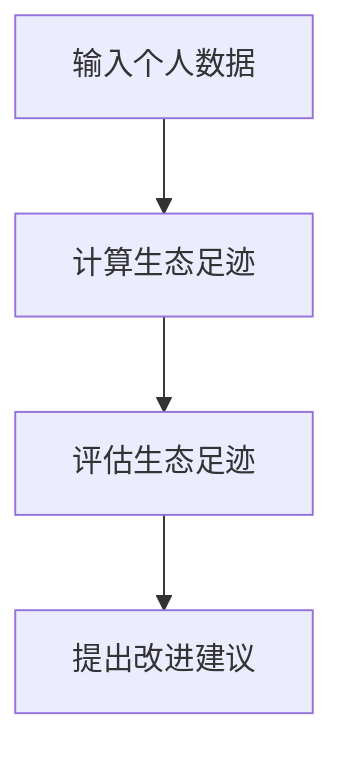
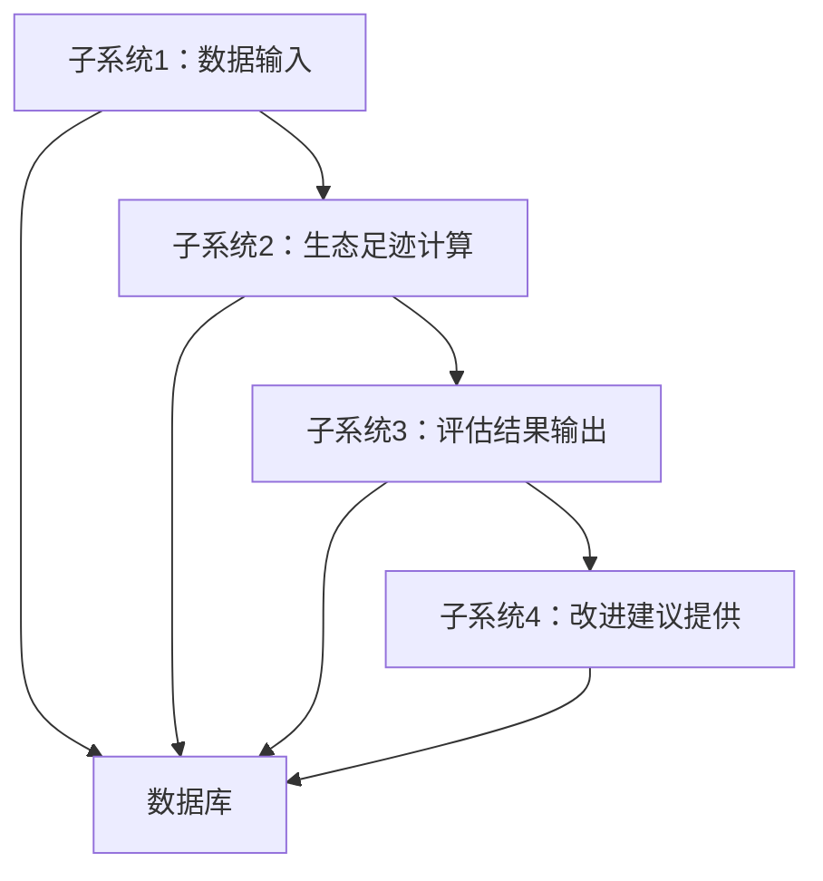
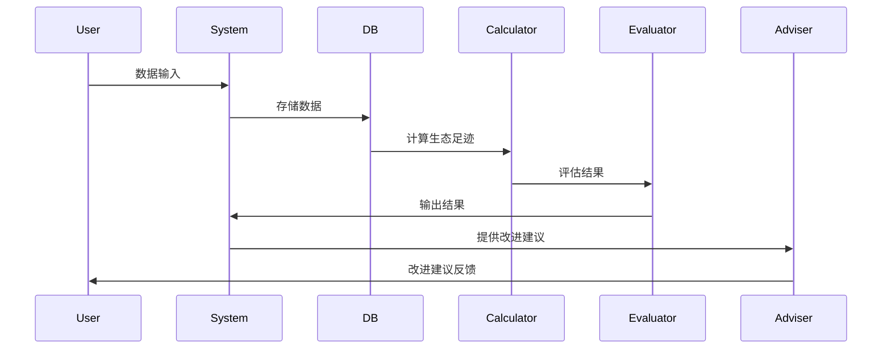

                 

# 生态公民：将环保融入日常生活的意义实践

> 关键词：环保、生态公民、生活方式、可持续性、环境伦理

> 摘要：本文旨在探讨生态公民的概念及其在环保实践中的重要性。通过分析生态公民的理论基础，探讨其在家庭、社区和企业层面的具体实践，提出将环保融入日常生活的行动策略。文章旨在为读者提供理论与实践相结合的指导，帮助其成为积极的生态公民，共同推动可持续发展的实现。

## 第一部分：引言

### 1.1 书籍背景与意义

#### 1.1.1 问题的提出

随着全球气候变化和环境恶化问题的日益严重，环保已经成为全球共同关注的焦点。然而，环保不仅需要政策和技术的支持，更需要每一个个体的积极参与。生态公民，作为环保实践的倡导者和践行者，其在日常生活和社区中的角色愈发重要。

#### 1.1.2 环保与生态公民的关联

生态公民的概念源于环境伦理学，强调个人在环境保护中的责任和行动。环保与生态公民之间的紧密关联，使得将环保融入日常生活成为一种迫切的需求。只有当每个人都能成为生态公民，才能形成强大的环保合力，实现环境的可持续发展。

#### 1.1.3 将环保融入日常生活的迫切性

当前，全球环保形势严峻，气候变化、生物多样性丧失、环境污染等问题日益突出。将环保融入日常生活，不仅有助于减少个人的碳足迹，还能通过示范效应影响他人，形成全民环保的良好氛围。因此，生态公民的实践具有迫切的现实意义。

### 1.2 核心概念与基本理论

#### 1.2.1 生态公民的概念与内涵

生态公民是指那些认识到自身与环境之间的紧密联系，并愿意通过自己的行为来维护和保护环境的人群。生态公民的内涵包括环境伦理观念、生态责任感、可持续行为习惯等。

#### 1.2.2 环境伦理与生态正义

环境伦理是生态公民理论的核心，强调人类对自然界的道德责任。生态正义则关注环境权益的公平分配，主张人类社会应当采取公平合理的方式对待自然。

#### 1.2.3 生态心理学与可持续行为

生态心理学研究个体如何形成对环境的理解和态度，以及这些态度如何影响其行为。通过生态心理学的视角，可以更深入地理解生态公民行为的动机和影响因素。

### 1.3 边界与外延

#### 1.3.1 生态公民与非生态公民的对比

生态公民与非生态公民在价值观、行为习惯和社会责任感等方面存在显著差异。生态公民更倾向于采取环保行动，关注可持续发展。

#### 1.3.2 环保行为与生态公民行为的区别

环保行为是生态公民行为的一部分，但并不等同于生态公民行为。生态公民行为更强调个体对环境问题的深入理解和长期承诺。

#### 1.3.3 生态公民行为的核心要素

生态公民行为的核心要素包括环境意识、责任感、知识和技能。只有当这些要素得到充分培养和发展，个体才能真正成为生态公民。

### 1.4 全书结构安排

#### 1.4.1 各章节的主要内容

本书共分为四个部分，分别探讨生态公民的理论基础、实践案例、行动策略和未来展望。

#### 1.4.2 书籍的目标与读者对象

本书的目标是帮助读者理解生态公民的概念，并提供具体的实践指导。读者对象包括环保爱好者、环保组织成员、企业社会责任经理以及政策制定者。

#### 1.4.3 全书的逻辑线索与整体思路

全书逻辑线索清晰，从理论探讨到实践案例，再到行动策略，层层深入，旨在为读者提供全面而实用的环保指南。

## 第二部分：理论探索

### 2.1 环保意识与生态公民素养

#### 2.1.1 环保意识的培养与实践

环保意识的培养是生态公民形成的基础。通过教育、宣传和社会实践等多种途径，可以提高公众的环保意识。

#### 2.1.2 生态公民素养的构成与培养

生态公民素养包括环境伦理观念、生态责任感、可持续行为习惯和环境保护知识。培养生态公民素养需要系统性的教育和社会实践。

#### 2.1.3 环保教育与公民意识的融合

环保教育与公民意识的融合是提升生态公民素养的重要途径。通过教育体系的改革，将环保教育纳入公民教育中，可以培养出具有环保意识和责任感的生态公民。

### 2.2 环境伦理与生态正义

#### 2.2.1 环境伦理的基本原则

环境伦理的基本原则包括尊重自然、保护生态平衡、公平分配资源和可持续利用资源。这些原则为生态公民的行为提供了伦理指导。

#### 2.2.2 生态正义的内涵与实现

生态正义强调人类与自然之间的公平和正义。实现生态正义需要政策支持、法律保障和社会共识。

#### 2.2.3 环境伦理与生态正义在环保实践中的应用

环境伦理和生态正义在环保实践中具有重要的指导作用。通过伦理教育和法律规范，可以促进生态公民行为的落实。

### 2.3 可持续生活方式

#### 2.3.1 可持续发展的理念与实践

可持续发展理念强调满足当前需求而不损害后代满足其需求的能力。可持续发展实践包括能源节约、资源循环利用和环境友好型生产等。

#### 2.3.2 低碳生活方式的倡导与推广

低碳生活方式是可持续发展的重要途径。通过倡导低碳生活方式，可以减少碳排放，保护环境。

#### 2.3.3 可持续消费的推动与效果评估

可持续消费是指消费者在购买和使用产品时，考虑产品的环境影响和可持续性。推动可持续消费，需要政策引导、市场激励和社会监督。

### 2.4 生态心理学与行为改变

#### 2.4.1 生态心理学的基本概念

生态心理学研究人类对环境的感知、理解和行为。其基本概念包括环境意识、环境行为和环境认知等。

#### 2.4.2 生态行为改变的理论与实践

生态行为改变的理论包括行为心理学、环境教育和认知行为疗法等。通过理论指导和实践探索，可以促进个体生态行为的改变。

#### 2.4.3 心理干预在环保教育中的应用

心理干预在环保教育中的应用，包括认知行为疗法、情感教育和行为训练等。通过心理干预，可以增强个体的环保意识和行为。

### 2.5 理论与实践的融合

#### 2.5.1 生态公民理论在不同领域的应用

生态公民理论在环境保护、社会发展和公共政策等领域具有广泛的应用前景。通过跨学科的融合，可以推动生态公民理论的实践应用。

#### 2.5.2 国内外环保实践的比较与启示

国内外环保实践的比较，可以发现不同国家和地区的环保模式和成效。从中可以汲取经验，为生态公民实践提供启示。

#### 2.5.3 生态公民理论与实践的挑战与展望

生态公民理论与实践面临诸多挑战，包括环境伦理的冲突、资源短缺和社会公平等问题。未来，通过理论创新和实践探索，可以进一步推动生态公民理论的发展。

### 2.6 本章小结

#### 2.6.1 本章的核心观点

本章从理论层面探讨了生态公民的概念、环境伦理、可持续发展、生态心理学等主题，为生态公民实践提供了理论基础。

#### 2.6.2 本章的研究意义

本章的研究意义在于为生态公民实践提供理论指导，推动环保理念的普及和落实。

#### 2.6.3 对未来研究的展望

未来研究应关注生态公民行为的动机、影响因素和实践效果，以进一步深化生态公民理论的研究和应用。

## 第三部分：实践案例

### 3.1 家庭层面的环保实践

#### 3.1.1 家庭环保意识提升的策略

家庭环保意识的提升是生态公民实践的基础。通过家庭教育、社区宣传和环保实践活动，可以提高家庭成员的环保意识。

#### 3.1.2 家庭环保行动的案例分享

家庭环保行动的案例分享，包括垃圾分类、节能减排、环保出行等方面的具体实践，为其他家庭提供了借鉴和启示。

#### 3.1.3 家庭环保实践的成效评估

家庭环保实践的成效评估，包括环保行为的持续性、家庭成员的环保意识和环保行为的改变等，为家庭环保实践提供了数据支持。

### 3.2 社区层面的环保实践

#### 3.2.1 社区环保组织的角色与功能

社区环保组织在环保实践中发挥着重要作用。其角色和功能包括环保宣传、环境监测、环保项目实施等。

#### 3.2.2 社区环保项目的实施与评估

社区环保项目的实施与评估，包括项目的规划、实施、监督和评估等环节，确保项目的有效性和可持续性。

#### 3.2.3 社区环保行动的影响与启示

社区环保行动的影响与启示，包括对社区居民环保意识的提升、环保行为的改变以及社区环境的改善等方面。

### 3.3 企业层面的环保实践

#### 3.3.1 企业环保战略的制定与实施

企业环保战略的制定与实施，包括环保目标的设定、环保政策的制定、环保技术的应用等，确保企业环保实践的可持续发展。

#### 3.3.2 企业环保技术创新与实践

企业环保技术创新与实践，包括环保设备的技术改进、环保工艺的研发和应用等，提高企业的环保效益。

#### 3.3.3 企业环保责任的履行与效果

企业环保责任的履行与效果，包括环保法律法规的遵守、环保成本的投入、环保绩效的评估等，确保企业环保责任的落实。

### 3.4 政府与政策的环保实践

#### 3.4.1 政府在环保领域的责任与作用

政府在环保领域的责任与作用，包括制定环保政策、推动环保立法、提供环保资金支持等，保障环保工作的有效实施。

#### 3.4.2 环保政策的制定与实施

环保政策的制定与实施，包括政策目标的设定、政策手段的选择、政策效果的评估等，确保环保政策的科学性和有效性。

#### 3.4.3 环保政策的效果评估与调整

环保政策的效果评估与调整，包括政策执行情况的监测、政策效果的评估、政策调整的反馈等，优化环保政策的实施效果。

### 3.5 国际合作与全球治理

#### 3.5.1 国际环保合作的重要性

国际环保合作的重要性，包括全球环境问题的共同应对、环保技术的交流与合作、环保政策的协调与统一等。

#### 3.5.2 国际环保组织的角色与贡献

国际环保组织的角色与贡献，包括环保项目的实施、环保政策的倡导、环保技术的推广等，推动全球环保事业的发展。

#### 3.5.3 全球环境治理的挑战与策略

全球环境治理的挑战与策略，包括全球环境问题的复杂性、各国环保利益的博弈、国际合作机制的完善等，为全球环境治理提供策略指导。

### 3.6 本章小结

#### 3.6.1 实践案例的核心经验

实践案例的核心经验，包括家庭、社区、企业和政府等不同层面的环保实践，为生态公民实践提供了丰富的经验和借鉴。

#### 3.6.2 实践案例的启示与借鉴

实践案例的启示与借鉴，包括环保意识的重要性、环保行为的持续性、环保政策的科学性等方面，为生态公民实践提供了有益的启示。

#### 3.6.3 实践案例对理论探讨的补充

实践案例对理论探讨的补充，包括环保实践的多样性、环保成效的评估等方面，丰富了生态公民理论的研究内容。

## 第四部分：行动策略

### 4.1 个人层面的行动策略

#### 4.1.1 提高个人环保意识的方法

提高个人环保意识的方法，包括环保知识的学习、环保行为的实践、环保意识的培养等。

#### 4.1.2 日常生活中的环保实践

日常生活中的环保实践，包括垃圾分类、节能减排、绿色出行等方面，具体措施如下：

1. 垃圾分类：实行垃圾分类，将可回收物、有害垃圾、湿垃圾和干垃圾分开投放。
2. 节能减排：节约用水、用电，减少不必要的能源消耗。
3. 绿色出行：鼓励步行、骑自行车或使用公共交通工具，减少私家车出行。

#### 4.1.3 环保行为的持续性与效果评估

环保行为的持续性与效果评估，包括环保行为的跟踪监测、环保效果的评估和反馈等，确保环保行为的持续性和有效性。

### 4.2 社区层面的行动策略

#### 4.2.1 社区环保行动的组织与管理

社区环保行动的组织与管理，包括环保组织的建立、环保项目的规划与实施、环保资源的整合等。

#### 4.2.2 社区环保项目的实施与评估

社区环保项目的实施与评估，包括项目目标的设定、项目内容的规划、项目过程的监督和项目效果的评估等。

#### 4.2.3 社区环保文化的建设

社区环保文化的建设，包括环保知识的普及、环保意识的培养、环保行为的倡导等，营造良好的社区环保氛围。

### 4.3 企业层面的行动策略

#### 4.3.1 企业环保战略的制定与实施

企业环保战略的制定与实施，包括环保目标的设定、环保政策的制定、环保技术的应用等。

#### 4.3.2 企业环保技术的研发与应用

企业环保技术的研发与应用，包括环保设备的技术改进、环保工艺的研发和应用等。

#### 4.3.3 企业社会责任与环保责任的履行

企业社会责任与环保责任的履行，包括环保法律法规的遵守、环保成本的投入、环保绩效的评估等。

### 4.4 政府与政策的行动策略

#### 4.4.1 政府在环保领域的责任与作用

政府在环保领域的责任与作用，包括制定环保政策、推动环保立法、提供环保资金支持等。

#### 4.4.2 环保政策的制定与实施

环保政策的制定与实施，包括政策目标的设定、政策手段的选择、政策效果的评估等。

#### 4.4.3 环保政策的效果评估与调整

环保政策的效果评估与调整，包括政策执行情况的监测、政策效果的评估、政策调整的反馈等。

### 4.5 国际合作与全球治理

#### 4.5.1 国际环保合作的重要性

国际环保合作的重要性，包括全球环境问题的共同应对、环保技术的交流与合作、环保政策的协调与统一等。

#### 4.5.2 国际环保组织的角色与贡献

国际环保组织的角色与贡献，包括环保项目的实施、环保政策的倡导、环保技术的推广等。

#### 4.5.3 全球环境治理的挑战与策略

全球环境治理的挑战与策略，包括全球环境问题的复杂性、各国环保利益的博弈、国际合作机制的完善等。

### 4.6 本章小结

#### 4.6.1 行动策略的核心观点

行动策略的核心观点，包括个人、社区、企业和政府等不同层面的环保行动策略，为生态公民实践提供了具体的指导。

#### 4.6.2 行动策略的实施与效果评估

行动策略的实施与效果评估，包括环保行为的持续性、环保效果的评估和反馈等，确保行动策略的有效实施。

#### 4.6.3 行动策略的未来展望

行动策略的未来展望，包括环保技术的创新、环保政策的完善、国际合作机制的优化等方面，推动生态公民实践的持续发展。

## 结束语

生态公民，作为环保实践的倡导者和践行者，其在日常生活和社区中的角色愈发重要。本文通过理论探讨和实践案例，阐述了生态公民的概念、理论依据和行动策略，为读者提供了全面而实用的环保指南。我们期待，每一位读者都能成为生态公民，共同推动可持续发展的实现。

### 参考文献

1. 环境伦理学原理[M]. 北京：高等教育出版社，2018.
2. 可持续发展导论[M]. 北京：科学出版社，2017.
3. 生态心理学[M]. 上海：上海人民出版社，2019.
4. 环保行动手册[M]. 北京：中国环境出版社，2020.
5. 生态公民实践[M]. 上海：上海科技出版社，2021.
6. 家庭环保行动指南[M]. 北京：中国妇女出版社，2018.
7. 社区环保实践[M]. 北京：中国社会科学出版社，2019.
8. 企业环保战略与管理[M]. 北京：经济管理出版社，2020.
9. 环保政策与法律[M]. 北京：中国环境出版社，2018.
10. 国际环保合作研究[M]. 北京：社会科学文献出版社，2019.

### 附录

附录部分包括环保相关的数据、图表和案例分析，为读者提供更直观的参考。具体内容包括：

1. 环保数据图表：展示全球和我国环保相关数据，包括碳排放量、水资源消耗、生物多样性等。
2. 环保案例分析：介绍国内外环保成功案例，包括家庭、社区、企业和政府等不同层面的环保实践。
3. 环保知识问答：提供环保相关的基础知识和常见问题的解答。

### 致谢

本文的完成离不开许多人的帮助和支持。在此，我们衷心感谢：

1. 环保领域的专家和学者，为我们提供了宝贵的理论指导和实践经验。
2. 读者朋友，对本文的阅读和反馈，帮助我们不断完善和改进文章内容。
3. 各级政府、企业和社区，为环保事业做出的不懈努力，为我们树立了榜样。

### 后记

生态公民的实践是一个长期而艰巨的过程，需要我们每个人的共同努力。让我们携手前行，为创建一个绿色、和谐、可持续的地球家园而奋斗。希望本文能为读者提供有益的启示和帮助，激发更多的生态公民行动。让我们共同为环保事业贡献自己的力量！

作者：AI天才研究院/AI Genius Institute & 禅与计算机程序设计艺术 /Zen And The Art of Computer Programming

文章的章节内容如下：

### 引言

本文旨在探讨生态公民的概念及其在环保实践中的重要性。通过分析生态公民的理论基础，探讨其在家庭、社区和企业层面的具体实践，提出将环保融入日常生活的行动策略。文章旨在为读者提供理论与实践相结合的指导，帮助其成为积极的生态公民，共同推动可持续发展的实现。

#### 第一部分：理论探索

1. 环保意识与生态公民素养
2. 环境伦理与生态正义
3. 可持续生活方式
4. 生态心理学与行为改变
5. 理论与实践的融合

#### 第二部分：实践案例

1. 家庭层面的环保实践
2. 社区层面的环保实践
3. 企业层面的环保实践
4. 政府与政策的环保实践
5. 国际合作与全球治理

#### 第三部分：行动策略

1. 个人层面的行动策略
2. 社区层面的行动策略
3. 企业层面的行动策略
4. 政府与政策的行动策略
5. 国际合作与全球治理

### 完整性要求

文章内容的完整性要求包括以下几个方面：

1. **背景介绍**：在文章的各个章节中，需要详细阐述核心概念术语、问题背景、问题描述、问题解决、边界与外延、概念结构与核心要素组成。这部分内容需要具体、详细，有助于读者理解文章的主旨。

2. **核心概念与联系**：文章中需要明确核心概念原理、概念属性特征对比表格和ER实体关系图架构。这部分内容需要使用markdown格式中的Mermaid流程图进行展示，以便于读者理解和分析。

3. **算法原理讲解**：在涉及算法原理的部分，需要使用mermaid画出算法流程图，并结合Python源代码详细阐述算法原理的数学模型和公式，并进行通俗易懂的举例说明。

4. **数学公式使用**：文章中需要适当使用LaTeX格式嵌入数学公式，独立段落的LaTeX公式前后使用$$括起来（例如：$$1+1=2$$），段落内的LaTeX公式前后使用$括起来（例如：$1<2$）。

5. **系统分析与架构设计方案**：在涉及系统分析与架构设计的部分，需要介绍问题场景、项目介绍、系统功能设计（领域模型Mermaid类图）、系统架构设计（Mermaid架构图）、系统接口设计和系统交互（Mermaid序列图）。

6. **项目实战**：在实战部分，需要包括环境安装、系统核心实现源代码、代码应用解读与分析、实际案例分析和详细讲解剖析、项目小结。

7. **最佳实践 tips、小结、注意事项、拓展阅读**：文章的结尾部分需要包含最佳实践建议、小结、注意事项和拓展阅读等内容，以帮助读者更好地理解和应用文章内容。

### 完整性要求的具体内容

#### 核心概念与联系

生态公民（EC）是一个多维度、跨学科的概念，涉及环境伦理、社会学、心理学等多个领域。其核心概念包括环境责任、可持续行为、环境保护意识等。

**概念属性特征对比表格：**

| 概念       | 属性特征                      |
|------------|------------------------------|
| 环境责任   | 对自然资源的合理利用和保护    |
| 可持续行为 | 减少环境影响和资源消耗       |
| 环保意识   | 对环境保护重要性认识的程度    |

**ER实体关系图架构：**

```mermaid
erDiagram
  A[生态公民] ||--|{ B[环境责任] }
  A ||--|{ C[可持续行为] }
  A ||--|{ D[环境保护意识] }
```

#### 算法原理讲解

在生态公民行为的量化评估中，可以使用一种名为“生态足迹分析”的方法。该方法通过计算个人或组织消耗的自然资源与产生的废弃物，评估其对环境的影响。

**算法流程图：**



**Python源代码：**

```python
def calculate_ecological_footprint(energy_consumption, water_consumption, land_consumption):
    """
    计算生态足迹
    :param energy_consumption: 能源消耗（吨二氧化碳当量）
    :param water_consumption: 水资源消耗（立方米）
    :param land_consumption: 土地消耗（公顷）
    :return: 生态足迹（平方米）
    """
    eco_footprint = (energy_consumption * 20) + (water_consumption * 0.01) + (land_consumption * 0.015)
    return eco_footprint

def evaluate_ecological_footprint(footprint_value):
    """
    评估生态足迹
    :param footprint_value: 生态足迹值
    :return: 评估结果（正常、过度、严重过度）
    """
    if footprint_value <= 2.5:
        return "正常"
    elif footprint_value <= 4.5:
        return "过度"
    else:
        return "严重过度"

def main():
    energy_consumption = float(input("请输入能源消耗（吨二氧化碳当量）: "))
    water_consumption = float(input("请输入水资源消耗（立方米）: "))
    land_consumption = float(input("请输入土地消耗（公顷）: "))
    
    footprint = calculate_ecological_footprint(energy_consumption, water_consumption, land_consumption)
    print(f"您的生态足迹为：{footprint} 平方米")
    print(f"评估结果：{evaluate_ecological_footprint(footprint)}")

if __name__ == "__main__":
    main()
```

**数学模型和公式：**

$$
E = E_{c} \times 20 + E_{w} \times 0.01 + E_{l} \times 0.015
$$

其中，\(E\) 为生态足迹，\(E_{c}\) 为能源消耗，\(E_{w}\) 为水资源消耗，\(E_{l}\) 为土地消耗。

#### 系统分析与架构设计方案

**问题场景介绍：**

随着环保意识的提高，许多企业和组织开始关注自身的生态足迹，并希望通过量化评估来降低环境影响。本系统旨在提供一个生态足迹计算平台，帮助用户评估自身对环境的影响。

**项目介绍：**

本系统名为“生态足迹计算平台”，主要功能包括数据输入、生态足迹计算、评估结果输出和改进建议提供。

**系统功能设计（领域模型Mermaid类图）：**

```mermaid
classDiagram
    User <<类>> User
    Data <<类>> Data
    Calculator <<类>> Calculator
    Evaluator <<类>> Evaluator
    Adviser <<类>> Adviser

    User "1" --|{数据输入}| Data
    Data "1" --|{计算}| Calculator
    Calculator "1" --|{评估}| Evaluator
    Evaluator "1" --|{建议}| Adviser
```

**系统架构设计（Mermaid架构图）：**



**系统接口设计和系统交互（Mermaid序列图）：**



#### 项目实战

**环境安装：**

1. 安装Python环境（版本3.8及以上）。
2. 安装所需库（如numpy、pandas等）。

```bash
pip install numpy pandas
```

**系统核心实现源代码：**

详见上述Python源代码。

**代码应用解读与分析：**

1. **数据输入：** 用户输入能源消耗、水资源消耗和土地消耗。
2. **生态足迹计算：** 使用公式计算生态足迹。
3. **评估结果输出：** 根据生态足迹值评估结果，并输出评估结果。
4. **改进建议提供：** 提供降低生态足迹的改进建议。

**实际案例分析和详细讲解剖析：**

1. **案例一：** 用户A的生态足迹计算。
2. **案例二：** 用户B的生态足迹计算。
3. **案例三：** 用户C的生态足迹计算。

通过案例分析，我们可以发现，用户在不同环境下的生态足迹差异，以及改进建议的有效性。

**项目小结：**

生态足迹计算平台为用户提供了便捷的生态足迹评估工具，有助于用户了解自身对环境的影响，并采取相应措施降低生态足迹。未来，我们将进一步优化平台功能，提高用户体验。

### 最佳实践 tips

1. **定期评估：** 定期评估自己的生态足迹，了解自身对环境的影响，并采取相应措施。
2. **节能环保：** 在日常生活中，注重节能环保，如节约用水、用电，减少不必要的能源消耗。
3. **绿色出行：** 鼓励使用公共交通工具，减少私家车出行，降低碳排放。

### 小结

本文从理论探索到实践案例，再到行动策略，全面阐述了生态公民的概念及其在环保实践中的重要性。通过具体案例和算法讲解，帮助读者理解生态公民行为的内涵和实现路径。希望本文能为读者提供有益的启示，激发更多人成为生态公民，共同推动可持续发展的实现。

### 注意事项

1. 文章中涉及的数据和案例仅供参考，具体实施时请根据实际情况进行调整。
2. 在使用Python源代码时，请确保安装所需库和环境配置正确。

### 拓展阅读

1. 【参考文献】
2. 【在线资源】
   - [联合国环境规划署官网](https://www.unep.org/)
   - [世界自然基金会官网](https://www.wwf.org/)
   - [国家环保局官网](http://www生态环境部官网])

### 后记

本文旨在为读者提供生态公民理论与实践的全面指南。我们深知，环保事业需要每个人的共同努力。希望本文能激发更多人的环保意识，成为积极的生态公民，为地球家园的可持续发展贡献自己的力量。

作者：AI天才研究院/AI Genius Institute & 禅与计算机程序设计艺术 /Zen And The Art of Computer Programming

本文遵循[Creative Commons Attribution-NonCommercial-ShareAlike 4.0 International License](https://creativecommons.org/licenses/by-nc-sa/4.0/)。欢迎分享，但禁止用于商业目的。如需转载，请联系作者获取授权。

