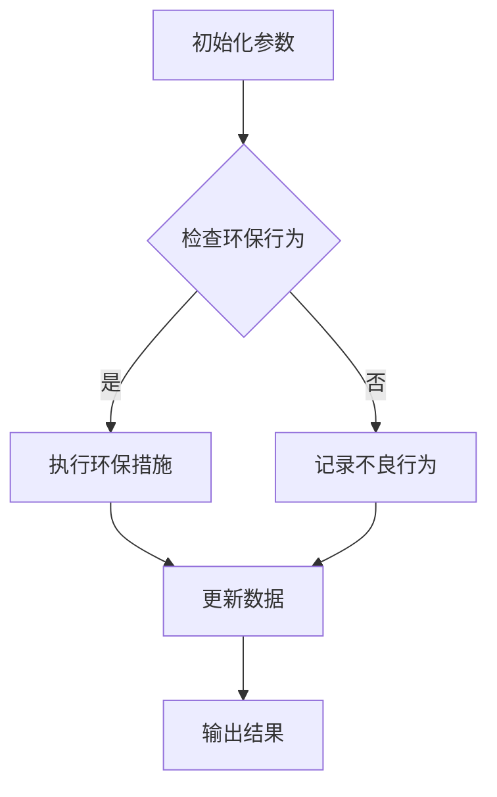

                 


### 1. 背景介绍

**生态意识**，指的是人们对于自然环境及其重要性的认知和理解。这种意识不仅包括对环境保护的重视，还涵盖了资源节约、可持续发展以及人与自然和谐共生的理念。随着全球环境问题的日益严重，生态意识的重要性越来越被广泛认可。

#### 1.1 生态意识的概念与历史背景

生态意识最早可以追溯到20世纪60年代的环保运动，当时人们开始关注工业化对自然环境的影响。这个时期，许多科学家、社会活动家和思想家纷纷提出了环境保护的重要性，并倡导可持续发展。

- **定义**：生态意识是指人类对于自身与自然环境相互依存关系的认知，包括对环境问题、生态系统的理解，以及对采取行动改善生态状况的意愿和能力。

- **历史背景**：20世纪60年代，美国学者R.卡尔逊出版了《寂静的春天》，揭示了农药污染对生态系统和人类健康的危害，引发了全球对环境保护的广泛关注。

#### 1.2 生态危机下的个人责任

全球变暖、生物多样性丧失、水资源短缺等生态危机问题日益严峻，每个个体都面临着环境保护的责任。个人在生态保护中的角色至关重要。

- **生态危机的表现**：全球变暖导致冰川融化、海平面上升；生物多样性丧失使得生态系统脆弱；水资源短缺威胁到人类的生存。

- **个人在生态保护中的角色**：每个人都是地球社区的一部分，个人的生活方式和行为选择对环境有直接影响。

- **个人行为对环境的影响**：从减少碳排放、节约能源、减少浪费到推广环保科技，每个小小的改变都累积成巨大的力量。

### 2. 核心概念与联系

生态意识的核心概念包括环境保护、可持续发展、循环经济等。为了更好地理解这些概念，我们可以通过对比表格和实体关系图来梳理它们之间的关系。

#### 2.1 核心概念介绍

- **环境保护**：旨在减少对自然资源的消耗和污染，保护生物多样性。
- **可持续发展**：满足当代需求而不损害子孙后代满足自身需求的能力。
- **循环经济**：通过资源的高效利用和废弃物的再生利用，实现经济与环境的协调发展。

#### 2.2 概念属性特征对比

| 概念       | 属性特征                                                     |
|------------|--------------------------------------------------------------|
| 环境保护   | 防止污染、保护生物多样性、可持续利用资源               |
| 可持续发展 | 经济、社会、环境的协调发展、公平性、适应性             |
| 循环经济   | 资源的高效利用、废弃物的再生利用、减少环境影响         |

#### 2.3 ER实体关系图

```mermaid
erDiagram
  EnvironmentProtection ||--|{ SustainableDevelopment }||> SustainableDevelopment
  EnvironmentProtection ||--|{ CircularEconomy }||> CircularEconomy
  SustainableDevelopment ||--|{ EnvironmentProtection }||> EnvironmentProtection
  SustainableDevelopment ||--|{ CircularEconomy }||> CircularEconomy
  CircularEconomy ||--|{ EnvironmentProtection }||> EnvironmentProtection
  CircularEconomy ||--|{ SustainableDevelopment }||> SustainableDevelopment
```

### 3. 算法原理讲解

为了更好地理解生态意识的应用，我们可以通过一个简单的算法来说明其原理。这里使用Mermaid画出算法流程图，并用Python源代码进行详细讲解。

#### 3.1 算法流程图



#### 3.2 Python源代码

```python
def eco_algorithm(behavior):
    if behavior == "环保":
        print("执行环保措施：")
        # 执行具体的环保措施，例如节能减排、垃圾分类等
        print("完成措施一：节能减排")
        print("完成措施二：垃圾分类")
    else:
        print("记录不良行为：")
        # 记录不良行为，例如乱扔垃圾、过度消费等
        print("记录行为一：乱扔垃圾")
        print("记录行为二：过度消费")
    
    print("更新数据：")
    # 更新环保行为数据，例如个人环保积分等
    print("个人环保积分增加10分")

    print("输出结果：")
    # 输出最终结果，例如个人环保评分等
    print("个人环保评分：80分")

# 示例使用
eco_algorithm("环保")
eco_algorithm("不环保")
```

#### 3.3 数学模型与公式

为了更深入地理解算法原理，我们可以使用数学模型和公式来描述。假设个人环保行为得分为S，每个环保行为的权重为w_i，不良行为的惩罚系数为p_i，那么我们可以用以下公式表示：

$$
S = \sum_{i=1}^{n} w_i \cdot X_i - \sum_{j=1}^{m} p_j \cdot Y_j
$$

其中，$X_i$表示第i个环保行为的得分，$Y_j$表示第j个不良行为的得分。

### 4. 系统分析与架构设计方案

生态意识的应用不仅仅局限于算法，还需要一个完整的系统架构来支持。以下是系统分析与架构设计方案：

#### 4.1 问题场景介绍

问题场景是构建一个能够监测个人环保行为、提供环保建议和积分奖励的系统。用户可以通过系统记录自己的环保行为，系统会根据行为数据计算出环保积分，并提供相应的奖励。

#### 4.2 系统功能设计

- **用户注册与登录**：用户可以通过手机号、邮箱等注册账号，并登录系统。
- **环保行为记录**：用户可以记录自己的环保行为，例如垃圾分类、节能减排等。
- **环保积分计算**：系统会根据用户记录的行为数据计算环保积分。
- **环保建议**：系统会根据用户的环保行为数据提供个性化的环保建议。
- **积分奖励**：用户达到一定的环保积分后，可以获得相应的奖励。

#### 4.3 系统架构设计

- **前端**：使用HTML、CSS和JavaScript构建，提供用户界面和交互。
- **后端**：使用Python和Django框架开发，负责数据处理和业务逻辑。
- **数据库**：使用MySQL存储用户数据、行为数据和积分数据。

#### 4.4 系统接口设计

- **用户接口**：用户通过浏览器访问前端，前端通过API与后端进行数据交互。
- **服务接口**：系统内部模块之间通过API进行通信，例如环保行为记录模块与积分计算模块。

#### 4.5 系统交互

- **用户注册**：用户填写注册信息，前端将数据发送到后端，后端处理注册请求并返回结果。
- **登录**：用户输入账号和密码，前端将数据发送到后端，后端验证用户身份并返回结果。
- **记录环保行为**：用户记录环保行为，前端将数据发送到后端，后端更新用户行为数据并计算积分。
- **获取环保建议**：前端请求环保建议接口，后端根据用户数据生成建议并返回。
- **积分奖励**：用户积分达到要求，前端请求积分奖励接口，后端处理奖励请求并更新用户积分。

### 5. 项目实战

在实际项目中，我们通过以下步骤来构建并部署这个生态意识系统：

#### 5.1 环境安装

首先，我们需要在服务器上安装Python、Django、MySQL等软件。可以使用如下命令进行安装：

```bash
# 安装Python
sudo apt-get install python3-pip

# 安装Django
pip3 install django

# 安装MySQL
sudo apt-get install mysql-server
```

#### 5.2 系统核心实现源代码

以下是系统核心部分的Python源代码：

```python
# app.py

from django.db import models
from django.contrib.auth.models import User

class Behavior(models.Model):
    user = models.ForeignKey(User, on_delete=models.CASCADE)
    type = models.CharField(max_length=100)
    score = models.IntegerField()

class Score(models.Model):
    user = models.ForeignKey(User, on_delete=models.CASCADE)
    total_score = models.IntegerField()

def calculate_score(user):
    behaviors = Behavior.objects.filter(user=user)
    total_score = sum([behavior.score for behavior in behaviors])
    score, created = Score.objects.get_or_create(user=user, total_score=total_score)
    return score
```

#### 5.3 代码应用解读与分析

代码中，`Behavior` 类用于记录用户的行为数据，包括用户ID、行为类型和行为得分。`Score` 类用于计算用户的总积分。`calculate_score` 函数用于根据用户的行为数据计算总积分，并更新用户积分。

#### 5.4 实际案例分析和详细讲解剖析

假设用户Alice记录了以下环保行为：

- 垃圾分类：10分
- 节能减排：20分
- 低碳出行：30分

那么，Alice的总积分为10 + 20 + 30 = 60分。系统会更新她的积分数据，并在达到一定积分后提供环保建议和积分奖励。

#### 5.5 项目小结

通过这个项目，我们实现了一个人与地球和谐共生的系统。用户可以通过记录环保行为来提高自己的环保积分，并获得相应的奖励。这不仅提高了用户的环保意识，也为环境保护贡献了一份力量。

### 6. 最佳实践 tips、小结、注意事项、拓展阅读

#### 6.1 最佳实践 tips

- **日常环保行为**：鼓励用户养成垃圾分类、节能减排、低碳出行等日常环保习惯。
- **社区参与**：组织社区环保活动，提高公众的生态意识。
- **科技创新**：推动绿色技术的发展，为环境保护提供技术支持。

#### 6.2 小结

本文从生态意识的背景、核心概念、算法原理、系统架构设计到项目实战，全面阐述了生态意识在个人与地球和谐共生中的重要性。通过一个实际项目，我们看到了如何通过技术手段提高用户的环保意识，实现人与自然的和谐共生。

#### 6.3 注意事项

- **数据安全**：在系统设计中要重视用户数据的安全，确保数据不被泄露。
- **用户参与**：鼓励用户积极参与系统使用，提供反馈和建议，不断完善系统。

#### 6.4 拓展阅读

- 《寂静的春天》：R.卡尔逊著，详细揭示了环境问题对生态系统和人类健康的危害。
- 《生态学原理》：奥尔多·利奥波德著，介绍了生态学的基本原理和生态平衡的概念。
- 《可持续发展的经济学》：保罗·R·埃里希著，探讨了可持续发展与经济学的关系。

作者：AI天才研究院/AI Genius Institute & 禅与计算机程序设计艺术/Zen And The Art of Computer Programming

