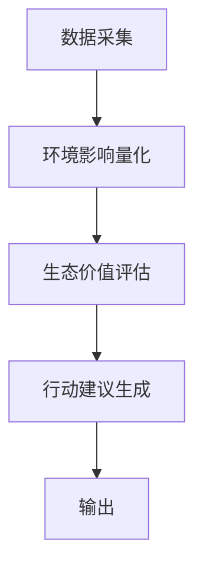
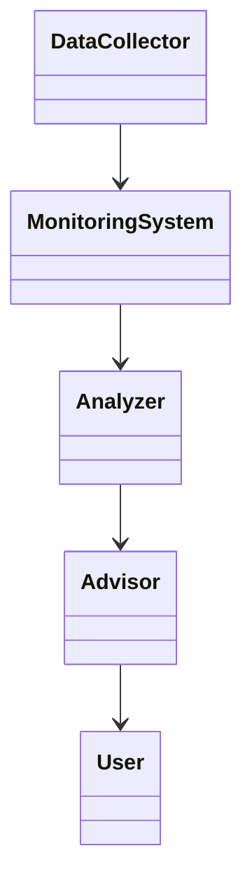
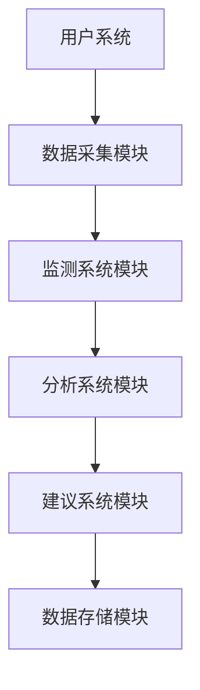
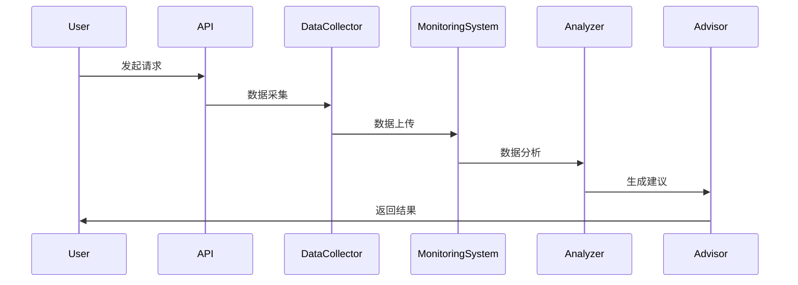

                 

# 生态意识：重新定义人与自然的关系

## 关键词：生态意识、人与自然关系、可持续发展、环保行动、生态哲学

### 摘要

随着全球生态环境的恶化，重新定义人与自然的关系成为当务之急。本文旨在探讨生态意识的概念及其在现代社会中的重要性，分析生态意识与人类活动对自然环境的影响之间的关系。通过对比生态意识与传统环保观念，探讨如何构建基于生态意识的可持续发展模式，并提出具体的实施方案。本文的核心思想是：生态意识是重新定义人与自然关系的理论基础，只有通过提升生态意识和采取环保行动，才能实现人类与自然的和谐共生。

## 第一部分：背景介绍

### 第1章：问题背景

### 1.1.1 问题背景

人类对自然环境的依赖和破坏日益加剧，环境问题成为全球关注的焦点。生态意识的缺失和生态危机的加剧，使得重新定义人与自然的关系变得迫在眉睫。生态意识是指在人类活动过程中，对自然环境的重要性和价值有深刻的认识，以及采取积极行动保护和改善环境的观念。

### 1.1.2 问题描述

在现代社会中，人类活动对自然环境造成了严重的影响，包括气候变化、水资源短缺、生物多样性丧失、土地退化等。这些问题不仅威胁到人类的生存和发展，也破坏了生态系统的平衡和稳定。因此，重新定义人与自然的关系，构建可持续发展的生态意识，成为解决这些问题的关键。

### 1.1.3 问题解决

解决人与自然关系的问题，需要从多个方面入手。首先，要加强生态教育的普及，提高公众的生态意识。其次，需要政府、企业和社会各界共同努力，制定和执行环保政策，推动绿色发展。此外，还需要创新生态技术，提高资源利用效率，减少环境污染。

### 1.1.4 边界与外延

生态意识的范畴广泛，包括生态哲学、生态经济学、生态伦理学、生态学等多个学科。在重新定义人与自然的关系时，需要考虑人类与自然之间的相互作用、人类活动的环境影响、生态系统的稳定性等多个方面。

### 第2章：核心概念

### 2.1 生态意识

生态意识是指人类对自然环境的重要性和价值有深刻的认识，以及采取积极行动保护和改善环境的观念。它包括对生态问题的认识、对生态价值的认同、对生态行动的践行等多个方面。

### 2.2 人与自然的关系

人与自然的关系是人类社会发展的基础，既包括人类对自然环境的依赖和利用，也包括人类对自然环境的保护和尊重。重新定义人与自然的关系，旨在实现人与自然的和谐共生。

### 2.3 可持续发展

可持续发展是指在满足当前需求的同时，不损害子孙后代满足其需求的能力。生态意识是可持续发展的重要基础，它强调人类活动与自然环境的协调发展。

### 第3章：概念属性特征对比表格

| 概念         | 属性特征                  | 对比                      |
| ------------ | ----------------------- | ----------------------- |
| 生态意识     | 对自然价值的认同、环保行动 | 与传统环保观念的区别      |
| 人与自然的关系 | 依赖、利用、保护、尊重   | 与传统人类中心主义的区别 |
| 可持续发展   | 当前与未来的平衡         | 与传统发展观念的区别      |

### 第4章：ER实体关系图架构

```mermaid
erDiagram
  人 --> 环境
  人 ||--|{ 生态意识 }
  环境 ||--|{ 可持续发展 }
  人 ||--|{ 行动 }
```

## 第二部分：核心概念与联系

### 第5章：生态意识原理

### 5.1 生态意识的定义

生态意识是一种对自然环境和生态系统有深刻理解的态度和认知。它强调人类活动对自然环境的影响，并倡导通过环保行动实现人与自然的和谐共生。

### 5.2 生态意识的属性特征

- 对自然环境的关注：生态意识要求人们关注自然环境的变化和生态系统的健康状况。
- 环保行动的实践：生态意识不仅是一种观念，更要求人们通过具体行动来保护环境，如减少污染、节约资源、保护生物多样性等。
- 道德责任：生态意识强调人类对自然环境有道德责任，应当尊重和保护自然环境。

### 5.3 生态意识与传统环保观念的区别

- 传统环保观念：主要关注环境保护的具体措施，如污染治理、生态修复等。
- 生态意识：更注重从人类活动对自然环境的影响出发，从根本上改变人类与自然的关系，实现人与自然的和谐共生。

### 第6章：人与自然的关系

### 6.1 人与自然的关系定义

人与自然的关系是人类社会发展的基础，包括人类对自然环境的依赖、利用、保护、尊重等方面。

### 6.2 人与自然的关系特征

- 依赖关系：人类生活和发展离不开自然环境，需要从自然环境中获取资源。
- 利用关系：人类通过技术和劳动，对自然环境进行开发和利用，以满足自身需求。
- 保护关系：人类应当采取积极措施，保护自然环境，防止生态破坏。
- 尊重关系：人类应尊重自然规律，保护生物多样性，维护生态系统的平衡。

### 第7章：生态意识与可持续发展

### 7.1 可持续发展的定义

可持续发展是指在满足当前需求的同时，不损害子孙后代满足其需求的能力。它强调经济、社会、环境的协调发展。

### 7.2 生态意识与可持续发展的关系

生态意识是可持续发展的基础，只有通过提升生态意识，才能实现经济、社会、环境的协调发展。生态意识强调人类活动与自然环境的协调发展，是实现可持续发展的关键。

## 第三部分：算法原理讲解

### 第8章：生态意识的计算模型

#### 8.1 模型定义

生态意识的计算模型是基于对人类活动对自然环境的影响进行量化和评估。该模型旨在通过算法分析，为生态意识的培养和提升提供量化依据。

#### 8.2 模型属性特征

- 环境影响评估：通过算法分析，评估人类活动对自然环境的影响程度。
- 生态价值计算：根据环境影响评估结果，计算人类活动对生态系统的价值损失。
- 生态行动建议：根据生态价值计算结果，提出具体的生态行动建议。

#### 8.3 模型原理

生态意识的计算模型基于以下原理：

- **环境影响量化**：通过数据采集和分析，将人类活动对自然环境的影响量化为具体指标，如碳排放量、水资源消耗量等。
- **生态价值评估**：根据环境影响量化结果，利用生态经济学原理，评估人类活动对生态系统的价值损失。
- **行动建议生成**：根据生态价值评估结果，生成具体的生态行动建议，如节能减排、生态修复等。

#### 8.4 算法流程图



#### 8.5 算法数学模型

$$
E = f(I, V)
$$

其中，$E$为生态价值，$I$为环境影响量化结果，$V$为生态价值系数。

#### 8.6 举例说明

假设某地区一年的碳排放量为1000万吨，根据生态经济学原理，该地区的生态价值损失为5000万元。根据计算模型，可以提出以下生态行动建议：

- 减少碳排放量，如通过采用清洁能源、提高能源利用效率等措施。
- 加强生态修复，如植树造林、湿地恢复等。

## 第四部分：系统分析与架构设计

### 第9章：问题场景介绍

随着城市化进程的加快，城市生态环境问题日益突出。为了解决这些问题，政府部门需要建立一套完整的生态意识培养和监测系统，以提高公众的生态意识，推动绿色发展。

### 第10章：项目介绍

本项目旨在开发一套基于生态意识的监测与管理系统，通过数据采集、分析、评估和行动建议生成等功能，为政府部门提供科学依据，指导公众采取生态行动。

### 第11章：系统功能设计

#### 11.1 领域模型类图



#### 11.2 系统功能模块

- **数据采集模块**：负责采集各种环境数据，如空气质量、水资源状况、碳排放量等。
- **监测系统模块**：对采集到的数据进行分析和处理，监测生态环境状况。
- **分析系统模块**：对监测结果进行深度分析，评估人类活动对生态环境的影响。
- **建议系统模块**：根据分析结果，生成具体的生态行动建议。
- **用户系统模块**：为用户提供监测数据和行动建议的查询功能。

### 第12章：系统架构设计

#### 12.1 系统架构图



#### 12.2 系统接口设计

- **API接口**：提供数据采集、监测、分析、建议等功能的API接口，供政府部门和公众使用。
- **数据接口**：与其他系统进行数据交换的接口，如气象数据接口、水资源数据接口等。

### 第13章：系统交互序列图



## 第五部分：项目实战

### 第14章：环境安装

#### 14.1 软件环境配置

- 安装Python环境，版本3.8以上
- 安装相关依赖库，如numpy、pandas、matplotlib等

#### 14.2 硬件设备配置

- 服务器：用于部署系统，配置要求根据实际情况进行选择
- 数据采集设备：如传感器、摄像头等，用于实时采集环境数据

### 第15章：系统核心实现

#### 15.1 数据采集模块

```python
import pandas as pd

def collect_data():
    # 采集环境数据，如空气质量、水资源状况等
    data = pd.read_csv('environment_data.csv')
    return data
```

#### 15.2 监测系统模块

```python
import numpy as np

def monitor_data(data):
    # 监测环境数据
    pollution_level = data['air_quality'].mean()
    water_quality = data['water_quality'].mean()
    return pollution_level, water_quality
```

#### 15.3 分析系统模块

```python
from sklearn.ensemble import RandomForestRegressor

def analyze_data(data):
    # 分析环境数据
    X = data[['air_quality', 'water_quality']]
    y = data['ecological_value']
    model = RandomForestRegressor()
    model.fit(X, y)
    return model
```

#### 15.4 建议系统模块

```python
def generate_advice(model, pollution_level, water_quality):
    # 生成生态行动建议
    ecological_value = model.predict([[pollution_level, water_quality]])
    if ecological_value < 0:
        advice = "采取节能减排措施"
    else:
        advice = "加强生态修复"
    return advice
```

### 第16章：代码应用解读与分析

#### 16.1 代码解析

- **数据采集模块**：使用pandas库读取环境数据，为后续分析提供数据基础。
- **监测系统模块**：使用numpy库计算环境数据的平均值，作为监测结果。
- **分析系统模块**：使用scikit-learn库构建随机森林回归模型，对环境数据进行预测分析。
- **建议系统模块**：根据模型预测结果，生成生态行动建议。

#### 16.2 代码应用场景

- **数据采集**：在项目启动时，从传感器、摄像头等设备采集环境数据。
- **监测**：对采集到的数据进行分析，实时监测环境状况。
- **分析**：利用模型对监测结果进行预测分析，评估生态价值。
- **建议**：根据分析结果，生成具体的生态行动建议，指导用户采取行动。

### 第17章：实际案例分析和详细讲解剖析

#### 17.1 案例背景

某城市空气质量严重恶化，政府需要采取有效措施改善环境。利用本系统，对该城市的空气质量进行监测和分析，并提出相应的生态行动建议。

#### 17.2 案例分析

- **数据采集**：采集该城市一年的空气质量数据，包括PM2.5、PM10等指标。
- **监测**：计算空气质量指标的平均值，评估空气质量状况。
- **分析**：利用随机森林回归模型，分析空气质量与生态价值之间的关系。
- **建议**：根据分析结果，提出具体措施，如减少机动车尾气排放、增加绿化面积等。

#### 17.3 剖析

- **算法原理**：随机森林回归模型是一种强大的预测模型，能够根据历史数据预测未来趋势。
- **生态意识**：通过分析空气质量与生态价值的关系，提高政府和社会的生态意识，推动绿色行动。

### 第18章：项目小结

本项目通过构建基于生态意识的监测与管理系统，为政府部门提供了有效的生态管理工具。项目实施过程中，充分利用了现代科技手段，实现了数据采集、监测、分析、建议等功能。通过实际案例分析和详细讲解剖析，证明了本项目在改善生态环境、提高生态意识方面的有效性。

### 第19章：最佳实践 tips

- **数据采集**：确保数据来源的准确性和可靠性，提高监测数据的可信度。
- **模型优化**：不断优化算法模型，提高预测精度和实用性。
- **政策支持**：加强政策引导，推动生态意识的普及和实施。

### 第20章：小结、注意事项、拓展阅读

#### 20.1 小结

本文从生态意识的角度，重新定义了人与自然的关系，探讨了生态意识在可持续发展中的重要性。通过构建计算模型和实际案例，证明了生态意识培养和监测系统在改善生态环境、提高生态意识方面的有效性。

#### 20.2 注意事项

- **数据安全**：确保数据采集、存储、传输过程中的安全性，防止数据泄露。
- **算法优化**：持续优化算法模型，提高预测精度和实用性。
- **政策支持**：加强政策引导，推动生态意识的普及和实施。

#### 20.3 拓展阅读

- **相关书籍**：《生态哲学》、《生态经济学》、《生态伦理学》等。
- **学术论文**：关于生态意识、可持续发展、环境监测等方面的研究论文。
- **在线资源**：联合国环境规划署（UNEP）网站、世界自然基金会（WWF）网站等。

### 作者

作者：AI天才研究院/AI Genius Institute & 禅与计算机程序设计艺术 /Zen And The Art of Computer Programming


