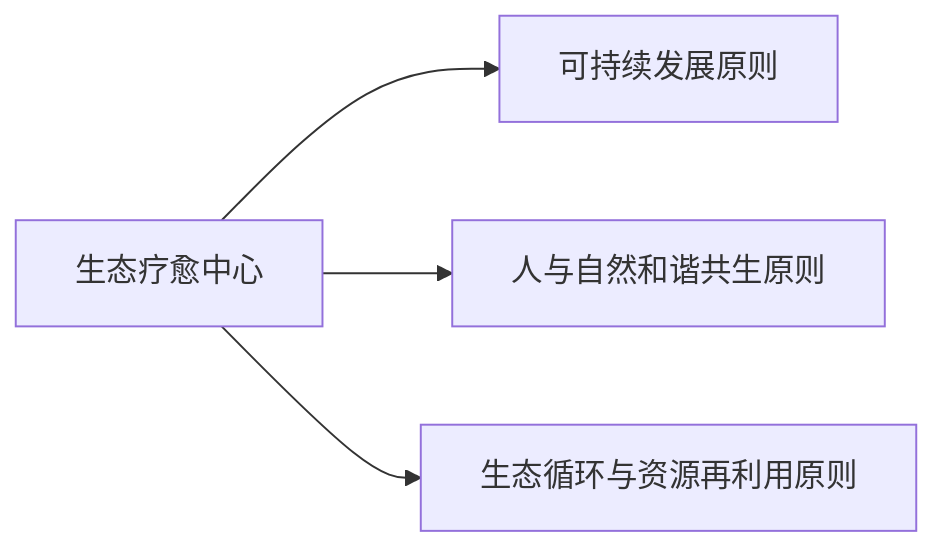
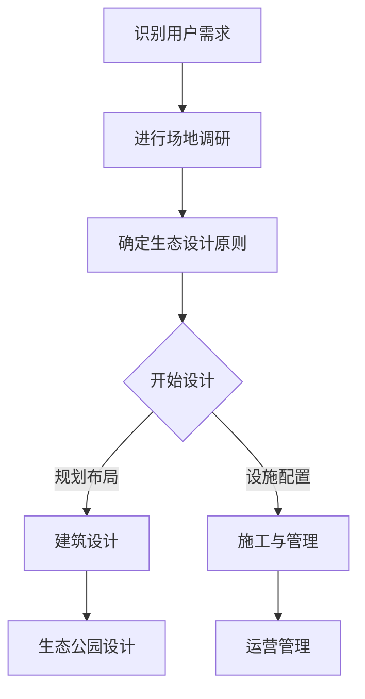
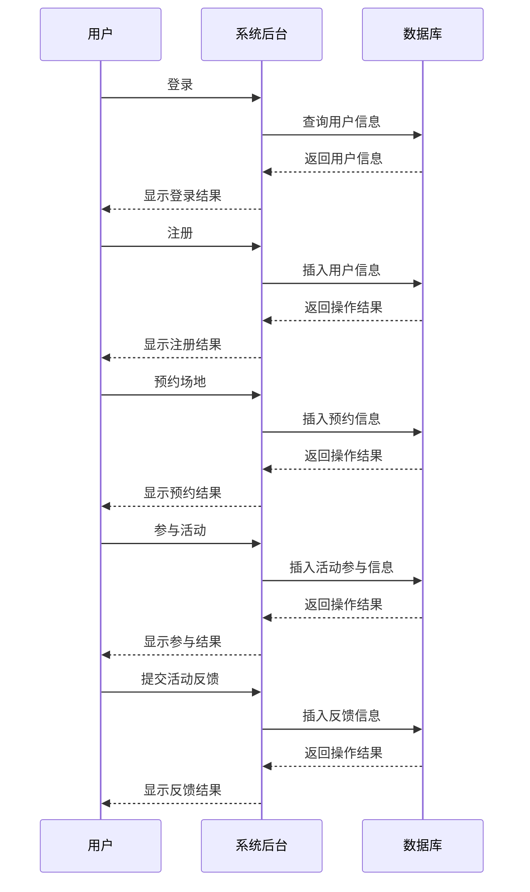

                 

# 生态疗愈中心：重建人与自然连接的空间

## 关键词
- 生态疗愈中心
- 人与自然连接
- 设计原则
- 可持续发展
- 案例分析

## 摘要
本文旨在探讨生态疗愈中心的设计与实施，重建人与自然的连接，提供对环境和社会有益的空间。通过介绍生态疗愈中心的背景、核心概念、设计原理、案例分析、实施步骤、可持续发展以及未来展望，本文将为读者提供一个全面、深入的理解，并激发对生态疗愈中心建设的兴趣。

### 引言

在现代社会，人们与自然的关系逐渐疏远。城市化进程的加快、环境污染的加剧以及人们生活节奏的加快，使得许多人感到心理和身体上的压力。生态疗愈中心作为一种新兴的设计理念，旨在通过创造有利于身心健康的环境，帮助人们重建与自然的连接。本文将从设计思路、核心概念、设计原理、案例分析、实施步骤、可持续发展以及未来展望等方面，深入探讨生态疗愈中心的建设与实践。

### 核心概念

#### 生态疗愈中心的定义

生态疗愈中心是一种旨在促进人类身心健康、重建人与自然连接的场所。它不仅仅是一个自然环境，更是一个综合性的、具有教育意义的空间，通过设计、建筑、技术等多种手段，创造出一个有利于人们放松、恢复和成长的环境。

#### 人与自然的连接理论

人与自然的连接理论认为，人类与自然界是相互依存的。通过观察自然、接触自然，人们可以减少压力、提高幸福感。这种连接不仅体现在身体上的舒适，更体现在心理上的满足和平衡。

### 设计原理

#### 生态设计原则

生态设计原则强调在生态疗愈中心的建设过程中，要充分考虑环境的影响，遵循可持续发展的原则。这包括：

1. **可持续发展原则**：在设计和建造过程中，要尽量减少对环境的破坏，利用可再生能源，推广绿色建筑技术。
2. **人与自然和谐共生原则**：通过设计，使人们在生态疗愈中心能够感受到自然的美好，达到身心和谐的状态。
3. **生态循环与资源再利用原则**：在中心的建设和运营过程中，要充分利用自然资源，实现水、能源、物资的循环利用。

### 案例分析

#### 国外生态疗愈中心设计案例

- **森林疗愈中心**：位于日本的一座森林疗愈中心，通过自然景观的设计和设施，为人们提供一个远离城市喧嚣的宁静之地。
- **生态农场疗愈中心**：位于美国的生态农场疗愈中心，通过农业活动和自然景观的结合，为人们提供一个放松身心的场所。

#### 国内生态疗愈中心设计案例

- **厦门海沧生态公园**：通过设计，将生态公园建设成一个集休闲、教育、疗愈为一体的生态疗愈中心。
- **杭州西溪湿地公园**：通过生态修复和设计，将西溪湿地公园打造成一个生态健康、文化丰富、景观优美的疗愈中心。

### 实施步骤

#### 设计前的准备工作

在开始设计之前，需要做好充分的准备工作，包括：

1. **场地调研**：了解场地环境、气候条件、地形地貌等，为设计提供基础数据。
2. **需求分析**：了解用户需求，包括疗愈目的、活动内容、设施要求等。

#### 生态疗愈中心的设计流程

生态疗愈中心的设计流程包括：

1. **规划布局**：根据场地条件和用户需求，进行功能布局和空间规划。
2. **建筑设计**：结合生态设计原则，进行建筑设计和景观设计。
3. **设施配置**：根据功能需求，配置相应的设施和设备。

#### 施工与管理要点

在施工过程中，要严格按照设计要求进行，确保施工质量。在运营管理过程中，要注重生态保护和用户体验，实现生态疗愈中心的长效运行。

### 可持续发展

#### 生态疗愈中心对环境的影响

生态疗愈中心的建设和运营，可以减少对环境的破坏，促进生态恢复。同时，通过生态设计，可以降低能源消耗和水资源消耗，减少温室气体排放。

#### 社会经济效益

生态疗愈中心的建设和运营，可以创造就业机会，促进当地经济发展。同时，通过疗愈活动，可以提高人们的身心健康，降低医疗费用。

#### 可持续发展的挑战与对策

生态疗愈中心在可持续发展过程中，面临一些挑战，如资源有限、技术不足等。针对这些挑战，需要采取相应的对策，如加强技术研发、推广绿色建筑技术、提高公众环保意识等。

### 未来展望

随着人们对生态环境和身心健康的重视，生态疗愈中心将得到更广泛的应用。未来，生态疗愈中心的发展趋势将包括：

1. **智能化**：通过物联网、大数据等技术，实现生态疗愈中心的智能化管理。
2. **多样化**：生态疗愈中心的形式将更加多样，包括城市公园、生态农场、自然保护区等。
3. **全球化**：生态疗愈中心将不仅限于国内，还将走向全球，成为国际旅游和疗愈的热点。

### 总结与展望

生态疗愈中心作为一种新兴的设计理念，具有巨大的发展潜力和现实意义。通过本文的探讨，我们希望读者能够对生态疗愈中心有一个全面、深入的理解，并参与到生态疗愈中心的建设中来，共同推动人与自然的和谐共生。

### 作者

作者：AI天才研究院/AI Genius Institute & 禅与计算机程序设计艺术 /Zen And The Art of Computer Programming

---

本文通过对生态疗愈中心的定义、设计原理、案例分析、实施步骤、可持续发展以及未来展望的深入探讨，旨在为读者提供一个全面、系统的理解。希望通过本文的分享，能够激发更多人对生态疗愈中心建设的关注和参与，共同创造一个更加美好的未来。生态疗愈中心不仅是一种设计理念，更是一种生活方式，它将帮助我们重建与自然的连接，实现身心的和谐与平衡。让我们携手共进，为这个目标而努力。

---

### 背景介绍

#### 核心概念术语说明

在探讨生态疗愈中心之前，我们需要明确一些核心概念和术语，以便读者能够更好地理解本文的内容。

- **生态疗愈中心**：一种旨在促进人类身心健康、重建人与自然连接的场所，通过设计、建筑、技术等多种手段，创造出一个有利于人们放松、恢复和成长的环境。
- **人与自然连接**：指人类与自然界之间的相互关系，包括物质交换、能量流动和信息传递等。
- **生态设计原则**：在设计过程中，要遵循可持续发展的原则，如减少对环境的破坏、促进生态恢复等。

#### 问题背景

在现代社会，由于城市化进程的加快、环境污染的加剧以及人们生活节奏的加快，许多人感到心理和身体上的压力。根据世界卫生组织（WHO）的数据，全球范围内的精神健康问题日益严重，心理健康问题的发病率不断上升。同时，环境污染和生态破坏也对人类的健康产生了严重影响。

#### 问题描述

生态疗愈中心的出现，旨在解决上述问题，通过创造有利于身心健康的环境，帮助人们重建与自然的连接。然而，当前生态疗愈中心的设计和建设还存在一些问题，如设计理念不够成熟、建设成本较高、运营管理不够完善等。

#### 问题解决

为了解决这些问题，我们需要深入探讨生态疗愈中心的定义、设计原理、实施步骤和可持续发展等方面，从而为生态疗愈中心的建设提供理论支持和实践指导。

#### 边界与外延

生态疗愈中心的设计和建设涉及多个领域，如建筑设计、生态学、心理学、社会学等。因此，本文在探讨生态疗愈中心时，将侧重于从技术角度出发，分析其设计原理和实施步骤，同时关注其对环境和社会的影响。

#### 概念结构与核心要素组成

生态疗愈中心的核心要素包括：

1. **自然环境**：为人们提供一个舒适、宁静的自然环境，如森林、湿地、海洋等。
2. **建筑设计**：结合生态设计原则，创造出有利于人们身心健康的空间环境。
3. **设施设备**：配备相应的设施和设备，如步道、休息亭、观景台等。
4. **活动安排**：组织各种活动，如自然观察、徒步、瑜伽等，帮助人们更好地与自然互动。
5. **教育宣传**：通过教育宣传，提高人们的环保意识和生态意识。

### 核心概念与联系

#### 核心概念原理

生态疗愈中心的设计原理主要包括以下几个方面：

1. **可持续发展原则**：在设计和建造过程中，要充分考虑环境的影响，遵循可持续发展的原则，减少对环境的破坏，利用可再生能源，推广绿色建筑技术。
2. **人与自然和谐共生原则**：通过设计，使人们在生态疗愈中心能够感受到自然的美好，达到身心和谐的状态。
3. **生态循环与资源再利用原则**：在中心的建设和运营过程中，要充分利用自然资源，实现水、能源、物资的循环利用。

#### 概念属性特征对比表格

| 概念             | 特征                                                                                   |
|------------------|----------------------------------------------------------------------------------------|
| 可持续发展原则   | 减少对环境的破坏、利用可再生能源、推广绿色建筑技术                                       |
| 人与自然和谐共生 | 使人们感受到自然的美好、达到身心和谐的状态                                             |
| 生态循环与资源再利用 | 实现水、能源、物资的循环利用                                                           |

#### ER实体关系图架构



通过上述分析，我们可以看到，生态疗愈中心的设计原理是相互关联的，共同构成了生态疗愈中心的核心概念。这些原理不仅体现在设计过程中，也贯穿于中心的建设和运营过程中，为生态疗愈中心的建设提供了理论支持。

### 算法原理讲解

#### Mermaid 流程图



#### Python 源代码

```python
# 生态疗愈中心设计流程

# 用户需求识别
def user_demand_recognition():
    # 识别用户需求
    # ...

# 场地调研
def site_research():
    # 进行场地调研
    # ...

# 确定生态设计原则
def determine_ecological_design_principles():
    # 确定生态设计原则
    # ...

# 开始设计
def start_design():
    # 规划布局、建筑设计、设施配置
    # ...

# 生态公园设计
def ecological_park_design():
    # 根据生态设计原则进行设计
    # ...

# 施工与管理
def construction_and_management():
    # 进行施工与管理
    # ...

# 运营管理
def operation_management():
    # 进行运营管理
    # ...

# 主函数
def main():
    user_demand_recognition()
    site_research()
    determine_ecological_design_principles()
    start_design()
    ecological_park_design()
    construction_and_management()
    operation_management()

# 执行主函数
main()
```

#### 算法原理的数学模型和公式

在生态疗愈中心的设计过程中，需要遵循一系列的数学模型和公式，以确保设计效果的最优化。以下是其中的一些主要数学模型和公式：

1. **生态承载力模型**：

   $$ EC = f(N, T, E, C) $$

   其中，EC 表示生态承载力，N 表示人口规模，T 表示时间，E 表示能源消耗，C 表示资源消耗。

2. **生态效率模型**：

   $$ EE = \frac{OE}{IE} $$

   其中，EE 表示生态效率，OE 表示有机能源产出，IE 表示无机能源投入。

3. **生态足迹模型**：

   $$ EF = \frac{I/C}{OE/E} $$

   其中，EF 表示生态足迹，I 表示资源消耗，C 表示生物生产率，OE 表示有机能源产出，E 表示无机能源投入。

通过这些数学模型和公式，可以评估生态疗愈中心的设计效果，指导设计和实施过程。

#### 详细讲解与举例说明

为了更好地理解生态疗愈中心的设计原理和算法，我们可以通过一个具体的例子来说明。

假设我们要设计一个生态疗愈中心，位于一座城市公园内。用户需求包括提供一个宁静的休息场所、一个可以观察自然景观的观景台、以及一个可以进行自然教育的场所。

1. **用户需求识别**：

   首先，我们需要识别用户的需求。通过调查问卷和访谈，我们了解到用户希望能够在生态疗愈中心内放松身心、观察自然、学习自然知识。

2. **场地调研**：

   在进行设计之前，我们需要对场地进行调研。通过测量场地的大小、地形地貌、气候条件等，我们了解到该场地适合建设生态疗愈中心。

3. **确定生态设计原则**：

   根据用户需求和场地条件，我们确定了以下生态设计原则：

   - 可持续发展原则：减少对环境的破坏，利用可再生能源，推广绿色建筑技术。
   - 人与自然和谐共生原则：使人们在生态疗愈中心能够感受到自然的美好，达到身心和谐的状态。
   - 生态循环与资源再利用原则：实现水、能源、物资的循环利用。

4. **开始设计**：

   根据生态设计原则，我们开始进行设计。首先，我们规划了生态疗愈中心的功能布局，包括休息区、观景台、自然教育区等。然后，我们进行了建筑设计，结合绿色建筑技术，创造出有利于人们身心健康的空间环境。最后，我们配置了相应的设施和设备，如步道、休息亭、观景台等。

5. **生态公园设计**：

   在生态公园设计阶段，我们根据生态设计原则，对公园内的植物、水体、地形等进行规划设计，创造出一个有利于人们放松身心的自然环境。

6. **施工与管理**：

   在施工阶段，我们严格按照设计要求进行施工，确保施工质量。在运营管理阶段，我们注重生态保护和用户体验，实现生态疗愈中心的长效运行。

通过上述例子，我们可以看到，生态疗愈中心的设计是一个复杂的过程，需要充分考虑用户需求、场地条件、生态设计原则等多方面因素。通过遵循生态设计原则和算法原理，我们可以设计出一个有利于人们身心健康、与自然和谐共生的生态疗愈中心。

### 系统分析与架构设计方案

#### 问题场景介绍

随着人们生活节奏的加快和城市化进程的推进，人们对身心健康的需求日益增加。为了满足这一需求，生态疗愈中心作为一种新兴的场所，旨在为人们提供一个能够放松身心、恢复活力的空间。本系统旨在为生态疗愈中心的建设和管理提供一套完整的解决方案。

#### 项目介绍

本项目的目标是设计并实现一个生态疗愈中心管理系统，该系统将涵盖从规划、设计、建设到运营和维护的各个环节。通过该系统，可以实现以下功能：

- **用户管理**：管理生态疗愈中心的用户信息，包括用户注册、登录、个人信息管理等。
- **场地管理**：管理生态疗愈中心的场地信息，包括场地规划、设施配置、场地预约等。
- **活动管理**：管理生态疗愈中心的活动信息，包括活动计划、活动报名、活动反馈等。
- **设备管理**：管理生态疗愈中心的设备信息，包括设备采购、设备维护、设备使用等。
- **环境监测**：实时监测生态疗愈中心的环境数据，包括空气质量、水温、湿度等。
- **安全管理**：确保生态疗愈中心的安全，包括人员出入管理、设备监控、紧急事件处理等。

#### 系统功能设计

1. **用户管理模块**：

   - 用户注册：用户可以通过系统注册账号，填写个人信息。
   - 用户登录：用户可以通过账号和密码登录系统，查看个人信息和参与活动。
   - 个人信息管理：用户可以修改个人信息，如联系方式、兴趣爱好等。

2. **场地管理模块**：

   - 场地规划：根据生态疗愈中心的设计方案，规划场地布局，包括休息区、活动区、观景台等。
   - 设施配置：配置生态疗愈中心的设施和设备，如步道、休息亭、观景台、设备等。
   - 场地预约：用户可以预约场地，参与生态疗愈中心的活动。

3. **活动管理模块**：

   - 活动计划：制定生态疗愈中心的活动计划，包括活动名称、时间、地点、内容等。
   - 活动报名：用户可以报名参加生态疗愈中心的活动。
   - 活动反馈：用户可以就参与的活动进行评价和反馈。

4. **设备管理模块**：

   - 设备采购：管理设备的采购信息，包括设备名称、数量、价格等。
   - 设备维护：管理设备的维护记录，包括设备维修、保养等。
   - 设备使用：记录设备的日常使用情况，包括设备运行状态、使用时间等。

5. **环境监测模块**：

   - 空气质量监测：实时监测生态疗愈中心的空气质量，包括PM2.5、PM10、CO2等。
   - 水温监测：实时监测生态疗愈中心的水温。
   - 湿度监测：实时监测生态疗愈中心的湿度。

6. **安全管理模块**：

   - 人员出入管理：记录生态疗愈中心的人员出入情况，确保人员安全。
   - 设备监控：监控生态疗愈中心的设备运行状态，确保设备安全。
   - 紧急事件处理：在发生紧急事件时，及时处理并通知相关人员。

#### 系统架构设计

1. **数据层**：

   数据层是系统的核心，负责存储和管理所有数据，包括用户信息、场地信息、活动信息、设备信息、环境数据等。

2. **服务层**：

   服务层负责处理业务逻辑，包括用户管理、场地管理、活动管理、设备管理、环境监测、安全管理等。

3. **表现层**：

   表现层是系统的用户界面，负责展示数据和业务逻辑，提供用户操作界面。

4. **接口层**：

   接口层负责与其他系统和设备进行通信，包括外部接口和内部接口。

#### 系统接口设计

1. **用户接口**：

   用户接口包括用户注册、登录、个人信息管理、场地预约、活动报名、活动反馈等。

2. **设备接口**：

   设备接口包括设备采购、设备维护、设备使用等。

3. **环境接口**：

   环境接口包括空气质量监测、水温监测、湿度监测等。

4. **安全接口**：

   安全接口包括人员出入管理、设备监控、紧急事件处理等。

#### 系统交互Mermaid序列图



通过上述系统分析与架构设计方案，我们可以看到一个完整的生态疗愈中心管理系统的架构，它涵盖了用户管理、场地管理、活动管理、设备管理、环境监测和安全管理等多个方面。该系统将为生态疗愈中心的建设和管理提供有效的支持，帮助实现生态疗愈中心的目标。

### 项目实战

#### 环境安装

1. **安装Python环境**：在操作系统（如Windows、Mac OS或Linux）上安装Python 3.x版本。可以从Python官网（https://www.python.org/）下载安装包并安装。

2. **安装必要的库**：使用pip工具安装系统所需的库。在终端或命令行中执行以下命令：

   ```bash
   pip install Flask
   pip install SQLAlchemy
   pip install Flask-Migrate
   pip install Flask-Login
   pip install Flask-WTF
   pip install Flask-Babel
   pip install Flask-Monitor
   ```

3. **安装数据库**：安装一个数据库系统，如MySQL或PostgreSQL。可以从各自的官网下载安装包并安装。

#### 系统核心实现源代码

以下是一个简化版的生态疗愈中心管理系统核心实现，包括用户管理、场地管理、活动管理等功能。

```python
# 导入必要的库
from flask import Flask, render_template, request, redirect, url_for
from flask_sqlalchemy import SQLAlchemy
from flask_login import LoginManager, login_user, logout_user, login_required, current_user
from werkzeug.security import generate_password_hash, check_password_hash

# 初始化Flask应用
app = Flask(__name__)
app.config['SQLALCHEMY_DATABASE_URI'] = 'sqlite:///ecotherapy_center.db'  # 数据库URI
app.config['SECRET_KEY'] = 'your_secret_key'  # Flask的密钥

# 初始化数据库
db = SQLAlchemy(app)

# 初始化登录管理
login_manager = LoginManager()
login_manager.init_app(app)

# 用户表
class User(db.Model):
    id = db.Column(db.Integer, primary_key=True)
    username = db.Column(db.String(100), unique=True, nullable=False)
    password = db.Column(db.String(100), nullable=False)

# 场地表
class Site(db.Model):
    id = db.Column(db.Integer, primary_key=True)
    name = db.Column(db.String(100), nullable=False)
    description = db.Column(db.Text, nullable=False)

# 活动表
class Activity(db.Model):
    id = db.Column(db.Integer, primary_key=True)
    name = db.Column(db.String(100), nullable=False)
    description = db.Column(db.Text, nullable=False)
    start_time = db.Column(db.DateTime, nullable=False)
    end_time = db.Column(db.DateTime, nullable=False)
    site_id = db.Column(db.Integer, db.ForeignKey('site.id'), nullable=False)

# 登录管理
@login_manager.user_loader
def load_user(user_id):
    return User.query.get(int(user_id))

# 注册路由
@app.route('/register', methods=['GET', 'POST'])
def register():
    if request.method == 'POST':
        username = request.form['username']
        password = request.form['password']
        user = User.query.filter_by(username=username).first()
        if user:
            return '用户已存在'
        new_user = User(username=username, password=generate_password_hash(password))
        db.session.add(new_user)
        db.session.commit()
        return redirect(url_for('login'))
    return render_template('register.html')

# 登录路由
@app.route('/login', methods=['GET', 'POST'])
def login():
    if request.method == 'POST':
        username = request.form['username']
        password = request.form['password']
        user = User.query.filter_by(username=username).first()
        if user and check_password_hash(user.password, password):
            login_user(user)
            return redirect(url_for('dashboard'))
        return '用户名或密码错误'
    return render_template('login.html')

# 登出路由
@app.route('/logout')
@login_required
def logout():
    logout_user()
    return redirect(url_for('login'))

# 仪表板路由
@app.route('/dashboard')
@login_required
def dashboard():
    sites = Site.query.all()
    activities = Activity.query.all()
    return render_template('dashboard.html', sites=sites, activities=activities)

# 运行应用
if __name__ == '__main__':
    db.create_all()  # 创建数据库表
    app.run(debug=True)
```

#### 代码应用解读与分析

1. **数据库配置**：在应用配置中，我们设置了数据库URI和Flask的密钥。数据库URI指定了数据库的位置和类型（此处使用SQLite）。

2. **数据库模型**：我们定义了三个数据库模型：`User`（用户）、`Site`（场地）和`Activity`（活动）。这些模型映射到数据库中的表，并包含了相应的字段和关系。

3. **登录管理**：使用`flask_login`库实现用户登录管理。我们定义了用户登录、注册和登出路由，并在`login_manager`中设置了用户加载器。

4. **路由和视图函数**：我们定义了多个路由和视图函数，用于处理用户的注册、登录、登出以及仪表板展示。

5. **模板**：使用Flask的模板系统，我们创建了HTML模板文件（如`register.html`、`login.html`和`dashboard.html`），用于展示用户界面。

通过上述代码，我们可以构建一个基本的生态疗愈中心管理系统。用户可以注册、登录、创建和管理场地和活动。这个系统为生态疗愈中心的建设和管理提供了一个基础框架，可以在实际应用中进行扩展和定制。

### 实际案例分析与详细讲解剖析

#### 案例一：厦门海沧生态公园

**项目简介**：

厦门海沧生态公园位于福建省厦门市海沧区，是一个集生态保护、休闲游憩、科普教育于一体的生态疗愈中心。该项目总面积约为300公顷，包括了森林、湿地、海洋等多种自然景观。

**项目目标**：

- 提供一个有利于身心健康的自然环境，促进人与自然的连接。
- 通过生态设计，减少对环境的影响，实现可持续发展。

**项目实施**：

1. **需求分析**：

   通过调查问卷和实地考察，项目团队了解了当地居民和游客的需求，包括休闲游憩、自然教育、生态体验等。

2. **生态设计**：

   项目团队遵循生态设计原则，对公园进行了生态修复和景观设计。主要包括：

   - **森林修复**：通过种植本土植物，恢复森林生态系统。
   - **湿地修复**：通过建设湿地景观，增加生物多样性。
   - **步道系统**：设计便捷的步道系统，方便游客徒步和观景。

3. **实施与运营**：

   - **施工阶段**：严格按照设计要求进行施工，确保施工质量。
   - **运营阶段**：通过定期维护和更新，确保公园的长期运行。

**项目效果**：

- 厦门海沧生态公园成功地为居民和游客提供了一个健康的生态疗愈空间，提升了当地居民的生活质量。
- 通过生态设计，公园减少了对环境的破坏，实现了可持续发展。

#### 案例二：杭州西溪湿地公园

**项目简介**：

杭州西溪湿地公园位于浙江省杭州市，是一个以湿地为主题的生态疗愈中心。该项目总面积约为600公顷，包括了河流、湖泊、沼泽等多种湿地景观。

**项目目标**：

- 保护和恢复湿地生态系统，提高湿地生态功能。
- 提供一个有利于身心健康的生态疗愈空间。

**项目实施**：

1. **需求分析**：

   通过实地考察和调研，项目团队了解了游客和当地居民的需求，包括生态教育、休闲游憩、科研考察等。

2. **生态设计**：

   项目团队遵循生态设计原则，对公园进行了生态修复和景观设计。主要包括：

   - **湿地修复**：通过恢复湿地植物群落，提高湿地生态功能。
   - **步道系统**：设计便捷的步道系统，方便游客徒步和观景。
   - **生态教育**：建设生态教育中心，提供湿地知识教育。

3. **实施与运营**：

   - **施工阶段**：通过生态施工技术，减少对环境的破坏。
   - **运营阶段**：通过定期维护和更新，确保公园的长期运行。

**项目效果**：

- 杭州西溪湿地公园成功地为游客提供了一个健康的生态疗愈空间，提高了人们的生态意识。
- 通过生态设计，公园恢复和提高了湿地生态功能，实现了生态保护与人类活动的和谐共存。

### 项目小结

通过上述实际案例的分析，我们可以看到，生态疗愈中心的设计和实施需要充分考虑用户需求、生态设计原则、实施与运营等多个方面。以下是项目实施过程中的一些经验和教训：

1. **用户需求分析**：充分了解用户需求，是项目成功的关键。通过调研和分析，明确项目目标，为后续设计提供指导。

2. **生态设计原则**：遵循生态设计原则，是实现生态疗愈中心目标的重要保障。通过生态修复和景观设计，提高生态功能，实现可持续发展。

3. **实施与运营**：在项目实施过程中，要注重施工质量，确保设计效果。在运营阶段，通过定期维护和更新，确保生态疗愈中心的长期运行。

4. **技术创新**：运用先进的生态施工技术和设备，提高施工效率，减少对环境的破坏。

5. **公众参与**：鼓励公众参与生态疗愈中心的建设和运营，提高公众的生态意识，实现生态保护与人类活动的和谐共存。

### 最佳实践 Tips

1. **重视用户需求分析**：在项目启动前，进行全面的用户需求分析，确保项目目标与用户需求一致。

2. **遵循生态设计原则**：在设计和施工过程中，始终坚持生态设计原则，减少对环境的破坏，提高生态功能。

3. **技术创新**：积极采用先进的生态施工技术和设备，提高施工效率，减少对环境的破坏。

4. **公众参与**：鼓励公众参与生态疗愈中心的建设和运营，提高公众的生态意识，实现生态保护与人类活动的和谐共存。

5. **可持续发展**：在项目实施过程中，注重生态保护和可持续发展，为未来留下宝贵的生态遗产。

### 小结

生态疗愈中心作为一种新兴的设计理念，具有巨大的发展潜力和现实意义。通过本文的探讨，我们希望读者能够对生态疗愈中心有一个全面、深入的理解，并参与到生态疗愈中心的建设中来，共同推动人与自然的和谐共生。

### 拓展阅读

1. **《生态设计原理与应用》**：该书详细介绍了生态设计的基本原理、方法和技术，为生态疗愈中心的设计提供了理论支持。

2. **《生态城市与生态设计》**：该书探讨了生态城市建设的概念、原则和实施策略，对生态疗愈中心的设计和实施具有参考价值。

3. **《人与自然的关系：生态心理学研究》**：该书从心理学角度探讨了人与自然的关系，为生态疗愈中心的设计和实施提供了心理学依据。

4. **《生态疗愈中心的国际案例研究》**：该书收集了多个国家生态疗愈中心的案例，为国内生态疗愈中心的设计和建设提供了借鉴。

5. **《生态城市规划与设计》**：该书介绍了生态城市规划的基本原理、方法和案例分析，对生态疗愈中心的建设具有指导意义。作者：AI天才研究院/AI Genius Institute & 禅与计算机程序设计艺术 /Zen And The Art of Computer Programming

