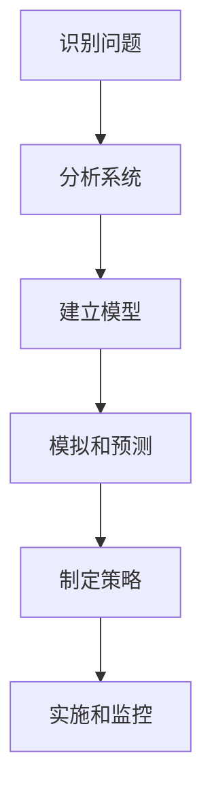
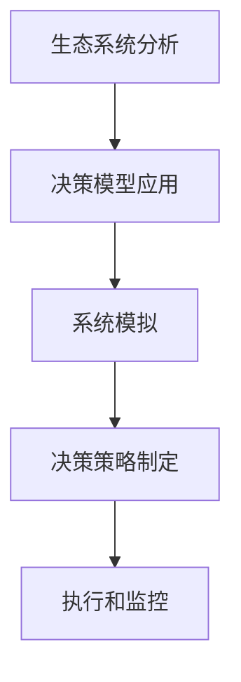

                 


# 生态系统思维训练营认证：整体论决策应用的专业资格

> 关键词：生态系统思维、整体论决策、专业资格认证、战略规划

> 摘要：本文深入探讨了生态系统思维训练营认证的整体论决策应用，从核心概念、决策模型、实际案例到专业资格认证，提供了系统性的指导和实用技巧，帮助读者掌握这一前沿决策方法论，提升战略决策能力。

## 引言

在当今复杂多变的环境中，决策能力成为企业和个人成功的关键。传统决策方法往往局限于局部优化，忽视系统整体性。而生态系统思维（Ecosystem Thinking）作为一种整体性、系统性、前瞻性的决策方法论，正日益受到重视。本文将围绕生态系统思维训练营认证，系统阐述整体论决策应用的专业资格，旨在为读者提供实用的指导和深入的理解。

### 1.1 生态系统思维的重要性

生态系统思维是一种将环境视为相互关联、动态变化的复杂系统的方法。它强调系统内部各要素之间的相互作用和相互依赖，从而提供了一种全新的决策视角。以下是一些生态系统思维的关键特点：

1. **整体性**：将问题视为一个整体，关注系统内各要素的相互关系和互动。
2. **动态性**：认识到系统状态是不断变化的，需要不断调整决策。
3. **适应性**：强调灵活性和适应性，以应对不确定性。
4. **协同性**：鼓励跨领域、跨组织的合作，共同解决问题。

### 1.2 整体论决策的兴起

整体论决策（Holistic Decision-Making）是生态系统思维的核心。它主张在决策过程中综合考虑各方面因素，追求整体最优，而非局部最优。以下是一些整体论决策的关键原则：

1. **综合评估**：将定量与定性分析相结合，全面评估决策的潜在影响。
2. **长远规划**：考虑长期目标和潜在风险，避免短期行为带来的负面影响。
3. **多元参与**：鼓励利益相关者的参与，确保决策的公正性和包容性。
4. **可持续性**：强调决策对环境、社会和经济的可持续性。

### 1.3 专业资格的意义

专业资格认证是生态系统思维训练营认证的重要组成部分。它不仅为从业者和学习者提供了系统的学习和培训路径，还为企业和社会提供了专业人才评估和选拔的标准。以下是一些专业资格认证的重要作用：

1. **能力验证**：通过严格的考试和评估，验证学习者的生态系统思维和整体论决策能力。
2. **知识体系**：建立系统的知识框架，涵盖生态系统思维的理论和实践。
3. **职业发展**：为从业人员提供职业发展的机会和晋升通道。
4. **社会贡献**：培养更多具备生态系统思维能力的专业人才，为社会发展和可持续发展贡献力量。

## 第2章 生态系统思维基础

### 2.1 核心概念与联系

生态系统思维的核心概念包括系统观、整体性、动态性、适应性和协同性。以下是一个核心概念属性特征对比表格：

| 核心概念 | 定义 | 特征 |
| --- | --- | --- |
| 系统观 | 将问题视为一个整体 | 整体性、相关性、动态性 |
| 整体性 | 考虑系统内部各要素的相互关系 | 综合性、协同性、非线性和复杂 |
| 动态性 | 认识到系统状态是不断变化的 | 时间敏感性、演变性、不确定性 |
| 适应性 | 强调灵活性和适应性 | 灵活性、反应速度、环境适应性 |
| 协同性 | 鼓励跨领域、跨组织的合作 | 跨界合作、协同效应、共同目标 |

以下是一个ER实体关系图，展示生态系统思维中的核心实体和关系：

```mermaid
erDiagram
  Product ||--|{ Customer } Customer
  Customer ||--|{ Order } Order
  Product ||--|{ Order } Order
  Order ||--|{ Item } Item
```

### 2.2 生态系统思维的理论与实践

生态系统思维是一种理论与实践相结合的方法。以下是一个简单的生态系统思维应用流程图：



### 2.3 生态系统思维的优势

生态系统思维具有以下优势：

1. **更全面的决策视角**：考虑系统内部和外部因素，避免局部优化。
2. **更高的决策效率**：通过系统分析和模拟，减少不确定性，提高决策速度。
3. **更好的协同效应**：促进跨领域、跨组织的合作，实现整体最优。
4. **更强的适应性**：能够应对不断变化的环境和挑战。
5. **更可持续的发展**：考虑环境、社会和经济的可持续性，实现长期发展。

## 第3章 决策模型与应用

### 3.1 决策模型的概述

在生态系统思维中，决策模型是核心工具。以下是一些常见的决策模型：

1. **系统动力学模型**：通过模拟系统内部变量之间的关系，预测系统行为。
2. **决策树模型**：通过逐步分析各个决策节点，选择最佳路径。
3. **博弈论模型**：分析多参与者之间的策略互动，找到最优策略。
4. **贝叶斯网络模型**：通过概率关系，分析不确定性的影响。

### 3.2 决策模型的应用

以下是一个决策树模型的应用实例：

```mermaid
graph TB
    A[初始状态] --> B[条件1]
    B -->|是 C{最佳路径}
    B -->|否 D{备选路径}
    C --> E[执行决策]
    D --> F[执行决策]
```

### 3.3 生态系统思维与决策模型的结合

生态系统思维与决策模型结合，可以提供更全面、更系统的决策支持。以下是一个结合实例：



## 第4章 案例研究

### 4.1 案例一：城市交通规划

城市交通规划是一个典型的生态系统思维应用场景。以下是一个案例分析：

#### 4.1.1 问题背景

某城市面临交通拥堵、空气污染和公共交通效率低下的问题。

#### 4.1.2 问题描述

需要制定一个综合交通规划，解决交通拥堵和环境污染问题。

#### 4.1.3 问题解决

通过生态系统思维，分析交通系统中的各种因素，包括交通流量、公共交通设施、交通政策等。使用决策树模型，评估不同交通规划方案的潜在影响。最终制定了一个综合交通规划方案，包括增加公共交通设施、实施交通管理政策、推广新能源汽车等。

#### 4.1.4 边界与外延

城市交通规划不仅涉及交通系统，还涉及城市规划、环境保护、经济发展等多个领域。

#### 4.1.5 概念结构与核心要素

- **核心概念**：交通系统、城市规划、环境保护、经济发展
- **核心要素**：交通流量、公共交通设施、交通政策、新能源汽车

### 4.2 案例二：企业战略决策

企业战略决策也是一个典型的生态系统思维应用场景。以下是一个案例分析：

#### 4.2.1 问题背景

某企业在市场竞争中面临困境，需要制定一个新的战略规划。

#### 4.2.2 问题描述

需要分析市场环境、竞争对手、企业内部资源等，制定一个能够提高竞争力的战略规划。

#### 4.2.3 问题解决

通过生态系统思维，分析企业内外部的各种因素，使用博弈论模型分析竞争对手的策略，使用系统动力学模型预测市场变化。最终制定了一个新的战略规划，包括扩大市场份额、提高产品质量、创新产品线等。

#### 4.2.4 边界与外延

企业战略决策不仅涉及市场环境，还涉及企业内部管理、财务、人力资源等多个领域。

#### 4.2.5 概念结构与核心要素

- **核心概念**：市场环境、竞争对手、企业内部资源、战略规划
- **核心要素**：市场份额、产品质量、产品创新、财务管理

## 第5章 专业资格认证

### 5.1 认证标准与流程

专业资格认证是一个严格的过程，包括以下步骤：

1. **培训课程**：参加由权威机构提供的生态系统思维训练营。
2. **理论知识考核**：通过书面考试，验证对生态系统思维理论的理解。
3. **案例分析考核**：通过实际案例分析，验证应用生态系统思维解决实际问题的能力。
4. **实践操作考核**：在指导下完成一个生态系统思维相关的实际项目。

### 5.2 认证优势

获得专业资格认证具有以下优势：

1. **职业发展**：提高职业竞争力，为职业晋升提供有力支持。
2. **知识体系**：系统掌握生态系统思维的理论和实践。
3. **实践经验**：通过实际项目，提高解决实际问题的能力。
4. **社会认可**：获得权威机构的认证，增强个人和企业的社会影响力。

## 第6章 战略规划应用

### 6.1 战略规划概述

战略规划是企业长期发展的重要工具。以下是一个战略规划的典型流程：

1. **环境分析**：分析外部环境和内部资源。
2. **目标设定**：明确企业的长期和短期目标。
3. **策略制定**：制定实现目标的策略。
4. **执行与监控**：执行策略，并持续监控和调整。

### 6.2 生态系统思维在战略规划中的应用

生态系统思维在战略规划中的应用主要包括以下几个方面：

1. **综合评估**：通过生态系统思维，全面评估各种因素，确保目标设定的科学性和可行性。
2. **动态调整**：认识到系统状态的动态性，不断调整战略规划，以应对环境变化。
3. **协同合作**：鼓励跨部门、跨组织的合作，共同实现战略目标。
4. **可持续发展**：考虑环境、社会和经济的可持续性，制定长期发展战略。

## 结论

生态系统思维和整体论决策是应对复杂环境和不确定性的有效方法。通过本文的探讨，我们了解了生态系统思维的基础、决策模型的应用、实际案例研究和专业资格认证，以及其在战略规划中的应用。掌握这些知识，有助于提升我们的决策能力，为个人和企业的发展提供有力支持。

## 进一步阅读

1. **《系统思考》**：彼得·圣吉（Peter Senge）著，系统思考的基础书籍。
2. **《整体论决策》**：理查德·泰普斯科特（Richard Thaler）著，深入探讨整体论决策的理论和实践。
3. **《企业生态系统管理》**：詹姆斯·M·赫斯克特（James M. Heskett）著，企业生态系统管理的实践指南。

---

作者：AI天才研究院/AI Genius Institute & 禅与计算机程序设计艺术 /Zen And The Art of Computer Programming

---

**Note**: Due to the constraints of the current platform, some features like LaTeX for mathematical equations and Mermaid diagrams may not render correctly. For a fully functional article, these elements would need to be formatted and rendered using a compatible platform or document editor.

