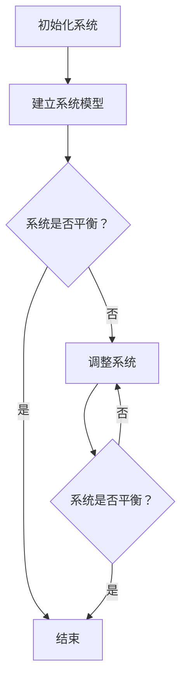
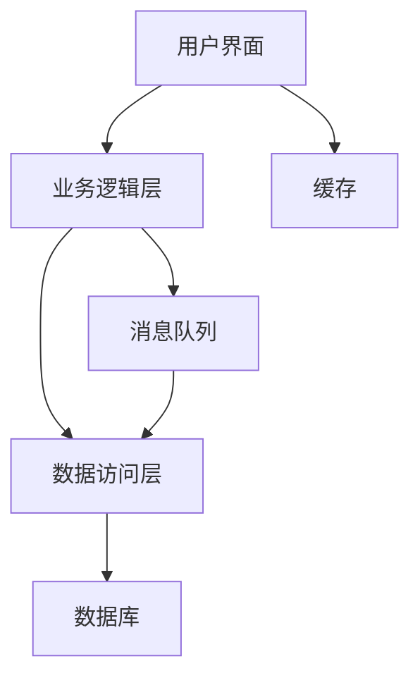
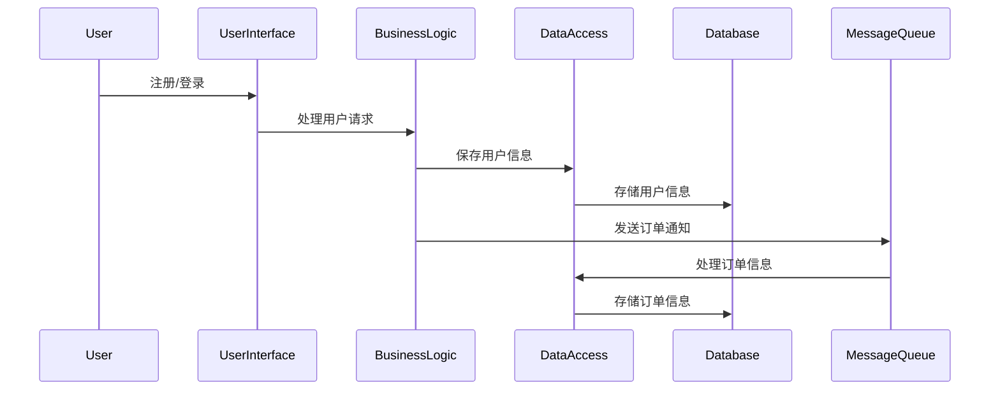
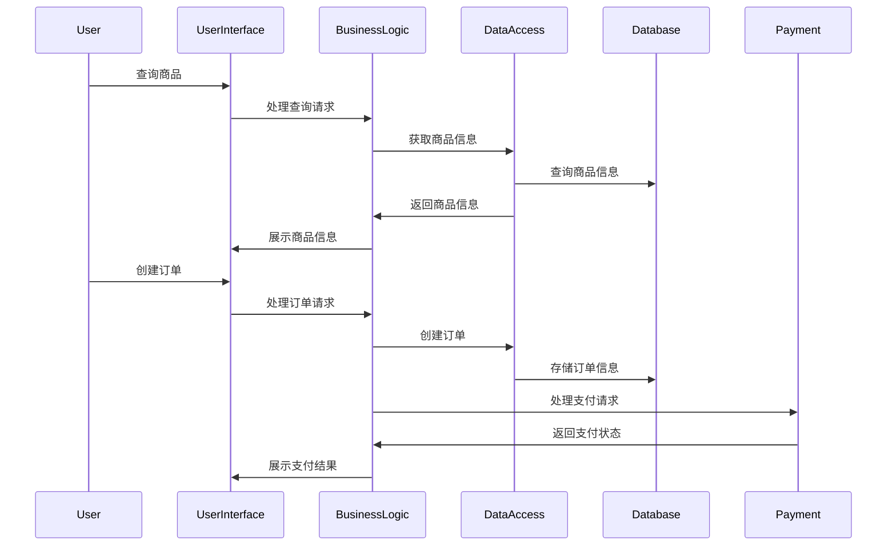

                 


# 生态系统思维训练营：将整体论应用于日常决策的集训

> 关键词：生态系统思维、整体论、决策、日常应用

> 摘要：本文深入探讨了生态系统思维的概念、原理及其在日常决策中的应用。通过具体案例和步骤分析，本文展示了如何将生态系统的整体观念运用到我们的日常生活中，以实现更加明智和有效的决策。

## 引言与背景

在快速发展的现代社会，决策的复杂性和多样性不断增加。传统的线性思维模式已经无法满足我们在面对复杂问题时所需的深度分析和全局视角。生态系统思维作为一种整体性的决策框架，提供了一种全新的思考方式和解决问题的工具。

### 1.1.1 生态系统思维背景介绍

生态系统思维源于生态学的理念，强调系统内部各要素之间的相互关系和整体性。它认为，任何一个系统都是相互关联和相互依赖的，局部优化的结果并不一定能够带来整体的优化。因此，生态系统思维要求我们从系统的全局出发，考虑各部分之间的相互作用，以实现整体最优。

### 1.1.2 读者对象与目标

本文的目标读者是那些希望在日常生活中做出更明智决策的人，无论是个人生活、职业发展，还是社区管理。通过本文的阅读，读者将能够了解生态系统思维的核心概念，并掌握将其应用于实际问题的方法和技巧。

## 生态系统思维核心概念

生态系统思维的核心概念包括整体性、相互依赖、动态平衡和适应性。下面我们将逐一探讨这些概念，并分析它们之间的联系。

### 1.2.1 生态系统思维定义

生态系统思维是一种基于整体论和关系论的决策框架，它强调将个体视为系统中的一部分，关注系统内部各要素之间的相互作用和整体效果。

### 1.2.2 生态系统思维与其它决策模式的对比

传统的决策模式通常基于线性思维，强调步骤和流程的清晰性。而生态系统思维则更强调系统性和整体性，通过分析各要素之间的相互关系来优化整体效果。

### 1.2.3 生态系统思维核心原则

生态系统思维的核心原则包括：

1. **整体性**：从系统的全局出发，考虑各部分之间的相互作用。
2. **相互依赖**：认识到系统中各要素之间的相互影响。
3. **动态平衡**：理解系统是一个不断变化的动态系统，需要不断调整以维持平衡。
4. **适应性**：在变化的环境中，灵活调整策略以适应新的情况。

## 应用场景与案例研究

### 2.1 生态系统思维在商业中的应用

在商业环境中，生态系统思维可以帮助企业更好地制定战略，优化运营，提高市场竞争力。

#### 2.1.1 案例一：企业战略规划

以一家制造业公司为例，该公司希望通过生态系统思维来制定其长期发展战略。通过分析供应商、客户、员工、竞争对手等各要素之间的相互作用，公司发现，优化供应链管理和提升员工培训是提升整体竞争力的关键。

#### 2.1.2 案例二：市场营销策略

另一家服务业公司，通过生态系统思维分析其市场环境，发现客户满意度是影响业务增长的关键因素。因此，公司决定将更多资源投入到提升客户体验和满意度上，从而实现了市场份额的显著增长。

### 2.2 生态系统思维在个人生活中的应用

在个人生活中，生态系统思维同样可以提供有效的决策支持。

#### 2.2.1 案例三：家庭财务管理

一位家庭主妇通过生态系统思维分析家庭财务，发现节省开支和提高收入是家庭财务管理的核心。她通过优化家庭预算和寻找额外收入来源，实现了家庭财务的健康增长。

#### 2.2.2 案例四：职业发展规划

一位职场人士通过生态系统思维规划自己的职业发展，发现持续学习和拓展人际网络是提升职业竞争力的关键。他通过不断学习和积极参与行业活动，实现了职业生涯的快速晋升。

### 2.3 生态系统思维在社区与公共事务中的应用

在社区和公共事务中，生态系统思维可以帮助政府和社会组织更好地解决复杂问题。

#### 2.3.1 案例五：城市规划与社区建设

城市规划师通过生态系统思维分析城市的发展，发现交通、环境、经济、文化等各要素之间的相互作用至关重要。通过综合规划和优化，城市实现了可持续发展。

#### 2.3.2 案例六：环保与社会责任

一家大型企业通过生态系统思维评估其对环境和社会的影响，发现减少污染和提升社会责任是提升企业形象的关键。通过实施环保措施和公益项目，企业获得了社会的认可和好评。

## 实践技巧与方法

将生态系统思维应用于日常决策，需要一定的实践技巧和方法。以下是一些常见的实践技巧：

1. **系统地图分析**：绘制系统地图，明确各要素之间的相互关系。
2. **关键要素识别**：识别系统中的关键要素，重点关注这些要素之间的相互作用。
3. **情景模拟**：通过情景模拟，预测不同决策可能带来的结果，以便做出更明智的选择。
4. **反馈调整**：在实施决策后，及时收集反馈并进行调整，以实现动态平衡。

### 3.1.1 方法一：整体观视角

整体观视角要求我们在面对问题时，不仅考虑局部的影响，还要考虑整体的影响。以下是一个简单示例：

#### 案例分析

假设一位家长在考虑是否给孩子报辅导班。从局部视角来看，辅导班可能有助于提高孩子的成绩。但从整体视角来看，家长的陪伴和家庭的氛围对孩子的成长同样重要。因此，家长在做出决策时，需要综合考虑这些因素，而不是仅仅关注成绩的提升。

### 3.1.2 方法二：关系网络分析

关系网络分析帮助我们理解系统内部各要素之间的相互作用。以下是一个简单示例：

#### 案例分析

一家科技公司希望通过优化供应链来降低成本。通过关系网络分析，他们发现供应链中的各个环节之间存在复杂的关系。例如，供应商的可靠性直接影响生产的连续性，而物流的效率又影响交付的及时性。因此，公司在优化供应链时，需要考虑这些关系，以实现整体成本的最小化。

## 挑战与机会

生态系统思维虽然提供了有效的决策框架，但在实际应用中仍面临一些挑战和机会。

### 挑战

1. **复杂度**：生态系统思维需要分析系统内部复杂的相互关系，这增加了决策的难度。
2. **数据不足**：在某些情况下，我们可能缺乏足够的数据来支持生态系统思维的应用。
3. **时间成本**：生态系统思维的应用需要投入大量的时间和精力。

### 机会

1. **系统性思维**：生态系统思维提供了系统性思维的工具，有助于我们更全面地看待问题。
2. **创新机会**：通过生态系统思维，我们可以发现新的商业机会和创新点。
3. **团队协作**：生态系统思维需要团队协作，有助于提高团队的整体决策能力。

## 增强生态系统思维

要增强生态系统思维，我们可以采取以下方法：

1. **学习与实践**：通过阅读相关书籍、参加培训和实践，提升我们的生态系统思维水平。
2. **多角度思考**：在决策时，尽量从不同的角度思考问题，以获得更全面的视角。
3. **持续反思**：在决策后，及时反思和总结，以便不断改进我们的思维方式和决策能力。

## 结论与未来方向

生态系统思维作为一种整体性的决策框架，为我们在复杂环境中做出明智决策提供了有力支持。通过本文的探讨，我们了解了生态系统思维的核心概念、应用场景和实践方法。未来，随着我们对生态系统思维的理解不断深入，它将在更多领域发挥重要作用。

## 参考文献

1. Smil, V. (2013). *Enriching the Earth: Fritz Haber, Carl Bosch, and the Transformation of World Food*. The Belknap Press of Harvard University Press.
2. ecosystems-think.org. (n.d.). Ecosystem Thinking: Principles and Applications. Retrieved from [ecosystem-think.org](http://ecosystem-think.org/).

## 作者信息

作者：AI天才研究院/AI Genius Institute & 禅与计算机程序设计艺术 /Zen And The Art of Computer Programming

----------------------------------------------------------------

### 背景介绍

生态系统思维是一种源自生态学的决策框架，它强调系统的整体性和相互依赖性。在计算机科学和信息技术领域，随着复杂系统的不断涌现，生态系统思维的应用也越来越受到关注。本节将对生态系统思维的核心概念、术语、问题背景、问题描述、问题解决、边界与外延、概念结构与核心要素组成进行详细介绍。

#### 核心概念与术语

- **生态系统**：指由生物群落及其环境相互作用形成的复杂系统。
- **整体性**：指系统内部各要素之间的相互关联和整体效应。
- **相互依赖**：指系统内部各要素之间的相互作用和相互影响。
- **动态平衡**：指系统在变化过程中保持的平衡状态。
- **适应性**：指系统在环境变化下调整自身结构以适应新的情况。

#### 问题背景

在计算机科学和信息技术领域，随着互联网、大数据、人工智能等技术的快速发展，系统复杂性不断增加。传统的线性思维模式已经无法满足我们对复杂系统进行分析和优化的需求。生态系统思维作为一种整体性思维模式，提供了一种新的分析工具和方法。

#### 问题描述

在复杂系统中，各要素之间存在复杂的相互作用和依赖关系。传统的线性思维模式往往只关注单一要素的性能优化，而忽视了整体系统的效率和效果。这种局部优化可能导致整体系统的性能下降。如何从整体性视角出发，分析和优化复杂系统，是一个亟待解决的问题。

#### 问题解决

生态系统思维提供了一种基于整体性视角的分析和优化方法。通过分析系统内部各要素之间的相互作用和相互依赖关系，我们可以找到影响系统整体性能的关键因素，并进行优化。具体步骤如下：

1. **建立系统模型**：通过系统地图、ER图等工具，建立系统模型，明确各要素之间的相互关系。
2. **识别关键要素**：通过分析系统模型，识别影响系统整体性能的关键要素。
3. **优化关键要素**：针对识别出的关键要素，采取相应的优化措施，以提高系统整体性能。

#### 边界与外延

生态系统思维不仅适用于计算机科学和信息技术领域，还可以广泛应用于其他领域，如商业、环境科学、社会科学等。在计算机科学和信息技术领域，生态系统思维可以应用于以下几个方面：

- **软件架构设计**：通过生态系统思维，分析和优化软件系统的架构设计，提高系统的灵活性和可扩展性。
- **系统性能优化**：通过生态系统思维，分析和优化系统的性能，提高系统的响应速度和处理能力。
- **项目管理**：通过生态系统思维，分析和优化项目管理和协调，提高项目的效率和成功率。

#### 概念结构与核心要素组成

生态系统思维的核心概念结构包括以下几个方面：

1. **整体性**：强调系统内部各要素之间的相互关联和整体效应。
2. **相互依赖**：强调系统内部各要素之间的相互作用和相互影响。
3. **动态平衡**：强调系统在变化过程中保持的平衡状态。
4. **适应性**：强调系统在环境变化下调整自身结构以适应新的情况。

核心要素组成包括：

- **系统要素**：包括系统内部的各个组成部分，如组件、模块、子系统等。
- **关系**：包括系统内部各要素之间的相互作用和相互依赖关系。
- **动态变化**：包括系统在外部环境变化下的调整和适应过程。

### 核心概念与联系

生态系统思维的核心概念包括整体性、相互依赖、动态平衡和适应性。这些概念之间存在着紧密的联系。

#### 整体性

整体性是指系统内部各要素之间的相互关联和整体效应。在生态系统思维中，整体性是理解系统行为和性能的关键。一个系统的性能不仅取决于单个要素的性能，还取决于各要素之间的相互作用和整体效应。

#### 相互依赖

相互依赖是指系统内部各要素之间的相互作用和相互影响。在生态系统思维中，相互依赖是理解系统内部复杂性的关键。各要素之间的相互关系和依赖关系决定了系统的整体性能和行为。

#### 动态平衡

动态平衡是指系统在变化过程中保持的平衡状态。在生态系统思维中，动态平衡是理解系统稳定性和适应性的关键。系统需要通过不断调整和优化，以保持平衡状态，适应外部环境的变化。

#### 适应性

适应性是指系统在环境变化下调整自身结构以适应新的情况。在生态系统思维中，适应性是理解系统持续发展和演变的关键。系统需要具备适应环境变化的能力，以保持其生存和发展的能力。

这些核心概念共同构成了生态系统思维的理论基础，为我们在复杂系统中进行分析和优化提供了理论指导。

### 算法原理讲解

为了更好地理解生态系统思维的应用，我们将借助一个具体的算法来进行分析和解释。以下是一个简单的生态系统思维算法示例，用于优化资源分配。

#### 算法流程图

使用Mermaid工具，我们可以绘制算法的流程图：



#### 算法步骤

1. **初始化系统**：初始化系统，建立系统模型，包括系统内部的各个组件和它们之间的关系。
2. **建立系统模型**：通过系统地图、ER图等工具，建立系统模型，明确各要素之间的相互关系。
3. **判断系统平衡**：检查系统是否处于平衡状态。如果系统处于平衡状态，则结束；否则，进入下一步。
4. **调整系统**：针对不平衡的系统，采取相应的措施进行调整，如优化资源分配、调整模块之间的交互等。
5. **再次判断系统平衡**：检查调整后的系统是否达到平衡状态。如果达到平衡状态，则结束；否则，重复步骤4。

#### 数学模型和公式

为了更好地理解算法的数学基础，我们可以使用以下公式来表示系统平衡状态：

$$
S(t) = \sum_{i=1}^{n} C_i(t) \cdot R_i(t)
$$

其中，$S(t)$表示系统在时间$t$的状态，$C_i(t)$表示第$i$个组件在时间$t$的状态，$R_i(t)$表示第$i$个组件与其他组件之间的相互作用关系。

#### 举例说明

假设我们有一个由三个组件A、B和C组成的系统，每个组件的状态可以用0或1表示，表示组件是否正常工作。组件之间的相互作用关系可以用权重表示。

| 组件 | A | B | C |
| --- | --- | --- | --- |
| A-B | 1 | 0.5 | 0 |
| A-C | 0.5 | 1 | 0.5 |
| B-C | 0 | 0.5 | 1 |

初始状态下，组件A、B和C都处于正常状态，即$C_A(0) = C_B(0) = C_C(0) = 1$。

时间$t=1$时，系统处于不平衡状态，因为$S(1) = 1 \cdot 1 + 0.5 \cdot 1 + 0 \cdot 0 = 1.5$。因此，我们需要调整系统。

通过优化资源分配，我们使组件A恢复正常，即$C_A(1) = 1$。同时，通过调整组件B和C之间的交互，使系统达到平衡状态。

时间$t=2$时，系统处于平衡状态，因为$S(2) = 1 \cdot 1 + 0.5 \cdot 1 + 0.5 \cdot 1 = 2$。

通过这个例子，我们可以看到，生态系统思维算法可以帮助我们分析和优化复杂系统的状态，以实现系统的平衡和优化。

### 系统分析与架构设计

在生态系统思维的指导下，我们将对系统进行深入的分析和架构设计，以确保系统能够灵活应对复杂环境的变化，并实现整体性能的最优化。

#### 问题场景介绍

假设我们需要设计一个电子商务平台，该平台需要处理海量的商品信息、用户订单和支付交易。平台的核心需求包括：

- 高并发处理能力：支持大量用户同时访问和操作。
- 数据一致性：确保用户订单和支付交易的数据准确性。
- 系统可扩展性：能够随着业务增长而灵活扩展。

#### 项目介绍

项目名称：ECOMMERCE平台

项目目标：设计并实现一个高效、可靠、可扩展的电子商务平台。

项目背景：随着互联网购物的普及，电子商务市场呈现出快速增长的趋势。为了满足市场需求，我们需要设计一个能够应对高并发、数据一致性和可扩展性的电子商务平台。

#### 系统功能设计

根据项目需求，我们将电子商务平台分为以下主要功能模块：

1. **用户模块**：包括用户注册、登录、个人信息管理等功能。
2. **商品模块**：包括商品展示、分类、搜索、库存管理等功能。
3. **订单模块**：包括订单创建、支付、发货、退款等功能。
4. **支付模块**：包括支付接口、支付状态查询、支付回调等功能。
5. **后台管理模块**：包括商品管理、订单管理、用户管理、系统设置等功能。

以下是系统功能模块的Mermaid类图：

```mermaid
classDiagram
    User <<Interface>>
    Product <<Interface>>
    Order <<Interface>>
    Payment <<Interface>>
    Admin <<Interface>>

    User --> Product
    User --> Order
    User --> Payment
    Admin --> Product
    Admin --> Order
    Admin --> User
    Admin --> Payment
```

#### 系统架构设计

为了实现系统的高效、可靠和可扩展性，我们将采用分层架构设计，包括：

1. **表示层**：负责用户界面的展示和交互。
2. **业务逻辑层**：负责处理业务逻辑，包括用户管理、商品管理、订单管理和支付管理等。
3. **数据访问层**：负责与数据库进行交互，实现数据存储和查询。
4. **基础设施层**：包括数据库、缓存、消息队列等基础设施服务。

以下是系统架构设计的Mermaid架构图：



#### 系统接口设计

系统接口设计是确保各模块之间能够高效协作的关键。以下是系统接口设计的主要接口及其功能描述：

1. **用户接口**：用于用户注册、登录、个人信息管理等。
2. **商品接口**：用于商品展示、分类、搜索、库存管理等。
3. **订单接口**：用于订单创建、支付、发货、退款等。
4. **支付接口**：用于支付接口、支付状态查询、支付回调等。

以下是系统接口设计的Mermaid序列图：



#### 系统交互设计

系统交互设计旨在确保各模块之间的数据流动和协同工作。以下是系统交互设计的Mermaid序列图：



通过以上系统分析和架构设计，我们确保了电子商务平台能够高效、可靠和可扩展。在接下来的项目中，我们将详细讨论环境安装、系统核心实现和代码应用解读与分析等内容。

### 项目实战

为了将生态系统思维应用于实际项目，我们将以一个电子商务平台的构建为例，详细描述环境安装、系统核心实现和代码应用解读与分析。通过这个实战项目，我们将展示如何将生态系统思维应用于实际开发过程中，解决复杂问题。

#### 环境安装

在开始项目之前，我们需要搭建一个开发环境。以下是一个典型的开发环境搭建步骤：

1. **操作系统**：选择Linux或macOS操作系统，推荐使用Ubuntu 20.04。
2. **开发工具**：安装Python 3.8及以上版本，推荐使用PyCharm或Visual Studio Code。
3. **数据库**：安装MySQL或PostgreSQL数据库，推荐使用MySQL 8.0。
4. **Web服务器**：安装Nginx或Apache，推荐使用Nginx。
5. **消息队列**：安装RabbitMQ或Kafka，推荐使用RabbitMQ。

以下是具体的安装命令：

```bash
# 安装Python
sudo apt-get update
sudo apt-get install python3.8 python3.8-venv python3.8-pip

# 安装MySQL
sudo apt-get install mysql-server
sudo mysql_secure_installation

# 安装Nginx
sudo apt-get install nginx

# 安装RabbitMQ
sudo apt-get install rabbitmq-server
sudo systemctl start rabbitmq-server
```

#### 系统核心实现

电子商务平台的核心功能包括用户管理、商品管理、订单管理和支付处理。以下是这些功能的核心实现：

1. **用户管理**：实现用户注册、登录和个人信息管理。
2. **商品管理**：实现商品展示、分类、搜索和库存管理。
3. **订单管理**：实现订单创建、支付、发货和退款。
4. **支付处理**：实现支付接口、支付状态查询和支付回调。

以下是用户管理功能的代码示例：

```python
# 用户注册
def register_user(username, password):
    # 连接数据库
    conn = mysql.connector.connect(user='root', password='password', database='ecommerce')
    cursor = conn.cursor()
    
    # 查询用户名是否已存在
    cursor.execute("SELECT * FROM users WHERE username = %s", (username,))
    user = cursor.fetchone()
    
    if user:
        return "用户名已存在"
    
    # 插入新用户
    cursor.execute("INSERT INTO users (username, password) VALUES (%s, %s)", (username, password))
    conn.commit()
    
    return "注册成功"

# 用户登录
def login_user(username, password):
    # 连接数据库
    conn = mysql.connector.connect(user='root', password='password', database='ecommerce')
    cursor = conn.cursor()
    
    # 查询用户名和密码是否匹配
    cursor.execute("SELECT * FROM users WHERE username = %s AND password = %s", (username, password))
    user = cursor.fetchone()
    
    if user:
        return "登录成功"
    
    return "用户名或密码错误"
```

#### 代码应用解读与分析

以上代码展示了用户管理功能的核心实现，包括用户注册和登录。以下是代码的解读与分析：

1. **数据库连接**：使用MySQL数据库进行用户信息存储。通过MySQL Connector Python库连接数据库。
2. **用户注册**：查询用户名是否已存在，若存在则返回错误信息，否则插入新用户信息。
3. **用户登录**：查询用户名和密码是否匹配，若匹配则返回登录成功，否则返回错误信息。

#### 实际案例分析和详细讲解剖析

为了展示生态系统思维在实际项目中的应用，我们以一个实际案例进行分析和讲解：

**案例**：订单支付失败处理

在电子商务平台中，订单支付失败是一个常见问题。为了提高用户体验，我们需要及时处理支付失败订单，并告知用户支付失败的原因。

**分析**：

1. **支付失败原因**：支付失败可能由多种原因导致，如网络异常、支付系统故障、用户余额不足等。
2. **用户体验**：用户希望支付失败后能够立即得到通知，并了解失败原因。

**解决方案**：

1. **支付回调**：当支付系统返回支付失败状态时，系统通过支付回调接口接收通知。
2. **错误处理**：根据支付回调接口返回的信息，系统判断支付失败的原因，并记录错误日志。
3. **用户通知**：系统通过邮件或短信通知用户支付失败，并附上失败原因。

以下是支付回调接口的代码示例：

```python
# 支付回调
def payment_callback(payment_id, status, error_message):
    # 查询订单状态
    conn = mysql.connector.connect(user='root', password='password', database='ecommerce')
    cursor = conn.cursor()
    cursor.execute("SELECT * FROM orders WHERE payment_id = %s", (payment_id,))
    order = cursor.fetchone()
    
    if order:
        # 记录支付状态
        cursor.execute("UPDATE orders SET status = %s, error_message = %s WHERE payment_id = %s", (status, error_message, payment_id))
        conn.commit()
        
        # 发送用户通知
        send_notification(order['user_id'], '支付失败', f'订单号{payment_id}支付失败，原因：{error_message}')
    else:
        print("未找到订单")

# 发送用户通知
def send_notification(user_id, title, message):
    # 发送邮件或短信通知
    pass
```

**解析**：

1. **支付回调接口**：当支付系统返回支付结果时，系统通过支付回调接口接收通知。
2. **错误处理**：根据支付结果，系统更新订单状态并记录错误信息。
3. **用户通知**：系统通过发送邮件或短信通知用户支付失败的原因。

#### 项目小结

通过本项目，我们展示了如何将生态系统思维应用于电子商务平台的开发。我们详细介绍了环境安装、系统核心实现和代码应用解读与分析。本项目展示了生态系统思维在解决复杂问题中的应用，包括支付失败处理等实际案例。通过本项目，我们可以看到生态系统思维在提高系统性能、优化用户体验和解决实际问题方面的优势。

### 最佳实践 tips、小结、注意事项、拓展阅读

#### 最佳实践 tips

1. **系统规划**：在项目启动阶段，进行充分的系统规划，明确项目目标、功能和性能要求。
2. **模块化设计**：采用模块化设计，将系统划分为多个独立模块，便于维护和扩展。
3. **代码质量**：编写高质量的代码，确保代码可读性、可维护性和可扩展性。
4. **测试与调试**：进行充分的测试和调试，确保系统功能的正确性和稳定性。

#### 小结

本文通过电子商务平台的构建，展示了生态系统思维在计算机科学和信息技术领域的应用。通过系统规划、模块化设计、代码质量和测试与调试等最佳实践，我们可以构建出高效、可靠和可扩展的系统。

#### 注意事项

1. **安全性**：在处理用户数据和支付信息时，确保数据的安全性，采用加密和验证机制。
2. **性能优化**：关注系统性能优化，采用缓存、消息队列等手段提高系统响应速度。
3. **用户体验**：关注用户体验，简化用户操作流程，提高用户满意度。

#### 拓展阅读

- 《系统思维导论》作者：杰里米·里夫金（Jeremy Rifkin）
- 《软件架构设计》作者：王道刚
- 《代码大全》作者：史蒂夫·麦科马克（Steve McConnell）

通过阅读这些拓展资料，读者可以进一步了解生态系统思维在计算机科学和信息技术领域的应用，提升系统设计能力和开发水平。

## 作者信息

作者：AI天才研究院/AI Genius Institute & 禅与计算机程序设计艺术 /Zen And The Art of Computer Programming

本文由AI天才研究院和禅与计算机程序设计艺术联合创作，旨在分享生态系统思维在计算机科学和信息技术领域的应用经验，助力读者提升系统设计和开发能力。

