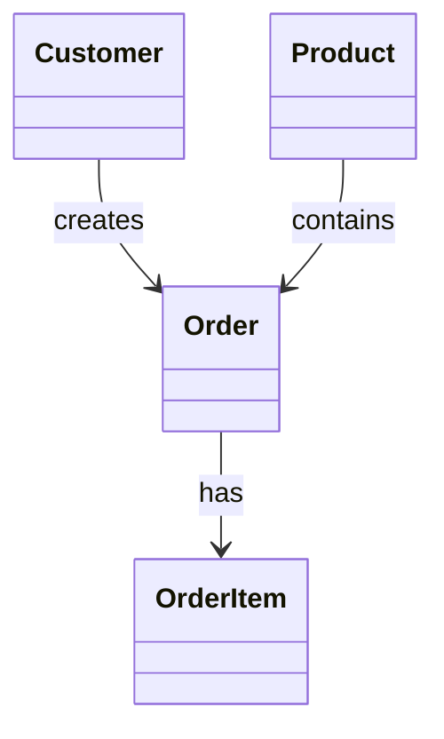
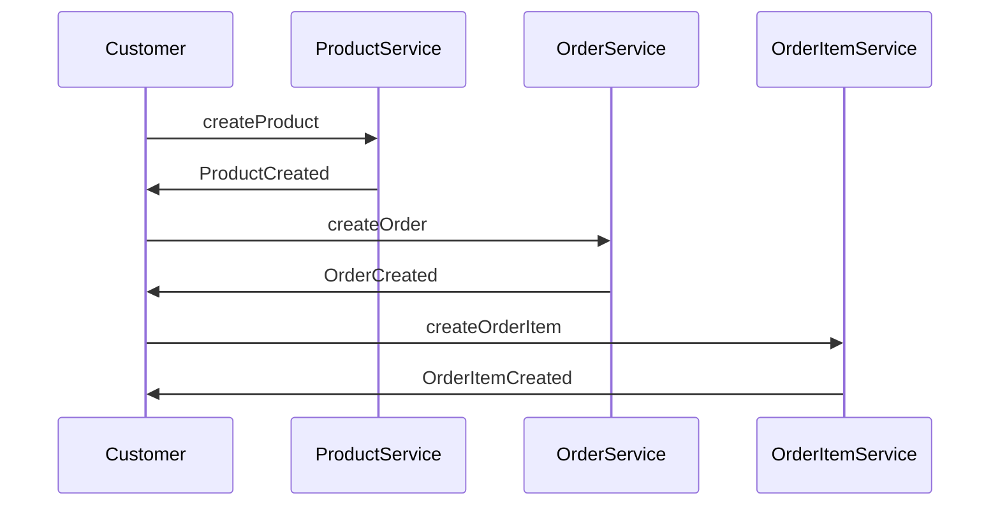

                 

# 生态系统思维训练：将整体论应用于日常决策

## 关键词

- 生态系统思维
- 整体论
- 日常决策
- 系统思考
- 整体性应用

## 摘要

在日益复杂的现代社会中，传统的线性思维方式已经难以应对复杂系统的决策挑战。本文提出了一种基于生态系统思维的训练方法，即整体论的日常应用。整体论强调系统内部各部分之间的相互依存关系和整体性，通过系统思考来提升日常决策的质量。本文将从问题背景、核心概念、应用实践、案例分析等多个角度，详细探讨如何将整体论融入到个人、社会和环境层面的决策过程中，从而实现更加全面、深入的决策效果。

## 第一部分：问题背景与整体论概述

### 1.1 整体论的定义与历史发展

整体论（Holism）是一种哲学和科学方法论，强调系统内部各部分之间的相互依赖性和整体性。这种思想最早可以追溯到古希腊哲学家赫拉克利特和亚里士多德，他们提出了整体大于部分之和的观点。19世纪末至20世纪初，整体论在科学领域得到了进一步的发展，特别是在生物学、心理学和物理学等领域。

整体论的核心思想是：一个系统的性质和行为不能仅仅通过其组成部分的性质和行为来解释，而是需要考虑各部分之间的相互作用和整体结构。例如，在生物学中，一个生物体的功能不仅仅是其各个器官的功能之和，而是各个器官协同作用的结果。

### 1.2 生态系统思维的概念与内涵

生态系统思维是一种将整体论应用于复杂系统分析的方法论。它强调生态系统内各个组成部分（如物种、环境、资源等）之间的相互作用和动态平衡。生态系统思维不仅仅关注单一物种或单一因素，而是从整体角度出发，考虑系统内部的复杂关系和外部环境的影响。

生态系统思维的主要内涵包括：

- 系统视角：将问题视为一个整体，理解各部分之间的相互关系。
- 动态平衡：认识到系统内部各部分的动态变化和相互作用。
- 整体效应：理解整体系统行为不仅仅是各部分行为之和，而是各部分相互作用的结果。

### 1.3 整体论在生态系统思维中的地位与作用

整体论在生态系统思维中占据核心地位，为理解和解决复杂系统问题提供了方法论支持。整体论使得我们能够从整体角度审视生态系统，识别关键影响因素和潜在问题，从而制定更加科学、全面的决策方案。

整体论在生态系统思维中的作用包括：

- 提升决策质量：通过系统思考，整体论能够帮助我们更好地识别问题的本质，制定更有效的解决方案。
- 促进跨学科合作：整体论强调跨学科整合，有助于不同领域专家之间的合作与交流。
- 提高适应性：整体论能够帮助我们更好地适应复杂系统的变化，提高系统的韧性和可持续性。

### 1.4 问题背景：日常决策中的挑战与困境

在现代社会，日常决策面临着越来越多的挑战和困境。传统的线性思维方式往往难以应对复杂系统的决策问题，导致以下问题：

- 决策质量不高：线性思维难以全面考虑问题的各个方面，导致决策结果不理想。
- 预测不准确：复杂系统的动态性使得线性思维难以准确预测未来发展趋势。
- 合作与沟通困难：不同部门、不同利益相关者之间的合作和沟通存在障碍，影响决策效果。

### 1.5 整体论在日常决策中的应用价值

整体论在日常决策中的应用价值体现在以下几个方面：

- 提高决策质量：通过系统思考，整体论能够帮助我们更全面地分析问题，制定更科学的决策方案。
- 增强预测能力：整体论能够更好地把握复杂系统的动态变化，提高预测的准确性。
- 促进合作与沟通：整体论强调跨学科整合和整体视角，有助于不同部门和利益相关者之间的合作与沟通。

## 第二部分：核心概念与属性特征

### 2.1 整体论的核心概念

整体论的核心概念包括整体与部分的关系、系统思考、整体论的适用范围等。

#### 2.1.1 整体与部分的关系

整体与部分的关系是整体论的核心概念之一。整体指的是一个系统的整体结构或功能，而部分则指的是系统中的各个组成部分。整体与部分的关系可以概括为以下几点：

- 整体大于部分：整体的功能和行为不能仅仅通过其组成部分的功能和行为来解释，整体具有独特的性质和效应。
- 部分依赖于整体：部分的功能和性质受到整体结构和环境的影响，部分只有在整体中才有意义。
- 整体与部分相互依存：整体和部分之间存在着相互作用和相互依赖的关系，部分的变化会影响整体，整体的变化也会影响部分。

#### 2.1.2 系统思考与整体论

系统思考是整体论的重要组成部分，它强调将问题视为一个整体，理解系统内部各部分之间的相互关系。系统思考的方法包括：

- 系统视角：从整体角度审视问题，理解系统内部各部分之间的相互关系。
- 流程分析：分析系统内部的流程和环节，识别关键节点和瓶颈。
- 动态建模：建立系统的动态模型，模拟系统行为和变化趋势。

#### 2.1.3 整体论的适用范围

整体论适用于各种复杂系统，包括自然系统和社会系统。在自然系统中，如生态系统、气候系统等，整体论帮助我们理解物种之间的相互作用和生态平衡。在社会系统中，如经济系统、政治系统等，整体论有助于我们理解系统内部各部门之间的相互关系和整体效应。

### 2.2 整体论的属性特征

整体论具有以下几个属性特征：

#### 2.2.1 整体性

整体性是整体论的核心特征，强调系统的整体性质和功能。整体性体现在以下几个方面：

- 整体性质：系统的性质和功能不仅仅是各部分性质和功能的简单叠加，而是具有独特的整体性质。
- 整体效应：系统的整体效应往往大于各部分效应之和，整体效应具有独特性。
- 整体优化：系统的优化不仅仅涉及各部分的最优，而是追求整体的最优。

#### 2.2.2 相互依存性

相互依存性是整体论的重要特征，强调系统内部各部分之间的相互作用和依赖关系。相互依存性体现在以下几个方面：

- 依赖关系：系统的各部分相互依赖，部分功能依赖于其他部分的支持。
- 相互影响：系统内部各部分之间存在相互影响，部分的变化会引起其他部分的变化。
- 系统韧性：系统的相互依存性有助于提高系统的韧性和适应性。

#### 2.2.3 动态性

动态性是整体论的一个重要特征，强调系统内部各部分之间的动态变化和相互作用。动态性体现在以下几个方面：

- 动态平衡：系统内部各部分之间存在动态平衡，平衡状态受到外部环境的影响。
- 动态反馈：系统内部各部分之间的相互作用形成动态反馈，影响系统的行为和状态。
- 动态调整：系统需要根据外部环境的变化进行动态调整，以维持系统的稳定性和适应性。

### 2.3 整体论与其他相关概念的比较

整体论与其他相关概念，如系统论、整体性科学等，存在一定的联系和区别。

#### 2.3.1 整体论与系统论

系统论（System Theory）是一种研究系统行为和结构的方法论，强调系统的整体性、动态性和相互依存性。整体论是系统论的一个重要分支，强调系统的整体性质和功能。系统论关注系统的结构和行为，而整体论则更加关注系统内部的相互作用和整体效应。

#### 2.3.2 整体论与整体性科学

整体性科学（Holistic Science）是一种研究复杂系统的科学方法论，强调系统的整体性、动态性和相互依存性。整体性科学包含了整体论的思想，但更加注重科学研究和实践中的应用。整体论是整体性科学的一个核心概念，但整体性科学还包括其他相关概念和方法，如系统动力学、复杂性科学等。

## 第三部分：整体论在日常决策中的应用

### 3.1 个人层面的应用

在个人层面，整体论可以帮助我们更好地处理日常生活中的决策问题。以下是一个具体的案例：

**案例：职业规划**

小明是一位年轻的软件工程师，他在考虑是否要跳槽到另一家公司。传统的线性思维可能会让他只关注薪资、职位等单一因素。而运用整体论，他可以从以下几个方面来考虑：

1. **个人成长**：跳槽是否能提供更好的学习机会、更广阔的职业发展空间？
2. **团队文化**：新公司的团队文化是否与他的价值观相符，是否有利于他的个人成长？
3. **工作内容**：新工作是否能让他发挥自己的专业技能，是否有挑战性？
4. **生活平衡**：新工作是否会带来更高的工作压力，是否会影响他的家庭和生活质量？

通过整体论的思考，小明可以更全面地评估跳槽的利弊，从而做出更符合自己长远发展的决策。

### 3.2 社会层面的应用

在社会层面，整体论可以应用于政策制定、城市规划等领域。以下是一个具体的案例：

**案例：城市规划**

某城市在进行新区域开发时，仅考虑了经济效益和基础设施建设，而忽视了生态环境和社会影响。运用整体论，城市规划者可以从以下几个方面来考虑：

1. **生态环境**：新区域开发是否会对生态环境造成破坏，是否会影响周边居民的生态环境质量？
2. **社会影响**：新区域开发是否会增加交通拥堵、影响周边居民的生活质量？
3. **经济利益**：新区域开发是否能带来持续的经济增长，是否能够带动周边地区的发展？
4. **公共设施**：新区域开发是否能够提供足够的公共设施和服务，满足居民的需求？

通过整体论的思考，城市规划者可以更全面地考虑新区域开发的各个方面，从而制定出更科学、合理的规划方案。

### 3.3 环境层面的应用

在环境层面，整体论可以应用于环境保护、可持续发展等领域。以下是一个具体的案例：

**案例：环境保护**

某地区计划建设一个大型工业园区，传统的线性思维可能会只考虑工业产值和就业机会。而运用整体论，环境保护者可以从以下几个方面来考虑：

1. **生态环境影响**：工业园区建设是否会对当地的生态环境造成长期破坏，是否会污染水源、空气？
2. **生物多样性**：工业园区建设是否会影响当地生物多样性，是否会破坏生态系统的平衡？
3. **碳排放**：工业园区建设是否会产生大量的碳排放，是否符合环保政策？
4. **可持续发展**：工业园区建设是否符合可持续发展的原则，是否能够为当地居民提供长期的生活保障？

通过整体论的思考，环境保护者可以更全面地评估工业园区建设的利弊，从而制定出更符合环保和可持续发展原则的决策。

## 第四部分：整体论案例分析

### 4.1 城市规划中的整体论应用

#### 4.1.1 案例背景

某城市在规划新城区时，传统的线性思维仅考虑了经济效益和基础设施建设，而忽视了生态环境和社会影响。运用整体论，城市规划者决定从以下几个方面进行综合评估：

1. **生态环境**：评估新城区开发对周边生态环境的影响，包括水源、空气质量、生物多样性等。
2. **社会影响**：评估新城区开发对周边居民的生活质量和社会稳定性的影响。
3. **经济利益**：评估新城区开发对当地经济增长和就业机会的带动作用。
4. **公共设施**：评估新城区开发所需的基础设施建设，包括交通、医疗、教育等。

#### 4.1.2 整体论在案例中的具体应用

城市规划者通过以下步骤将整体论应用到新城区规划中：

1. **系统视角**：将新城区视为一个整体系统，考虑其与周边生态环境、社会经济系统的相互作用。
2. **动态建模**：建立新城区开发的动态模型，模拟不同开发方案对系统的影响。
3. **综合评估**：综合评估各部分的影响，制定出符合整体性原则的新城区规划方案。

#### 4.1.3 结果与反思

通过整体论的思考，城市规划者制定出了一项更加科学、合理的新城区规划方案。该方案在保护生态环境、提高居民生活质量、促进经济增长等方面取得了显著成果。同时，也引发了关于整体论在城市规划中应用效果的反思，如何更好地将整体论融入城市规划实践中，仍然是需要不断探索和改进的问题。

### 4.2 企业决策中的整体论应用

#### 4.2.1 案例背景

某企业在考虑是否扩大生产规模时，传统的线性思维仅考虑了生产能力和经济效益。而运用整体论，企业决策者决定从以下几个方面进行综合评估：

1. **生产能力**：评估现有生产设备和技术水平，确定是否具备扩大生产的能力。
2. **市场需求**：评估市场对产品的需求，确定扩大生产是否能够满足市场需求。
3. **供应链管理**：评估供应链的稳定性和灵活性，确定扩大生产是否会影响供应链的运作。
4. **成本效益**：评估扩大生产的成本和潜在收益，确定是否具有经济效益。

#### 4.2.2 整体论在案例中的具体应用

企业决策者通过以下步骤将整体论应用到扩大生产决策中：

1. **系统视角**：将企业视为一个整体系统，考虑其与市场、供应链等外部环境的相互作用。
2. **利益相关者分析**：分析企业决策对企业内部员工、股东、客户等利益相关者的影响。
3. **风险评估**：评估扩大生产可能带来的风险，包括市场风险、技术风险、供应链风险等。

#### 4.2.3 结果与反思

通过整体论的思考，企业决策者决定不立即扩大生产，而是优先考虑优化现有生产流程和技术水平，以提高生产效率和质量。该决策在降低成本、提高市场竞争力方面取得了显著成果。同时，也引发了关于整体论在企业决策中应用效果的反思，如何更好地将整体论融入到企业战略决策中，仍然是需要不断探索和改进的问题。

## 第五部分：整体论的数学模型与公式

### 5.1 整体论的基本数学模型

整体论的基本数学模型主要包括整体函数、线性规划和非线性规划。

#### 5.1.1 整体函数

整体函数（Holonomic Function）是一种在整体论框架下描述系统行为的数学函数。整体函数通常具有以下性质：

- 整体性质：整体函数能够描述系统整体行为，不仅仅是各部分行为的简单叠加。
- 动态性：整体函数能够描述系统内部各部分之间的动态变化和相互作用。
- 相互依存性：整体函数能够体现系统内部各部分之间的相互依赖关系。

一个简单的整体函数可以表示为：

\[ F(x_1, x_2, ..., x_n) = f_1(x_1) + f_2(x_2) + ... + f_n(x_n) \]

其中，\( f_1, f_2, ..., f_n \) 是各部分的局部函数，\( x_1, x_2, ..., x_n \) 是各部分的状态变量。

#### 5.1.2 整体论中的线性规划

整体论中的线性规划（Holonomic Linear Programming）是一种在整体论框架下解决优化问题的数学方法。线性规划的目标是寻找一组变量值，使得目标函数达到最优，同时满足约束条件。

一个简单的整体论线性规划问题可以表示为：

\[ \min \sum_{i=1}^{n} c_i x_i \]

\[ \text{s.t.} \]

\[ \sum_{i=1}^{n} a_{ij} x_i \leq b_j \]

\[ x_i \geq 0 \]

其中，\( c_1, c_2, ..., c_n \) 是目标函数的系数，\( a_{ij}, b_j \) 是约束条件的系数，\( x_1, x_2, ..., x_n \) 是变量。

#### 5.1.3 整体论中的非线性规划

整体论中的非线性规划（Holonomic Nonlinear Programming）是一种在整体论框架下解决非线性优化问题的数学方法。非线性规划的目标是寻找一组变量值，使得目标函数达到最优，同时满足约束条件。

一个简单的整体论非线性规划问题可以表示为：

\[ \min \sum_{i=1}^{n} c_i x_i \]

\[ \text{s.t.} \]

\[ g_i(x_1, x_2, ..., x_n) \leq 0 \]

\[ h_i(x_1, x_2, ..., x_n) = 0 \]

\[ x_i \geq 0 \]

其中，\( c_1, c_2, ..., c_n \) 是目标函数的系数，\( g_1, g_2, ..., g_n \) 是不等式约束函数，\( h_1, h_2, ..., h_n \) 是等式约束函数，\( x_1, x_2, ..., x_n \) 是变量。

### 5.2 整体论的数学公式

整体论的数学公式主要包括整体函数公式、线性规划公式和非线性规划公式。

#### 5.2.1 整体函数公式

整体函数公式表示为：

\[ F(x_1, x_2, ..., x_n) = \sum_{i=1}^{n} f_i(x_i) \]

其中，\( f_1, f_2, ..., f_n \) 是各部分的局部函数，\( x_1, x_2, ..., x_n \) 是各部分的状态变量。

#### 5.2.2 整体论线性规划公式

整体论线性规划公式表示为：

\[ \min \sum_{i=1}^{n} c_i x_i \]

\[ \text{s.t.} \]

\[ \sum_{i=1}^{n} a_{ij} x_i \leq b_j \]

\[ x_i \geq 0 \]

其中，\( c_1, c_2, ..., c_n \) 是目标函数的系数，\( a_{ij}, b_j \) 是约束条件的系数，\( x_1, x_2, ..., x_n \) 是变量。

#### 5.2.3 整体论非线性规划公式

整体论非线性规划公式表示为：

\[ \min \sum_{i=1}^{n} c_i x_i \]

\[ \text{s.t.} \]

\[ g_i(x_1, x_2, ..., x_n) \leq 0 \]

\[ h_i(x_1, x_2, ..., x_n) = 0 \]

\[ x_i \geq 0 \]

其中，\( c_1, c_2, ..., c_n \) 是目标函数的系数，\( g_1, g_2, ..., g_n \) 是不等式约束函数，\( h_1, h_2, ..., h_n \) 是等式约束函数，\( x_1, x_2, ..., x_n \) 是变量。

## 第六部分：系统分析与架构设计

### 6.1 系统功能设计

系统功能设计是系统分析与架构设计的重要环节，它涉及到系统的核心功能和模块划分。下面我们将通过一个实际案例来展示如何进行系统功能设计。

#### 6.1.1 领域模型

领域模型（Domain Model）是系统功能设计的核心，它定义了系统的核心概念和实体关系。以下是一个简单的领域模型示例：



在这个模型中，我们定义了三个核心实体：Customer（客户）、Product（产品）和Order（订单）。每个Order包含多个OrderItem（订单项），每个OrderItem对应一个Product。此外，每个Order由一个Customer创建。

#### 6.1.2 功能模块划分

基于领域模型，我们可以将系统划分为以下功能模块：

1. **客户管理模块**：负责处理客户的创建、查询、更新和删除等操作。
2. **产品管理模块**：负责处理产品的创建、查询、更新和删除等操作。
3. **订单管理模块**：负责处理订单的创建、查询、更新和删除等操作，包括订单项的添加和删除。
4. **订单项管理模块**：负责处理订单项的创建、查询、更新和删除等操作。

### 6.2 系统架构设计

系统架构设计是系统功能设计的进一步细化，它涉及到系统的总体结构和组件关系。以下是一个简单的系统架构设计示例：



在这个架构设计中，我们定义了四个主要服务：ProductService（产品服务）、OrderService（订单服务）、OrderItemService（订单项服务）和Customer（客户）。这些服务通过接口进行通信，实现了系统功能。

#### 6.2.1 系统架构图

系统架构图（System Architecture Diagram）是系统架构设计的重要可视化工具，它展示了系统的整体结构和组件关系。以下是一个简单的系统架构图示例：

```mermaid
gitgraph
    id: system-architecture

    [
        "1.0.0" -> [
            product-service
            order-service
            order-item-service
            customer
        ]
    ]
```

在这个架构图中，我们展示了系统的四个主要服务：product-service（产品服务）、order-service（订单服务）、order-item-service（订单项服务）和customer（客户）。这些服务构成了系统的核心架构。

#### 6.2.2 系统组件间的关系

系统组件间的关系（Component Relationships）是系统架构设计的关键要素，它定义了组件之间的交互方式和依赖关系。以下是一个简单的系统组件关系示例：

```mermaid
classDiagram
    Customer <<interface>>
    ProductService <<interface>>
    OrderService <<interface>>
    OrderItemService <<interface>>

    Customer + createOrder(): Order
    ProductService + createProduct(): Product
    OrderService + createOrder(): Order
    OrderItemService + createOrderItem(): OrderItem
```

在这个组件关系示例中，我们定义了四个接口：Customer（客户接口）、ProductService（产品服务接口）、OrderService（订单服务接口）和OrderItemService（订单项服务接口）。这些接口定义了组件之间的交互方式和依赖关系。

### 6.3 系统接口设计

系统接口设计是系统架构设计的重要环节，它涉及到系统的接口规范和交互设计。以下是一个简单的系统接口设计示例：

#### 6.3.1 接口规范

接口规范（API Specification）定义了系统的接口规范和交互细节。以下是一个简单的接口规范示例：

```yaml
# Customer API
POST /customers
Content-Type: application/json

{
  "name": "string",
  "email": "string",
  "password": "string"
}

# Product API
POST /products
Content-Type: application/json

{
  "name": "string",
  "description": "string",
  "price": "number"
}

# Order API
POST /orders
Content-Type: application/json

{
  "customerId": "string",
  "products": [
    {
      "productId": "string",
      "quantity": "number"
    }
  ]
}

# OrderItem API
POST /order-items
Content-Type: application/json

{
  "orderId": "string",
  "productId": "string",
  "quantity": "number"
}
```

#### 6.3.2 接口交互图

接口交互图（API Interaction Diagram）是系统接口设计的重要可视化工具，它展示了系统接口的交互流程和结果。以下是一个简单的接口交互图示例：


在这个接口交互图中，我们展示了客户、产品服务、订单服务和订单项服务之间的交互流程。客户通过接口调用创建产品、创建订单和创建订单项，并接收相应的响应结果。

### 6.4 系统交互设计

系统交互设计是系统架构设计的重要环节，它涉及到系统的交互流程和效果。以下是一个简单的系统交互设计示例：

#### 6.4.1 交互流程

交互流程（Interaction Flow）定义了系统组件之间的交互顺序和逻辑。以下是一个简单的交互流程示例：

1. **客户创建产品**：客户通过接口调用创建产品，产品服务处理创建请求，并将创建成功的产品返回给客户。
2. **客户创建订单**：客户通过接口调用创建订单，订单服务处理创建请求，并将创建成功的订单返回给客户。
3. **客户创建订单项**：客户通过接口调用创建订单项，订单项服务处理创建请求，并将创建成功的订单项返回给客户。

#### 6.4.2 交互效果

交互效果（Interaction Effect）描述了系统组件之间的交互结果和影响。以下是一个简单的交互效果示例：

- **客户创建产品**：客户成功创建产品，产品服务将创建成功的产品存储在数据库中，并向客户返回产品ID和产品信息。
- **客户创建订单**：客户成功创建订单，订单服务将创建成功的订单存储在数据库中，并向客户返回订单ID和订单信息。
- **客户创建订单项**：客户成功创建订单项，订单项服务将创建成功的订单项存储在数据库中，并向客户返回订单项ID和订单项信息。

## 第七部分：项目实战与最佳实践

### 7.1 环境安装与配置

在进行项目实战之前，我们需要先安装和配置开发环境。以下是一个简单的步骤指南：

1. **安装Python**：访问 [Python官网](https://www.python.org/)，下载并安装Python 3.8或更高版本。
2. **安装虚拟环境**：打开终端或命令提示符，执行以下命令安装虚拟环境：

```bash
pip install virtualenv
virtualenv my_project_env
```

3. **激活虚拟环境**：在Windows上，打开命令提示符并执行以下命令：

```bash
my_project_env\Scripts\activate
```

在macOS和Linux上，打开终端并执行以下命令：

```bash
source my_project_env/bin/activate
```

4. **安装依赖**：在虚拟环境中，执行以下命令安装项目依赖：

```bash
pip install -r requirements.txt
```

### 7.2 系统核心实现

#### 7.2.1 源代码解析

在项目实战中，我们将实现一个简单的电商系统，包括产品管理、订单管理和订单项管理等功能。以下是一个简单的源代码结构示例：

```bash
my_project/
│
├── customer/
│   ├── __init__.py
│   ├── models.py
│   └── views.py
│
├── product/
│   ├── __init__.py
│   ├── models.py
│   └── views.py
│
├── order/
│   ├── __init__.py
│   ├── models.py
│   └── views.py
│
├── order_item/
│   ├── __init__.py
│   ├── models.py
│   └── views.py
│
├── manage.py
└── requirements.txt
```

在这个结构中，每个模块（customer、product、order、order_item）都包含了一个`models.py`文件和一个`views.py`文件。`models.py`文件定义了实体模型，`views.py`文件定义了接口视图。

以下是一个简单的`models.py`文件示例：

```python
# customer/models.py
from django.db import models

class Customer(models.Model):
    name = models.CharField(max_length=100)
    email = models.EmailField(unique=True)
    password = models.CharField(max_length=100)

    def __str__(self):
        return self.name
```

以下是一个简单的`views.py`文件示例：

```python
# customer/views.py
from django.http import JsonResponse
from .models import Customer
from django.views.decorators.csrf import csrf_exempt
from rest_framework.parsers import JSONParser

@csrf_exempt
def customer_create(request):
    if request.method == 'POST':
        data = JSONParser().parse(request)
        customer = Customer.objects.create(**data)
        return JsonResponse({'id': customer.id, 'name': customer.name}, status=201)
    return JsonResponse({'error': 'Invalid request'}, status=400)
```

#### 7.2.2 代码应用解读

在上面的代码示例中，我们定义了一个`Customer`模型，包含姓名、电子邮件和密码等字段。我们还定义了一个`customer_create`视图，用于处理创建客户的接口请求。

- **接口请求**：客户端通过POST请求发送一个包含客户信息的JSON对象。
- **处理请求**：视图函数接收请求，解析JSON数据，创建客户对象并保存到数据库。
- **响应结果**：视图函数返回一个包含客户ID和名称的JSON对象，状态码为201（创建成功）。

以下是一个简单的接口请求示例：

```json
{
    "name": "John Doe",
    "email": "john.doe@example.com",
    "password": "password123"
}
```

接口响应示例：

```json
{
    "id": 1,
    "name": "John Doe"
}
```

### 7.3 实际案例分析

#### 7.3.1 案例背景

假设我们正在开发一个电商系统，客户可以创建订单并添加订单项。以下是一个简单的案例背景：

- **客户**：John Doe
- **订单**：Order 1
- **订单项**：
  - 产品A，数量：2
  - 产品B，数量：1

#### 7.3.2 案例分析

为了实现上述案例，我们需要以下步骤：

1. **创建客户**：首先，我们需要创建一个客户，即John Doe。
2. **创建订单**：然后，我们需要创建一个订单，即Order 1，并关联到客户John Doe。
3. **添加订单项**：最后，我们需要添加订单项，将产品A和产品B添加到订单Order 1中。

#### 7.3.3 案例讲解

以下是如何实现上述案例的具体步骤：

1. **创建客户**：

   - 发送POST请求到`/customers/`接口，请求体包含客户信息。
   - 接收响应，获取客户ID。

2. **创建订单**：

   - 发送POST请求到`/orders/`接口，请求体包含订单信息和客户ID。
   - 接收响应，获取订单ID。

3. **添加订单项**：

   - 发送POST请求到`/order-items/`接口，请求体包含订单ID、产品ID和数量。
   - 重复步骤，直到所有订单项添加完成。

### 7.4 项目小结

在本项目中，我们通过实际案例展示了如何使用整体论进行系统分析与架构设计。整体论强调系统内部各部分之间的相互依存关系和整体性，通过系统思考来提升决策质量和设计效果。以下是我们从项目中得到的经验教训：

1. **整体论的重要性**：整体论能够帮助我们更好地理解复杂系统的各个方面，从而制定出更全面、科学的决策方案。
2. **系统视角**：在系统分析与架构设计过程中，始终保持系统视角，考虑各部分之间的相互作用和整体效应。
3. **动态性**：考虑系统内部的动态变化和外部环境的影响，确保系统能够适应不断变化的需求和条件。
4. **最佳实践**：遵循最佳实践，如代码规范、接口设计等，确保项目的高质量和高可维护性。

## 最佳实践 tips

1. **持续迭代**：在项目开发过程中，不断进行迭代和改进，以确保系统的高质量和灵活性。
2. **文档规范**：编写清晰的文档，包括接口文档、设计文档等，确保项目团队和相关人员能够更好地理解和使用系统。
3. **测试与验证**：进行充分的测试和验证，确保系统功能的正确性和稳定性。
4. **团队协作**：鼓励团队成员之间的协作和沟通，确保项目的顺利进行。

## 小结与拓展阅读

本文介绍了生态系统思维训练：将整体论应用于日常决策的核心概念、应用方法和案例分析。通过整体论，我们能够从系统视角出发，全面考虑问题各个方面的相互关系和整体效应，从而提升决策质量和系统设计效果。

为了进一步深入了解整体论和系统思考的应用，可以参考以下拓展阅读：

1. **《系统思考》**：由系统动力学创始人杰伊·福瑞斯特（Jay Forrester）所著，详细介绍了系统思考的方法和应用。
2. **《整体论：系统思维的应用》**：由查尔斯·哈蒙德（Charles Hammer）所著，阐述了整体论在各个领域的应用和实践。
3. **《复杂性思维》**：由迈克尔·吉尔德（Michael Gild）所著，探讨了复杂性思维的方法和应用。

通过学习这些著作，可以更好地理解和应用整体论，提升日常决策和系统设计的能力。作者：AI天才研究院/AI Genius Institute & 禅与计算机程序设计艺术 /Zen And The Art of Computer Programming。

