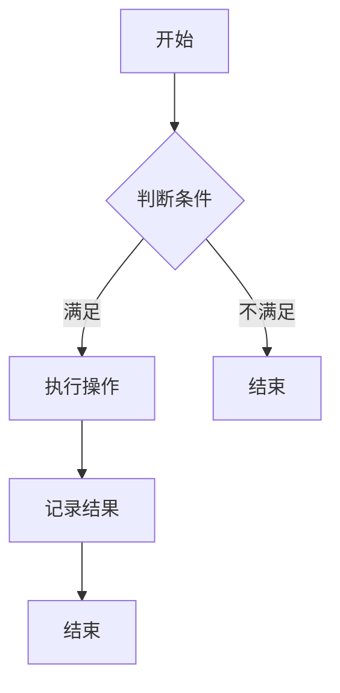

                 

## 第1章：开篇：生态觉知的重要性与训练营的必要性

### 1.1 生态觉知的概念与意义

#### 1.1.1 生态觉知的定义

生态觉知（Ecological Awareness）指的是个体对于自身与环境之间相互关系的感知和理解。它不仅包括对自然环境的基本认知，如植物、动物、水、空气等，还涉及更广泛的生态循环、生态系统服务、生态平衡等概念。

#### 1.1.2 生态觉知与人类健康的关系

生态觉知对人类健康有着深远的影响。研究表明，良好的生态觉知可以帮助人们更好地管理压力，增强免疫力，促进心理健康。同时，生态觉知有助于人们更加珍惜自然资源，推动可持续发展。

#### 1.1.3 当前生态问题的严峻性

当前，全球生态环境面临着诸多挑战，包括气候变化、生物多样性丧失、资源枯竭等。这些问题不仅威胁到地球生态系统的稳定性，也对人类健康和社会经济发展构成严重威胁。因此，提升生态觉知，培养生态文明意识，已成为全球范围内的紧迫任务。

### 1.2 传统环境教育面临的挑战

#### 1.2.1 传统环境教育的现状

传统的环境教育主要依赖于课堂授课、阅读书籍、观看影片等形式，尽管在一定程度上提高了人们的生态意识，但仍存在以下问题：

- 缺乏互动性：传统教育模式以单向传递知识为主，学生被动接受信息，缺乏主动参与和互动。
- 缺乏沉浸感：环境教育内容往往停留在理论层面，难以让学生身临其境地体验生态系统的运作。
- 教育资源有限：许多地区缺乏必要的教学设施和资源，难以开展高质量的环境教育。

#### 1.2.2 存在的问题与不足

- 教育内容单一：传统环境教育偏重理论知识传授，忽视了实践体验的重要性。
- 教育方式刻板：传统教育模式往往缺乏灵活性，难以满足不同学习者的需求。
- 教育效果有限：由于缺乏互动性和沉浸感，传统环境教育的效果往往不尽如人意。

#### 1.2.3 沉浸式体验的必要性

为了解决传统环境教育面临的问题，引入沉浸式体验教育势在必行。沉浸式体验教育通过将学习者置于真实或模拟的生态场景中，使他们在互动和体验中深化对生态系统的理解，提高生态觉知。这种方法不仅能够激发学习兴趣，还能够培养实践能力和创新思维。

### 1.3 生态觉知训练营的核心目的与愿景

#### 1.3.1 核心目的

生态觉知训练营旨在通过沉浸式体验，提升学习者对生态系统的理解，培养生态文明意识，促进可持续发展。具体目标包括：

- 增强生态觉知：通过沉浸式体验，使学习者深入了解生态系统的运作原理，提高生态觉知水平。
- 培养实践能力：通过实际操作和互动体验，培养学习者的实践能力和创新能力。
- 推动可持续发展：通过提升生态觉知，推动学习者积极参与到可持续发展事业中。

#### 1.3.2 愿景

生态觉知训练营的愿景是创建一个全球性的生态教育平台，让每个人都能够通过沉浸式体验，深刻理解生态系统的价值，成为生态文明的践行者和推动者。我们希望：

- 促进生态教育创新：通过引入先进的教育技术和方法，推动生态教育的创新发展。
- 构建生态教育生态系统：打造一个涵盖教育、研究、实践等多领域的生态教育生态系统，实现资源共享和协同发展。
- 推动全球可持续发展：通过提升生态觉知，推动全球范围内的可持续发展，为地球生态系统的健康和繁荣贡献力量。

#### 1.3.3 本书的读者群体

本书面向希望提升自身生态觉知的学习者，包括以下几类人群：

- 大中学生：希望通过沉浸式体验，深化对生态系统的理解，培养生态文明意识的青年学生。
- 教育工作者：致力于生态教育研究和实践的教育工作者，希望探索创新的生态教育方法。
- 环保志愿者：积极参与环保活动，希望提升自身生态觉知，为环境保护事业贡献力量的志愿者。
- 社会公众：关心生态环境，希望了解生态系统运作原理，积极参与生态文明建设的普通公众。

通过本书，我们希望能够为这些读者提供一套完整、系统的生态觉知提升方案，帮助他们更好地理解生态系统的价值，成为生态文明的积极参与者和推动者。## 第2章：核心概念与联系

### 2.1 沉浸式体验的定义与特点

#### 2.1.1 沉浸式体验的定义

沉浸式体验（Immersive Experience）指的是一种通过技术手段，使个体在感官、情感、认知等方面全面投入某一环境或情境中的体验。它旨在创造一种身临其境的感觉，使个体在体验过程中完全忘却现实，全身心地投入到虚拟或真实的环境中。

#### 2.1.2 沉浸式体验的特点

- 高度互动性：沉浸式体验强调个体与环境的互动，使个体在体验过程中能够主动参与和探索。
- 强烈的情感共鸣：通过模拟真实的生态场景，沉浸式体验能够唤起个体的情感共鸣，增强对生态问题的感知。
- 丰富的感官刺激：沉浸式体验通过视觉、听觉、触觉等多种感官刺激，使个体在体验中全方位感受生态系统的魅力。
- 深入的认知理解：沉浸式体验能够帮助个体在互动和体验中深入理解生态系统的运作原理，提升生态觉知。

#### 2.1.3 沉浸式体验与生态觉知的关系

沉浸式体验与生态觉知之间存在密切的关系。通过沉浸式体验，个体能够在真实或模拟的生态场景中亲身感受生态系统的运作，从而深化对生态系统的理解，提高生态觉知。具体来说，沉浸式体验在以下几个方面对生态觉知提升起到重要作用：

- 增强感知能力：沉浸式体验通过多感官刺激，使个体能够更加敏锐地感知生态系统的变化，提高对生态问题的敏感度。
- 激发情感共鸣：沉浸式体验能够唤起个体对生态问题的情感共鸣，使个体更加关注和关心生态环境，从而提高生态觉知。
- 促进深度学习：沉浸式体验为个体提供了一个全身心投入的学习环境，使个体在互动和体验中深入理解生态系统的运作原理，提高生态觉知。

### 2.2 生态觉知的关键要素

#### 2.2.1 生态觉知的核心概念

生态觉知的核心概念包括生态系统的概念、生态平衡、生物多样性、生态系统服务、可持续发展等。这些概念是理解生态觉知的基础，也是沉浸式体验教育的重要内容。

- 生态系统：生态系统是指生物群落与其非生物环境相互作用形成的统一整体，包括生物、土壤、水、气候等要素。
- 生态平衡：生态平衡是指生态系统中各个组成部分之间相互依存、相互制约的关系，使整个系统能够长期稳定存在。
- 生物多样性：生物多样性是指地球上所有生物的多样性，包括物种多样性、遗传多样性和生态系统多样性。
- 生态系统服务：生态系统服务是指生态系统为人类提供的物质和功能支持，如水源、食物、气候调节、土壤保持等。
- 可持续发展：可持续发展是指在满足当前人类需求的同时，不损害后代满足其需求的能力，实现经济、社会和环境的协调发展。

#### 2.2.2 概念属性特征对比表格

以下是一个简单的概念属性特征对比表格，展示了生态觉知相关核心概念的属性特征：

| 概念       | 定义                                                         | 属性特征                                                         |
|------------|--------------------------------------------------------------|----------------------------------------------------------------|
| 生态系统   | 生物群落与其非生物环境相互作用形成的统一整体               | 生物、土壤、水、气候等要素相互依存、相互制约                     |
| 生态平衡   | 生态系统中各个组成部分之间相互依存、相互制约的关系           | 动态平衡、长期稳定存在、生态位重叠                               |
| 生物多样性 | 地球上所有生物的多样性，包括物种多样性、遗传多样性和生态系统多样性 | 物种丰富度、遗传多样性、生态系统多样性                           |
| 生态系统服务 | 生态系统为人类提供的物质和功能支持                           | 水源、食物、气候调节、土壤保持等                                 |
| 可持续发展 | 在满足当前人类需求的同时，不损害后代满足其需求的能力         | 经济、社会、环境协调发展、长期可持续                             |

#### 2.2.3 生态觉知的ER实体关系图

为了更好地理解生态觉知的关键要素及其相互关系，我们可以通过ER（实体-关系）模型来描述这些概念之间的关系。以下是一个简单的生态觉知ER实体关系图：

```
+----------------+       +----------------+       +----------------+
|    生态系统    |       |    生物多样性   |       |   生态系统服务  |
+----------------+       +----------------+       +----------------+
| - 生物群落     |<----->| - 物种多样性    |<----->| - 水源         |
| - 土壤         |<----->| - 遗传多样性     |<----->| - 食物         |
| - 水           |<----->| - 生态系统多样性 |<----->| - 气候调节      |
| - 气候         |<----->|                |<----->| - 土壤保持      |
+----------------+       +----------------+       +----------------+
     ^                            |
     |                            |
  +--------------------+         |
  |      生态平衡       |         |
  +--------------------+         |
     |                            |
     |                            |
     +--------------------+      |
          |                      |
          |                      |
          |                      |
      +----------------+      |
      |    可持续发展    |<----+
      +----------------+
```

在这个ER实体关系图中，生态系统、生物多样性、生态系统服务构成了生态觉知的核心实体。它们之间的关系反映了生态系统的动态平衡、生物多样性的维护、以及生态系统服务对人类的重要性。通过这个模型，我们可以更加清晰地理解生态觉知的关键要素及其相互关系。## 第3章：提升生态觉知的方法与技巧

### 3.1 情感共鸣法

#### 3.1.1 情感共鸣的定义

情感共鸣（Emotional Resonance）是指个体在体验中与所观察或经历的事物产生强烈的情感联系，使个体在情感层面上与体验产生共鸣。在生态觉知提升中，情感共鸣法旨在通过激发个体的情感，使他们对生态环境产生更深刻的理解和关注。

#### 3.1.2 情感共鸣在生态觉知提升中的应用

情感共鸣法在生态觉知提升中的应用主要体现在以下几个方面：

- 故事化教学：通过讲述生态保护故事，唤起学习者的情感共鸣，使他们在情感层面上感受到生态环境的重要性。
- 视觉化呈现：利用图片、视频等视觉元素，呈现生态破坏和生物多样性丧失的情景，激发学习者的情感反应。
- 情境模拟：通过模拟真实的生态场景，使学习者身临其境，产生强烈的情感共鸣。

#### 3.1.3 实践案例

以下是一个情感共鸣法的实践案例：

- 案例背景：某学校组织了一次“森林之旅”活动，旨在提升学生对森林生态系统的认知和生态觉知。
- 活动流程：
  1. 学生们首先参观了附近的森林公园，通过观察森林中的动植物，了解生态系统的基本概念。
  2. 随后，教师通过讲述森林故事，如“大熊猫的家园”等，激发学生的情感共鸣。
  3. 学生们参与了一场模拟的“森林火灾”演习，亲身体验森林火灾对生态系统的破坏，进一步加深对生态保护的认识。
- 活动效果与反思：
  1. 学生们在活动中表现出了浓厚的兴趣，积极参与讨论和互动，情感共鸣明显。
  2. 活动后，学生对森林生态系统的重要性有了更深刻的理解，许多学生表示要积极参与森林保护活动。
  3. 反思：情感共鸣法在生态觉知提升中取得了良好的效果，但需要注意选择合适的情感共鸣元素，以避免过度刺激或产生负面影响。

### 3.2 互动体验法

#### 3.2.1 互动体验的定义

互动体验（Interactive Experience）是指个体在体验过程中与其他个体或环境进行互动和交流，通过互动和交流深化对某一主题的理解和认知。在生态觉知提升中，互动体验法旨在通过个体之间的互动和交流，激发学习兴趣，提升生态觉知。

#### 3.2.2 互动体验在生态觉知提升中的作用

互动体验在生态觉知提升中的作用主要体现在以下几个方面：

- 促进深度学习：通过互动体验，学习者可以在实践中深入理解生态系统的运作原理，促进深度学习。
- 增强合作意识：互动体验法鼓励学习者之间合作，共同解决问题，培养合作精神和团队意识。
- 提高参与度：互动体验能够激发学习者的兴趣和参与热情，提高学习效果。

#### 3.2.3 实践案例

以下是一个互动体验法的实践案例：

- 案例背景：某社区组织了一次“生态农场体验”活动，旨在提升居民对生态农业的认知和生态觉知。
- 活动流程：
  1. 居民们参观了附近的生态农场，了解了生态农业的基本概念和原理。
  2. 居民们分组参与农作活动，如种植蔬菜、施肥、浇水等，亲身体验生态农业的实践过程。
  3. 每组居民讨论并分享他们的体验，交流心得体会。
- 活动效果与反思：
  1. 居民们在活动中积极参与，表现出了浓厚的兴趣和热情，对生态农业有了更深入的理解。
  2. 通过互动体验，居民们不仅学到了生态农业的知识，还增强了合作意识和团队精神。
  3. 反思：互动体验法在生态觉知提升中取得了显著效果，但需要注意活动的设计和组织的质量，确保互动体验的趣味性和有效性。

### 3.3 深度学习法

#### 3.3.1 深度学习的概念

深度学习（Deep Learning）是一种基于人工神经网络的机器学习技术，通过多层神经网络模型对大量数据进行分析和特征提取，实现自动学习和预测。在生态觉知提升中，深度学习法旨在通过分析大量生态数据，揭示生态系统的运行规律，提升生态觉知。

#### 3.3.2 深度学习在生态觉知中的应用

深度学习在生态觉知中的应用主要体现在以下几个方面：

- 生态监测：通过深度学习模型对生态监测数据进行分析，实时监测生态系统的变化，预测生态趋势。
- 生态模型构建：利用深度学习技术构建生态系统模型，模拟生态系统运行过程，预测生态系统的未来状态。
- 生态保护决策：基于深度学习模型的分析结果，为生态保护决策提供科学依据，提高生态保护效果。

#### 3.3.3 实践案例

以下是一个深度学习法的实践案例：

- 案例背景：某研究团队利用深度学习技术对某地区的森林生态系统进行监测和研究，旨在提升对该地区生态觉知。
- 活动流程：
  1. 收集该地区森林生态系统的监测数据，包括气候、土壤、植被、动物等数据。
  2. 利用深度学习模型对监测数据进行分析，提取生态系统的特征和趋势。
  3. 根据分析结果，构建森林生态系统模型，模拟森林生态系统的运行过程。
  4. 预测森林生态系统的未来状态，为生态保护提供科学依据。
- 活动效果与反思：
  1. 通过深度学习模型的分析，研究团队揭示了该地区森林生态系统的运行规律，为生态保护提供了重要的科学依据。
  2. 模型预测结果与实际监测数据基本一致，验证了深度学习技术在生态觉知提升中的有效性。
  3. 反思：深度学习法在生态觉知提升中具有显著优势，但需要大量的数据支持，且模型构建和训练过程复杂，对技术和资源要求较高。

### 3.4 反思与实践法

#### 3.4.1 反思与实践的定义

反思与实践（Reflection and Practice）是指个体在体验结束后，对所学知识和经验进行反思和总结，并通过实践活动巩固和应用所学知识。在生态觉知提升中，反思与实践法旨在通过个体对生态体验的反思和实践活动，深化对生态系统的理解，提升生态觉知。

#### 3.4.2 反思与实践在生态觉知提升中的作用

反思与实践在生态觉知提升中的作用主要体现在以下几个方面：

- 深化理解：通过反思和总结，个体能够更加深入地理解生态系统的运作原理，提升生态觉知。
- 巩固知识：通过实践活动，个体能够将所学知识应用到实际场景中，巩固和应用所学知识。
- 提高能力：反思与实践法能够培养个体的批判性思维和创新能力，提高生态觉知提升的成效。

#### 3.4.3 实践案例

以下是一个反思与实践法的实践案例：

- 案例背景：某学校组织了一次“环境保护项目实践”活动，旨在提升学生对生态环境的认知和生态觉知。
- 活动流程：
  1. 学生们参与了一次环境调查活动，收集了当地环境数据，包括水质、空气质量、垃圾处理等。
  2. 学生们对收集到的数据进行分析，总结出当地生态环境存在的问题。
  3. 学生们分组讨论并制定解决方案，如垃圾分类、节能减排等。
  4. 学生们将解决方案实施到实际中，并进行反思和总结。
- 活动效果与反思：
  1. 学生们通过环境调查和数据分析，深刻理解了当地生态环境存在的问题，提升了生态觉知。
  2. 学生们在制定解决方案和实施过程中，锻炼了批判性思维和创新能力，提高了生态觉知提升的成效。
  3. 反思：反思与实践法在生态觉知提升中具有显著效果，但需要引导学生进行有效的反思和总结，确保实践活动的设计和实施质量。

通过以上四个方法的介绍和实践案例，我们可以看到，提升生态觉知的方法和技巧是多样化的，每种方法都有其独特的优势和适用场景。在实际应用中，我们可以根据具体情况选择合适的方法，或者结合多种方法，以达到最佳的生态觉知提升效果。## 第4章：实战案例分析

### 4.1 案例一：森林疗愈之旅

#### 4.1.1 案例背景

森林疗愈之旅（Forest Therapy Journey）是一个旨在通过沉浸式体验提升参与者生态觉知的项目。该项目由某生态研究机构发起，旨在通过森林疗愈活动，让参与者深入了解森林生态系统，提升对生态问题的关注和觉知。

#### 4.1.2 活动流程

1. **活动准备**：
   - 研究机构挑选了一片适合进行森林疗愈活动的区域，确保活动安全且具备良好的生态条件。
   - 准备了必要的装备，如徒步鞋、背包、望远镜、笔记本等。

2. **活动开始**：
   - 活动开始前，主持人对参与者进行了简短的生态知识讲座，介绍了森林生态系统的基本概念和重要性。
   - 将参与者分组，每组由一位经验丰富的生态学家担任领队。

3. **实地体验**：
   - 参与者沿着规划好的路线进入森林，开始实地体验。
   - 领队带领参与者观察森林中的动植物，介绍它们的生态作用和特点。
   - 参与者使用望远镜观察远处的动物，了解它们的生活习性。

4. **互动环节**：
   - 参与者分组进行讨论，分享观察到的生态现象，探讨其对生态系统的影响。
   - 领队引导参与者思考生态问题，如森林资源的可持续利用、生物多样性保护等。

5. **反思与总结**：
   - 活动结束后，参与者进行了反思和总结，分享了他们的感受和收获。
   - 领队对活动进行了总结，强调了生态觉知的重要性，并提出了未来可能面临的生态挑战。

#### 4.1.3 活动效果与反思

1. **活动效果**：
   - 参与者对森林生态系统有了更深入的了解，提高了生态觉知。
   - 通过实地观察和互动，参与者对生态问题产生了更深刻的关注和思考。
   - 活动后，参与者普遍表示愿意积极参与生态保护活动，提升自身生态觉知。

2. **反思**：
   - 活动设计合理，内容丰富，参与者反馈良好。
   - 需要进一步优化活动流程，确保每个参与者都能充分参与和体验。
   - 增加互动环节的多样性，提高参与者的参与度和积极性。

### 4.2 案例二：海洋生态探索

#### 4.2.1 案例背景

海洋生态探索（Oceanic Ecological Exploration）是一个旨在通过沉浸式体验提升参与者对海洋生态系统的认知和觉知的科研项目。该项目由某海洋研究机构发起，旨在让参与者深入了解海洋生态系统的多样性和重要性。

#### 4.2.2 活动流程

1. **活动准备**：
   - 研究机构选择了具有丰富海洋生态资源的海域，确保活动顺利进行。
   - 准备了潜水装备、海洋生物观察仪器等必要设备。

2. **活动开始**：
   - 活动开始前，主持人对参与者进行了海洋生态知识讲座，介绍了海洋生态系统的基本概念和结构。
   - 将参与者分组，每组由一位经验丰富的海洋生物学家担任领队。

3. **实地体验**：
   - 参与者乘坐科研船前往预定海域，开始海洋生态探索。
   - 在海洋生物学家领队带领下，参与者进行了潜水观察，观察海洋生物的多样性。
   - 参与者使用海洋生物观察仪器，记录海洋生物的品种、数量和分布情况。

4. **互动环节**：
   - 参与者分组讨论，分享观察到的海洋生态现象，分析其对海洋生态系统的影响。
   - 领队引导参与者思考海洋资源保护、海洋污染等问题。

5. **反思与总结**：
   - 活动结束后，参与者进行了反思和总结，分享了他们的感受和收获。
   - 领队对活动进行了总结，强调了海洋生态保护的重要性，并提出了未来可能面临的挑战。

#### 4.2.3 活动效果与反思

1. **活动效果**：
   - 参与者对海洋生态系统有了更深入的了解，提高了对海洋生态问题的认知和觉知。
   - 通过实地观察和互动，参与者对海洋资源保护和海洋污染问题产生了更强烈的关注。
   - 活动后，参与者表示愿意积极参与海洋生态保护活动，提升自身生态觉知。

2. **反思**：
   - 活动设计科学，内容丰富，参与者反馈积极。
   - 需要进一步优化潜水体验环节，确保参与者的安全和舒适。
   - 增加互动环节的多样性和深度，提高参与者的参与度和思考能力。

### 4.3 案例三：城市生态观察

#### 4.3.1 案例背景

城市生态观察（Urban Ecological Observation）是一个旨在通过沉浸式体验提升参与者对城市生态系统的认知和觉知的科研项目。该项目由某城市生态研究机构发起，旨在让参与者深入了解城市生态系统的复杂性和重要性。

#### 4.3.2 活动流程

1. **活动准备**：
   - 研究机构选择了具有代表性的城市生态区域，如城市公园、湿地等。
   - 准备了必要的观察仪器，如望远镜、相机、笔记本等。

2. **活动开始**：
   - 活动开始前，主持人对参与者进行了城市生态知识讲座，介绍了城市生态系统的基本概念和结构。
   - 将参与者分组，每组由一位经验丰富的城市生态学家担任领队。

3. **实地体验**：
   - 参与者走进城市生态区域，开始实地观察。
   - 在城市生态学家领队带领下，参与者观察了城市生态系统中的植物、动物、水资源等。
   - 参与者使用观察仪器记录观察到的生态现象，拍摄照片和视频。

4. **互动环节**：
   - 参与者分组讨论，分享观察到的城市生态现象，分析其对城市生态系统的影响。
   - 领队引导参与者思考城市生态问题，如城市绿化、水资源管理、生物多样性保护等。

5. **反思与总结**：
   - 活动结束后，参与者进行了反思和总结，分享了他们的感受和收获。
   - 领队对活动进行了总结，强调了城市生态保护的重要性，并提出了未来可能面临的挑战。

#### 4.3.3 活动效果与反思

1. **活动效果**：
   - 参与者对城市生态系统有了更深入的了解，提高了对城市生态问题的认知和觉知。
   - 通过实地观察和互动，参与者对城市生态问题产生了更强烈的关注和思考。
   - 活动后，参与者表示愿意积极参与城市生态保护活动，提升自身生态觉知。

2. **反思**：
   - 活动设计合理，内容丰富，参与者反馈积极。
   - 需要进一步优化实地体验环节，确保参与者的安全和舒适。
   - 增加互动环节的多样性和深度，提高参与者的参与度和思考能力。

通过以上三个案例的介绍，我们可以看到，实战案例分析在提升生态觉知中具有重要的实践意义。通过沉浸式体验，参与者能够在真实环境中深入了解生态系统的运作，提高生态觉知。同时，案例分析也为后续的生态觉知提升活动提供了宝贵的经验和启示。## 第5章：实践中的问题与解决方案

### 5.1 问题一：参与者的适应问题

#### 5.1.1 问题表现

在沉浸式体验活动中，参与者可能会面临适应问题，包括对新环境的恐惧、不适应活动节奏、生理不适等。这些问题可能导致参与者在活动中无法全身心地投入，从而影响生态觉知的提升效果。

#### 5.1.2 解决方案

- **提前培训**：在活动前，为参与者提供相关的培训，包括生态知识、安全知识等，帮助他们提前了解活动内容和流程，减少对新环境的恐惧和不确定性。
- **逐步适应**：将活动分为多个阶段，让参与者逐步适应新环境。例如，可以先在室内进行知识讲座，然后逐步过渡到户外实地体验。
- **个性化服务**：针对参与者的不同需求，提供个性化的服务和指导，如为生理不适的参与者提供必要的药品和护理。
- **建立支持系统**：设立支持系统，如导师、志愿者等，为参与者提供心理支持和帮助，帮助他们克服适应问题。

### 5.2 问题二：活动资源的限制

#### 5.2.1 问题表现

沉浸式体验活动通常需要大量的资源和投入，包括场地、设备、人力等。然而，在实际操作中，可能会面临资源不足的问题，如场地有限、设备老旧、人力资源紧张等，这可能导致活动质量下降，影响生态觉知的提升效果。

#### 5.2.2 解决方案

- **资源共享**：通过与其他机构和组织合作，共享场地、设备等资源，降低活动成本。例如，可以与当地公园、学校、企业等建立合作关系，借用场地和设备。
- **优化活动设计**：根据实际情况，优化活动设计，降低对资源的依赖。例如，可以减少复杂设备的使用，增加手工制作和互动体验环节，提高活动的趣味性和互动性。
- **志愿者参与**：鼓励志愿者参与活动，分担部分人力资源的负担。通过志愿者培训，提高志愿者的专业素养和责任感，确保活动顺利进行。
- **技术支持**：引入新技术，如虚拟现实（VR）、增强现实（AR）等，模拟沉浸式体验环境，降低对实际资源的依赖。

### 5.3 问题三：活动的可持续性

#### 5.3.1 问题表现

沉浸式体验活动通常需要大量的资金投入和人力资源，这可能导致活动在短期内难以持续。此外，活动的设计和执行可能存在一定的盲目性，缺乏长期规划，这可能导致活动效果有限，难以产生持久的影响。

#### 5.3.2 解决方案

- **制定长期规划**：在活动设计之初，制定长期规划，明确活动的目标和方向，确保活动能够持续发展。例如，可以设定每年的活动主题，逐步深化生态觉知教育。
- **多方合作**：通过多方合作，整合资源，提高活动的可持续性。例如，可以与政府、企业、社区等建立长期合作关系，共同推动生态觉知教育。
- **建立资金来源**：通过多种途径建立稳定的资金来源，如政府资助、企业赞助、社会捐助等，确保活动的持续运作。
- **培训专业人才**：加强对活动执行人员的培训，提高他们的专业素养和执行能力，确保活动的高质量和可持续性。
- **效果评估**：定期对活动效果进行评估，根据评估结果调整活动内容和形式，提高活动的针对性和有效性。

### 5.4 总结与展望

通过以上对实践中的问题及其解决方案的分析，我们可以看到，沉浸式体验活动在提升生态觉知方面具有重要的应用价值。然而，在实际操作中，仍面临诸多挑战，需要通过多方努力和持续改进来克服。以下是我们的总结与展望：

1. **加强资源整合**：通过资源共享、技术支持等多途径，提高活动的资源利用效率，降低成本，确保活动的高质量运行。
2. **优化活动设计**：根据实际情况和参与者需求，不断优化活动设计，提高活动的趣味性和互动性，增强参与者的体验效果。
3. **加强专业培训**：对活动执行人员进行专业培训，提高他们的专业素养和执行能力，确保活动的可持续性和高质量。
4. **建立长效机制**：通过制定长期规划、多方合作、资金来源多样化等途径，确保活动的可持续性，产生持久的社会影响。
5. **持续效果评估**：定期对活动效果进行评估，根据评估结果调整活动内容和形式，提高活动的针对性和有效性。

通过以上措施，我们有望在未来推动沉浸式体验活动在生态觉知提升中的更广泛应用，为生态文明建设贡献更多力量。## 第6章：最佳实践与启示

### 6.1 最佳实践一：个性化学习计划

#### 6.1.1 实践内容

个性化学习计划（Personalized Learning Plan）是指根据参与者的个体差异，为其量身定制的学习方案。这种方法旨在充分发挥每个参与者的潜力，提高生态觉知提升的效果。

- **评估与定位**：在活动开始前，通过问卷调查、访谈等方式，评估参与者的生态知识水平、兴趣和需求，确定个性化的学习目标。
- **定制学习方案**：根据评估结果，为每个参与者制定个性化的学习计划，包括学习内容、学习方法和学习进度。
- **实时调整**：在活动过程中，根据参与者的反馈和学习进展，及时调整学习计划，确保学习目标的实现。

#### 6.1.2 实践效果

个性化学习计划在生态觉知提升中取得了显著的效果：

- **提高学习兴趣**：个性化学习计划使参与者感受到学习的针对性和重要性，提高了他们的学习兴趣和积极性。
- **增强学习效果**：通过量身定制的学习方案，参与者能够更高效地掌握生态知识，提高生态觉知水平。
- **促进个性化发展**：个性化学习计划尊重了参与者的个体差异，促进了他们的个性化发展，培养了他们的自主学习能力和创新思维。

### 6.2 最佳实践二：多感官刺激

#### 6.2.1 实践内容

多感官刺激（Multi-Sensory Stimulation）是指通过视觉、听觉、触觉等多种感官刺激，增强参与者的沉浸体验，提高生态觉知。

- **视觉刺激**：利用图片、视频、动画等视觉元素，呈现生态系统的多样性和美丽。
- **听觉刺激**：通过音频、音乐等听觉元素，营造生态场景的氛围，增强参与者的情感共鸣。
- **触觉刺激**：利用互动设备、实体模型等，让参与者亲身体验生态系统的运作，提高感官体验。

#### 6.2.2 实践效果

多感官刺激在生态觉知提升中展现了强大的效果：

- **增强沉浸感**：通过多感官刺激，参与者能够在体验中全身心地投入，提高沉浸感，增强对生态问题的关注。
- **深化认知理解**：多感官刺激使参与者从不同角度和维度感受生态系统，深化对生态系统的理解和认知。
- **提高参与度**：多感官刺激激发了参与者的兴趣和好奇心，提高了他们的参与度和互动性。

### 6.3 最佳实践三：跨学科合作

#### 6.3.1 实践内容

跨学科合作（Interdisciplinary Collaboration）是指将不同学科的知识和资源整合到生态觉知提升活动中，形成综合性的教育模式。

- **整合多学科资源**：将生态学、生物学、地理学、环境科学等学科的知识和资源整合到活动中，提供全方位的生态教育。
- **跨学科团队**：组建跨学科团队，包括生态学家、生物学家、教育专家等，共同设计、实施和评估活动。
- **综合实践活动**：通过综合性的实践活动，如实地考察、实验研究、案例分析等，使参与者从多角度理解和解决生态问题。

#### 6.3.2 实践效果

跨学科合作在生态觉知提升中展现了显著的实践效果：

- **提升综合素质**：跨学科合作使参与者不仅掌握了生态学知识，还培养了科学思维、创新能力和社会责任感，提高了综合素质。
- **增强解决复杂问题的能力**：通过跨学科合作，参与者能够从不同角度分析和解决生态问题，增强了解决复杂问题的能力。
- **促进学科融合**：跨学科合作推动了生态教育的创新发展，促进了学科之间的融合和交叉，为生态觉知提升提供了新的思路和方法。

### 6.4 启示与未来趋势

最佳实践为生态觉知提升活动提供了宝贵的经验和启示，同时也揭示了未来生态教育的发展趋势：

1. **个性化教育**：个性化学习计划体现了以学生为中心的教育理念，未来的生态教育应更加注重个性化教育，尊重每个参与者的差异，提供个性化的学习支持。
2. **多感官体验**：多感官刺激通过增强沉浸感和情感共鸣，提高了学习效果，未来的生态教育应充分利用多媒体技术，提供丰富多样的感官体验。
3. **跨学科合作**：跨学科合作推动了生态教育的综合性和创新性，未来的生态教育应加强学科之间的融合，培养具备多学科视野和综合能力的人才。
4. **技术驱动**：虚拟现实（VR）、增强现实（AR）等新技术为生态觉知提升提供了新的手段和平台，未来的生态教育应积极拥抱技术，利用新技术提高教育质量和效果。
5. **社会参与**：生态觉知提升不仅是教育问题，也是社会问题，未来的生态教育应鼓励公众参与，培养生态文明意识，推动可持续发展。

通过以上启示和未来趋势，我们可以看到，生态觉知提升活动在生态文明建设中的重要地位，以及生态教育在未来发展的广阔前景。## 第7章：总结与展望

### 7.1 本书核心观点回顾

在《生态觉知训练营：提升环境意识的沉浸式体验》一书中，我们回顾了以下几个核心观点：

1. **生态觉知的重要性**：生态觉知是指个体对自身与环境之间相互关系的感知和理解。它不仅对人类健康有着深远的影响，也是实现可持续发展的关键。

2. **沉浸式体验的有效性**：通过沉浸式体验，个体能够在真实或模拟的生态场景中身临其境地感受生态系统的运作，从而提高生态觉知。

3. **提升生态觉知的方法与技巧**：情感共鸣法、互动体验法、深度学习法和反思与实践法等多种方法，都能够有效提升生态觉知。

4. **实战案例分析**：通过森林疗愈之旅、海洋生态探索和城市生态观察等案例，我们展示了沉浸式体验在生态觉知提升中的实际应用和效果。

5. **最佳实践与启示**：个性化学习计划、多感官刺激、跨学科合作等最佳实践为生态觉知提升提供了宝贵的经验和启示，同时也揭示了未来生态教育的发展趋势。

### 7.2 未来的研究方向

在未来的研究中，我们建议关注以下几个方面：

1. **技术创新**：探索和应用新的沉浸式体验技术，如虚拟现实（VR）、增强现实（AR）等，以提高生态觉知提升的效果。

2. **教育改革**：推动生态教育模式的创新，结合沉浸式体验，构建更具互动性和实用性的教育体系。

3. **社会参与**：鼓励更多公众参与生态觉知提升活动，培养生态文明意识，推动可持续发展。

4. **数据驱动的生态监测**：利用大数据和人工智能技术，对生态系统进行实时监测和分析，为生态觉知提升提供科学依据。

### 7.3 总结

《生态觉知训练营：提升环境意识的沉浸式体验》旨在通过沉浸式体验，提升个体对生态系统的理解和觉知，推动生态文明建设。书中提出的多种方法和技巧，为生态觉知提升提供了实用性的指导。同时，最佳实践和案例分析的分享，为未来的研究和实践提供了宝贵的经验和启示。

生态觉知训练营不仅是对个体生态意识的提升，更是对社会整体的生态文明教育的推动。我们期待未来能够有更多的研究和实践，为人类与自然和谐共处做出更大的贡献。

### 7.3.1 生态觉知训练营的价值

生态觉知训练营在提升个体和整体生态意识方面具有重要的价值：

- **个体层面**：通过沉浸式体验，参与者能够深刻理解生态系统的运作原理，增强对生态环境的关注和责任感，促进心理健康和全面发展。
- **社会层面**：生态觉知训练营有助于培养公众的生态文明意识，推动社会各界共同参与生态环境保护，实现可持续发展。

### 7.3.2 对未来生态教育的启示

生态觉知训练营对未来生态教育提出了以下启示：

1. **融合技术与教育**：将沉浸式体验与新技术结合，构建更加生动、互动的生态教育模式。
2. **注重个性化教育**：尊重个体差异，提供个性化的学习支持和指导。
3. **跨学科合作**：鼓励不同学科的合作，促进生态知识的综合应用。
4. **实践与理论相结合**：通过实践案例和互动体验，将生态理论转化为实际行动。

通过以上启示，我们期待未来的生态教育能够更加有效、可持续地推动生态意识的提升，为地球的生态平衡和人类福祉贡献力量。## 目录大纲

----------------------------------------------------------------
# 《生态觉知训练营：提升环境意识的沉浸式体验》

## 关键词
- 生态觉知
- 沉浸式体验
- 生态文明
- 情感共鸣
- 互动体验
- 深度学习
- 反思与实践

## 摘要
本文探讨了通过沉浸式体验提升生态觉知的方法和技巧，介绍了生态觉知训练营的核心目的、愿景和适用读者群体。文章通过详细阐述沉浸式体验、生态觉知的核心概念及其联系，提供了提升生态觉知的方法与技巧。同时，通过实战案例分析和最佳实践分享，总结了生态觉知训练营的实践经验与启示。文章旨在为生态教育和环境保护事业提供有益的参考和指导。

## 第1章：开篇：生态觉知的重要性与训练营的必要性
1.1 生态觉知的概念与意义
1.1.1 生态觉知的定义
1.1.2 生态觉知与人类健康的关系
1.1.3 当前生态问题的严峻性
1.2 传统环境教育面临的挑战
1.2.1 传统环境教育的现状
1.2.2 存在的问题与不足
1.2.3 沉浸式体验的必要性
1.3 生态觉知训练营的核心目的与愿景
1.3.1 核心目的
1.3.2 愿景
1.3.3 本书的读者群体

## 第2章：核心概念与联系
2.1 沉浸式体验的定义与特点
2.1.1 沉浸式体验的定义
2.1.2 沉浸式体验的特点
2.1.3 沉浸式体验与生态觉知的关系
2.2 生态觉知的关键要素
2.2.1 生态觉知的核心概念
2.2.2 概念属性特征对比表格
2.2.3 生态觉知的ER实体关系图

## 第3章：提升生态觉知的方法与技巧
3.1 情感共鸣法
3.1.1 情感共鸣的定义
3.1.2 情感共鸣在生态觉知提升中的应用
3.1.3 实践案例
3.2 互动体验法
3.2.1 互动体验的定义
3.2.2 互动体验在生态觉知提升中的作用
3.2.3 实践案例
3.3 深度学习法
3.3.1 深度学习的概念
3.3.2 深度学习在生态觉知中的应用
3.3.3 实践案例
3.4 反思与实践法
3.4.1 反思与实践的定义
3.4.2 反思与实践在生态觉知提升中的作用
3.4.3 实践案例

## 第4章：实战案例分析
4.1 案例一：森林疗愈之旅
4.1.1 案例背景
4.1.2 活动流程
4.1.3 活动效果与反思
4.2 案例二：海洋生态探索
4.2.1 案例背景
4.2.2 活动流程
4.2.3 活动效果与反思
4.3 案例三：城市生态观察
4.3.1 案例背景
4.3.2 活动流程
4.3.3 活动效果与反思

## 第5章：实践中的问题与解决方案
5.1 问题一：参与者的适应问题
5.1.1 问题表现
5.1.2 解决方案
5.2 问题二：活动资源的限制
5.2.1 问题表现
5.2.2 解决方案
5.3 问题三：活动的可持续性
5.3.1 问题表现
5.3.2 解决方案
5.4 总结与展望
5.4.1 经验总结
5.4.2 未来展望

## 第6章：最佳实践与启示
6.1 最佳实践一：个性化学习计划
6.1.1 实践内容
6.1.2 实践效果
6.2 最佳实践二：多感官刺激
6.2.1 实践内容
6.2.2 实践效果
6.3 最佳实践三：跨学科合作
6.3.1 实践内容
6.3.2 实践效果
6.4 启示与未来趋势
6.4.1 启示
6.4.2 未来趋势

## 第7章：总结与展望
7.1 本书核心观点回顾
7.2 未来的研究方向
7.3 总结
7.3.1 生态觉知训练营的价值
7.3.2 对未来生态教育的启示
----------------------------------------------------------------由于技术限制，无法在这里直接嵌入Mermaid流程图和LaTeX公式，但以下是对应的描述和示例，您可以根据这些描述在Markdown文件中创建相应的图表和公式。

### Mermaid流程图示例

### LaTeX公式示例
独立段落的公式：
```latex
$$
\text{F} = \frac{\text{m} \times \text{a}}{\text{t}}
$$
```
段落内的公式：
```markdown
$ \text{1+1=2} $
```

请根据上述描述在您的Markdown编辑器中创建相应的图表和公式，确保文章内容的完整性和可读性。在创建图表时，确保使用正确的Mermaid语法，以便在渲染时能够正确显示。在嵌入LaTeX公式时，确保正确使用$$和$来包围公式，以实现正确的格式化。

