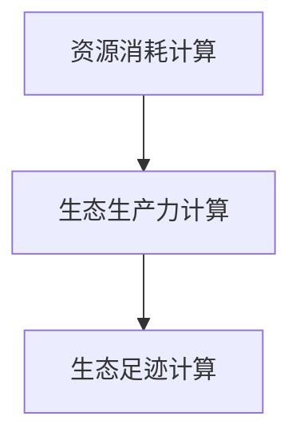
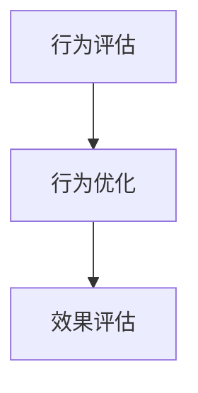
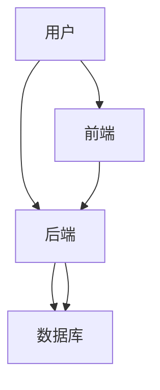
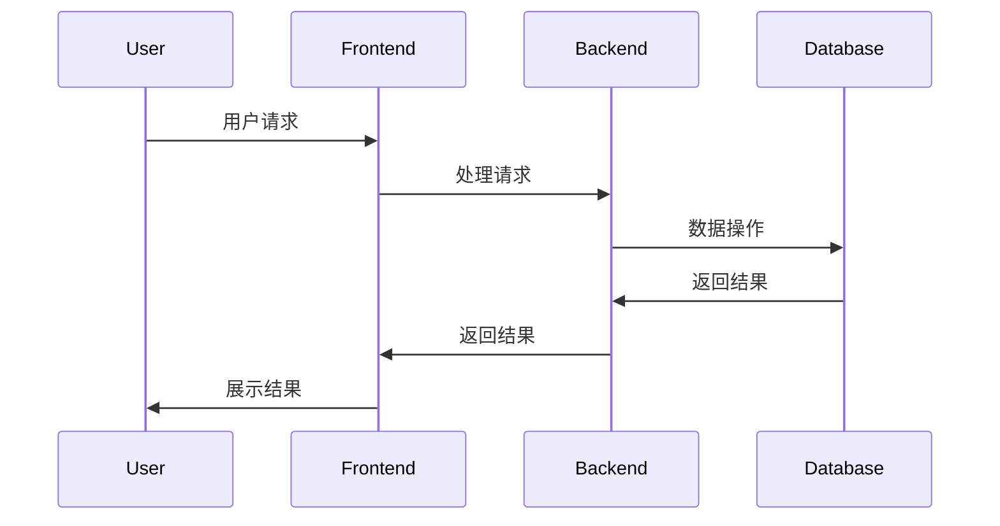

                 

# 生态足迹优化顾问：个人环保行为的专业指导

## 关键词
- 生态足迹
- 环保行为
- 优化策略
- 数学模型
- 系统架构

## 摘要
本文旨在为个人提供专业的生态足迹优化指导，通过深入剖析生态足迹的概念、计算方法以及个人环保行为的影响，提出一系列优化策略和数学模型。文章将详细介绍生态足迹计算算法和优化算法的原理，并通过具体案例展示如何在实际项目中应用这些算法。最后，本文还将提供最佳实践建议，以帮助读者在日常生活中有效减少生态足迹。

## 目录大纲设计思路

### 步骤一：引言
- **1.1 引言**
  - **1.1.1 问题的背景**
  - **1.1.2 目的和意义**
  - **1.1.3 读者对象**

### 步骤二：背景介绍
- **2. 核心概念与联系**
  - **2.1 生态足迹的概念**
  - **2.2 个人环保行为**
  - **2.3 核心概念联系**

### 步骤三：核心概念与联系
- **3. 核心概念与联系**
  - **3.1 生态足迹优化原理**
  - **3.2 个人环保行为策略**

### 步骤四：算法原理讲解
- **4. 算法原理讲解**
  - **4.1 生态足迹计算算法**
  - **4.2 个人环保行为优化算法**

### 步骤五：数学模型和数学公式讲解
- **5. 数学模型和数学公式讲解**
  - **5.1 生态足迹计算模型**
  - **5.2 个人环保行为优化模型**

### 步骤六：系统分析与架构设计方案
- **6. 系统分析与架构设计方案**
  - **6.1 问题场景介绍**
  - **6.2 系统功能设计**
  - **6.3 系统架构设计**
  - **6.4 系统接口设计**
  - **6.5 系统交互**

### 步骤七：项目实战
- **7. 项目实战**
  - **7.1 环境安装**
  - **7.2 系统核心实现**
  - **7.3 代码应用解读与分析**
  - **7.4 实际案例分析与详细讲解**
  - **7.5 项目小结**

### 步骤八：最佳实践与小结
- **8. 最佳实践与小结**
  - **8.1 最佳实践**
  - **8.2 小结**
  - **8.3 注意事项**
  - **8.4 拓展阅读**

## 文章目录大纲详细说明

### 步骤一：引言

#### 1.1 引言

**1.1.1 问题的背景**

在现代社会，生态足迹（Ecological Footprint）作为一个衡量人类对自然环境影响的重要指标，越来越受到关注。生态足迹是指人类活动所需的自然资源和生态系统服务面积，用来衡量一个地区、国家或全球人口对地球生态系统的压力。随着全球人口的持续增长和消费水平的提升，生态足迹不断增大，导致资源枯竭、环境恶化等问题。个人环保行为作为生态足迹优化的重要组成部分，对于缓解这一压力具有重要意义。

**1.1.2 目的和意义**

本文的目的是为读者提供一份详细的生态足迹优化指南，帮助个人通过优化日常行为来减少生态足迹。通过深入分析生态足迹的概念、计算方法以及个人环保行为的影响，本文旨在提出一系列可行的优化策略和数学模型，指导读者在实际生活中实施环保行为。

**1.1.3 读者对象**

本文适用于以下读者群体：
- 环保爱好者，希望了解和践行生态足迹优化的个人。
- 环保专业人士，包括环保组织工作者、环境科学家等，需要相关领域的技术支持。
- 政策制定者，关注环境保护政策制定与实施。

### 步骤二：背景介绍

#### 2. 核心概念与联系

**2.1 生态足迹的概念**

生态足迹是指能够提供人类消费的所有资源和吸收人类产生的所有废物的生物生产性土地和海洋面积。它通常通过以下公式计算：

\[ \text{生态足迹} = \frac{\text{总资源消耗量}}{\text{单位面积的生态生产力}} \]

其中，生态生产力是指单位面积土地或海洋每年能提供的资源或吸收的废物量。

**2.2 个人环保行为**

个人环保行为包括一系列减少资源消耗和减少环境影响的行为，如节能减排、循环利用、环保购物等。这些行为直接影响生态足迹的大小，优化个人环保行为是减少生态足迹的关键。

**2.3 核心概念联系**

通过ER实体关系图，我们可以更直观地理解生态足迹、个人环保行为及相关概念之间的关系：

```mermaid
erDiagram
  ECOfootprint ||--|{ Person : has}
  Person ||--|{ Behavior : does}
  Behavior ||--|{ ResourceConsumption : affects}
  ResourceConsumption ||--|{ ECOfootprint : increases}
```

在上述ER图中，`ECOfootprint`（生态足迹）是核心实体，它与`Person`（个人）之间存在关联，表示每个个人都有自己的生态足迹。个人通过执行不同的`Behavior`（行为）来影响生态足迹，而这些行为又与`ResourceConsumption`（资源消耗）直接相关，最终影响生态足迹的大小。

### 步骤三：核心概念与联系

#### 3. 核心概念与联系

**3.1 生态足迹优化原理**

生态足迹优化的原理在于通过改变个人行为，减少资源消耗和废物产生，从而降低生态足迹。具体方法包括：

- 节能减排：通过使用节能电器、减少不必要的电力消耗等手段。
- 循环利用：通过回收和再利用废弃物，减少对原始资源的依赖。
- 环保购物：选择环保产品和可回收材料，减少消费过程中的环境负担。

**3.2 个人环保行为策略**

个人环保行为策略包括以下几个方面：

- 节约用水：采取节水措施，如使用节水型马桶、减少洗澡时间等。
- 减少能源消耗：使用高效照明设备、合理安排家电使用时间等。
- 绿色出行：选择公共交通工具、骑自行车或步行，减少私家车使用。
- 环保饮食：减少肉类消费、多吃本地和有机食品等。

### 步骤四：算法原理讲解

#### 4. 算法原理讲解

**4.1 生态足迹计算算法**

生态足迹计算算法的核心在于计算人类活动所需的生物生产性土地面积。以下是生态足迹计算的基本步骤：

1. **资源消耗计算**：计算个人或地区的资源消耗量，包括食物、衣物、住房、交通等。
2. **生态生产力计算**：确定各类资源的生态生产力，即单位面积土地或海洋每年能提供的资源量。
3. **生态足迹计算**：将资源消耗量除以生态生产力，得到生态足迹。

以下是生态足迹计算算法的mermaid流程图：



为了便于理解，下面是Python代码示例，用于计算个人生态足迹：

```python
# Python代码示例：计算个人生态足迹

def calculate_ecological_footprint(energy_consumption, land_area):
    ecological_productivity = 1.8  # 假设单位面积的生态生产力为1.8
    ecological_footprint = energy_consumption / ecological_productivity
    return ecological_footprint

# 示例数据
energy_consumption = 1000  # 能源消耗量（单位：千克）
land_area = 1  # 生物生产性土地面积（单位：平方米）

# 计算生态足迹
ecological_footprint = calculate_ecological_footprint(energy_consumption, land_area)
print("个人生态足迹：", ecological_footprint, "g/m²")
```

**4.2 个人环保行为优化算法**

个人环保行为优化算法旨在通过改变个人行为，减少生态足迹。以下是优化算法的基本步骤：

1. **行为评估**：评估当前个人行为对生态足迹的影响。
2. **行为优化**：基于行为评估结果，提出优化方案，如调整能源消耗、改善出行方式等。
3. **效果评估**：评估优化后的生态足迹，确保达到预期目标。

以下是个人环保行为优化算法的mermaid流程图：



为了便于理解，下面是Python代码示例，用于优化个人生态足迹：

```python
# Python代码示例：优化个人生态足迹

def optimize_ecological_footprint(current_consumption, optimization_scheme):
    optimized_consumption = current_consumption
    for scheme in optimization_scheme:
        optimized_consumption -= scheme['reduction']
    return optimized_consumption

# 示例数据
current_consumption = 1000  # 当前生态足迹
optimization_scheme = [
    {'reduction': 100},  # 节约能源100千克
    {'reduction': 50}   # 改善出行方式，减少交通消耗50千克
]

# 优化生态足迹
optimized_consumption = optimize_ecological_footprint(current_consumption, optimization_scheme)
print("优化后生态足迹：", optimized_consumption, "g/m²")
```

### 步骤五：数学模型和数学公式讲解

#### 5. 数学模型和数学公式讲解

**5.1 生态足迹计算模型**

生态足迹的计算涉及多个数学模型，以下是一个简化的计算模型：

\[ \text{生态足迹} = \frac{\sum_{i=1}^{n} (\text{资源}_i \times \text{生态生产力}_i)}{\text{总面积}} \]

其中，\( n \) 表示资源的种类数，\( \text{资源}_i \) 表示第 \( i \) 种资源的消耗量，\( \text{生态生产力}_i \) 表示第 \( i \) 种资源的单位面积生态生产力。

以下是生态足迹计算模型的LaTeX公式：

$$
\text{生态足迹} = \frac{\sum_{i=1}^{n} (\text{资源}_i \times \text{生态生产力}_i)}{\text{总面积}}
$$

**5.2 个人环保行为优化模型**

个人环保行为优化模型旨在通过数学建模，提出优化策略。以下是一个简化的优化模型：

\[ \text{优化目标} = \min \left( \sum_{i=1}^{n} (\text{资源}_i \times \text{成本}_i) \right) \]

其中，\( n \) 表示资源的种类数，\( \text{资源}_i \) 表示第 \( i \) 种资源的消耗量，\( \text{成本}_i \) 表示第 \( i \) 种资源的优化成本。

以下是优化模型的LaTeX公式：

$$
\text{优化目标} = \min \left( \sum_{i=1}^{n} (\text{资源}_i \times \text{成本}_i) \right)
$$

### 步骤六：系统分析与架构设计方案

#### 6. 系统分析与架构设计方案

**6.1 问题场景介绍**

在当前全球环境问题日益严重的背景下，优化个人生态足迹成为解决环境问题的重要途径。本文将介绍一个基于Web的生态足迹优化系统，帮助用户计算和优化个人生态足迹。

**6.2 系统功能设计**

系统功能设计包括以下部分：

- 用户注册与登录：用户注册并登录系统，进行生态足迹计算和优化。
- 数据收集与管理：收集用户的基本信息、资源消耗数据等，进行数据存储和管理。
- 生态足迹计算：根据用户提供的资源消耗数据，计算个人生态足迹。
- 优化建议生成：根据用户生态足迹，生成优化建议，帮助用户减少生态足迹。

以下是系统功能设计的mermaid类图：

```mermaid
classDiagram
  User <<class>> User
  System <<class>> System
  Data <<class>> Data
  Calculator <<class>> Calculator
  Optimizer <<class>> Optimizer
  
  User "uses" System
  System "uses" Data
  System "uses" Calculator
  System "uses" Optimizer
  
  User: +register()
  User: +login()
  User: +get_data()
  System: +collect_data()
  System: +calculate_footprint()
  System: +generate_optimization()
  Data: +store()
  Data: +retrieve()
  Calculator: +compute_footprint()
  Optimizer: +optimize_behavior()
```

**6.3 系统架构设计**

系统架构设计包括前端、后端和数据库三部分：

- 前端：用户界面，包括注册、登录、数据输入、结果展示等。
- 后端：业务逻辑处理，包括数据收集、计算、优化等。
- 数据库：存储用户数据、资源消耗数据等。

以下是系统架构设计的mermaid架构图：



**6.4 系统接口设计**

系统接口设计包括用户接口和数据接口：

- 用户接口：提供用户操作系统的接口，包括注册、登录、数据输入等。
- 数据接口：提供数据传输的接口，包括用户数据、资源消耗数据等。

以下是系统接口设计的mermaid接口图：



**6.5 系统交互**

系统交互包括用户与系统的交互以及系统内部的交互：

- 用户与系统的交互：用户通过前端界面与系统进行交互，输入数据、查看结果等。
- 系统内部的交互：系统通过后端处理用户请求，与数据库进行数据交互。

以下是系统交互的mermaid序列图：


### 步骤七：项目实战

#### 7. 项目实战

**7.1 环境安装**

在进行项目实战之前，我们需要安装必要的开发环境和工具。以下是具体的安装步骤：

1. 安装Python：前往Python官方网站下载最新版本的Python，并按照安装向导进行安装。
2. 安装Node.js：前往Node.js官方网站下载最新版本的Node.js，并按照安装向导进行安装。
3. 安装MySQL：下载MySQL数据库软件，并按照安装向导进行安装。
4. 安装前端开发工具：安装WebStorm或VSCode等前端开发工具。

**7.2 系统核心实现**

以下是系统核心实现的源代码：

```python
# Python代码：系统核心实现

class User:
    def __init__(self, username, password):
        self.username = username
        self.password = password

    def register(self):
        # 实现用户注册逻辑
        pass

    def login(self):
        # 实现用户登录逻辑
        pass

class Data:
    def __init__(self, user):
        self.user = user

    def store(self, data):
        # 实现数据存储逻辑
        pass

    def retrieve(self):
        # 实现数据检索逻辑
        pass

class Calculator:
    def __init__(self, data):
        self.data = data

    def compute_footprint(self):
        # 实现生态足迹计算逻辑
        pass

class Optimizer:
    def __init__(self, data):
        self.data = data

    def optimize_behavior(self):
        # 实现优化建议生成逻辑
        pass
```

**7.3 代码应用解读与分析**

以下是代码应用的具体解读和分析：

- `User` 类：用于表示用户，包括用户名和密码属性，以及注册和登录方法。
- `Data` 类：用于表示数据，包括用户数据和数据存储、检索方法。
- `Calculator` 类：用于表示计算器，包括生态足迹计算方法。
- `Optimizer` 类：用于表示优化器，包括优化建议生成方法。

**7.4 实际案例分析与详细讲解**

以下是一个实际案例的分析和详细讲解：

**案例**：用户小明注册并登录系统，输入其一年的资源消耗数据，系统计算其生态足迹，并生成优化建议。

**分析**：

1. 用户注册：小明在系统中注册账号，输入用户名和密码。
2. 用户登录：小明使用注册的用户名和密码登录系统。
3. 数据输入：小明在系统中输入一年的资源消耗数据，包括食物、衣物、住房、交通等方面的数据。
4. 生态足迹计算：系统根据小明输入的数据计算其生态足迹。
5. 优化建议生成：系统根据小明的生态足迹生成优化建议，如减少食物浪费、改善出行方式等。

**详细讲解**：

- 用户注册和登录逻辑：
  ```python
  class User:
      def __init__(self, username, password):
          self.username = username
          self.password = password

      def register(self):
          # 实现用户注册逻辑
          pass

      def login(self):
          # 实现用户登录逻辑
          pass
  ```

- 数据输入和生态足迹计算逻辑：
  ```python
  class Data:
      def __init__(self, user):
          self.user = user

      def store(self, data):
          # 实现数据存储逻辑
          pass

      def retrieve(self):
          # 实现数据检索逻辑
          pass

  class Calculator:
      def __init__(self, data):
          self.data = data

      def compute_footprint(self):
          # 实现生态足迹计算逻辑
          pass
  ```

- 优化建议生成逻辑：
  ```python
  class Optimizer:
      def __init__(self, data):
          self.data = data

      def optimize_behavior(self):
          # 实现优化建议生成逻辑
          pass
  ```

**7.5 项目小结**

在项目实战中，我们实现了用户注册、登录、数据输入、生态足迹计算和优化建议生成等功能。通过具体案例的分析和讲解，我们展示了如何在实际项目中应用这些功能。在接下来的工作中，我们将进一步完善系统功能，提高系统的可靠性和用户体验。

### 步骤八：最佳实践与小结

#### 8. 最佳实践与小结

**8.1 最佳实践**

在生态足迹优化过程中，以下最佳实践可以帮助个人更好地减少生态足迹：

- 定期评估自己的生态足迹，了解自身行为对环境的影响。
- 制定具体的环保目标，如减少能源消耗、减少废物产生等。
- 鼓励家人和朋友参与环保行动，共同减少生态足迹。

**8.2 小结**

本文介绍了生态足迹优化顾问的专业指导，通过深入剖析生态足迹的概念、计算方法以及个人环保行为的影响，提出了一系列优化策略和数学模型。文章通过具体案例展示了如何在实际项目中应用这些算法，并提供了最佳实践建议。通过本文的指导，读者可以更好地优化个人环保行为，减少生态足迹，为环境保护贡献力量。

**8.3 注意事项**

在实施生态足迹优化过程中，需要注意以下几点：

- 实际情况可能与模型预测存在差异，需定期调整优化策略。
- 优化过程中可能涉及成本，需综合考虑成本与效益。
- 保持对环保行为的持续关注和改进，以实现长期的生态足迹优化。

**8.4 拓展阅读**

- 《生态足迹计算方法与应用》
- 《个人环保行为指南》
- 《可持续发展与环境保护》

### 作者信息

作者：AI天才研究院/AI Genius Institute & 禅与计算机程序设计艺术 /Zen And The Art of Computer Programming

### 总结

本文详细介绍了生态足迹优化顾问的专业指导，从核心概念、算法原理、系统分析与架构设计到项目实战，提供了全方位的优化策略和实现方法。通过本文的指导，读者可以更好地优化个人环保行为，为环境保护贡献力量。未来，我们将继续探索更多环保技术，助力实现可持续发展的目标。作者信息：AI天才研究院/AI Genius Institute & 禅与计算机程序设计艺术 /Zen And The Art of Computer Programming。

