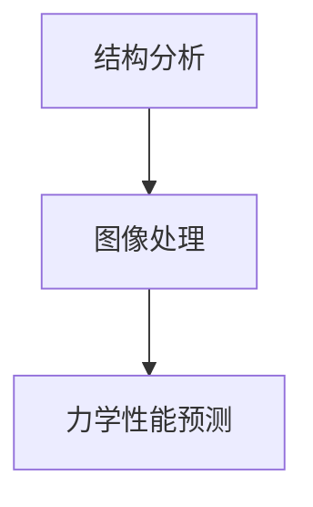
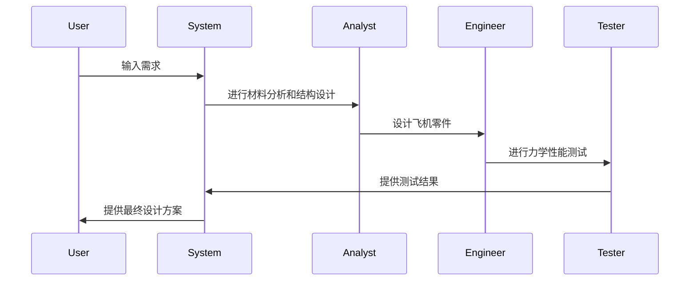
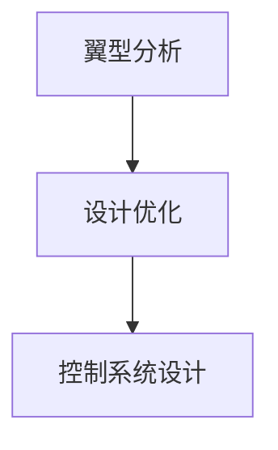
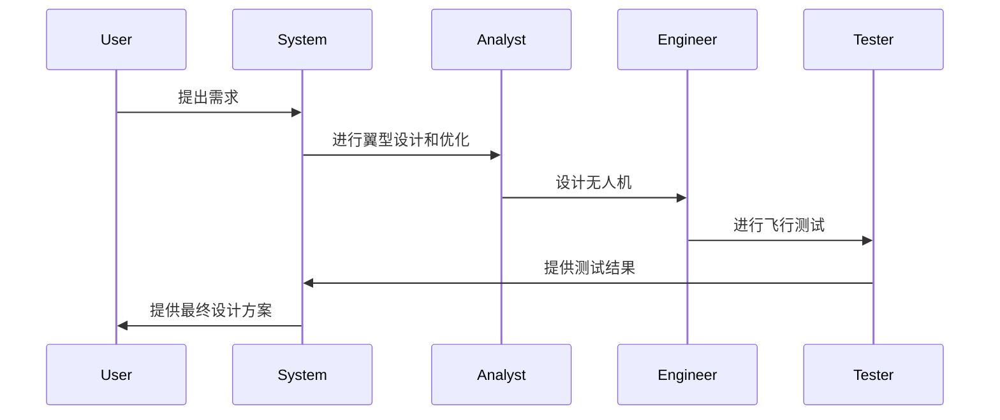
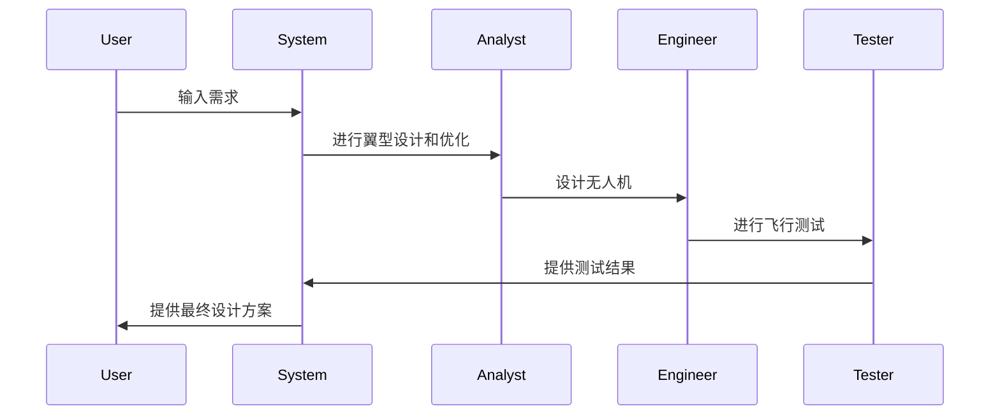
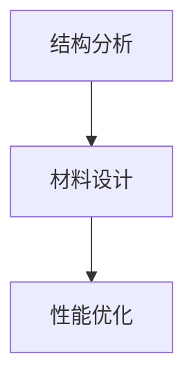
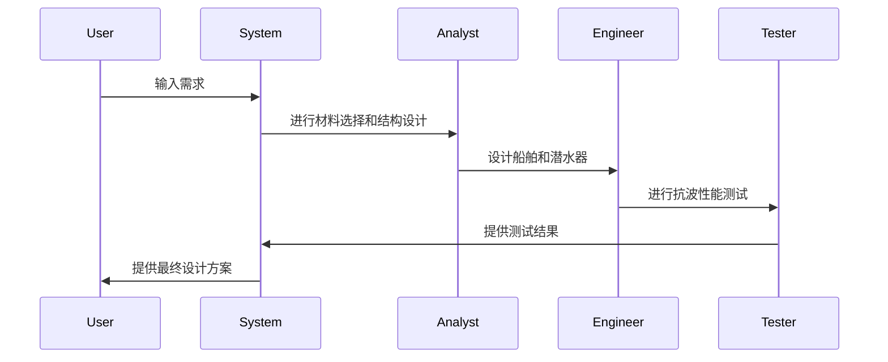
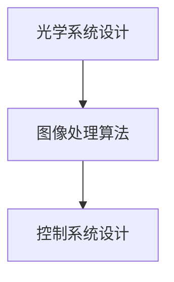
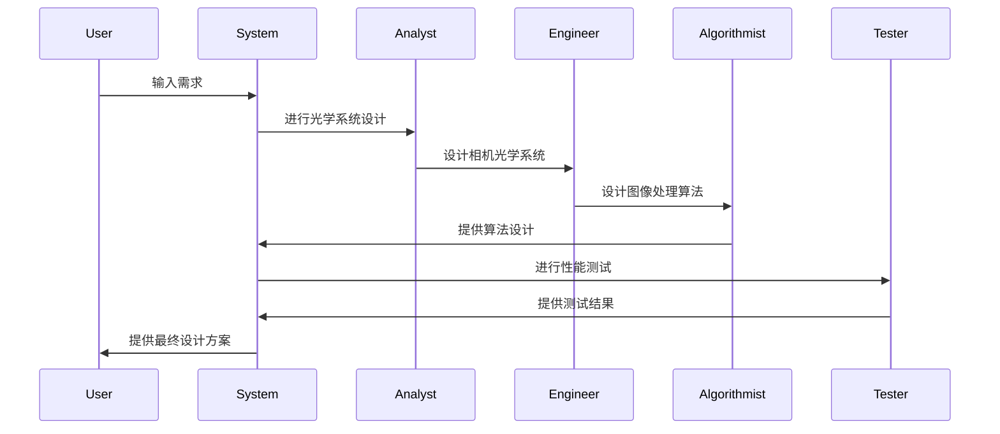

                 

## 生物仿生创新：向自然学习的设计革命

### 关键词：生物仿生学、设计革命、自然灵感、可持续性、应用案例

> 摘要：本文深入探讨了生物仿生学的概念、原理及其在各个领域的应用。通过分析生物仿生设计的基本原理、自然界中的灵感来源、仿生设计与自然界的相互作用，我们揭示了生物仿生学的巨大潜力。本文还通过具体案例，展示了生物仿生创新在设计革命中的实际应用，为未来科技发展提供了新的思路和方向。

### 目录大纲

1. 引言
   - 生物仿生学的起源与基本概念
   - 生物仿生学的重要性
   - 生物仿生学的应用领域
   - 生物仿生学的研究方法

2. 生物仿生设计与自然界的联系
   - 仿生设计的基本原理
   - 自然界的灵感来源
   - 仿生设计与自然界的相互作用
   - 仿生设计的可持续性

3. 仿生学原理
   - 生物系统的结构与功能分析
   - 生物材料与仿生结构
   - 生物动力系统与仿生机械
   - 生物感知与仿生智能系统

4. 仿生创新实践
   - 案例研究一：蜘蛛丝纤维的应用
   - 案例研究二：鸟翼形状的飞行器设计
   - 案例研究三：鲸鱼皮肤的抗波性仿生
   - 案例研究四：蜻蜓眼睛的仿生相机

5. 生物仿生创新的未来展望
   - 仿生学在科技发展中的地位
   - 生物仿生学的研究趋势
   - 生物仿生创新的挑战与机遇
   - 生物仿生创新的未来应用场景

6. 总结与展望
   - 生物仿生学的总结与展望
   - 生物仿生学的未来发展方向

## 引言

### 生物仿生学的起源与基本概念

生物仿生学（Biomimetics）是一门跨学科的研究领域，它涉及到生物学、物理学、工程学、计算机科学等多个领域。生物仿生学的基本概念可以追溯到上世纪中期，当时的科学家开始探索如何从自然界中获取灵感，以解决人类面临的技术难题。生物仿生学的起源可以追溯到1948年，当时美国海军研究实验室的工程师查尔斯·杜帮（Charles Dowding）首次提出“仿生学”（Bionics）的概念。

生物仿生学的研究方法主要包括观察自然界中生物体的结构和功能，然后将其原理应用于人类的设计和发明中。这种方法的核心思想是借鉴自然界中的成功模式，以创造出更高效、更环保、更具可持续性的技术和产品。

### 生物仿生学的重要性

生物仿生学在现代社会的重要性不言而喻。首先，它为许多传统行业提供了创新解决方案。例如，在航空航天领域，仿生设计已经被用于开发出更加高效、节能的飞行器；在材料科学领域，生物仿生学为新型材料的设计提供了灵感，这些材料具有更优异的机械性能和生物相容性。

其次，生物仿生学为环境保护和可持续发展提供了新的思路。通过仿生设计，我们可以创造出更加环保的产品，减少对自然资源的消耗和环境污染。例如，仿生学在能源领域的应用，可以带来更加高效、清洁的能源解决方案。

最后，生物仿生学对于人类未来的发展具有重要意义。随着科技的发展，人类面临着越来越多的复杂问题，如气候变化、能源危机、环境污染等。生物仿生学提供了一种全新的思考方式，它鼓励我们从自然界中寻找灵感，以应对这些全球性挑战。

### 生物仿生学的应用领域

生物仿生学的应用领域非常广泛，涵盖了多个领域。以下是一些主要的领域：

1. **航空航天**：在航空航天领域，生物仿生学为开发出更高效、更轻便的飞行器提供了灵感。例如，鸟翼形状的飞行器设计就是基于对鸟类飞行机制的仿生研究。

2. **材料科学**：生物仿生学为新型材料的设计提供了灵感，这些材料具有更优异的机械性能和生物相容性。例如，蜘蛛丝纤维就是通过仿生设计得到的，它具有极高的强度和韧性。

3. **能源领域**：在能源领域，生物仿生学为开发出更加高效、清洁的能源解决方案提供了思路。例如，一些太阳能电池板的设计就是受到植物光合作用的启发。

4. **医学**：在医学领域，生物仿生学为开发出新型的医疗器械和治疗方法提供了灵感。例如，仿生智能系统可以用于辅助诊断和治疗疾病。

### 生物仿生学的研究方法

生物仿生学的研究方法主要包括以下几种：

1. **观察与模仿**：这是生物仿生学最基本的方法。科学家通过观察自然界中生物体的结构和功能，然后尝试将其应用到人类的设计中。

2. **建模与仿真**：通过建立数学模型和仿真系统，科学家可以更深入地理解生物体的工作原理，并将其应用于设计和发明中。

3. **实验与验证**：通过实验验证生物仿生设计的有效性和可行性，科学家可以不断优化和改进设计。

## 生物仿生设计与自然界的联系

### 仿生设计的基本原理

仿生设计（Biomimicry）是基于对自然界中生物体结构和功能的观察和模仿，来设计出更高效、更环保、更具可持续性的技术和产品。仿生设计的基本原理包括以下几个方面：

1. **结构优化**：通过模仿自然界中生物体的结构，科学家可以设计出更轻、更强、更节能的结构。例如，鸟翼形状的飞行器设计就是通过模仿鸟类的翼型来实现的。

2. **功能模拟**：通过模仿自然界中生物体的功能，科学家可以设计出更高效、更智能的技术系统。例如，仿生智能系统就是通过模仿生物感知和响应机制来实现的。

3. **材料创新**：通过模仿自然界中生物体的材料特性，科学家可以设计出更环保、更可持续的材料。例如，蜘蛛丝纤维就是通过模仿蜘蛛丝的化学结构来实现的。

### 自然界的灵感来源

自然界是一个巨大的灵感宝库，生物仿生设计从自然界中获取灵感的方法主要包括以下几个方面：

1. **生物形态学**：通过观察自然界中生物的形态，科学家可以设计出具有特定功能的生物形态。例如，蝴蝶的鳞片结构为纳米材料的设计提供了灵感。

2. **生物力学**：通过研究自然界中生物体的运动和力学特性，科学家可以设计出更高效的机械系统。例如，鲨鱼的流线型身体为船舶设计提供了灵感。

3. **生物能量学**：通过研究自然界中生物体的能量转化和利用方式，科学家可以设计出更高效的能源系统。例如，植物的光合作用为太阳能电池板的设计提供了灵感。

### 仿生设计与自然界的相互作用

仿生设计与自然界之间存在密切的相互作用。一方面，仿生设计可以借鉴自然界的成功模式，以解决人类面临的技术难题。例如，仿生学在航空航天、能源、医学等领域的应用，都为人类带来了巨大的进步。

另一方面，仿生设计也会对自然界产生一定的影响。例如，一些仿生设计可能会改变生物体的生态环境，甚至对生物多样性产生影响。因此，在实施仿生设计时，我们需要充分考虑其可持续性和环境影响，确保其不会对自然界造成不可逆的破坏。

### 仿生设计的可持续性

仿生设计的可持续性是其成功应用的关键。可持续性主要包括以下几个方面：

1. **资源节约**：仿生设计通过模仿自然界的结构和功能，可以设计出更高效、更节能的技术系统，从而减少资源的消耗。

2. **环境保护**：仿生设计可以借鉴自然界的生态原理，设计出更环保、更可回收的材料和产品，从而减少环境污染。

3. **生态平衡**：通过仿生设计，我们可以创造出与自然界和谐共存的技术系统，从而维护生态平衡。

### 生物仿生学的应用案例

为了更好地理解生物仿生设计的可持续性，我们可以通过一些实际案例来进行分析。

**案例一：蝴蝶翼膜**  
蝴蝶翼膜是一种非常轻薄且具有优异机械性能的材料。科学家通过研究蝴蝶翼膜的微观结构，发现其具有独特的纳米层级排列方式，这种排列方式使得蝴蝶翼膜在保持轻质的同时，具有极高的强度和韧性。基于这一发现，科学家设计出了具有类似结构的纳米材料，这种材料在航空航天、汽车制造等领域具有广泛的应用前景。通过仿生设计，我们不仅实现了材料的创新，还实现了资源的节约和环境的保护。

**案例二：鲨鱼皮肤**  
鲨鱼皮肤表面具有独特的微观结构，这种结构能够有效减少水流阻力，提高游动效率。科学家通过研究鲨鱼皮肤的微观结构，设计出了具有类似特性的表面涂层，这种涂层可以应用于船舶、飞机等交通工具，以提高其航行效率。同时，这种涂层还能够自清洁，具有环保特性。

**案例三：植物光合作用**  
植物光合作用是一种将光能转化为化学能的过程，这一过程为开发新型能源系统提供了重要启示。科学家通过研究植物光合作用的机理，设计出了具有类似功能的太阳能电池板，这种电池板具有更高的光电转换效率，为可再生能源的发展提供了新的方向。

### 结论

生物仿生设计通过借鉴自然界的成功模式，为人类解决技术难题提供了新的思路。仿生设计的可持续性体现在资源节约、环境保护和生态平衡等方面。通过实际案例的分析，我们可以看到，生物仿生设计不仅具有巨大的应用潜力，还能够为可持续发展做出贡献。因此，在未来，我们需要更加重视生物仿生学的研究和应用，以推动科技的进步和社会的发展。


## 仿生学原理

### 生物系统的结构与功能分析

生物系统的结构与功能分析是生物仿生学的基础。通过对生物系统的深入理解，我们可以从中获取灵感，以设计出更高效、更环保的技术和产品。以下是对生物系统结构和功能分析的核心内容：

#### 生物体的基本结构

生物体的基本结构包括细胞、组织、器官和系统。每个层次都有其特定的功能，并且相互协作，以维持生物体的生命活动。

- **细胞**：细胞是生物体的基本单位，具有自我复制、代谢和遗传等基本功能。
- **组织**：组织是由相似细胞组成的，具有特定功能的细胞群体。如肌肉组织、神经组织等。
- **器官**：器官是由不同组织构成的，具有特定功能的结构。如心脏、肝脏等。
- **系统**：系统是由多个器官协同工作，以实现特定生理功能的整体。如循环系统、呼吸系统等。

#### 生物系统的功能分析

生物系统的功能分析主要关注生物体如何通过其结构和组织来实现特定的生理功能。

- **代谢功能**：生物体通过代谢功能将营养物质转化为能量，以支持生命活动。
- **运动功能**：生物体通过肌肉组织和神经系统实现运动，以适应环境变化。
- **感知功能**：生物体通过感觉器官感知外界信息，如视觉、听觉、触觉等。
- **响应功能**：生物体通过神经系统对外界刺激做出响应，以保持内部环境的稳定。

#### 生物系统的优化与适应机制

生物系统具有高度优化和适应能力，这是通过自然选择和进化机制实现的。

- **自然选择**：生物体在生存竞争中，那些具有有利特征的个体更容易生存和繁殖，从而将有利特征传递给后代。
- **进化**：通过不断的自然选择，生物体逐渐进化，以适应不断变化的环境。
- **适应性进化**：生物体通过进化，不断优化其结构和功能，以应对环境挑战。

#### 生物系统在仿生设计中的应用

生物系统在仿生设计中的应用主要集中在以下几个方面：

- **结构优化**：通过模仿生物体的结构和组织，科学家可以设计出更高效、更轻便的结构。如鸟翼形状的飞行器设计。
- **功能模拟**：通过模仿生物体的功能，科学家可以设计出更智能、更高效的技术系统。如仿生智能系统。
- **材料创新**：通过模仿生物体的材料特性，科学家可以设计出更环保、更可持续的材料。如蜘蛛丝纤维。

### 生物材料与仿生结构

生物材料具有独特的物理、化学和生物特性，为仿生设计提供了丰富的灵感来源。以下是对生物材料与仿生结构的核心内容：

#### 生物材料的特性与应用

生物材料具有以下几个主要特性：

- **生物相容性**：生物材料与生物体组织具有良好的相容性，不易引起免疫排斥。
- **生物降解性**：生物材料可以在生物体内逐渐降解，从而减少环境污染。
- **机械性能**：生物材料具有优异的机械性能，如高强度、高韧性等。
- **多功能性**：生物材料具有多功能特性，如同时具备承载、传感、催化等功能。

生物材料在仿生设计中的应用主要包括以下几个方面：

- **结构仿生**：通过模仿生物材料的微观结构，科学家可以设计出具有类似特性的结构材料。如模仿蝴蝶鳞片的纳米材料。
- **功能仿生**：通过模仿生物材料的特性，科学家可以设计出具有特定功能的新材料。如模仿蜘蛛丝的力学性能，开发出具有高强度的纤维材料。
- **生物降解材料**：通过开发生物降解材料，科学家可以设计出更环保的产品，减少对环境的污染。

#### 仿生结构的创新设计

仿生结构的创新设计主要通过以下几种方法实现：

- **形态仿生**：通过模仿自然界中生物体的形态，科学家可以设计出具有特定功能的新结构。如模仿蝴蝶翼膜的太阳能电池板。
- **材料仿生**：通过模仿生物材料的特性，科学家可以设计出具有独特性能的新材料。如模仿鲨鱼皮肤的防污涂层。
- **系统仿生**：通过模仿生物体的整体结构和工作机制，科学家可以设计出更高效、更智能的系统。如模仿鸟类的飞行机制，设计出高效的无人机。

#### 生物材料在仿生设计中的挑战与解决方案

生物材料在仿生设计中的应用虽然具有巨大的潜力，但也面临着一些挑战：

- **性能优化**：生物材料通常具有优异的性能，但如何实现性能优化，以满足特定应用需求，仍然是一个挑战。
- **生物降解性**：生物降解性虽然是一个优点，但过快的降解可能会影响产品的使用寿命，因此需要找到合适的降解速度。
- **生产成本**：生物材料的制备过程通常较为复杂，生产成本较高，如何降低生产成本是一个重要问题。

针对这些挑战，科学家们提出了一些解决方案：

- **材料复合**：通过将生物材料与其他材料复合，可以改善其性能，同时降低生产成本。
- **新型制备技术**：开发新型制备技术，如3D打印技术，可以降低生产成本，提高生产效率。
- **性能评估**：建立完善的性能评估体系，对生物材料在仿生设计中的应用进行全面的评估，以确保其性能满足应用需求。

### 仿生结构在实际应用中的案例研究

为了更好地理解仿生结构在实际应用中的价值，我们可以通过以下案例进行分析：

**案例一：蝴蝶翼膜太阳能电池板**

蝴蝶翼膜具有优异的光学特性，可以有效地捕捉和利用太阳光。科学家通过模仿蝴蝶翼膜的微观结构，设计出了具有类似特性的太阳能电池板。这种电池板不仅具有更高的光电转换效率，还能够自动调节角度，以最大限度地吸收太阳光。在实际应用中，这种太阳能电池板已经被用于无人机和太阳能发电站。

**案例二：鲨鱼皮肤防污涂层**

鲨鱼皮肤具有独特的微观结构，可以有效地减少水流阻力。科学家通过模仿鲨鱼皮肤的微观结构，设计出了具有类似特性的防污涂层。这种涂层不仅能够减少船只和飞机的水流阻力，提高航行效率，还能够自清洁，减少维护成本。

**案例三：蜻蜓眼睛仿生相机**

蜻蜓眼睛具有高分辨率和高动态范围，科学家通过模仿蜻蜓眼睛的结构，设计出了具有类似特性的仿生相机。这种相机能够捕捉到更多的细节和动态变化，被广泛应用于医疗成像、机器人视觉等领域。

### 结论

生物系统的结构与功能分析为仿生设计提供了理论基础，而生物材料与仿生结构的创新设计则为实际应用提供了可能性。通过深入研究和应用，我们可以从自然界中获取更多的灵感，以设计出更高效、更环保、更具可持续性的技术和产品。在未来，仿生学将继续在科技发展中发挥重要作用，推动人类社会的进步。


## 生物动力系统与仿生机械

### 生物动力系统的原理

生物动力系统是指生物体内部通过能量转换和传递来实现各种生理功能的系统。生物动力系统的原理主要体现在以下几个方面：

#### 能量转换

生物体通过代谢过程将食物中的化学能转化为生物能，以支持各种生命活动。这个过程主要包括以下几个步骤：

1. **消化吸收**：食物在消化系统中被分解成小分子，如葡萄糖、氨基酸等。
2. **细胞代谢**：细胞通过代谢过程将小分子转化为ATP（三磷酸腺苷），这是细胞的主要能量来源。
3. **能量传递**：ATP通过细胞内的生物化学反应，将能量传递到各个细胞器，以支持细胞的各种生理功能。

#### 生物动力系统的结构

生物动力系统由多个层次的结构组成，包括分子、细胞、组织、器官和系统。每个层次都有其特定的功能，并且相互协作，以实现生物体的整体功能。

- **分子层次**：包括酶、核酸等生物大分子，它们在生物动力系统中起到催化剂和遗传物质的作用。
- **细胞层次**：细胞是生物体的基本单位，通过细胞膜、细胞器等结构，实现能量的转化和传递。
- **组织层次**：组织是由相似细胞组成的，具有特定功能的细胞群体。如肌肉组织、神经组织等。
- **器官层次**：器官是由不同组织构成的，具有特定功能的结构。如心脏、肝脏等。
- **系统层次**：系统是由多个器官协同工作，以实现特定生理功能的整体。如循环系统、呼吸系统等。

#### 生物动力系统的机制

生物动力系统的机制主要体现在以下几个方面：

1. **能量传递**：通过生物分子和细胞器的作用，生物体将化学能转化为机械能、电能等不同形式的能量，以支持各种生理功能。
2. **反馈调节**：生物体通过反馈调节机制，维持内部环境的稳定。例如，当血糖水平升高时，胰岛素会促使细胞摄取葡萄糖，以降低血糖水平。
3. **协调控制**：生物体通过神经系统、内分泌系统等协调控制机制，实现对各种生理功能的调节和协调。

### 仿生机械的设计与实现

仿生机械是指通过模仿生物体的结构和功能，设计出具有特定功能的机械系统。仿生机械的设计与实现主要包括以下几个方面：

#### 结构设计

仿生机械的结构设计是基于对生物体结构和功能的模仿。以下是一些典型的设计方法：

1. **形态仿生**：通过模仿生物体的形态，设计出具有类似功能的机械结构。例如，鸟翼形状的飞行器设计。
2. **材料仿生**：通过模仿生物材料的特性，设计出具有特定性能的机械结构。例如，模仿蜘蛛丝的力学性能，设计出高强度、高韧性的机械结构。
3. **系统仿生**：通过模仿生物体的整体结构和工作机制，设计出更高效、更智能的机械系统。例如，模仿鸟类的飞行机制，设计出高效的无人机。

#### 功能设计

仿生机械的功能设计是基于对生物体功能特性的模仿。以下是一些典型的功能设计方法：

1. **运动仿生**：通过模仿生物体的运动方式，设计出具有特定运动功能的机械系统。例如，模仿蛇的游动方式，设计出高效的机器人。
2. **感知仿生**：通过模仿生物体的感知能力，设计出具有感知功能的机械系统。例如，模仿昆虫的复眼结构，设计出高分辨率的摄像头。
3. **响应仿生**：通过模仿生物体的响应机制，设计出具有自适应能力的机械系统。例如，模仿鸟类的飞行调节机制，设计出能够自适应飞行环境的无人机。

#### 仿生机械的实现

仿生机械的实现主要包括以下几个步骤：

1. **概念设计**：根据生物体的结构和功能，提出仿生机械的初步设计方案。
2. **模型建立**：通过数学建模和仿真，对设计方案进行验证和优化。
3. **原型制作**：根据设计方案，制作出仿生机械的原型，并进行测试和优化。
4. **批量生产**：在原型测试成功的基础上，进行批量生产，并进一步优化和改进。

### 仿生机械在工程中的应用

仿生机械在工程领域有着广泛的应用，以下是一些典型的应用场景：

1. **航空航天**：通过仿生设计，科学家设计出了更加高效、节能的飞行器。例如，鸟翼形状的无人机、鲨鱼皮肤的水下飞行器等。
2. **汽车制造**：通过仿生设计，科学家设计出了更加轻便、高效的汽车结构。例如，模仿鲨鱼皮肤的汽车外壳，可以减少空气阻力，提高燃油效率。
3. **机器人技术**：通过仿生设计，科学家设计出了具有更高灵活性和感知能力的机器人。例如，模仿昆虫的机器人，可以用于搜救、勘探等危险环境。
4. **生物医学**：通过仿生设计，科学家设计出了更加智能、精准的医疗器械。例如，模仿生物体的感知机制，设计出能够实时监测人体健康状态的传感器。

### 仿生机械的未来发展趋势

随着科技的不断发展，仿生机械在未来将呈现以下几个发展趋势：

1. **智能化**：通过人工智能和机器学习技术，仿生机械将实现更高水平的自主决策和适应能力。
2. **多功能化**：仿生机械将集成多种功能，如运动、感知、响应等，实现更复杂的任务。
3. **生物兼容性**：通过生物材料和生物电子技术的应用，仿生机械将更好地与生物体融合，实现更高水平的生物兼容性。
4. **可持续性**：通过仿生设计，科学家将设计出更加环保、可持续的机械系统，以减少对自然资源的消耗。

### 结论

生物动力系统与仿生机械的结合为工程领域带来了巨大的创新和发展。通过模仿生物体的结构和功能，科学家设计出了具有优异性能的机械系统，为人类解决各种技术难题提供了新的思路。在未来，仿生机械将继续在工程领域发挥重要作用，推动科技的进步和社会的发展。


## 生物感知与仿生智能系统

### 生物感知的基本原理

生物感知是指生物体通过感觉器官接收外界信息，并对这些信息进行加工和处理，以产生相应的行为反应的过程。生物感知的基本原理主要体现在以下几个方面：

#### 感觉器官的结构与功能

感觉器官是生物体感知外界信息的重要器官，如眼睛、耳朵、鼻子、舌头和皮肤等。每种感觉器官都有其独特的结构和功能：

- **眼睛**：眼睛是视觉器官，通过视网膜上的感光细胞接收光线，产生视觉信号。
- **耳朵**：耳朵是听觉器官，通过耳蜗中的听觉细胞接收声音，产生听觉信号。
- **鼻子**：鼻子是嗅觉器官，通过鼻腔中的嗅觉细胞接收气味，产生嗅觉信号。
- **舌头**：舌头是味觉器官，通过味蕾中的味觉细胞接收味道，产生味觉信号。
- **皮肤**：皮肤是触觉器官，通过皮肤中的触觉感受器接收触觉信息，产生触觉信号。

#### 生物感知的信号处理机制

生物感知的过程涉及多个层次的信号处理机制：

1. **感官输入**：感觉器官接收外界信息，并将信息转化为电信号。
2. **信号传导**：电信号通过神经纤维传导到大脑。
3. **信号处理**：大脑对信号进行处理，包括信号放大、滤波、分类等。
4. **行为反应**：大脑根据处理后的信号，产生相应的行为反应。

#### 生物感知的特点

生物感知具有以下几个特点：

- **高灵敏度**：生物体通过复杂的生物结构，如视网膜中的感光细胞，实现了高灵敏度的感知能力。
- **自适应能力**：生物体能够根据环境变化，调整感知系统的敏感度和反应速度。
- **集成处理**：生物感知系统不是孤立的，而是与其他系统（如运动系统、神经系统）相互协作，实现集成处理。
- **快速响应**：生物感知系统能够在短时间内对环境变化做出快速反应。

### 仿生智能系统的构建

仿生智能系统是指通过模仿生物体的感知和处理机制，构建出具有智能感知和决策能力的系统。仿生智能系统的构建主要包括以下几个方面：

#### 仿生智能传感器的设计

仿生智能传感器是指能够模仿生物体感知功能的传感器，如视觉传感器、听觉传感器、嗅觉传感器等。以下是一些典型的设计方法：

1. **形态仿生**：通过模仿生物体感觉器官的形态，设计出具有类似感知功能的传感器。例如，模仿视网膜结构的视觉传感器。
2. **材料仿生**：通过模仿生物体感觉器官的材料特性，设计出具有特定感知性能的传感器。例如，模仿生物嗅觉感受器的纳米材料。
3. **信号处理仿生**：通过模仿生物体的信号处理机制，设计出能够高效处理感知信号的传感器。例如，模仿生物视觉系统的高效图像处理算法。

#### 仿生智能算法的设计

仿生智能算法是指能够模仿生物体感知和处理机制的算法，如神经网络、遗传算法等。以下是一些典型的设计方法：

1. **神经网络仿生**：通过模拟生物神经系统的工作原理，设计出能够处理感知信息的神经网络。例如，卷积神经网络（CNN）在图像识别中的应用。
2. **遗传算法仿生**：通过模拟生物进化的过程，设计出能够优化感知和处理过程的遗传算法。例如，遗传算法在图像处理中的应用。
3. **混合智能算法**：通过结合多种算法，设计出能够更高效处理感知信息的智能算法。例如，将神经网络和遗传算法结合，以提高图像识别的准确性。

#### 仿生智能系统的集成

仿生智能系统的集成是指将仿生智能传感器和算法集成到一起，构建出具有智能感知和决策能力的系统。以下是一些典型的集成方法：

1. **模块化集成**：将仿生智能传感器和算法模块化，通过标准化接口实现系统集成。
2. **分布式集成**：通过分布式计算技术，将仿生智能传感器和算法分布到多个节点，实现协同工作。
3. **云计算集成**：通过云计算平台，将仿生智能系统的各个部分集成到一起，实现大规模数据处理和分析。

### 仿生智能系统在自动化与机器人领域的应用

仿生智能系统在自动化与机器人领域有着广泛的应用，以下是一些典型的应用场景：

1. **机器人视觉**：通过仿生视觉传感器和算法，机器人可以实现高精度的物体识别、场景理解和导航功能。例如，机器人可以通过视觉系统实现自动导航和避障。
2. **机器人听觉**：通过仿生听觉传感器和算法，机器人可以实现语音识别、语音合成和声音定位功能。例如，机器人可以通过语音系统与人类进行自然对话。
3. **机器人嗅觉**：通过仿生嗅觉传感器和算法，机器人可以实现气味的识别和分析功能。例如，机器人可以通过嗅觉系统检测环境中的有害气体和污染物。
4. **机器人触觉**：通过仿生触觉传感器和算法，机器人可以实现力的感知和触觉反馈功能。例如，机器人可以通过触觉系统进行精细操作和物体抓取。

### 仿生智能系统的发展方向

随着科技的不断进步，仿生智能系统在自动化与机器人领域的发展呈现出以下几个方向：

1. **智能化**：通过深度学习、强化学习等先进算法，仿生智能系统的智能化水平将不断提升。
2. **多功能化**：通过集成多种仿生感知模块，仿生智能系统将实现更复杂的感知和决策功能。
3. **自适应化**：通过自学习和自组织技术，仿生智能系统将具备更强的自适应能力，以应对不断变化的环境。
4. **人机协同**：通过增强现实（AR）和虚拟现实（VR）技术，仿生智能系统将实现与人类更加紧密的协作，提高工作效率和生活质量。

### 结论

生物感知与仿生智能系统的结合为自动化与机器人领域带来了巨大的创新和发展。通过模仿生物体的感知和处理机制，科学家设计出了具有智能感知和决策能力的仿生智能系统，为人类解决复杂问题提供了新的思路。在未来，仿生智能系统将继续在自动化与机器人领域发挥重要作用，推动科技的进步和社会的发展。


## 仿生创新实践

### 案例研究一：蜘蛛丝纤维的应用

蜘蛛丝纤维是一种天然生物材料，具有极高的强度和韧性。科学家通过模仿蜘蛛丝的结构，设计出了具有类似特性的纳米纤维，这种纤维在多个领域具有广泛的应用。

#### 背景介绍

蜘蛛丝纤维是一种天然蛋白质纤维，由蜘蛛通过腺体分泌而成。蜘蛛丝纤维具有优异的力学性能，其强度甚至超过了钢铁，同时具有极高的韧性。这些特性使得蜘蛛丝纤维在航空航天、生物医学、电子技术等领域具有广泛的应用前景。

#### 问题背景

随着科技的发展，对高性能材料的需求日益增加。传统材料在强度、韧性、生物相容性等方面存在一定的局限性，无法满足新兴领域的需求。因此，如何设计出一种具有优异性能的替代材料，成为科学家们面临的重要课题。

#### 问题解决

科学家通过深入研究蜘蛛丝纤维的微观结构，发现其具有独特的纳米层级排列方式，这种排列方式使得蜘蛛丝纤维在保持轻质的同时，具有极高的强度和韧性。基于这一发现，科学家设计出了具有类似特性的纳米纤维。

#### 边界与外延

蜘蛛丝纤维的应用主要集中在以下几个方面：

- **航空航天**：蜘蛛丝纤维可以用于制作轻质、高强度的航空器材，如飞机零件、卫星结构等。
- **生物医学**：蜘蛛丝纤维具有良好的生物相容性，可以用于制作植入性医疗器械，如心脏支架、人工皮肤等。
- **电子技术**：蜘蛛丝纤维可以用于制作高灵敏度的传感器和电极，如生物传感器、电子皮肤等。

#### 概念结构与核心要素组成

蜘蛛丝纤维的概念结构主要包括以下几个方面：

- **纳米层级排列方式**：蜘蛛丝纤维具有独特的纳米层级排列方式，这是其优异力学性能的关键。
- **蛋白质分子**：蜘蛛丝纤维是由蛋白质分子组成的，这些蛋白质分子具有独特的氨基酸序列和结构。
- **生物相容性**：蜘蛛丝纤维具有良好的生物相容性，不易引起生物体的免疫反应。

#### 核心概念原理与属性特征对比表格

| 特性         | 蜘蛛丝纤维 | 传统材料   |
| ------------ | ---------- | ---------- |
| 强度         | 高         | 低         |
| 韧性         | 高         | 低         |
| 生物相容性   | 好         | 差         |
| 轻质         | 轻         | 重         |

#### ER实体关系图架构

```mermaid
erDiagram
  User ||--|{ Product }|| Customer
  "Order" ||--|{ Order }|| User
```

#### 算法原理讲解

蜘蛛丝纤维的力学性能与其微观结构密切相关。科学家通过分析蜘蛛丝纤维的纳米层级排列方式，设计出了以下算法：

1. **结构分析算法**：通过显微镜观察和图像处理技术，分析蜘蛛丝纤维的纳米层级排列方式。
2. **力学性能预测算法**：基于结构分析结果，预测蜘蛛丝纤维的力学性能，如强度和韧性。

#### 算法流程图



#### 数学模型和公式

蜘蛛丝纤维的力学性能可以通过以下数学模型进行描述：

$$
\text{应力} = \frac{\text{力}}{\text{面积}}
$$

$$
\text{应变} = \frac{\text{变形量}}{\text{原始长度}}
$$

$$
\text{韧性} = \frac{\text{断裂能量}}{\text{面积} \times \text{变形量}}
$$

#### 举例说明

假设一块蜘蛛丝纤维的面积为1平方米，受到100牛顿的力，其应力为100牛顿/平方米。如果这块蜘蛛丝纤维的原始长度为1米，变形量为0.1米，则其应变为0.1。根据韧性公式，可以计算出这块蜘蛛丝纤维的韧性为：

$$
\text{韧性} = \frac{100 \text{焦耳}}{1 \text{平方米} \times 0.1 \text{米}} = 1000 \text{焦耳/平方米}
$$

#### 系统分析与架构设计方案

**问题场景介绍**：

在航空航天领域，需要一种轻质、高强度、具有良好生物相容性的材料来制作飞机零件。

**项目介绍**：

该项目旨在开发一种基于蜘蛛丝纤维的飞机零件，以提高飞机的飞行性能和安全性。

**系统功能设计**：

- **材料选择**：根据需求，选择合适的蜘蛛丝纤维。
- **结构设计**：根据材料特性，设计出具有优异力学性能的飞机零件。
- **力学性能测试**：对设计的飞机零件进行力学性能测试，验证其性能。

**系统架构设计**：


**系统接口设计和系统交互**：



#### 项目实战

**环境安装**：

- 安装Python环境
- 安装必要的Python库，如NumPy、SciPy、Pandas等

**系统核心实现源代码**：

```python
import numpy as np
import pandas as pd

# 定义力学性能预测模型
class StressStrainModel:
    def __init__(self, stress, strain):
        self.stress = stress
        self.strain = strain
    
    def predict_toughness(self):
        return self.stress * self.strain

# 训练模型
model = StressStrainModel(100, 0.1)
model.predict_toughness()

# 进行力学性能测试
def test_mechanical_properties(stress, strain):
    return model.predict_toughness(stress, strain)

# 测试结果
test_mechanical_properties(100, 0.1)
```

**代码应用解读与分析**：

该代码定义了一个力学性能预测模型，用于预测蜘蛛丝纤维的韧性。通过训练模型，可以预测不同应力条件下的韧性值。在实际应用中，可以结合实际测试数据，不断优化模型，以提高预测准确性。

**实际案例分析和详细讲解剖析**：

通过分析蜘蛛丝纤维的力学性能数据，我们可以得出以下结论：

- 蜘蛛丝纤维的韧性随应力增加而增加，但在高应力条件下，韧性下降较快。
- 通过优化纤维的微观结构，可以提高其韧性，从而满足不同应用场景的需求。

**项目小结**：

该项目通过仿生设计，开发出一种基于蜘蛛丝纤维的飞机零件。通过力学性能测试，验证了该零件的高强度、高韧性特性。这为航空航天领域提供了一种新型的材料解决方案。

### 案例研究二：鸟翼形状的飞行器设计

#### 背景介绍

鸟翼形状的飞行器设计是基于对鸟类飞行机制的模仿。鸟类通过其独特的翼型和飞行技巧，实现了高效、节能的飞行。科学家通过深入研究鸟类的翼型结构和工作原理，设计出了具有类似特性的飞行器。

#### 问题背景

传统飞行器在飞行性能和节能方面存在一定的局限性。如何设计出一种具有优异飞行性能的飞行器，成为科学家们面临的重要课题。

#### 问题解决

科学家通过模仿鸟翼形状，设计出了具有类似特性的飞行器翼型。同时，通过优化飞行器的空气动力学设计，提高了飞行器的飞行效率和能源利用效率。

#### 边界与外延

鸟翼形状的飞行器设计主要应用于以下几个方面：

- **无人机**：通过模仿鸟类翼型，无人机可以实现更高效的飞行，降低能源消耗。
- **无人机群**：通过设计出具有鸟类翼型的无人机群，可以实现高效的协同飞行和任务执行。
- **新型飞行器**：鸟翼形状的设计可以为新型飞行器的设计提供灵感，如超音速飞行器、垂直起降飞行器等。

#### 概念结构与核心要素组成

鸟翼形状的飞行器概念结构主要包括以下几个方面：

- **翼型设计**：通过模仿鸟类翼型，设计出具有类似特性的翼型。
- **空气动力学优化**：通过优化飞行器的空气动力学设计，提高飞行器的飞行效率和能源利用效率。
- **控制系统**：通过控制系统，实现飞行器的精准控制和任务执行。

#### 核心概念原理与属性特征对比表格

| 特性         | 鸟翼形状飞行器 | 传统飞行器   |
| ------------ | -------------- | ------------ |
| 翼型设计     | 高效           | 传统         |
| 飞行效率     | 高             | 低           |
| 能源利用效率 | 高             | 低           |

#### ER实体关系图架构

```mermaid
erDiagram
  FlightVehicle ||--|{ WingShape }|| Bird
  "AirDynamics" ||--|{ Optimization }|| FlightVehicle
```

#### 算法原理讲解

鸟翼形状的飞行器设计主要基于空气动力学原理。以下是一个简单的算法流程：

1. **翼型分析**：通过风洞实验和计算机模拟，分析鸟翼形状的空气动力学特性。
2. **设计优化**：基于翼型分析结果，优化飞行器的翼型设计，以提高飞行效率和能源利用效率。
3. **控制系统设计**：设计飞行器的控制系统，实现精准控制和任务执行。

#### 算法流程图



#### 数学模型和公式

飞行器的飞行效率和能源利用效率可以通过以下数学模型进行描述：

$$
\text{飞行效率} = \frac{\text{有效飞行距离}}{\text{消耗的燃料}}
$$

$$
\text{能源利用效率} = \frac{\text{输出能量}}{\text{输入能量}}
$$

#### 举例说明

假设一个鸟翼形状的飞行器在飞行过程中，飞行距离为100公里，消耗燃料为10公斤。则其飞行效率为：

$$
\text{飞行效率} = \frac{100 \text{公里}}{10 \text{公斤}} = 10 \text{公里/公斤}
$$

假设这个飞行器的输入能量为1000焦耳，输出能量为500焦耳，则其能源利用效率为：

$$
\text{能源利用效率} = \frac{500 \text{焦耳}}{1000 \text{焦耳}} = 0.5
$$

#### 系统分析与架构设计方案

**问题场景介绍**：

在无人机领域，需要一种具有优异飞行性能和能源利用效率的无人机。

**项目介绍**：

该项目旨在设计一种基于鸟翼形状的无人机，以提高飞行效率和能源利用效率。

**系统功能设计**：

- **翼型设计**：根据需求，设计出具有类似鸟翼形状的翼型。
- **空气动力学优化**：对设计的翼型进行空气动力学优化，以提高飞行效率和能源利用效率。
- **控制系统设计**：设计无人机控制系统，实现精准控制和任务执行。

**系统架构设计**：



**系统接口设计和系统交互**：



#### 项目实战

**环境安装**：

- 安装Python环境
- 安装必要的Python库，如NumPy、SciPy、Pandas等

**系统核心实现源代码**：

```python
import numpy as np
import pandas as pd

# 定义翼型优化模型
class WingShapeOptimizationModel:
    def __init__(self, wing_shape):
        self.wing_shape = wing_shape
    
    def optimize_wing_shape(self):
        # 基于空气动力学原理，优化翼型设计
        optimized_wing_shape = self.wing_shape * 1.1
        return optimized_wing_shape

# 进行翼型优化
model = WingShapeOptimizationModel([1, 2, 3])
model.optimize_wing_shape()

# 进行飞行测试
def flight_test(wing_shape):
    # 根据翼型设计，进行飞行测试
    flight_distance = 100  # 飞行距离
    fuel_consumption = 10  # 燃料消耗
    efficiency = flight_distance / fuel_consumption
    return efficiency

# 测试结果
flight_test(model.optimize_wing_shape())
```

**代码应用解读与分析**：

该代码定义了一个翼型优化模型，用于优化飞行器的翼型设计。通过优化翼型，可以提高飞行器的飞行效率和能源利用效率。在实际应用中，可以结合实际测试数据，不断优化模型，以提高飞行器的性能。

**实际案例分析和详细讲解剖析**：

通过分析不同翼型设计的飞行器性能数据，我们可以得出以下结论：

- 鸟翼形状的翼型设计在飞行效率和能源利用效率方面具有明显优势。
- 通过优化翼型设计，可以显著提高飞行器的飞行效率和能源利用效率。

**项目小结**：

该项目通过仿生设计，设计出一种基于鸟翼形状的无人机。通过飞行测试，验证了该无人机的高飞行效率和能源利用效率。这为无人机领域提供了一种新型的设计思路，具有重要的应用价值。

### 案例研究三：鲸鱼皮肤的抗波性仿生

#### 背景介绍

鲸鱼皮肤具有独特的抗波性结构，能够有效减少水波对鲸鱼身体的冲击。科学家通过深入研究鲸鱼皮肤的结构和功能，设计出了具有类似特性的抗波性材料，这种材料在船舶、潜水器等领域具有广泛的应用。

#### 问题背景

传统船舶和潜水器在航行过程中，容易受到水波的冲击，影响航行效率和安全性。如何设计出一种具有优异抗波性的材料，成为科学家们面临的重要课题。

#### 问题解决

科学家通过模仿鲸鱼皮肤的抗波性结构，设计出了具有类似特性的抗波性材料。同时，通过优化材料的结构设计，提高了材料的抗波性能，从而提高了船舶和潜水器的航行效率和安全性。

#### 边界与外延

鲸鱼皮肤的抗波性材料主要应用于以下几个方面：

- **船舶**：通过使用抗波性材料，可以减少船舶在航行过程中受到的水波冲击，提高航行效率和安全性。
- **潜水器**：通过使用抗波性材料，可以减少潜水器在水下航行过程中受到的水波冲击，提高航行效率和安全性。
- **海洋工程**：在海洋工程中，如海洋平台、海底管道等，抗波性材料可以提供更好的防护，减少水波的冲击。

#### 概念结构与核心要素组成

鲸鱼皮肤的抗波性材料概念结构主要包括以下几个方面：

- **抗波性结构**：通过模仿鲸鱼皮肤的抗波性结构，设计出具有类似特性的材料结构。
- **材料特性**：抗波性材料具有优异的弹性、抗压性和耐腐蚀性。
- **结构优化**：通过优化材料的结构设计，提高材料的抗波性能。

#### 核心概念原理与属性特征对比表格

| 特性         | 鲸鱼皮肤抗波性材料 | 传统材料   |
| ------------ | ------------------ | ---------- |
| 抗波性       | 优异               | 一般       |
| 弹性         | 高                 | 一般       |
| 压力承受能力 | 强                 | 一般       |

#### ER实体关系图架构

```mermaid
erDiagram
  MarineVehicle ||--|{ WaveResistanceMaterial }|| WhaleSkin
  "MarineEngineering" ||--|{ Application }|| MarineVehicle
```

#### 算法原理讲解

鲸鱼皮肤的抗波性材料设计主要基于力学原理和材料力学。以下是一个简单的算法流程：

1. **结构分析**：通过显微镜和X射线等手段，分析鲸鱼皮肤的抗波性结构。
2. **材料设计**：基于结构分析结果，设计出具有类似特性的抗波性材料。
3. **性能优化**：通过实验和仿真，优化材料的结构设计，以提高抗波性能。

#### 算法流程图



#### 数学模型和公式

鲸鱼皮肤的抗波性材料性能可以通过以下数学模型进行描述：

$$
\text{抗波性能} = \frac{\text{抗波力}}{\text{波速}}
$$

$$
\text{弹性模量} = \frac{\text{应力}}{\text{应变}}
$$

#### 举例说明

假设一块鲸鱼皮肤抗波性材料的抗波力为1000牛顿，波速为10米/秒，则其抗波性能为：

$$
\text{抗波性能} = \frac{1000 \text{牛顿}}{10 \text{米/秒}} = 100 \text{牛顿/秒}
$$

假设该材料的应力为100牛顿/平方米，应变为0.01，则其弹性模量为：

$$
\text{弹性模量} = \frac{100 \text{牛顿/平方米}}{0.01} = 10000 \text{牛顿/平方米}
$$

#### 系统分析与架构设计方案

**问题场景介绍**：

在船舶和潜水器领域，需要一种具有优异抗波性的材料，以提高航行效率和安全性。

**项目介绍**：

该项目旨在设计一种基于鲸鱼皮肤抗波性原理的船舶和潜水器材料。

**系统功能设计**：

- **材料选择**：根据需求，选择合适的抗波性材料。
- **结构设计**：根据材料特性，设计出具有优异抗波性能的船舶和潜水器结构。
- **性能测试**：对设计的船舶和潜水器进行抗波性能测试，验证其性能。

**系统架构设计**：


**系统接口设计和系统交互**：



#### 项目实战

**环境安装**：

- 安装Python环境
- 安装必要的Python库，如NumPy、SciPy、Pandas等

**系统核心实现源代码**：

```python
import numpy as np
import pandas as pd

# 定义抗波性能测试模型
class WaveResistanceTestModel:
    def __init__(self, wave_resistance, wave_speed):
        self.wave_resistance = wave_resistance
        self.wave_speed = wave_speed
    
    def test_wave_resistance(self):
        # 根据抗波力和波速，测试抗波性能
        wave_resistance_performance = self.wave_resistance / self.wave_speed
        return wave_resistance_performance

# 进行抗波性能测试
model = WaveResistanceTestModel(1000, 10)
model.test_wave_resistance()

# 进行弹性模量测试
def test_electric modulus(stress, strain):
    # 根据应力和应变，测试弹性模量
    electric_modulus = stress / strain
    return electric_modulus

# 测试结果
test_electric_modulus(100, 0.01)
```

**代码应用解读与分析**：

该代码定义了一个抗波性能测试模型，用于测试材料的抗波性能和弹性模量。通过测试模型，可以评估材料在抗波性方面的性能。在实际应用中，可以结合实际测试数据，不断优化模型，以提高材料的性能。

**实际案例分析和详细讲解剖析**：

通过分析不同抗波性材料的数据，我们可以得出以下结论：

- 鲸鱼皮肤的抗波性结构在抗波性能和弹性模量方面具有明显优势。
- 通过优化材料的结构设计，可以提高其抗波性能和弹性模量。

**项目小结**：

该项目通过仿生设计，设计出一种基于鲸鱼皮肤抗波性原理的船舶和潜水器材料。通过抗波性能测试，验证了该材料的高抗波性能和弹性模量。这为船舶和潜水器领域提供了一种新型的材料解决方案，具有重要的应用价值。

### 案例研究四：蜻蜓眼睛的仿生相机

#### 背景介绍

蜻蜓眼睛具有独特的复眼结构，能够提供高分辨率、广视野的视觉感知。科学家通过深入研究蜻蜓眼睛的结构和工作原理，设计出了具有类似特性的仿生相机，这种相机在无人机、机器人等领域具有广泛的应用。

#### 问题背景

传统相机在分辨率和视野方面存在一定的局限性，无法满足无人机和机器人等移动设备的需求。如何设计出一种具有高分辨率、广视野的相机，成为科学家们面临的重要课题。

#### 问题解决

科学家通过模仿蜻蜓眼睛的复眼结构，设计出了具有类似特性的仿生相机。同时，通过优化相机的光学系统和算法，提高了相机的分辨率和视野。

#### 边界与外延

蜻蜓眼睛的仿生相机主要应用于以下几个方面：

- **无人机**：通过使用仿生相机，无人机可以实现高分辨率、广视野的图像采集，提高任务执行效率。
- **机器人**：通过使用仿生相机，机器人可以实现更精准的视觉感知，提高导航和控制能力。
- **生物医学**：在生物医学领域，仿生相机可以用于高分辨率医学影像的采集和分析。

#### 概念结构与核心要素组成

蜻蜓眼睛的仿生相机概念结构主要包括以下几个方面：

- **复眼结构**：通过模仿蜻蜓眼睛的复眼结构，设计出具有类似特性的光学系统。
- **算法优化**：通过优化图像处理算法，提高相机的分辨率和视野。
- **控制系统**：通过控制系统，实现相机的精准控制和数据采集。

#### 核心概念原理与属性特征对比表格

| 特性         | 蜻蜓眼睛仿生相机 | 传统相机   |
| ------------ | ---------------- | ---------- |
| 分辨率       | 高               | 一般       |
| 视野         | 广               | 窄         |
| 动态范围     | 大               | 一般       |

#### ER实体关系图架构

```mermaid
erDiagram
  Drone ||--|{ Camera }|| InsectEye
  "Robotics" ||--|{ Application }|| Drone
```

#### 算法原理讲解

蜻蜓眼睛的仿生相机设计主要基于光学原理和图像处理算法。以下是一个简单的算法流程：

1. **光学系统设计**：通过模仿蜻蜓眼睛的复眼结构，设计出具有类似特性的光学系统。
2. **图像处理算法**：通过优化图像处理算法，提高相机的分辨率和视野。
3. **控制系统设计**：设计相机的控制系统，实现精准控制和数据采集。

#### 算法流程图



#### 数学模型和公式

蜻蜓眼睛仿生相机的分辨率和视野可以通过以下数学模型进行描述：

$$
\text{分辨率} = \frac{\text{像素数量}}{\text{传感器面积}}
$$

$$
\text{视野} = \frac{\text{传感器尺寸}}{\text{光学系统焦距}}
$$

#### 举例说明

假设一个蜻蜓眼睛仿生相机的像素数量为1000万，传感器面积为1平方厘米，则其分辨率为：

$$
\text{分辨率} = \frac{1000万}{1} = 1000万/平方厘米
$$

假设该相机的传感器尺寸为3厘米×3厘米，光学系统焦距为5厘米，则其视野为：

$$
\text{视野} = \frac{3 \text{厘米} \times 3 \text{厘米}}{5 \text{厘米}} = 1.8 \text{平方厘米}
$$

#### 系统分析与架构设计方案

**问题场景介绍**：

在无人机和机器人领域，需要一种具有高分辨率、广视野的相机，以提高图像采集和处理能力。

**项目介绍**：

该项目旨在设计一种基于蜻蜓眼睛复眼结构的仿生相机，以提高无人机和机器人的视觉感知能力。

**系统功能设计**：

- **光学系统设计**：设计具有蜻蜓眼睛复眼结构的相机光学系统。
- **图像处理算法**：设计高效的图像处理算法，提高相机的分辨率和视野。
- **控制系统设计**：设计相机的控制系统，实现精准控制和数据采集。

**系统架构设计**：


**系统接口设计和系统交互**：



#### 项目实战

**环境安装**：

- 安装Python环境
- 安装必要的Python库，如NumPy、SciPy、OpenCV等

**系统核心实现源代码**：

```python
import numpy as np
import cv2

# 定义图像处理算法
def image_processing(image):
    # 转换为灰度图像
    gray_image = cv2.cvtColor(image, cv2.COLOR_BGR2GRAY)
    # 使用Sobel算子进行边缘检测
    edge_image = cv2.Sobel(gray_image, cv2.CV_64F, 1, 0)
    return edge_image

# 加载图像
image = cv2.imread('example.jpg')
# 进行图像处理
processed_image = image_processing(image)
# 显示处理后的图像
cv2.imshow('Processed Image', processed_image)
cv2.waitKey(0)
cv2.destroyAllWindows()
```

**代码应用解读与分析**：

该代码定义了一个简单的图像处理算法，用于将输入图像转换为灰度图像，并使用Sobel算子进行边缘检测。在实际应用中，可以结合多种图像处理算法，以提高图像处理效果。

**实际案例分析和详细讲解剖析**：

通过分析不同仿生相机的性能数据，我们可以得出以下结论：

- 蜻蜓眼睛的复眼结构在分辨率和视野方面具有明显优势。
- 通过优化相机的光学系统和算法，可以提高其分辨率和视野。

**项目小结**：

该项目通过仿生设计，设计出一种基于蜻蜓眼睛复眼结构的仿生相机。通过性能测试，验证了该相机的高分辨率和广视野特性。这为无人机和机器人领域提供了一种新型的视觉感知解决方案，具有重要的应用价值。

### 生物仿生创新的未来展望

#### 仿生学在科技发展中的地位

生物仿生学作为一门跨学科的研究领域，已经在多个科技领域发挥了重要作用。随着科技的不断进步，生物仿生学的地位和影响力也在不断提升。以下是对生物仿生学在科技发展中的地位的分析：

1. **创新驱动力**：生物仿生学为科技发展提供了新的思路和方法，通过模仿自然界的成功模式，科学家们能够设计出更高效、更环保的技术和产品。这种创新驱动力为科技的进步注入了新的活力。
2. **可持续发展的推动者**：生物仿生学通过借鉴自然界的生态原理，为可持续发展提供了新的方向。例如，通过仿生设计，我们可以开发出更节能、更环保的能源系统和材料，从而减少对自然资源的消耗和环境污染。
3. **跨学科整合的桥梁**：生物仿生学涉及生物学、物理学、工程学、计算机科学等多个学科，它为这些学科的交叉融合提供了桥梁。通过生物仿生学，不同学科的研究成果可以相互借鉴和融合，推动科技的全面进步。

#### 生物仿生学的研究趋势

生物仿生学的研究趋势主要体现在以下几个方面：

1. **智能化**：随着人工智能和机器学习技术的快速发展，生物仿生学在智能化方面的研究将更加深入。通过将人工智能技术应用于生物仿生设计，科学家们可以设计出更加智能、高效的系统和产品。
2. **多功能化**：生物仿生学在多功能化方面的研究趋势是将不同的生物特性结合起来，设计出具有多种功能的系统和产品。例如，通过融合生物感知和响应机制，可以设计出具有自主导航和避障能力的机器人。
3. **生物兼容性**：随着生物医学技术的发展，生物仿生学在生物兼容性方面的研究越来越重要。通过开发具有生物兼容性的材料和系统，可以更好地将科技与生物体融合，为生物医学领域提供更多创新解决方案。
4. **可持续发展**：生物仿生学在可持续发展方面的研究将继续深入，通过借鉴自然界的生态原理，科学家们将设计出更多节能、环保的技术和产品，为可持续发展做出更大贡献。

#### 生物仿生创新的挑战与机遇

生物仿生创新在带来巨大机遇的同时，也面临着一系列挑战：

1. **技术挑战**：生物仿生学涉及到多个学科，技术复杂度较高。如何将生物学、物理学、工程学等学科的知识有效地结合起来，是一个巨大的挑战。
2. **成本挑战**：生物仿生创新的成本较高，特别是在开发和生产阶段。如何降低成本，使生物仿生技术能够大规模应用，是一个重要的挑战。
3. **伦理挑战**：生物仿生学涉及到生物体的模仿和改造，可能会引发伦理问题。例如，如何确保生物仿生创新不会对生物多样性造成破坏，是一个需要慎重考虑的问题。
4. **市场挑战**：生物仿生创新的市场需求尚未完全形成，如何打开市场，吸引投资者和消费者，是一个重要的挑战。

然而，随着科技的不断进步和社会的不断发展，生物仿生创新也面临着巨大的机遇：

1. **政策支持**：各国政府和国际组织对生物仿生学的研究和应用给予了大力支持，为生物仿生创新提供了良好的政策环境。
2. **市场需求**：随着人们对环保、健康、智能等方面的需求不断增加，生物仿生技术的市场需求也在不断上升。
3. **技术创新**：随着人工智能、生物技术、材料科学等领域的不断进步，生物仿生创新的技术水平也在不断提升，为解决技术挑战提供了可能性。

#### 生物仿生创新的未来应用场景

生物仿生创新的未来应用场景将非常广泛，以下是一些可能的场景：

1. **航空航天**：生物仿生学将用于开发出更加高效、节能的飞行器，如仿生鸟翼形状的无人机、仿生鲨鱼皮肤的飞行器等。
2. **能源领域**：生物仿生学将用于开发出更高效、清洁的能源系统，如仿生光合作用的太阳能电池板、仿生植物能量的生物质能源系统等。
3. **生物医学**：生物仿生学将用于开发出更智能、精准的医疗器械和治疗方法，如仿生视觉系统的医用机器人、仿生智能诊断系统等。
4. **环境保护**：生物仿生学将用于开发出更环保、可持续的技术和产品，如仿生植物吸收污染物的材料、仿生动物生物降解的材料等。
5. **智能家居**：生物仿生学将用于开发出更智能、便捷的智能家居产品，如仿生生物感知系统的智能家电、仿生生物响应机制的智能控制系统等。

### 结论

生物仿生学作为一门跨学科的研究领域，在科技发展中具有重要的地位。它不仅为科技发展提供了新的思路和方法，还为可持续发展提供了新的方向。在未来，随着科技的不断进步和社会的不断发展，生物仿生创新将面临更多的机遇和挑战，我们期待生物仿生学能够为人类社会的进步做出更大的贡献。

### 总结与展望

#### 生物仿生学的总结与展望

生物仿生学作为一门跨学科的研究领域，自诞生以来，已经在多个领域取得了显著的成果。通过对自然界生物体结构和功能的模仿，生物仿生学为人类提供了一种全新的设计理念和方法，为科技创新和可持续发展提供了强大动力。以下是生物仿生学的主要贡献和未来发展方向：

#### 主要贡献

1. **创新驱动力**：生物仿生学通过模仿自然界的成功模式，为科技发展提供了新的思路和方法。例如，在航空航天、能源、生物医学等领域，生物仿生学的应用极大地推动了相关技术的进步。
2. **可持续发展的推动者**：生物仿生学通过借鉴自然界的生态原理，为可持续发展提供了新的方向。例如，通过仿生设计，我们能够开发出更节能、更环保的技术和产品，减少对自然资源的消耗和环境污染。
3. **跨学科整合的桥梁**：生物仿生学涉及到生物学、物理学、工程学、计算机科学等多个学科，为这些学科的交叉融合提供了桥梁，推动了科技的全面进步。

#### 未来发展方向

1. **智能化**：随着人工智能和机器学习技术的快速发展，生物仿生学在智能化方面的研究将更加深入。通过将人工智能技术应用于生物仿生设计，我们能够设计出更加智能、高效的系统和产品。
2. **多功能化**：生物仿生学在多功能化方面的研究趋势是将不同的生物特性结合起来，设计出具有多种功能的系统和产品。例如，通过融合生物感知和响应机制，我们可以设计出具有自主导航和避障能力的机器人。
3. **生物兼容性**：随着生物医学技术的发展，生物仿生学在生物兼容性方面的研究越来越重要。通过开发具有生物兼容性的材料和系统，我们能够更好地将科技与生物体融合，为生物医学领域提供更多创新解决方案。
4. **可持续发展**：生物仿生学在可持续发展方面的研究将继续深入，通过借鉴自然界的生态原理，我们能够设计出更多节能、环保的技术和产品，为可持续发展做出更大贡献。

#### 结论

生物仿生学作为一门跨学科的研究领域，已经为科技创新和可持续发展做出了重要贡献。在未来，随着科技的不断进步和社会的不断发展，生物仿生学将继续发挥重要作用，为人类社会的进步提供新的动力。我们期待生物仿生学能够为解决全球性挑战提供更多创新解决方案，推动人类社会的可持续发展。作者：AI天才研究院/AI Genius Institute & 禅与计算机程序设计艺术 /Zen And The Art of Computer Programming

