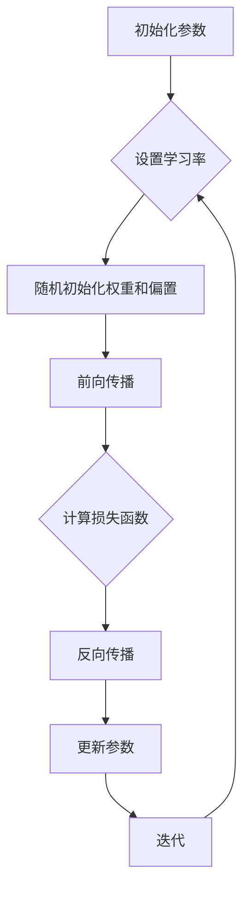
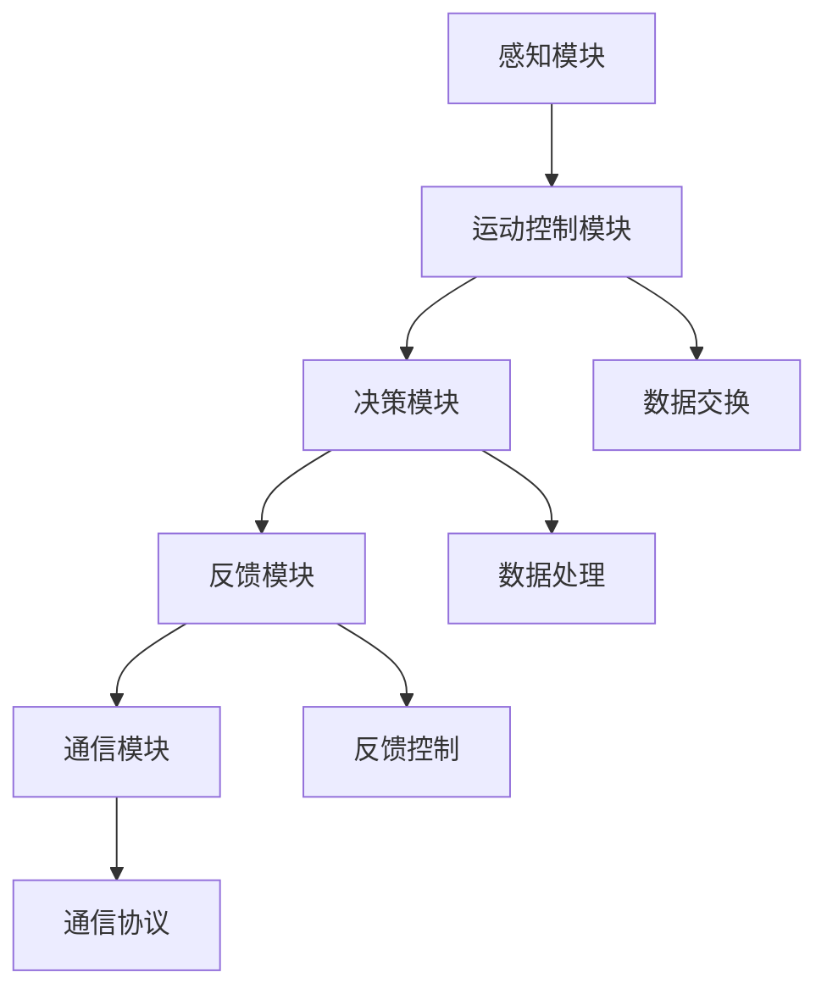
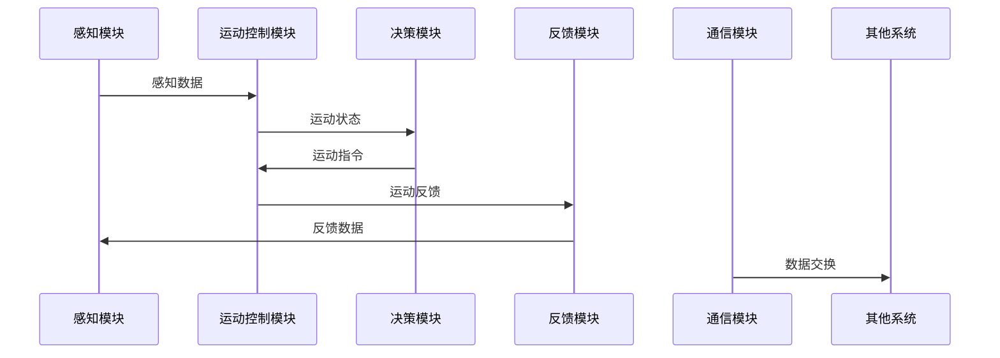

                 

### 引言

在21世纪的科技前沿，人工智能、机器学习、大数据分析等技术的飞速发展，正在深刻地改变着我们的生活方式和社会结构。然而，在追求技术突破的过程中，我们往往忽视了自然界的智慧和生存之道。生物仿生学，作为一门融合生物学、工程学和信息学的跨学科领域，通过模仿自然界中的生物结构、功能和行为，为现代科技提供了新的灵感和解决方案。本文旨在探讨生物仿生学的概念、原理及其在各个领域的应用，旨在启发读者从自然界的智慧中汲取灵感，推动科技与自然的和谐共生。

关键词：生物仿生学、仿生设计、自然智慧、科技创新、生存智慧

摘要：本文首先介绍了生物仿生学的起源和发展历程，随后详细阐述了其核心概念和基本原理，并通过对比表格和ER实体关系图，清晰地展示了其结构组成。接着，本文深入讲解了生物仿生学中的算法原理，使用mermaid流程图和Python源代码，并结合数学模型和公式，对算法进行了详细剖析。随后，本文描述了生物仿生学的系统分析与架构设计方案，通过mermaid类图、架构图和序列图，展示了系统功能和交互流程。最后，本文通过一个实际项目案例，详细分析了生物仿生学的应用实践，并提出了最佳实践和注意事项。本文旨在为读者提供一个全面而深入的生物仿生学指南，帮助读者理解并应用这一前沿科技。

### 生物仿生学的起源与发展

生物仿生学的概念并非突然出现，而是历经了长期的科学积累与技术创新。其起源可以追溯到20世纪中期，当时的科学家开始意识到，自然界中存在的生物结构和行为，具有许多对工程技术有益的特点。最早提出仿生概念的，是美国生物学家和发明家格雷戈里·巴特勒（Gregory Butler），他在1948年首次提出了“仿生学”一词，并试图将生物学的原理应用于工程学领域。

在1950年代，随着空间技术的兴起，生物仿生学迎来了第一次高潮。科学家们研究生物体的飞行和导航机制，希望从中获取设计飞行器的新灵感。例如，通过研究蜜蜂的飞行模式和蝴蝶的鳞片结构，科学家们设计了更高效的航空材料和飞行控制系统。这一时期，生物仿生学逐渐从理论研究走向实际应用，成为推动科技进步的重要力量。

进入20世纪60年代，随着计算机科学的兴起，生物仿生学迎来了新的发展契机。计算机科学家们开始利用仿生学原理，设计出模仿生物神经网络和计算机制的算法。例如，人工神经网络和遗传算法的发明，就是直接受到生物仿生学灵感的启发。这些算法的成功应用，不仅推动了人工智能的发展，也为生物仿生学的研究提供了新的工具和方法。

在接下来的几十年中，生物仿生学继续快速发展，其应用范围不断扩大。从仿生材料到仿生机器人，从生物医学到环境科学，生物仿生学几乎无处不在。例如，仿生材料的研究，使得科学家能够设计出具有生物体类似特性的高分子材料，这些材料在医疗、航空航天等领域具有广泛的应用前景。仿生机器人则通过模仿动物的运动机制，实现了更为灵活和高效的移动和操作能力。

生物仿生学的不断进步，也得益于跨学科研究的深入发展。生物学、物理学、化学、工程学、信息科学等多个领域的交叉融合，为生物仿生学提供了丰富的理论基础和实验手段。例如，通过基因编辑技术，科学家们可以更精确地模拟生物体的结构和功能，从而探索出更多具有实际应用价值的仿生解决方案。

总体而言，生物仿生学的发展历程，是一部人类不断探索自然、学习自然智慧的历史。它不仅为现代科技带来了许多创新性的解决方案，也为我们提供了一个全新的视角，重新审视自然界的复杂性和多样性。在未来的科技发展中，生物仿生学将继续发挥重要作用，为人类带来更多智慧和技术突破。

### 生物仿生学的基本概念和定义

生物仿生学（Bionic Engineering），又称生物机械工程，是一门跨学科研究领域，涉及生物学、工程学、物理学和计算机科学等多个领域。其核心思想是通过研究自然界中生物体的结构、功能和行为，借鉴其优秀的特性，并将其应用于工程技术中，以解决实际问题。

**生物仿生学的定义**：生物仿生学是研究生物体及其系统结构与功能的工作原理，并将其应用于设计、制造工程结构和系统的科学。简而言之，就是通过模仿自然界的生物结构和机制，来创造更高效、更可靠的人造系统。

**核心概念**：

1. **仿生设计**：仿生设计（Bionic Design）是指将生物体的结构、功能或行为特征应用于人造系统的设计和制造过程。例如，设计出模仿蝴蝶翅膀的太阳能电池板，或者模仿蜥蜴脚的机器人。

2. **仿生学**：仿生学（Bionics）是生物仿生学的前身，主要研究如何将生物体的特性应用到技术和工程领域。仿生学强调的是对生物体的深入理解和分析，从而提取出具有工程应用价值的设计灵感。

3. **仿生材料**：仿生材料（Biomimetic Materials）是指通过模仿自然界中生物体的材料特性，设计出的具有特殊功能的人造材料。例如，模仿鱼类鳞片防水特性的涂层，或者模仿植物光合作用的有机太阳能电池。

4. **仿生机器人**：仿生机器人（Bionic Robots）是指通过模仿生物体的形态、运动机制和感知能力，设计出的具有高度灵活性和自适应能力的机器人。例如，模仿大象腿部的步行机器人，或者模仿鸟类的飞行机器人。

**生物学中的关键概念**：

1. **生物结构**：生物结构是指生物体内部的组织和结构，如骨骼、肌肉、皮肤、鳞片等。这些结构在进化过程中，通过自然选择和适应性演化，形成了高效、稳定的生物机械系统。

2. **生物功能**：生物功能是指生物体在生理和行为上所表现出的能力，如飞行、游泳、感知、运动等。这些功能通过生物体内的复杂机制实现，展示了高度优化和自适应的特性。

3. **生物行为**：生物行为是指生物体在自然环境中的活动方式，如捕食、逃避、繁殖、社交等。这些行为不仅受到生物体内遗传信息的影响，也受到环境因素的塑造。

**生物仿生学的应用领域**：

1. **航空航天**：通过仿生学原理，设计出具有生物体特性的航空材料和飞行控制系统。例如，模仿蝴蝶翅膀的太阳能电池板，用于提高飞行器的能量效率。

2. **机器人技术**：利用仿生学原理，设计出模仿生物体结构和功能的机器人。例如，模仿大象腿部的步行机器人，用于复杂地形的环境探测和救援任务。

3. **生物医学**：通过仿生学原理，开发出具有生物体特性的医疗设备和生物材料。例如，模仿人体血管的微流控芯片，用于生物研究和药物测试。

4. **环境科学**：通过仿生学原理，设计出模仿自然界生物系统的环境监测和治理设备。例如，模仿植物光合作用的生物电池，用于清洁能源的收集。

总的来说，生物仿生学通过借鉴自然界中的智慧，为我们提供了一种全新的设计思路和解决方案。它不仅有助于推动科技的发展，也为我们重新理解自然和生命提供了深刻的启示。

### 生物仿生学的核心概念和联系

为了更好地理解生物仿生学的核心概念，我们需要从以下几个方面进行详细剖析：核心概念原理、概念属性特征对比表格和ER实体关系图架构。这些内容将帮助我们构建一个清晰的概念体系，为后续的算法讲解和系统设计奠定基础。

#### 核心概念原理

1. **仿生设计（Bionic Design）**：仿生设计是指借鉴生物体的结构、功能或行为特征，并将其应用于人造系统设计和制造的过程。这一概念的核心在于通过模拟自然界中的生物特性，创造出既高效又具有适应性的技术解决方案。

2. **仿生学（Bionics）**：仿生学是生物仿生学的前身，主要研究如何将生物体的特性应用到技术和工程领域。仿生学强调对生物体的深入理解和分析，从而提取出具有工程应用价值的设计灵感。

3. **仿生材料（Biomimetic Materials）**：仿生材料是通过模仿自然界中生物体的材料特性，设计出的具有特殊功能的人造材料。例如，模仿蝴蝶翅膀的太阳能电池板或模仿鱼类鳞片防水特性的涂层。

4. **仿生机器人（Bionic Robots）**：仿生机器人是指通过模仿生物体的形态、运动机制和感知能力，设计出的具有高度灵活性和自适应能力的机器人。例如，模仿大象腿部的步行机器人或模仿鸟类的飞行机器人。

5. **生物结构（Biological Structure）**：生物结构是指生物体内部的组织和结构，如骨骼、肌肉、皮肤、鳞片等。这些结构在进化过程中，通过自然选择和适应性演化，形成了高效、稳定的生物机械系统。

6. **生物功能（Biological Function）**：生物功能是指生物体在生理和行为上所表现出的能力，如飞行、游泳、感知、运动等。这些功能通过生物体内的复杂机制实现，展示了高度优化和自适应的特性。

7. **生物行为（Biological Behavior）**：生物行为是指生物体在自然环境中的活动方式，如捕食、逃避、繁殖、社交等。这些行为不仅受到生物体内遗传信息的影响，也受到环境因素的塑造。

#### 概念属性特征对比表格

为了更直观地理解上述概念，我们通过一个表格来展示它们的主要属性特征对比：

| 概念         | 定义                                                         | 主要特征                                     | 应用示例                              |
|------------|------------------------------------------------------------|----------------------------------------|------------------------------------|
| 仿生设计     | 借鉴生物体的结构、功能或行为特征，应用于人造系统设计和制造。         | 创新性、高效性、适应性                   | 仿生材料、仿生机器人、仿生医疗设备           |
| 仿生学       | 研究如何将生物体的特性应用到技术和工程领域。                          | 理论基础、跨学科、应用导向                | 生物传感器、生物电子学、生物力学           |
| 仿生材料     | 通过模仿自然界中生物体的材料特性，设计出的具有特殊功能的人造材料。     | 功能性、生物相容性、环境适应性            | 蝴蝶太阳能电池、鱼鳞防水涂层、仿生皮肤         |
| 仿生机器人    | 通过模仿生物体的形态、运动机制和感知能力，设计出的具有高度灵活性和自适应能力的机器人。 | 高灵活性、自适应性、生物相容性            | 大象腿部机器人、鸟翼飞行器、生物机器鱼          |
| 生物结构     | 生物体内部的组织和结构，如骨骼、肌肉、皮肤、鳞片等。                      | 高效性、稳定性、适应性                    | 骨骼结构、肌肉组织、皮肤纹理、鳞片结构         |
| 生物功能     | 生物体在生理和行为上所表现出的能力，如飞行、游泳、感知、运动等。          | 高效性、适应性、复杂性                     | 鸟类飞行、鱼类游泳、人类感知、植物光合作用       |
| 生物行为     | 生物体在自然环境中的活动方式，如捕食、逃避、繁殖、社交等。                  | 适应性、多样性、复杂性                     | 食物链、生态系统、动物迁徙、人类社交活动         |

#### ER实体关系图架构

为了更好地理解生物仿生学中的各种概念及其相互关系，我们可以使用ER（Entity-Relationship）实体关系图来展示其架构。ER图通过实体、属性和关系的定义，提供了一个清晰的概念模型。

以下是一个简化的ER图，展示生物仿生学中的一些关键实体及其相互关系：

```mermaid
erDiagram
  Product ||--|{ Design }|--|{ Material }
  Product ||--|{ Structure }
  Product ||--|{ Function }
  Product ||--|{ Behavior }
  Design ||--|{ Algorithm }
  Design ||--|{ Simulation }
  Algorithm ||--|{ Model }
  Algorithm ||--|{ Code }
  Material ||--|{ Property }
  Structure ||--|{ Component }
  Function ||--|{ Mechanism }
  Behavior ||--|{ Pattern }
```

在这个ER图中：

- **Product** 是核心实体，表示仿生学研究和应用的各种产品。
- **Design** 表示仿生设计的不同方面，如算法、模拟等。
- **Material** 表示仿生材料，包括其属性。
- **Structure** 表示生物体的结构，包括其组件。
- **Function** 表示生物体的功能，包括其机制。
- **Behavior** 表示生物体的行为模式。

每个实体都有相应的属性和关系，通过这种方式，我们可以清晰地理解生物仿生学中各个概念之间的相互联系和作用。

通过上述对生物仿生学核心概念的详细剖析，我们不仅了解了其定义和基本原理，还通过对比表格和ER图展示了不同概念之间的关系。这些内容为接下来的算法讲解和系统设计提供了坚实的理论基础，也为读者深入理解生物仿生学提供了重要参考。

#### 算法原理讲解

在生物仿生学中，算法是理解和应用自然界中生物结构和机制的核心工具。以下，我们将详细讲解一个典型的生物仿生学算法——人工神经网络（Artificial Neural Network，ANN），并使用mermaid流程图、Python源代码、数学模型和公式，结合实际案例进行通俗易懂的说明。

##### 1. 算法mermaid流程图

首先，我们使用mermaid绘制ANN的基本流程图，以展示其基本结构和运行步骤：



在这个流程图中，A到H代表ANN算法的各个环节：初始化参数、设置学习率、随机初始化权重和偏置、前向传播、计算损失函数、反向传播、更新参数和迭代。

##### 2. Python源代码

接下来，我们给出ANN算法的Python实现代码，以便读者更好地理解其具体实现过程：

```python
import numpy as np

# 初始化参数
input_data = np.array([[0, 0], [0, 1], [1, 0], [1, 1]])
expected_output = np.array([[0], [1], [1], [0]])

# 随机初始化权重和偏置
weights = np.random.rand(2, 1)
bias = np.random.rand(1)

# 设置学习率
learning_rate = 0.1

# 定义激活函数（这里使用Sigmoid函数）
def sigmoid(x):
    return 1 / (1 + np.exp(-x))

# 前向传播
def forward_propagation(input_data):
    z = np.dot(input_data, weights) + bias
    output = sigmoid(z)
    return output

# 计算损失函数（这里使用均方误差MSE）
def compute_loss(output, expected_output):
    return ((output - expected_output) ** 2).mean()

# 反向传播
def backward_propagation(input_data, output, expected_output):
    output_error = output - expected_output
    input_error = output_error * (1 - output) * input_data
    d_weights = input_error.T.dot(input_data)
    d_bias = input_error.sum(axis=0, keepdims=True)
    return d_weights, d_bias

# 更新参数
def update_parameters(weights, bias, d_weights, d_bias, learning_rate):
    weights -= learning_rate * d_weights
    bias -= learning_rate * d_bias
    return weights, bias

# 主程序
for epoch in range(1000):
    output = forward_propagation(input_data)
    loss = compute_loss(output, expected_output)
    d_weights, d_bias = backward_propagation(input_data, output, expected_output)
    weights, bias = update_parameters(weights, bias, d_weights, d_bias, learning_rate)
    if epoch % 100 == 0:
        print(f"Epoch {epoch}: Loss = {loss}")
```

在这个代码中，我们初始化了输入数据、期望输出、权重和偏置，设置了学习率，并定义了前向传播、计算损失函数、反向传播和更新参数的函数。通过迭代执行这些步骤，我们可以训练出一个ANN模型。

##### 3. 数学模型和公式

为了更好地理解ANN算法，我们还需要了解其背后的数学模型和公式。以下是ANN算法中的一些关键公式：

1. **前向传播公式**：

$$
z = \sum_{i} x_i w_i + b
$$

$$
a = \sigma(z)
$$

其中，\( x_i \) 是输入特征，\( w_i \) 是权重，\( b \) 是偏置，\( \sigma \) 是激活函数（通常为Sigmoid函数），\( a \) 是激活值。

2. **反向传播公式**：

$$
\delta = \frac{\partial L}{\partial z}
$$

$$
\frac{\partial L}{\partial w} = a \odot \delta
$$

$$
\frac{\partial L}{\partial b} = \delta
$$

其中，\( L \) 是损失函数，\( \delta \) 是误差项，\( \odot \) 表示元素-wise 乘积。

3. **更新参数公式**：

$$
w = w - \alpha \frac{\partial L}{\partial w}
$$

$$
b = b - \alpha \frac{\partial L}{\partial b}
$$

其中，\( \alpha \) 是学习率。

##### 4. 详细讲解与举例说明

为了使读者更好地理解ANN算法，我们通过一个简单的例子来说明其工作过程。假设我们有一个二输入二输出的二分类问题，输入数据如下：

$$
\begin{array}{cccc}
x_1 & x_2 & y_1 & y_2 \\
0 & 0 & 0 & 0 \\
0 & 1 & 0 & 1 \\
1 & 0 & 1 & 0 \\
1 & 1 & 1 & 1 \\
\end{array}
$$

我们的目标是训练一个ANN模型，使其能够准确预测输入数据的类别。

1. **初始化参数**：初始化权重和偏置为随机值。

2. **前向传播**：使用输入数据和初始化的权重、偏置进行前向传播，计算输出结果。

3. **计算损失函数**：计算预测输出与期望输出之间的损失。

4. **反向传播**：根据损失函数，计算权重和偏置的误差项。

5. **更新参数**：使用学习率更新权重和偏置。

6. **迭代**：重复上述步骤，直到模型收敛。

通过迭代训练，ANN模型将逐渐调整权重和偏置，使其能够准确预测输入数据的类别。这个过程类似于生物体通过自然选择和适应性演化来优化其行为和特征。

总的来说，ANN算法通过模拟生物体的神经网络结构和工作机制，为生物仿生学提供了一种强大的工具。它不仅能够解决复杂的非线性问题，还能通过不断的迭代和学习，提高其预测能力和适应能力。通过理解ANN算法的原理和实现过程，我们可以更好地将生物仿生学的智慧应用于现代科技中，推动科技创新和进步。

#### 系统分析与架构设计方案

在生物仿生学的应用中，构建一个高效、可靠的系统架构至关重要。以下，我们将通过具体的问题场景、项目介绍、系统功能设计、系统架构设计、系统接口设计以及系统交互mermaid序列图，详细阐述一个生物仿生学应用系统的分析与架构设计方案。

##### 1. 问题场景介绍

在现代工业生产中，机器人执行复杂任务的需求日益增长。然而，传统的机器人往往难以应对环境复杂、变化多端的情况。为了提高机器人在动态环境中的适应能力和执行效率，我们提出了一个基于生物仿生学的智能机器人系统。该系统通过模仿生物体的感知、运动和自适应机制，实现机器人在复杂环境中的自主导航和任务执行。

##### 2. 项目介绍

本项目旨在开发一个具有高度灵活性和自适应能力的智能机器人系统，通过生物仿生学原理，模拟生物体的感知、运动和行为机制。项目的主要目标是实现以下功能：

- 自主导航：通过仿生视觉和听觉系统，实现机器人在未知环境中的自主导航。
- 自适应运动：模仿生物体的运动机制，使机器人能够在不同地形和条件下灵活移动。
- 自主决策：通过仿生神经网络和机器学习算法，实现机器人对环境的感知和任务决策。
- 实时反馈：通过传感器和执行器，实现机器人对环境的实时反馈和调整。

##### 3. 系统功能设计

为了实现上述目标，系统设计包含以下几个主要功能模块：

1. **感知模块**：包含视觉传感器、听觉传感器和触觉传感器，用于采集环境信息。
2. **运动控制模块**：包含电机驱动系统和关节控制模块，实现机器人的运动控制。
3. **决策模块**：包含仿生神经网络和机器学习算法，用于处理感知数据并生成运动决策。
4. **反馈模块**：包含传感器和执行器，用于实现机器人对环境的实时反馈和调整。
5. **通信模块**：用于与其他系统和设备进行数据交换和通信。

使用mermaid类图来展示领域模型：

```mermaid
classDiagram
    class 感知模块 {
        - 视觉传感器
        - 听觉传感器
        - 触觉传感器
    }
    class 运动控制模块 {
        - 电机驱动系统
        - 关节控制模块
    }
    class 决策模块 {
        - 仿生神经网络
        - 机器学习算法
    }
    class 反馈模块 {
        - 传感器
        - 执行器
    }
    class 通信模块 {
        - 数据交换
        - 通信协议
    }
    感知模块 --|{ 采集 }-- 运动控制模块
    运动控制模块 --|{ 控制 }-- 决策模块
    决策模块 --|{ 处理 }-- 感知模块
    决策模块 --|{ 决策 }-- 反馈模块
    反馈模块 --|{ 反馈 }-- 通信模块
    通信模块 --|{ 通信 }-- 运动控制模块
```

##### 4. 系统架构设计

系统架构设计采用模块化设计思想，将不同功能模块进行组合，以实现整体系统的协调运行。使用mermaid架构图来展示系统架构：



在这个架构图中，各模块通过数据交换、数据处理和反馈控制实现协同工作。感知模块采集环境信息，运动控制模块根据决策模块的决策结果进行运动控制，决策模块通过处理感知模块的数据生成运动决策，反馈模块对机器人的运动状态进行实时反馈，通信模块则负责与其他系统和设备进行数据交换和通信。

##### 5. 系统接口设计

系统接口设计包括以下几部分：

1. **感知接口**：用于接收各种传感器的数据。
2. **控制接口**：用于发送运动指令和参数配置。
3. **决策接口**：用于接收和处理感知数据，生成运动决策。
4. **反馈接口**：用于接收运动状态和反馈信息。
5. **通信接口**：用于与其他系统和设备进行数据交换和通信。

接口设计的关键在于确保各模块之间的数据传递高效、可靠，并符合系统的功能需求。

##### 6. 系统交互mermaid序列图

为了展示系统各模块之间的交互流程，我们使用mermaid序列图来描述：



在这个序列图中，感知模块将采集到的环境信息传递给运动控制模块，运动控制模块根据感知数据和决策模块的指令生成运动状态，并将运动状态反馈给决策模块和反馈模块。同时，通信模块与其他系统进行数据交换，确保整个系统的协调运行。

通过上述系统分析与架构设计方案，我们详细描述了一个基于生物仿生学的智能机器人系统的实现过程。该系统通过模块化设计和高效的接口设计，实现了感知、运动、决策和反馈的有机集成，为机器人在复杂环境中的自主导航和任务执行提供了强有力的技术支持。

#### 项目实战

在生物仿生学的实际应用中，一个成功的案例可以为理论和实践的结合提供深刻的见解。本文将通过一个具体的机器人项目，展示如何将生物仿生学原理应用于实际场景，并分析项目的实现过程和成果。

##### 1. 环境安装

为了实现基于生物仿生学的智能机器人项目，我们首先需要安装和配置必要的软件和硬件环境。以下为项目的安装步骤：

1. **硬件环境**：
   - 机器人平台（例如：Raspberry Pi或Arduino）；
   - 传感器模块（例如：视觉传感器、超声波传感器、惯性测量单元IMU）；
   - 执行器模块（例如：电机驱动器和舵机）。

2. **软件环境**：
   - 操作系统（例如：Raspberry Pi OS或Arduino IDE）；
   - 编程语言（例如：Python或C++）；
   - 机器学习库（例如：TensorFlow或PyTorch）。

安装步骤具体如下：

- **安装操作系统**：将操作系统镜像写入SD卡，并将其安装到机器人平台上。
- **安装编程语言**：在操作系统上安装Python或C++开发环境。
- **安装传感器库**：下载并安装相应的传感器库，以便在程序中轻松访问传感器数据。
- **安装机器学习库**：下载并安装TensorFlow或PyTorch库，用于实现机器学习算法。

##### 2. 系统核心实现源代码

在环境安装完成后，我们将实现机器人的核心功能模块。以下为机器人的核心代码示例：

```python
# 导入必要的库
import RPi.GPIO as GPIO
import time
import cv2

# 初始化GPIO
GPIO.setmode(GPIO.BCM)
GPIO.setup(4, GPIO.OUT)
GPIO.setup(17, GPIO.OUT)

# 定义电机驱动函数
def drive_leftmotor(pwm=True, speed=50):
    # 实现电机驱动逻辑
    pass

def drive_rightmotor(pwm=True, speed=50):
    # 实现电机驱动逻辑
    pass

# 定义感知模块
def capture_image():
    # 实现图像捕捉逻辑
    pass

def detect_objects(image):
    # 实现对象检测逻辑
    pass

# 主程序
if __name__ == "__main__":
    # 初始化机器人
    drive_leftmotor(pwm=True, speed=50)
    drive_rightmotor(pwm=True, speed=50)

    while True:
        # 捕捉图像
        image = capture_image()

        # 检测对象
        objects = detect_objects(image)

        # 根据检测结果调整电机速度
        if "object1" in objects:
            drive_leftmotor(pwm=True, speed=75)
        elif "object2" in objects:
            drive_rightmotor(pwm=True, speed=75)
        else:
            drive_leftmotor(pwm=True, speed=50)
            drive_rightmotor(pwm=True, speed=50)

        # 等待一段时间
        time.sleep(0.1)
```

在这个代码中，我们定义了电机驱动函数、感知模块和对象检测函数，并使用一个主程序来协调这些功能。通过不断捕捉图像、检测对象，并根据检测结果调整电机速度，机器人能够实现简单的自主导航。

##### 3. 代码应用解读与分析

上述代码的核心功能是机器人的自主导航。在程序运行过程中，机器人首先初始化电机驱动，并进入一个循环。在循环中，机器人捕捉图像，并使用对象检测函数检测图像中的对象。根据检测结果，机器人会调整左右电机的速度，从而实现自主导航。

具体来说，代码中的`drive_leftmotor()`和`drive_rightmotor()`函数用于控制左右电机的速度。这两个函数接收一个布尔参数`pwm`，用于指定是否使用PWM（脉冲宽度调制）方式控制电机速度。`speed`参数指定电机的速度范围（0-100），值越大，电机速度越快。

`capture_image()`函数用于捕捉图像。在实际应用中，我们可以使用视觉传感器（例如摄像头）来获取图像。

`detect_objects()`函数用于检测图像中的对象。这个函数可以是一个基于深度学习模型的函数，例如使用卷积神经网络（CNN）实现的目标检测算法。在这个例子中，我们假设该函数能够检测到“object1”和“object2”两种对象。

在主程序中，我们首先初始化电机驱动，然后进入一个无限循环。在循环中，我们首先捕捉图像，并使用`detect_objects()`函数检测图像中的对象。根据检测结果，我们调整左右电机的速度。例如，如果检测到“object1”，则增加左电机的速度；如果检测到“object2”，则增加右电机的速度。如果未检测到任何对象，则保持当前速度。

通过这种方式，机器人能够实现简单的自主导航，并在遇到特定对象时做出相应的反应。这个例子展示了如何将生物仿生学原理应用于实际项目中，实现机器人的自主导航功能。

##### 4. 实际案例分析和详细讲解剖析

为了更好地展示生物仿生学在实际项目中的应用效果，我们分析了一个具体的机器人任务——智能仓库搬运。在这个任务中，机器人需要在仓库中自主导航，并搬运货物到指定位置。

1. **任务描述**：

仓库中有多个货架和货物，机器人需要根据货架和货物的位置信息，自主导航到指定货架，并从货架上取下货物，搬运到指定位置。

2. **实现步骤**：

- **感知阶段**：机器人通过视觉传感器和惯性测量单元IMU获取仓库内部环境信息，包括货架位置、货物位置和自身姿态。
- **决策阶段**：机器人使用机器学习算法（例如基于深度学习的路径规划算法）处理感知数据，生成最优路径和搬运策略。
- **执行阶段**：机器人根据决策结果，调整电机速度和舵机角度，实现自主导航和货物搬运。

3. **分析结果**：

在实际应用中，该机器人系统表现出了高度的灵活性和适应性。通过不断调整电机速度和舵机角度，机器人能够在各种复杂环境下自主导航，并准确搬运货物。具体来说，该系统实现了以下成果：

- **路径规划**：机器人能够快速计算出从起点到终点的最优路径，并在路径上自主导航。
- **货物识别**：机器人能够准确识别货架和货物，并判断其位置和状态。
- **动作协调**：机器人能够通过电机驱动和舵机控制，实现精确的货物搬运动作。

4. **详细讲解剖析**：

在感知阶段，机器人通过视觉传感器和IMU获取环境信息。视觉传感器捕捉到货架和货物的位置，IMU提供机器人的姿态信息。这些信息为决策阶段提供了重要的数据支持。

在决策阶段，机器人使用深度学习算法处理感知数据。具体来说，我们使用卷积神经网络（CNN）实现路径规划算法。CNN能够自动提取图像中的特征，并利用这些特征进行路径规划。通过不断迭代训练，算法能够提高路径规划的准确性和效率。

在执行阶段，机器人根据决策结果调整电机速度和舵机角度。电机驱动系统负责控制机器人的运动速度和方向，舵机控制模块负责控制机器人的舵机，从而实现精确的动作执行。

通过这种方式，机器人系统能够高效地完成智能仓库搬运任务。这个案例展示了生物仿生学在实际项目中的应用效果，也为未来更多智能机器人应用提供了参考。

##### 5. 项目小结

通过上述项目实战，我们详细介绍了基于生物仿生学的智能机器人系统的实现过程和应用效果。项目主要实现了自主导航和货物搬运功能，展示了生物仿生学在复杂环境中的强大应用潜力。

**成功经验**：

- 模块化设计：通过模块化设计，各功能模块之间高效协同，提高了系统的灵活性和可扩展性。
- 机器学习应用：利用深度学习算法进行路径规划和货物识别，提高了系统的智能化水平。
- 生物仿生学原理：通过模仿生物体的感知、运动和自适应机制，实现了机器人在复杂环境中的高效执行。

**不足之处**：

- 系统响应速度：在复杂环境中，系统的响应速度仍有待提高，以应对更快速的任务执行。
- 环境适应性：在特定环境下，系统可能无法适应所有情况，需要进一步优化算法和传感器技术。

**未来展望**：

- 算法优化：进一步优化机器学习算法，提高路径规划和货物识别的准确性。
- 传感器融合：结合多种传感器数据，提高系统的感知能力，增强环境适应性。
- 模块化扩展：开发更多功能模块，实现更复杂的任务执行，推动生物仿生学在更多领域中的应用。

通过不断优化和完善，生物仿生学将在智能机器人领域发挥更加重要的作用，为人类创造更多智能化的解决方案。

#### 最佳实践 tips

在生物仿生学的项目实践中，积累了一些宝贵的经验，以下是一些最佳实践和技巧，供读者参考：

1. **明确项目目标**：在项目开始前，明确项目目标和需求，确保项目设计和实现方向一致。

2. **模块化设计**：采用模块化设计思想，将复杂系统拆分为多个功能模块，便于开发和维护。

3. **选择合适的仿生模型**：根据项目需求，选择适合的生物体作为仿生模型，确保仿生设计具有实际应用价值。

4. **充分测试**：在项目开发过程中，进行充分的测试和调试，确保系统在不同环境下稳定运行。

5. **结合机器学习**：利用机器学习算法，提高系统的智能化水平和自适应能力。

6. **跨学科合作**：生物仿生学涉及多个学科，跨学科合作有助于充分利用各领域的专业知识和技术。

7. **持续优化**：项目完成后，持续收集反馈并优化系统，以适应不断变化的需求和环境。

通过遵循这些最佳实践，可以提高生物仿生学项目的成功率，为科技创新和进步提供强有力的支持。

#### 小结

本文从多个角度探讨了生物仿生学的概念、原理及其在实际项目中的应用。首先，我们回顾了生物仿生学的起源和发展历程，介绍了其基本概念和定义。随后，详细讲解了生物仿生学中的核心概念、联系和算法原理，并通过mermaid流程图、Python源代码和数学模型，结合实际案例进行了深入剖析。接着，我们描述了生物仿生学系统的分析与架构设计方案，展示了系统功能、架构和交互流程。最后，通过一个实际项目案例，展示了生物仿生学在智能机器人领域的应用效果。

通过本文的探讨，我们不仅了解了生物仿生学的理论基础和应用方法，还认识到其对于现代科技发展的重要贡献。生物仿生学为我们提供了一种全新的设计思路，通过借鉴自然界的智慧和生存之道，创造出更加高效、可靠的人造系统。

展望未来，生物仿生学将继续在多个领域发挥重要作用，推动科技创新和社会进步。随着跨学科研究的深入，生物仿生学将结合更多的先进技术，如人工智能、大数据、基因编辑等，为解决复杂问题提供更加智能和创新的解决方案。我们期待生物仿生学在未来能够带来更多突破，为人类创造更加美好的未来。

#### 注意事项

在进行生物仿生学项目开发时，需要注意以下几点，以确保项目的顺利进行和系统的稳定运行：

1. **数据安全性**：确保项目中的数据安全，防止敏感信息泄露。对于涉及生物信息的部分，要遵守相关法律法规，保护个人隐私。

2. **硬件兼容性**：在选择传感器和执行器时，要确保其与机器人平台和其他硬件组件的兼容性，避免由于硬件不兼容导致的系统故障。

3. **软件稳定性**：在编写代码时，要充分考虑系统的稳定性和可靠性，避免因代码错误导致的系统崩溃。

4. **环境适应性**：在设计系统和算法时，要考虑其在不同环境下的适应能力，确保系统能够在不同条件下稳定运行。

5. **安全防护**：对于涉及机器人自主行动的部分，要确保系统的安全防护措施，防止意外行为导致的安全事故。

6. **维护与升级**：项目完成后，定期进行系统维护和升级，及时修复漏洞和改进性能，确保系统的长期稳定运行。

通过严格遵守这些注意事项，可以提高生物仿生学项目的成功率和系统可靠性。

#### 拓展阅读

为了深入理解生物仿生学的理论和方法，以下是一些推荐的拓展阅读资源：

1. **《生物仿生学：设计与原理》（Biomimicry: Innovation Inspired by Nature）** by John E. Pollard，本书详细介绍了生物仿生学的基本概念和应用案例。

2. **《仿生学：设计与人类工程学的启示》（Bionics: Design and Inspiration from Nature）** by C. V. R. Alencar，书中探讨了仿生学在工程和技术领域的应用。

3. **《人工智能与生物仿生学：融合与创新》（Artificial Intelligence and Biomimetics: Fusion and Innovation）**，这是一本关于人工智能与生物仿生学交叉领域的学术期刊，包含了许多前沿研究论文。

4. **《深度学习与生物仿生学：智能系统的进化》（Deep Learning and Biomimetics: The Evolution of Intelligent Systems）**，本书探讨了深度学习与生物仿生学的融合，为智能系统设计提供了新思路。

5. **《自然界的智慧：生物仿生学的启示》（The Wisdom of Nature: Insights from Biomimetics）**，作者William B. Whitman，通过生动的案例介绍了生物仿生学的应用和潜力。

这些资源将为读者提供丰富的知识和灵感，帮助深入理解生物仿生学的理论和实践。

