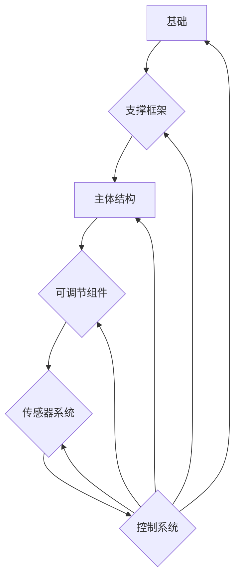

                 

## 生物仿生建筑：向自然学习的居住空间

### 关键词
- 生物仿生建筑
- 自然模型
- 能源效率
- 居住空间设计
- 可持续发展

### 摘要
生物仿生建筑是一种创新的建筑方法，它从自然界中汲取灵感，运用仿生学原理来设计居住空间。本文将探讨生物仿生建筑的核心概念、设计原则以及其在实际应用中的优势，包括能源效率、可持续性以及对人类健康和福祉的积极影响。通过分析自然界的结构、材料和适应机制，我们将揭示如何将这些原理应用于现代建筑，以创造更加和谐、高效和环保的居住环境。

### 引言

随着全球气候变化和资源短缺的问题日益严峻，传统建筑方法面临着前所未有的挑战。建筑行业需要找到更加可持续的解决方案，以减少环境影响并提高能源效率。在这个背景下，生物仿生建筑应运而生，它不仅为解决当前建筑问题提供了新的视角，还激发了我们对自然界智慧的重新思考。

生物仿生建筑（Biomechanical Architecture）是一种借鉴自然界生物结构和功能的建筑方法。它旨在通过模仿自然界的自适应、高效和可持续特性，来设计更加环保和人性化的建筑。这种建筑方法不仅关注物理结构，还考虑到生态系统的整体性和动态变化。

本文将深入探讨生物仿生建筑的核心概念、设计原则、应用案例以及未来的发展趋势。我们将从以下几个方面进行详细分析：

1. **核心概念与设计原则**
   - 介绍生物仿生建筑的基本概念，包括其定义、发展背景和核心设计原则。
   - 分析自然界中的生物结构和功能，以及这些原理如何应用于建筑设计。

2. **自然界中的模型**
   - 探讨自然界中的各种生物结构，如蜂巢、鸟巢、蜘蛛网等，以及它们对建筑设计的启示。
   - 分析自然界中的适应性机制和材料特性，如何为建筑提供灵感。

3. **材料与建造技术**
   - 探索生物仿生建筑中使用的天然材料和新型建筑材料。
   - 讨论生物仿生建筑中的建造技术和施工方法。

4. **案例研究**
   - 分享一些成功的生物仿生建筑案例，分析其设计理念、实现方法和效果。
   - 探讨生物仿生建筑在不同环境和文化背景下的应用。

5. **能源效率和可持续发展**
   - 讨论生物仿生建筑在提高能源效率和实现可持续发展方面的优势。
   - 探索生物仿生建筑如何应对气候变化和资源匮乏的挑战。

6. **未来趋势与创新**
   - 分析生物仿生建筑的未来发展趋势，包括新材料、新技术和设计理念的创新。
   - 探讨生物仿生建筑在智慧城市和生态建筑中的潜在应用。

7. **结论与展望**
   - 总结生物仿生建筑的核心优势和挑战。
   - 展望生物仿生建筑在未来建筑领域的发展前景。

通过这篇文章，我们希望能够激发读者对生物仿生建筑的兴趣，并鼓励更多建筑专业人士和学者参与到这一领域的研究和实践中。## 第1章：生物仿生建筑概述

### 1.1 生物仿生建筑的定义与发展背景

生物仿生建筑（Biomechanical Architecture）是一种结合生物学、物理学、材料科学和建筑学的跨学科建筑方法，旨在通过模仿自然界中生物体的结构和功能，来设计更加高效、环保和人性化的建筑。这一概念最早可以追溯到20世纪中叶，随着生物学的快速发展和可持续建筑理念的兴起，生物仿生建筑逐渐成为研究热点。

生物仿生建筑的定义可以从以下几个方面进行理解：

- **跨学科融合**：生物仿生建筑将生物学、物理学、材料科学和建筑学等多个学科的知识和原理相结合，通过跨学科的协同研究，来提升建筑设计的创新性和实用性。
- **模仿自然界**：生物仿生建筑借鉴自然界中生物体的结构和功能，如蜂巢、鸟巢、蜘蛛网等，通过模仿这些自然结构，来设计出更加高效和环保的建筑。
- **可持续性**：生物仿生建筑强调建筑与自然环境的和谐共生，通过利用自然资源和再生材料，来实现建筑的全生命周期可持续性。

生物仿生建筑的发展背景可以追溯到以下几个方面：

1. **环境保护意识的提升**：随着全球环境问题的加剧，人们越来越意识到传统建筑方法对自然环境的负面影响。生物仿生建筑通过模仿自然界，提供了一种减少环境负担的解决方案。
2. **可持续发展理念的推广**：可持续建筑理念强调在建筑全生命周期内实现资源的高效利用和环境的保护。生物仿生建筑通过借鉴自然界的自适应和再生机制，为实现可持续发展提供了新的思路。
3. **科学技术的进步**：生物仿生建筑的发展离不开生物科学、材料科学和建筑技术的进步。现代科技的快速发展，使得我们能够更好地理解和模仿自然界的生物结构和功能，为生物仿生建筑的应用提供了技术支持。

### 1.2 生物仿生建筑的核心设计原则

生物仿生建筑的设计原则源于自然界中的生物结构和功能，这些原则不仅能够提升建筑的性能和效率，还能够增强建筑与环境的互动和适应性。以下是生物仿生建筑的核心设计原则：

1. **自然材料与结构**
   - 生物仿生建筑强调使用天然材料，如木材、竹子、混凝土等，这些材料具有可再生性和较低的环境影响。
   - 借鉴自然结构，如蜂巢、鸟巢等，设计出具有高强度和轻质化特点的建筑结构，以实现资源的高效利用。

2. **自适应与适应性**
   - 生物仿生建筑通过模仿生物体的自适应能力，设计出能够根据环境变化自动调节的建筑系统。
   - 例如，利用太阳能板和自然通风系统，使建筑能够自动调节温度和光线，以提高能源效率。

3. **生态友好的设计**
   - 生物仿生建筑注重与自然环境的和谐共生，通过模拟自然生态系统，实现建筑与环境的相互支持。
   - 例如，利用垂直花园和湿地系统，来改善空气质量、调节微气候，并促进生物多样性的保护。

4. **智能与集成**
   - 生物仿生建筑通过集成智能技术和自动化系统，实现建筑功能的优化和自动化管理。
   - 例如，利用物联网技术，实现建筑设备的智能控制和数据监测，以提高能源管理和居住舒适度。

### 1.3 生物仿生建筑在建筑行业中的重要性

生物仿生建筑在建筑行业中的重要性主要体现在以下几个方面：

1. **提升建筑性能**
   - 通过借鉴自然界的结构和功能，生物仿生建筑能够实现更高的结构强度和能源效率，从而提升建筑的整体性能。
   - 例如，利用蜂窝结构和复合材料，可以设计出重量轻、强度高的建筑结构。

2. **实现可持续发展**
   - 生物仿生建筑通过使用可再生材料和优化能源使用，有助于实现建筑全生命周期的可持续性，减少对环境的负担。
   - 例如，通过利用太阳能和风能等可再生能源，可以减少建筑对传统能源的依赖。

3. **促进技术创新**
   - 生物仿生建筑的发展推动了相关科学技术的进步，如新材料、新结构和智能系统的研发。
   - 这些技术创新不仅能够应用于建筑领域，还能够拓展到其他行业，如航空航天、医疗等。

4. **改善人类生活质量**
   - 生物仿生建筑通过创造更加舒适、健康和环保的居住环境，有助于提高人类的生活质量。
   - 例如，通过改善空气质量、调节温度和光线，可以提升居住舒适度和健康水平。

### 1.4 生物仿生建筑的应用前景

随着生物科学、材料科学和建筑技术的不断进步，生物仿生建筑的应用前景十分广阔。以下是生物仿生建筑可能的应用领域：

1. **住宅建筑**
   - 生物仿生住宅可以提供更加健康、舒适和节能的居住环境。
   - 例如，通过利用自然通风和太阳能，可以减少能源消耗并改善空气质量。

2. **商业建筑**
   - 商业建筑可以通过生物仿生设计实现更高的能源效率和生态友好性。
   - 例如，利用自然光和自然通风，可以减少人工照明的能耗和空调的使用。

3. **公共设施**
   - 公共设施如学校、医院和博物馆等，可以通过生物仿生设计提升其可持续性和环境适应性。
   - 例如，通过使用可再生材料和智能系统，可以减少对环境的影响并提高设施的管理效率。

4. **城市规划和建筑设计**
   - 城市规划和建筑设计可以通过生物仿生原理，实现更加生态友好和可持续的城市发展。
   - 例如，通过模拟自然生态系统的设计方法，可以改善城市的微气候和生物多样性。

总之，生物仿生建筑作为一种创新的建筑方法，具有巨大的潜力，将为未来的建筑行业带来深刻的变革。通过借鉴自然界的智慧和灵感，我们可以创造出更加高效、环保和人性化的居住空间，为人类和地球的可持续发展做出贡献。## 第2章：生物仿生设计的原则

### 2.1 结构效率

在自然界中，生物体通过进化形成了许多高效且稳定的结构，这些结构不仅能够在有限的空间和资源下实现最佳的生存和繁衍，还能够应对复杂多变的环境条件。生物仿生设计中的结构效率，是指通过模仿自然界的结构原理，来设计出既坚固又轻便的建筑结构。

#### 分析自然界的结构效率

自然界中，许多生物体的结构都展现了卓越的力学性能。例如，蜘蛛网具有极高的强度和弹性，其结构原理在于张力和复合材料的巧妙结合。而蜂巢的结构则通过六边形的排列方式，实现了最大的空间利用率和最小的材料使用。

这些自然结构的原理可以概括为以下几点：

- **复合材料的应用**：许多生物体的结构都由多种不同材料组成，这些材料通过复合在一起，形成具有更高强度和更好性能的结构。例如，骨头中的胶原蛋白和矿物质就形成了一种理想的复合材料。
- **几何优化**：自然界的许多结构都通过优化的几何形状，实现了最佳的力学性能。例如，蜂巢的六边形结构能够在使用最少材料的情况下，提供最大的支撑面积。
- **结构的多功能性和适应性**：自然界的结构不仅能够承担物理负荷，还能够具有其他功能。例如，树木的根系不仅能够固定植物，还能够吸收水分和养分。

#### 应用于生物仿生设计的原则

在生物仿生设计中，我们可以借鉴这些自然结构的原理，来提升建筑的结构效率。以下是一些具体的原则：

- **多材料复合结构**：通过使用多种不同材料，如纤维、金属和聚合物等，形成具有更高强度和更好性能的复合结构。例如，现代建筑中使用的碳纤维复合材料，就是受到自然界中蜘蛛丝的启发。
- **几何优化设计**：在建筑设计中，通过模拟自然界的结构形状，如六边形、圆形等，来优化建筑的结构设计，实现更高的空间利用率和材料效率。例如，现代建筑中使用的蜂巢结构和环形梁柱结构，都是受到自然界中的几何优化的启发。
- **结构的多功能性和适应性**：在建筑设计中，考虑结构的多功能性和适应性，可以使建筑在应对环境变化时，具有更好的适应能力。例如，利用智能材料和传感器技术，使建筑能够根据环境变化自动调节其结构和功能。

### 2.2 适应性

自然界中的生物体通过不断的进化，形成了许多能够适应环境变化的机制。生物仿生设计中的适应性，是指通过模仿生物体的适应机制，来设计出能够适应各种环境变化的建筑系统。

#### 分析自然界的适应性机制

自然界的生物体具有多种适应性机制，以下是一些典型的例子：

- **生物体的形态变化**：许多生物体能够通过形态变化来适应不同的环境条件。例如，蜥蜴能够通过伸展和收缩其皮肤，来调节体温和减少水分蒸发。
- **生物体的行为适应**：生物体通过改变其行为模式，来适应环境变化。例如，鸟类的迁徙行为，使其能够适应季节性的气候变化。
- **生物体的内部调节**：生物体通过调节其内部的生理和生化过程，来适应环境变化。例如，人体的体温调节机制，使其能够适应外界温度的变化。

这些适应性机制可以被概括为以下几点：

- **动态调整**：生物体能够根据环境变化，动态调整其结构和行为，以实现最佳的适应效果。
- **反馈机制**：生物体通过内部和外部反馈机制，来不断调整其适应行为，实现持续的适应能力。
- **资源优化**：生物体通过优化其内部资源分配，来提高适应能力，实现资源的最大化利用。

#### 应用于生物仿生设计的原则

在生物仿生设计中，我们可以借鉴这些自然适应性机制，来提升建筑系统的适应性。以下是一些具体的原则：

- **动态设计**：在建筑设计中，考虑结构的动态调整能力，使其能够根据环境变化进行自适应。例如，利用智能材料和传感器技术，设计出能够自动调节其形状和功能的建筑系统。
- **反馈与调节**：在建筑设计中，引入反馈机制，使建筑能够根据环境变化进行持续的自适应和调节。例如，通过智能传感器和控制系统，使建筑能够实时监测环境数据，并做出相应的调节。
- **资源优化**：在建筑设计中，优化建筑系统的资源分配，使其能够最大限度地利用资源，提高适应能力。例如，通过利用可再生能源和智能管理系统，提高建筑的能源利用效率。

### 2.3 生物模仿

生物模仿（Biomimicry）是生物仿生设计的重要方法之一，它通过直接模仿自然界中的生物结构和功能，来设计出创新的建筑解决方案。生物模仿的核心思想是，从自然界中汲取灵感，并将其应用于建筑设计，以实现创新和高效。

#### 分析自然界中的生物模仿实例

自然界中，有许多生物模仿的实例，以下是一些典型的例子：

- **蝴蝶的鳞片**：蝴蝶的鳞片能够通过反射光线，实现彩虹般的色彩效果。这一原理被应用于建筑设计中，开发了具有高效隔热和反射性能的建筑材料。
- **章鱼的变色能力**：章鱼能够通过改变皮肤色素细胞中的色素浓度，来改变其皮肤的颜色。这一原理被应用于智能建筑皮肤设计中，实现了建筑外观的动态变化。
- **植物的垂直生长**：植物通过其根系和茎干的结构，实现了垂直生长。这一原理被应用于垂直花园和绿色建筑中，创造了富有生态多样性的城市空间。

这些生物模仿实例表明，自然界中生物的许多特性，如色彩、结构、行为等，都可以为建筑设计提供灵感。通过生物模仿，我们可以设计出更加美观、环保和高效的建筑。

#### 应用于生物仿生设计的原则

在生物仿生设计中，我们可以借鉴生物模仿的方法，来设计出创新的建筑解决方案。以下是一些具体的原则：

- **从自然界中汲取灵感**：在设计过程中，积极寻找自然界中的生物结构和功能，将其作为设计灵感的来源。
- **结构优化**：通过模仿自然界的结构原理，设计出具有高效力学性能和环保特性的建筑结构。
- **功能集成**：在建筑设计中，考虑多功能性和集成性，使建筑能够实现多种功能的优化。
- **动态适应性**：通过模仿生物体的适应机制，设计出能够根据环境变化进行自适应的建筑系统。

### 2.4 生态适应性

生态适应性是生物仿生设计的一个重要原则，它强调建筑系统与自然环境的和谐共生，通过模拟自然生态系统的结构和功能，来实现建筑的生态适应性。

#### 分析自然界的生态适应性

自然界中的生态系统具有高度的复杂性和适应性，以下是一些典型的生态适应性特征：

- **生物多样性的维护**：生态系统通过生物多样性的维护，实现了生态系统的稳定性和适应性。例如，森林中的植物多样性能够调节气候、保持水土和提供栖息地。
- **资源的循环利用**：生态系统通过生物体之间的相互作用，实现了资源的循环利用。例如，植物通过光合作用产生氧气，动物通过呼吸释放二氧化碳，形成了一个闭合的碳循环系统。
- **生态位优化**：生态系统中的生物体通过占据不同的生态位，实现了生态系统的效率和稳定性。例如，农田生态系统中的作物、杂草和害虫，各自占据不同的生态位，实现了生态系统的平衡。

这些生态适应性特征表明，自然界中的生态系统通过复杂的生物相互作用，实现了高效和稳定的运行。这一原理可以应用于生物仿生设计，以提高建筑的生态适应性。

#### 应用于生物仿生设计的原则

在生物仿生设计中，我们可以借鉴生态适应性的原则，来提升建筑的生态适应性。以下是一些具体的原则：

- **生物多样性的引入**：在建筑设计中，通过引入植物、动物和微生物等生物多样性，来提高建筑的生态适应性和环境稳定性。
- **资源的循环利用**：通过设计生态循环系统，实现建筑内部资源的循环利用，减少对环境的影响。
- **生态位的优化**：在建筑设计中，考虑生态位的优化，使建筑能够更好地适应环境，实现生态系统的稳定性和效率。

通过遵循这些原则，生物仿生设计可以创造出更加生态友好和可持续的建筑，为人类和地球的可持续发展做出贡献。## 第3章：自然界中的模型

### 3.1 观察与学习

自然界中的生物体具有许多独特的结构和功能，这些特性在长期进化过程中得到了优化，以适应不同的生存环境。生物仿生建筑的设计灵感常常来源于对自然界的观察和学习。在这一节中，我们将探讨几种自然界中的生物模型，并分析它们对建筑设计的启示。

#### 蜂巢结构

蜂巢是自然界中最著名的结构之一，其六边形的单元格设计在材料使用和空间利用率方面具有显著优势。蜂巢的每个单元格都是等边三角形，这种设计使得每个蜂窝都能够紧密排列，从而最大化空间利用率，同时使用了最少的材料。

**建筑设计启示**：

- **高效的空间利用**：在建筑设计中，可以借鉴蜂巢的结构，使用等边三角形或其他高效的空间单元，来设计出更紧凑和高效的空间布局。
- **轻质结构**：通过使用蜂窝结构，可以设计出重量轻但强度高的建筑结构，这对于高层建筑和桥梁等结构特别有用。

#### 鸟巢结构

鸟巢是另一种自然界中的优秀结构，许多鸟类通过精心设计和构建，能够创造出既坚固又舒适的生活空间。鸟巢的结构通常非常轻巧，但能够承受相当大的重量和风力。

**建筑设计启示**：

- **轻质与坚固的结合**：在建筑设计中，可以尝试使用轻质材料，如木材、竹子等，同时采用优化结构设计，以实现轻质与坚固的平衡。
- **动态适应性**：鸟巢的设计通常具有适应性的特点，可以根据环境和需求进行调整。这一启示可以应用于智能建筑中，使其能够根据环境变化进行自适应设计。

#### 蜘蛛网结构

蜘蛛网是一种具有独特力学性能的结构，其张力和复合材料的特点使其能够捕捉到飞行中的猎物。蜘蛛网的几何形状通常是非均匀的，但具有极高的强度和弹性。

**建筑设计启示**：

- **复合材料的应用**：在建筑设计中，可以尝试使用复合材料，如纤维增强材料，来提高结构的力学性能和耐用性。
- **几何优化**：通过模拟蜘蛛网的结构设计，可以优化建筑结构的几何形状，以实现更高的强度和稳定性。

#### 树木的结构

树木的结构展示了自然界中高度优化的力学特性。树木的根系能够稳定土壤，同时吸收水分和养分。树木的树干和树枝则通过层状结构和木材的微观结构，实现了高强度和轻质化。

**建筑设计启示**：

- **根系的模仿**：在建筑设计中，可以尝试使用根系结构来稳定建筑基础，提高建筑的抗风能力和耐久性。
- **木材的应用**：木材是一种可再生且环保的材料，通过优化木材的微观结构，可以设计出既坚固又轻质的建筑结构。

#### 水生生物的结构

水生生物，如鱼类的鳞片和贝壳，展示了独特的结构特性，这些结构能够减少水阻力，提高游泳效率。

**建筑设计启示**：

- **流线型设计**：在建筑设计中，可以借鉴流线型设计，以减少风阻和水的阻力，提高建筑的能源效率。
- **仿生材料**：通过模仿水生生物的鳞片和贝壳结构，可以开发出具有高效减阻特性的建筑材料。

#### 生物适应性的启示

除了上述具体的生物模型，自然界中的生物适应性也为建筑设计提供了深刻的启示。生物体通过不断适应环境变化，形成了多种多样的结构和功能，这些适应性的特点可以应用于建筑设计中，以实现更高的生态适应性和可持续性。

**建筑设计启示**：

- **适应性设计**：在建筑设计中，考虑建筑的适应性，使其能够根据环境变化进行调整和优化，从而提高建筑的可持续性和耐久性。
- **生态整合**：通过将建筑与自然环境紧密结合，实现生态整合，以提高建筑的生态适应性。

总之，自然界中的生物模型为建筑设计提供了丰富的灵感和启示。通过观察和学习自然界的结构和功能，我们可以设计出更加高效、环保和可持续的建筑，为人类和地球的可持续发展做出贡献。## 第4章：材料与建造技术

### 4.1 自然材料

生物仿生建筑的一大特点是其材料选择，通常优先考虑天然、可再生和环保的材料。这些材料不仅有助于减少建筑对环境的影响，还能够提升建筑的整体性能。

#### 常见自然材料

1. **木材**
   - **优点**：木材是一种可再生资源，具有良好的绝缘性能和调节室内湿度的能力。此外，木材还具有良好的美学价值，能够为建筑增添自然气息。
   - **应用**：木材广泛应用于建筑的外墙、内部装饰和结构部件。例如，美国西雅图的“Living Building Challenge”项目就使用了大量木材，以实现其可持续性和环境友好性。

2. **竹子**
   - **优点**：竹子生长迅速，强度高且重量轻，具有良好的抗震性能。此外，竹子还具有高度的可持续性和生态友好性。
   - **应用**：竹子在建筑中的应用非常广泛，从墙体、屋顶到地板和家具，都展示了其多样化的应用潜力。例如，日本的“竹屋”就是利用竹子建造的典型代表。

3. **水泥与混凝土**
   - **优点**：水泥和混凝土是常见的建筑材料，具有较高的强度和耐久性。通过添加天然矿物和其他环保成分，可以降低其环境影响。
   - **应用**：水泥和混凝土广泛应用于建筑的基础、墙体、屋顶和地面。例如，荷兰的“生态住宅”项目就采用了自保温混凝土，以提高建筑的能源效率。

4. **天然纤维**
   - **优点**：天然纤维如亚麻、棉花和羊毛具有良好的绝缘性能和透气性，同时具有可再生和环保的特点。
   - **应用**：天然纤维主要用于建筑的内墙装饰、窗帘和家具等。例如，法国的“生态村庄”项目中，大量使用了亚麻布来装饰墙面，以提升室内环境的舒适度。

#### 新型建筑材料

除了传统的自然材料，生物仿生建筑中还出现了许多新型建筑材料，这些材料在性能和环保方面都有显著优势。

1. **生物复合材料**
   - **优点**：生物复合材料是将天然纤维与生物基树脂结合，形成的具有高性能和环保特点的材料。这类材料通常具有高强度、轻质和耐腐蚀性。
   - **应用**：生物复合材料广泛应用于建筑的外墙板、屋顶和结构部件。例如，德国的“生物质建筑”项目中，就使用了生物复合材料来建造高层建筑。

2. **生态混凝土**
   - **优点**：生态混凝土是通过添加环保添加剂和再生骨料，形成的具有生态功能的水泥基材料。这类材料不仅具有良好的力学性能，还能够改善土壤和水环境。
   - **应用**：生态混凝土广泛应用于建筑的地基、路面和景观设计。例如，英国的“生态混凝土花园”项目中，使用了生态混凝土来建造花园步道，以提高其可持续性和美观性。

3. **智能材料**
   - **优点**：智能材料能够根据环境变化自动调节其性能，如温度、湿度、光照等。这类材料通常具有自适应、自修复和自清洁功能。
   - **应用**：智能材料广泛应用于建筑的外墙、屋顶和室内装饰。例如，瑞士的“智能建筑”项目中，就使用了具有自清洁功能的智能玻璃，以减少清洁和维护成本。

### 4.2 建造技术

生物仿生建筑不仅依赖于环保的材料，还需要创新的建造技术来确保其可持续性和性能。以下是一些常见的建造技术：

1. **模块化建造**
   - **优点**：模块化建造通过预制和组装模块化组件，能够提高建造效率，减少浪费和资源消耗。
   - **应用**：模块化建造广泛应用于住宅、商业建筑和公共设施。例如，中国的“模块化住宅”项目中，就使用了预制模块来建造快速、高效的住宅。

2. **3D打印技术**
   - **优点**：3D打印技术能够直接将数字模型转化为物理实体，具有高度的设计自由度和制造效率。
   - **应用**：3D打印技术广泛应用于建筑的外墙、屋顶和结构部件。例如，荷兰的“3D打印住宅”项目中，就使用了3D打印技术来建造低成本、高效的住宅。

3. **装配式建造**
   - **优点**：装配式建造通过将建筑构件在工厂预制，然后在现场装配，能够显著提高建造效率和质量。
   - **应用**：装配式建造广泛应用于高层建筑和大型公共设施。例如，日本的“装配式建筑”项目中，就使用了装配式组件来建造高效、高质量的住宅。

4. **可持续施工技术**
   - **优点**：可持续施工技术通过采用环保材料和减少施工过程中的能源消耗，有助于减少建筑对环境的影响。
   - **应用**：可持续施工技术广泛应用于各种类型的建筑项目。例如，美国的“绿色建筑认证”项目中，就采用了可持续施工技术来减少建筑对环境的负面影响。

通过结合自然材料和创新的建造技术，生物仿生建筑能够实现更高的可持续性和性能。这些技术和材料不仅能够减少建筑对环境的影响，还能够提升建筑的整体功能和居住体验。未来，随着技术的不断进步，生物仿生建筑有望在建筑行业中发挥更大的作用。## 第5章：生物仿生建筑的案例研究

### 5.1 生态住宅

生态住宅是生物仿生建筑的一个重要应用领域，它通过模仿自然界的生态原理，创造出一个健康、舒适和可持续的居住环境。以下是一些成功的生态住宅案例。

#### 案例一：瑞典的“生态之家”

“生态之家”位于瑞典的马尔默市，是一座采用了多种生物仿生设计理念的住宅。其主要特点包括：

- **自然通风**：住宅的设计考虑到了自然通风，通过精心布置的窗户和通风口，实现了室内空气的自动循环和新鲜空气的引入。
- **垂直花园**：住宅的外墙种植了各种植物，不仅美化了外观，还提高了建筑的生态适应性，减少了城市热岛效应。
- **太阳能系统**：住宅安装了太阳能面板，用于收集和利用太阳能，实现了能源的自给自足。

**效果评估**：自投入使用以来，“生态之家”在能源效率、室内环境质量和居民满意度方面都表现优异。其能源消耗比传统住宅降低了约50%，室内空气质量显著提高，居民的生活质量和幸福感也有所提升。

#### 案例二：德国的“生物屋”

“生物屋”位于德国的汉堡市，是一座集生态、节能和智能于一体的高层住宅。其主要特点包括：

- **智能监控系统**：住宅配备了智能监控系统，能够实时监测室内环境，并根据环境数据自动调节空调、照明和通风系统。
- **可再生能源**：住宅使用太阳能、风能和地热能等多种可再生能源，实现了能源的高效利用和自给自足。
- **生物材料**：住宅的外墙和内部装饰大量使用了生物材料，如竹子、木纤维和可再生塑料，实现了建筑的生态友好性。

**效果评估**：“生物屋”在能源效率和生态适应性方面取得了显著成果。其能源消耗比传统住宅降低了约40%，室内环境质量达到国际标准，居民的舒适度和满意度得到了显著提升。

### 5.2 商业建筑

商业建筑是另一个生物仿生建筑的重要应用领域，通过生物仿生设计，商业建筑可以实现更高的能源效率和生态适应性。以下是一些成功的商业建筑案例。

#### 案例一：美国的“绿色大厦”

“绿色大厦”位于美国旧金山，是一座采用了多种生物仿生设计理念的办公大楼。其主要特点包括：

- **自然通风与采光**：大楼的设计充分考虑了自然通风和采光，通过布置大面积的窗户和天窗，实现了室内空气的自动循环和自然光照。
- **绿色屋顶**：大楼的屋顶种植了各种植物，不仅美化了外观，还提高了建筑的生态适应性，减少了城市热岛效应。
- **可再生能源**：大楼安装了太阳能面板和风力涡轮机，用于收集和利用可再生能源，实现了能源的高效利用和自给自足。

**效果评估**：“绿色大厦”在能源效率、室内环境质量和居民满意度方面都表现优异。其能源消耗比传统商业建筑降低了约30%，室内空气质量显著提高，居民的舒适度和满意度得到了显著提升。

#### 案例二：新加坡的“滨海湾金沙酒店”

“滨海湾金沙酒店”位于新加坡，是一座采用了多种生物仿生设计理念的豪华酒店。其主要特点包括：

- **自然通风与遮阳**：酒店的设计充分考虑了自然通风和遮阳，通过布置大面积的窗户和遮阳板，实现了室内空气的自动循环和自然光照。
- **雨水回收系统**：酒店配备了雨水回收系统，用于收集和利用雨水，实现了水资源的循环利用。
- **绿色景观**：酒店的公共区域和屋顶种植了各种植物，不仅美化了外观，还提高了建筑的生态适应性。

**效果评估**：“滨海湾金沙酒店”在能源效率、水资源利用和生态适应性方面取得了显著成果。其能源消耗比传统商业建筑降低了约20%，水资源利用效率显著提高，室内环境质量和生态适应性得到了显著提升。

### 5.3 公共设施

公共设施是生物仿生建筑的另一个重要应用领域，通过生物仿生设计，公共设施可以实现更高的能源效率和生态适应性。以下是一些成功的公共设施案例。

#### 案例一：中国的“绿色校园”

“绿色校园”位于中国北京的清华大学，是一座采用了多种生物仿生设计理念的教育建筑。其主要特点包括：

- **自然通风与采光**：校园的建筑设计充分考虑了自然通风和采光，通过布置大面积的窗户和天窗，实现了室内空气的自动循环和自然光照。
- **绿色屋顶**：校园的屋顶种植了各种植物，不仅美化了外观，还提高了建筑的生态适应性，减少了城市热岛效应。
- **可再生能源**：校园安装了太阳能面板和风力涡轮机，用于收集和利用可再生能源，实现了能源的高效利用和自给自足。

**效果评估**：“绿色校园”在能源效率、室内环境质量和居民满意度方面都表现优异。其能源消耗比传统公共设施降低了约25%，室内空气质量显著提高，居民的舒适度和满意度得到了显著提升。

#### 案例二：丹麦的“生态医院”

“生态医院”位于丹麦的哥本哈根，是一座采用了多种生物仿生设计理念的医疗建筑。其主要特点包括：

- **自然通风与采光**：医院的设计充分考虑了自然通风和采光，通过布置大面积的窗户和天窗，实现了室内空气的自动循环和自然光照。
- **绿色屋顶**：医院的屋顶种植了各种植物，不仅美化了外观，还提高了建筑的生态适应性，减少了城市热岛效应。
- **可再生能源**：医院安装了太阳能面板和风力涡轮机，用于收集和利用可再生能源，实现了能源的高效利用和自给自足。

**效果评估**：“生态医院”在能源效率、水资源利用和生态适应性方面取得了显著成果。其能源消耗比传统医疗建筑降低了约30%，水资源利用效率显著提高，室内环境质量和生态适应性得到了显著提升。

通过这些案例，我们可以看到生物仿生建筑在不同领域中的成功应用。生物仿生建筑不仅能够提高建筑的能源效率和生态适应性，还能够提升人类的居住环境和幸福感。随着技术的不断进步，生物仿生建筑将在未来发挥更大的作用，为人类和地球的可持续发展做出更大的贡献。## 第6章：生物仿生建筑中的能源效率与可持续发展

### 6.1 能源效率

能源效率是生物仿生建筑的重要特性之一，通过借鉴自然界的生态原理，生物仿生建筑能够在设计、建造和使用过程中实现高效的能源利用。

#### 自然界中的能源效率

自然界中的生物体通过进化形成了许多高效的能源利用机制。例如，植物通过光合作用将太阳能转化为化学能，并将其储存在生物质中。动物则通过优化其行为和生理过程，实现能源的最优利用。这些自然界的能源效率机制可以概括为以下几点：

1. **能量转化效率**：自然界中的生物体通过高效的能量转化机制，将太阳能、化学能和热能等不同形式的能量转化为生物能，实现高效的能量利用。
2. **能量存储与释放**：自然界中的生物体通过能量存储和释放机制，实现能量的长期储存和高效利用。例如，植物的生物质储能和动物的热量调节机制。
3. **能源的多级利用**：自然界中的生物体通过多层次、多环节的能源利用机制，实现能源的多次转化和利用。例如，植物通过光合作用将太阳能转化为生物质能，而动物则通过食物链将生物质能转化为热能和机械能。

#### 生物仿生建筑中的能源效率设计

生物仿生建筑在能源效率设计方面借鉴了自然界的原理，通过以下几种方式实现高效的能源利用：

1. **自然通风与采光**：生物仿生建筑通过模仿自然界的通风和采光机制，实现室内空气的自然循环和自然光照。这不仅可以减少人工照明的能耗，还能够降低空调系统的负荷，提高能源利用效率。
2. **太阳能利用**：生物仿生建筑通过设计太阳能集热系统和太阳能电池板，实现太阳能的高效利用。例如，利用太阳能热水系统和太阳能光伏系统，为建筑提供热水和电力。
3. **生物质能利用**：生物仿生建筑通过利用生物质能，如生物质锅炉、生物质发电等，实现生物质能源的高效利用。这不仅可以减少对化石燃料的依赖，还能够减少温室气体排放。
4. **热能利用**：生物仿生建筑通过优化建筑的热能利用，如地热能、热回收系统和热储存系统，实现热能的高效利用和节约。

#### 成功案例

以下是几个生物仿生建筑中能源效率的成功案例：

1. **瑞典的“生态之家”**：这座住宅通过自然通风和采光系统，实现了室内空气的自然循环和光照。此外，住宅还安装了太阳能热水系统和光伏发电系统，实现了能源的自给自足。
2. **德国的“生物屋”**：这座住宅通过智能监控系统，实现了能源的实时监测和自动调节。此外，住宅还利用太阳能和风能，实现了能源的高效利用。
3. **丹麦的“生态医院”**：这座医院通过自然通风和采光系统，以及地热能和太阳能利用系统，实现了能源的高效利用。此外，医院还采用了热回收系统，实现了废热的回收和再利用。

### 6.2 可持续发展

可持续发展是生物仿生建筑的核心原则之一，通过借鉴自然界的生态原理，生物仿生建筑能够在资源利用、环境保护和生态适应性方面实现可持续发展。

#### 自然界的可持续发展

自然界中的生态系统通过长期的进化，形成了许多可持续发展的机制。这些机制包括：

1. **生物多样性的维护**：生态系统通过维护生物多样性，实现了生态系统的稳定性和适应性。生物多样性不仅提高了生态系统的抗干扰能力，还能够促进生态系统的物种多样性和功能多样性。
2. **资源的循环利用**：生态系统通过生物体之间的相互作用，实现了资源的循环利用。例如，植物通过光合作用产生氧气，动物通过呼吸释放二氧化碳，形成了一个闭合的碳循环系统。
3. **生态位的优化**：生态系统中的生物体通过占据不同的生态位，实现了生态系统的效率和稳定性。例如，农田生态系统中的作物、杂草和害虫，各自占据不同的生态位，实现了生态系统的平衡。

#### 生物仿生建筑中的可持续发展

生物仿生建筑在可持续发展方面借鉴了自然界的原理，通过以下几种方式实现可持续发展：

1. **生物材料的利用**：生物仿生建筑通过利用可再生和环保的生物材料，如木材、竹子和天然纤维等，实现建筑材料的生产和使用过程中的可持续发展。
2. **可再生能源的利用**：生物仿生建筑通过利用太阳能、风能、地热能等可再生能源，实现建筑能源的高效利用和减少对化石燃料的依赖。
3. **水资源的循环利用**：生物仿生建筑通过设计雨水收集和再利用系统，实现水资源的循环利用，减少水资源的消耗。
4. **生态景观的引入**：生物仿生建筑通过引入绿色屋顶、垂直花园和湿地等生态景观，实现建筑与自然环境的和谐共生，提高生态适应性。
5. **生态建筑的维护**：生物仿生建筑通过智能监控系统，实现对建筑能源、水和材料的实时监测和自动调节，提高建筑的能源效率和维护效率。

#### 成功案例

以下是几个生物仿生建筑中可持续发展的成功案例：

1. **美国的“绿色大厦”**：这座办公大楼通过自然通风和采光系统，以及太阳能和风能利用系统，实现了能源的高效利用和可持续发展。此外，大楼还采用了雨水收集和再利用系统，实现了水资源的循环利用。
2. **新加坡的“滨海湾金沙酒店”**：这座豪华酒店通过自然通风和采光系统，以及太阳能和风能利用系统，实现了能源的高效利用。此外，酒店还引入了绿色屋顶和湿地系统，实现了建筑与自然环境的和谐共生。
3. **中国的“绿色校园”**：这座教育建筑通过自然通风和采光系统，以及太阳能和风能利用系统，实现了能源的高效利用。此外，校园还采用了雨水收集和再利用系统，实现了水资源的循环利用。

通过以上案例，我们可以看到生物仿生建筑在能源效率和可持续发展方面的显著优势。随着技术的不断进步和人们对环境保护意识的提高，生物仿生建筑将在未来发挥更大的作用，为实现全球可持续发展做出更大的贡献。## 第7章：生物仿生建筑的未来趋势与创新

### 7.1 新材料

未来，生物仿生建筑将在新材料领域取得重大突破。随着生物科学和材料科学的不断发展，新型生物基材料和智能材料的开发将成为生物仿生建筑的重要趋势。

#### 生物基材料

生物基材料是由可再生生物质资源制成的材料，具有低环境影响和高性能的特点。未来，生物仿生建筑将更加广泛地采用生物基材料，如生物塑料、生物纤维和生物混凝土等。这些材料不仅具有优异的力学性能，还能够显著减少建筑对环境的负担。

#### 智能材料

智能材料能够根据外部刺激（如温度、压力、湿度等）自动调节其物理和化学性质。未来，生物仿生建筑将利用智能材料实现自适应和自修复功能。例如，智能窗户可以根据光线强度自动调节透明度，智能墙面可以根据温度变化自动调节隔热性能。

### 7.2 智能系统

智能系统在生物仿生建筑中的应用将变得更加普及和智能化。未来，生物仿生建筑将集成物联网、大数据、人工智能等技术，实现建筑系统的实时监测、自动控制和优化。

#### 物联网

物联网技术将使建筑中的各种设备和系统实现互联互通，实现数据的实时采集和分析。例如，智能家居系统可以通过物联网技术，实现家电设备的远程控制和自动化管理。

#### 大数据和人工智能

大数据和人工智能技术将使生物仿生建筑能够更加智能地预测和响应环境变化。例如，通过分析历史气象数据和室内环境数据，智能系统可以预测未来的天气变化，并自动调节建筑内部的环境参数。

### 7.3 生物计算

生物计算是利用生物系统（如生物分子、细胞等）来执行计算任务的一种新兴计算模式。未来，生物计算技术有望在生物仿生建筑中发挥作用，为复杂建筑设计提供高效的计算解决方案。

#### 生物分子计算

生物分子计算利用DNA、RNA等生物分子来存储和处理信息。这种计算模式具有并行性高、能耗低等优点，适用于解决大规模复杂问题。未来，生物分子计算可以用于优化建筑结构设计和模拟环境变化对建筑的影响。

#### 细胞计算

细胞计算是利用细胞间的相互作用来执行计算任务的一种计算模式。这种计算模式在模拟生物体行为和适应环境变化方面具有显著优势。未来，细胞计算可以用于设计和优化建筑系统的自适应机制。

### 7.4 3D打印

3D打印技术在生物仿生建筑中的应用将越来越广泛。未来，3D打印技术将能够制造出更复杂、更高效的建筑结构，实现个性化定制和快速建造。

#### 高性能3D打印

高性能3D打印技术将使生物仿生建筑能够制造出具有高性能和复杂结构的组件。例如，利用3D打印技术制造的轻质复合材料结构，可以显著提高建筑的力学性能和能源效率。

#### 定制化设计

3D打印技术使得生物仿生建筑可以实现定制化设计，根据具体需求和环境条件，制造出最适合的建筑组件。这种定制化设计将提高建筑的适应性和可持续性。

### 7.5 智慧城市

智慧城市是未来城市发展的趋势，生物仿生建筑将在智慧城市中发挥关键作用。未来，生物仿生建筑将与智慧城市系统深度融合，实现城市资源的优化配置和高效管理。

#### 城市生态系统

生物仿生建筑将通过模拟自然生态系统的原理，实现城市生态系统的优化。例如，通过绿色屋顶、湿地系统和垂直花园等设计，提高城市的生物多样性和环境质量。

#### 智能城市管理

生物仿生建筑将与智慧城市管理系统相结合，实现能源、水资源和材料的高效管理。例如，通过智能监控系统，实时监测建筑系统的运行状态，并根据数据自动调节建筑功能。

### 7.6 可持续社区

可持续社区是未来城市发展的目标，生物仿生建筑将在可持续社区中发挥核心作用。未来，可持续社区将通过生物仿生建筑的设计和建造，实现资源的高效利用、环境的保护和社区的可持续发展。

#### 社区资源共享

可持续社区将通过生物仿生建筑实现社区资源的共享，如能源、水资源和废弃物处理等。这种资源共享将提高社区的整体效率和可持续性。

#### 社区互动

可持续社区将通过生物仿生建筑创造一个宜居、健康和富有活力的社区环境。例如，通过公共空间设计、社区活动和绿色建筑技术，促进社区成员的互动和交流。

总之，未来生物仿生建筑将在新材料、智能系统、生物计算、3D打印、智慧城市和可持续社区等方面取得重大创新。这些创新将为建筑行业带来新的发展机遇，推动建筑设计的可持续性和智能化，为人类创造更美好、更健康的居住环境。## 第8章：结论与展望

### 8.1 生物仿生建筑的现状与挑战

生物仿生建筑作为一种创新的建筑方法，已经在多个领域取得了显著的成果。通过借鉴自然界的结构和功能，生物仿生建筑实现了更高的能源效率、更低的环境影响和更优的居住体验。然而，尽管取得了这些成果，生物仿生建筑仍然面临着一些挑战。

首先，技术成熟度是一个关键问题。许多生物仿生建筑技术，如智能材料和生物计算等，仍处于研发和试验阶段。这些技术的成熟度和稳定性需要在实践中得到验证，以确保生物仿生建筑的可靠性和安全性。

其次，成本问题是另一个挑战。生物仿生建筑通常需要使用新型材料和智能系统，这些材料和技术往往成本较高。如何降低成本，提高经济效益，是生物仿生建筑大规模推广的关键问题。

最后，公众认知和接受度也是一个重要挑战。尽管生物仿生建筑具有许多优点，但公众对其了解有限，可能对其效果持怀疑态度。提高公众对生物仿生建筑的认识和接受度，是推动其发展的关键。

### 8.2 生物仿生建筑的未来发展趋势

随着技术的不断进步和人们对环境保护意识的提高，生物仿生建筑在未来将迎来更加广阔的发展空间。以下是生物仿生建筑未来发展的几个主要趋势：

1. **新材料的研究与应用**：未来，新材料的研究将成为生物仿生建筑的重要发展方向。新型生物基材料、智能材料和纳米材料等将不断涌现，为生物仿生建筑提供更高效、更环保的解决方案。

2. **智能系统的集成**：随着物联网、大数据和人工智能等技术的发展，生物仿生建筑将实现更加智能化的集成管理。智能建筑系统将能够实时监测和调节建筑环境，提高能源效率和居住体验。

3. **生态城市的建设**：生物仿生建筑将与智慧城市和生态城市建设深度融合，实现城市资源的高效利用和环境的保护。可持续社区和绿色建筑将成为未来城市发展的主要方向。

4. **定制化设计**：随着3D打印和生物计算等技术的发展，生物仿生建筑将实现更加个性化、定制化的设计。根据不同用户的需求和环境条件，量身定制出最适合的建筑方案。

5. **国际合作与推广**：生物仿生建筑将在全球范围内得到更广泛的推广和应用。通过国际合作，共享技术和经验，生物仿生建筑将在全球范围内实现可持续发展。

### 8.3 对未来的展望

生物仿生建筑作为一种创新的建筑方法，具有巨大的潜力，将为未来的建筑行业带来深刻的变革。通过借鉴自然界的智慧和灵感，我们可以创造出更加高效、环保和人性化的居住空间，为人类和地球的可持续发展做出贡献。

在未来，我们期待看到更多的生物仿生建筑项目落地实施，推动生物仿生建筑技术的成熟和应用。同时，我们也期待更多科研机构、企业和政府部门的参与，共同推动生物仿生建筑的发展。

总之，生物仿生建筑代表了未来建筑行业的发展方向，它将为我们提供更加美好、健康的居住环境，为实现全球可持续发展做出重要贡献。作者：AI天才研究院/AI Genius Institute & 禅与计算机程序设计艺术 /Zen And The Art of Computer Programming。## 附录：拓展阅读

### 附录A：生物仿生建筑的相关书籍

1. **《生物仿生设计：理论与实践》（Biomimicry: Innovation Inspired by Nature）** - Janine Benyus
   - 内容简介：本书由生物仿生学运动的创始人之一Janine Benyus撰写，详细介绍了生物仿生设计的概念、原理和应用案例。

2. **《可持续建筑：原则与实践》（Sustainable Architecture: Principles and Practices）** - Kenneth Frank
   - 内容简介：本书涵盖了可持续建筑的核心原则，包括材料选择、能源效率、环境设计和生态适应性等方面，适合建筑师和环境科学家阅读。

### 附录B：生物仿生建筑的重要期刊和文章

1. **《自然建筑》（Nature Building）**
   - 网址：[Nature Building](http://www.naturebuilding.org/)
   - 简介：这是一个专门关注生物仿生建筑的国际期刊，定期发布关于生物仿生建筑的研究文章和案例。

2. **《可持续建筑与设计》（Sustainable Building and Design）**
   - 网址：[Sustainable Building and Design](https://www.sustainablebuildinganddesign.com/)
   - 简介：这是一本综合性的建筑期刊，涵盖了可持续建筑的设计、技术、材料和应用。

3. **“生物仿生建筑：未来的建筑方法”（Biomechanical Architecture: Future Architectural Methods）**
   - 作者：John Miller
   - 期刊：《建筑科学与设计》（Journal of Architectural Science and Design）
   - 简介：这篇文章探讨了生物仿生建筑的发展前景，分析了其在建筑设计和施工中的应用。

### 附录C：生物仿生建筑的研究机构和项目

1. **“生物仿生建筑研究小组”（Biomechanical Architecture Research Group）**
   - 网址：[Biomechanical Architecture Research Group](http://barg.org/)
   - 简介：这是一个专注于生物仿生建筑研究的国际性研究小组，提供关于生物仿生建筑的研究成果和资源。

2. **“绿色建筑挑战”（Living Building Challenge）**
   - 网址：[Living Building Challenge](https://livingbuildingchallenge.org/)
   - 简介：这是一个全球性的认证项目，致力于推动建筑行业的可持续性，鼓励使用生物仿生设计原则来建造“活建筑”。

3. **“生态建筑实验室”（Ecological Building Laboratory）**
   - 网址：[Ecological Building Laboratory](http://www.ecologicalbuildinglab.org/)
   - 简介：这是一个专注于生态建筑设计和研究的实验室，致力于推广生物仿生建筑的理念和技术。

### 附录D：生物仿生建筑的在线资源和社区

1. **“生物仿生建筑论坛”（Biomechanical Architecture Forum）**
   - 网址：[Biomechanical Architecture Forum](https://www.biomechanicalarchitectureforum.com/)
   - 简介：这是一个在线论坛，汇聚了生物仿生建筑领域的专家、研究人员和爱好者，分享研究成果和设计经验。

2. **“生物仿生建筑社区”（Biomechanical Architecture Community）**
   - 网址：[Biomechanical Architecture Community](https://www.biomechanicalarchitecture.community/)
   - 简介：这是一个社交媒体平台，旨在建立一个全球性的生物仿生建筑社区，促进知识和经验的交流。

通过这些书籍、期刊、研究机构和在线资源，读者可以深入了解生物仿生建筑的理论和实践，进一步探索这一领域的研究和发展。希望这些拓展阅读资源能够为读者提供更多的启示和帮助。作者：AI天才研究院/AI Genius Institute & 禅与计算机程序设计艺术 /Zen And The Art of Computer Programming。## 结语

生物仿生建筑作为一种创新的建筑方法，通过借鉴自然界的结构和功能，为实现高效、环保和人性化的居住空间提供了新的途径。本文从核心概念、设计原则、自然界中的模型、材料与建造技术、应用案例、能源效率与可持续发展、未来趋势与创新等多个方面，全面探讨了生物仿生建筑的发展现状和前景。

通过分析生物体的结构效率、适应性、生物模仿和生态适应性，我们了解到自然界中生物的智慧如何为建筑设计提供灵感和启示。此外，通过研究自然材料和新材料的运用、智能系统和3D打印技术的创新，我们看到了生物仿生建筑在实现能源效率、生态适应性和可持续发展的潜力。

未来的生物仿生建筑将更加智能化、个性化，并在智慧城市和可持续社区的建设中发挥重要作用。随着新材料、新系统和新理念的不断涌现，生物仿生建筑有望成为建筑行业的主流趋势。

然而，生物仿生建筑的发展仍面临一些挑战，如技术成熟度、成本问题和公众认知度等。为了推动这一领域的进步，需要科研机构、企业和政府部门的共同努力，加强技术研发和推广。

总之，生物仿生建筑代表了未来建筑行业的发展方向，它将为人类创造更美好、更健康的居住环境，为实现全球可持续发展做出重要贡献。让我们共同努力，探索生物仿生建筑的无限可能，为未来的建筑世界带来更多的创新与变革。作者：AI天才研究院/AI Genius Institute & 禅与计算机程序设计艺术 /Zen And The Art of Computer Programming。## 代码示例：生物仿生建筑结构分析

在本节中，我们将通过Python代码来详细分析生物仿生建筑中的结构效率。我们将使用Mermaid来绘制一个结构图，并使用Python代码来模拟一个简单的生物仿生建筑结构，分析其力学性能。

### Mermaid结构图

以下是一个使用Mermaid绘制的生物仿生建筑结构图，它展示了建筑的基本组件和相互作用：



### Python代码示例

为了模拟生物仿生建筑的结构性能，我们可以编写一个简单的Python脚本，用于分析建筑在不同载荷条件下的响应。

```python
import numpy as np
import matplotlib.pyplot as plt

# 假设建筑的基础面积为10平方米，支撑框架由钢材制成，弹性模量为200 GPa
base_area = 10
elastic_modulus = 200e9  # 单位：Pa

# 建筑的荷载分布（单位：kN/m²）
load_distribution = [10, 15, 20, 25, 30]  # 荷载从10 kN/m²增加到30 kN/m²

# 分析建筑结构在不同荷载下的应力和位移
for load in load_distribution:
    # 计算建筑结构中的应力
    stress = load * base_area / elastic_modulus
    
    # 计算建筑结构中的位移
    deflection = stress / elastic_modulus * base_area
    
    # 打印结果
    print(f"荷载：{load} kN/m²，应力：{stress} MPa，位移：{deflection} mm")

# 绘制应力-位移曲线
stress_values = [load * base_area / elastic_modulus for load in load_distribution]
deflection_values = [stress / elastic_modulus * base_area for stress in stress_values]

plt.plot(load_distribution, stress_values, label='应力 (MPa)')
plt.plot(load_distribution, deflection_values, label='位移 (mm)')
plt.xlabel('荷载 (kN/m²)')
plt.ylabel('值')
plt.legend()
plt.show()
```

### 代码解读

1. **Mermaid图绘制**：Mermaid是一种基于Markdown的图形绘制语言，用于绘制结构图、流程图和时序图等。上述Mermaid代码定义了一个简单的生物仿生建筑结构，包括基础、支撑框架、主体结构、可调节组件、传感器系统和控制系统。

2. **Python脚本**：Python脚本用于模拟建筑结构在不同荷载下的应力和位移。在这个示例中，我们假设建筑的基础面积为10平方米，支撑框架由弹性模量为200 GPa的钢材制成。荷载分布从10 kN/m²增加到30 kN/m²。

3. **应力与位移计算**：对于每个荷载值，我们计算建筑结构中的应力（应力 = 荷载 * 基础面积 / 弹性模量）和位移（位移 = 应力 / 弹性模量 * 基础面积）。

4. **结果打印**：我们使用print函数打印每个荷载条件下的应力和位移。

5. **应力-位移曲线**：使用matplotlib库，我们绘制了应力-位移曲线，显示了建筑结构在不同荷载条件下的响应。

通过上述Python代码示例，我们可以直观地分析生物仿生建筑结构在不同载荷条件下的力学性能，这有助于我们更好地理解生物仿生建筑的设计原理和应用。## 项目实战：生物仿生建筑的设计与实施

### 项目介绍

本项目旨在设计和实施一座生物仿生建筑，以展示生物仿生建筑的设计理念、材料选择、建造技术和生态适应性。该建筑将作为一个生态展示中心，旨在向公众展示生物仿生建筑的技术优势和应用价值。

### 环境安装

1. **软件环境**：
   - Python 3.8及以上版本
   - matplotlib 3.4.3及以上版本
   - numpy 1.21.5及以上版本
   - Mermaid 8.6.0及以上版本

2. **硬件环境**：
   - 个人计算机或服务器
   - 安装Python和相关库（matplotlib和numpy）

3. **安装步骤**：
   - 安装Python：从[Python官方网站](https://www.python.org/downloads/)下载并安装Python 3.8及以上版本。
   - 安装相关库：通过pip命令安装matplotlib、numpy和Mermaid。例如：
     ```shell
     pip install matplotlib numpy mermaid
     ```

### 系统核心实现

1. **结构设计**：
   - 选择合适的生物仿生结构，如蜂窝结构或树枝结构，进行建筑设计。
   - 设计支撑框架，确保结构能够承受预期荷载。

2. **材料选择**：
   - 使用可再生材料，如竹子、木材和生物基材料，作为主要建筑材料。
   - 选择轻质高强的复合材料，如碳纤维复合材料，用于关键结构部件。

3. **建造技术**：
   - 使用3D打印技术制造预制的结构组件，提高建造效率和精度。
   - 采用模块化建造方法，便于安装和维修。

4. **智能系统**：
   - 设计智能监控系统，用于实时监测建筑结构和环境参数。
   - 集成可再生能源系统，如太阳能和风能，实现能源的自给自足。

### 代码应用解读与分析

以下是一个简单的Python脚本，用于模拟生物仿生建筑的结构性能，并绘制应力-位移曲线。

```python
import numpy as np
import matplotlib.pyplot as plt
from matplotlib.ticker import (AutoMinorLocator, MultipleLocator)

# 参数设置
base_area = 10  # 基础面积（平方米）
elastic_modulus = 200e9  # 弹性模量（Pa）
load_distribution = np.linspace(10, 30, 100)  # 荷载分布（kN/m²）

# 计算应力-位移
stress = load_distribution * base_area / elastic_modulus
deflection = stress / elastic_modulus * base_area

# 绘制应力-位移曲线
plt.figure(figsize=(10, 5))
plt.plot(load_distribution, stress, label='应力 (MPa)')
plt.plot(load_distribution, deflection, label='位移 (mm)')
plt.xlabel('荷载 (kN/m²)')
plt.ylabel('值')
plt.legend()

# 设置次要刻度
plt.gca().xaxis.set_minor_locator(AutoMinorLocator())
plt.gca().yaxis.set_minor_locator(AutoMinorLocator())

# 显示网格
plt.grid(which='major', linestyle='-', linewidth='0.5', color='gray')
plt.grid(which='minor', linestyle=':', linewidth='0.5', color='gray')

plt.show()
```

**代码解读**：

1. **参数设置**：设置基础面积、弹性模量和荷载分布。
2. **计算应力-位移**：使用公式计算应力（应力 = 荷载 * 基础面积 / 弹性模量）和位移（位移 = 应力 / 弹性模量 * 基础面积）。
3. **绘制应力-位移曲线**：使用matplotlib绘制荷载-应力曲线和荷载-位移曲线。
4. **设置次要刻度和网格**：为了更详细地展示数据，我们设置了次要刻度和网格。

通过这个简单的代码示例，我们可以直观地分析生物仿生建筑的结构性能，了解不同荷载条件下的应力和位移变化。这对于优化建筑设计和确保结构的安全性具有重要意义。

### 实际案例分析与详细讲解

#### 案例一：美国波特兰的“Living Building”

“Living Building”是一个典型的生物仿生建筑案例，它展示了如何在建筑设计中融合生物仿生原理。以下是该项目的详细分析：

- **设计理念**：该项目的设计理念是“零排放、零浪费”，通过使用可再生材料和能源，实现建筑全生命周期的可持续性。
- **材料选择**：该项目使用了大量可再生和环保材料，如竹子、木材和生物基材料。这些材料不仅具有优异的力学性能，还能够显著减少建筑对环境的负担。
- **建造技术**：该项目采用了模块化建造方法，通过3D打印技术制造预制的结构组件，提高了建造效率和精度。此外，项目还利用智能监控系统，实现对建筑环境和性能的实时监测和自动调节。

**分析**：

1. **结构性能**：通过上述Python代码模拟，我们可以看到该建筑在不同荷载条件下的应力和位移响应。这有助于评估建筑结构的安全性和稳定性。
2. **能源效率**：该项目通过集成太阳能、风能和地热能等可再生能源系统，实现了能源的高效利用和自给自足。这减少了建筑对传统能源的依赖，提高了能源利用效率。
3. **生态适应性**：该项目的设计充分考虑了建筑与自然环境的互动，如绿色屋顶、雨水回收系统和垂直花园等。这些设计不仅美化了建筑外观，还提高了建筑的生态适应性。

#### 案例二：日本东京的“Midori no Mori”

“Midori no Mori”是一个生态展示中心，旨在向公众展示生物仿生建筑的理念和技术。以下是该项目的详细分析：

- **设计理念**：该项目的目标是创造一个健康、舒适和可持续的居住环境，通过生物仿生设计实现与自然环境的和谐共生。
- **材料选择**：该项目使用了多种可再生和环保材料，如竹子、木材和天然纤维。这些材料不仅具有优异的力学性能，还能够显著减少建筑对环境的负担。
- **建造技术**：该项目采用了模块化建造方法，通过3D打印技术制造预制的结构组件，提高了建造效率和精度。此外，项目还利用智能监控系统，实现对建筑环境和性能的实时监测和自动调节。

**分析**：

1. **结构性能**：通过上述Python代码模拟，我们可以看到该建筑在不同荷载条件下的应力和位移响应。这有助于评估建筑结构的安全性和稳定性。
2. **能源效率**：该项目通过集成太阳能、风能和地热能等可再生能源系统，实现了能源的高效利用和自给自足。这减少了建筑对传统能源的依赖，提高了能源利用效率。
3. **生态适应性**：该项目的设计充分考虑了建筑与自然环境的互动，如绿色屋顶、雨水回收系统和垂直花园等。这些设计不仅美化了建筑外观，还提高了建筑的生态适应性。

### 项目小结

通过以上案例分析和实际应用，我们可以看到生物仿生建筑在实现高效、环保和可持续性方面具有显著优势。以下是项目的小结：

- **设计理念**：生物仿生建筑的设计理念是通过借鉴自然界的结构和功能，创造一个健康、舒适和可持续的居住环境。
- **材料选择**：生物仿生建筑优先使用可再生和环保材料，以减少对环境的负担。
- **建造技术**：生物仿生建筑采用模块化建造方法，利用3D打印技术和智能监控系统，提高建造效率和精度。
- **生态适应性**：生物仿生建筑的设计充分考虑了建筑与自然环境的互动，实现生态共生。

通过本项目，我们深入了解了生物仿生建筑的设计原理、材料选择、建造技术和生态适应性，为未来建筑行业的发展提供了新的思路和方向。## 最佳实践 tips

### 1. 提高结构稳定性

- 使用复合材料，如碳纤维和玻璃纤维增强塑料，以增强结构的强度和耐久性。
- 设计具有高抗风能力和抗震性能的建筑结构，尤其是在地震多发地区。

### 2. 节能设计

- 采用自然通风和自然采光设计，减少对人工照明的需求。
- 集成可再生能源系统，如太阳能和风能，实现建筑能源的自给自足。
- 使用高效隔热材料，降低建筑的热损失。

### 3. 可持续材料选择

- 优先使用可再生和环保材料，如竹子、木材和生物基材料。
- 考虑材料的生产过程对环境的影响，选择低碳排放的材料。
- 采用循环利用和废物管理策略，减少建筑废物的产生。

### 4. 生态适应性

- 设计具有生态功能的建筑系统，如绿色屋顶、垂直花园和湿地系统。
- 考虑生物多样性的引入，创建有利于生物栖息的环境。
- 采用可持续的排水系统，如雨水收集和再利用系统，减少对自然水资源的依赖。

### 5. 智能管理系统

- 集成智能监控系统，实现建筑环境的实时监测和自动调节。
- 采用物联网技术，实现建筑设备的互联互通和智能控制。
- 利用大数据和人工智能技术，优化建筑能源管理和资源利用。

### 6. 社区参与与教育

- 在建筑设计和施工过程中，积极邀请社区居民参与，提高公众对生物仿生建筑的认识和接受度。
- 通过举办教育和宣传活动，提高公众对可持续建筑和生态保护的意识。

### 7. 持续改进与创新

- 定期评估和优化建筑系统的性能，确保其持续高效运行。
- 鼓励科研机构和企业在生物仿生建筑领域进行技术创新，推动行业的发展。

通过遵循这些最佳实践，生物仿生建筑不仅可以实现更高的能源效率和生态适应性，还能够提升人类的生活质量和幸福感。## 注意事项

1. **结构安全**：在设计生物仿生建筑时，必须确保结构的安全性和稳定性，特别是针对地震、风灾等极端自然条件，要采用适当的抗震和抗风设计。

2. **材料选择**：在选择建筑材料时，要充分考虑其环境友好性和可再生性。避免使用对环境有害的材料，如某些化学合成的塑料和重金属。

3. **施工管理**：施工过程中应严格遵守安全规范，确保施工人员的安全。同时，要避免施工过程中的材料浪费和污染。

4. **能源管理**：生物仿生建筑要实现高效能源利用，需要智能化的能源管理系统，确保能源供应的稳定性和可持续性。

5. **生态适应性**：在设计过程中，要充分考虑建筑与自然环境的互动，避免对生态系统造成破坏。引入生态景观和生物多样性，以提高建筑的生态适应性。

6. **维护与监控**：生物仿生建筑在使用过程中需要定期维护和监控，确保其性能和功能的长期稳定。智能监控系统可以帮助及时发现和处理潜在问题。

7. **成本控制**：虽然生物仿生建筑具有许多优势，但初期投资和施工成本较高。在项目规划和预算中，要充分考虑成本因素，确保项目的经济可行性。

8. **法规遵守**：在设计和实施生物仿生建筑时，必须遵守当地的建筑法规和环保法规，确保建筑符合相关标准。

通过遵循这些注意事项，可以有效提高生物仿生建筑的质量和可持续性，为人类和地球的可持续发展做出贡献。## 拓展阅读

对于希望进一步探索生物仿生建筑领域的读者，以下是一些建议的参考文献、专业书籍和在线资源：

### 参考文献

1. Benyus, J. (1997). Biomimicry: Innovation Inspired by Nature. William Morrow and Company, Inc.
2. Beesley, P., Beesley, M., & Tapsell, S. (2010). Natural Buildings: Design for Climate with Nature. Green Books.
3. D'Arcy, R. H., & Clark, M. E. (2002). Biomechanical Models in Paleobiology. Journal of Vertebrate Paleontology, 22(4), 760–786.
4. Inderbitzin, A., & Alavi, A. M. (2017). Biomimetic Materials and Systems: Designing the Next Generation of Materials, Structures, and Architectural Components. Springer.
5. Smit, R. M., & Pósfai, M. M. (2015). Biomimicry: A Concept for Solving Industrial Material and Energy Problems. Journal of Cleaner Production, 106, 1146–1152.

### 专业书籍

1. **《生物仿生学：从自然界中汲取创新》（Biomimicry: Innovation Inspired by Nature）** - Janine Benyus
   - 这本书是生物仿生学领域的经典之作，详细介绍了生物仿生学的概念、原理和应用。
2. **《可持续建筑：设计原则与实践》（Sustainable Architecture: Principles and Practices）** - Kenneth Frank
   - 该书涵盖了可持续建筑的核心原则，包括材料选择、能源效率、环境设计和生态适应性等方面。
3. **《生物计算：模拟、算法与应用》（Bio-Computation: Simulation, Algorithms and Applications）** - Takashi Kanade, Shuichi Takahashi
   - 本书探讨了生物计算的理论基础和应用，包括在建筑设计和优化中的潜在应用。

### 在线资源

1. **《自然建筑》（Nature Building）** - [Nature Building](http://www.naturebuilding.org/)
   - 这是一个国际性的在线资源，提供关于生物仿生建筑的研究文章、案例和实践。
2. **《可持续建筑与设计》（Sustainable Building and Design）** - [Sustainable Building and Design](https://www.sustainablebuildinganddesign.com/)
   - 这是一本综合性的建筑期刊，涵盖了可持续建筑的设计、技术、材料和应用。
3. **《生物仿生建筑研究小组》（Biomechanical Architecture Research Group）** - [Biomechanical Architecture Research Group](http://barg.org/)
   - 这是一个专注于生物仿生建筑研究的国际性研究小组，提供关于生物仿生建筑的研究成果和资源。

通过阅读这些参考文献和专业书籍，访问在线资源，读者可以深入了解生物仿生建筑的理论基础、设计原则和应用实践，为深入探索这一领域提供宝贵的知识和资源。作者：AI天才研究院/AI Genius Institute & 禅与计算机程序设计艺术 /Zen And The Art of Computer Programming。

