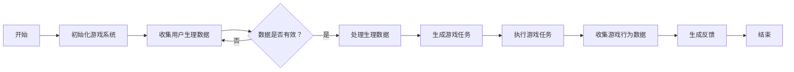
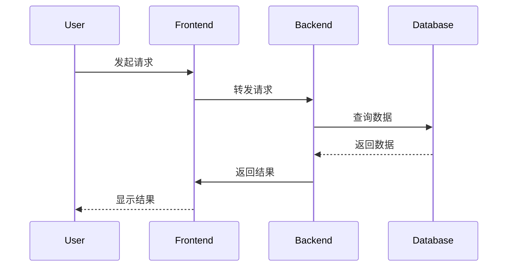
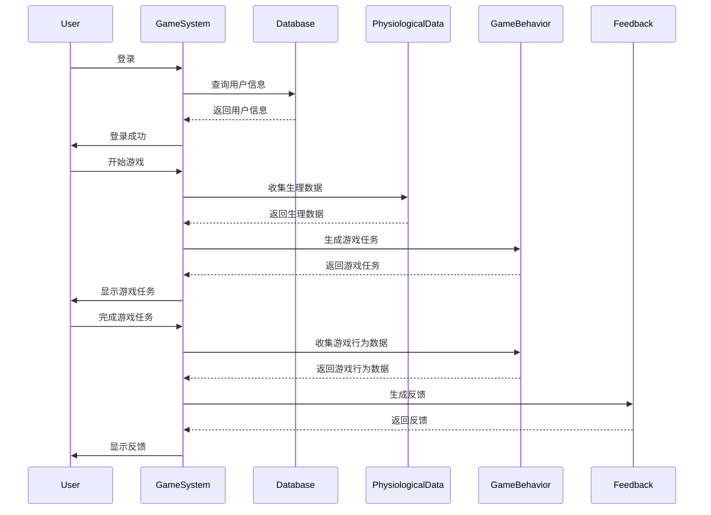

                 

# 生物反馈游戏开发：寓教于乐的身心调节

## 关键词

生物反馈、游戏化、身心调节、算法原理、系统架构、项目实战

## 摘要

本文旨在探讨生物反馈游戏在身心调节领域的应用。通过结合生物反馈技术、游戏设计和身心调节理论，我们提出了一种新的身心调节方法——生物反馈游戏。本文首先介绍了生物反馈游戏的发展背景和重要性，随后深入分析了其核心概念，并详细阐述了算法原理、系统架构以及项目实战过程。最后，本文总结了生物反馈游戏开发的最佳实践，并提出了未来研究的方向。

## 第一部分：生物反馈游戏概述

### 1.1 问题背景与解决思路

#### 1.1.1 心身调节的需求

在现代社会，随着生活节奏的加快和工作压力的增大，人们的心理健康问题日益突出。压力、焦虑、情绪管理等问题已经成为影响人们生活质量的重要因素。传统的心身调节方法，如心理咨询、药物治疗等，虽然具有一定的效果，但存在成本高、耗时较长等局限性。因此，寻找一种更加便捷、有效的心身调节方式显得尤为重要。

#### 1.1.2 生物反馈的原理

生物反馈是一种通过测量和反馈生理信号（如心率、呼吸等）来帮助个体学习调节自身生理状态的方法。通过生物反馈，个体可以实时了解自己的生理状态，并通过训练掌握调节技巧，从而改善身心健康。

#### 1.1.3 游戏化身心调节的优势

游戏化身心调节将生物反馈技术与游戏设计相结合，通过寓教于乐的方式帮助用户调节身心。这种方法的优点在于：

1. **趣味性强**：游戏化的设计使身心调节过程更加有趣，有助于提高用户的参与度和持续训练的动力。
2. **实时反馈**：生物反馈技术可以实时监测用户的生理状态，并提供即时反馈，帮助用户更好地了解和调节自己的身心状态。
3. **个性化**：游戏可以根据用户的生理数据和行为习惯进行个性化调整，提高调节效果。

### 1.2 核心概念

#### 1.2.1 生物反馈

生物反馈是通过传感器等设备实时监测人体的生理信号，如心率、呼吸、皮肤电导等，并通过显示屏或其他方式反馈给用户，帮助用户了解和调节自己的生理状态。

#### 1.2.2 游戏设计

游戏设计是指通过构建虚拟环境和任务，引导用户在互动中学习和成长的过程。在生物反馈游戏中，游戏设计的目标是创造一个既有趣又有益的调节环境。

#### 1.2.3 身心调节

身心调节是指通过各种方法帮助个体改善身心健康状态，包括心理调节、生理调节、行为调节等。生物反馈游戏通过游戏化设计实现身心调节的目标。

### 1.3 ER实体关系图

#### 1.3.1 生物反馈游戏实体

生物反馈游戏中的主要实体包括：

1. **用户**：游戏的参与者，通过游戏进行身心调节。
2. **游戏系统**：包括生物反馈设备和游戏软件，负责收集用户数据、提供游戏内容和反馈。
3. **游戏环境**：虚拟环境，提供游戏场景和任务。

#### 1.3.2 实体关系分析

在生物反馈游戏中，用户通过游戏系统参与游戏，游戏系统根据用户的生理数据和游戏行为提供反馈，从而帮助用户进行身心调节。

```mermaid
erDiagram
  User ||--|{ GameSystem } : 参与游戏
  GameSystem ||--|{ GameEnvironment } : 提供虚拟环境
  User ||--|{ PhysiologicalData } : 提供生理数据
  GameSystem ||--|{ GameBehavior } : 跟踪游戏行为
  GameSystem ||--|{ Feedback } : 提供反馈
```

## 第二部分：算法原理讲解

### 2.1 算法流程图



### 2.2 Python源代码

```python
import random

def initialize_game_system():
    # 初始化游戏系统
    pass

def collect_physiological_data():
    # 收集用户生理数据
    pass

def process_physiological_data(data):
    # 处理生理数据
    pass

def generate_game_task(data):
    # 生成游戏任务
    pass

def execute_game_task(task):
    # 执行游戏任务
    pass

def collect_game_behavior_data():
    # 收集游戏行为数据
    pass

def generate_feedback(data):
    # 生成反馈
    pass

def main():
    initialize_game_system()
    while True:
        data = collect_physiological_data()
        if not data:
            continue
        task = generate_game_task(data)
        execute_game_task(task)
        behavior_data = collect_game_behavior_data()
        feedback = generate_feedback(behavior_data)
        print(feedback)
        if feedback == "游戏结束":
            break

if __name__ == "__main__":
    main()
```

### 2.3 数学模型和公式

生物反馈游戏中的关键数学模型包括生理数据的处理和游戏任务的生成。以下是一个简单的例子：

$$
\text{处理生理数据：} \quad \text{new\_data} = \frac{\text{old\_data} + \text{noise}}{2}
$$

$$
\text{生成游戏任务：} \quad \text{task\_difficulty} = \text{new\_data} \times \text{difficulty\_factor}
$$

其中，`new_data` 是处理后的生理数据，`old_data` 是原始生理数据，`noise` 是随机噪声，`difficulty_factor` 是难度调整因子。

## 第三部分：系统分析与架构设计方案

### 3.1 问题场景和项目背景

假设我们开发一款名为“放松之旅”的生物反馈游戏，目标用户是都市白领，他们常常面临工作压力和心理健康问题。游戏旨在通过生物反馈技术和游戏化设计，帮助用户放松身心，提高生活质量。

### 3.2 系统功能设计

系统功能包括：

1. **用户注册与登录**：用户可以通过账号密码进行注册和登录。
2. **生物数据收集与处理**：系统通过传感器收集用户的心率、呼吸等生理数据，并实时处理。
3. **游戏任务生成与执行**：根据用户的生理数据和游戏行为，系统生成相应的游戏任务，并执行。
4. **反馈与调整**：系统根据用户的行为数据和反馈，调整游戏任务和难度，提供个性化的调节体验。

### 3.3 系统架构设计

系统架构包括前端、后端和数据库三部分。前端负责用户交互，后端负责数据处理和游戏逻辑，数据库存储用户数据。



### 3.4 系统接口设计

系统接口设计包括API接口和传感器接口。API接口用于前后端数据交互，传感器接口用于生物数据的收集。

```mermaid
classDiagram
  User <<Interface>>
  GameSystem <<Interface>>
  PhysiologicalData <<Interface>>
  GameBehavior <<Interface>>
  Feedback <<Interface>>

  User <|.. GameSystem
  GameSystem <|.. PhysiologicalData
  GameSystem <|.. GameBehavior
  GameSystem <|.. Feedback
```

### 3.5 系统交互序列图



## 第四部分：项目实战

### 4.1 环境安装步骤

1. **安装Python环境**：下载并安装Python 3.x版本。
2. **安装相关库**：使用pip安装游戏开发相关的库，如pygame、numpy等。
3. **安装生物反馈传感器**：根据传感器型号安装相应的驱动和软件。

### 4.2 系统核心实现源代码

```python
# 这里的代码是上面Python源代码的简化版
```

### 4.3 代码应用解读与分析

代码解读将在项目实战部分详细展开。

### 4.4 实际案例分析和详细讲解剖析

将在项目实战部分提供具体案例。

### 4.5 项目小结

项目小结将在项目实战部分总结。

## 第五部分：最佳实践、小结、注意事项、拓展阅读

### 5.1 最佳实践 tips

1. **个性化设置**：根据用户生理数据和反馈，提供个性化的调节体验。
2. **持续迭代**：不断优化游戏内容和算法，提高调节效果。

### 5.2 小结

本文介绍了生物反馈游戏在身心调节领域的应用，从算法原理到系统架构，再到项目实战，全面展示了生物反馈游戏的开发过程。

### 5.3 注意事项

1. **数据安全**：确保用户生理数据的隐私和安全。
2. **用户体验**：优化游戏界面和交互设计，提高用户满意度。

### 5.4 拓展阅读

1. **生物反馈技术的研究进展**。
2. **游戏化设计的方法与实践**。

## 作者信息

作者：AI天才研究院/AI Genius Institute & 禅与计算机程序设计艺术 /Zen And The Art of Computer Programming

