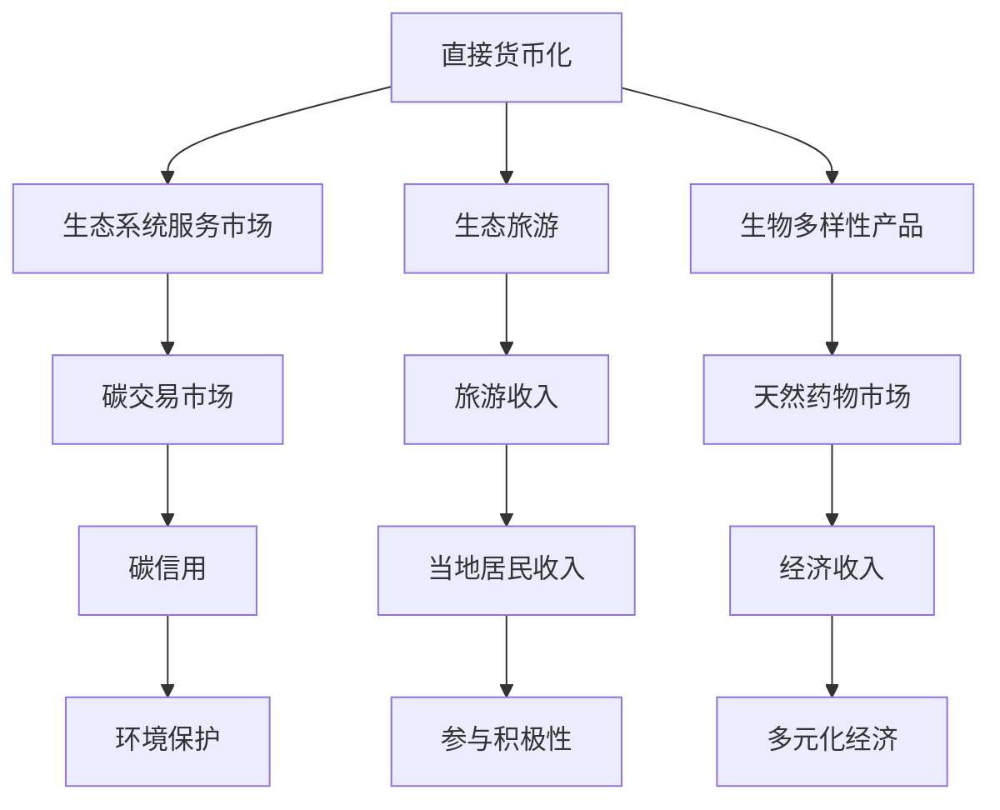

                 

### 生物多样性保护经济：生态价值的货币化

> 关键词：生物多样性、生态价值、货币化、经济原理、政策与法律

> 摘要：本文深入探讨了生物多样性保护经济的理论基础与实践方法。通过分析生态价值的货币化路径，本文旨在揭示如何通过经济手段促进生物多样性保护。文章首先阐述了生物多样性的概念与重要性，接着探讨了生物多样性面临的主要威胁及其经济影响。在此基础上，本文详细介绍了生物多样性保护的经济原理，包括生态价值的评估方法、成本效益分析和公共物品与外部性。随后，本文重点分析了生态价值的货币化方法，从直接货币化、间接货币化到混合货币化，并通过实际案例展示了这些方法的运用。文章还探讨了生物多样性保护的经济政策与法律框架，最后对生态价值货币化的未来展望进行了深入探讨。

### 目录大纲

1. **引言**
   - 生物多样性保护的重要性
   - 生态价值货币化的背景与意义

2. **生物多样性的概念与重要性**
   - 生物多样性的定义与层次
   - 生物多样性的生态价值

3. **生物多样性面临的威胁**
   - 自然因素与人类活动的双重压力
   - 生物多样性丧失的后果

4. **生物多样性保护的经济原理**
   - 生态价值评估的方法与工具
   - 成本效益分析
   - 公共物品与外部性

5. **生态价值的货币化方法**
   - 直接货币化
   - 间接货币化
   - 混合货币化

6. **生物多样性保护的经济政策与法律框架**
   - 国际法律框架
   - 国家法律框架
   - 地方政策与实践

7. **生物多样性保护的案例分析**
   - 案例一：某国家保护项目
   - 案例二：某地区生态补偿机制
   - 案例三：跨国合作项目

8. **生态价值货币化的未来展望**
   - 新兴技术的影响
   - 挑战与机遇
   - 可持续发展路径

9. **总结与展望**
   - 成果与不足
   - 研究方向与政策建议

### 引言

#### 生物多样性保护的重要性

生物多样性是地球上所有生物体及其生态过程的多样性，包括基因多样性、物种多样性和生态系统多样性。生物多样性不仅是地球上生命支持系统的基础，也对人类社会的可持续发展具有至关重要的意义。首先，生物多样性为人类提供了丰富的自然资源，包括食物、药品、燃料等。其次，生物多样性有助于维持生态平衡，调节气候、水源、土壤等自然过程。此外，生物多样性还具有重要的文化、美学和娱乐价值，是地球生态系统稳定性的基石。

然而，随着人类活动的加剧，生物多样性正面临前所未有的威胁。自然因素的气候变化、自然灾害以及人类活动的过度开发、污染和资源过度利用，都导致了许多物种的灭绝和生态系统的破坏。生物多样性的丧失不仅破坏了生态系统的完整性，也威胁到了人类的生存和发展。因此，生物多样性保护已经成为全球关注的重大课题。

#### 生态价值货币化的背景与意义

生态价值货币化是一种将生态系统的价值转化为经济价值的方法，旨在通过经济手段促进生物多样性保护。传统的环境保护手段主要依赖于法律和行政手段，而生态价值货币化则通过市场机制，将生态系统的价值纳入经济体系，从而实现生态保护的经济激励。

生态价值货币化的背景可以追溯到环境保护和经济发展的双重需求。一方面，环境问题的严重性要求我们必须找到更加有效的保护措施；另一方面，经济发展的需求又使得传统保护手段难以落实。生态价值货币化通过将生态价值纳入市场，为保护生物多样性提供了经济动力。例如，通过生态补偿机制，将生态价值转化为农民种植生态友好作物的收入，从而促进农业可持续发展。

生态价值货币化的意义主要体现在以下几个方面：

1. **经济激励**：通过将生态价值货币化，可以为生物多样性保护提供直接的经济激励，促进各方积极参与生态保护。

2. **资源配置**：市场机制能够更有效地配置资源，确保生态保护活动的经济效益最大化。

3. **政策创新**：生态价值货币化推动了环境保护政策的新发展，为政府和企业提供了新的管理工具。

4. **国际合作**：生态价值货币化可以作为国际合作的新平台，促进全球生物多样性保护。

#### 总结

生物多样性保护经济的重要性不容忽视，而生态价值货币化则为生物多样性保护提供了新的路径。本文将在此基础上，深入探讨生态价值的货币化方法、政策与法律框架，并通过案例分析，揭示生态价值货币化的实际应用。通过这一系列分析，我们希望能够为生物多样性保护提供有益的参考，推动生态价值的货币化在实践中的有效实施。

### 生物多样性的概念与重要性

#### 生物多样性的定义与层次

生物多样性（Biodiversity）是指地球上所有生物体及其生态过程的多样性，包括基因多样性、物种多样性和生态系统多样性。生物多样性的层次结构可以从微观到宏观进行划分：

1. **基因多样性**：是指物种内个体或种群间的遗传变异。基因多样性决定了物种的适应能力和进化潜力，是生物多样性的基础层次。
2. **物种多样性**：是指生物群落中物种的多样性。物种多样性反映了生态系统的复杂性和稳定性，是生物多样性的核心层次。
3. **生态系统多样性**：是指不同生态系统的多样性，包括森林、草原、湿地等。生态系统多样性反映了生态过程和功能的多样性，是生物多样性的最高层次。

生物多样性的定义和层次结构有助于我们全面理解生物多样性的内涵和重要性。从基因到生态系统，每一个层次的多样性都对生态系统的功能和服务具有重要意义。

#### 生物多样性的生态价值

生物多样性具有重要的生态价值，这些价值不仅体现在生态系统的稳定性和功能上，还对人类社会的可持续发展产生深远影响。以下是生物多样性的几个主要生态价值：

1. **提供生态系统服务**：生物多样性为人类提供了大量的生态系统服务，包括水源调节、气候调节、土壤保持、废物处理和养分循环等。这些服务对于人类的生存和发展至关重要。
2. **促进生态系统的适应性**：生物多样性增强了生态系统的适应性和抗干扰能力，使生态系统在面对环境变化和自然灾害时能够保持稳定。
3. **维持生态平衡**：生物多样性是维持生态平衡的基础。每一个物种都在生态系统中扮演着特定的角色，相互依赖、相互制约，形成复杂的生态网络。
4. **文化和社会价值**：生物多样性还具有重要的文化和社会价值。许多生物物种和生态系统与当地文化传统密切相关，是文化认同和情感联系的重要来源。

#### 问题背景与问题描述

尽管生物多样性具有巨大的生态价值，但当前全球生物多样性正面临严重的威胁。这些威胁主要来自以下几个方面：

1. **自然因素的威胁**：气候变化、自然灾害（如飓风、洪水和干旱）等自然因素对生物多样性产生了负面影响。气候变化导致了物种分布的变迁和生态系统的破坏，许多物种难以适应快速变化的环境。
2. **人类活动的威胁**：人类活动是导致生物多样性丧失的主要原因。过度开发土地、森林砍伐、过度捕捞、污染和气候变化等都是常见的威胁因素。这些活动破坏了物种的栖息地，导致物种灭绝和生态系统退化。
3. **生物入侵**：外来物种的入侵也对生物多样性产生了严重的影响。外来物种通常没有天敌，能够迅速繁殖和扩散，对当地物种构成威胁，破坏生态平衡。

#### 问题解决与边界与外延

为了解决生物多样性面临的威胁，需要采取综合性的保护措施。以下是几种常见的问题解决方法和边界与外延：

1. **保护地建设**：建立自然保护区和国家公园等保护地，为野生动植物提供安全的栖息环境。这些保护地的边界清晰，管理严格，能够有效保护生物多样性。
2. **生态恢复与重建**：对受破坏的生态系统进行恢复和重建，恢复物种的多样性和生态功能。这种方法通常应用于森林、湿地等生态系统的恢复。
3. **生态补偿机制**：通过经济手段补偿因生态保护而受损失的利益相关方，如农民、企业等。这种机制能够激励各方积极参与生态保护。
4. **国际合作**：通过国际合作，共享资源和技术，共同应对全球生物多样性挑战。例如，联合国生物多样性公约（CBD）就是全球生物多样性保护的重要合作平台。

边界与外延方面，生物多样性保护不仅涉及地理区域，还包括生态过程和时间维度。例如，一个保护地的边界不仅包括地理范围，还包括对其生态过程的影响；同时，生物多样性保护需要跨代持续，关注长期的生态安全和可持续发展。

#### 概念结构与核心要素组成

生物多样性的概念结构可以从以下几个方面进行分析：

1. **生态系统层面**：生态系统的多样性是生物多样性的最高层次，包括森林、草原、湿地等。每个生态系统都有其特定的物种组成和生态功能。
2. **物种层面**：物种多样性是指不同物种之间的多样性。每个物种都有其独特的遗传特征和生态角色。
3. **遗传层面**：基因多样性是指物种内个体或种群间的遗传差异。基因多样性决定了物种的适应性和进化潜力。
4. **遗传与物种互动**：物种间的相互作用和生态网络的复杂性是生物多样性的关键组成部分。每个物种都在生态网络中扮演特定的角色，相互依赖、相互影响。

核心要素组成方面，生物多样性保护需要关注以下几个关键要素：

1. **栖息地保护**：保护物种的栖息地是生物多样性保护的基础。栖息地的破坏是导致物种灭绝的主要原因之一。
2. **物种保护**：对濒危物种进行特殊保护，如建立繁育中心、保护种群等。
3. **生态过程保护**：保护生态系统的完整性和功能，确保生态过程的正常运行。
4. **可持续发展**：在保护生物多样性的同时，促进社会和经济的发展，实现生态、社会和经济的可持续发展。

通过以上分析，我们可以更好地理解生物多样性的概念、生态价值及其面临的威胁，为生物多样性保护提供科学依据和实践指导。

#### 生物多样性的生态价值

生物多样性不仅是地球上生命支持系统的基础，也对人类社会的可持续发展具有深远影响。生物多样性的生态价值可以从以下几个方面进行详细探讨：

1. **提供生态系统服务**：

   生物多样性为人类提供了许多关键的生态系统服务，这些服务对人类的生活和生产至关重要。以下是几种主要的生态系统服务：

   - **水源调节**：森林和湿地等生态系统具有涵养水源和保持水量的功能。这些生态系统通过吸收和储存降水，调节水循环，减少了洪水和干旱的发生。
   - **气候调节**：植物通过光合作用吸收二氧化碳，释放氧气，有助于缓解气候变化。此外，森林和其他植被通过蒸腾作用调节大气湿度，影响局部气候。
   - **土壤保持**：植被和根系有助于固定土壤，防止水土流失。这有助于维持土壤的肥力和生产力，为农业和食品生产提供保障。
   - **废物处理**：生态系统中的微生物和植物参与有机物的分解和循环，有助于清除和转化废物，维持生态系统的健康和稳定。

2. **促进生态系统的适应性**：

   生物多样性增强了生态系统的适应性和抗干扰能力，使其在面对环境变化和自然灾害时能够保持稳定。以下是生物多样性在生态系统适应性方面的几个作用：

   - **物种替换**：在一个生态系统中，如果某些物种因环境变化而消失，其他物种可能会取代它们，维持生态系统的结构和功能。
   - **生态过程多样性**：生态系统的多样性包括多种生物过程，如捕食、竞争、共生等。这些过程相互关联，共同维持生态平衡。当生物多样性较高时，生态系统具有更强的抗干扰能力。
   - **物种进化潜力**：生物多样性为物种提供了进化潜力。在面对环境变化时，具有遗传多样性的物种能够更快地适应新环境，从而提高整个生态系统的适应性。

3. **维持生态平衡**：

   生物多样性是维持生态平衡的基础。每一个物种在生态系统中都扮演着特定的角色，相互依赖、相互制约，形成复杂的生态网络。以下是生物多样性在维持生态平衡方面的几个方面：

   - **营养链与食物网**：生态系统中的物种通过食物链和食物网相互联系。每个物种都在其营养链中占据一环，彼此依赖。当某个物种的数量发生改变时，会影响到整个食物网，进而影响生态平衡。
   - **生态位**：每个物种都有其特定的生态位，包括栖息地、食物、行为习性等。生态位的存在有助于物种之间的共存，避免了资源的过度竞争。
   - **生物扰动**：某些物种，如食肉动物，通过捕食和扰动行为影响其他物种的数量和分布，维持生态系统的动态平衡。

4. **文化和社会价值**：

   生物多样性还具有重要的文化和社会价值。许多生物物种和生态系统与当地文化传统密切相关，是文化认同和情感联系的重要来源。以下是生物多样性在文化和社会价值方面的几个方面：

   - **宗教信仰**：许多宗教信仰与自然和生物多样性密切相关。例如，森林被视为神圣之地，动植物被视为神灵的象征。
   - **美学与娱乐**：自然景观和生物多样性为人类提供了观赏和娱乐的机会。自然保护区和野生动物园吸引了大量的游客，为当地经济带来了收益。
   - **教育与研究**：生物多样性为教育和科研提供了丰富的资源。通过研究生物多样性，人们可以更好地了解生命世界的奥秘，推动科学进步。

综上所述，生物多样性的生态价值是多方面的，涵盖了生态系统服务、生态系统的适应性、生态平衡以及文化和社会价值。这些价值不仅对人类的生活和生产具有重要作用，也对地球生态系统的健康和可持续发展具有重要意义。因此，保护和维护生物多样性是我们共同的责任和使命。

### 生物多样性面临的威胁

#### 自然因素的威胁

自然因素对生物多样性的影响是多样且深远的，主要包括气候变化、自然灾害和地质变迁等。

**1. 气候变化**

气候变化是当前全球生物多样性面临的最大威胁之一。全球气温的上升导致了许多物种栖息地的改变和破坏。例如，温度上升和降水模式的改变影响了植物的分布和生长周期，导致许多物种无法适应新的环境条件。此外，气候变化还引发了极端天气事件，如飓风、洪水和干旱，这些事件对生态系统造成了巨大的破坏。例如，北极地区的冰川融化加速了海平面的上升，威胁到了沿海生态系统和许多冰川依赖物种的生存。

**2. 自然灾害**

自然灾害，如地震、火山爆发、泥石流和台风等，对生物多样性具有直接的破坏作用。这些事件往往导致栖息地的破坏、物种栖息环境的消失，甚至直接造成物种的灭绝。例如，2010年海地地震造成了大量森林破坏和动植物的死亡，对当地生物多样性产生了长期影响。同样，2011年日本福岛核事故释放的放射性物质对周边生态系统和海洋生物多样性造成了严重损害。

**3. 地质变迁**

地质变迁，如地壳运动、火山喷发和岩浆活动等，也对生物多样性产生了深远影响。这些地质事件改变了地表的形态和气候条件，迫使物种适应新的环境。然而，许多物种可能无法在短时间内适应这些剧变的环境，从而导致灭绝。例如，大规模的火山喷发可能释放大量火山灰和有害气体，对大气层和生态系统造成长时间的影响，影响生物的生存和繁衍。

#### 人类活动的威胁

人类活动的加剧是导致生物多样性丧失的主要原因，主要包括过度开发、污染和资源过度利用等。

**1. 过度开发**

随着人口增长和经济发展的需求，人类对自然资源的过度开发导致了大量的生物多样性丧失。例如，森林砍伐和土地开垦破坏了许多物种的栖息地，导致物种的栖息地缩小和隔离。例如，全球森林砍伐导致了大量热带雨林的消失，许多物种失去了栖息地，面临灭绝的风险。

**2. 污染**

环境污染对生物多样性的影响也是极其严重的。工业废水、化学农药和塑料制品等污染物进入生态系统，对土壤、水源和空气造成了污染。这些污染物对生物的生理和生殖系统产生了严重的负面影响，导致物种数量减少和生态系统的退化。例如，农药的广泛使用导致了许多鸟类和昆虫的种群数量急剧下降，影响了生态平衡。

**3. 资源过度利用**

人类对资源的过度利用也是导致生物多样性丧失的重要原因。例如，过度捕捞导致了许多海洋物种的濒临灭绝，渔业资源的衰竭对海洋生态系统产生了长期的影响。同样，非法狩猎和野生动物贸易也严重威胁了许多物种的生存。例如，犀牛角和虎骨的非法贸易导致了这些物种数量的急剧下降，面临灭绝的威胁。

**4. 其他人类活动的影响**

除了上述因素，其他人类活动，如城市化和旅游业等也对生物多样性产生了负面影响。城市化和土地开发导致了自然栖息地的破碎化和隔离，阻碍了物种的迁移和繁殖。例如，高速公路和铁路的建设将野生动物的栖息地分割成碎片，导致了物种隔离和遗传多样性的丧失。旅游业的发展虽然带来了经济收益，但同时也带来了环境污染和栖息地破坏的问题。

综上所述，自然因素和人类活动的威胁对生物多样性产生了深远的影响，导致了物种的灭绝和生态系统的破坏。为了保护生物多样性，我们需要采取有效的措施，减少自然因素的破坏和人类活动的影响，促进生态系统的恢复和可持续发展。

### 生物多样性保护的经济原理

生物多样性保护的经济原理涉及多个方面，主要包括生态价值的评估、成本效益分析和公共物品与外部性。通过这些原理，我们可以更深入地理解如何通过经济手段促进生物多样性保护。

#### 生态价值评估

生态价值评估是生物多样性保护的基础，旨在量化生态系统的价值。生态价值评估的方法多种多样，主要包括以下几种：

1. **市场价值方法**：市场价值方法通过市场价格来衡量生态系统的价值。例如，可以通过森林木材的市场价格来评估森林的生态价值。然而，这种方法存在局限性，因为许多生态服务无法在市场上直接交易。

2. **替代市场价值方法**：替代市场价值方法通过替代品的市场价格来评估生态系统的价值。例如，可以通过保护区的建设成本来评估保护区的生态价值。这种方法适用于难以直接量化的生态服务。

3. **非市场价值方法**：非市场价值方法通过主观评估和调查来衡量生态系统的价值。例如，可以通过问卷调查了解人们对自然景观的偏好，从而评估其生态价值。这种方法适用于难以用市场价格衡量的生态服务。

4. **条件价值评估方法**：条件价值评估方法通过假设情景，调查人们愿意为生态保护支付的金额。这种方法通常用于评估公众对生态保护的意愿和支付能力。

#### 成本效益分析

成本效益分析是经济决策的重要工具，通过比较项目成本与预期效益，可以帮助决策者选择最优方案。在生物多样性保护中，成本效益分析有助于评估不同保护措施的效益和成本，从而优化资源分配。

1. **直接成本**：直接成本包括保护项目的实施成本，如设备购买、人员培训和基础设施建设等。

2. **间接成本**：间接成本包括因生态保护而遭受的经济损失，如农业减产、渔业收入减少等。

3. **直接效益**：直接效益包括生态系统的恢复、物种保护成功和生态功能的改善等。

4. **间接效益**：间接效益包括生态系统的可持续利用、生态旅游收益和生态补偿等。

在进行成本效益分析时，需要考虑时间价值、风险和不确定性等因素。通过全面评估成本和效益，我们可以更科学地决策，实现资源的最优配置。

#### 公共物品与外部性

公共物品和外部性是生物多样性保护经济原理的重要组成部分。公共物品是指非排他性和非竞争性的商品或服务，如空气、水资源和生态服务。外部性则是指个人或企业行为对他人的影响，可以是正面的，也可以是负面的。

1. **公共物品**：生态系统的许多服务属于公共物品，如气候调节、水源涵养和生物多样性维持等。由于公共物品的非排他性和非竞争性，市场机制往往无法有效提供这些服务，导致市场失灵。因此，需要政府和其他公共机构介入，通过政策手段确保这些公共物品的供给。

2. **外部性**：外部性对生物多样性保护具有重要影响。正外部性指的是个人或企业的行为对他人产生积极影响，如植树造林可以改善空气质量。负外部性则指个人或企业的行为对他人的负面影响，如工业污染对水资源的破坏。为了解决外部性问题，需要通过政策手段，如税收、补贴和监管，引导个人和企业采取环保行为。

#### 概念属性特征对比表格

为了更清晰地理解生态价值评估、成本效益分析和公共物品与外部性的概念属性特征，我们可以通过以下对比表格进行详细阐述：

| 概念 | 定义 | 特征 | 影响因素 | 目的 |
| --- | --- | --- | --- | --- |
| 生态价值评估 | 量化生态系统价值的方法 | 客观性、可量化、多样化 | 生态系统服务、人类活动、政策环境 | 衡量生态系统价值 |
| 成本效益分析 | 比较项目成本与效益的方法 | 成本考量、效益考量、时间价值 | 成本、效益、风险、政策 | 最优资源配置 |
| 公共物品 | 非排他性和非竞争性的商品或服务 | 非排他性、非竞争性、普遍性 | 消费者行为、政府政策、市场机制 | 保证公共服务 |
| 外部性 | 个人或企业行为对他人的影响 | 正外部性、负外部性 | 个人行为、企业行为、市场环境 | 环境保护、政策调节 |

通过上述对比表格，我们可以更直观地了解这些概念的基本特征和影响因素，为生物多样性保护提供理论支持。

### 生态价值的货币化方法

#### 直接货币化方法

直接货币化是将生态系统的直接价值转化为货币价值的一种方法，通常涉及直接市场交易。以下是几种常见的直接货币化方法：

1. **生态系统服务市场**：通过建立生态系统服务市场，直接交易生态系统的产品和服务。例如，森林可以为碳吸收和储存提供服务，可以通过碳交易市场出售碳信用。另一个例子是水资源市场，水资源可以通过水权交易进行市场化交易。

2. **生态旅游**：生态旅游是一种将自然景观和生物多样性作为旅游资源进行商业开发的方式。通过吸引游客到自然保护区和生态旅游区，可以创造直接的经济收入。这种方法的优点是可以增加当地居民的收入，提高他们参与生态保护的积极性。

3. **生物多样性产品**：生物多样性丰富的地区可以开发与生物多样性相关的产品，如天然药物、工艺品等。这些产品可以在市场上直接销售，从而将生态系统的价值转化为经济价值。

#### 间接货币化方法

间接货币化是通过市场机制间接实现生态保护价值的一种方法，通常不涉及直接市场交易。以下是几种常见的间接货币化方法：

1. **生态补偿机制**：生态补偿机制通过经济手段补偿因生态保护而遭受损失的利益相关方。例如，政府可以通过支付补贴或赔偿金，鼓励农民减少化肥和农药的使用，以保护土壤和水资源的质量。这种方法的优点是可以通过经济激励促进生态保护，提高公众参与度。

2. **绿色金融**：绿色金融是指将资金引导到生态保护和可持续发展的项目中。通过发行绿色债券、绿色贷款和绿色基金等方式，投资者可以为生态保护项目提供资金支持。这种方法的优点是可以利用金融市场的力量，吸引更多的资金投入到生态保护领域。

3. **环境税**：环境税是一种通过税收手段激励企业和个人采取环保行为的方法。例如，对污染排放征税，鼓励企业减少污染物排放，保护环境。这种方法可以增加政府财政收入，同时促进环境保护。

#### 混合货币化方法

混合货币化结合了直接货币化和间接货币化的优点，通过多种方式实现生态价值的货币化。以下是几种常见的混合货币化方法：

1. **生态系统服务与生态补偿相结合**：在生态系统服务市场上，可以通过生态补偿机制来补充直接市场交易的不足。例如，政府可以提供额外的补贴或补偿金，鼓励农民参与生态保护项目，从而提高生态系统的保护水平。

2. **绿色金融与生态补偿相结合**：通过绿色金融为生态保护项目提供资金支持，同时结合生态补偿机制，确保项目的可持续性和有效性。例如，政府可以提供绿色贷款，并与生态补偿机制结合，激励企业和个人参与生态保护项目。

3. **多元化生态产品开发**：通过开发与生物多样性相关的多元化产品，将生态系统的价值转化为多种形式的经济价值。例如，不仅可以开发天然药物，还可以开发生态旅游产品和文化创意产品，从而实现生态价值的多元化货币化。

#### 概念图与案例

为了更直观地理解生态价值的货币化方法，我们可以通过以下概念图和案例进行详细阐述：

**概念图：生态价值货币化方法**

**案例：生态补偿机制与绿色金融的结合**

案例描述：某政府通过生态补偿机制和绿色金融手段，共同推动某生态保护区的发展。

1. **生态补偿机制**：政府向当地农民提供补贴，鼓励其减少农药和化肥的使用，以保护土壤和水资源的质量。这一措施有效减少了农业污染，提高了农产品的生态价值。

2. **绿色金融**：政府通过发行绿色债券，筹集资金用于生态保护项目的建设和维护。这些资金用于修复受损的生态系统，提高生物多样性。

3. **成果展示**：通过生态补偿和绿色金融的结合，该保护区不仅实现了生态保护，还吸引了大量游客，增加了当地居民的收入，实现了生态价值的货币化。

通过以上案例，我们可以看到，生态价值的货币化方法不仅包括直接市场交易，还可以通过间接市场机制和多元化产品开发，实现生态价值的最大化。这些方法为生物多样性保护提供了新的经济动力，有助于实现生态保护和可持续发展的目标。

### 生物多样性保护的经济政策与法律框架

#### 国际法律框架

全球生物多样性保护的政策与法律框架首先体现在一系列国际公约和协议中，其中最具代表性的是《联合国生物多样性公约》（CBD）。《联合国生物多样性公约》于1992年在里约热内卢环境与发展会议上通过，旨在保护地球的生物多样性，促进可持续发展。该公约规定了各缔约国的责任和义务，包括：

1. **保护生物多样性**：通过建立自然保护区和实施保护措施，保护野生动植物栖息地。
2. **可持续利用生物资源**：促进对生物资源的可持续利用，减少生物多样性的退化。
3. **促进生物技术的公平分享**：确保发展中国家能够公平分享生物技术带来的利益，推动技术转让和合作。
4. **提高公众意识和参与**：通过教育和公众参与，提高社会对生物多样性保护的意识和参与度。

此外，其他重要的国际法律文件还包括《世界自然保护大纲》（1995年）、《生物多样性公约实施战略》（2011-2020年）等。这些法律文件为全球生物多样性保护提供了法律基础和行动指南。

#### 国家法律框架

各国也根据自身的国情和生物多样性保护的需求，制定了相应的国家法律和政策。以下是一些具有代表性的国家法律框架：

1. **美国**：美国的《国家环境政策法》（NEPA）要求对所有可能影响环境的项目进行环境影响评估，确保项目符合环境保护要求。《濒危物种法》（ESA）则是美国保护濒危物种和栖息地的主要法律，通过立法手段保护濒危物种的生存和繁衍。

2. **中国**：中国的《中华人民共和国生物多样性保护法》于2022年通过，旨在加强生物多样性保护，促进生态文明建设。该法律明确了生物多样性保护的目标、原则和措施，包括建立自然保护区、实施生态修复、加强生物技术研究与应用等。

3. **欧盟**：欧盟通过《欧盟生物多样性战略》（2020-2030年）和《欧盟绿色协议》等政策文件，推动成员国加强生物多样性保护。这些法律文件强调生态保护和可持续发展的重要性，提出了具体的行动目标和实施措施。

#### 地方政策与实践

地方政策在生物多样性保护中发挥着重要作用，地方政府根据地方实际情况，制定和实施了一系列具体的保护政策和措施。以下是一些地方政策与实践的例子：

1. **城市生态系统保护**：许多城市通过建立城市公园、绿地和生态保护区，提高城市生态环境质量。例如，纽约市通过“绿色基础设施计划”，在城市内建设大量公园和绿地，改善空气质量，提高城市居民的生活质量。

2. **生态补偿机制**：一些地方政府通过生态补偿机制，鼓励农民和农民合作社采取生态友好措施。例如，中国的“退耕还林”政策，通过向农民提供补贴，鼓励他们将耕地转变为林地或草地，从而保护生态环境。

3. **生态旅游**：许多地方政府通过发展生态旅游，促进生物多样性保护。例如，新西兰的“卓越生态旅游认证计划”，通过认证和标准化的生态旅游服务，推动旅游业可持续发展，同时保护自然环境和生物多样性。

综上所述，生物多样性保护的经济政策与法律框架涵盖了国际、国家和地方三个层面。通过这些政策与法律框架，各国和各地区共同努力，推动生物多样性保护，实现可持续发展目标。

### 生物多样性保护的案例分析

#### 案例一：某国家保护项目

**项目背景**：
某国家在面临严重的生物多样性丧失和生态系统退化的背景下，决定实施一项综合性生物多样性保护项目。该项目旨在通过多方面的措施，恢复和保护该国独特的生态系统和生物多样性。

**项目目标**：
1. **恢复栖息地**：通过植被恢复、土地整治和水土保持措施，恢复退化生态系统的功能。
2. **保护濒危物种**：设立专门的保护区，保护濒危物种的栖息地，确保其生存和繁衍。
3. **提升公众意识**：通过教育和宣传活动，提高公众对生物多样性保护的意识和参与度。

**实施步骤**：
1. **需求评估**：首先进行全面的生物多样性调查和评估，确定需要保护的生态系统和濒危物种。
2. **规划与设计**：根据评估结果，制定详细的保护规划和设计方案，包括栖息地恢复、保护区设立和生态补偿机制。
3. **资金筹集**：通过政府拨款、国际援助和私人投资等多渠道筹集资金，确保项目的可持续性。
4. **项目实施**：开展栖息地恢复和保护区建设，同时进行生态补偿和公众教育活动。
5. **监测与评估**：定期监测项目进展和生态效果，评估保护措施的有效性，并根据监测结果进行调整和优化。

**效果与影响**：
通过多年的努力，该保护项目取得了显著成效。具体表现在：

1. **生态系统恢复**：许多退化生态系统得到有效恢复，植被覆盖率显著提高，水土流失问题得到缓解。
2. **濒危物种保护**：濒危物种的栖息地得到有效保护，种群数量逐渐增加，部分物种实现了从濒危到稳定的转变。
3. **公众参与度提升**：通过公众教育和宣传活动，提高了公众对生物多样性保护的意识和参与度，形成了良好的社会氛围。

#### 案例二：某地区生态补偿机制

**项目背景**：
某地区因工业化快速发展，导致生态环境严重受损，当地农民面临生计困难。为了保护生态环境，该地区政府决定实施生态补偿机制，通过经济补偿激励农民采取生态友好措施。

**项目目标**：
1. **改善生态环境**：通过补偿机制，激励农民减少农药和化肥的使用，改善土壤和水资源质量。
2. **保障农民收入**：通过补偿措施，确保农民在采取生态友好措施的同时，不会遭受经济损失。
3. **促进可持续发展**：通过生态补偿，实现经济发展和环境保护的双赢。

**实施步骤**：
1. **制定补偿标准**：根据当地生态环境状况和农民的实际需求，制定合理的生态补偿标准。
2. **补偿资金筹集**：通过政府拨款、企业赞助和国际援助等多渠道筹集补偿资金。
3. **签订补偿合同**：与农民签订生态补偿合同，明确补偿标准和支付方式。
4. **监督与执行**：建立监督机制，确保农民按照合同要求采取生态友好措施，同时及时支付补偿金。
5. **评估与调整**：定期评估生态补偿效果，根据评估结果调整补偿措施，确保其有效性。

**效果与影响**：
生态补偿机制在该地区实施以来，取得了显著的成效：

1. **生态环境改善**：农民减少了农药和化肥的使用，土壤和水资源质量得到显著改善。
2. **农民收入稳定**：通过补偿措施，农民的收入得到了保障，生活水平得到提高。
3. **社会氛围积极**：生态补偿机制的实施，促进了当地居民对生态保护的参与和认同，形成了良好的社会氛围。

#### 案例三：跨国合作项目

**项目背景**：
全球气候变化和生物多样性丧失已成为全球性问题，需要各国共同应对。某跨国合作项目旨在通过国际间的合作，共同保护全球重要的生态系统和生物多样性。

**项目目标**：
1. **保护全球生物多样性**：通过跨国合作，共同保护全球重要的生态系统，如热带雨林、珊瑚礁和极地生态系统。
2. **促进技术创新**：通过国际合作，分享和推广生物多样性保护的技术和创新。
3. **提高公众意识**：通过跨国合作和宣传活动，提高全球公众对生物多样性保护的意识和参与度。

**实施步骤**：
1. **合作框架建立**：各参与国通过谈判和协商，建立跨国合作框架，明确合作目标和原则。
2. **技术交流与培训**：组织技术交流与培训活动，分享生物多样性保护的最佳实践和技术。
3. **项目实施**：在各参与国的支持下，共同实施具体的生物多样性保护项目。
4. **监测与评估**：建立监测和评估机制，定期评估项目进展和生态效果，确保合作项目的有效实施。
5. **政策建议**：根据评估结果，向各国政府提出政策建议，推动生物多样性保护的国际合作。

**效果与影响**：
跨国合作项目在全球范围内取得了显著成效：

1. **生态系统保护**：通过跨国合作，许多重要的生态系统得到了有效保护，如亚马逊雨林和珊瑚礁。
2. **技术创新推广**：通过技术交流和合作，推广了多项生物多样性保护的新技术和新方法。
3. **公众意识提高**：跨国合作项目的宣传和教育活动，提高了全球公众对生物多样性保护的意识和参与度。

通过以上案例分析，我们可以看到，生物多样性保护需要综合运用多种手段和措施，包括政府主导的项目、地方性的生态补偿机制以及跨国合作项目。这些案例的成功实施，为全球生物多样性保护提供了宝贵的经验和参考。

### 生态价值货币化的未来展望

#### 新兴技术的影响

随着科技的发展，新兴技术为生态价值货币化带来了新的机遇和挑战。首先，区块链技术可以提供去中心化的生态系统，确保生态补偿交易的透明和公正。例如，通过区块链技术，碳信用交易可以实现更高效、更安全的交易记录。其次，人工智能（AI）和大数据分析技术可以帮助更准确地评估生态价值，优化生态补偿机制。例如，通过AI算法，可以预测不同生态保护措施的效果，从而制定更科学的补偿政策。此外，虚拟现实（VR）和增强现实（AR）技术可以提升生态旅游的体验，为生态价值货币化提供更多机会。

#### 挑战与机遇

尽管新兴技术为生态价值货币化带来了新的动力，但同时也面临诸多挑战。首先，数据隐私和安全问题是关键挑战之一。在生态系统服务市场中，大量的生态数据需要存储和处理，如何保护这些数据的安全性和隐私性，是一个重要的课题。其次，市场机制的完善是另一个挑战。生态价值货币化需要建立完善的交易市场，确保生态补偿机制的有效运行。这需要政府和企业的共同努力，制定相应的政策和标准。

然而，机遇同样存在。随着公众环保意识的提高，越来越多的投资者和消费者开始关注生态价值。这为生态价值货币化提供了广阔的市场空间。此外，国际社会的合作也日益增强，为生态价值货币化提供了更广泛的合作平台。例如，联合国环境规划署（UNEP）已经启动了多个生态价值货币化的国际合作项目。

#### 可持续发展路径

为了实现生态价值货币化的可持续发展，我们需要采取以下措施：

1. **政策支持**：政府应制定和实施支持生态价值货币化的政策，包括税收优惠、补贴和支持性立法等，为市场机制的建立提供政策保障。

2. **技术创新**：推动新兴技术的研发和应用，提高生态价值评估的准确性和效率。例如，通过AI和大数据技术，可以更准确地评估生态服务价值，优化补偿机制。

3. **市场机制**：建立和完善生态服务市场，确保交易过程透明、公正。同时，需要建立相应的监管机制，确保市场的稳定和可持续发展。

4. **国际合作**：加强国际间的合作，共享经验和资源，推动全球生态价值货币化的可持续发展。例如，通过国际合作项目，共同应对全球生态挑战。

5. **公众参与**：提高公众对生态价值货币化的认知和参与度，形成良好的社会氛围。通过教育和宣传活动，让更多人了解和关注生态价值，积极参与生态保护。

总之，生态价值货币化是推动生物多样性保护和可持续发展的有效手段。通过技术创新、政策支持和市场机制的完善，我们可以实现生态价值的最大化，为地球生态系统的健康和人类社会的可持续发展贡献力量。

### 总结

本文深入探讨了生物多样性保护经济的理论基础与实践方法，详细阐述了生态价值的货币化路径。首先，我们从生物多样性的概念与重要性出发，分析了其生态价值。接着，我们探讨了生物多样性面临的威胁，包括自然因素和人类活动的影响。在此基础上，我们介绍了生物多样性保护的经济原理，包括生态价值评估、成本效益分析和公共物品与外部性。随后，我们重点分析了生态价值的货币化方法，从直接货币化、间接货币化到混合货币化，并通过实际案例展示了这些方法的运用。此外，我们还探讨了生物多样性保护的经济政策与法律框架，以及国际和地方层面的政策与实践。通过案例分析，我们展示了不同国家和地区在生物多样性保护方面的成功经验和挑战。最后，我们对生态价值货币化的未来展望进行了深入探讨，提出了技术创新、政策支持和市场机制完善等可持续发展路径。

### 研究成果与不足

#### 成果

本文的研究成果主要体现在以下几个方面：

1. **系统梳理了生态价值货币化的理论基础**：通过深入分析生态价值的定义、评估方法和货币化路径，为生态价值货币化提供了理论支持。
2. **探讨了多种生态价值货币化方法**：结合实际案例，详细阐述了直接货币化、间接货币化和混合货币化方法的运用，提供了实践指导。
3. **分析了生物多样性保护的经济政策与法律框架**：从国际、国家和地方三个层面，总结了不同地区的政策与实践，为生物多样性保护提供了政策参考。
4. **提出了生态价值货币化的未来展望**：通过分析新兴技术的影响和面临的挑战，探讨了可持续发展路径，为生态价值货币化的未来发展提供了方向。

#### 不足

本文也存在一些不足之处：

1. **案例研究较为有限**：虽然本文通过多个案例分析了生态价值货币化的实践，但案例数量有限，未能全面覆盖不同国家和地区的实践。
2. **数据分析的深度和广度有待加强**：在生态价值评估和货币化方法的分析中，部分数据的获取和分析仍需进一步深入，以提高研究的科学性和可靠性。
3. **政策建议的实用性有待验证**：本文提出的政策建议基于理论分析和案例研究，但在实际应用中，如何有效地实施和评估这些政策，还需要进一步的实践验证。

### 研究方向与政策建议

#### 研究方向

未来的研究可以从以下几个方面深入：

1. **扩展案例分析**：通过收集和整理更多国家和地区的生态价值货币化案例，进行跨区域对比分析，以提高研究的广度和深度。
2. **加强数据分析**：利用大数据和人工智能技术，对生态系统的变化和生态价值进行更精确的量化分析，提高生态价值评估的准确性。
3. **探索新型货币化机制**：结合区块链、大数据等新兴技术，探索新的生态价值货币化机制，提高货币化效率和透明度。
4. **研究跨学科融合**：将生态学、经济学、社会学等多学科知识融合，从不同角度探讨生态价值货币化的机制和路径。

#### 政策建议

为了更好地推进生态价值货币化，本文提出以下政策建议：

1. **加强政策支持**：政府应出台更多支持生态价值货币化的政策，包括税收优惠、补贴和支持性立法等，为市场机制的建立提供政策保障。
2. **建立生态服务市场**：政府应推动建立生态服务市场，确保交易过程透明、公正，同时建立相应的监管机制，确保市场的稳定和可持续发展。
3. **加强国际合作**：政府应积极参与国际生态价值货币化的合作项目，共享经验和资源，推动全球生态价值货币化的可持续发展。
4. **提高公众意识**：通过教育和宣传活动，提高公众对生态价值货币化的认知和参与度，形成良好的社会氛围。
5. **促进技术创新**：鼓励企业和科研机构加大在生态价值评估和货币化技术方面的研发投入，提高生态价值货币化的效率和效果。

### 作者信息

作者：AI天才研究院/AI Genius Institute & 禅与计算机程序设计艺术 /Zen And The Art of Computer Programming

本文由AI天才研究院和《禅与计算机程序设计艺术》的作者共同撰写，旨在通过深入探讨生态价值货币化，为生物多样性保护提供有益的参考和实践指导。希望本文能为相关领域的研究者、政策制定者和实践者提供有价值的启示。

