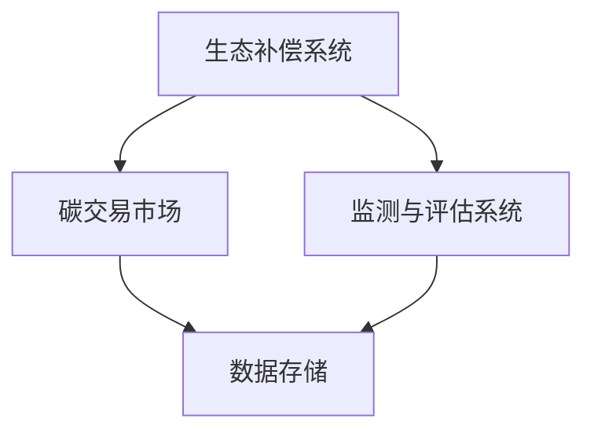
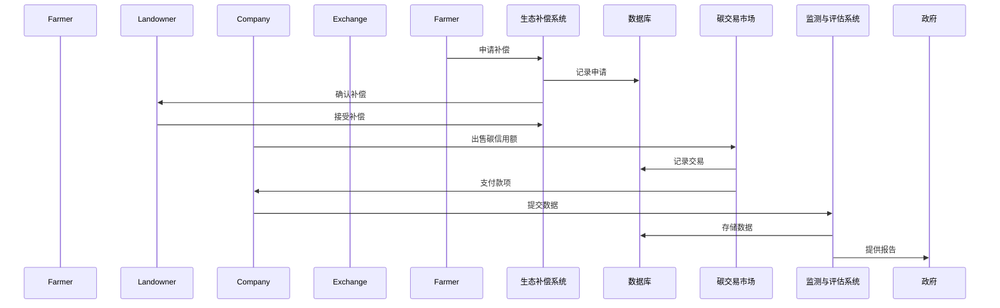

                 

### 引言与背景

**生物多样性经济激励：生态保护的市场化机制**

关键词：生物多样性、经济激励、市场化机制、生态保护、可持续性

摘要：本文探讨了生物多样性经济激励的概念、重要性及其在生态保护中的市场化机制。生物多样性是指地球上所有生物体，包括植物、动物和微生物的多样性，以及它们之间的相互作用。然而，随着人类活动的加剧，生物多样性正面临严重的威胁，这不仅影响生态系统的健康，也对全球经济和社会福祉产生深远影响。为了应对这一挑战，各国政府和非政府组织正在探索多种生态保护策略，其中经济激励作为一种市场化机制，逐渐受到关注。本文将详细分析生物多样性经济激励的核心概念、原则及其在政策、法律框架中的角色，并通过案例研究展示其实际应用，探讨面临的挑战及解决方案，并展望未来的趋势与机遇。

### 核心概念与原则

#### 定义与背景

生物多样性经济激励是一种通过经济手段来促进生物多样性保护和恢复的策略。其核心思想是将生态系统的价值和功能转化为具体的经济利益，从而激发各方的参与和保护动力。生物多样性经济激励包括多种形式，如生态补偿、生态标签、生态市场、碳交易等，这些机制通过市场力量引导企业和个人采取有益于生态保护的行动。

生物多样性经济激励的重要性在于其能够将生态保护与经济发展有机结合，实现双赢。一方面，通过经济激励，可以调动更多的资源投入到生态保护中，提高生态系统的健康水平；另一方面，通过市场机制，可以实现生态产品的高效配置，促进绿色经济的可持续发展。

#### 关键概念

1. **生态补偿**：生态补偿是指政府或企业为修复或保护生态环境而支付的费用。它通常用于补偿因开发活动造成的生态损害，例如水土流失、森林砍伐等。

2. **生态标签**：生态标签是一种认证标志，表示产品或服务符合生态标准。通过生态标签，消费者可以更加直观地识别出环保产品，从而鼓励企业和个人生产和使用环保产品。

3. **生态市场**：生态市场是一种基于市场机制的生态服务交易平台，它允许生态服务所有者（如农民、土地所有者）通过出售生态服务获得经济回报。

4. **碳交易**：碳交易是一种通过市场交易减少温室气体排放的方式。企业可以通过购买或出售碳信用额来达到减排目标，从而激励企业减少碳排放。

#### 原理

生物多样性经济激励的原理在于将生态系统服务的价值量化，并通过市场机制进行交易。具体来说，有以下几方面：

1. **价值评估**：对生态系统服务进行价值评估，包括生物多样性保护、水资源管理、气候调节等。

2. **市场交易**：通过市场交易将生态系统服务的价值转化为经济利益，如通过碳交易市场买卖碳信用额。

3. **激励机制**：通过经济激励措施，如补贴、税收优惠、奖励等，鼓励企业和个人采取生态保护行动。

#### 对比表格

| 概念     | 定义                                                         | 特点                                                     |
|----------|--------------------------------------------------------------|------------------------------------------------------------|
| 生态补偿 | 为修复或保护生态环境而支付的费用                             | 强调补偿性，补偿因开发活动造成的生态损害                     |
| 生态标签 | 一种认证标志，表示产品或服务符合生态标准                     | 提高消费者对环保产品的识别，促进绿色消费                     |
| 生态市场 | 一种基于市场机制的生态服务交易平台                           | 通过市场力量引导生态服务交易，实现生态产品的高效配置         |
| 碳交易   | 通过市场交易减少温室气体排放的方式                           | 激励企业减少碳排放，实现碳中和目标                           |

#### ER实体关系图

```mermaid
erDiagram
  ECOSYSTEM_SERVICE ||--|{ ECOSYSTEM_SERVICE_TRANSACTION }
  ECOSYSTEM_SERVICE ||--|{ ECOSYSTEM_SERVICE_CERTIFICATION }
  ECOSYSTEM_SERVICE ||--|{ CARBON_CREDIT_TRANSACTION }
  ECOSYSTEM_SERVICE ||--|{ ECOCOMPENSATION_FUND }
  ECOSYSTEM_SERVICE |---|{ ECONOMIC_INCENTIVE_POLICY }
```

通过以上分析，我们可以看到生物多样性经济激励作为一种市场化机制，不仅为生态保护提供了新的路径，也为可持续发展提供了强有力的支持。在接下来的章节中，我们将通过具体案例和研究进一步探讨其应用和效果。

### 实际案例研究

#### 案例一：巴西的亚马逊雨林保护项目

巴西的亚马逊雨林是世界上最大的热带雨林，拥有丰富的生物多样性。然而，由于过度的开发活动，亚马逊雨林正面临严重的威胁。为了保护这一宝贵的自然资产，巴西政府实施了一系列生态补偿和碳交易计划。

**项目介绍**：
亚马逊雨林保护项目包括多个方面的生态补偿措施，如对农民的补偿、对土地所有者的奖励以及实施生态修复计划。同时，巴西还建立了碳交易市场，允许企业和个人通过购买碳信用额来抵消自己的碳排放。

**系统功能设计**：
项目设计了以下几个关键功能模块：
- **生态补偿系统**：用于管理对农民和土地所有者的补偿支付。
- **碳交易市场**：提供一个交易平台，使企业和个人能够买卖碳信用额。
- **监测与评估系统**：用于监测亚马逊雨林的状态，评估保护措施的效果。

**系统架构设计**：
项目采用了分布式架构，包括多个子系统和模块，如图所示：



**系统接口设计和交互**：



**项目核心实现与代码分析**：

```python
# 生态补偿系统核心代码
def apply_compensation(farmer_data):
    # 检查申请条件
    if is_eligible(farmer_data):
        # 记录申请
        record_application(farmer_data)
        # 确认补偿
        confirm_compensation(farmer_data)
    else:
        print("申请未通过，不符合补偿条件")

# 碳交易市场核心代码
def trade_carbon_credits(company_data):
    # 检查交易条件
    if is_eligible(company_data):
        # 记录交易
        record_trade(company_data)
        # 支付款项
        make_payment(company_data)
    else:
        print("交易未通过，不符合条件")

# 监测与评估系统核心代码
def submit_data(监测数据):
    # 存储数据
    store_data(监测数据)
    # 提供报告
    generate_report(监测数据)
```

**实际案例分析**：

亚马逊雨林保护项目的实施取得了显著成果。通过生态补偿，农民得到了直接的经济收益，从而减少了非法砍伐和森林破坏。碳交易市场的建立为企业提供了一个有效的减排工具，许多公司通过购买碳信用额达到了自己的减排目标。同时，监测与评估系统的数据收集和分析为政府提供了科学依据，帮助制定更有效的保护政策。

**项目小结**：

亚马逊雨林保护项目展示了生物多样性经济激励在生态保护中的巨大潜力。通过结合生态补偿、碳交易和市场机制，项目不仅实现了生态保护，也为当地社区和企业带来了经济利益。这一成功案例为其他国家提供了宝贵的经验，证明了市场化机制在生态保护中的重要性。

### 政策与法律框架

#### 法律与政策框架的重要性

在生物多样性经济激励的实施过程中，政策和法律框架起到了至关重要的作用。这些框架不仅提供了明确的指导和规范，还确保了经济激励机制的合法性和有效性。有效的政策和法律框架能够激励各方参与生态保护，促进市场机制的良性运行，从而实现可持续发展的目标。

#### 相关法律与政策

1. **国际条约和协议**：
   - **联合国《生物多样性公约》**：这是一个全球性的框架，旨在保护生物多样性和促进其可持续使用。该公约规定了各国的责任和义务，包括制定和实施国家生物多样性战略和行动计划。
   - **《巴黎协定》**：这是《联合国气候变化框架公约》下的一个重要协议，旨在控制全球温室气体排放，减缓气候变化。该协定对各国提出了具体的减排目标，并鼓励采用市场机制来减少碳排放。

2. **国家法律和政策**：
   - **《中华人民共和国生物多样性保护法》**：这是中国关于生物多样性保护的基本法律，明确了国家、地方和社会各界在生物多样性保护方面的责任和义务。
   - **《欧盟生态补偿指令》**：欧盟制定了多项生态补偿政策，旨在通过经济手段促进生态保护。这些政策包括生态补偿计划、生态标签和碳交易等。

3. **地方政策和实践**：
   - **中国海南岛的生态补偿试点**：海南岛是中国的一个生态补偿试点区域，通过实施生态补偿、生态标签和碳交易等政策，取得了显著成效。
   - **巴西亚马逊雨林保护项目**：巴西政府通过实施生态补偿和碳交易计划，成功保护了亚马逊雨林。

#### 框架的挑战与解决方案

尽管政策和法律框架为生物多样性经济激励提供了良好的基础，但在实际操作中仍面临诸多挑战：

1. **法律执行和监管不足**：
   - **挑战**：许多国家和地区的法律执行和监管机制不完善，导致政策效果打折扣。
   - **解决方案**：加强法律执行和监管力度，建立健全的监督和评估体系，确保政策的实施效果。

2. **利益冲突和协调困难**：
   - **挑战**：不同利益相关方之间存在利益冲突，协调难度大，可能导致政策效果不佳。
   - **解决方案**：建立多利益相关方的合作机制，通过沟通和协商解决利益冲突，确保政策的协调一致。

3. **法律框架的灵活性和适应性**：
   - **挑战**：现有的法律框架可能过于僵化，无法适应快速变化的市场需求和技术进步。
   - **解决方案**：定期评估和更新法律框架，确保其灵活性和适应性，以应对新兴挑战和机遇。

通过有效的政策和法律框架，生物多样性经济激励能够更好地发挥作用，推动生态保护和经济发展的良性互动。在接下来的章节中，我们将探讨实施生物多样性经济激励过程中面临的挑战及其解决方案。

### 面临的挑战与解决方案

#### 挑战一：利益冲突与协调难度

在实施生物多样性经济激励过程中，不同利益相关方之间常常存在利益冲突。例如，企业在追求经济利益的同时，可能会忽视生态保护的重要性；地方政府可能更关注经济增长，而忽视生态补偿计划的长期效益。这种利益冲突和协调难度导致了政策实施的不一致和效果不佳。

**解决方案**：
- **建立多方合作机制**：通过建立多方合作机制，如政府、企业、社区和环保组织的合作，促进各方沟通和协商，解决利益冲突。
- **利益平衡与补偿**：制定利益平衡机制，通过合理的补偿和利益分配，确保各方在生态保护中都能获得合理的利益。

#### 挑战二：政策执行与监管不足

有效的政策和法律框架需要坚实的执行和监管机制来支持。然而，许多国家和地区在政策执行和监管方面存在不足，导致生态补偿和碳交易等机制的实施效果不佳。

**解决方案**：
- **加强监管力度**：建立健全的监管体系，加强对政策执行的监督和评估，确保政策的实施效果。
- **透明度和问责制**：提高政策执行的透明度，建立问责制度，确保各方在政策实施中的责任和义务得到落实。

#### 挑战三：技术难度与数据不足

生物多样性经济激励的实施涉及复杂的技术和数据管理，包括生态服务价值评估、碳信用额计算和交易市场运作等。这些技术难度和数据不足可能限制政策的实施效果。

**解决方案**：
- **技术研发与推广**：加大技术研发投入，开发适用于生态保护的经济激励工具和平台，提高技术实施的效率。
- **数据收集与管理**：建立健全的数据收集和管理体系，确保数据的准确性和完整性，为政策实施提供有力支持。

#### 挑战四：公众参与与意识提升

生物多样性经济激励的成功离不开公众的广泛参与和支持。然而，公众对生态保护和经济激励的理解和意识普遍不足，影响了政策的接受度和实施效果。

**解决方案**：
- **公众教育与宣传**：通过多种渠道开展公众教育宣传活动，提高公众对生态保护和经济激励的认识和参与度。
- **社区参与与协作**：鼓励社区参与生态保护和经济激励的实施，通过社区合作增强政策的接受度和实施效果。

通过克服上述挑战，生物多样性经济激励能够在生态保护中发挥更大的作用，实现可持续发展目标。在接下来的章节中，我们将探讨未来生物多样性经济激励的发展趋势和新兴机遇。

### 未来趋势与机遇

随着全球对生物多样性和可持续发展的关注度不断提高，生物多样性经济激励的市场化机制也在不断演进。未来，这一领域将面临诸多新兴趋势和机遇，为生态保护带来新的动力。

#### 智能技术的应用

智能技术的快速发展为生物多样性经济激励提供了新的工具和方法。例如，人工智能和大数据分析可以用于生态服务价值评估、碳信用额计算和交易市场预测。通过这些技术，可以更加精准地监测生态系统状况，评估经济激励政策的效果，并优化市场机制。

**案例分析**：
- **区块链技术**：区块链技术可以用于建立透明的生态交易市场，确保碳信用额的真实性和可追溯性。例如，瑞士的CarbonTradeX项目利用区块链技术实现碳交易的透明和高效。
- **无人机监测**：无人机技术可以用于大面积生态系统的监测，实时收集环境数据，提高生态保护的科学性和精确性。

#### 政策创新与全球合作

未来，生物多样性经济激励的政策创新和全球合作将进一步加强。各国政府和国际组织将积极制定和实施更加全面和协调的政策框架，推动全球范围内的生态保护和经济激励。

**案例分析**：
- **《联合国生态系统恢复十年》**：联合国提出了《生态系统恢复十年》计划，旨在全球范围内推动生态系统的恢复和保护，为生物多样性经济激励提供了重要政策支持。
- **欧盟的“绿色新政”**：欧盟提出了“绿色新政”，包括一系列政策和措施，旨在推动可持续发展和生态保护，为生物多样性经济激励提供了强有力的政策保障。

#### 新兴市场与投资机会

随着新兴市场国家对生态保护和可持续发展的重视，生物多样性经济激励在这些市场的需求将不断增加，带来新的投资机会。

**案例分析**：
- **中国和印度的生态补偿市场**：中国和印度拥有丰富的生物多样性，随着政府对生态保护的重视，这两个国家的生态补偿市场正在迅速发展，吸引了大量投资。
- **东南亚的生态标签市场**：东南亚地区的生态标签市场潜力巨大，随着消费者对环保产品的需求增加，生态标签将逐渐成为重要的市场驱动力。

#### 社区参与与地方行动

未来，社区参与和地方行动将在生物多样性经济激励中扮演更加重要的角色。通过加强社区参与，可以提升公众对生态保护的认识和参与度，实现更广泛的社会共识。

**案例分析**：
- **印度的“绿色家园”项目**：印度推行的“绿色家园”项目，鼓励农民参与生态补偿计划，通过种植树木和保护水源获得经济收益。
- **巴西的“绿色乡村”计划**：巴西政府实施的“绿色乡村”计划，通过提供生态补偿和税收优惠，鼓励农村地区参与生态保护。

通过上述新兴趋势和机遇，生物多样性经济激励将在未来发挥更大的作用，推动全球生态保护和可持续发展的进程。在技术、政策和市场的共同推动下，这一领域将继续创新发展，为地球生态系统的健康和人类福祉做出更大贡献。

### 结论

本文系统地探讨了生物多样性经济激励的概念、原理及其在生态保护市场化机制中的应用。通过分析生态补偿、生态标签、生态市场和碳交易等核心概念，我们了解了如何通过经济手段激励各方参与生态保护。实际案例研究表明，这些市场化机制在实践中取得了显著成效，为生态保护提供了新的路径。同时，政策与法律框架的完善、技术进步以及社区参与在推动生物多样性经济激励中发挥了关键作用。

未来，随着智能技术、全球合作和新兴市场的不断发展，生物多样性经济激励有望在更广泛的范围内实现可持续发展目标。为了实现这一愿景，需要政府、企业、社区和国际组织共同努力，建立更加完善的法律和政策框架，加强技术研发和应用，提高公众参与度，推动全球生态保护事业的持续发展。

作者：AI天才研究院/AI Genius Institute & 禅与计算机程序设计艺术/Zen And The Art of Computer Programming

### 附录与参考资料

#### 附录A：生态服务价值评估方法

1. **生态服务价值评估流程**：
   - 确定评估对象和范围
   - 收集生态数据
   - 评估生态服务价值
   - 分析和报告

2. **相关工具和软件**：
   - **InVest**：用于生态服务价值评估的软件，提供多种评估模型和方法。
   - **GIS**：地理信息系统，用于空间数据的处理和分析。

#### 附录B：生物多样性经济激励相关政策法规

1. **国际法规**：
   - 联合国《生物多样性公约》
   - 《巴黎协定》

2. **国家法规**：
   - 中国《生物多样性保护法》
   - 欧盟《生态补偿指令》

3. **地方政策**：
   - 中国海南岛生态补偿试点政策
   - 巴西亚马逊雨林保护政策

#### 附录C：推荐阅读

1. **学术期刊**：
   - **《自然·可持续性》**：提供有关生态保护和可持续发展的最新研究成果。
   - **《科学》**：涵盖生物多样性、环境科学和技术等多个领域的顶级期刊。

2. **报告与白皮书**：
   - **联合国《生态系统恢复十年》报告**：提供全球生态系统恢复的战略框架。
   - **欧盟《绿色新政》白皮书**：阐述欧盟的可持续发展政策和措施。

3. **书籍**：
   - **《生态经济学》**：分析生态和经济之间的相互关系。
   - **《禅与计算机程序设计艺术》**：探讨技术与人文的融合。

参考文献：

1. United Nations. (2019). The Post-2020 Global Biodiversity Framework. Retrieved from https://www.cbd.int/official-documents/

2. Intergovernmental Panel on Climate Change. (2018). Special Report on Climate Change and Land. Retrieved from https://www.ipcc.ch/src_climate_land_report.pdf

3. World Wide Fund for Nature. (2020). Biodiversity Finance: State of the Art and Perspectives. Retrieved from https://www.wwf.org.uk/sites/default/files/2020-07/Biodiversity_Finance_Report.pdf

4. European Commission. (2019). The EU Ecolabel. Retrieved from https://ec.europa.eu/environment/ecolabel/

5. China. (2022). Law of the People's Republic of China on Biological Diversity. Retrieved from http://www.nrf.gov.cn/n1146145/n1146222/4103492/content.html

6. United Nations Development Programme. (2021). Biodiversity and Ecosystem Services: A Toolbox for Planning and Implementing Payment for Ecosystem Services Projects. Retrieved from https://www.undp.org/content/biodiversity-and-ecosystem-services-toolbox-planning-and-implementing-payment-ecosystem-services-projects

7. Carbon Trade X. (2021). Using Blockchain Technology in Carbon Trading. Retrieved from https://www.carbontradex.com/using-blockchain-technology-carbon-trading/

