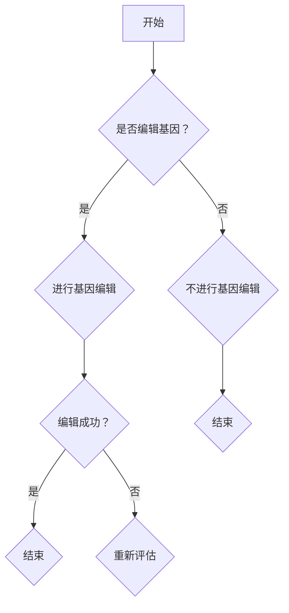

                 

# 生物科技伦理：人类进化中的价值判断

> 关键词：生物科技、伦理、价值判断、进化、伦理决策

> 摘要：本文从生物科技伦理的角度出发，探讨了人类进化过程中形成的价值判断对现代社会的影响。通过分析基因编辑、克隆技术、人类生殖技术、精准医疗和动物实验等核心议题，探讨了伦理决策的复杂性以及法律与伦理的关系。同时，结合国际视野和案例分析，展望了生物科技伦理的未来发展方向，为读者提供了全面而深入的思考。

### 目录大纲

----------------------------------------------------------------

## 第一部分：引言

### 1.1 问题的背景

#### 1.1.1 生物科技的快速进步

#### 1.1.2 伦理问题日益突出

#### 1.1.3 研究与社会的需求

### 1.2 伦理的定义与重要性

#### 1.2.1 伦理的定义

#### 1.2.2 伦理在生物科技中的重要性

#### 1.2.3 伦理原则概述

### 1.3 人类进化中的价值判断

#### 1.3.1 人类进化的历程

#### 1.3.2 价值判断的形成

#### 1.3.3 价值判断与生物科技

### 1.4 本书结构概述

#### 1.4.1 各章节内容安排

#### 1.4.2 阅读建议

## 第二部分：生物科技伦理的核心议题

### 2.1 基因编辑

#### 2.1.1 基因编辑技术简介

#### 2.1.2 基因编辑的应用

#### 2.1.3 基因编辑的伦理争议

### 2.2 克隆技术

#### 2.2.1 克隆技术的原理

#### 2.2.2 克隆技术的应用

#### 2.2.3 克隆技术的伦理问题

### 2.3 人类生殖技术

#### 2.3.1 人类生殖技术的分类

#### 2.3.2 人类生殖技术的影响

#### 2.3.3 人类生殖技术的伦理挑战

### 2.4 精准医疗

#### 2.4.1 精准医疗的概念

#### 2.4.2 精准医疗的优势

#### 2.4.3 精准医疗的伦理问题

### 2.5 动物实验

#### 2.5.1 动物实验的重要性

#### 2.5.2 动物实验的伦理争议

#### 2.5.3 动物替代实验的可能性

## 第三部分：伦理决策与价值判断

### 3.1 伦理决策过程

#### 3.1.1 伦理决策的定义

#### 3.1.2 伦理决策的步骤

#### 3.1.3 伦理决策的难点

### 3.2 价值判断的多样性

#### 3.2.1 价值判断的多样性来源

#### 3.2.2 不同文化背景下的价值判断

#### 3.2.3 价值判断的变迁

### 3.3 法律与伦理的关系

#### 3.3.1 法律在生物科技伦理中的作用

#### 3.3.2 法律与伦理的冲突

#### 3.3.3 法律与伦理的互补

### 3.4 伦理教育与公众参与

#### 3.4.1 伦理教育的重要性

#### 3.4.2 公众参与伦理决策的途径

#### 3.4.3 提高公众生物科技伦理意识的策略

## 第四部分：国际视野与未来展望

### 4.1 国际生物科技伦理规范

#### 4.1.1 国际组织的角色

#### 4.1.2 国际伦理规范的现状

#### 4.1.3 国际伦理规范的发展趋势

### 4.2 生物科技伦理的未来展望

#### 4.2.1 新兴生物科技伦理议题

#### 4.2.2 生物科技伦理教育的发展

#### 4.2.3 生物科技伦理的国际合作

### 4.3 未来社会中的生物科技伦理

#### 4.3.1 生物科技对社会的潜在影响

#### 4.3.2 伦理决策的复杂性

#### 4.3.3 人类与生物科技的和谐共生

## 第五部分：案例分析与讨论

### 5.1 案例介绍

#### 5.1.1 案例一：基因编辑婴儿事件

#### 5.1.2 案例二：CRISPR-Cas9技术争议

#### 5.1.3 案例三：精准医疗实践中的伦理困境

### 5.2 案例分析

#### 5.2.1 案例一分析

#### 5.2.2 案例二分析

#### 5.2.3 案例三分析

### 5.3 案例讨论

#### 5.3.1 案例一讨论

#### 5.3.2 案例二讨论

#### 5.3.3 案例三讨论

## 第六部分：结论与展望

### 6.1 主要结论

#### 6.1.1 生物科技伦理的重要性

#### 6.1.2 伦理决策的复杂性

#### 6.1.3 未来的挑战与机遇

----------------------------------------------------------------

## 第一部分：引言

### 1.1 问题的背景

#### 1.1.1 生物科技的快速进步

随着分子生物学、基因组学、生物信息学等领域的快速发展，生物科技正以前所未有的速度和规模改变着我们的生活。基因编辑、克隆技术、精准医疗等前沿技术的涌现，不仅为我们提供了治疗疾病的新手段，也带来了前所未有的伦理挑战。例如，基因编辑技术虽然有望治愈遗传性疾病，但同时也引发了关于基因改造、生物多样性和人类身份的争议。

#### 1.1.2 伦理问题日益突出

生物科技的进步带来了许多伦理问题，这些问题不仅涉及医学领域，还涵盖了环境、社会、经济等多个层面。例如，基因编辑技术的应用引发了关于基因改造伦理的讨论，克隆技术的出现引发了关于克隆人类伦理的争议，精准医疗的普及引发了关于数据隐私和安全的问题。这些问题迫切需要我们进行深入研究和探讨，以确保生物科技的发展能够造福人类。

#### 1.1.3 研究与社会的需求

生物科技伦理问题的研究不仅具有学术价值，也有很强的社会需求。随着生物科技的快速发展，公众对生物科技伦理问题的关注日益增加。人们迫切需要了解生物科技的发展趋势及其潜在风险，以便做出明智的决策。同时，政策制定者和研究机构也需要基于伦理原则制定相关的政策和规范，以引导生物科技的发展方向。

### 1.2 伦理的定义与重要性

#### 1.2.1 伦理的定义

伦理，又称道德哲学，是研究道德概念、道德原则和道德行为的哲学分支。伦理关注的是人类行为的道德价值和道德判断，旨在为人类行为提供道德指导。伦理学的研究内容包括道德原则、道德判断、道德责任、道德义务等。

在生物科技领域，伦理的定义有所不同。生物科技伦理是指以伦理原则为指导，对生物科技的研究、应用和发展进行评价和规范的学科。生物科技伦理关注的是生物科技在道德上的合理性，以及其对人类社会和自然环境的影响。

#### 1.2.2 伦理在生物科技中的重要性

伦理在生物科技中的重要性体现在以下几个方面：

1. **指导生物科技研究**：伦理原则为生物科技研究提供了道德框架，确保研究活动符合道德标准，避免对人类和环境造成不必要的伤害。

2. **规范生物科技应用**：伦理原则对生物科技的应用进行评价和规范，确保其应用符合道德要求，最大限度地造福人类。

3. **保护人权**：生物科技的发展可能会威胁到人权，如基因编辑可能引发关于基因改造和人类身份的争议。伦理原则为人权保护提供了理论基础。

4. **促进可持续发展**：伦理原则关注生物科技对自然环境的影响，促进生物科技的可持续发展。

#### 1.2.3 伦理原则概述

生物科技伦理涉及多个伦理原则，其中最重要的是尊重生命、公正、自主和安全原则。

1. **尊重生命**：尊重生命是伦理的核心原则之一。在生物科技领域，尊重生命意味着尊重所有生物体的生命权利，避免对生物体的伤害。

2. **公正**：公正原则要求在生物科技研究和应用中，确保公平对待所有个体，避免歧视和不平等。

3. **自主**：自主原则强调个体在生物科技研究和应用中的自由意志和自主选择权，确保个体的知情同意和自主决定。

4. **安全**：安全原则要求在生物科技研究和应用中，确保人类和环境的安全，防止意外伤害。

### 1.3 人类进化中的价值判断

#### 1.3.1 人类进化的历程

人类的进化是一个漫长而复杂的过程，大约始于6000万年前的非猿类哺乳动物。在进化过程中，人类逐渐发展出了独特的智力、社交能力和工具使用技能。这些进化特征使人类能够在自然界中脱颖而出，成为地球上最具影响力的物种之一。

人类的进化历程可以分为以下几个阶段：

1. **原始人类**（约6000万年前-200万年前）：这一阶段的人类包括早期的非猿类哺乳动物，如原始灵长类动物。这些动物逐渐演化出一些智力特征，如大脑的发展和手的使用。

2. **早期人类**（约200万年前-200万年前）：这一阶段的人类包括早期的直立人，如露西（Australopithecus afarensis）。这些人类开始使用简单的工具，并在社会结构中形成了早期的家庭和群体。

3. **晚期人类**（约20万年前-1万年前）：这一阶段的人类包括尼安德特人（Homo neanderthalensis）和早期现代人（Homo sapiens）。晚期人类在智力、工具使用和社会组织方面取得了重大进展，逐渐形成了复杂的文明。

4. **现代人类**（约1万年前至今）：现代人类在智力、文化和社会组织方面达到了前所未有的高度。人类开始发展农业、城市和国家，并在科学、技术和文化方面取得了巨大成就。

#### 1.3.2 价值判断的形成

价值判断是人类进化过程中逐渐形成的一种心理机制，用于评估和指导人类行为。价值判断的形成受到多种因素的影响，包括生物学、文化和社会因素。

1. **生物学因素**：生物学的进化过程为人类形成价值判断提供了基础。在进化过程中，人类逐渐发展出了对生存、繁衍和社会交往的基本需求，这些需求促使人类形成了一系列价值判断。

2. **文化因素**：文化是价值判断形成的重要来源。不同的文化背景和价值观会导致人们对同一现象有不同的价值判断。例如，某些文化可能强调集体利益，而另一些文化可能强调个人自由。

3. **社会因素**：社会环境和人际关系也会影响价值判断的形成。社会规范、道德观念和社会责任感等因素都会影响个体对事物的价值判断。

#### 1.3.3 价值判断与生物科技

价值判断在生物科技领域具有重要意义。生物科技的发展涉及许多伦理问题，如基因编辑、克隆技术、人类生殖技术和动物实验等。这些问题的处理需要基于人类的价值判断。

1. **基因编辑**：基因编辑技术允许科学家对生物体的基因组进行精确修改。这种技术的潜在应用包括治疗遗传性疾病、增强人类能力等。然而，基因编辑也引发了许多伦理问题，如基因改造、人类身份和生物多样性。这些伦理问题需要基于人类的价值判断进行评估。

2. **克隆技术**：克隆技术可以使科学家复制生物体的基因组，包括人类。克隆技术的应用包括医学研究、生物复制和人类克隆等。然而，克隆技术也引发了关于人类身份、伦理和道德的争议。这些争议需要基于人类的价值判断进行解决。

3. **人类生殖技术**：人类生殖技术，如试管婴儿技术和代孕等，改变了人类繁殖的传统方式。这些技术的应用涉及伦理问题，如基因选择、代孕权益和亲子关系等。这些问题的处理需要基于人类的价值判断。

4. **动物实验**：动物实验在医学和生物学研究中具有重要意义。然而，动物实验也引发了伦理问题，如动物权利、实验痛苦和替代实验方法等。这些问题的处理需要基于人类的价值判断。

### 1.4 本书结构概述

#### 1.4.1 各章节内容安排

本书分为六个部分，分别从不同的角度探讨了生物科技伦理的核心议题。具体内容安排如下：

1. **第一部分：引言**：介绍了生物科技伦理的背景、伦理的定义与重要性、人类进化中的价值判断以及本书的结构概述。

2. **第二部分：生物科技伦理的核心议题**：分析了基因编辑、克隆技术、人类生殖技术、精准医疗和动物实验等核心议题的伦理争议。

3. **第三部分：伦理决策与价值判断**：探讨了伦理决策的过程、价值判断的多样性、法律与伦理的关系以及伦理教育与公众参与。

4. **第四部分：国际视野与未来展望**：介绍了国际生物科技伦理规范、生物科技伦理的未来展望以及未来社会中的生物科技伦理。

5. **第五部分：案例分析与讨论**：通过具体案例分析了基因编辑、CRISPR-Cas9技术和精准医疗等生物科技伦理问题的处理。

6. **第六部分：结论与展望**：总结了生物科技伦理的重要性、伦理决策的复杂性以及未来的挑战与机遇。

#### 1.4.2 阅读建议

本书旨在为读者提供一个全面而深入的生物科技伦理视角。为了更好地理解本书的内容，读者可以采取以下阅读建议：

1. **理解核心概念**：在阅读过程中，重点关注各章节中的核心概念，如伦理、价值判断、基因编辑、克隆技术等。

2. **思考与讨论**：在阅读各章节时，积极思考并参与讨论，探索不同观点和立场，以培养批判性思维。

3. **结合实际案例**：结合具体案例，深入分析生物科技伦理问题，以更好地理解伦理决策的复杂性和多样性。

4. **关注未来发展趋势**：在阅读过程中，关注生物科技伦理的未来发展趋势，思考如何应对未来可能出现的伦理挑战。

通过以上阅读建议，读者可以更好地理解生物科技伦理的核心议题，并为未来的伦理决策提供有益的思考。## 第二部分：生物科技伦理的核心议题

### 2.1 基因编辑

#### 2.1.1 基因编辑技术简介

基因编辑技术，如CRISPR-Cas9系统，是一种可以精确修改生物体基因组的技术。CRISPR（Clustered Regularly Interspaced Short Palindromic Repeats）是一种源自细菌的天然免疫系统，能够识别并破坏入侵的病毒DNA。Cas9是一种酶，能够切割DNA链，实现基因编辑。

CRISPR-Cas9系统的工作原理如下：

1. **目标识别**：CRISPR系统通过使用RNA分子来识别目标DNA序列。

2. **切割DNA**：Cas9酶在目标DNA序列上切割，形成双链断裂。

3. **DNA修复**：细胞会利用其内置的DNA修复机制来修复断裂，这个过程可能导致基因的插入、删除或替换。

基因编辑技术的应用包括：

1. **医学**：治疗遗传性疾病，如囊性纤维化和遗传性失聪等。

2. **农业**：改良农作物和家畜的遗传特性，提高产量和抗病能力。

3. **生物研究**：用于基因功能研究，帮助科学家更好地理解基因如何影响生物体的生理和病理过程。

#### 2.1.2 基因编辑的应用

基因编辑在医学领域的应用前景广阔，尤其是治疗遗传性疾病。以下是一些具体的医学应用：

1. **单基因遗传病**：基因编辑可以直接修改导致遗传性疾病的特定基因，如脊髓性肌萎缩症（SMA）和囊性纤维化。

2. **癌症治疗**：基因编辑技术可以用于癌症治疗，如通过编辑免疫T细胞来增强其攻击癌细胞的能力。

3. **艾滋病治疗**：基因编辑可以用于改造免疫系统，使其能够更好地抵抗艾滋病病毒。

在农业领域，基因编辑技术可以用于：

1. **提高作物产量**：通过编辑作物基因，提高作物的生长速度和抗病能力。

2. **改良作物营养成分**：如通过编辑基因来增加作物的维生素含量。

3. **减少农药使用**：通过编辑作物的基因，使其具有更强的抗虫害能力，减少农药的使用。

在生物研究领域，基因编辑技术可以用于：

1. **基因功能研究**：通过编辑特定基因，观察其对生物体的影响，以研究基因的功能。

2. **疾病模型构建**：通过编辑基因，构建模拟特定疾病的模型，用于疾病机理的研究。

3. **药物筛选**：通过编辑基因，筛选具有潜在治疗作用的药物。

#### 2.1.3 基因编辑的伦理争议

基因编辑技术的应用虽然带来了许多潜在的好处，但也引发了一系列伦理争议：

1. **基因改造伦理**：基因编辑可能导致基因改造，引发关于人类身份、生物多样性和自然进化的争议。

2. **设计婴儿**：基因编辑技术可能被用于设计婴儿，选择特定的遗传特征，引发关于自由意志、平等和人类尊严的争议。

3. **公平与可及性**：基因编辑技术的应用可能加剧医疗资源的不平等，只有富裕人群才能负担得起这种高端治疗。

4. **不可预见的风险**：基因编辑可能产生意外的副作用或突变，这些风险尚未完全了解，引发关于安全和长期影响的争议。

5. **安全性监管**：基因编辑技术的监管问题，如如何确保安全性和有效性，以及如何处理可能的伦理违规行为。

### 2.2 克隆技术

#### 2.2.1 克隆技术的原理

克隆技术是一种通过体细胞核移植或人工合成DNA来复制生物体的方法。克隆技术的基本原理可以分为两大类：体细胞克隆和基因克隆。

1. **体细胞克隆**：体细胞克隆是通过体细胞核移植实现的。具体步骤如下：

   - **细胞核移植**：将一个成熟体细胞的细胞核移植到一个去除细胞核的卵细胞中。
   - **激活**：通过电刺激或化学物质激活重组细胞，使其开始分裂。
   - **胚胎培养**：将重组细胞培养成胚胎，然后植入代孕母体。
   - **妊娠和分娩**：代孕母体妊娠并分娩出克隆生物。

2. **基因克隆**：基因克隆是通过人工合成DNA序列来实现的。具体步骤如下：

   - **设计DNA序列**：科学家设计目标DNA序列，包括所需插入或替换的基因片段。
   - **合成DNA**：利用DNA合成技术合成目标DNA序列。
   - **构建基因载体**：将目标DNA序列插入到基因载体中，如质粒或病毒载体。
   - **导入宿主细胞**：将基因载体导入宿主细胞，如通过电穿孔、显微注射或病毒感染。
   - **基因表达**：宿主细胞表达插入的基因，产生所需蛋白。

#### 2.2.2 克隆技术的应用

克隆技术在多个领域具有潜在的应用：

1. **医学**：克隆技术可以用于医学研究，如创建基因突变模型以研究疾病机理，或用于生产治疗药物。

2. **生殖医学**：克隆技术可以用于治疗不孕症，通过体细胞克隆产生胚胎，然后进行胚胎移植。

3. **生物工程**：克隆技术可以用于生物工程，如生产重组蛋白、生物药物和生物材料。

4. **生物多样性保护**：克隆技术可以用于保护濒危物种，通过复制濒危物种的基因库，保护生物多样性。

#### 2.2.3 克隆技术的伦理问题

克隆技术的应用引发了许多伦理争议：

1. **克隆人伦理**：克隆人技术可能导致克隆人类的诞生，引发关于人类身份、伦理和道德的争议。许多人认为克隆人类违反了人类尊严和自由意志。

2. **动物克隆**：动物克隆技术的应用可能对动物福利造成影响，如克隆动物可能面临健康问题和生活质量下降。

3. **知识产权**：克隆技术的应用可能导致知识产权争议，如如何界定克隆生物的知识产权。

4. **安全性和有效性**：克隆技术的安全性尚未完全了解，如克隆动物可能存在遗传不稳定性或健康问题。

### 2.3 人类生殖技术

#### 2.3.1 人类生殖技术的分类

人类生殖技术包括多种方法，可以根据技术特点和用途进行分类：

1. **传统的生殖技术**：

   - **自然生殖**：通过性交或人工授精实现自然生殖。
   - **试管婴儿技术**（IVF）：在体外将精子和卵子结合，然后移植到母体子宫内。

2. **辅助生殖技术**：

   - **卵胞浆内单精子注射**（ICSI）：将单个精子直接注射到卵子内，实现受精。
   - **胚胎植入前遗传学诊断**（PGD）：在胚胎移植前对胚胎进行基因检测，选择健康的胚胎。

3. **生殖医学技术**：

   - **代孕**：代孕母亲为他人生育孩子。
   - **性别选择**：通过基因筛选技术选择胚胎的性别。

#### 2.3.2 人类生殖技术的影响

人类生殖技术对个人和社会产生了深远影响：

1. **个人层面**：

   - **不孕症治疗**：为不孕症患者提供生育机会。
   - **遗传疾病预防**：通过PGD技术预防遗传性疾病。
   - **性别选择**：为家庭提供选择性别的机会。

2. **社会层面**：

   - **家庭结构变化**：影响家庭关系和社会结构。
   - **伦理和法律问题**：如代孕的道德和法律责任，性别选择的社会影响。

3. **医学层面**：

   - **医学进步**：推动了生殖医学和遗传学的发展。
   - **技术风险**：如胚胎冷冻、基因编辑等技术的应用和安全问题。

#### 2.3.3 人类生殖技术的伦理挑战

人类生殖技术引发了一系列伦理挑战：

1. **代孕**：代孕涉及法律、道德和个人权益的复杂问题，如代孕母亲的权益保护，代孕合同的合法性。

2. **性别选择**：性别选择可能导致性别比例失衡，引发社会问题。

3. **基因编辑**：基因编辑可能导致遗传多样性的减少，引发伦理和道德争议。

4. **人类身份**：生殖技术的应用可能导致人类身份的混淆，引发关于人类本质和伦理的讨论。

### 2.4 精准医疗

#### 2.4.1 精准医疗的概念

精准医疗是一种以患者为中心的个性化医疗模式，通过整合基因组学、分子生物学、生物信息学等技术，为每个患者提供量身定制的治疗方案。精准医疗的核心思想是“以患者为中心”，通过深入了解患者的基因信息、生活方式和环境因素，制定个体化的治疗计划。

#### 2.4.2 精准医疗的优势

精准医疗具有以下优势：

1. **提高治疗效果**：通过针对患者的具体基因特征设计治疗方案，可以提高治疗效果，减少副作用。

2. **个性化医疗**：根据患者的个体差异，提供个性化的治疗方案，使医疗资源得到更有效的利用。

3. **预防疾病**：通过基因检测和风险评估，可以提前发现疾病风险，进行预防。

4. **降低医疗成本**：精准医疗可以减少不必要的检查和治疗，降低医疗成本。

#### 2.4.3 精准医疗的伦理问题

精准医疗虽然具有巨大的潜力，但也带来了一系列伦理问题：

1. **隐私和数据安全**：基因信息和医疗数据涉及个人隐私，如何保护数据安全和隐私成为一个重要问题。

2. **社会公平**：精准医疗可能加剧医疗资源的不平等，只有富裕人群才能负担得起这种高端医疗服务。

3. **基因歧视**：基因检测可能导致基因歧视，影响就业、保险和社会福利。

4. **伦理决策**：如何制定基于伦理原则的基因检测和治疗方案，成为精准医疗发展的关键问题。

### 2.5 动物实验

#### 2.5.1 动物实验的重要性

动物实验在医学和生物学研究中具有不可替代的重要性。动物实验可以模拟人类生理和环境条件，帮助科学家理解疾病机理，开发新药和治疗方法。

动物实验的重要性包括：

1. **新药开发**：动物实验是药物研发的重要环节，用于评估药物的安全性和有效性。

2. **疾病机理研究**：动物实验可以帮助科学家探索疾病发生的分子机制，为疾病治疗提供理论基础。

3. **生物学研究**：动物实验在生物学研究中用于探索生命过程的各个方面，如细胞生物学、神经科学和发育生物学。

#### 2.5.2 动物实验的伦理争议

动物实验引发了许多伦理争议：

1. **动物权益**：动物实验可能对动物造成痛苦和伤害，引发关于动物权益的争议。

2. **替代实验方法**：随着科技的发展，替代实验方法，如体外实验和计算机模拟，是否能够完全替代动物实验成为争议的焦点。

3. **科学伦理**：动物实验可能涉及伦理问题，如实验设计、动物福利和实验结果的可靠性。

4. **法律监管**：动物实验的伦理监管和法律框架成为争议的焦点，如何确保动物实验的伦理和合法性成为关键问题。

#### 2.5.3 动物替代实验的可能性

为了减少动物实验的使用，科学家和研究机构积极探索动物替代实验方法：

1. **体外实验**：利用细胞、组织和文化系统进行实验，替代动物实验。

2. **计算机模拟**：通过计算机模拟和生物信息学方法，模拟生物系统的行为和反应。

3. **人类生物样本**：利用人类生物样本，如血液、尿液和细胞，进行实验。

动物替代实验的发展为减少动物实验提供了新的可能性，但也面临技术挑战和伦理争议。

## 第三部分：伦理决策与价值判断

### 3.1 伦理决策过程

#### 3.1.1 伦理决策的定义

伦理决策是指在面对道德困境或伦理问题时，通过评估各种伦理原则和价值观，选择最合适的行动方案的过程。伦理决策涉及对道德原则的理解、对情境的评估以及对后果的预测。

伦理决策通常包括以下几个步骤：

1. **识别伦理问题**：首先需要明确所面临的伦理问题，这可能是由于某一决策或行动引发的，或者是对某一情境的道德评价。

2. **收集信息**：在识别伦理问题后，需要收集相关信息，包括事实背景、法律框架、伦理原则、相关方的利益和观点等。

3. **评估伦理原则**：在决策过程中，需要参考各种伦理原则，如尊重自主性、公正性、无害原则等，评估每个原则在该情境下的适用性。

4. **分析可能后果**：对各种行动方案可能产生的后果进行评估，包括对个人、社会、环境和长远影响的分析。

5. **选择最佳方案**：在综合评估各种伦理原则和后果后，选择最符合伦理要求的行动方案。

#### 3.1.2 伦理决策的步骤

伦理决策的具体步骤如下：

1. **情景分析**：明确问题的背景和情境，包括涉及的个体、群体、利益相关者以及问题的性质。

2. **界定问题**：将问题具体化，确定问题的核心和关键点，以便进行深入分析。

3. **评估伦理原则**：分析问题情境，判断哪些伦理原则适用，如尊重自主性、公正性、无害原则、善行原则等。

4. **列出行动方案**：基于伦理原则和问题情境，列出可能的行动方案。

5. **评估行动方案**：对每个行动方案进行伦理评估，分析其是否符合伦理原则，以及可能带来的后果。

6. **选择最佳方案**：综合评估各个行动方案的伦理价值和后果，选择最合适的方案。

7. **实施决策**：将决策付诸实施，并监控执行过程，确保决策的有效性和符合伦理要求。

8. **评估和反思**：在决策实施后，评估决策的效果，并根据反馈进行反思和调整。

#### 3.1.3 伦理决策的难点

伦理决策面临许多难点，包括：

1. **价值观冲突**：不同的伦理原则和价值观可能相互冲突，使得决策变得复杂。

2. **信息不完整**：在许多情境中，信息可能不完全或存在不确定性，这会影响决策的准确性。

3. **利益冲突**：不同个体或群体的利益可能相互冲突，如何在平衡各方利益的同时做出公正的决策是一个挑战。

4. **伦理原则的抽象性**：伦理原则通常是抽象的，如何将抽象的伦理原则应用于具体的情境是一个难点。

5. **后果的不确定性**：决策的后果可能难以预测，这增加了决策的风险和不确定性。

### 3.2 价值判断的多样性

#### 3.2.1 价值判断的多样性来源

价值判断的多样性来源于多个方面：

1. **文化差异**：不同的文化背景和价值体系会导致对同一问题的不同价值判断。例如，某些文化可能强调集体利益，而另一些文化可能更注重个人自由。

2. **社会背景**：社会环境和社会结构也会影响价值判断。例如，一个高度竞争的社会可能更注重成功和财富，而一个注重平等和互助的社会可能更重视公平和共享。

3. **个人经历**：个人的生活经历、教育和价值观也会影响其价值判断。例如，一个经历过疾病的人可能更加重视健康和医疗资源的分配。

4. **情境因素**：不同的情境和情境中的个体特征会影响价值判断。例如，在紧急情况下，人们可能更重视快速采取行动，而在长期规划中，可能更重视长远利益。

#### 3.2.2 不同文化背景下的价值判断

不同文化背景下的价值判断存在显著差异，以下是一些例子：

1. **西方文化**：在西方文化中，个人自由、自主权和人权是核心价值。这些文化通常重视个人权利和个人责任，强调个人自主决策。

2. **东方文化**：在东方文化中，家庭和社会责任、和谐与集体利益是核心价值。这些文化通常强调家庭和社区的团结，以及个体对整体的责任。

3. **宗教文化**：不同的宗教信仰也会影响价值判断。例如，基督教强调仁爱和宽容，而伊斯兰教强调公正和慈善。

4. **民族文化**：不同的民族和文化传统也会形成独特的价值观。例如，中国文化中的“和合”理念强调和谐与统一，而印度文化中的“阿特曼”概念强调个体灵魂的内在价值。

#### 3.2.3 价值判断的变迁

价值判断是动态的，随着时间的推移和社会的发展，价值判断可能会发生变化。以下是一些价值判断变迁的例子：

1. **性别平等**：在过去，许多文化中性别不平等是普遍现象，女性在社会中处于次要地位。随着社会的进步，性别平等逐渐成为全球性的价值观。

2. **环境保护**：在工业化初期，经济增长被视为最重要的目标，环境保护相对不被重视。随着环境问题的加剧，环境保护逐渐成为全球关注的焦点。

3. **人权**：人权观念在过去几个世纪中发生了显著变化。从奴隶制和种族隔离到现代的人权宣言，人权观念逐渐从特殊群体扩展到所有人。

4. **科技发展**：科技的快速发展带来了新的伦理挑战，如基因编辑和人工智能。这些新兴技术引发了关于人类本质、道德和社会影响的广泛讨论，可能导致价值判断的进一步演变。

### 3.3 法律与伦理的关系

#### 3.3.1 法律在生物科技伦理中的作用

法律在生物科技伦理中扮演着重要角色，其作用主要体现在以下几个方面：

1. **规范行为**：法律通过制定和执行相关法规，规范生物科技研究和应用的行为，确保其符合道德和伦理标准。

2. **保护权益**：法律保护个人和群体的权益，确保他们在生物科技应用中的知情同意、隐私保护和安全。

3. **监督和监管**：法律通过设立专门的监管机构，对生物科技研究和应用进行监督和管理，确保其安全性和有效性。

4. **惩罚违规行为**：法律对违反生物科技伦理的行为进行惩罚，如故意伤害他人、侵犯隐私或违反实验动物福利等。

#### 3.3.2 法律与伦理的冲突

法律与伦理之间可能存在冲突，主要体现在以下几个方面：

1. **价值差异**：法律和伦理可能基于不同的价值观，例如，某些法律可能允许某些在伦理上不被接受的行动，如死刑或奴隶制。

2. **执行难度**：法律在执行过程中可能面临挑战，如道德判断的复杂性、利益冲突和执法成本等。

3. **优先级冲突**：在某些情境下，法律和伦理的要求可能相互冲突，例如，在紧急情况下，法律可能要求个人保护自己，而伦理要求个人牺牲自己以救助他人。

4. **法律滞后**：生物科技的发展速度可能超过法律制定的速度，导致法律无法及时应对新兴的伦理问题。

#### 3.3.3 法律与伦理的互补

法律和伦理之间也存在互补关系，主要体现在以下几个方面：

1. **伦理指导法律**：伦理原则为法律制定提供道德基础和指导，确保法律符合道德要求。

2. **法律保障伦理**：法律为伦理原则的实施提供保障，通过立法和执法确保伦理要求得到遵守。

3. **共同应对挑战**：法律和伦理共同应对生物科技带来的伦理挑战，通过合作和协调，确保生物科技的发展符合道德和伦理要求。

4. **提升社会意识**：法律和伦理教育有助于提升公众对生物科技伦理问题的认识和理解，促进社会对伦理价值的尊重和遵守。

### 3.4 伦理教育与公众参与

#### 3.4.1 伦理教育的重要性

伦理教育在培养个体和社会对生物科技伦理问题的认识和判断能力中扮演着重要角色。伦理教育的重要性主要体现在以下几个方面：

1. **培养批判性思维**：伦理教育帮助个体发展批判性思维能力，使他们能够对复杂的伦理问题进行深入分析和独立判断。

2. **提升道德素养**：通过伦理教育，个体能够了解和内化伦理原则和价值观，提高道德素养和道德判断力。

3. **促进社会责任感**：伦理教育鼓励个体关注社会公共利益，培养社会责任感和道德责任感。

4. **提高决策质量**：伦理教育帮助个体在面临伦理困境时，能够做出更明智、更符合伦理要求的决策。

#### 3.4.2 公众参与伦理决策的途径

公众参与伦理决策是确保生物科技发展符合社会需求和伦理价值的重要途径。以下是一些公众参与伦理决策的途径：

1. **公众咨询和意见征询**：政策制定者和研究机构可以通过公开咨询和意见征询，收集公众对生物科技伦理问题的看法和建议。

2. **公民议会和圆桌会议**：组织公民议会和圆桌会议，邀请公众代表、专家学者、利益相关者参与讨论，共同制定生物科技政策。

3. **公众教育和宣传**：通过公众教育和宣传，提高公众对生物科技伦理问题的认识和理解，鼓励公众积极参与伦理决策。

4. **公众投票和表决**：在某些重大伦理决策中，可以采用公众投票和表决的方式，让公众直接参与决策过程。

#### 3.4.3 提高公众生物科技伦理意识的策略

为了提高公众生物科技伦理意识，可以采取以下策略：

1. **教育普及**：在学校、社区和媒体等渠道开展生物科技伦理教育，提高公众的科学素养和伦理意识。

2. **科普宣传**：通过科普文章、讲座、展览等形式，向公众普及生物科技伦理知识，提高公众对生物科技伦理问题的关注。

3. **案例分析和讨论**：通过分析具体案例，引导公众深入思考生物科技伦理问题，提高公众的伦理判断能力。

4. **互动平台**：建立互动平台，如在线论坛、社交媒体等，为公众提供交流和讨论生物科技伦理问题的空间。

5. **政策参与**：鼓励公众参与政策制定和公共讨论，让公众的声音在生物科技伦理决策中得以体现。

通过以上策略，可以提高公众生物科技伦理意识，促进生物科技的发展与社会的和谐共生。

## 第四部分：国际视野与未来展望

### 4.1 国际生物科技伦理规范

#### 4.1.1 国际组织的角色

在国际生物科技伦理规范的制定和执行中，多个国际组织发挥了重要作用。以下是一些主要国际组织及其角色：

1. **世界卫生组织（WHO）**：WHO是联合国下属的专门负责全球公共卫生事务的机构。它通过制定全球卫生政策、提供技术支持、监测和评估生物科技对人类健康的影响，推动生物科技伦理的规范化。

2. **联合国教科文组织（UNESCO）**：UNESCO通过其生物伦理委员会，致力于推动全球生物伦理教育和研究，确保生物科技的发展符合伦理原则。

3. **国际生物伦理学会联盟（IBEC）**：IBEC是一个全球性的生物伦理学会联盟，旨在促进生物伦理学的研究和交流，为生物科技伦理提供学术支持。

4. **经济合作与发展组织（OECD）**：OECD通过其生物技术委员会，制定生物科技伦理指南，为成员国提供生物科技伦理规范的参考。

#### 4.1.2 国际伦理规范的现状

国际生物科技伦理规范主要包括以下几个方面：

1. **基因编辑**：国际社会对基因编辑技术的伦理争议持续关注，一些国际组织制定了相关指南，如WHO的《人类基因编辑研究准则》。

2. **克隆技术**：国际社会对克隆技术的伦理态度存在分歧，一些国家禁止或限制克隆技术，而其他国家则持开放态度。

3. **精准医疗**：国际社会对精准医疗的伦理问题进行了广泛讨论，强调保护患者隐私、数据安全和社会公平。

4. **动物实验**：国际社会在动物实验的伦理规范上达成了一定共识，强调动物福利和替代实验方法的使用。

#### 4.1.3 国际伦理规范的发展趋势

随着生物科技的快速发展，国际生物科技伦理规范的发展趋势主要包括：

1. **加强国际合作**：国际社会通过加强合作，制定统一的伦理规范，以应对跨国生物科技研究和应用中的伦理挑战。

2. **推动伦理教育**：国际组织积极推动生物科技伦理教育，提高全球范围内的伦理意识和专业能力。

3. **关注新兴议题**：随着新技术的发展，国际社会将关注新兴生物科技伦理议题，如人工智能在生物科技中的应用、基因编辑技术在农业和环境保护中的潜在影响等。

4. **加强法律框架**：国际社会将推动生物科技伦理的法律框架建设，确保生物科技的发展在法律和伦理的双重保障下进行。

### 4.2 生物科技伦理的未来展望

#### 4.2.1 新兴生物科技伦理议题

随着生物科技的发展，新兴伦理议题不断涌现，主要包括：

1. **人工智能与生物科技**：人工智能在生物科技中的应用，如基因组学数据分析、疾病预测和治疗方案的个性化，引发了对数据隐私、算法伦理和人工智能决策责任的讨论。

2. **基因编辑技术的扩展应用**：基因编辑技术不仅用于医学领域，还可能扩展到农业、环境保护和生物制造等领域，带来新的伦理挑战。

3. **生物制造与合成生物学**：生物制造和合成生物学技术的发展，可能导致新的生物产品的产生，如生物材料、生物药物和生物能源，引发关于资源利用、环境保护和生物安全的讨论。

4. **人类增强**：人类增强技术，如基因改造、认知增强和身体增强，引发关于人类身份、人类尊严和社会平等的讨论。

#### 4.2.2 生物科技伦理教育的发展

生物科技伦理教育在未来将面临以下发展：

1. **跨学科教育**：生物科技伦理教育将越来越多地结合生物学、医学、法学、社会学和哲学等学科，提供综合性的伦理教育。

2. **全球教育合作**：国际组织和学术机构将加强合作，推动全球生物科技伦理教育的发展，提高全球范围内的伦理意识和专业能力。

3. **在线教育平台**：随着在线教育的普及，生物科技伦理教育将通过在线平台提供更多的学习资源和机会，扩大教育覆盖面。

4. **实践教育**：通过实践项目和案例研究，提高学生在实际情境中应用伦理原则和进行伦理决策的能力。

#### 4.2.3 生物科技伦理的国际合作

生物科技伦理的国际合作将进一步加强，主要包括：

1. **共同制定伦理规范**：国际社会将通过合作，共同制定统一的生物科技伦理规范，以应对跨国生物科技研究和应用的伦理挑战。

2. **分享最佳实践**：各国将通过交流和分享最佳实践，提高生物科技伦理决策的质量和效率。

3. **跨国研究合作**：国际组织和学术机构将推动跨国生物科技研究合作，共同应对全球性生物科技伦理问题。

4. **加强政策协调**：国际社会将加强政策协调，确保生物科技的发展在各国政策的一致性和连贯性下进行。

### 4.3 未来社会中的生物科技伦理

#### 4.3.1 生物科技对社会的潜在影响

生物科技对社会的潜在影响包括：

1. **经济影响**：生物科技的发展将推动新的经济增长点，如生物制药、生物农业和生物制造，可能带来巨大的经济收益。

2. **社会结构变化**：生物科技的发展可能改变社会结构和人际关系，如基因编辑技术可能导致人类身份和家庭的重新定义。

3. **医疗改革**：生物科技的发展将推动医疗模式的转变，如精准医疗和基因治疗可能改变疾病的治疗方式。

4. **环境影响**：生物科技的发展可能对环境产生深远影响，如生物工程作物和基因编辑技术可能改变生态系统。

#### 4.3.2 伦理决策的复杂性

生物科技伦理决策的复杂性体现在：

1. **价值观冲突**：生物科技的发展涉及多个伦理原则，如尊重自主性、公正性、无害原则等，不同原则之间可能存在冲突。

2. **技术不确定性**：生物科技的不确定性和潜在风险，如基因编辑技术的长期影响、生物安全风险等，增加了伦理决策的复杂性。

3. **利益相关方众多**：生物科技伦理决策涉及多个利益相关方，如患者、科学家、企业、政府和社会公众，需要平衡各方的利益和需求。

4. **全球性挑战**：生物科技的发展具有全球性影响，需要国际社会共同应对伦理挑战，制定全球性的伦理规范。

#### 4.3.3 人类与生物科技的和谐共生

为了实现人类与生物科技的和谐共生，需要采取以下措施：

1. **加强伦理教育和研究**：通过加强伦理教育和研究，提高公众和专业人士的生物科技伦理意识。

2. **完善法律和监管框架**：建立完善的生物科技法律和监管框架，确保生物科技的发展在法律和伦理的双重保障下进行。

3. **促进国际合作**：加强国际生物科技伦理合作，制定统一的伦理规范，共同应对全球性生物科技伦理挑战。

4. **推动技术创新与伦理协调发展**：鼓励技术创新与伦理协调发展，确保生物科技的发展既符合伦理要求，又能最大限度地造福人类。

通过以上措施，可以实现人类与生物科技的和谐共生，为未来的社会发展提供坚实的基础。

## 第五部分：案例分析与讨论

### 5.1 案例介绍

在本部分，我们将分析三个具有代表性的生物科技伦理案例，以探讨实际情境中伦理决策的复杂性。

#### 5.1.1 案例一：基因编辑婴儿事件

2018年，中国科学家贺建奎宣布成功使用CRISPR-Cas9技术编辑了两名婴儿的基因，以使她们对艾滋病具有免疫力。这一消息引发了全球科学界和伦理界的强烈关注和争议。

**案例背景**：

- **研究对象**：一对双胞胎女孩，其中一名婴儿的CCR5基因被编辑。
- **编辑目的**：通过编辑CCR5基因，使婴儿对艾滋病（HIV）具有抵抗力。
- **技术实现**：科学家使用了CRISPR-Cas9系统，对胚胎进行基因编辑，然后将其植入母亲子宫。

**争议焦点**：

- **伦理争议**：基因编辑婴儿事件引发了关于基因改造、人类身份和伦理底线的广泛讨论。许多人认为这一事件违背了伦理原则，特别是涉及未出生婴儿的基因编辑。

- **安全性和有效性**：贺建奎团队未能在科学期刊上发表其研究成果，引发了对其实验安全性和有效性的质疑。

- **监管问题**：该案例暴露了监管不足的问题，科学家在没有充分证据支持其安全性和有效性之前，进行了具有潜在风险的实验。

**伦理决策难点**：

- **自主权**：如何确保父母在做出基因编辑决策时具有充分的知情权和自主权，以及如何保护未出生婴儿的权益。
- **伦理审查**：如何在实验前进行严格的伦理审查，确保实验符合伦理要求。

#### 5.1.2 案例二：CRISPR-Cas9技术争议

CRISPR-Cas9技术自其诞生以来，就因其在基因编辑方面的巨大潜力而备受关注。然而，这项技术的广泛应用也引发了许多伦理争议。

**案例背景**：

- **技术特点**：CRISPR-Cas9是一种高效、精确的基因编辑工具，可用于治疗遗传性疾病、改良农作物等。
- **应用前景**：科学家计划将CRISPR-Cas9技术应用于医学、农业和生物研究领域。

**争议焦点**：

- **基因改造伦理**：CRISPR-Cas9技术可能被用于人类基因改造，引发关于人类身份、伦理和道德的争议。
- **生物多样性**：基因编辑可能导致生物多样性的减少，引发生态平衡问题。
- **食品安全**：在农业领域，基因编辑技术的应用可能影响食品安全和消费者权益。

**伦理决策难点**：

- **基因编辑的伦理底线**：如何确定基因编辑的伦理底线，避免滥用基因编辑技术。
- **监管框架**：如何建立有效的监管框架，确保基因编辑技术的安全和伦理应用。

#### 5.1.3 案例三：精准医疗实践中的伦理困境

精准医疗通过基因检测和个性化治疗方案，为患者提供更有效的治疗。然而，这一技术的应用也引发了许多伦理困境。

**案例背景**：

- **技术特点**：精准医疗利用基因组和生物信息学技术，为患者制定个性化的治疗方案。
- **应用实践**：精准医疗已经在多个领域得到应用，如癌症治疗、遗传性疾病诊断和预防。

**争议焦点**：

- **数据隐私**：精准医疗涉及大量个人基因数据，如何保护患者的隐私权和数据安全成为关键问题。
- **社会公平**：精准医疗可能加剧医疗资源的不平等，只有富裕人群才能负担得起这种高端医疗服务。
- **基因歧视**：基因检测可能导致基因歧视，影响就业、保险和社会福利。

**伦理决策难点**：

- **数据共享与隐私保护**：如何在确保数据共享的同时，保护患者的隐私权。
- **社会公平与可及性**：如何确保精准医疗资源能够公平分配，提高医疗服务的可及性。

### 5.2 案例分析

#### 5.2.1 案例一分析

基因编辑婴儿事件暴露了多个伦理问题，特别是关于基因改造和人类身份的争议。首先，从伦理角度出发，基因编辑涉及未出生婴儿的权益保护，这需要确保父母在做出这一决策时具有充分的知情权和自主权。其次，基因编辑技术的安全性和有效性尚未完全得到证实，这增加了伦理决策的复杂性。最后，监管不足也是这一事件的一个关键问题，科学家在没有充分证据支持其安全性和有效性之前，进行了具有潜在风险的实验。

**伦理决策建议**：

- **加强伦理审查**：在基因编辑实验之前，应进行严格的伦理审查，确保实验符合伦理要求。
- **确保知情同意**：在基因编辑决策中，必须确保父母在充分了解风险和收益的基础上做出自主选择。
- **加强监管**：政府应加强对基因编辑技术的监管，确保其安全性和伦理应用。

#### 5.2.2 案例二分析

CRISPR-Cas9技术的争议主要集中在基因改造伦理、生物多样性和食品安全方面。基因编辑可能导致生物多样性的减少，影响生态平衡。此外，基因编辑技术的应用可能影响食品安全和消费者权益，特别是在农业领域。这些争议表明，在基因编辑技术的应用中，需要平衡技术创新和伦理责任。

**伦理决策建议**：

- **制定伦理规范**：国际社会应制定统一的基因编辑伦理规范，确保技术的安全性和伦理应用。
- **加强监管**：政府应加强对基因编辑技术的监管，确保其符合伦理要求。
- **推动技术创新与伦理协调发展**：鼓励技术创新，同时确保其在伦理框架下进行，最大限度地造福人类。

#### 5.2.3 案例三分析

精准医疗在提高治疗效果和个性化医疗方面具有巨大潜力，但也引发了许多伦理困境，特别是关于数据隐私、社会公平和基因歧视的问题。精准医疗涉及大量个人基因数据，如何保护患者的隐私权和数据安全成为关键问题。此外，精准医疗可能加剧医疗资源的不平等，只有富裕人群才能负担得起这种高端医疗服务。

**伦理决策建议**：

- **加强数据隐私保护**：确保患者数据的隐私和安全，制定严格的数据保护法规。
- **提高医疗服务可及性**：通过政策调控，提高精准医疗服务的可及性，确保所有人都能享受到这种技术的益处。
- **反对基因歧视**：制定相关法律，防止因基因检测结果而产生的基因歧视。

### 5.3 案例讨论

#### 5.3.1 案例一讨论

基因编辑婴儿事件引发了全球范围内的伦理争议，许多专家认为这一事件违背了伦理原则，特别是涉及未出生婴儿的权益保护。一些人认为，基因编辑技术虽然具有潜力，但在当前阶段，其安全性和有效性尚未得到充分验证，因此不应用于人类胚胎的基因编辑。此外，这一事件也暴露了监管不足的问题，科学家在进行高风险实验时，需要更加严格的伦理审查和监管。

**讨论结论**：

- **基因编辑的伦理底线**：基因编辑涉及未出生婴儿的权益保护，需要确保父母在充分了解风险和收益的基础上做出自主选择。
- **加强伦理审查和监管**：政府在推动基因编辑技术发展的同时，应加强伦理审查和监管，确保技术的安全性和伦理应用。

#### 5.3.2 案例二讨论

CRISPR-Cas9技术的广泛应用引发了关于基因改造、生物多样性和食品安全的伦理争议。基因编辑可能导致生物多样性的减少，影响生态平衡。此外，基因编辑技术的应用可能影响食品安全和消费者权益。这些争议表明，在基因编辑技术的应用中，需要平衡技术创新和伦理责任。

**讨论结论**：

- **制定伦理规范**：国际社会应制定统一的基因编辑伦理规范，确保技术的安全性和伦理应用。
- **加强监管**：政府应加强对基因编辑技术的监管，确保其符合伦理要求。

#### 5.3.3 案例三讨论

精准医疗在提高治疗效果和个性化医疗方面具有巨大潜力，但也引发了许多伦理困境，特别是关于数据隐私、社会公平和基因歧视的问题。精准医疗涉及大量个人基因数据，如何保护患者的隐私权和数据安全成为关键问题。此外，精准医疗可能加剧医疗资源的不平等，只有富裕人群才能负担得起这种高端医疗服务。

**讨论结论**：

- **加强数据隐私保护**：确保患者数据的隐私和安全，制定严格的数据保护法规。
- **提高医疗服务可及性**：通过政策调控，提高精准医疗服务的可及性，确保所有人都能享受到这种技术的益处。

## 第六部分：结论与展望

### 6.1 主要结论

通过本文的探讨，我们可以得出以下主要结论：

1. **生物科技伦理的重要性**：生物科技的发展带来了许多伦理挑战，这些挑战涉及到基因编辑、克隆技术、人类生殖技术、精准医疗和动物实验等多个领域。伦理在生物科技中起着至关重要的作用，它为我们提供了评估和规范生物科技行为的道德框架。

2. **伦理决策的复杂性**：生物科技伦理决策面临许多复杂因素，包括价值观冲突、信息不完整、利益冲突和情境因素等。这些因素使得伦理决策变得困难且具有不确定性。

3. **价值判断的多样性**：不同文化背景和社会环境下，人们对生物科技伦理问题的价值判断存在多样性。这种多样性来源于文化差异、社会背景和个人经历等。

4. **法律与伦理的互补**：法律和伦理在生物科技伦理中起着互补的作用。法律通过制定和执行相关法规，规范生物科技行为，保护个人和群体的权益。伦理则为法律提供道德基础和指导，确保法律符合道德要求。

### 6.1.2 伦理决策的复杂性

生物科技伦理决策的复杂性主要体现在以下几个方面：

1. **价值观冲突**：生物科技的发展涉及多个伦理原则，如尊重自主性、公正性、无害原则等。这些原则在不同情境下可能存在冲突，使得决策变得复杂。

2. **信息不完整**：在许多情境中，信息可能不完全或存在不确定性，这会影响决策的准确性。例如，基因编辑技术的长期影响尚未完全了解，这使得在决策过程中面临信息不足的问题。

3. **利益冲突**：生物科技的应用可能涉及多个利益相关方，如患者、科学家、企业、政府和社会公众等。不同利益方之间可能存在利益冲突，如何在平衡各方利益的同时做出公正的决策是一个挑战。

4. **情境因素**：不同的情境和情境中的个体特征会影响价值判断和决策。例如，在紧急情况下，人们可能更重视快速采取行动，而在长期规划中，可能更重视长远利益。

### 6.1.3 未来的挑战与机遇

未来，生物科技伦理将继续面临一系列挑战和机遇：

1. **新兴生物科技伦理议题**：随着新兴生物科技的发展，如人工智能与生物科技的融合、基因编辑技术的扩展应用等，将引发新的伦理争议和挑战。

2. **全球伦理规范建设**：国际社会需要加强合作，共同制定全球性的生物科技伦理规范，以应对跨国生物科技研究和应用中的伦理挑战。

3. **伦理教育与公众参与**：加强伦理教育，提高公众对生物科技伦理问题的认识和理解，鼓励公众参与伦理决策，是未来生物科技伦理发展的重要方向。

4. **技术创新与伦理协调发展**：鼓励技术创新，同时确保其在伦理框架下进行，实现技术创新与伦理协调发展，是未来生物科技伦理的重要任务。

### 6.2 总结与展望

生物科技伦理是一个复杂且不断发展的领域，它关系到人类社会的未来和每个人的生活。本文从多个角度探讨了生物科技伦理的核心议题，包括基因编辑、克隆技术、人类生殖技术、精准医疗和动物实验等，并分析了伦理决策的复杂性和多样性。同时，本文也展望了未来生物科技伦理的发展方向，提出了加强伦理教育、全球伦理规范建设和技术创新与伦理协调发展的建议。

未来，我们需要继续深入研究生物科技伦理问题，提高公众的伦理意识和参与度，确保生物科技的发展符合伦理原则，为人类的健康和社会的进步做出贡献。

### 附录

在本博客文章中，我们使用了Markdown格式来组织文章结构，使用Mermaid流程图来展示算法和系统架构，以及LaTeX格式来表示数学公式。以下是相关示例：

#### Mermaid流程图示例

#### LaTeX数学公式示例

在段落内使用LaTeX公式：

$$
E = mc^2
$$

独立段落的LaTeX公式：

$
1+1=2
$

这些工具和方法使得文章内容更加丰富和直观，有助于读者更好地理解和掌握文章的核心内容。

### 作者信息

作者：AI天才研究院/AI Genius Institute & 禅与计算机程序设计艺术 /Zen And The Art of Computer Programming

AI天才研究院（AI Genius Institute）是一家专注于人工智能研究和应用的国际领先机构，致力于推动人工智能技术的发展和应用。同时，作者也是《禅与计算机程序设计艺术》（Zen And The Art of Computer Programming）的作者，这是一部经典的人工智能和计算机科学著作。作者在计算机编程和人工智能领域拥有丰富的经验和深厚的理论基础，对生物科技伦理有着深刻的见解和独特的视角。

