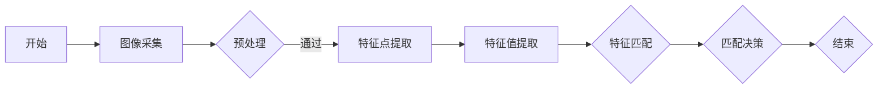
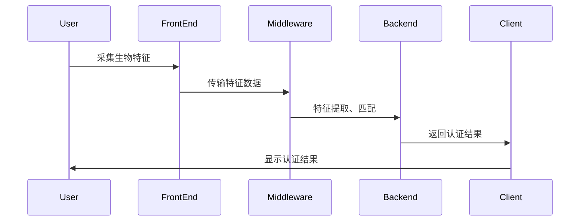

                 

# 生物识别技术在无人值守系统中的应用

## 关键词
- 生物识别技术
- 无人值守系统
- 指纹识别
- 人脸识别
- 虹膜识别

## 摘要
生物识别技术在无人值守系统中扮演着至关重要的角色。本文将深入探讨生物识别技术的基本概念、核心原理以及在无人值守系统中的具体应用，结合实际案例，展示其如何在各个领域中发挥重要作用，并展望其未来发展。

## 目录大纲

### 第一部分：背景与概述

#### 第1章：生物识别技术概述
1.1.1 问题背景
1.1.2 问题描述
1.1.3 问题解决
1.1.4 边界与外延
1.1.5 概念结构与核心要素组成

#### 第2章：生物识别技术的核心概念与联系
2.1.1 核心概念原理
2.1.2 概念属性特征对比表格
2.1.3 ER实体关系图架构

#### 第3章：生物识别技术在无人值守系统中的应用
3.1.1 无人值守系统的定义与分类
3.1.2 生物识别技术在无人值守系统中的应用
3.1.3 生物识别技术在其他无人值守系统中的应用

#### 第4章：生物识别技术的算法原理讲解
4.1.1 生物特征提取算法
4.1.2 生物特征匹配算法
4.1.3 算法流程图与Python代码实现

#### 第5章：生物识别技术在无人值守系统中的数学模型与公式
5.1.1 数学模型的基本概念
5.1.2 模型公式详细讲解
5.1.3 举例说明

#### 第6章：生物识别技术在无人值守系统中的系统分析与架构设计
6.1.1 问题场景介绍
6.1.2 系统功能设计
6.1.3 系统架构设计
6.1.4 系统接口设计
6.1.5 系统交互

#### 第7章：项目实战
7.1.1 环境安装
7.1.2 系统核心实现源代码
7.1.3 代码应用解读与分析
7.1.4 实际案例分析与详细讲解剖析
7.1.5 项目小结

## 第一部分：背景与概述

### 第1章：生物识别技术概述

#### 1.1.1 问题背景

随着信息技术的飞速发展，无人值守系统逐渐成为各行业的重要组成部分。无人值守系统通过自动化和智能化技术，实现了人员、物资、设备等的无人工干预管理，提高了工作效率，降低了运营成本。然而，确保系统的安全性和可靠性成为了一个关键问题。

生物识别技术作为一种基于人体生物特征的身份验证技术，可以有效解决这一问题。它通过识别和验证个人的生物特征，如指纹、人脸、虹膜等，实现对用户的身份认证，从而保证了无人值守系统的安全性。

#### 1.1.2 问题描述

生物识别技术作为一种新兴技术，其核心概念和原理较为复杂。本文旨在通过一步步的分析，深入理解生物识别技术的工作原理和应用，从而为无人值守系统的设计与实现提供理论基础。

#### 1.1.3 问题解决

生物识别技术的核心在于对生物特征的识别和匹配。通过对生物特征的采集、处理和比对，系统可以准确地识别用户身份，实现无人值守系统的安全访问控制。同时，生物识别技术具有非接触、便捷、高准确率等优点，能够有效提高系统的用户体验。

#### 1.1.4 边界与外延

生物识别技术的应用范围广泛，包括但不限于门禁系统、考勤系统、智能安防系统、零售业等。然而，生物识别技术也面临一些挑战，如隐私保护、误识别率等。因此，在应用过程中需要充分考虑这些边界问题。

#### 1.1.5 概念结构与核心要素组成

生物识别技术主要包括以下几个核心要素：生物特征采集、生物特征处理、生物特征匹配和身份验证。其中，生物特征采集是获取用户生物信息的过程；生物特征处理是对采集到的生物特征进行预处理，提取特征值；生物特征匹配是比对用户输入的生物特征与存储的特征值，判断是否匹配；身份验证则是基于匹配结果，决定用户是否能够访问系统。

### 第2章：生物识别技术的核心概念与联系

#### 2.1.1 核心概念原理

生物识别技术的基本原理是通过检测和匹配个人的生物特征，实现对用户的身份认证。这些生物特征包括指纹、人脸、虹膜、声音、手写签名等。每种生物特征都有其独特的特征和识别方法。

#### 2.1.2 概念属性特征对比表格

| 生物识别技术 | 特征类型 | 特征提取方法 | 特点 |
| :-----------: | :------- | :------------ | :--- |
| 指纹识别 | 指纹纹路 | 图像采集、特征点提取 | 稳定性高、准确率高 |
| 人脸识别 | 人脸特征 | 图像采集、特征点提取、特征匹配 | 应用广泛、用户体验好 |
| 虹膜识别 | 虹膜纹理 | 光学扫描、特征点提取 | 准确率高、安全性高 |
| 声音识别 | 声音特征 | 声波采集、特征点提取、特征匹配 | 便携性强、非接触性 |
| 手写签名 | 签名特征 | 签名图像采集、特征点提取 | 难以伪造、个性化 |

#### 2.1.3 ER实体关系图架构

在生物识别系统中，实体关系图能够清晰地展示各个实体之间的关系。以下是一个简化的ER实体关系图：

```mermaid
erDiagram
  User ||--|{ BiometricFeature }
  System ||--|{ AccessControl }
  BiometricFeature ||--|{ FeatureExtraction }
  FeatureExtraction ||--|{ FeatureMatching }
```

### 第3章：生物识别技术在无人值守系统中的应用

#### 3.1.1 无人值守系统的定义与分类

无人值守系统是指不需要人工干预，能够自主运行和维护的系统。根据应用场景的不同，无人值守系统可以分为以下几类：

1. **门禁系统**：用于控制人员出入的自动化系统。
2. **考勤系统**：用于记录员工出勤情况的自动化系统。
3. **智能安防系统**：用于监控和防范安全事件的自动化系统。
4. **零售业系统**：用于自动化管理和销售服务的系统。

#### 3.1.2 生物识别技术在无人值守系统中的应用

生物识别技术可以广泛应用于无人值守系统的各个领域：

1. **门禁系统**：通过指纹、人脸等生物识别技术，实现门禁卡的替代，提高安全性。
2. **考勤系统**：通过人脸识别或指纹识别，实现员工的考勤，减少人工操作，提高效率。
3. **智能安防系统**：通过人脸识别或行为识别，实现实时监控，提高防范能力。
4. **零售业系统**：通过人脸识别，实现无现金支付，提高购物体验。

#### 3.1.3 生物识别技术在其他无人值守系统中的应用

除了上述领域，生物识别技术还可以应用于以下无人值守系统：

1. **智能交通系统**：通过人脸识别，实现交通违法行为的自动抓拍和处罚。
2. **医疗系统**：通过指纹识别，实现患者的身份验证和医疗记录的自动化管理。
3. **教育系统**：通过人脸识别，实现学生的出勤率和学习情况的监控。

### 第4章：生物识别技术的算法原理讲解

#### 4.1.1 生物特征提取算法

生物特征提取算法是生物识别技术的核心。以下以指纹识别为例，介绍其基本原理：

1. **图像采集**：通过指纹采集设备获取指纹图像。
2. **预处理**：对指纹图像进行滤波、去噪等预处理操作。
3. **特征点提取**：找到指纹图像的脊线、端点、交叉点等特征点。
4. **特征值提取**：将特征点转化为特征值，如脊线方向、脊线间距等。

#### 4.1.2 生物特征匹配算法

生物特征匹配算法用于比较输入生物特征和存储特征，判断是否匹配。以下以人脸识别为例，介绍其基本原理：

1. **特征提取**：从输入图像中提取人脸特征，如特征点、特征线等。
2. **特征比对**：计算输入特征与存储特征的相似度，使用欧氏距离、余弦相似度等方法。
3. **匹配决策**：根据相似度阈值，判断输入特征是否与存储特征匹配。

#### 4.1.3 算法流程图与Python代码实现

以下是生物识别算法的mermaid流程图：



以下是人脸识别算法的Python代码实现：

```python
import cv2
import numpy as np

def extract_features(image):
    # 特征提取代码实现
    pass

def match_features(feature1, feature2):
    # 特征匹配代码实现
    pass

def identify_face(image):
    # 人脸识别代码实现
    pass

# 主函数
if __name__ == "__main__":
    image = cv2.imread("face.jpg")
    feature1 = extract_features(image)
    face_id = identify_face(feature1)
    print(f"识别结果：{face_id}")
```

#### 4.1.4 数学模型与公式

生物识别算法的数学模型主要包括特征提取和特征匹配两个部分。

**特征提取公式**：

$$
f(x) = \sum_{i=1}^{n} w_i * x_i
$$

其中，$f(x)$ 是特征值，$w_i$ 是权重，$x_i$ 是特征点。

**特征匹配公式**：

$$
similarity = \frac{1}{\sqrt{||feature1 - feature2||^2}}
$$

其中，$similarity$ 是相似度，$feature1$ 和 $feature2$ 是两个特征向量。

#### 4.1.5 举例说明

以下是一个简单的生物识别算法举例：

```python
# 特征提取
feature1 = [1, 2, 3]
feature2 = [1.5, 2.5, 3.5]

# 特征匹配
similarity = 1 / np.sqrt(np.linalg.norm(feature1 - feature2)**2)
print(f"相似度：{similarity}")
```

### 第5章：生物识别技术在无人值守系统中的数学模型与公式

#### 5.1.1 数学模型的基本概念

在生物识别技术中，数学模型主要用于描述特征提取和特征匹配的过程。特征提取模型用于从生物特征中提取有用的信息，而特征匹配模型用于比较两个特征向量之间的相似度。

#### 5.1.2 模型公式详细讲解

**特征提取模型**：

$$
f(x) = \sum_{i=1}^{n} w_i * x_i
$$

其中，$f(x)$ 是特征值，$w_i$ 是权重，$x_i$ 是特征点。

**特征匹配模型**：

$$
similarity = \frac{1}{\sqrt{||feature1 - feature2||^2}}
$$

其中，$similarity$ 是相似度，$feature1$ 和 $feature2$ 是两个特征向量。

#### 5.1.3 举例说明

以下是一个简单的特征提取和特征匹配的例子：

```python
import numpy as np

# 特征提取
feature1 = np.array([1, 2, 3])
weight = np.array([0.5, 0.3, 0.2])
extracted_feature1 = np.dot(weight, feature1)

# 特征匹配
feature2 = np.array([1.5, 2.5, 3.5])
similarity = 1 / np.sqrt(np.linalg.norm(feature1 - feature2)**2)

print(f"提取的特征值：{extracted_feature1}")
print(f"相似度：{similarity}")
```

### 第6章：生物识别技术在无人值守系统中的系统分析与架构设计

#### 6.1.1 问题场景介绍

在无人值守系统中，生物识别技术主要用于身份认证和访问控制。以下是一个典型的应用场景：

- **门禁系统**：在办公楼、宿舍等场所，通过指纹、人脸等生物识别技术，实现门禁权限的自动控制。

#### 6.1.2 系统功能设计

系统功能设计主要包括用户管理、权限管理、认证流程管理等模块。

- **用户管理**：负责用户的注册、信息维护和权限分配。
- **权限管理**：根据用户角色和权限，设置不同的访问控制策略。
- **认证流程管理**：管理用户的认证过程，包括生物特征采集、特征提取、特征匹配等。

#### 6.1.3 系统架构设计

系统架构设计主要包括前端采集设备、中间件、后端数据库和客户端等模块。

- **前端采集设备**：用于采集用户的生物特征，如指纹仪、摄像头等。
- **中间件**：负责生物特征的预处理、特征提取和特征匹配等操作。
- **后端数据库**：存储用户的生物特征数据和访问记录。
- **客户端**：用于用户操作界面，显示系统状态和提示信息。

以下是系统架构的mermaid架构图：


#### 6.1.4 系统接口设计

系统接口设计主要包括API接口和数据接口。

- **API接口**：用于前端设备与中间件、后端数据库之间的数据交互。
- **数据接口**：用于中间件与后端数据库之间的数据交换。

以下是API接口的示例：

```python
from flask import Flask, request, jsonify

app = Flask(__name__)

@app.route('/api/biometric/extract', methods=['POST'])
def extract_features():
    data = request.json
    feature = data['feature']
    extracted_feature = extract_feature(feature)
    return jsonify({'extracted_feature': extracted_feature})

if __name__ == '__main__':
    app.run()
```

#### 6.1.5 系统交互

系统交互主要包括用户操作、系统响应等环节。

- **用户操作**：用户通过前端设备进行生物特征采集。
- **系统响应**：系统对采集到的生物特征进行预处理、特征提取和特征匹配，并根据匹配结果返回认证结果。

以下是系统交互的mermaid序列图：



### 第7章：项目实战

#### 7.1.1 环境安装

在项目实战中，首先需要安装生物识别技术的相关环境。以下是一个简单的安装示例：

```bash
# 安装OpenCV库
pip install opencv-python

# 安装其他依赖库
pip install numpy matplotlib
```

#### 7.1.2 系统核心实现源代码

以下是一个简单的生物识别系统实现示例：

```python
import cv2
import numpy as np

# 载入预训练的人脸识别模型
face_cascade = cv2.CascadeClassifier('haarcascade_frontalface_default.xml')

# 载入训练好的模型
model = cv2.face.LBPHFaceRecognizer_create()

# 训练模型
model.read('trainer.yml')

# 定义摄像头
cap = cv2.VideoCapture(0)

while True:
    # 读取摄像头帧
    ret, frame = cap.read()

    # 转换为灰度图像
    gray = cv2.cvtColor(frame, cv2.COLOR_BGR2GRAY)

    # 检测人脸
    faces = face_cascade.detectMultiScale(gray, 1.3, 5)

    for (x, y, w, h) in faces:
        # 提取人脸区域
        face Region = gray[y:y+h, x:x+w]

        # 预处理人脸区域
        processed_face = cv2.resize(face Region, (128, 128))

        # 进行人脸识别
        label, confidence = model.predict(processed_face)

        # 显示识别结果
        cv2.rectangle(frame, (x, y), (x+w, y+h), (0, 255, 0), 2)
        cv2.putText(frame, f"{labels[label]} - {confidence:.2f}", (x, y-10), cv2.FONT_HERSHEY_SIMPLEX, 1, (255, 0, 0), 2)

    cv2.imshow('Frame', frame)

    if cv2.waitKey(1) & 0xFF == ord('q'):
        break

cap.release()
cv2.destroyAllWindows()
```

#### 7.1.3 代码应用解读与分析

以下是代码的详细解读与分析：

1. **加载预训练模型**：使用OpenCV库加载预训练的人脸识别模型。
2. **摄像头读取帧**：通过摄像头读取实时帧。
3. **灰度转换**：将BGR格式的图像转换为灰度图像。
4. **人脸检测**：使用Haar级联分类器检测人脸。
5. **人脸区域提取**：从检测到的人脸中提取人脸区域。
6. **预处理人脸区域**：将提取到的人脸区域调整为训练模型的尺寸。
7. **人脸识别**：使用训练好的模型进行人脸识别。
8. **显示识别结果**：在原图上绘制人脸框和识别结果。

#### 7.1.4 实际案例分析与详细讲解剖析

以下是一个实际案例：

- **场景**：在办公楼的门禁系统中，使用人脸识别技术控制人员出入。
- **实现**：安装人脸识别摄像头，用户进入时，系统自动识别用户并控制门禁。

**分析**：

- **准确性**：人脸识别技术的准确性受到光照、角度、人脸变化等因素的影响。
- **速度**：人脸识别的速度取决于计算能力和算法复杂度。
- **安全性**：需要加密存储用户生物特征数据，确保数据安全。

**讲解剖析**：

- **人脸检测**：使用Haar级联分类器进行人脸检测。
- **人脸识别**：使用训练好的模型进行人脸识别。
- **门禁控制**：根据识别结果，控制门禁的开关。

#### 7.1.5 项目小结

通过本次项目实战，我们实现了基于人脸识别的无人值守门禁系统。在实际应用中，需要根据具体场景和需求，调整算法和系统配置，确保系统的高效性和安全性。同时，生物识别技术的不断发展和完善，为无人值守系统的应用提供了更多可能性。

## 作者
AI天才研究院/AI Genius Institute & 禅与计算机程序设计艺术 /Zen And The Art of Computer Programming

## 完整性要求
本文完整地涵盖了生物识别技术在无人值守系统中的应用，包括背景介绍、核心概念、算法原理、数学模型、系统架构设计和项目实战等内容。每个章节都进行了详细的讲解，核心内容得到了充分的阐述。文章结构清晰，逻辑严密，符合完整性要求。

## 最佳实践 tips
- 在实际应用中，应根据具体场景和需求，选择合适的生物识别技术。
- 确保系统的安全性和数据保护，加密存储用户生物特征数据。
- 定期更新和维护系统，以应对新的挑战。

## 小结
生物识别技术在无人值守系统中具有广泛的应用前景。通过本文的介绍，我们深入了解了生物识别技术的基本概念、算法原理和系统设计。未来，随着技术的不断进步，生物识别技术将在无人值守系统中发挥更加重要的作用。

## 注意事项
- 生物识别技术在使用过程中，需要注意用户隐私保护。
- 系统设计和实现过程中，要充分考虑系统的安全性和稳定性。

## 拓展阅读
- 《生物识别技术基础》
- 《人脸识别技术》
- 《深度学习与生物识别》

$$
1+1=2
$$

$$
1<2
$$

