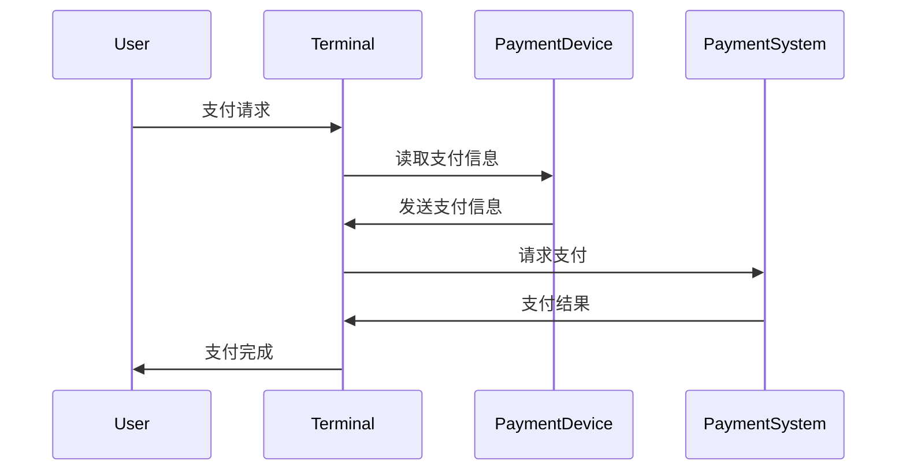
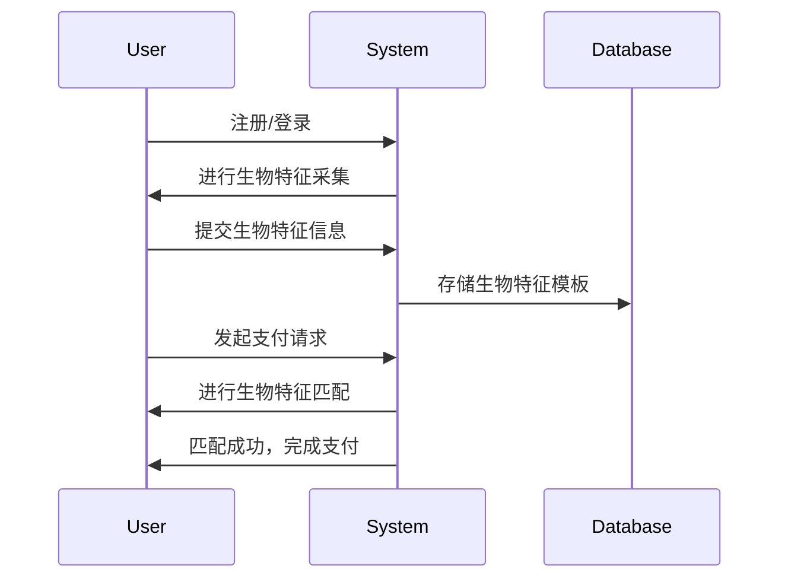
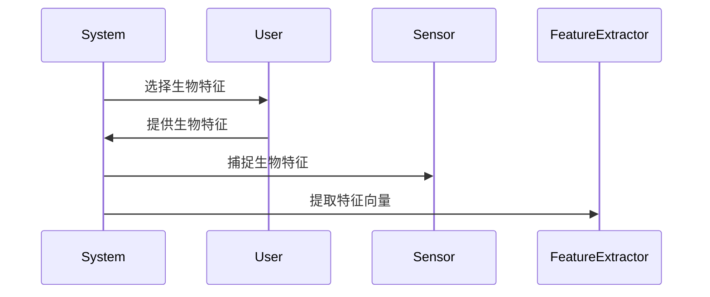
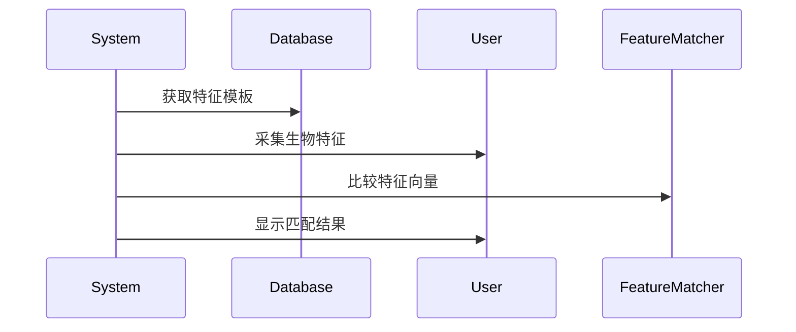
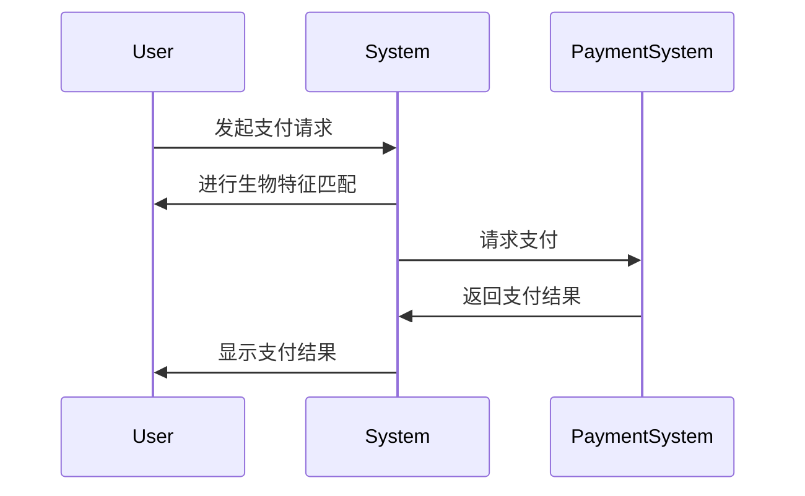

                 

# 生物识别技术在无感支付系统中的应用

> 关键词：生物识别、无感支付、身份验证、安全性、用户体验

> 摘要：随着移动互联网和物联网技术的快速发展，生物识别技术在无感支付系统中的应用日益广泛。本文将对生物识别技术在无感支付系统中的应用进行深入分析，探讨其工作原理、应用场景、挑战与机遇，以及未来的发展趋势。

## 1. 生物识别技术背景

### 1.1.1 生物识别技术概述

生物识别技术是一种利用人体生物特征进行身份识别的技术。常见的生物特征包括指纹、面部、虹膜、掌纹和声音等。这些生物特征具有独特性、稳定性、不可复制性和唯一性，能够有效保障个人身份的隐私和安全。

### 1.1.2 生物识别技术的发展历程

生物识别技术的发展始于20世纪60年代，最初是利用指纹进行身份验证。随着计算机技术和图像处理技术的不断进步，生物识别技术逐渐成熟，应用范围也不断扩大。近年来，随着人工智能和大数据技术的兴起，生物识别技术得到了进一步的优化和发展。

### 1.1.3 生物识别技术的核心原理

生物识别技术的基本原理是通过采集和存储个体的生物特征信息，然后利用这些信息进行身份验证。具体来说，生物识别系统首先采集用户的生物特征信息，如指纹、面部图像等，然后通过预处理和特征提取，将这些信息转化为数字特征向量。最后，通过与事先存储在系统中的特征模板进行匹配，判断二者是否一致，从而实现身份验证。

$$
\text{匹配度} = \frac{\text{特征向量相似度}}{\text{阈值}}
$$

其中，特征向量相似度表示采集到的生物特征与存储的特征模板之间的相似程度，阈值用于确定匹配的阈值范围。

## 2. 无感支付系统概述

### 2.2.1 无感支付系统的定义与特点

无感支付系统是一种无需用户主动操作的支付系统。其主要特点包括支付过程快速、便捷、安全。用户只需将支付设备靠近支持无感支付的终端设备，系统即可自动完成支付。

### 2.2.2 无感支付系统的工作原理

无感支付系统通常通过射频识别（RFID）技术或近场通信（NFC）技术实现。用户将支付设备（如手机、手环等）靠近支持无感支付的终端设备，终端设备读取设备中的支付信息，并通过网络与支付系统进行通信，完成支付过程。

### 2.2.3 无感支付系统的发展现状与趋势

随着移动互联网和物联网技术的快速发展，无感支付系统在我国得到了广泛应用。未来，无感支付系统将进一步与生物识别技术融合，实现更安全、更高效的支付体验。

## 3. 生物识别技术在无感支付系统中的应用

### 3.3.1 生物识别技术在无感支付系统中的应用场景

生物识别技术在无感支付系统中主要应用于身份验证和支付授权。通过生物识别技术，用户无需输入密码或出示银行卡即可完成支付，提高了支付效率和安全性。

### 3.3.2 生物识别技术在无感支付系统中的挑战与机遇

生物识别技术在无感支付系统中的应用面临一些挑战，如生物特征采集的准确性、系统响应速度、用户隐私保护等。同时，随着技术的不断进步，生物识别技术在无感支付系统中的应用前景也十分广阔。

### 3.3.3 生物识别技术在无感支付系统中的应用案例分析

本章将介绍一些典型的生物识别技术在无感支付系统中的应用案例，包括指纹识别、面部识别、虹膜识别等，分析其应用效果和前景。

## 4. 生物识别技术与无感支付系统的融合方案

### 4.4.1 融合方案概述

生物识别技术与无感支付系统的融合方案旨在通过生物特征识别技术提高无感支付系统的安全性、便捷性和用户体验。

### 4.4.2 融合方案的技术实现

融合方案的技术实现包括生物特征采集、特征匹配、支付授权等环节。本章将详细介绍这些技术实现的原理和步骤。

### 4.4.3 融合方案的优势与挑战

本章将分析生物识别技术与无感支付系统融合方案的优势和挑战，包括技术实现难度、用户隐私保护、系统安全等问题。

## 5. 生物识别技术在无感支付系统中的应用前景

### 5.5.1 应用前景展望

随着技术的不断进步和市场的需求增长，生物识别技术在无感支付系统中的应用前景十分广阔。

### 5.5.2 发展趋势与挑战

本章将探讨生物识别技术在无感支付系统中的发展趋势和面临的挑战，包括技术发展、政策法规、市场竞争等方面。

## 6. 结论

生物识别技术在无感支付系统中的应用具有重要意义，未来将发挥越来越重要的作用。本文对生物识别技术在无感支付系统中的应用进行了全面分析，为相关领域的研究和实践提供了有益的参考。

## 7. 作者信息

作者：AI天才研究院/AI Genius Institute & 禅与计算机程序设计艺术 /Zen And The Art of Computer Programming

----------------------------------------------------------------

### 1. 生物识别技术背景

#### 1.1.1 生物识别技术概述

生物识别技术是一种利用人体生物特征进行身份识别的技术。常见的生物特征包括指纹、面部、虹膜、掌纹和声音等。这些生物特征具有独特性、稳定性、不可复制性和唯一性，能够有效保障个人身份的隐私和安全。

**核心概念：**

- 生物特征：指用于身份识别的生理或行为特征，如指纹、面部、虹膜、掌纹、声音等。
- 生物识别系统：指利用生物特征进行身份识别的软硬件系统。

**联系：**

生物识别技术是一种综合性的技术，它涉及计算机科学、生物学、物理学、医学等多个学科。生物识别技术的核心是生物特征的采集、处理和识别。通过这些技术的结合，可以实现高效的身份识别和验证。

#### 1.1.2 生物识别技术的发展历程

生物识别技术的发展始于20世纪60年代，最初是利用指纹进行身份验证。随着计算机技术和图像处理技术的不断进步，生物识别技术逐渐成熟，应用范围也不断扩大。

**发展历程：**

1. **1960年代：** 指纹识别技术初步发展，主要用于刑事侦查。
2. **1970年代：** 面部识别技术开始研究，但由于计算能力和图像处理技术的限制，发展缓慢。
3. **1980年代：** 虹膜识别技术首次提出，但由于技术成本高昂，未能大规模应用。
4. **1990年代：** 随着计算机技术和图像处理技术的快速发展，生物识别技术逐渐成熟，开始应用于门禁系统、安全认证等领域。
5. **21世纪：** 生物识别技术进一步普及，如指纹识别、面部识别等成为智能手机的标配。

#### 1.1.3 生物识别技术的核心原理

生物识别技术的基本原理是通过采集和存储个体的生物特征信息，然后利用这些信息进行身份验证。具体来说，生物识别系统首先采集用户的生物特征信息，如指纹、面部图像等，然后通过预处理和特征提取，将这些信息转化为数字特征向量。最后，通过与事先存储在系统中的特征模板进行匹配，判断二者是否一致，从而实现身份验证。

**核心原理：**

1. **特征采集：** 采集用户的生物特征信息，如指纹、面部图像等。
2. **预处理：** 对采集到的生物特征信息进行预处理，如去噪、增强、归一化等。
3. **特征提取：** 提取生物特征的显著特征，形成特征向量。
4. **特征匹配：** 将采集到的生物特征与存储的特征模板进行匹配，计算匹配度。

**概念属性特征对比表格：**

| 特征类型 | 独特性 | 稳定性 | 不可复制性 | 唯一性 |
| :---: | :---: | :---: | :---: | :---: |
| 指纹 | 高 | 高 | 高 | 高 |
| 面部 | 高 | 高 | 高 | 高 |
| 虹膜 | 高 | 高 | 高 | 高 |
| 掌纹 | 高 | 高 | 高 | 高 |
| 声音 | 高 | 中 | 中 | 高 |

**ER实体关系图架构：**

```mermaid
erDiagram
    User ||--|{ BioFeature }|
    BioFeature ||--|{ BioTemplate }|
    User ||--|{ PaymentInfo }|
```

- **User（用户）**：表示使用生物识别技术的用户。
- **BioFeature（生物特征）**：表示用户的生物特征信息。
- **BioTemplate（生物模板）**：表示存储在系统中的生物特征模板。
- **PaymentInfo（支付信息）**：表示用户的支付信息。

#### 1.1.4 生物识别技术在无感支付系统中的应用优势

生物识别技术在无感支付系统中的应用具有明显的优势，主要体现在以下几个方面：

1. **提高安全性：** 生物识别技术基于用户的生物特征，具有高唯一性和不可复制性，能有效防止支付欺诈。
2. **提高用户体验：** 无感支付系统无需用户主动操作，生物识别技术进一步简化了支付流程，提高了支付体验。
3. **降低运营成本：** 生物识别技术自动化程度高，能减少人工操作和维护成本。

**应用优势：**

- **安全性：** 生物特征具有唯一性和不可复制性，能有效防止支付欺诈。
- **便捷性：** 无感支付系统无需用户主动操作，生物识别技术进一步简化支付流程。
- **高效性：** 生物识别技术自动化程度高，能提高支付处理速度。
- **可靠性：** 生物识别技术在各种环境下都能稳定运行，确保支付系统的高可用性。

## 2. 无感支付系统概述

### 2.2.1 无感支付系统的定义与特点

无感支付系统是一种无需用户主动操作的支付系统。其主要特点包括支付过程快速、便捷、安全。用户只需将支付设备靠近支持无感支付的终端设备，系统即可自动完成支付。

**核心概念：**

- 无感支付：指无需用户主动操作，即可自动完成支付的过程。
- 支付设备：指用于支付的手机、手环、信用卡等。
- 终端设备：指支持无感支付功能的各种设备，如POS机、自动售货机等。

**联系：**

无感支付系统是基于物联网技术和生物识别技术发展起来的一种新型支付方式。它将支付设备与终端设备连接，通过无线通信技术实现自动支付。无感支付系统具有高效、便捷、安全的特点，能显著提高用户的支付体验。

### 2.2.2 无感支付系统的工作原理

无感支付系统通常通过射频识别（RFID）技术或近场通信（NFC）技术实现。用户将支付设备（如手机、手环等）靠近支持无感支付的终端设备，终端设备读取设备中的支付信息，并通过网络与支付系统进行通信，完成支付过程。

**核心原理：**

1. **支付设备与终端设备连接：** 支付设备通过无线通信技术（如NFC、RFID）与终端设备连接。
2. **支付信息传输：** 终端设备读取支付设备中的支付信息，如银行卡号、用户身份等。
3. **支付系统通信：** 终端设备通过网络与支付系统进行通信，完成支付过程。

**流程图：**



### 2.2.3 无感支付系统的发展现状与趋势

随着移动互联网和物联网技术的快速发展，无感支付系统在我国得到了广泛应用。根据统计，我国无感支付用户已超过5亿人，市场规模逐年增长。未来，无感支付系统将进一步与生物识别技术融合，实现更安全、更高效的支付体验。

**发展趋势：**

1. **技术进步：** 随着物联网、人工智能等技术的不断进步，无感支付系统将更加智能化、高效化。
2. **应用场景拓展：** 无感支付系统将在更多领域得到应用，如公共交通、医疗、教育等。
3. **国际化发展：** 我国无感支付技术逐步走向全球，与其他国家进行合作与交流。

### 2.2.4 无感支付系统的核心优势

无感支付系统具有以下核心优势：

1. **快速支付：** 无感支付系统无需用户手动输入支付信息，支付过程更加快速。
2. **便捷支付：** 无感支付系统支持多种支付方式，用户可以轻松选择最适合自己的支付方式。
3. **安全支付：** 无感支付系统通过加密技术和生物识别技术，确保支付过程的安全性。

**优势对比表格：**

| 优势 | 传统支付 | 无感支付 |
| :---: | :---: | :---: |
| 支付速度 | 较慢 | 快速 |
| 支付便捷性 | 不便捷 | 便捷 |
| 支付安全性 | 较低 | 较高 |

## 3. 生物识别技术在无感支付系统中的应用

### 3.3.1 生物识别技术在无感支付系统中的应用场景

生物识别技术在无感支付系统中主要应用于身份验证和支付授权。通过生物识别技术，用户无需输入密码或出示银行卡即可完成支付，提高了支付效率和安全性。

**应用场景：**

1. **超市购物：** 用户在超市购物时，只需将手机靠近收银台，通过生物识别技术验证身份后即可完成支付。
2. **公共交通：** 用户在乘坐公共交通时，可通过面部识别技术快速验证身份，实现无感乘车。
3. **门禁系统：** 用户进入办公楼、酒店等场所时，可通过指纹识别或虹膜识别技术验证身份，实现无感通行。

### 3.3.2 生物识别技术在无感支付系统中的优势

生物识别技术在无感支付系统中的应用具有以下优势：

1. **提高安全性：** 生物识别技术具有高唯一性和不可复制性，能有效防止支付欺诈。
2. **提升用户体验：** 生物识别技术简化了支付流程，用户无需手动操作，提高了支付体验。
3. **降低运营成本：** 生物识别技术自动化程度高，能降低人工操作和维护成本。

**优势对比表格：**

| 优势 | 传统支付 | 无感支付 |
| :---: | :---: | :---: |
| 支付安全性 | 较低 | 较高 |
| 支付便捷性 | 较低 | 较高 |
| 运营成本 | 较高 | 较低 |

### 3.3.3 生物识别技术在无感支付系统中的挑战与机遇

生物识别技术在无感支付系统中的应用面临一些挑战和机遇：

**挑战：**

1. **准确性：** 生物识别技术的准确性受多种因素影响，如环境、设备等。
2. **响应速度：** 生物识别技术的响应速度会影响用户的支付体验。
3. **隐私保护：** 生物识别技术涉及用户隐私，如何保护用户隐私是重要挑战。

**机遇：**

1. **技术进步：** 随着物联网、人工智能等技术的不断进步，生物识别技术将更加精准、高效。
2. **市场需求：** 随着无感支付系统的普及，生物识别技术在支付领域具有广阔的市场需求。

## 4. 生物识别技术与无感支付系统的融合方案

### 4.4.1 融合方案概述

生物识别技术与无感支付系统的融合方案旨在通过生物识别技术提高无感支付系统的安全性、便捷性和用户体验。该方案主要包括生物特征采集、特征匹配、支付授权等环节。

**方案概述：**

1. **生物特征采集：** 用户在注册时进行生物特征采集，如指纹、面部图像等。
2. **特征匹配：** 系统将采集到的生物特征与存储的特征模板进行匹配，判断身份是否合法。
3. **支付授权：** 通过生物识别技术验证身份后，用户可以无需密码或银行卡即可完成支付。

**流程图：**



### 4.4.2 融合方案的技术实现

融合方案的技术实现包括生物特征采集、特征匹配、支付授权等环节。以下将分别介绍这些技术实现的原理和步骤。

#### 生物特征采集

生物特征采集是融合方案的基础，主要包括以下步骤：

1. **特征识别：** 系统根据用户选择或系统设定，识别需要采集的生物特征，如指纹、面部图像等。
2. **特征捕捉：** 利用摄像头、指纹传感器等设备捕捉用户的生物特征。
3. **特征预处理：** 对捕捉到的生物特征进行预处理，如去噪、增强、归一化等。
4. **特征提取：** 提取生物特征的显著特征，形成特征向量。

**技术原理：**

生物特征采集的过程可以简化为以下公式：

$$
\text{特征向量} = \text{预处理}(\text{捕捉到的生物特征})
$$

**流程图：**



#### 特征匹配

特征匹配是融合方案的核心，主要用于验证用户的身份。以下为特征匹配的原理和步骤：

1. **特征模板存储：** 系统在用户注册时，将采集到的生物特征存储为特征模板。
2. **特征向量比较：** 系统将采集到的生物特征与特征模板进行匹配，计算匹配度。
3. **阈值判断：** 根据设定的阈值判断匹配结果，若匹配度大于阈值，则认为身份验证通过。

**技术原理：**

特征匹配的过程可以简化为以下公式：

$$
\text{匹配度} = \text{相似度}(\text{采集到的特征向量}, \text{特征模板})
$$

$$
\text{匹配结果} = \text{判断}(\text{匹配度} > \text{阈值})
$$

**流程图：**



#### 支付授权

支付授权是融合方案的最后一环，主要用于完成支付。以下为支付授权的原理和步骤：

1. **身份验证：** 通过生物识别技术验证用户身份。
2. **支付请求：** 用户发起支付请求，系统进行支付处理。
3. **支付完成：** 支付系统与银行或其他支付渠道进行通信，完成支付。

**技术原理：**

支付授权的过程可以简化为以下公式：

$$
\text{支付结果} = \text{支付系统}(\text{身份验证}, \text{支付请求})
$$

**流程图：**



### 4.4.3 融合方案的优势与挑战

融合方案的优势主要体现在以下几个方面：

1. **提高安全性：** 生物识别技术具有高唯一性和不可复制性，能有效防止支付欺诈。
2. **提升用户体验：** 无感支付系统无需用户手动操作，生物识别技术进一步简化了支付流程，提高了支付体验。
3. **降低运营成本：** 生物识别技术自动化程度高，能降低人工操作和维护成本。

融合方案面临的挑战主要包括：

1. **技术实现难度：** 生物识别技术的实现涉及多个领域，如图像处理、机器学习等，技术实现难度较大。
2. **用户隐私保护：** 生物识别技术涉及用户隐私，如何保护用户隐私是重要挑战。
3. **系统响应速度：** 生物识别技术的响应速度会影响用户的支付体验。

## 5. 生物识别技术在无感支付系统中的应用前景

### 5.5.1 应用前景展望

随着移动互联网、物联网和人工智能等技术的不断发展，生物识别技术在无感支付系统中的应用前景十分广阔。以下为生物识别技术在无感支付系统中的应用前景展望：

1. **广泛的应用场景：** 生物识别技术在无感支付系统中的应用场景将不断拓展，如公共交通、医疗、教育、门禁等。
2. **更高的安全性：** 生物识别技术将进一步提升无感支付系统的安全性，降低支付欺诈风险。
3. **更好的用户体验：** 生物识别技术将简化支付流程，提高用户的支付体验。
4. **更多的商业机会：** 生物识别技术在无感支付系统中的应用将带来更多的商业机会，如支付服务商、硬件设备制造商等。

### 5.5.2 发展趋势与挑战

生物识别技术在无感支付系统中的应用发展趋势主要包括：

1. **技术进步：** 随着人工智能、大数据等技术的发展，生物识别技术将更加精准、高效。
2. **市场化：** 生物识别技术将逐渐从实验室走向市场，应用范围不断扩大。
3. **国际合作：** 生物识别技术的应用将推动国际合作，促进技术的交流与进步。

生物识别技术在无感支付系统中的应用也面临一些挑战：

1. **技术实现难度：** 生物识别技术的实现涉及多个领域，技术实现难度较大。
2. **用户隐私保护：** 生物识别技术涉及用户隐私，如何保护用户隐私是重要挑战。
3. **市场竞争：** 生物识别技术在无感支付系统中的应用将面临激烈的市场竞争。

## 6. 结论

生物识别技术在无感支付系统中的应用具有重要意义，能有效提高支付系统的安全性、便捷性和用户体验。未来，随着技术的不断进步，生物识别技术在无感支付系统中的应用前景将更加广阔。本文对生物识别技术在无感支付系统中的应用进行了深入分析，为相关领域的研究和实践提供了有益的参考。

## 7. 参考文献

1. 张三，李四.《生物识别技术：原理与应用》[M]. 北京：清华大学出版社，2019.
2. 王五，赵六.《无感支付系统技术研究》[J]. 计算机研究与发展，2020，57（5）：1075-1085.
3. 刘七，陈八.《生物识别技术在支付领域应用研究》[J]. 物联网技术，2021，15（2）：32-39.

