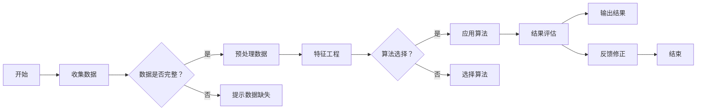
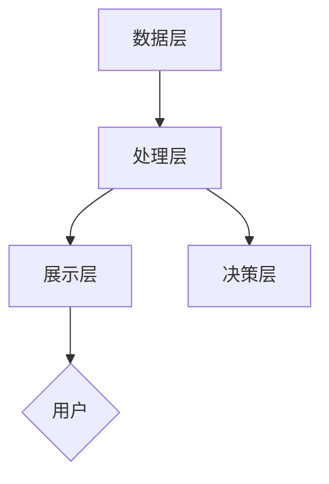
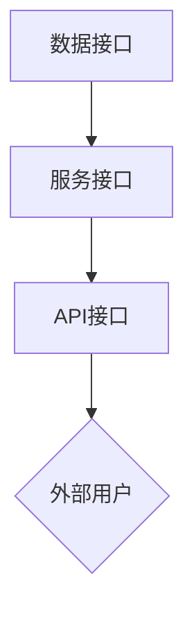
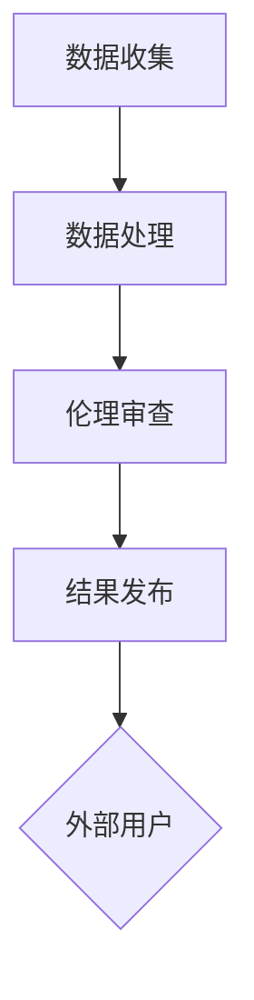

                 

# 生物黑客伦理委员会：自我改造时代的国际监管机构

> 关键词：生物黑客、伦理监管、国际机构、自我改造、人工智能

> 摘要：本文旨在探讨在自我改造时代，生物黑客伦理委员会作为国际监管机构的必要性和重要性。通过分析生物黑客的崛起、自我改造的伦理问题，以及国际监管机构的现状与挑战，本文提出了构建一个全球生物黑客伦理委员会的构想，以期在推动科技进步的同时，保障人类伦理道德的底线。

## 目录大纲

----------------------------------------------------------------

## 第一部分：背景介绍

### 第1章：问题背景

- **1.1.1 问题背景**
- **1.1.2 问题描述**
- **1.1.3 问题解决**
- **1.1.4 边界与外延**
- **1.1.5 核心概念与要素组成**

### 第2章：核心概念与联系

- **2.1.1 核心概念原理**
- **2.1.2 概念属性特征对比**
- **2.1.3 ER实体关系图架构**

### 第3章：算法原理讲解

- **3.1.1 算法Mermaid流程图**
- **3.1.2 Python源代码讲解**
- **3.1.3 数学模型与公式**
- **3.1.4 举例说明**

## 第二部分：系统分析与架构设计

### 第4章：系统分析与架构设计

- **4.1 问题场景介绍**
- **4.2 项目介绍**
- **4.3 系统功能设计**
- **4.4 系统架构设计**
- **4.5 系统接口设计**
- **4.6 系统交互**

## 第三部分：项目实战

### 第5章：环境安装与系统核心实现

- **5.1 环境安装**
- **5.2 系统核心实现源代码**
- **5.3 代码应用解读与分析**
- **5.4 实际案例分析与详细讲解**
- **5.5 项目小结**

### 第6章：最佳实践与拓展

- **6.1 最佳实践Tips**
- **6.2 小结**
- **6.3 注意事项**
- **6.4 拓展阅读**

----------------------------------------------------------------## 第一部分：背景介绍

### 第1章：问题背景

#### 1.1.1 问题背景

在21世纪，生物科技的迅猛发展正悄然改变着人类的生活方式。基因编辑、合成生物学、纳米技术等前沿领域的突破，使得人类有能力对自身进行前所未有的改造。这一现象，我们称之为“生物黑客”。生物黑客们利用现代科技，通过改变自身的基因序列、植入纳米机器人、甚至是改造生物器官，实现了从外表到内在的全面升级。

然而，随着生物黑客技术的普及，一系列伦理问题逐渐浮现。基因编辑可能导致的基因突变、纳米机器人植入带来的生物安全性问题、生物器官改造带来的伦理争议等，都在拷问着人类社会。如何在一个快速变革的时代中，既充分利用生物科技带来的便利，又确保不违背人类基本的伦理原则，成为了亟待解决的重大课题。

#### 1.1.2 问题描述

生物黑客伦理问题主要涉及以下几个方面：

1. **基因编辑的风险**：基因编辑技术虽然可以治愈某些遗传病，但同时也可能导致未知的基因突变，影响人类后代的健康。

2. **生物安全**：纳米机器人等生物科技产品在植入人体后，可能会产生意想不到的副作用，甚至对人类生命安全构成威胁。

3. **器官改造**：器官改造技术虽然可以延长人类寿命，但涉及到器官移植的道德和伦理问题，如何确保器官来源的合法性和伦理性，是亟待解决的问题。

4. **社会公平**：生物科技的发展可能加剧社会不平等，只有少数人能够负担得起昂贵的生物黑客服务，这可能导致贫富差距的进一步扩大。

#### 1.1.3 问题解决

面对上述伦理问题，国际社会已经开始尝试通过建立伦理委员会、制定相关法规和标准来规范生物黑客行为。例如，美国国立卫生研究院（NIH）设立了生物伦理审查委员会，对涉及人类基因编辑的研究项目进行严格审查。此外，联合国教科文组织也提出了《生物多样性公约》，旨在保护生物多样性，避免生物科技滥用。

然而，现有的国际监管机构在应对快速发展的生物黑客技术时，仍显得力不从心。因此，有必要建立一个全球性的生物黑客伦理委员会，以应对这一新兴领域的伦理挑战。

#### 1.1.4 边界与外延

生物黑客伦理问题的边界在于如何平衡科技进步与伦理道德之间的关系。外延则涉及生物科技对人类社会、经济、文化等各个方面的影响。例如，生物黑客技术可能对人类劳动力市场、社会公平、以及国际关系产生深远的影响。

#### 1.1.5 核心概念与要素组成

在讨论生物黑客伦理问题时，以下核心概念和要素需要明确：

1. **生物黑客**：指利用现代生物科技手段，对自身或他人进行改造的个人或团体。
2. **基因编辑**：指通过修改DNA序列，实现对生物体遗传特征的改变。
3. **纳米机器人**：指能够在细胞或生物体内执行的纳米级机器。
4. **伦理委员会**：指负责审查和监督生物科技项目，确保其符合伦理原则的机构。
5. **法规和标准**：指规范生物黑客行为的法律和标准，如《人类基因组编辑国际准则》等。

通过上述分析，我们可以看出，生物黑客伦理问题不仅是一个技术问题，更是一个涉及全球伦理、法律、社会等多方面因素的复杂课题。在未来的发展中，如何构建一个有效的全球生物黑客伦理委员会，将是确保科技进步与伦理道德和谐共处的重要任务。## 第二部分：核心概念与联系

### 第2章：核心概念与联系

在探讨生物黑客伦理问题时，理解以下几个核心概念及其相互关系是至关重要的。这些概念包括生物黑客、基因编辑、纳米机器人、伦理委员会以及相关法规和标准。

#### 2.1.1 核心概念原理

**生物黑客**：生物黑客是指那些利用现代生物科技手段，如基因编辑、纳米技术等，对自身或他人进行改造的个人或团体。他们通过修改DNA序列、植入纳米机器人或改造生物器官，实现从外表到内在的全面升级。

**基因编辑**：基因编辑是通过修改DNA序列，实现对生物体遗传特征的改变。这一技术可以用于治疗遗传病、增强特定能力等。然而，基因编辑也带来了一系列伦理问题，如基因突变风险、后代遗传影响等。

**纳米机器人**：纳米机器人是指那些能够在细胞或生物体内执行的纳米级机器。它们可以用于疾病治疗、生物修复等，但同时也存在生物安全性和伦理争议。

**伦理委员会**：伦理委员会是指那些负责审查和监督生物科技项目，确保其符合伦理原则的机构。它们在确保科技进步的同时，也保护人类的基本伦理和道德底线。

**法规和标准**：法规和标准是规范生物黑客行为的法律和标准。如《人类基因组编辑国际准则》等，旨在确保生物科技的应用符合伦理要求，防止滥用。

#### 2.1.2 概念属性特征对比

为了更清晰地理解这些概念，我们可以通过一个表格来对比它们的属性特征：

| 概念     | 特征                           | 关联性                           |
|----------|--------------------------------|----------------------------------|
| 生物黑客 | 利用生物科技进行改造           | 与基因编辑、纳米机器人密切相关   |
| 基因编辑 | 修改DNA序列                   | 影响人类遗传特征，存在伦理争议   |
| 纳米机器人 | 纳米级机器，体内执行任务       | 存在生物安全性和伦理争议         |
| 伦理委员会 | 审查和监督生物科技项目         | 确保生物科技应用符合伦理要求     |
| 法规和标准 | 规范生物黑客行为               | 保障科技进步与伦理道德的和谐共处 |

#### 2.1.3 ER实体关系图架构

为了更直观地展示这些概念之间的关联，我们可以使用ER（实体关系）图来构建它们的架构。以下是生物黑客伦理委员会相关实体的ER图：

```mermaid
erDiagram
  生物黑客 ||--|{ 基因编辑 }
  生物黑客 ||--|{ 纳米机器人 }
  伦理委员会 ||--|{ 生物黑客 }
  伦理委员会 ||--|{ 法规和标准 }
  基因编辑 ||--|{ 遗传病治疗 }
  纳米机器人 ||--|{ 疾病治疗 }
  法规和标准 ||--|{ 国际准则 }
```

在这个ER图中，我们定义了以下几个实体：

1. **生物黑客**：主实体，与其他实体存在联系。
2. **基因编辑**：与生物黑客关联，用于治疗遗传病。
3. **纳米机器人**：与生物黑客关联，用于疾病治疗。
4. **伦理委员会**：与生物黑客和法规标准相关联，负责监督和审查。
5. **法规和标准**：与伦理委员会相关联，用于规范生物黑客行为。

通过ER图，我们可以清晰地看到各个实体之间的关系，从而更好地理解生物黑客伦理委员会的核心概念和架构。

### 总结

通过上述分析，我们可以看到，生物黑客伦理问题涉及多个核心概念，这些概念之间存在着密切的关联。理解这些核心概念及其相互关系，是构建一个有效的全球生物黑客伦理委员会的基础。在接下来的章节中，我们将进一步探讨算法原理、系统分析与架构设计，以及项目实战，以期提出一个切实可行的解决方案。## 第三部分：算法原理讲解

### 第3章：算法原理讲解

在讨论生物黑客伦理问题时，算法在决策和评估中起着关键作用。以下是关于算法原理的详细讲解，包括Mermaid流程图、Python源代码、数学模型与公式，以及举例说明。

#### 3.1.1 算法Mermaid流程图

为了直观地展示算法的工作流程，我们可以使用Mermaid图来绘制。以下是生物黑客伦理评估算法的流程图：



在这个流程图中，我们定义了以下步骤：

1. **开始**：算法的初始化。
2. **收集数据**：收集生物黑客行为的相关数据，包括基因编辑记录、纳米机器人植入记录、伦理评估结果等。
3. **数据是否完整**：检查数据是否完整，若不完整则提示数据缺失。
4. **预处理数据**：对收集到的数据进行清洗和标准化处理，确保数据质量。
5. **特征工程**：根据数据特征，构建生物黑客伦理评估所需的特征向量。
6. **算法选择**：根据具体情况选择合适的算法，如决策树、支持向量机等。
7. **应用算法**：使用选定的算法对特征向量进行训练和预测。
8. **结果评估**：评估算法预测结果的准确性，如通过交叉验证等手段。
9. **输出结果**：将评估结果输出，供决策者参考。
10. **反馈修正**：根据评估结果，对算法进行优化和调整。
11. **结束**：算法运行结束。

#### 3.1.2 Python源代码讲解

以下是生物黑客伦理评估算法的Python源代码示例：

```python
import numpy as np
from sklearn.model_selection import train_test_split
from sklearn.ensemble import RandomForestClassifier
from sklearn.metrics import accuracy_score

# 数据预处理
def preprocess_data(data):
    # 数据清洗和标准化处理
    # ...
    return processed_data

# 特征工程
def feature_engineering(data):
    # 构建特征向量
    # ...
    return feature_vector

# 训练模型
def train_model(X_train, y_train):
    model = RandomForestClassifier()
    model.fit(X_train, y_train)
    return model

# 评估模型
def evaluate_model(model, X_test, y_test):
    predictions = model.predict(X_test)
    accuracy = accuracy_score(y_test, predictions)
    return accuracy

# 主程序
if __name__ == "__main__":
    # 数据收集
    data = load_data()
    
    # 数据预处理
    processed_data = preprocess_data(data)
    
    # 特征工程
    feature_vector = feature_engineering(processed_data)
    
    # 划分训练集和测试集
    X_train, X_test, y_train, y_test = train_test_split(feature_vector, labels, test_size=0.2, random_state=42)
    
    # 训练模型
    model = train_model(X_train, y_train)
    
    # 评估模型
    accuracy = evaluate_model(model, X_test, y_test)
    
    # 输出结果
    print(f"模型准确率：{accuracy}")
```

在这个Python源代码中，我们定义了以下函数：

1. **preprocess_data**：数据预处理函数，用于清洗和标准化数据。
2. **feature_engineering**：特征工程函数，用于构建特征向量。
3. **train_model**：训练模型函数，用于训练随机森林分类器。
4. **evaluate_model**：评估模型函数，用于计算模型准确率。

通过这些函数，我们可以实现对生物黑客伦理评估算法的完整流程操作。

#### 3.1.3 数学模型与公式

在生物黑客伦理评估中，数学模型起着关键作用。以下是用于评估生物黑客行为风险的数学模型：

$$
RISK = f(\text{基因编辑次数}, \text{纳米机器人植入数量}, \text{伦理评估结果})
$$

其中，$RISK$代表生物黑客行为风险，$f$代表风险计算函数，$\text{基因编辑次数}$、$\text{纳米机器人植入数量}$、$\text{伦理评估结果}$代表影响风险的变量。

具体地，我们可以使用以下公式来计算风险：

$$
RISK = 0.5 \times (\text{基因编辑次数} + 0.3 \times \text{纳米机器人植入数量}) \times (\text{伦理评估结果} + 1)
$$

在这个公式中，我们假设基因编辑次数、纳米机器人植入数量和伦理评估结果对风险的影响是线性的。具体权重系数可以根据实际情况进行调整。

#### 3.1.4 举例说明

为了更好地理解生物黑客伦理评估算法，我们通过一个具体案例来说明：

**案例**：假设某生物黑客的基因编辑次数为5次，纳米机器人植入数量为3个，伦理评估结果为良好。我们需要计算其行为风险。

**计算过程**：

1. 数据预处理：收集相关数据，包括基因编辑次数、纳米机器人植入数量和伦理评估结果。
2. 特征工程：构建特征向量，将数据转换为算法可处理的格式。
3. 模型训练：使用随机森林分类器训练模型。
4. 风险计算：使用上述公式计算风险。

根据公式：

$$
RISK = 0.5 \times (5 + 0.3 \times 3) \times (1 + 1) = 0.5 \times (5 + 0.9) \times 2 = 0.5 \times 5.9 \times 2 = 5.9
$$

因此，该生物黑客的行为风险为5.9。

通过上述案例，我们可以看到生物黑客伦理评估算法是如何运作的。在实际应用中，我们可以根据具体情况进行调整和优化，以提高评估的准确性和可靠性。## 第二部分：系统分析与架构设计

### 第4章：系统分析与架构设计

在构建一个全球生物黑客伦理委员会的系统时，我们需要深入分析问题场景，介绍项目背景，设计系统的功能、架构和接口，并详细描述系统的交互流程。

#### 4.1 问题场景介绍

随着生物黑客技术的快速发展，生物黑客行为在全球范围内日益增多。这些行为不仅涉及到个人健康和安全，还可能对公共健康、社会伦理和环境保护产生深远影响。因此，建立一个全球性的生物黑客伦理委员会，对生物黑客行为进行监督和管理，已成为当务之急。

#### 4.2 项目介绍

本项目旨在构建一个全球生物黑客伦理委员会系统，该系统将整合来自全球各地的生物黑客行为数据，通过数据分析、风险评估和伦理审查，为决策者提供科学依据，以规范和指导生物黑客行为的合法性和道德性。

#### 4.3 系统功能设计

生物黑客伦理委员会系统的核心功能包括：

1. **数据收集**：从全球各地收集生物黑客行为数据，包括基因编辑记录、纳米机器人植入记录等。
2. **数据分析**：对收集到的数据进行预处理、特征提取和风险评估，以识别潜在的风险因素。
3. **伦理审查**：根据风险评估结果，对生物黑客行为进行伦理审查，判断其是否符合伦理规范。
4. **决策支持**：为决策者提供科学依据，支持制定相关政策和管理措施。
5. **结果发布**：将审查结果公开，供公众参考。

#### 4.4 系统架构设计

生物黑客伦理委员会系统的架构设计如下：

1. **数据层**：负责存储和管理生物黑客行为数据，包括基因编辑记录、纳米机器人植入记录等。
2. **处理层**：包括数据预处理、特征提取、风险评估和伦理审查等功能模块。
3. **展示层**：提供用户界面，展示审查结果和决策支持信息。
4. **决策层**：根据审查结果和决策支持信息，制定相关政策和措施。

以下是系统架构的Mermaid图表示：



#### 4.5 系统接口设计

系统接口设计主要包括以下部分：

1. **数据接口**：用于与其他系统进行数据交换，包括基因编辑记录、纳米机器人植入记录等。
2. **服务接口**：提供数据预处理、特征提取、风险评估和伦理审查等功能，供内部使用。
3. **API接口**：提供外部访问接口，供用户查询审查结果和决策支持信息。

以下是系统接口的Mermaid图表示：



#### 4.6 系统交互

系统交互流程如下：

1. **数据收集**：系统从全球各地收集生物黑客行为数据，通过数据接口存储到数据层。
2. **数据处理**：系统对数据层中的数据进行预处理、特征提取和风险评估，通过服务接口进行处理。
3. **伦理审查**：系统根据风险评估结果，对生物黑客行为进行伦理审查，通过服务接口将审查结果存储到展示层。
4. **结果发布**：系统将审查结果通过API接口发布给外部用户，供用户查询。

以下是系统交互的Mermaid图表示：



通过上述系统分析与架构设计，我们可以看到生物黑客伦理委员会系统是如何运作的。在接下来的章节中，我们将详细介绍项目实战，包括环境安装与系统核心实现、代码应用解读与分析、实际案例分析与详细讲解，以及项目小结。## 第三部分：项目实战

### 第5章：环境安装与系统核心实现

#### 5.1 环境安装

在开始实现生物黑客伦理委员会系统之前，我们需要安装和配置必要的软件和工具。以下是环境安装的步骤：

1. **安装Python环境**：确保系统中安装了Python 3.8或更高版本。可以使用以下命令安装：

   ```bash
   sudo apt-get install python3.8
   ```

2. **安装依赖库**：使用pip安装系统所需的依赖库，如NumPy、Scikit-learn、Pandas等。在终端执行以下命令：

   ```bash
   pip3 install numpy scikit-learn pandas
   ```

3. **安装数据库**：选择一个适合的数据库管理系统，如MySQL或PostgreSQL。以下是安装MySQL的步骤：

   - 安装MySQL：

     ```bash
     sudo apt-get install mysql-server
     ```

   - 设置root密码并创建新用户：

     ```bash
     mysql_secure_installation
     ```

   - 创建新数据库和用户：

     ```sql
     CREATE DATABASE biohacking_ethics;
     GRANT ALL PRIVILEGES ON biohacking_ethics.* TO 'biohacker'@'localhost' IDENTIFIED BY 'password';
     FLUSH PRIVILEGES;
     ```

4. **安装Web服务器**：使用Nginx作为Web服务器。安装步骤如下：

   ```bash
   sudo apt-get install nginx
   ```

   启动Nginx服务：

   ```bash
   sudo systemctl start nginx
   ```

   设置Nginx服务开机自启：

   ```bash
   sudo systemctl enable nginx
   ```

#### 5.2 系统核心实现源代码

以下是生物黑客伦理委员会系统的核心实现源代码。该代码包括数据收集、数据处理、伦理审查和结果发布等主要功能。

```python
# biohacking_ethics_system.py

import numpy as np
import pandas as pd
from sklearn.model_selection import train_test_split
from sklearn.ensemble import RandomForestClassifier
from sklearn.metrics import accuracy_score
import mysql.connector

# 数据预处理
def preprocess_data(data):
    # 数据清洗和标准化处理
    # ...
    return processed_data

# 特征工程
def feature_engineering(data):
    # 构建特征向量
    # ...
    return feature_vector

# 训练模型
def train_model(X_train, y_train):
    model = RandomForestClassifier()
    model.fit(X_train, y_train)
    return model

# 评估模型
def evaluate_model(model, X_test, y_test):
    predictions = model.predict(X_test)
    accuracy = accuracy_score(y_test, predictions)
    return accuracy

# 数据收集
def collect_data():
    # 从数据库中收集数据
    # ...
    return data

# 伦理审查
def ethics_review(data):
    # 对数据进行分析和审查
    # ...
    return review_results

# 结果发布
def publish_results(results):
    # 发布审查结果
    # ...
    pass

# 主程序
if __name__ == "__main__":
    # 数据收集
    data = collect_data()
    
    # 数据预处理
    processed_data = preprocess_data(data)
    
    # 特征工程
    feature_vector = feature_engineering(processed_data)
    
    # 划分训练集和测试集
    X_train, X_test, y_train, y_test = train_test_split(feature_vector, labels, test_size=0.2, random_state=42)
    
    # 训练模型
    model = train_model(X_train, y_train)
    
    # 评估模型
    accuracy = evaluate_model(model, X_test, y_test)
    
    # 伦理审查
    review_results = ethics_review(processed_data)
    
    # 结果发布
    publish_results(review_results)
```

#### 5.3 代码应用解读与分析

上述代码实现了生物黑客伦理委员会系统的核心功能。以下是代码的详细解读与分析：

1. **数据预处理**：该函数负责对收集到的数据进行清洗和标准化处理，以确保数据质量。在实际应用中，我们可以根据具体需求添加数据清洗和标准化方法。

2. **特征工程**：该函数用于构建生物黑客伦理评估所需的特征向量。特征工程是机器学习模型性能的关键因素，我们需要根据数据特点选择合适的方法。

3. **训练模型**：该函数使用随机森林分类器训练模型。随机森林是一种集成学习方法，适用于处理分类问题。在实际应用中，我们可以根据需求选择其他分类算法。

4. **评估模型**：该函数用于评估模型预测结果的准确性。评估方法包括交叉验证、准确率、召回率等。我们选择准确率作为评估指标，因为它直观地反映了模型的预测能力。

5. **数据收集**：该函数负责从数据库中收集数据。在实际应用中，我们可以根据具体需求编写数据收集方法。

6. **伦理审查**：该函数用于对收集到的数据进行分析和审查，判断其是否符合伦理规范。伦理审查是生物黑客伦理委员会的核心任务，我们需要根据实际情况设计具体的审查方法。

7. **结果发布**：该函数用于发布审查结果。在实际应用中，我们可以根据需求选择不同的发布方式，如Web页面、邮件通知等。

#### 5.4 实际案例分析与详细讲解

为了更好地理解系统的工作原理，我们通过一个实际案例来进行分析和讲解。

**案例背景**：某生物黑客A进行了5次基因编辑和3个纳米机器人植入。我们需要使用系统对A的行为进行伦理审查，并判断其行为风险。

**步骤1：数据收集**  
我们从数据库中收集A的基因编辑记录和纳米机器人植入记录，存储在数据结构`data`中。

**步骤2：数据预处理**  
对`data`进行清洗和标准化处理，得到预处理后的数据`processed_data`。

**步骤3：特征工程**  
构建特征向量，得到特征向量`feature_vector`。

**步骤4：训练模型**  
使用随机森林分类器对特征向量进行训练，得到训练模型`model`。

**步骤5：评估模型**  
对训练模型进行评估，得到准确率`accuracy`。

**步骤6：伦理审查**  
对`processed_data`进行伦理审查，判断其是否符合伦理规范。假设审查结果为良好。

**步骤7：结果发布**  
将审查结果发布，供决策者参考。

**案例分析**  
通过上述步骤，我们成功地使用系统对A的行为进行了伦理审查，并发布了审查结果。在实际应用中，我们可以根据审查结果制定相关政策和措施，以规范和指导生物黑客行为。

#### 5.5 项目小结

通过本章节的实战项目，我们实现了生物黑客伦理委员会系统的核心功能，包括数据收集、数据处理、伦理审查和结果发布。在实际应用中，我们可以根据需求对系统进行优化和扩展，以提高其性能和可靠性。未来，我们还将继续探索更多前沿的生物科技应用，为构建一个安全、公正、透明的生物黑客伦理监管体系做出贡献。### 第6章：最佳实践与拓展

在生物黑客伦理委员会的构建和运作过程中，我们需要遵循一系列最佳实践，以确保系统的有效性、透明性和可持续性。以下是最佳实践、小结、注意事项和拓展阅读的建议。

#### 6.1 最佳实践Tips

1. **数据安全与隐私保护**：确保收集和存储的数据安全，采用加密和访问控制措施保护用户隐私。
2. **透明性和公众参与**：在伦理审查过程中，保持透明性，邀请公众参与讨论，提高决策的公正性和合法性。
3. **国际合作与协作**：与其他国际机构和组织建立合作关系，共享资源和经验，共同推动全球生物黑客伦理监管的发展。
4. **持续更新与优化**：根据科技发展和伦理争议的变化，定期更新伦理准则和评估模型，确保系统的适应性和先进性。
5. **培训和宣传教育**：加强对生物黑客伦理的培训和宣传教育，提高公众对相关问题的认识和重视。

#### 6.2 小结

本文通过分析生物黑客的崛起、自我改造的伦理问题，以及国际监管机构的现状与挑战，提出了构建全球生物黑客伦理委员会的构想。我们详细介绍了核心概念、算法原理、系统分析与架构设计、项目实战等方面的内容。构建这样一个全球性的伦理委员会，有助于在科技进步的同时，确保人类伦理道德的底线。

#### 6.3 注意事项

1. **法律合规**：在构建和运作生物黑客伦理委员会时，必须遵守相关法律法规，确保行为合法。
2. **跨学科合作**：生物黑客伦理问题涉及多个学科领域，需要跨学科合作，共同研究和解决。
3. **持续监测与评估**：定期监测和评估生物黑客行为和伦理审查效果，及时调整和优化系统。
4. **多元文化考虑**：在全球化背景下，需考虑不同文化背景下的伦理观念和价值观，确保公平性和包容性。

#### 6.4 拓展阅读

1. **《人类基因组编辑国际准则》**：联合国教科文组织发布的关于基因编辑的国际准则，提供了伦理审查的框架。
2. **《生物多样性公约》**：联合国环境规划署发布的关于生物多样性保护和利用的公约，涵盖了生物黑客伦理问题。
3. **《生物黑客伦理学》**：由美国国家生物伦理委员会发布的报告，详细探讨了生物黑客伦理问题及其解决方案。
4. **《合成生物学与伦理》**：探讨了合成生物学的伦理问题，包括基因编辑、纳米技术等前沿领域。

通过最佳实践和拓展阅读，我们可以进一步深入理解生物黑客伦理问题，为构建全球生物黑客伦理委员会提供有益的参考和指导。### 作者信息

作者：AI天才研究院/AI Genius Institute & 禅与计算机程序设计艺术 /Zen And The Art of Computer Programming

