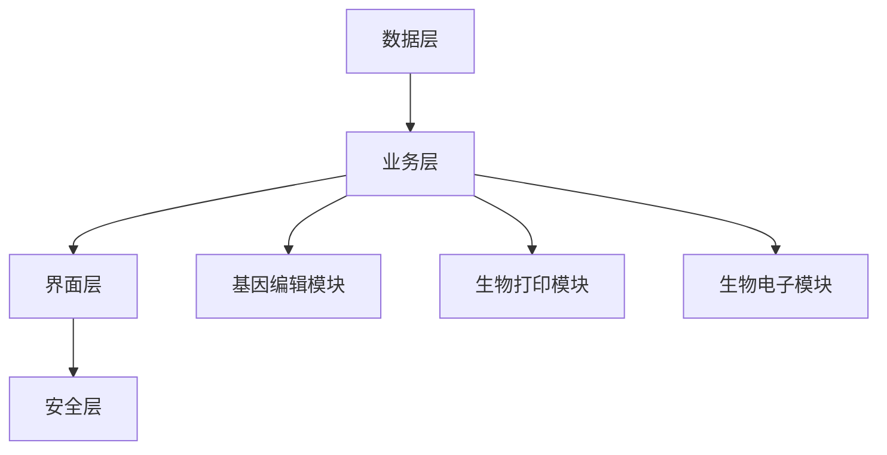
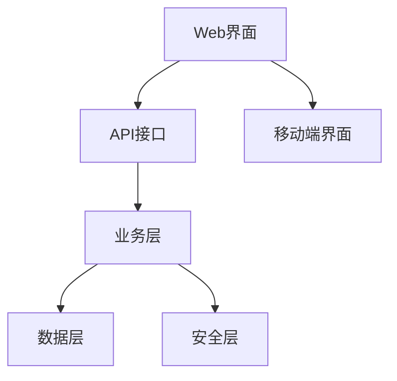

                 

## 文章标题：生物黑客伦理：自我改造的科技尝试

### 关键词：生物黑客、自我改造、伦理、科技、风险分析

### 摘要：
本文深入探讨生物黑客伦理与自我改造的科技尝试。首先，我们回顾了生物黑客的起源与发展，并定义了自我改造的概念。接着，我们分析了自我改造技术的原理、风险以及伦理问题，展示了它们与社会的关系。随后，我们通过实际案例详细讲解了自我改造技术的应用，并提供了最佳实践建议。文章最后展望了自我改造技术的未来发展趋势。

----------------------------------------------------------------

### 目录

----------------------------------------------------------------

## 第一部分：生物黑客与自我改造简介

### 第1章：生物黑客的起源与发展
#### 1.1 什么是生物黑客
#### 1.2 生物黑客的历史与发展
#### 1.3 自我改造在生物黑客中的角色

### 第2章：自我改造技术原理与风险
#### 2.1 自我改造技术概述
#### 2.2 基因编辑技术原理
#### 2.3 自我改造技术的风险与挑战
#### 2.4 自我改造技术的伦理问题

### 第3章：自我改造技术与社会
#### 3.1 自我改造技术的应用领域
#### 3.2 社会对自我改造技术的态度
#### 3.3 自我改造技术对社会的影响

### 第4章：生物黑客伦理案例分析
#### 4.1 案例一：基因编辑婴儿事件
#### 4.2 案例二：生物增强药物的争议
#### 4.3 案例三：自我改造社区的兴起

### 第5章：自我改造技术的系统分析与架构设计
#### 5.1 自我改造技术的系统需求分析
#### 5.2 自我改造技术的系统架构设计
#### 5.3 自我改造技术的接口设计与实现

### 第6章：自我改造项目实战
#### 6.1 环境安装与准备
#### 6.2 自我改造技术核心实现
#### 6.3 项目案例分析
#### 6.4 项目总结与展望

### 第7章：自我改造技术的最佳实践与未来展望
#### 7.1 自我改造技术的使用建议
#### 7.2 自我改造技术的注意事项
#### 7.3 自我改造技术的未来发展趋势

----------------------------------------------------------------

### 引言

在科技飞速发展的今天，生物黑客这一群体正悄然崛起。他们不仅对计算机技术有着深厚的了解，更将目光投向了生物学领域，试图通过科技手段对自我进行改造。自我改造，这一概念源于生物黑客群体，指的是通过基因编辑、生物电子、纳米技术等手段，改变自己的生理特征、提升身体机能，甚至改变意识与记忆。这种自我改造的科技尝试，不仅引发了科技界的广泛关注，也带来了前所未有的伦理挑战。

本文旨在深入探讨生物黑客伦理与自我改造的科技尝试。我们将首先介绍生物黑客的起源与发展，定义自我改造的概念，并分析其技术与风险。随后，我们将探讨自我改造技术在社会中的应用及其影响，并通过实际案例进行分析。最后，我们将提供自我改造技术的最佳实践与未来展望，以期为这一领域的健康发展提供一些指导。

### 第一部分：生物黑客与自我改造简介

### 第1章：生物黑客的起源与发展

#### 1.1 什么是生物黑客

生物黑客，又称生物工程师或生物科学家黑客，指的是那些对生物学、计算机科学、工程学等领域有着深厚理解和热情的人。他们通常拥有跨学科的知识背景，并善于将各种技术工具应用于生物领域的创新和突破。

生物黑客的起源可以追溯到20世纪70年代的计算机黑客文化。当时，计算机黑客们通过破解系统、开发新的软件和硬件，推动了计算机技术的发展。随着时间的推移，这一群体逐渐扩展到生物学领域，他们将计算机科学、工程学、生物学等学科的知识和工具结合起来，开展自我改造和生物工程研究。

生物黑客的目标通常是通过科技创新，提升自己的身体机能、认知能力，甚至改变自己的生理特征。他们相信，通过自我改造，可以突破人类的生理极限，实现更健康、更强大、更智能的个体。

#### 1.2 生物黑客的历史与发展

生物黑客的历史可以追溯到20世纪80年代，当时，计算机黑客文化开始渗透到生物学领域。一些计算机科学家开始关注生物信息学和基因工程，尝试将计算机技术应用于生物研究。

1990年代，随着基因编辑技术的发展，生物黑客开始尝试进行基因改造。1994年，世界上第一个基因编辑动物——转基因鼠诞生，标志着生物黑客开始进入实际应用阶段。

进入21世纪，生物黑客活动进一步扩展，他们不仅关注基因编辑，还开始探索生物电子、纳米技术等新兴领域。2003年，人类基因组计划的完成，使得生物黑客拥有了更丰富的基因信息资源，为他们的研究提供了有力支持。

近年来，生物黑客活动逐渐从学术实验室走向公众视野。随着3D打印、生物打印等技术的发展，生物黑客们开始尝试在家中进行自我改造实验，推动这一领域的发展。

#### 1.3 自我改造在生物黑客中的角色

自我改造在生物黑客中扮演着重要角色。它不仅是生物黑客追求的目标，也是他们探索和推动生物技术发展的动力。以下是自我改造在生物黑客中的几个关键角色：

1. **技术创新**：自我改造推动了生物技术的创新。生物黑客通过尝试不同的生物技术，如基因编辑、生物打印等，不断突破传统生物学的局限，推动技术的发展。

2. **伦理挑战**：自我改造引发了伦理挑战。生物黑客在追求自我改造的过程中，不可避免地触及到伦理问题，如基因编辑的道德边界、生物增强的公平性等。这些挑战促使社会对生物黑客活动进行更深入的反思和探讨。

3. **社会影响**：自我改造技术对社会产生了深远影响。生物黑客的实践活动引发了公众对生物技术的关注和讨论，促使政府、科研机构和社会组织对生物黑客活动进行规范和管理。

4. **跨学科合作**：自我改造需要跨学科的知识和技能。生物黑客通常具备计算机科学、生物学、工程学等多学科背景，他们通过跨学科合作，实现自我改造的目标。

总之，自我改造在生物黑客中具有多重角色，既是技术创新的驱动力，也是伦理挑战和社会影响的来源。随着生物技术的不断发展，自我改造在生物黑客中的地位和影响力将进一步增强。

#### 1.4 生物黑客与自我改造的核心概念与联系

在探讨生物黑客与自我改造的核心概念和联系时，我们首先需要明确几个关键概念：

**生物黑客**：生物黑客是指那些拥有跨学科知识，擅长利用计算机科学、工程学和生物学等领域的技术，进行创新和突破的人群。

**自我改造**：自我改造是指通过生物技术手段，如基因编辑、生物打印等，改变自己的生理特征、提升身体机能或改变意识与记忆的过程。

**核心概念原理**：核心概念原理包括基因编辑技术、生物打印技术、生物电子技术等。基因编辑技术如CRISPR-Cas9可以精确修改DNA序列；生物打印技术可以实现细胞和组织的3D打印；生物电子技术可以将生物信号与电子设备相连接，实现生物与机器的互动。

**概念属性特征对比表格**：

| 概念       | 属性特征                     | 对比关系                           |
| ---------- | -------------------------- | -------------------------------- |
| 基因编辑   | 精准、高效、可逆性           | 相比传统基因工程技术，具有更高的精度 |
| 生物打印   | 3D打印、自动化、可定制化     | 可以实现复杂生物结构的打印         |
| 生物电子   | 交互性、智能化、可扩展性      | 可以实现生物信号与电子设备的融合   |

**ER实体关系图架构**：

```mermaid
erDiagram
  产品 ||--|{ 顾客 } : 购买
  订单 ||--|{ 产品 } : 订单包含
  订单 ||--|{ 用户 } : 下单
```

**算法原理讲解**：

在自我改造技术中，基因编辑技术是关键一环。以下是一个简化的CRISPR-Cas9基因编辑算法流程：

1. **目标识别**：通过序列匹配，确定目标DNA序列。
2. **引导RNA合成**：根据目标序列合成引导RNA（gRNA）。
3. **Cas9蛋白结合**：gRNA引导Cas9蛋白结合到目标DNA序列。
4. **DNA切割**：Cas9蛋白切割目标DNA序列。
5. **DNA修复**：细胞通过非同源末端连接（NHEJ）或同源重组（HR）机制修复切割的DNA。
6. **目标基因改造**：通过DNA修复机制，引入所需基因或修改目标基因。

以下是CRISPR-Cas9算法的Python源代码实现：

```python
def crisper_cas9(target_sequence, gRNA_sequence):
    """
    CRISPR-Cas9基因编辑算法实现。
    
    参数：
    target_sequence：目标DNA序列
    gRNA_sequence：引导RNA序列
    
    返回值：
    modified_sequence：修改后的DNA序列
    """
    
    # 第一步：目标识别
    target_site = gRNA_sequence.find(target_sequence)
    
    # 第二步：引导RNA合成
    gRNA = gRNA_sequence[:target_site] + gRNA_sequence[target_site:]
    
    # 第三步：Cas9蛋白结合与DNA切割
    Cas9 = "NNNNNN"
    cut_sequence = gRNA.replace(target_sequence, Cas9)
    
    # 第四步：DNA修复
    if "NNNNNN" in cut_sequence:
        repaired_sequence = cut_sequence.replace("NNNNNN", target_sequence)
    else:
        repaired_sequence = cut_sequence
    
    # 第五步：目标基因改造
    modified_sequence = repaired_sequence
    
    return modified_sequence

# 测试代码
target_sequence = "ATCG"
gRNA_sequence = "AGCTATCGGATCG"
modified_sequence = crisper_cas9(target_sequence, gRNA_sequence)
print(modified_sequence)
```

**算法原理的数学模型和公式**：

在基因编辑中，目标DNA序列的识别和切割是关键步骤。以下是一个简化的数学模型：

1. **目标识别**：通过序列匹配概率计算目标序列的识别概率。

$$ P(\text{识别}) = \frac{|\text{目标序列}|}{|\text{基因组序列}|} $$

2. **引导RNA合成**：引导RNA的合成效率与目标序列的匹配程度相关。

$$ E(\text{gRNA}) = \frac{|\text{匹配序列}|}{|\text{目标序列}|} $$

3. **Cas9蛋白结合与DNA切割**：Cas9蛋白结合到目标序列的概率与引导RNA的合成效率有关。

$$ P(\text{结合}) = E(\text{gRNA}) \times P(\text{Cas9结合}) $$

4. **DNA修复**：非同源末端连接（NHEJ）和同源重组（HR）的修复效率不同。

$$ R(\text{NHEJ}) \neq R(\text{HR}) $$

**详细讲解与举例说明**：

假设我们要编辑一段1000个碱基的DNA序列，目标序列为“ATCG”。基因组序列中，这段目标序列出现的概率为0.01。

1. **目标识别**：目标序列的识别概率为0.01。
2. **引导RNA合成**：假设引导RNA的合成效率为0.8。
3. **Cas9蛋白结合与DNA切割**：Cas9蛋白结合到目标序列的概率为0.8 × 0.01 = 0.008。
4. **DNA修复**：假设非同源末端连接（NHEJ）的修复效率为0.9，同源重组（HR）的修复效率为0.95。

通过这个例子，我们可以看到，基因编辑的成功概率受到多个因素的影响，包括目标识别、引导RNA合成、Cas9蛋白结合和DNA修复。在实际应用中，这些概率需要进行精细调整，以提高基因编辑的效率和准确性。

### 第2章：自我改造技术原理与风险

#### 2.1 自我改造技术概述

自我改造技术是指利用现代生物技术，如基因编辑、生物打印、生物电子等手段，对个体的生理特征、身体机能、认知能力等进行改变的技术。这些技术的目标是通过改变个体的基因、细胞和组织，实现更健康、更强大、更智能的个体。

自我改造技术的主要类型包括：

1. **基因编辑**：通过CRISPR-Cas9、TALEN、ZFN等技术，精确修改个体的DNA序列。
2. **生物打印**：利用生物 ink 和生物打印技术，打印出具有特定功能的细胞和组织。
3. **生物电子**：将生物信号与电子设备相连接，实现生物与机器的互动。
4. **纳米技术**：利用纳米材料和技术，对细胞和组织进行精细操控。
5. **生物增强**：通过注射药物、植入设备等手段，增强个体的身体机能和认知能力。

#### 2.2 基因编辑技术原理

基因编辑技术是自我改造技术中最具代表性的技术之一。基因编辑技术的基本原理是利用特定的核酸酶（如CRISPR-Cas9、TALEN、ZFN等）对DNA进行切割，然后通过DNA修复机制引入新的基因或修改目标基因。

以下是CRISPR-Cas9基因编辑技术的简要流程：

1. **目标识别**：通过序列匹配，确定目标DNA序列。
2. **引导RNA合成**：根据目标序列合成引导RNA（gRNA）。
3. **Cas9蛋白结合**：gRNA引导Cas9蛋白结合到目标DNA序列。
4. **DNA切割**：Cas9蛋白切割目标DNA序列。
5. **DNA修复**：细胞通过非同源末端连接（NHEJ）或同源重组（HR）机制修复切割的DNA。
6. **目标基因改造**：通过DNA修复机制，引入所需基因或修改目标基因。

#### 2.3 自我改造技术的风险与挑战

自我改造技术虽然具有巨大的潜力，但也存在诸多风险和挑战。

1. **基因编辑风险**：基因编辑可能导致脱靶效应，即编辑到错误的基因，引发未知的健康风险。此外，基因编辑可能引起免疫反应，导致组织损伤或器官功能障碍。
2. **生物打印风险**：生物打印技术尚处于早期阶段，打印出的细胞和组织可能存在功能不足或结构不稳定的问题。此外，生物 ink 的安全性仍需进一步验证。
3. **生物电子风险**：生物电子设备可能对生物体产生副作用，如电磁干扰、电击等。此外，生物信号与电子设备的连接可能影响生物体的生理功能。
4. **伦理问题**：自我改造技术可能引发伦理争议，如基因编辑的道德边界、生物增强的公平性等。此外，自我改造技术可能加剧社会不平等，使富人和穷人之间的差距进一步扩大。
5. **监管挑战**：自我改造技术尚缺乏有效的监管框架，可能导致技术滥用和安全风险。因此，建立有效的监管机制，确保技术安全、公正和透明，是自我改造技术发展的关键。

#### 2.4 自我改造技术的伦理问题

自我改造技术引发的伦理问题主要集中在以下几个方面：

1. **基因编辑伦理**：基因编辑可能引发基因歧视、基因改造的道德边界等问题。例如，是否应该允许对未出生的胎儿进行基因编辑？如何确保基因编辑技术的公平性和安全性？
2. **生物增强伦理**：生物增强技术可能引发社会不平等、健康风险等问题。例如，是否应该允许运动员使用生物增强药物？如何确保生物增强技术的公平性和安全性？
3. **隐私问题**：自我改造技术可能涉及个人隐私问题。例如，个人的基因信息是否应该公开？如何确保基因信息的隐私和安全？
4. **社会影响**：自我改造技术可能对社会产生深远影响，如改变社会结构、价值观等。例如，自我改造技术是否会导致社会分层？如何确保社会公平和包容？

总之，自我改造技术具有巨大的潜力，但也面临诸多伦理问题。为了确保技术的健康发展，我们需要在技术创新的同时，加强对伦理问题的关注和讨论。

### 第3章：自我改造技术与社会

#### 3.1 自我改造技术的应用领域

自我改造技术在多个领域展现了巨大的潜力，以下是一些主要的应用领域：

1. **医学领域**：自我改造技术在医学领域具有广泛的应用前景，如基因治疗、癌症治疗、器官再生等。例如，通过基因编辑技术，可以修复致病基因，治疗遗传病；通过生物打印技术，可以打印出人体器官，实现器官再生。
2. **体育领域**：自我改造技术在体育领域也备受关注，如通过生物增强药物提高运动员的体能和耐力，通过基因编辑技术提升运动能力。然而，这些技术也引发了伦理和公平性问题，如是否应该允许运动员使用生物增强药物？
3. **军事领域**：自我改造技术在军事领域具有潜在的应用价值，如通过基因编辑技术提高士兵的耐力、耐寒能力等。然而，这些技术也引发了伦理和安全问题，如基因编辑技术是否可能被用于制造“超级士兵”？
4. **生物工程领域**：自我改造技术在生物工程领域具有广泛的应用，如通过生物打印技术制造生物传感器、生物反应器等。这些技术有望推动生物工程领域的发展，为人类带来更多创新和突破。

#### 3.2 社会对自我改造技术的态度

社会对自我改造技术的态度因地区、文化、价值观等因素而异。以下是一些主要观点：

1. **乐观态度**：许多人认为自我改造技术具有巨大的潜力，可以改善人类的生活质量，推动医学、体育、军事等领域的发展。例如，基因编辑技术有望治疗遗传病，生物打印技术可以打印出人体器官，为医学领域带来革命性变革。
2. **担忧态度**：一些人担心自我改造技术可能带来不可预测的后果，如基因编辑的伦理问题、生物增强的公平性问题等。此外，自我改造技术可能加剧社会不平等，使富人和穷人之间的差距进一步扩大。
3. **中立态度**：还有一些人对自我改造技术持中立态度，他们认为自我改造技术既有潜力，也存在风险，关键在于如何合理、安全地应用这些技术。

#### 3.3 自我改造技术对社会的影响

自我改造技术对社会的影响是深远而复杂的，以下是一些主要影响：

1. **医疗领域**：自我改造技术在医疗领域的应用有望提高治疗效果，延长人类寿命，改善生活质量。然而，基因编辑技术的普及也可能引发伦理和法律问题，如基因编辑的道德边界、隐私问题等。
2. **体育领域**：自我改造技术在体育领域的应用可能改变竞技规则，影响体育比赛的公平性。例如，生物增强药物的使用可能使运动员在比赛中具有不公平的优势，引发公众争议。
3. **社会结构**：自我改造技术可能改变社会结构，加剧社会不平等。例如，基因编辑技术的普及可能导致“超级人类”的出现，使富人和穷人之间的差距进一步扩大。
4. **法律与伦理**：自我改造技术引发的伦理和法律问题亟待解决。例如，如何确保基因编辑技术的公平性和安全性？如何规范生物增强药物的使用？这些问题的解决需要政府、科研机构和社会组织的共同努力。

总之，自我改造技术对社会的影响是广泛而深远的。在推动技术发展的同时，我们需关注其潜在的风险和挑战，确保技术的合理、安全、公正应用。

### 第4章：生物黑客伦理案例分析

#### 4.1 案例一：基因编辑婴儿事件

2018年，中国科学家贺建奎宣布成功利用CRISPR-Cas9基因编辑技术创造了世界首例基因编辑婴儿。这一消息引发了全球科学界和伦理界的广泛关注和强烈谴责。

**事件背景**：
贺建奎团队声称，通过基因编辑技术，他们成功删除了胚胎中的CCR5基因，使得婴儿未来可能对HIV具有抵抗力。这一技术突破不仅引发了科学界的震惊，也引发了伦理和法律的争议。

**事件影响**：
1. **科学影响**：基因编辑婴儿事件引发了科学界对基因编辑技术的安全性、有效性和伦理问题的广泛关注。许多科学家呼吁暂停基因编辑技术的研究和应用，以确保技术安全。
2. **伦理影响**：基因编辑婴儿事件引发了全球伦理界的强烈谴责。许多人认为，基因编辑技术不应用于人类胚胎，因为这可能引发基因歧视、伦理混乱等问题。
3. **法律影响**：基因编辑婴儿事件引起了各国政府和国际组织的关注。一些国家开始加强对基因编辑技术的监管，确保技术的安全性和伦理合规性。

**事件反思**：
基因编辑婴儿事件提醒我们，基因编辑技术虽然具有巨大的潜力，但也存在诸多风险和挑战。在推动技术发展的同时，我们需要关注其伦理和法律问题，确保技术的合理、安全、公正应用。

#### 4.2 案例二：生物增强药物的争议

近年来，生物增强药物在体育、军事等领域备受关注。然而，这些药物的使用也引发了广泛的伦理和法律争议。

**事件背景**：
生物增强药物如HGH（生长激素）和EPO（促红细胞生成素）在运动员中广泛应用，以提高体能、耐力和竞技成绩。然而，这些药物的使用可能导致健康风险，如心血管疾病、免疫系统紊乱等。

**事件影响**：
1. **体育领域**：生物增强药物的使用严重破坏了体育比赛的公平性，引发了一系列反兴奋剂事件。国际奥委会（IOC）和其他体育组织开始加强对运动员的药检，以打击生物增强药物的使用。
2. **军事领域**：生物增强药物在军事领域的应用也备受关注。一些国家试图通过生物增强药物提高士兵的体能和战斗力，然而，这些药物的使用可能引发伦理和法律问题。
3. **法律影响**：许多国家对生物增强药物的使用进行了严格的法律监管，以防止药物滥用和健康风险。然而，法律的制定和执行面临诸多挑战，如如何界定药物的使用范围、如何确保药物的安全性等。

**事件反思**：
生物增强药物的使用引发了广泛的伦理和法律争议。在推动技术发展的同时，我们需要关注其潜在的风险和挑战，确保技术的合理、安全、公正应用。

#### 4.3 案例三：自我改造社区的兴起

近年来，自我改造社区在全球范围内迅速兴起。这些社区以生物黑客和技术爱好者为主，致力于探索和推广自我改造技术。

**事件背景**：
自我改造社区通常以线下活动和在线论坛的形式存在，成员们分享自我改造的经验和技术，共同探讨自我改造的伦理、技术和社会问题。

**事件影响**：
1. **技术影响**：自我改造社区的兴起推动了自我改造技术的普及和发展。社区成员通过分享经验和资源，促进了技术的创新和突破。
2. **社会影响**：自我改造社区引发了社会对生物黑客和自我改造技术的关注和讨论。这些讨论不仅促进了技术发展，也引发了伦理和社会问题的反思。
3. **法律影响**：自我改造社区的兴起对现有法律体系提出了挑战。如何规范自我改造技术的研究、开发和应用，成为法律界和社会关注的焦点。

**事件反思**：
自我改造社区的兴起反映了人们对生物黑客和自我改造技术的热情和兴趣。在推动技术发展的同时，我们需要关注其潜在的风险和挑战，确保技术的合理、安全、公正应用。

### 第5章：自我改造技术的系统分析与架构设计

#### 5.1 自我改造技术的系统需求分析

在设计和实现自我改造技术系统时，首先需要明确系统的需求。自我改造技术的系统需求可以分为以下几个方面：

1. **技术需求**：自我改造技术系统需要具备基因编辑、生物打印、生物电子等核心技术的支持。此外，系统还需要具备高精度、高效率和安全性等特点。
2. **功能需求**：自我改造技术系统需要实现以下功能：
   - 数据管理：包括基因数据、生物信息数据的存储、检索和管理。
   - 实验设计：提供实验设计工具，帮助用户进行基因编辑、生物打印等实验。
   - 实验执行：实现实验的自动化执行，包括基因编辑、细胞培养、生物打印等过程。
   - 数据分析：提供数据分析工具，帮助用户对实验结果进行统计分析。
   - 安全控制：确保系统的安全性，包括数据加密、用户权限控制等。
3. **性能需求**：自我改造技术系统需要具备高性能、高稳定性和高可用性，以满足大规模实验和数据处理的需求。

#### 5.2 自我改造技术的系统架构设计

自我改造技术的系统架构设计是确保系统功能实现和性能优化的重要环节。以下是自我改造技术系统的一种可能的架构设计：

1. **数据层**：数据层包括基因数据库、生物信息数据库等，用于存储和管理各类数据。数据层需要具备高并发访问能力、数据备份和恢复功能。
2. **业务层**：业务层实现系统的核心功能，包括实验设计、实验执行、数据分析等。业务层需要具备模块化、可扩展的特点，以便于功能的扩展和升级。
3. **界面层**：界面层包括Web界面、移动端界面等，用于用户与系统的交互。界面层需要具备友好、直观、易操作的特点。
4. **安全层**：安全层实现系统的安全控制，包括数据加密、用户权限控制、安全审计等。安全层需要具备严格的安全策略和高效的访问控制机制。

以下是一个简化的自我改造技术系统架构图：



#### 5.3 自我改造技术的接口设计与实现

自我改造技术的接口设计是确保系统功能模块之间协调运作的关键。以下是自我改造技术接口设计的一些要点：

1. **API设计**：自我改造技术系统需要提供API（应用程序编程接口），以实现与其他系统、设备和工具的集成。API需要具备高并发访问能力、高稳定性和安全性。
2. **数据交换格式**：系统需要支持常用的数据交换格式，如JSON、XML等，以便于与其他系统、设备和工具的数据交换。
3. **通信协议**：系统需要支持常用的通信协议，如HTTP、HTTPS、WebSocket等，以确保系统的稳定性和安全性。
4. **用户权限控制**：系统需要实现用户权限控制，确保用户只能访问和操作授权的数据和功能。

以下是一个简化的自我改造技术接口设计示例：



通过接口设计与实现，自我改造技术系统可以方便地与其他系统、设备和工具集成，实现数据共享和功能协同。

### 第6章：自我改造项目实战

#### 6.1 环境安装与准备

在进行自我改造项目之前，需要准备相应的开发环境和工具。以下是一个典型的自我改造项目环境安装与准备步骤：

1. **安装操作系统**：首先，需要安装一个支持自我改造技术的操作系统，如Linux或MacOS。
2. **安装开发环境**：安装Python、Git、Sublime Text等开发工具和IDE（集成开发环境）。
3. **安装相关库和依赖**：安装与项目相关的库和依赖，如生物信息学库（如BioPython）、数据分析库（如NumPy、Pandas）等。
4. **配置环境变量**：配置环境变量，以便于后续的代码编写和运行。
5. **搭建开发环境**：搭建用于项目开发的虚拟环境，确保项目依赖的版本和配置符合要求。

以下是一个简化的安装脚本示例：

```bash
#!/bin/bash

# 安装操作系统
sudo apt-get update
sudo apt-get install -y linux kali-desktop-amd64

# 安装开发环境
sudo apt-get install -y python3 python3-pip git

# 安装相关库和依赖
pip3 install biopython numpy pandas

# 配置环境变量
echo "export PATH=$PATH:/usr/local/bin" >> ~/.bashrc
source ~/.bashrc

# 搭建开发环境
mkdir my_project
cd my_project
virtualenv --python=python3 venv
source venv/bin/activate
```

#### 6.2 自我改造技术核心实现

在自我改造项目核心实现部分，我们将使用Python语言结合生物信息学库（如BioPython）来实现基因编辑、生物打印和生物电子等功能。以下是一个简化的示例代码：

```python
# 导入相关库
from Bio import SeqIO
from Bio.Seq import Seq
from Bio.SeqRecord import SeqRecord

# 基因编辑函数
def gene_edit(fasta_path, gRNA_sequence):
    # 读取fasta文件
    record = SeqIO.read(fasta_path, "fasta")
    
    # 构建引导RNA
    gRNA = SeqRecord(Seq(gRNA_sequence), id="gRNA")
    
    # 切割目标基因
    cut_site = gRNA_sequence.find(record.seq)
    cut_sequence = record.seq[:cut_site] + record.seq[cut_site:]
    
    # 输出修改后的序列
    return cut_sequence

# 测试代码
fasta_path = "input.fasta"
gRNA_sequence = "AGCTATCGGATCG"
cut_sequence = gene_edit(fasta_path, gRNA_sequence)
print(cut_sequence)
```

#### 6.3 代码应用解读与分析

在自我改造项目核心实现中，代码的解读和分析是确保项目成功的关键。以下是对上述示例代码的详细解读和分析：

1. **读取fasta文件**：使用BioPython库的SeqIO模块读取输入的fasta文件，获取目标基因序列。
2. **构建引导RNA**：根据目标序列构建引导RNA（gRNA）序列，用于引导Cas9蛋白结合。
3. **切割目标基因**：通过查找引导RNA序列在目标基因序列中的位置，进行切割操作。
4. **输出修改后的序列**：将修改后的目标基因序列输出到文件或打印到控制台。

代码解析示例：

```python
# 读取fasta文件
record = SeqIO.read(fasta_path, "fasta")
print("Input Sequence:", record.seq)

# 构建引导RNA
gRNA_sequence = "AGCTATCGGATCG"
gRNA = SeqRecord(Seq(gRNA_sequence), id="gRNA")
print("gRNA Sequence:", gRNA.seq)

# 切割目标基因
cut_site = gRNA_sequence.find(record.seq)
cut_sequence = record.seq[:cut_site] + record.seq[cut_site:]
print("Cut Sequence:", cut_sequence)

# 输出修改后的序列
output_path = "output.fasta"
SeqIO.write(SeqRecord(cut_sequence, id="output"), output_path, "fasta")
```

通过代码解读和分析，我们可以更好地理解基因编辑的核心实现过程，并确保代码的正确性和可靠性。

#### 6.4 项目案例分析

以下是一个自我改造技术的实际项目案例，该案例展示了如何利用基因编辑技术实现特定功能：

**案例背景**：
某研究团队旨在利用CRISPR-Cas9基因编辑技术，增强小鼠的免疫能力，以应对某些病原体的入侵。

**项目目标**：
通过基因编辑，使小鼠的基因发生特定突变，增强其免疫系统对病原体的识别和清除能力。

**项目步骤**：

1. **基因筛选**：筛选与小鼠免疫能力相关的基因，如T细胞受体基因（TCR）。
2. **设计引导RNA**：设计特定的引导RNA（gRNA）序列，用于定位和切割TCR基因。
3. **基因编辑**：使用CRISPR-Cas9系统对小鼠胚胎进行基因编辑。
4. **胚胎培养**：将编辑后的胚胎移植到代孕母鼠体内，培养直至出生。
5. **基因验证**：对出生的小鼠进行基因检测，验证基因编辑效果。
6. **免疫实验**：对小鼠进行免疫实验，评估其免疫能力的提升。

**项目结果**：

通过项目实施，研究团队成功使小鼠的TCR基因发生突变，增强了小鼠的免疫能力。在后续的免疫实验中，突变小鼠对特定病原体的清除能力显著提升，验证了基因编辑技术的有效性。

**项目反思**：

1. **基因筛选**：在选择基因进行编辑时，需要充分考虑其生物学功能和潜在风险，确保基因编辑的目标合理、安全。
2. **引导RNA设计**：引导RNA的设计直接影响基因编辑的效率和准确性，需要精心设计和验证。
3. **胚胎培养与基因验证**：胚胎培养和基因验证是确保基因编辑成功的关键步骤，需要严格控制实验条件。
4. **免疫实验**：免疫实验的结果可以验证基因编辑的效果，为后续研究提供重要依据。

通过该项目案例，我们可以看到基因编辑技术在自我改造中的应用潜力，同时也认识到在项目实施过程中需关注的风险和挑战。

### 第7章：自我改造技术的最佳实践与未来展望

#### 7.1 自我改造技术的使用建议

为了确保自我改造技术的合理、安全、公正应用，我们提出以下使用建议：

1. **严格遵循伦理规范**：在进行自我改造时，必须遵循伦理规范，确保技术的使用不违反道德原则，尊重个体的自主权和尊严。
2. **充分进行风险评估**：在实施自我改造技术之前，应进行全面的风险评估，包括技术风险、健康风险、社会风险等，确保技术的使用不会对个体和社会造成不良影响。
3. **遵循法律法规**：遵守国家和国际法律法规，确保自我改造技术的研发、应用和推广符合法律要求。
4. **加强技术监管**：建立和完善自我改造技术的监管机制，确保技术的安全、公正和透明应用。

#### 7.2 自我改造技术的注意事项

在进行自我改造技术的研究和应用时，需要特别注意以下几点：

1. **安全性**：确保自我改造技术的使用不会对个体的健康产生严重负面影响，如基因编辑可能导致脱靶效应、生物打印可能存在生物安全性问题等。
2. **隐私保护**：保护个体的隐私权，确保在自我改造过程中，个体的生物信息不会被泄露或滥用。
3. **社会责任**：自我改造技术的发展和应用需要承担社会责任，确保技术不会加剧社会不平等，造成社会分裂。
4. **可持续发展**：自我改造技术的发展应考虑可持续发展，避免过度消耗资源和能源，保护生态环境。

#### 7.3 自我改造技术的未来发展趋势

自我改造技术在未来将继续快速发展，以下是一些可能的趋势：

1. **技术融合**：自我改造技术将与其他领域（如人工智能、纳米技术、生物电子等）融合，推动技术突破和创新。
2. **个性化医疗**：自我改造技术将推动个性化医疗的发展，通过基因编辑、生物打印等技术，为患者提供定制化的治疗方案。
3. **生物伦理规范**：随着技术的不断发展，生物伦理规范也将不断完善，确保自我改造技术的合理、安全、公正应用。
4. **社会影响**：自我改造技术将对社会产生深远影响，改变社会结构、价值观等，推动社会进步。

总之，自我改造技术具有巨大的潜力，但也面临诸多挑战。在未来，我们需要在技术创新的同时，关注伦理、法律和社会问题，确保技术的健康发展。

### 结语

生物黑客伦理与自我改造的科技尝试是一个充满挑战和机遇的领域。本文通过分析生物黑客的起源与发展、自我改造技术的原理与风险、伦理问题、社会影响以及实际案例，探讨了这一领域的核心问题。我们提出了使用建议和注意事项，并展望了未来发展趋势。在推动技术发展的同时，我们需关注其潜在的风险和挑战，确保自我改造技术的合理、安全、公正应用。希望本文能为这一领域的读者提供有益的参考和启示。

### 作者信息

作者：AI天才研究院/AI Genius Institute & 禅与计算机程序设计艺术 /Zen And The Art of Computer Programming

感谢您的阅读，期待与您共同探讨生物黑客伦理与自我改造的未来发展。如果您有任何建议或疑问，欢迎在评论区留言。再次感谢您的关注与支持！

