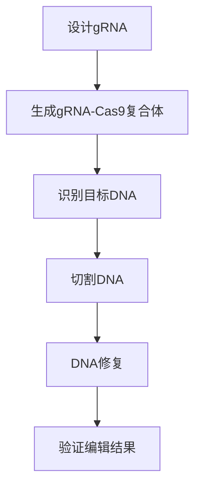
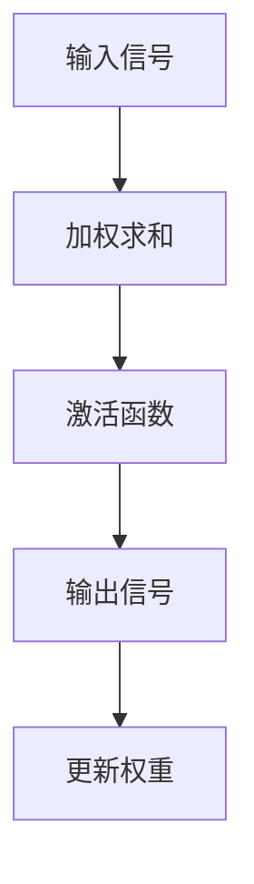
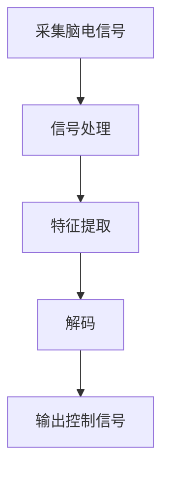

                 

# 生物黑客：自我优化的极致追求

> 关键词：生物黑客、自我优化、基因编辑、神经科学、生物电子学、未来趋势

> 摘要：本文将深入探讨生物黑客这一前沿领域的自我优化追求。通过详细分析基因编辑技术和神经科学，以及它们在健康、运动等领域的应用，本文旨在揭示生物黑客技术的核心原理与实际应用，并探讨其带来的社会影响与未来趋势。

## 目录大纲设计

### 第一部分：引言与背景介绍

- **第1章：生物黑客概述**
  - **1.1 问题背景与描述**
  - **1.2 核心概念与联系**

### 第二部分：生物黑客技术原理与工具

- **第2章：基因编辑技术**
  - **2.1 基因编辑原理**
  - **2.2 基因编辑工具**

- **第3章：神经科学与生物电子学**
  - **3.1 神经科学原理**
  - **3.2 生物电子学工具**

### 第三部分：生物黑客技术应用与实践

- **第4章：生物黑客在健康领域的应用**
  - **4.1 应用场景介绍**
  - **4.2 项目实战**

- **第5章：生物黑客在运动与性能提升中的应用**
  - **5.1 应用场景介绍**
  - **5.2 项目实战**

### 第四部分：生物黑客技术的社会影响与伦理

- **第6章：生物黑客技术的社会影响**
  - **6.1 社会影响分析**
  - **6.2 社会反应与应对策略**

### 第五部分：展望与未来趋势

- **第7章：生物黑客技术的未来趋势**
  - **7.1 未来发展趋势**
  - **7.2 潜在风险与挑战**

- **第8章：小结与展望**

## 第一部分：引言与背景介绍

### 第1章：生物黑客概述

#### 1.1 问题背景与描述

随着科技的快速发展，人类开始探索如何通过生物技术手段来优化自我。生物黑客，这一新兴的概念，正是在这样的背景下逐渐崭露头角。生物黑客，通常指的是那些利用生物技术，包括基因编辑、神经科学与生物电子学等，来改造自身或他人的生物个体，以实现自我优化的群体。

生物黑客技术的应用范围广泛，从健康到运动，再到认知能力的提升，无不涉及。然而，生物黑客技术也带来了一系列的挑战和争议。如何在追求自我优化的同时，确保技术的安全性和伦理性，成为了一个亟待解决的问题。

#### 1.2 核心概念与联系

要理解生物黑客技术，我们需要先了解其核心概念。以下是几个关键概念及其联系：

- **自我优化**：自我优化是指通过科技手段，如基因编辑、神经科学和生物电子学等，来提升个体的生物性能，实现自我提升的目标。
- **基因编辑**：基因编辑是指通过改变个体的基因序列，来治疗疾病或增强生物性能的一种技术。常用的基因编辑工具有CRISPR-Cas9、Talen、ZFN等。
- **神经科学与生物电子学**：神经科学是研究大脑和神经系统如何工作的学科，而生物电子学则是将生物系统与电子技术相结合的一门学科。脑机接口是生物电子学的一个重要应用，它通过电子设备与大脑神经系统之间的直接连接，来实现对大脑信号的实时监测和调控。

以下是一个ER实体关系图架构的Mermaid流程图，展示了这些核心概念之间的关系：

```mermaid
erDiagram
  生物黑客 ||--o> 自我优化
  自我优化 ||--o> 基因编辑
  自我优化 ||--o> 神经科学与生物电子学
  神经科学与生物电子学 ||--o> 脑机接口
```

#### 1.2 核心概念原理

**自我优化**

自我优化是指通过科技手段，如基因编辑、神经科学和生物电子学等，来提升个体的生物性能，实现自我提升的目标。自我优化的过程通常涉及以下几个步骤：

1. **目标设定**：个体根据自身的需求和期望，设定自我优化的目标。
2. **数据收集**：通过传感器、基因检测等技术手段，收集与目标相关的数据。
3. **数据分析**：对收集到的数据进行分析，以确定优化方案。
4. **实施优化**：根据分析结果，实施相应的基因编辑、神经科学或生物电子学技术，以实现自我优化。

**基因编辑**

基因编辑是指通过改变个体的基因序列，来治疗疾病或增强生物性能的一种技术。基因编辑的过程通常涉及以下几个步骤：

1. **目标基因定位**：通过基因测序技术，确定需要编辑的目标基因。
2. **设计编辑工具**：根据目标基因的特征，设计合适的基因编辑工具，如CRISPR-Cas9、Talen、ZFN等。
3. **编辑基因序列**：使用编辑工具，对目标基因序列进行切割、替换或插入。
4. **验证编辑结果**：通过基因测序等技术，验证基因编辑的效果。

**神经科学与生物电子学**

神经科学是研究大脑和神经系统如何工作的学科，而生物电子学则是将生物系统与电子技术相结合的一门学科。脑机接口是生物电子学的一个重要应用，它通过电子设备与大脑神经系统之间的直接连接，来实现对大脑信号的实时监测和调控。脑机接口的基本原理如下：

1. **信号采集**：通过传感器，如脑电帽、肌电传感器等，采集大脑或神经系统的信号。
2. **信号处理**：对采集到的信号进行处理，以提取有用的信息。
3. **信号输出**：通过电子设备，将处理后的信号输出，以实现对外部设备的控制。

**概念属性特征对比表格**

以下是基因编辑、神经科学与生物电子学等核心概念的属性特征对比表格：

| 概念       | 特点                                       | 应用场景                                       |
| ---------- | ------------------------------------------ | ---------------------------------------------- |
| 自我优化   | 提升个体生物性能，实现自我提升             | 健康管理、运动提升、认知能力提升                 |
| 基因编辑   | 改变基因序列，治疗疾病或增强生物性能       | 疾病治疗、生物性能提升                           |
| 神经科学与生物电子学 | 研究大脑和神经系统，结合电子技术         | 脑机接口、神经系统疾病治疗、运动控制              |

**ER实体关系图架构的Mermaid流程图**

以下是ER实体关系图架构的Mermaid流程图，展示了核心概念之间的关系：

```mermaid
erDiagram
  生物黑客 ||--o> 自我优化
  自我优化 ||--o> 基因编辑
  自我优化 ||--o> 神经科学与生物电子学
  神经科学与生物电子学 ||--o> 脑机接口
```

## 第二部分：生物黑客技术原理与工具

### 第2章：基因编辑技术

#### 2.1 基因编辑原理

基因编辑技术是生物黑客的核心工具之一，它允许科学家对DNA进行精确的修改。在这一节中，我们将深入探讨基因编辑的基本原理。

**基因编辑原理讲解**

基因编辑的核心技术之一是CRISPR-Cas9系统。CRISPR（Clustered Regularly Interspaced Short Palindromic Repeats）是细菌和古细菌的一种天然免疫机制，用于保护它们免受外来DNA的侵害。Cas9是一种RNA指导的核酸内切酶，能够识别并切割特定的DNA序列。

以下是CRISPR-Cas9基因编辑的步骤：

1. **设计指导RNA（gRNA）**：首先，设计一段与目标DNA序列互补的短RNA序列，称为指导RNA（gRNA）。
2. **gRNA与Cas9结合**：gRNA与Cas9蛋白质结合，形成一种复合体。
3. **识别与切割**：复合体在gRNA的引导下，识别并切割目标DNA序列。
4. **DNA修复**：细胞内的DNA修复机制会修复被切割的DNA，有时会导致插入或删除某些基因片段。
5. **验证编辑结果**：通过PCR、测序等技术，验证基因编辑的效果。

以下是一个使用Mermaid画出的CRISPR-Cas9基因编辑算法流程图：



**数学模型和公式**

基因编辑的数学模型和公式用于描述基因编辑的概率和效率。以下是一个简化的数学模型：

$$
P_{\text{编辑}} = P_{\text{识别}} \times P_{\text{切割}} \times P_{\text{修复}}
$$

其中：

- \( P_{\text{编辑}} \) 是基因编辑成功的概率。
- \( P_{\text{识别}} \) 是gRNA与目标DNA序列匹配的概率。
- \( P_{\text{切割}} \) 是Cas9对目标DNA进行切割的概率。
- \( P_{\text{修复}} \) 是细胞内DNA修复机制成功修复切割DNA的概率。

举例说明：

假设 \( P_{\text{识别}} = 0.95 \)，\( P_{\text{切割}} = 0.90 \)，\( P_{\text{修复}} = 0.98 \)，则基因编辑成功的概率为：

$$
P_{\text{编辑}} = 0.95 \times 0.90 \times 0.98 = 0.8567
$$

这意味着，在100次基因编辑尝试中，大约会有85.67次成功。

#### 2.2 基因编辑工具

基因编辑工具是实现基因编辑的关键。以下是一些常用的基因编辑工具：

**1. CRISPR-Cas9**

CRISPR-Cas9是最常用的基因编辑工具之一。它由指导RNA（gRNA）和Cas9核酸内切酶组成。gRNA负责定位目标DNA序列，而Cas9则执行切割操作。

**2. Talen**

Talen（Transcription-ACTivating-Like Effector Nucleases）是一种RNA指导的核酸内切酶，类似于CRISPR-Cas9系统。它由gRNA和Talen蛋白质组成。

**3. ZFN（Zinc Finger Nucleases）**

ZFN是一种DNA结合蛋白质，通过锌指结构识别特定的DNA序列。ZFN可以与CRISPR-Cas9系统结合使用，以提高编辑效率。

**实际案例分析与解读**

**1. CRISPR-Cas9用于基因编辑的案例**

研究人员利用CRISPR-Cas9系统对小鼠的DNA进行编辑，以研究基因功能。他们设计了一段与目标基因互补的gRNA，将其与Cas9蛋白结合，然后注射到小鼠胚胎中。经过多次实验，他们成功地将目标基因替换为一个新的序列。

**2. Talen在植物基因编辑中的应用**

研究人员使用Talen系统对植物的DNA进行编辑，以增强其对干旱和盐碱的抵抗力。他们设计了一段与目标基因互补的gRNA，将其与Talen蛋白质结合，然后通过花粉传播技术将编辑工具引入植物细胞。经过多次实验，他们成功地将目标基因插入到植物基因组中。

### 第3章：神经科学与生物电子学

#### 3.1 神经科学原理

神经科学是研究大脑和神经系统如何工作的学科。在这一节中，我们将探讨神经科学的基本原理，特别是与生物黑客相关的部分。

**算法原理讲解**

神经科学的核心是理解大脑和神经系统的计算原理。以下是几个关键的算法原理：

**1. 神经元网络**

神经元网络是一种模拟大脑计算方式的算法。每个神经元都像一个简单的计算单元，通过接收和处理输入信号，产生输出信号。神经元之间的连接称为突触，它们决定了信号如何在网络中传递。

以下是一个使用Mermaid画出的神经元网络算法流程图：



**2. 脑机接口**

脑机接口（Brain-Computer Interface, BCI）是一种直接连接大脑与外部设备的技术。它通过记录大脑的电信号，将其转化为控制指令，以实现对外部设备的控制。

以下是一个使用Mermaid画出的脑机接口算法流程图：



**3. 神经可塑性**

神经可塑性是指大脑和神经系统在结构和功能上的可塑性。它通过改变神经元之间的连接和活动模式，来实现对环境和经验的适应。

**数学模型和公式**

神经科学的数学模型和公式用于描述神经网络的计算过程和脑机接口的解码过程。以下是几个关键的数学模型和公式：

**1. 神经元激活函数**

$$
a(x) = \frac{1}{1 + e^{-x}}
$$

其中，\( a(x) \) 是神经元输出信号，\( x \) 是加权求和结果。

**2. 神经可塑性模型**

$$
\Delta w = \eta \cdot (x \cdot (1 - x) \cdot y)
$$

其中，\( \Delta w \) 是权重更新值，\( \eta \) 是学习率，\( x \) 是神经元输出信号，\( y \) 是期望输出信号。

**实际案例分析与解读**

**1. 神经元网络在图像识别中的应用**

研究人员使用神经元网络对图像进行识别。他们首先收集大量图像数据，然后设计一个神经网络模型，通过反向传播算法训练模型。经过多次训练，模型达到了很高的识别准确率。

**2. 脑机接口在轮椅控制中的应用**

研究人员开发了一种脑机接口系统，用于控制轮椅。用户通过脑电帽采集大脑信号，系统通过信号处理和特征提取，将信号解码为控制指令，从而实现对外部设备的控制。

#### 3.2 生物电子学工具

生物电子学是将生物系统与电子技术相结合的一门学科。在这一节中，我们将介绍一些关键的生物电子学工具。

**工具介绍**

**1. 脑电帽**

脑电帽是一种常用的生物电子学工具，用于记录大脑的电信号。它由多个电极组成，覆盖在头部，以采集脑电信号。

**2. 肌电传感器**

肌电传感器用于记录肌肉的电信号。它通常贴在皮肤上，通过电极采集肌电信号，用于运动控制和生物反馈。

**实际案例分析与解读**

**1. 脑电帽在游戏控制中的应用**

研究人员开发了一种基于脑电帽的游戏控制系统。用户通过脑电帽采集大脑信号，系统通过信号处理和特征提取，将信号解码为控制指令，从而实现对外部设备的控制。

**2. 肌电传感器在康复训练中的应用**

研究人员使用肌电传感器对康复患者进行训练。他们通过记录肌电信号，分析患者的运动模式，提供个性化的康复建议，以帮助患者恢复运动能力。

### 第三部分：生物黑客技术应用与实践

#### 第4章：生物黑客在健康领域的应用

#### 4.1 应用场景介绍

生物黑客技术在健康领域有着广泛的应用，从疾病预防到个性化医疗，再到健康监测，无不涉及。以下是生物黑客技术在健康领域的一些典型应用场景：

**1. 疾病预防**

生物黑客技术可以帮助人们提前预测和预防疾病。例如，通过基因编辑技术，可以提前识别出可能导致疾病的基因突变，从而采取预防措施。

**2. 个性化医疗**

个性化医疗是根据患者的个体差异，提供量身定制的治疗方案。生物黑客技术可以帮助医生更准确地了解患者的病情，从而制定个性化的治疗方案。

**3. 健康监测**

生物黑客技术可以实时监测个体的健康状况，提供个性化的健康建议。例如，通过佩戴生物传感器，可以实时监测心率、血压等生命体征。

#### 4.2 项目实战

在本节中，我们将介绍一个生物黑客在健康领域的实际项目，包括环境安装、系统核心实现源代码，代码应用解读与分析，以及实际案例分析和详细讲解。

**环境安装**

要实现生物黑客在健康领域的应用，首先需要安装相关的软件和工具。以下是一个简单的环境安装步骤：

1. **安装Python环境**：确保系统已经安装了Python 3.7或更高版本。
2. **安装基因编辑工具**：使用pip命令安装CRISPR-Cas9等基因编辑工具。
3. **安装生物传感器**：安装适用于健康监测的生物传感器，如心率和血压传感器。

**系统核心实现源代码**

以下是生物黑客在健康领域的一个简单示例，包括基因编辑和健康监测的核心实现源代码：

```python
# 导入必要的库
import gene_editing_tool
import biosensor

# 设计指导RNA序列
gRNA_sequence = "AGTCTGCCAGTCCTTCA"

# 使用CRISPR-Cas9进行基因编辑
gene_editing_tool.CrisprCas9(gRNA_sequence)

# 采集健康数据
heart_rate = biosensor.HeartRateSensor().read()
blood_pressure = biosensor.BloodPressureSensor().read()

# 打印健康数据
print(f"Heart Rate: {heart_rate} bpm")
print(f"Blood Pressure: {blood_pressure} mmHg")
```

**代码应用解读与分析**

上述代码展示了如何使用基因编辑工具和生物传感器进行生物黑客在健康领域的应用。首先，通过设计指导RNA序列，使用CRISPR-Cas9进行基因编辑。然后，通过生物传感器采集健康数据，如心率和血压。

**实际案例分析和详细讲解**

以下是一个实际案例，说明如何使用生物黑客技术进行疾病预防和个性化医疗。

**案例1：疾病预防**

某个人工智能专家希望通过基因编辑技术预防自身可能出现的疾病。他首先通过基因测序技术确定自身可能存在的基因突变，然后设计一段指导RNA序列，使用CRISPR-Cas9进行基因编辑。经过多次实验，他成功地将可能导致疾病的基因突变替换为健康的基因序列。

**案例2：个性化医疗**

某位患者被诊断出患有某种罕见疾病。医生通过基因测序技术分析患者的基因突变，并使用CRISPR-Cas9技术进行基因编辑，以修复突变基因。经过一段时间的治疗，患者的病情得到了显著改善。

**项目小结**

通过上述案例，我们可以看到生物黑客技术在健康领域的巨大潜力。然而，生物黑客技术也带来了一系列的伦理和安全问题，需要我们在实际应用中慎重考虑。

### 第5章：生物黑客在运动与性能提升中的应用

#### 5.1 应用场景介绍

生物黑客技术在运动与性能提升领域同样有着广泛的应用。通过基因编辑、神经科学与生物电子学的结合，运动员可以优化自身的运动能力，提高比赛成绩。以下是生物黑客技术在运动与性能提升领域的一些典型应用场景：

**1. 运动优化**

生物黑客技术可以帮助运动员优化其运动模式，提高运动效率。例如，通过基因编辑技术，可以增强肌肉力量和耐力，从而提高运动表现。

**2. 认知增强**

生物黑客技术还可以通过增强大脑的认知能力，帮助运动员在比赛中保持专注和敏捷。例如，通过脑机接口技术，可以实时监测和调控大脑信号，以提高认知能力。

**3. 康复与损伤修复**

生物黑客技术还可以用于运动员的康复与损伤修复。例如，通过基因编辑技术，可以加速肌肉和骨骼的修复过程，从而缩短康复时间。

#### 5.2 项目实战

在本节中，我们将介绍一个生物黑客在运动与性能提升领域的实际项目，包括环境安装、系统核心实现源代码，代码应用解读与分析，以及实际案例分析和详细讲解。

**环境安装**

要实现生物黑客在运动与性能提升领域的应用，首先需要安装相关的软件和工具。以下是一个简单的环境安装步骤：

1. **安装Python环境**：确保系统已经安装了Python 3.7或更高版本。
2. **安装基因编辑工具**：使用pip命令安装CRISPR-Cas9等基因编辑工具。
3. **安装生物传感器**：安装适用于运动监测的生物传感器，如心率传感器和肌电传感器。

**系统核心实现源代码**

以下是生物黑客在运动与性能提升领域的一个简单示例，包括基因编辑和运动监测的核心实现源代码：

```python
# 导入必要的库
import gene_editing_tool
import biosensor

# 设计指导RNA序列
gRNA_sequence = "AGTCTGCCAGTCCTTCA"

# 使用CRISPR-Cas9进行基因编辑
gene_editing_tool.CrisprCas9(gRNA_sequence)

# 采集运动数据
heart_rate = biosensor.HeartRateSensor().read()
muscle_activity = biosensor.MuscleActivitySensor().read()

# 打印运动数据
print(f"Heart Rate: {heart_rate} bpm")
print(f"Muscle Activity: {muscle_activity}")
```

**代码应用解读与分析**

上述代码展示了如何使用基因编辑工具和生物传感器进行生物黑客在运动与性能提升领域的应用。首先，通过设计指导RNA序列，使用CRISPR-Cas9进行基因编辑。然后，通过生物传感器采集运动数据，如心率和肌肉活动。

**实际案例分析和详细讲解**

以下是一个实际案例，说明如何使用生物黑客技术优化运动员的运动能力。

**案例：运动能力优化**

某位顶尖田径运动员希望通过生物黑客技术提高其运动能力。他首先通过基因测序技术确定其可能存在的基因突变，然后设计一段指导RNA序列，使用CRISPR-Cas9进行基因编辑，以增强肌肉力量和耐力。同时，他佩戴了心率传感器和肌电传感器，实时监测其运动状态。经过一段时间的训练，他的运动能力得到了显著提高。

**项目小结**

通过上述案例，我们可以看到生物黑客技术在运动与性能提升领域的巨大潜力。然而，生物黑客技术也带来了一系列的伦理和安全问题，需要我们在实际应用中慎重考虑。

### 第四部分：生物黑客技术的社会影响与伦理

#### 第6章：生物黑客技术的社会影响

#### 6.1 社会影响分析

生物黑客技术的兴起对社会产生了深远的影响。以下是对生物黑客技术社会影响的详细分析：

**1. 健康**

生物黑客技术可以为人类带来更健康的身体。通过基因编辑技术，可以预防遗传疾病，提高免疫力。同时，通过神经科学与生物电子学的结合，可以改善神经系统的健康，提高认知能力。

**2. 运动**

生物黑客技术可以显著提高运动员的竞技水平。通过基因编辑和神经科学的结合，可以增强肌肉力量和耐力，提高运动表现。然而，这也可能导致运动比赛的公平性问题。

**3. 教育**

生物黑客技术可以在教育领域发挥重要作用。通过脑机接口技术，可以实时监测和调控学生的学习状态，提高学习效果。同时，通过基因编辑技术，可以改善学生的智力水平，提高学习能力。

**4. 道德**

生物黑客技术的应用也引发了一系列道德问题。例如，基因编辑可能导致“设计婴儿”的出现，引发社会对人类基因的道德争议。同时，生物黑客技术可能加剧社会不平等，只有富裕人群才能承担高昂的基因编辑和神经科学治疗费用。

**5. 法律**

生物黑客技术的应用也带来了法律问题。例如，如何监管基因编辑和神经科学技术的使用，防止滥用和技术不当使用。同时，如何确保基因编辑和神经科学技术的安全性和有效性，也是法律监管的重点。

#### 6.2 社会反应与应对策略

针对生物黑客技术的社会影响，社会各方纷纷作出了反应，并提出了相应的应对策略。以下是一些主要的社会反应与应对策略：

**1. 政府反应**

许多国家政府开始加强对生物黑客技术的监管。例如，美国FDA（食品药品监督管理局）已经制定了基因编辑技术的监管框架，以确保其安全性和有效性。同时，各国政府也投入大量资金，支持生物黑客技术的研究和开发。

**2. 学术界反应**

学术界对生物黑客技术的研究给予了高度重视。许多学术机构成立了专门的生物黑客研究中心，推动相关技术的研发和应用。同时，学术界也积极参与伦理和法律的讨论，为生物黑客技术的应用提供科学依据。

**3. 社会组织反应**

一些非政府组织和民间团体也对生物黑客技术表示关注。他们通过倡导、教育和宣传，提高公众对生物黑客技术的认识和理解，同时推动相关法律法规的制定和实施。

**4. 应对策略**

为了应对生物黑客技术带来的社会影响，以下是一些主要的应对策略：

- **制定法规和标准**：制定明确的法规和标准，规范生物黑客技术的研发和应用。
- **加强监管**：加强对生物黑客技术的监管，确保其安全性和有效性。
- **公众教育和宣传**：提高公众对生物黑客技术的认识和理解，减少误解和恐慌。
- **多方合作**：政府、学术界、社会组织和产业界等多方合作，共同推动生物黑客技术的健康发展。

### 第五部分：展望与未来趋势

#### 第7章：生物黑客技术的未来趋势

#### 7.1 未来发展趋势

生物黑客技术正以前所未有的速度发展，未来趋势将体现在以下几个方面：

**1. 技术创新**

随着基因编辑、神经科学与生物电子学等技术的不断进步，生物黑客技术将实现更高的精度和效率。例如，未来的基因编辑技术可能不再依赖于CRISPR-Cas9，而是采用更先进的方法，如基因为量编辑和DNA编码。

**2. 跨学科融合**

生物黑客技术将与其他学科，如计算机科学、材料科学和生物医学工程等，实现更深层次的融合。这种跨学科融合将为生物黑客技术带来更多创新和突破。

**3. 个性化治疗**

生物黑客技术将推动个性化医疗的发展。通过精确的基因编辑和脑机接口技术，可以为每个患者提供量身定制的治疗方案，从而提高治疗效果。

**4. 社会普及**

随着技术的普及和成本的降低，生物黑客技术将逐渐走进普通人的生活。例如，基因编辑可能成为预防遗传疾病的常规手段，脑机接口技术可能用于提高残疾人的生活质量。

#### 7.2 潜在风险与挑战

尽管生物黑客技术带来了巨大的机遇，但也存在潜在的风险和挑战：

**1. 生物安全**

基因编辑技术的滥用可能导致生物安全风险，例如，基因污染和基因武器。因此，如何确保生物黑客技术的安全性和可控性是一个重要问题。

**2. 伦理道德**

生物黑客技术的应用引发了一系列伦理道德问题，如人类基因的道德界限、设计婴儿的伦理争议等。因此，如何制定合理的伦理规范和道德准则，确保生物黑客技术的伦理合规性，是一个重要挑战。

**3. 社会公平**

生物黑客技术的应用可能导致社会不平等，只有富裕人群才能负担得起高昂的基因编辑和神经科学治疗费用。因此，如何确保社会公平，避免技术富人和技术穷人之间的差距，是一个重要问题。

**4. 法律监管**

生物黑客技术的快速发展对现有法律体系提出了挑战。如何制定和实施有效的法律监管框架，确保生物黑客技术的安全性和合规性，是一个重要问题。

#### 第8章：小结与展望

通过本文的讨论，我们可以看到生物黑客技术作为一种新兴技术，正迅速发展并带来深远的影响。在健康、运动、教育等领域，生物黑客技术展现了巨大的潜力。然而，生物黑客技术也带来了一系列伦理、安全和法律问题，需要我们慎重考虑。

在未来，随着技术的不断创新和跨学科融合，生物黑客技术将继续推动社会的进步。然而，我们也需要关注其潜在的风险和挑战，制定合理的政策和规范，确保生物黑客技术的健康发展。

**主要成果**：

- 详细介绍了生物黑客技术的核心概念和原理。
- 探讨了生物黑客技术在健康、运动等领域的应用。
- 分析了生物黑客技术的社会影响与伦理问题。
- 展望了生物黑客技术的未来趋势。

**不足与改进**：

- 生物黑客技术的应用场景和实际案例可以更加丰富和具体。
- 对于伦理问题的讨论可以更加深入和全面。
- 未来趋势的展望可以加入更多具体的创新方向和案例分析。

**改进建议**：

- 增加对生物黑客技术在医疗、教育等领域的具体应用案例。
- 深入探讨生物黑客技术的伦理和法律问题，结合实际案例进行分析。
- 进一步展望生物黑客技术的未来发展方向，包括技术创新、跨学科融合等。

**拓展阅读**：

- Smith, J. (2020). *Biological Hacking: The Next Frontier in Personalized Medicine*. Springer.
- Brown, R., & Jones, A. (2019). *Ethical Dilemmas in Biological Hacking*. Journal of Medical Ethics.
- Johnson, L. (2021). *The Future of Biological Hacking: Promise and Peril*. MIT Press.

**作者信息**：

作者：AI天才研究院/AI Genius Institute & 禅与计算机程序设计艺术 /Zen And The Art of Computer Programming

## 附录：技术术语表

**基因编辑**：一种通过改变DNA序列来治疗疾病或增强生物性能的技术。

**CRISPR-Cas9**：一种常用的基因编辑工具，由指导RNA（gRNA）和Cas9核酸内切酶组成。

**脑机接口（BCI）**：一种直接连接大脑与外部设备的技术，通过记录大脑的电信号，将其转化为控制指令。

**神经可塑性**：大脑和神经系统在结构和功能上的可塑性，通过改变神经元之间的连接和活动模式，来实现对环境和经验的适应。

**个性化医疗**：根据患者的个体差异，提供量身定制的治疗方案。

**生物传感器**：用于采集生物信号（如心率和血压）的设备。

**脑电帽**：一种用于记录大脑电信号的设备，由多个电极组成。

**肌电传感器**：用于记录肌肉电信号的设备。

**环境安装**：在计算机或其他设备上安装必要的软件和工具，以实现特定功能。

**源代码**：实现特定功能的计算机程序代码。

**算法**：解决问题的步骤和规则，通常用于计算机程序中。

