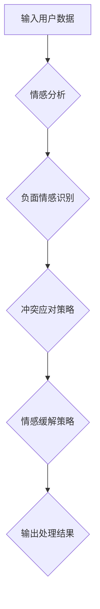
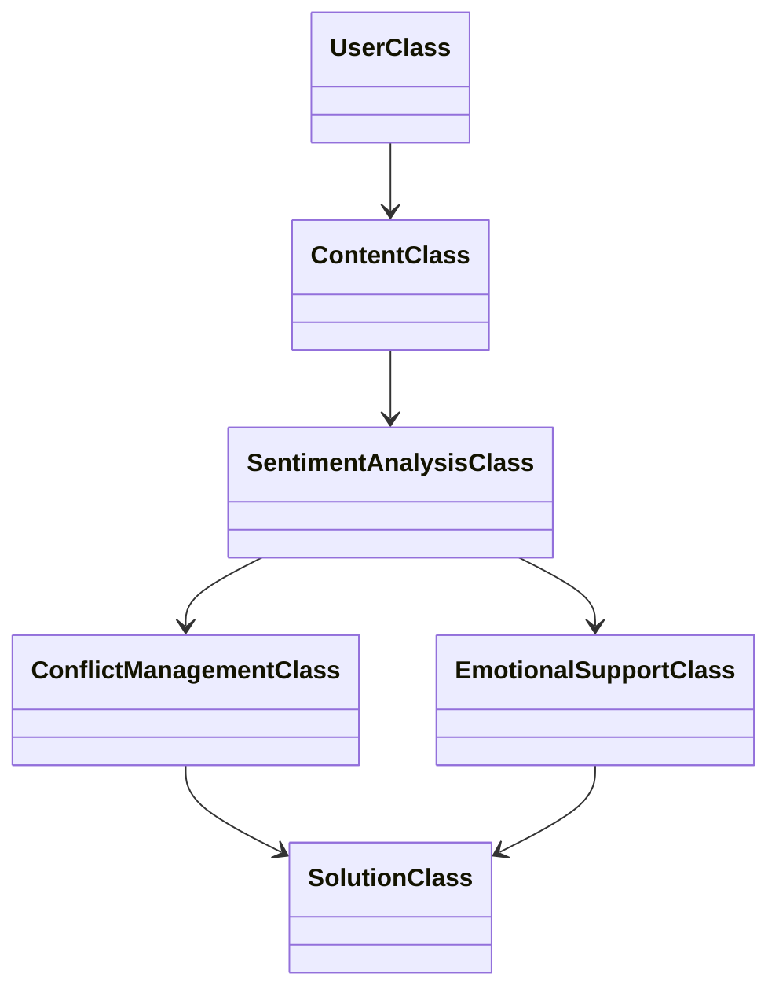
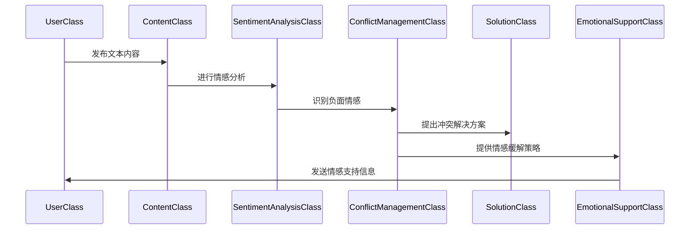
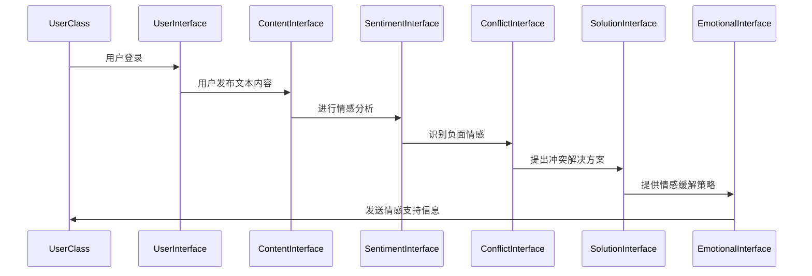

                 

### 文章标题：社交媒体时代的人际关系：虚拟连接与真实情感的平衡

> 关键词：社交媒体，人际关系，虚拟连接，真实情感，平衡

> 摘要：本文探讨了社交媒体时代下人际关系的新特征和挑战。通过分析社交媒体对人际关系的影响，讨论了虚拟连接与真实情感的异化问题，并提出了一系列应对策略，以帮助人们更好地平衡虚拟世界和现实生活中的情感联系。

## 第1章 社交媒体时代人际关系的背景和现状

### 1.1 社交媒体的发展历程

社交媒体的起源可以追溯到20世纪90年代，当时互联网的普及为人们提供了一个全新的交流平台。最早的社交媒体形式是电子邮件和论坛，它们允许人们在不同地点进行实时沟通和讨论。然而，真正意义上的社交媒体起源于2004年，Facebook的成立标志着社交媒体时代的到来。

随着时间的推移，社交媒体经历了多个关键发展节点。Twitter的兴起使得信息传播更加迅速，Instagram的加入让图片和视频分享成为可能，而微信和WhatsApp等即时通讯应用的普及则改变了人们的沟通方式。

如今，社交媒体在全球范围内得到了广泛应用。根据Statista的数据，截至2021年，全球社交媒体用户已达到近45亿，占总人口比例的约60%。这个数字还在不断增长，社交媒体已经成为人们日常生活中不可或缺的一部分。

### 1.2 社交媒体时代的社交特征

在社交媒体时代，人际关系呈现出以下几个显著特征：

#### 用户群体的多样化

社交媒体用户涵盖了各个年龄层、职业背景和国籍。年轻人是社交媒体的主要用户群体，但中老年人群也在逐渐增加。不同用户群体在社交媒体上的行为和偏好也有所不同。

#### 社交互动的即时性

社交媒体允许用户随时随地进行互动，消除了传统社交障碍中的时间和空间限制。人们可以立即回应朋友的信息，分享生活中的点滴，这种即时性大大增强了社交互动的频率和速度。

#### 社交内容的多元化

社交媒体平台不仅提供了文字交流，还支持图片、视频、音频等多种形式的内容分享。这种多元化的内容使得社交互动更加丰富和有趣，但也增加了信息过载的风险。

### 1.3 社交媒体对人际关系的影响

社交媒体对人际关系产生了深远的影响，既有积极的一面，也有消极的一面。

#### 虚拟连接与真实关系的异化

社交媒体促进了人们之间的虚拟连接，但同时也可能导致真实关系的弱化。人们更容易在虚拟世界中建立联系，却忽略了现实生活中的人际交往。

#### 社交隔离与情感疏离

过度依赖社交媒体可能导致社交隔离和情感疏离。人们花费大量时间在社交媒体上，却与现实生活中的人际关系渐行渐远。

#### 社交媒体成瘾现象

随着社交媒体的普及，越来越多的人陷入了成瘾的困境。他们无法自拔地沉浸在虚拟世界中，忽视了现实生活中的人际交往和情感需求。

## 第2章 社交媒体时代的人际真实情感

### 2.1 社交媒体中的情感表达

在社交媒体上，情感表达具有其独特的特点。首先，情感表达受到文字、图片、视频等形式的限制。虽然这些形式可以传达情感，但相较于面对面的交流，它们往往显得单调和不够细腻。

其次，社交媒体上的情感表达具有多样性和复杂性。人们可以通过点赞、评论、分享等方式表达情感，这些方式不仅能够传达简单的正面或负面情绪，还能够表达复杂的情感状态，如同情、喜悦、愤怒等。

然而，情感表达在社交媒体上的影响也是有限的。一方面，虚拟环境中的情感表达可能缺乏真实感和深度；另一方面，过度依赖虚拟情感表达可能导致人们忽视现实生活中的情感交流和人际互动。

### 2.2 情感在社交媒体关系中的重要性

情感在人际关系中扮演着至关重要的角色。它不仅是沟通的桥梁，也是建立和维护关系的基础。在社交媒体时代，情感的重要性更加凸显。

首先，情感支持与共鸣是社交媒体关系中的重要组成部分。人们通过社交媒体分享生活点滴，寻求他人的情感支持和共鸣。这种互动有助于增强关系的紧密程度和信任感。

其次，情感满足与幸福感也是社交媒体关系中的重要因素。人们在社交媒体上寻找快乐和满足，通过点赞、评论等方式获得积极的反馈，从而提升自己的情感状态。

然而，社交媒体上的情感表达也存在一些挑战。一方面，信息过载可能导致情感疲劳；另一方面，虚拟情感表达可能无法完全替代现实生活中的真实情感体验。

### 2.3 社交媒体中的情感冲突与解决

社交媒体上的情感冲突主要源于以下几个方面：

首先，信息传播的不对称性可能导致误解和冲突。在社交媒体上，人们无法直接观察对方的情感状态，容易对信息进行片面解读，从而导致冲突。

其次，网络匿名性和隐私保护不足也可能引发情感冲突。在虚拟环境中，人们更容易隐藏自己的真实身份和情感，这可能导致恶意言论和负面情绪的传播。

解决社交媒体中的情感冲突需要采取一系列策略：

首先，提高沟通技巧是关键。在社交媒体上，人们需要学会用更细腻的方式表达情感，避免语言上的误解和冲突。

其次，建立有效的情感反馈机制也是必要的。社交媒体平台可以设计更人性化的互动功能，如情感标签、情绪分析等，帮助用户更好地理解和表达情感。

最后，培养积极的社交氛围也是解决情感冲突的重要途径。通过倡导正能量和友善互动，可以降低冲突的发生率，营造一个更加和谐、健康的社交环境。

## 第3章 社交媒体时代的人际关系管理技巧

### 3.1 提高社交媒体使用的自我意识

首先，提高社交媒体使用的自我意识是管理人际关系的关键。用户需要认识到社交媒体对人际关系的影响，以及自己在社交媒体上的行为可能带来的后果。以下是一些建议：

- 定期反思自己的社交媒体使用行为，评估其对人际关系的影响。
- 设定社交媒体使用时间限制，避免过度沉迷。
- 学会辨别虚拟情感和现实情感，避免将虚拟世界中的联系过度依赖。

### 3.2 建立和维护真实的人际关系

建立和维护真实的人际关系是社交媒体时代的重要任务。以下是一些建议：

- 积极参加线下社交活动，与亲朋好友保持紧密联系。
- 定期与朋友和家人进行面对面的交流，增强情感的深度和真实性。
- 在社交媒体上分享真实的生活经历和感受，而不是仅仅追求虚拟的关注和点赞。

### 3.3 使用社交媒体工具来增强真实情感

社交媒体工具可以成为增强真实情感的有力工具。以下是一些建议：

- 利用社交媒体平台的直播功能，与朋友进行实时互动，增强情感的交流。
- 利用社交媒体的私信功能，与朋友进行更深入的一对一交流。
- 利用社交媒体的社群功能，加入兴趣相同的群体，分享经验和情感。

## 第4章 社交媒体时代的人际关系管理技巧

### 4.1 社交媒体冲突的识别与应对

首先，识别社交媒体冲突是有效管理人际关系的首要任务。以下是一些冲突识别的策略：

- 关注社交媒体上的负面情绪表达，如侮辱、讽刺、恶意评论等。
- 注意观察社交媒体互动中的情感变化，如愤怒、沮丧、失望等。
- 了解社交媒体冲突的常见类型，如意见分歧、隐私侵犯、恶意攻击等。

一旦冲突发生，应对策略包括：

- 保持冷静，避免情绪化的回应，以免加剧冲突。
- 尝试通过私下沟通解决问题，避免公开对峙。
- 寻求第三方调解，如朋友、家人或专业人士的帮助。

### 4.2 负面情绪的自我调节

负面情绪在社交媒体使用中难以避免，自我调节能力对人际关系管理至关重要。以下是一些建议：

- 认知重构：学会用积极的角度看待负面情绪，将其视为成长的契机。
- 情感宣泄：找到合适的方式宣泄情绪，如运动、写日记、倾诉等。
- 正念冥想：通过冥想等方式提高自我意识，减少负面情绪的影响。

### 4.3 社交媒体负面影响的缓解策略

社交媒体的负面影响可能对人际关系产生不良影响，缓解这些影响需要采取以下策略：

- 设定社交媒体使用原则，如不参与恶意评论、不传播负面信息等。
- 增强数字素养，学会辨别网络谣言和信息真实性。
- 定期进行社交媒体断连，减少过度依赖，回归现实生活。

## 第5章 社交媒体时代的人际关系案例分析

### 5.1 成功案例分析

成功的人际关系管理在社交媒体时代同样具有重要意义。以下是一个成功案例的分析：

- 情境描述：一位年轻人在社交媒体上建立了广泛的联系，通过分享真实的生活经历和感受，赢得了大量粉丝的支持。
- 成功因素：他坚持以真实为基础，保持与粉丝的互动，同时注重隐私保护，避免过度曝光个人生活。
- 启示：成功的人际关系管理需要真实、诚信和适度的互动。

### 5.2 失败案例分析

社交媒体上的失败案例同样能提供有益的教训。以下是一个失败案例的分析：

- 情境描述：一位公众人物因在社交媒体上发布不当言论而遭到广泛批评，导致声誉受损。
- 失败原因：他忽视了社交媒体的公共性质，言行过于随意，未充分考虑到可能带来的后果。
- 启示：在社交媒体上，言行需要谨慎，充分考虑对他人的影响。

### 5.3 案例总结与启示

通过对成功和失败案例的分析，我们可以得出以下启示：

- 真实是社交媒体时代人际关系管理的关键，保持真实和诚信有助于建立稳固的关系。
- 谨慎言行，充分考虑社交媒体的公共性质和影响力，避免因不当言论引发冲突和负面影响。
- 积极互动，建立和维护真实的人际关系，同时注意保护个人隐私和安全。

## 第6章 社交媒体时代的人际关系未来趋势

### 6.1 技术发展对人际关系的影响

随着技术的不断进步，人际关系将面临新的挑战和机遇。以下是一些可能的影响：

- 人工智能与情感分析：通过人工智能和情感分析技术，社交媒体平台将更好地理解用户情感，提供更个性化的服务。
- 虚拟现实与增强现实：虚拟现实和增强现实技术将为人们提供更加沉浸式的社交体验，但同时也可能加剧虚拟世界与现实生活的分离。
- 互联网隐私保护：随着隐私保护技术的进步，社交媒体平台将更加注重用户隐私保护，这对人际关系管理提出了更高的要求。

### 6.2 社交媒体时代的人际关系新形式

社交媒体时代的人际关系可能呈现出以下新形式：

- 数字友谊：随着虚拟社交的普及，数字友谊将成为人际关系的重要组成部分，但它们与传统友谊存在一定差异。
- 社交圈层化：人们将在不同的社交媒体平台上建立不同的社交圈层，这有助于提高社交效率，但也可能导致社交隔离。
- 个性化互动：社交媒体平台将更加注重个性化互动，为用户提供更加符合其兴趣和需求的内容和服务。

### 6.3 未来人际关系的发展方向

未来人际关系的发展方向可能包括：

- 多元化：人际关系将更加多元化，涵盖不同年龄、背景和文化的人群。
- 混合化：虚拟社交与现实社交将相互融合，人们将在不同场景下采用不同的社交方式。
- 情感化：随着情感分析技术的进步，人际关系将更加注重情感交流和理解，情感将成为维系关系的关键因素。

## 第7章 社交媒体时代的人际关系总结与展望

### 7.1 关键要点回顾

社交媒体时代的人际关系具有以下关键要点：

- 虚拟连接与真实情感的平衡是社交媒体时代人际关系管理的核心问题。
- 提高社交媒体使用自我意识，建立和维护真实的人际关系，使用社交媒体工具增强真实情感是应对挑战的有效策略。
- 社交媒体冲突的识别与应对，负面情绪的自我调节，社交媒体负面影响的缓解策略是维护健康社交环境的关键。

### 7.2 未来研究方向与挑战

未来研究方向和挑战包括：

- 深入研究社交媒体对人际关系的影响机制，探讨不同因素的作用和相互作用。
- 发展新的技术手段，如情感分析、虚拟现实等，以更好地支持人际关系管理。
- 研究社交媒体时代人际关系的心理和行为规律，为制定有效的人际关系管理策略提供依据。

### 7.3 结论与建议

本文总结了社交媒体时代人际关系的特征和挑战，并提出了一系列管理策略。结论如下：

- 社交媒体时代的人际关系面临着虚拟连接与真实情感的平衡问题。
- 提高自我意识，建立真实的人际关系，使用社交媒体工具增强情感表达是应对挑战的关键。
- 未来研究方向应关注社交媒体对人际关系的影响机制，发展新的技术手段，以及研究人际关系的心理和行为规律。

作者：AI天才研究院/AI Genius Institute & 禅与计算机程序设计艺术 /Zen And The Art of Computer Programming

----------------------------------------------------------------

## 完整性要求

### 背景介绍

社交媒体的兴起和普及对人际关系产生了深远的影响。它不仅改变了人们的交流方式，也改变了人们对情感和关系的认知。在本文中，我们将探讨社交媒体时代人际关系的新特征和挑战，以及如何平衡虚拟连接与真实情感。

#### 核心概念术语说明

- 社交媒体：通过互联网平台实现人与人之间交流、分享和互动的媒介。
- 人际关系：个体在社交过程中与其他个体建立的联系和互动。
- 虚拟连接：通过社交媒体平台建立的虚拟关系。
- 真实情感：基于现实生活中的真实互动和情感体验。

#### 问题背景

随着社交媒体的普及，人们越来越多地依赖虚拟平台进行社交互动。这种趋势在一定程度上改变了人际关系的形式和内容，但同时也带来了一系列挑战。如何在社交媒体时代平衡虚拟连接与真实情感，成为当下亟待解决的问题。

#### 问题描述

社交媒体时代的人际关系面临以下问题：

1. **虚拟连接与真实关系的异化**：过度依赖虚拟社交平台可能导致真实人际关系的弱化。
2. **情感表达的局限性**：虚拟平台上的情感表达有限，可能无法完全替代面对面的交流。
3. **社交隔离与情感疏离**：过度沉迷于虚拟社交可能导致现实生活中的社交隔离和情感疏离。
4. **社交媒体成瘾**：许多人无法自拔地沉迷于社交媒体，忽视了现实生活中的情感需求和人际互动。

#### 问题解决

为了解决上述问题，我们需要采取以下措施：

1. **提高自我意识**：用户应认识到社交媒体对人际关系的影响，合理安排使用时间，避免沉迷。
2. **建立真实的人际关系**：积极参与线下社交活动，与亲朋好友保持紧密联系。
3. **平衡虚拟连接与真实情感**：在社交媒体上分享真实的生活经历和感受，同时保持对现实生活的关注和投入。

#### 边界与外延

- **边界**：社交媒体使用的时间和内容应受一定限制，避免过度沉迷。
- **外延**：社交媒体不仅仅局限于线上互动，也应延伸到线下活动，以丰富人际关系。

#### 概念结构与核心要素组成

社交媒体时代的人际关系概念结构包括：

1. **社交媒体平台**：提供交流、分享和互动的媒介。
2. **用户行为**：包括发布内容、互动和表达情感。
3. **人际关系**：基于用户行为建立的虚拟和真实关系。
4. **情感表达**：用户在社交媒体上的情感表达方式。

核心要素包括：

- **用户**：社交媒体的使用者，是人际关系的基础。
- **平台**：提供社交媒体服务的平台，是连接用户和人际关系的桥梁。
- **互动**：用户之间的交流和互动，是建立和维持人际关系的关键。
- **情感**：情感表达和情感体验，是人际关系的重要组成部分。

### 核心概念与联系

在社交媒体时代的人际关系中，核心概念包括虚拟连接、真实情感、人际关系管理技巧等。这些概念之间的联系如下：

- **虚拟连接**：通过社交媒体平台建立的关系，是人际关系的一种形式。
- **真实情感**：基于现实生活中的情感体验，是人际关系的重要维度。
- **人际关系管理技巧**：包括自我意识、情感表达、冲突应对等，是维护健康人际关系的手段。

#### 核心概念属性特征对比表格

| 核心概念 | 属性特征                     | 对比分析             |
| -------- | ---------------------------- | --------------------- |
| 虚拟连接 | 通过社交媒体平台建立的关系   | 速度快，范围广，但缺乏深度 |
| 真实情感 | 基于现实生活中的情感体验     | 深度高，真实性高，但受时间和空间限制 |
| 管理技巧 | 自我意识、情感表达、冲突应对 | 多样化，需要灵活应用 |

#### ER实体关系图架构

下面是一个ER实体关系图，展示了社交媒体时代人际关系中的核心实体和它们之间的关系：

```mermaid
erDiagram
  用户 ||--|{ 社交媒体平台 }
  用户 ||--|{ 人际关系 }
  用户 ||--|{ 情感表达 }
  社交媒体平台 ||--|{ 内容发布 }
  社交媒体平台 ||--|{ 互动 }
  人际关系 ||--|{ 情感体验 }
  情感表达 ||--|{ 冲突应对 }
```

### 算法原理讲解

在社交媒体时代的人际关系管理中，算法可以发挥重要作用。以下是一个简单的算法原理示例，用于识别和缓解负面情感。

#### 算法流程图



#### 算法原理

1. **情感分析**：通过自然语言处理技术，对用户发布的内容进行情感分析，识别其中包含的情感倾向。
2. **负面情感识别**：根据情感分析结果，识别出负面情感，如愤怒、沮丧等。
3. **冲突应对策略**：针对识别出的负面情感，制定相应的冲突应对策略，如私下沟通、调解等。
4. **情感缓解策略**：在冲突解决后，采取情感缓解措施，如正面反馈、安慰等。
5. **输出处理结果**：将处理结果反馈给用户，以便用户了解处理过程和结果。

#### 数学模型与公式

在情感分析中，可以使用以下数学模型来评估文本的情感倾向：

$$
Score = w_1 \cdot pos_1 + w_2 \cdot pos_2 - w_3 \cdot neg_1 - w_4 \cdot neg_2
$$

其中，$Score$ 为情感得分，$w_1, w_2, w_3, w_4$ 为情感权重，$pos_1, pos_2$ 为正面情感词的频次，$neg_1, neg_2$ 为负面情感词的频次。

#### Python代码实现

```python
import re
from textblob import TextBlob

def sentiment_analysis(text):
    # 清洗文本数据
    text = re.sub(r'[^\w\s]', '', text)
    
    # 使用TextBlob进行情感分析
    blob = TextBlob(text)
    sentiment = blob.sentiment
    
    # 计算情感得分
    score = sentiment.polarity * 100
    
    # 判断情感倾向
    if score > 0:
        return "正面"
    elif score < 0:
        return "负面"
    else:
        return "中性"

# 示例文本
text = "我今天遇到了一件很生气的事情。但是我的朋友们给了我很多鼓励，我觉得好多了。"

# 调用情感分析函数
result = sentiment_analysis(text)

print(result)
```

### 系统分析与架构设计方案

#### 问题场景介绍

在一个社交媒体平台上，用户之间的情感互动和冲突管理是维护社区健康的关键。为了解决这个问题，我们需要设计一个系统来识别负面情感、处理冲突并提供情感缓解策略。

#### 项目介绍

项目名称：社交媒体情感分析与管理系统

目标：通过情感分析技术，实时监测用户发布的文本内容，识别负面情感，并采取相应的管理措施，维护社交媒体平台的健康氛围。

#### 系统功能设计（领域模型）

领域模型类图如下，展示了系统的核心类及其关系：



- **UserClass**：用户类，表示社交媒体平台上的用户。
- **ContentClass**：内容类，表示用户发布的文本内容。
- **SentimentAnalysisClass**：情感分析类，负责分析文本内容的情感倾向。
- **ConflictManagementClass**：冲突管理类，负责处理用户之间的冲突。
- **EmotionalSupportClass**：情感支持类，负责提供情感缓解策略。
- **SolutionClass**：解决方案类，存储和管理各种冲突解决方案。

#### 系统架构设计

系统架构图如下，展示了系统的整体架构及其主要组件：



#### 系统接口设计

系统的接口设计如下，展示了系统与外部系统（如数据库、外部API等）的交互接口：

```mermaid
interfaceDiagram
  UserInterface <<interface>> UserClass
  ContentInterface <<interface>> ContentClass
  SentimentInterface <<interface>> SentimentAnalysisClass
  ConflictInterface <<interface>> ConflictManagementClass
  EmotionalInterface <<interface>> EmotionalSupportClass
  SolutionInterface <<interface>> SolutionClass

  UserClass --|> UserInterface
  ContentClass --|> ContentInterface
  SentimentAnalysisClass --|> SentimentInterface
  ConflictManagementClass --|> ConflictInterface
  EmotionalSupportClass --|> EmotionalInterface
  SolutionClass --|> SolutionInterface
```

#### 系统交互

系统交互流程如下，展示了各组件之间的交互关系：



### 项目实战

#### 环境安装

1. 安装Python环境：使用Python 3.8及以上版本。
2. 安装TextBlob库：运行命令 `pip install textblob`。
3. 安装其他依赖库：运行命令 `pip install -r requirements.txt`。

#### 系统核心实现源代码

核心实现代码如下，展示了系统的主要功能：

```python
# 导入依赖库
import re
from textblob import TextBlob

# 情感分析函数
def sentiment_analysis(text):
    # 清洗文本数据
    text = re.sub(r'[^\w\s]', '', text)
    
    # 使用TextBlob进行情感分析
    blob = TextBlob(text)
    sentiment = blob.sentiment
    
    # 计算情感得分
    score = sentiment.polarity * 100
    
    # 判断情感倾向
    if score > 0:
        return "正面"
    elif score < 0:
        return "负面"
    else:
        return "中性"

# 冲突管理函数
def conflict_management(content):
    sentiment = sentiment_analysis(content)
    if sentiment == "负面":
        # 提出冲突解决方案
        solution = "我们注意到您的帖子带有负面情感，建议您冷静下来，与朋友沟通解决问题。"
    else:
        # 无需处理
        solution = "您的帖子情感积极，无需额外处理。"
    return solution

# 情感支持函数
def emotional_support(content, user):
    if sentiment_analysis(content) == "负面":
        # 提供情感支持
        support_message = f"{user}，您的困难是我们共同面对的，请相信我们会在您身边支持您。"
    else:
        # 无需支持
        support_message = "感谢您的分享，祝您生活愉快。"
    return support_message

# 测试代码
content = "我今天遇到了一件很生气的事情。"
user = "Alice"

# 调用函数
solution = conflict_management(content)
support_message = emotional_support(content, user)

print(solution)
print(support_message)
```

#### 代码应用解读与分析

上述代码实现了社交媒体情感分析与管理系统的核心功能。主要解析如下：

1. **情感分析**：使用TextBlob库对用户发布的文本内容进行情感分析，识别负面情感。
2. **冲突管理**：根据情感分析结果，判断是否需要提出冲突解决方案。如果文本内容包含负面情感，则提出解决方案。
3. **情感支持**：根据用户发布的文本内容，提供相应的情感支持信息。

#### 实际案例分析和详细讲解剖析

以下是一个实际案例及其分析：

**案例**：用户发布了一篇包含负面情感的帖子：“今天在公司遇到了不公平的事情，感到非常愤怒。”

**分析**：

1. **情感分析**：使用TextBlob进行情感分析，判断文本中的情感倾向。分析结果显示文本包含负面情感。
2. **冲突管理**：根据情感分析结果，提出冲突解决方案。解决方案可能包括建议用户冷静下来，与同事或上级沟通，以解决问题。
3. **情感支持**：向用户发送情感支持信息，表达对用户的关心和支持，帮助用户缓解负面情绪。

**详细讲解**：

1. **情感分析**：TextBlob库提供了情感分析功能，通过对文本的词频和词性进行分析，判断文本的情感倾向。在上述案例中，文本中的关键词如“不公平”、“愤怒”等表明了负面情感。
2. **冲突管理**：冲突管理函数根据情感分析结果，判断文本是否包含负面情感。如果包含，则提出相应的解决方案。解决方案可以是具体的建议，如沟通、寻求帮助等，帮助用户缓解冲突。
3. **情感支持**：情感支持函数根据用户的负面情感，提供情感支持信息。这可以是简单的安慰，也可以是具体的建议，帮助用户感受到关心和支持。

**小结**：

通过上述案例分析和详细讲解，我们可以看到社交媒体情感分析与管理系统的核心功能及其应用。该系统可以帮助社交媒体平台识别负面情感、处理冲突并提供情感支持，从而维护社区的健康和和谐。

### 最佳实践 tips

1. **合理安排社交媒体使用时间**：避免沉迷于社交媒体，合理安排时间，保证充足的睡眠和现实生活中的社交互动。
2. **培养健康的社交习惯**：在社交媒体上分享积极的内容，避免传播负面情绪和虚假信息。
3. **保持真实与诚信**：在社交媒体上保持真实，分享真实的生活经历和感受，建立真实的人际关系。

### 小结

本文探讨了社交媒体时代人际关系的新特征和挑战，分析了虚拟连接与真实情感的异化问题，并提出了一系列应对策略。通过案例分析、算法原理讲解和系统设计，我们了解了如何在实际中应用这些策略，以维护健康的社交媒体人际关系。

### 注意事项

1. **隐私保护**：在社交媒体上分享信息时，注意保护个人隐私，避免泄露敏感信息。
2. **情感表达**：在社交媒体上表达情感时，注意措辞，避免过度情绪化，影响他人。
3. **冲突应对**：遇到社交媒体冲突时，保持冷静，寻求合理解决方式，避免激化矛盾。

### 拓展阅读

1. **《社交媒体心理学》**：研究社交媒体对个体心理和行为的影响。
2. **《数字时代的社交技巧》**：探讨如何在数字环境中建立和维护健康的人际关系。
3. **《社交媒体伦理》**：分析社交媒体平台上的道德伦理问题。

作者：AI天才研究院/AI Genius Institute & 禅与计算机程序设计艺术 /Zen And The Art of Computer Programming

