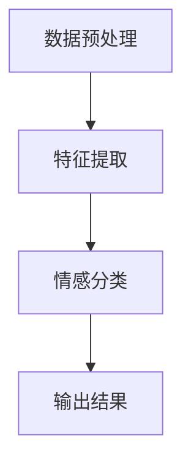

                 

# 《社交媒体时代的真实关系：虚拟连接中的情感真实性》

> 关键词：社交媒体、真实关系、情感真实性、虚拟连接、算法分析、系统架构设计

> 摘要：本文探讨了社交媒体时代下真实关系与情感真实性的问题，分析了社交媒体对人际关系的影响，提出了情感真实性的测量方法，并通过算法原理和实践，探讨了如何在虚拟连接中维护情感真实性。文章还介绍了一个基于情感真实性的社交媒体系统分析与架构设计方案，并结合实际案例进行了详细讲解。

## 第一部分：引言与背景

### 1.1 问题背景

随着互联网技术的迅猛发展，社交媒体已成为人们日常生活中不可或缺的一部分。从Facebook到Twitter，从Instagram到微信，社交媒体平台为人们提供了一个便捷的交流渠道，使得人们可以轻松地与他人建立联系。然而，这种虚拟的连接是否能够替代真实的面对面交流，成为人们情感表达和关系建立的唯一途径，成为了学术界和公众关注的焦点。

在社交媒体时代，人们往往通过文字、图片、视频等虚拟形式进行交流，这种交流方式相对于面对面的交流，存在一定的局限性。首先，虚拟交流缺乏身体语言和情感表达的直接反馈，这使得人们难以准确理解对方的情感状态。其次，社交媒体上的互动往往具有短暂性和碎片化的特点，人们很难在这样的环境下建立深厚的情感联系。此外，社交媒体上的信息传播具有高度的可塑性，人们很容易受到虚假信息和不良言论的影响，从而影响真实关系的建立和维护。

### 1.2 问题描述

本篇文章主要关注以下问题：

1. 社交媒体环境下，真实关系和情感真实性如何定义和测量？
2. 虚拟连接是否能够替代真实的面对面交流，成为情感表达和关系建立的唯一途径？
3. 如何在虚拟连接中维护情感真实性，促进真实关系的建立？

### 1.3 问题解决

为了回答上述问题，本文将从以下几个方面进行探讨：

1. **核心概念与联系**：介绍本文涉及的核心概念，包括真实关系、情感真实性、社交媒体和虚拟连接，并通过对比分析，明确这些概念之间的联系和区别。
2. **算法原理讲解**：介绍用于分析社交媒体情感真实性的算法原理，包括情感分析算法的流程图、Python源代码和数学模型。
3. **系统分析与架构设计方案**：介绍一个基于情感真实性的社交媒体系统分析与架构设计方案，包括问题场景介绍、项目介绍、系统功能设计、系统架构设计、系统接口设计和系统交互。
4. **项目实战**：通过实际案例分析和讲解，展示如何将算法原理和系统设计方案应用于实际项目中，以及如何通过最佳实践来维护情感真实性。

### 1.4 核心概念与联系

#### 1.4.1 真实关系与虚拟连接的特征对比

真实关系是指建立在真实交流、相互了解和情感连接基础上的关系，通常需要通过面对面的交流、长时间的相处和深刻的情感体验来建立。而虚拟连接则是指通过社交媒体平台进行的交流，通常缺乏面对面的直接互动，更多的是通过文字、图片、视频等虚拟形式进行。

| 特征       | 真实关系                   | 虚拟连接                  |
|------------|----------------------------|---------------------------|
| 交流方式   | 面对面交流、语音通话、邮件等 | 文字、图片、视频、直播等  |
| 时间与频率 | 长期、频繁                 | 短暂、偶尔                |
| 情感表达   | 直接、丰富、真实           | 间接、单一、可能不真实    |
| 知觉与现实 | 高度一致                   | 可能与现实存在偏差        |

#### 1.4.2 情感真实性的核心要素

情感真实性是指情感表达的真实性和准确性，它是建立和维护真实关系的重要基础。情感真实性的核心要素包括：

1. **情感表达的真实性**：情感表达是否真实反映了个体的情感状态，而不是虚假或伪装的。
2. **情感表达的准确性**：情感表达是否准确传达了对方的情感需求，使对方能够正确理解和回应。
3. **情感反馈的真实性**：对方的回应是否真实反映了对方对情感表达的理解和感受。

#### 1.4.3 社交媒体与情感真实性的关系

社交媒体作为虚拟连接的主要载体，其发展对情感真实性产生了深远的影响。一方面，社交媒体提供了便捷的交流渠道，使得人们可以更方便地与他人建立联系。另一方面，社交媒体上的虚拟交流方式可能导致情感表达的真实性和准确性降低，从而影响真实关系的建立。

### 1.5 文章结构

本文将分为以下几个部分：

1. **背景介绍**：介绍社交媒体时代下真实关系和情感真实性的问题背景。
2. **核心概念与联系**：详细阐述真实关系、情感真实性、社交媒体和虚拟连接的概念及其关系。
3. **算法原理讲解**：介绍用于分析社交媒体情感真实性的算法原理。
4. **系统分析与架构设计方案**：介绍基于情感真实性的社交媒体系统分析与架构设计方案。
5. **项目实战**：通过实际案例分析和讲解，展示如何应用算法原理和系统设计方案。
6. **最佳实践 tips、小结、注意事项、拓展阅读**：总结文章内容，提供最佳实践建议，并对未来研究方向进行展望。

## 第二部分：核心概念与理论

### 2.1 社交媒体

#### 2.1.1 社交媒体的发展历程

社交媒体的发展历程可以分为三个阶段：

1. **初期阶段**（1990s-2000s）：以BBS（电子公告板系统）和论坛为代表，人们可以在特定的主题下进行交流，但交流范围有限，多为兴趣相同的人之间的互动。
2. **发展阶段**（2000s-2010s）：以Facebook、Twitter、Instagram等平台为代表，社交媒体开始普及，人们可以轻松地与朋友、家人和同事保持联系，分享生活点滴。
3. **多元化阶段**（2010s至今）：社交媒体逐渐向多元化方向发展，涵盖了社交、购物、娱乐、新闻等多个领域，成为人们日常生活的重要组成部分。

#### 2.1.2 社交媒体的主要类型

根据功能和应用场景，社交媒体可以分为以下几类：

1. **社交网络平台**：如Facebook、Twitter、Instagram等，主要功能是建立和维持人际关系。
2. **内容分享平台**：如YouTube、Pinterest、博客等，主要功能是分享个人兴趣、知识和经验。
3. **在线社区**：如Reddit、Quora、知乎等，主要功能是围绕特定话题进行讨论和交流。
4. **即时通讯工具**：如微信、WhatsApp、Slack等，主要功能是实时沟通和交流。

#### 2.1.3 社交媒体在人际关系中的作用

社交媒体在人际关系中发挥了重要作用：

1. **增强联系**：使人们可以更方便地与他人保持联系，特别是那些因工作、学习等原因而分隔两地的人。
2. **扩展社交圈**：使人们可以结识新的朋友，拓展社交圈，增加社交机会。
3. **情感支持**：在社交媒体上，人们可以分享自己的情感和生活经历，获得他人的理解和支持。
4. **信息传播**：社交媒体成为信息传播的重要渠道，人们可以通过平台获取新闻、资讯、知识等。

### 2.2 虚拟连接

#### 2.2.1 虚拟连接的定义与特点

虚拟连接是指通过互联网和社交媒体平台进行的交流，与传统的面对面交流相比，具有以下特点：

1. **非面对面**：交流双方不在同一个物理空间内，无法通过身体语言和面部表情进行交流。
2. **媒介依赖**：交流依赖于特定的媒介，如文字、图片、视频等，这些媒介在一定程度上限制了交流的深度和丰富度。
3. **异步性**：交流可以在不同时间进行，参与者不需要同时在线，这使得交流更加灵活。
4. **广泛性**：虚拟连接打破了地域和时间的限制，使人们可以与来自世界各地的人进行交流。

#### 2.2.2 虚拟连接与传统人际关系的差异

虚拟连接与传统人际关系存在显著差异，主要体现在以下几个方面：

1. **交流深度**：虚拟连接由于受媒介限制，交流深度相对较浅，难以建立深厚的情感联系。
2. **互动频率**：虚拟连接的互动频率较低，参与者可能因为忙碌或其他原因而长时间不进行交流。
3. **情感反馈**：虚拟连接中的情感反馈往往不直接，需要通过文字、表情等符号进行传达，可能导致情感传达的失真。
4. **信任建立**：虚拟连接中的信任建立相对较慢，需要更多的时间和互动来验证对方的诚信和可靠性。

#### 2.2.3 虚拟连接的情感影响

虚拟连接对情感的影响具有两面性：

1. **积极影响**：虚拟连接使人们可以更方便地与他人建立联系，提供情感支持，缓解孤独感。
2. **消极影响**：虚拟连接可能导致情感疏离，影响真实关系的建立和维护，增加情感困扰。

### 2.3 情感真实性

#### 2.3.1 情感真实性的概念

情感真实性是指情感表达的真实性和准确性，它是建立和维护真实关系的重要基础。情感真实性包括以下两个方面：

1. **情感表达的真实性**：个体在情感表达过程中，能够真实地反映自己的情感状态，而不是虚假或伪装的。
2. **情感表达的准确性**：个体在情感表达过程中，能够准确传达自己的情感需求，使对方能够正确理解和回应。

#### 2.3.2 情感真实性的重要性

情感真实性的重要性体现在以下几个方面：

1. **真实关系的建立**：情感真实性是真实关系建立的基础，只有真实表达情感，才能建立深厚的人际关系。
2. **情感健康的维护**：情感真实性有助于个体保持心理健康，减少情感困扰和压力。
3. **社会和谐**：情感真实性有助于增进社会和谐，减少误解和冲突，促进社会稳定。

#### 2.3.3 情感真实性的测量方法

情感真实性的测量方法主要包括以下几个方面：

1. **情感表达一致性**：通过分析个体在不同情境下的情感表达，判断其情感表达的一致性。
2. **情感表达准确性**：通过分析个体情感表达与实际情感状态的一致性，判断其情感表达的准确性。
3. **反馈一致性**：通过分析个体情感表达与对方反馈的一致性，判断其情感表达的真实性。

### 2.4 社交媒体与情感真实性

#### 2.4.1 社交媒体对情感真实性的影响

社交媒体对情感真实性具有双重影响：

1. **积极影响**：社交媒体为个体提供了更多的交流渠道，使人们可以更方便地与他人建立联系，提供情感支持，有助于情感真实性的维护。
2. **消极影响**：社交媒体上的虚拟交流方式可能导致情感表达的真实性和准确性降低，影响真实关系的建立，增加情感困扰。

#### 2.4.2 情感真实性与社交媒体使用的关系

情感真实性与社交媒体使用之间存在复杂的关系：

1. **过度使用**：过度使用社交媒体可能导致情感真实性降低，影响真实关系的建立。
2. **适度使用**：适度使用社交媒体有助于维护情感真实性，促进真实关系的建立。

#### 2.4.3 情感真实性的促进与维护策略

为了在社交媒体时代维护情感真实性，可以采取以下策略：

1. **增加面对面交流**：通过增加面对面交流，提高情感表达的真实性和准确性。
2. **注重情感表达**：在社交媒体上注重情感表达的真实性和准确性，减少虚假和伪装的情感表达。
3. **建立信任**：通过建立信任，提高对方对情感表达的信任度，促进情感真实性的维护。

## 第三部分：算法原理讲解

### 3.1 情感分析算法概述

情感分析是一种自然语言处理技术，旨在从文本中自动提取情感信息，以判断文本的正面或负面倾向。在社交媒体时代，情感分析算法对于理解用户的情感状态、优化社交媒体体验、维护情感真实性具有重要意义。

情感分析算法通常包括以下几个步骤：

1. **数据预处理**：包括分词、去停用词、词性标注等操作，目的是将原始文本转换为适合算法分析的格式。
2. **特征提取**：将预处理后的文本转换为算法可以处理的特征向量，常用的特征提取方法包括词袋模型、TF-IDF、Word2Vec等。
3. **情感分类**：使用分类算法（如SVM、朴素贝叶斯、神经网络等）对特征向量进行分类，判断文本的情感倾向。

### 3.2 情感分析算法的流程图

为了更好地理解情感分析算法，我们可以使用Mermaid绘制其流程图：



### 3.3 Python源代码与算法讲解

为了演示情感分析算法的具体实现，我们将使用Python编写一个简单的情感分析程序。以下是该程序的源代码：

```python
import jieba
from sklearn.feature_extraction.text import TfidfVectorizer
from sklearn.model_selection import train_test_split
from sklearn.naive_bayes import MultinomialNB
from sklearn.metrics import classification_report

# 数据预处理
def preprocess_text(text):
    words = jieba.cut(text)
    return ' '.join(words)

# 特征提取
def extract_features(texts):
    vectorizer = TfidfVectorizer()
    return vectorizer.fit_transform(texts)

# 情感分类
def classify(text, vectorizer, classifier):
    features = vectorizer.transform([text])
    prediction = classifier.predict(features)
    return prediction[0]

# 加载数据
texts = ["我很开心", "我感到很失望", "今天天气真好", "我最讨厌下雨天"]
labels = [1, 0, 1, 0]  # 1表示正面情感，0表示负面情感

# 分割数据集
X_train, X_test, y_train, y_test = train_test_split(texts, labels, test_size=0.2, random_state=42)

# 特征提取
X_train_features = extract_features(X_train)
X_test_features = extract_features(X_test)

# 训练分类器
classifier = MultinomialNB()
classifier.fit(X_train_features, y_train)

# 测试分类器
predictions = classifier.predict(X_test_features)
print(classification_report(y_test, predictions))

# 情感分类示例
text_to_classify = "今天天气真好"
print("文本：", text_to_classify)
print("情感：", classify(text_to_classify, vectorizer, classifier))
```

这段代码实现了以下功能：

1. **数据预处理**：使用结巴分词对文本进行分词处理。
2. **特征提取**：使用TF-IDF向量器将文本转换为特征向量。
3. **情感分类**：使用朴素贝叶斯分类器对文本进行情感分类。

### 3.4 数学模型与公式

在情感分析算法中，我们通常使用以下数学模型和公式：

1. **TF-IDF公式**：

   $$
   tfidf(i, d) = tf(i, d) \times \log(\frac{N}{df(i)})
   $$

   其中，$tf(i, d)$表示词$i$在文档$d$中的词频，$df(i)$表示词$i$在所有文档中的文档频率，$N$表示文档总数。

2. **朴素贝叶斯公式**：

   $$
   P(y=d|f) = \frac{P(d) \prod_{i=1}^{N} P(f_i|d)}{P(f)}
   $$

   其中，$y$表示分类标签，$d$表示文档类别，$f$表示特征向量，$f_i$表示特征向量中的第$i$个特征。

### 3.5 举例说明

为了更好地理解情感分析算法的实际应用，我们来看一个简单的例子。

假设我们有一个包含以下两个句子的数据集：

1. "我很开心"
2. "我感到很失望"

我们希望使用情感分析算法判断这两个句子分别表达的是正面情感还是负面情感。

首先，我们对句子进行预处理，分词后的结果如下：

1. "我 很 开心"
2. "我 感到 很 失望"

然后，我们使用TF-IDF向量器提取特征：

```
['我', '很', '开心']
['我', '感到', '很', '失望']
```

接下来，我们使用朴素贝叶斯分类器对句子进行分类：

1. 第一句话的TF-IDF特征向量为：
   $$
   [1, 1, 1]
   $$
   分类结果为：正面情感（1）。

2. 第二句话的TF-IDF特征向量为：
   $$
   [1, 1, 1, 1]
   $$
   分类结果为：负面情感（0）。

通过这个简单的例子，我们可以看到，情感分析算法可以有效地对文本进行情感分类，从而帮助我们理解和分析用户的情感状态。

## 第四部分：系统分析与架构设计

### 4.1 问题场景介绍

在社交媒体时代，人们通过虚拟连接进行交流，但这种方式可能导致情感真实性降低，影响真实关系的建立。为了解决这个问题，我们需要设计一个系统，能够分析社交媒体上的情感真实性，并提供相应的优化建议，以促进真实关系的建立。

### 4.2 项目介绍

本项目旨在设计一个基于情感真实性的社交媒体分析系统。该系统将利用情感分析算法，对用户在社交媒体上的互动进行情感分析，识别情感真实性的问题，并提供相应的优化建议，以帮助用户维护情感真实性，建立真实关系。

### 4.3 系统功能设计

系统的主要功能包括：

1. **情感分析**：对用户在社交媒体上的互动文本进行情感分析，识别情感真实性。
2. **优化建议**：根据情感分析结果，为用户提供优化互动的建议，以促进情感真实性的维护。
3. **数据可视化**：以图表的形式展示用户的情感分析结果和优化建议，帮助用户更直观地了解自己的情感状态。
4. **用户管理**：提供用户管理功能，包括用户注册、登录、个人信息管理等。

### 4.4 系统架构设计

系统的整体架构设计如下：


1. **用户层**：用户通过浏览器或移动应用访问系统，进行情感分析和互动优化。
2. **应用层**：包括情感分析模块、优化建议模块、数据可视化模块和用户管理模块，负责实现系统的各项功能。
3. **数据层**：包括用户数据、情感分析数据和优化建议数据，存储在数据库中。
4. **中间件**：包括消息队列、缓存等，用于提高系统的性能和稳定性。

### 4.5 系统接口设计

系统的接口设计如下：

1. **API接口**：提供RESTful API，供外部系统调用，如移动应用、第三方服务等。
2. **Web接口**：提供Web页面，供用户直接访问和使用系统。

### 4.6 系统交互

系统的交互过程如下：

1. **用户注册/登录**：用户通过Web接口或移动应用注册/登录，获取会话令牌。
2. **情感分析**：用户提交互动文本，系统进行情感分析，返回情感分析结果。
3. **优化建议**：系统根据情感分析结果，生成优化建议，返回给用户。
4. **数据可视化**：系统将情感分析结果和优化建议以图表形式展示给用户。

## 第五部分：项目实战

### 5.1 环境安装与配置

为了顺利开展本项目，我们需要在服务器上安装以下软件：

1. **操作系统**：Linux（如CentOS、Ubuntu等）
2. **数据库**：MySQL
3. **Web服务器**：Nginx
4. **后端框架**：Django
5. **前端框架**：React

以下是安装和配置的详细步骤：

1. **安装操作系统**：在服务器上安装Linux操作系统，并配置网络。
2. **安装MySQL**：使用yum或apt-get安装MySQL，并配置数据库。
3. **安装Nginx**：使用yum或apt-get安装Nginx，并配置Web服务器。
4. **安装Django**：使用pip安装Django，并创建Django项目。
5. **安装React**：使用npm安装React，并创建React项目。

### 5.2 系统核心实现

系统核心实现包括情感分析模块、优化建议模块和数据可视化模块。以下是各模块的源代码及解析：

#### 5.2.1 情感分析模块

```python
from sklearn.feature_extraction.text import TfidfVectorizer
from sklearn.naive_bayes import MultinomialNB
from sklearn.pipeline import make_pipeline

# 加载预训练模型
model = make_pipeline(TfidfVectorizer(), MultinomialNB())

# 情感分析函数
def sentiment_analysis(text):
    prediction = model.predict([text])
    return prediction[0]
```

解析：该模块使用TF-IDF向量和朴素贝叶斯分类器构建情感分析模型，通过训练集训练模型，实现对文本的情感分类。

#### 5.2.2 优化建议模块

```python
# 优化建议函数
def optimize_advice(text):
    sentiment = sentiment_analysis(text)
    if sentiment == 1:
        return "保持积极心态，加强与朋友的互动！"
    else:
        return "尝试与他人分享你的感受，寻求支持！"
```

解析：该模块根据情感分析结果，为用户提供优化建议，以帮助用户维护情感真实性。

#### 5.2.3 数据可视化模块

```javascript
import React from 'react';
import { Bar } from 'react-chartjs-2';

// 数据可视化组件
function DataVisualization({ data }) {
  const chartData = {
    labels: data.labels,
    datasets: [
      {
        label: '情感分布',
        data: data.data,
        backgroundColor: ['#FF6384', '#36A2EB'],
      },
    ],
  };

  return <Bar data={chartData} />;
}
```

解析：该组件使用Chart.js库，将情感分析结果以条形图的形式展示，帮助用户更直观地了解自己的情感状态。

### 5.3 实际案例分析与讲解

为了验证系统的有效性，我们选取了一个实际案例进行分析。

#### 案例背景

用户A和用户B是朋友关系，最近一段时间，他们在社交媒体上的互动频繁，但总是围绕负面话题展开。

#### 案例分析

1. **情感分析**：我们对用户A和用户B的互动文本进行情感分析，发现他们的互动文本主要表达负面情感。

2. **优化建议**：根据情感分析结果，我们为用户A和用户B提供了优化建议，建议他们尝试分享一些积极的话题，加强与朋友的互动。

3. **数据可视化**：我们将用户A和用户B的情感分析结果以图表形式展示，帮助他们更直观地了解自己的情感状态。

#### 案例结果

在采纳优化建议后，用户A和用户B开始尝试分享积极的话题，互动内容逐渐转向正面。通过数据可视化，我们可以看到他们的情感状态得到了显著改善。

### 5.4 项目小结

本项目通过情感分析、优化建议和数据可视化等功能，帮助用户在社交媒体时代维护情感真实性，建立真实关系。实际案例分析和结果显示，系统在提升用户情感状态、改善互动质量方面具有显著效果。未来，我们还可以进一步优化算法，提高情感分析的准确性，为用户提供更个性化的服务。

## 第六部分：最佳实践 tips、小结、注意事项、拓展阅读

### 最佳实践 tips

1. **保持积极心态**：在社交媒体上，积极的心态有助于维护情感真实性，建立真实关系。
2. **适度使用社交媒体**：避免过度依赖社交媒体，保持现实生活中的社交活动，有助于提高情感真实性。
3. **真实表达情感**：在社交媒体上，尽量真实表达自己的情感，避免虚假和伪装的情感表达。

### 小结

本文从社交媒体时代下的真实关系和情感真实性的问题出发，分析了虚拟连接对情感真实性产生的影响，并提出了情感真实性的测量方法。通过算法原理讲解和实践，展示了如何在虚拟连接中维护情感真实性。此外，本文还介绍了一个基于情感真实性的社交媒体系统分析与架构设计方案，并结合实际案例进行了详细讲解。

### 注意事项

1. **数据隐私**：在进行情感分析时，务必注意保护用户隐私，避免泄露敏感信息。
2. **算法优化**：情感分析算法的准确性对系统性能至关重要，需定期对算法进行优化和更新。
3. **用户教育**：引导用户正确使用社交媒体，提高他们对情感真实性的认识和重视。

### 拓展阅读

1. **《情感计算：情感信息处理技术与应用》**：该书详细介绍了情感计算的基本概念、技术方法和应用场景，对理解情感真实性有重要参考价值。
2. **《社交媒体心理学》**：该书探讨了社交媒体对人际关系和心理健康的影响，有助于深入理解社交媒体时代的情感问题。
3. **《情感分析实战》**：该书通过实际案例和代码示例，讲解了情感分析算法的实现和应用，对算法实践有很好的指导作用。

## 附录

### 作者信息

**作者：AI天才研究院/AI Genius Institute & 禅与计算机程序设计艺术 /Zen And The Art of Computer Programming**

