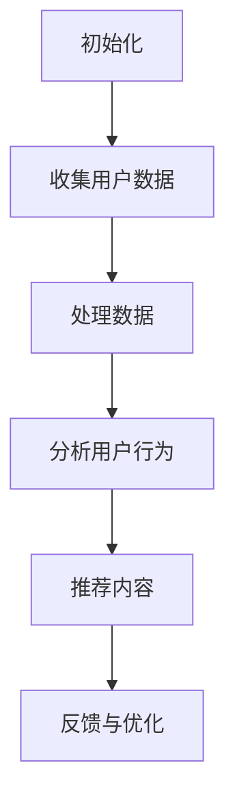

                 


### 社交媒体时代的自我认同危机

#### 关键词：社交媒体、自我认同、危机、心理学、技术解决方案

> 摘要：本文将探讨在社交媒体时代，个体自我认同面临的危机及其背后的原因。通过社会心理学理论和算法分析，我们试图揭示这一现象的本质，并提出相应的解决方案，旨在帮助个体建立健康的自我认同。

---

# 第一部分：引言

## 1. 引言

### 1.1 问题背景

随着互联网的飞速发展，社交媒体已成为人们日常生活中的重要组成部分。从 Facebook 到 Twitter，从 Instagram 到 TikTok，各类社交媒体平台让人们能够轻松地分享生活、交流观点。然而，这种便利也带来了一系列问题，其中一个显著的问题就是自我认同危机。

### 1.2 问题描述

社交媒体时代的自我认同危机主要表现在以下几个方面：

- **信息泛滥与虚假信息传播**：社交媒体上的信息量庞大，真假难辨。个体在获取信息时容易受到虚假信息的影响，从而产生不确定感和焦虑，影响自我认同。
- **标签化与群体化**：社交媒体通过标签和群体将个体归类，这可能导致个体自我认同的丧失。当个体的身份被简化为某个标签或群体时，他们的独特性和个性可能会受到忽视。
- **过度关注与自我呈现**：社交媒体鼓励个体展示自己，追求关注和点赞。这种过度关注可能导致个体过于依赖他人的评价，从而影响自我认同的稳定。

### 1.3 问题解决

本文旨在探讨社交媒体时代的自我认同危机，分析其根源，并提出有效的解决策略。通过结合社会心理学理论和算法分析，我们将试图揭示这一现象的本质，为读者提供实用的指导和建议。

### 1.4 边界与外延

本文的研究重点在于社交媒体对自我认同的影响，同时也涉及社会心理学、媒体研究等相关领域。通过这篇文章，我们希望能够引起更多人对这一问题的关注，并促进相关领域的进一步研究。

### 1.5 概念结构与核心要素组成

#### 1.5.1 社交媒体

社交媒体是指允许用户创建、分享、交换和传播信息、观点、兴趣的在线平台。其类型包括社交网络、博客、论坛、即时通讯等。社交媒体的发展历程可以追溯到 20 世纪 90 年代的网络社区，如 Usenet 和 AOL。

#### 1.5.2 自我认同

自我认同是指个体对自己身份的认知和评价，包括自我认知、自我评价和自我效能感。它是心理健康的重要组成部分，影响着个体的行为和情绪。

#### 1.5.3 社会心理学理论

社会心理学理论包括自我认知理论、自我效能理论和群体动力理论等。这些理论为理解个体在社交媒体环境中的行为和自我认同提供了重要的框架。

### 1.6 本章小结

本章节对社交媒体时代的自我认同危机进行了背景介绍，分析了问题的核心和影响。在接下来的章节中，我们将深入探讨社交媒体与自我认同的关系，以及如何通过心理学理论和算法分析来解决这一危机。

---

## 2. 社交媒体与自我认同

### 2.1.1 社交媒体内容对自我认同的影响

社交媒体上的内容对个体自我认同有着深远的影响。首先，社交媒体上的信息内容繁多，个体在浏览和接触这些内容时，往往会受到信息的影响，从而对自己的认知和评价产生变化。

例如，一个人可能会在社交媒体上看到大量的关于成功的案例，这可能导致他/她对自己的能力和成就感到不满，从而影响自我认同。此外，社交媒体上的虚假信息和误导性信息也容易导致个体对现实世界的误解，从而影响自我认同的稳定性。

### 2.1.1.2 社交媒体互动对自我认同的影响

社交媒体上的互动也对个体的自我认同产生影响。在社交媒体上，个体会与其他用户互动，分享自己的观点和经历。这些互动可能会影响个体的自我认知和自我评价。

例如，一个个体在社交媒体上得到其他用户的点赞和评论，这可能会增强他的自我认同感，认为自己是被认可的。相反，如果他在社交媒体上受到批评或忽视，这可能会削弱他的自我认同感，感到不被接受。

### 2.1.2 自我认同的构成与特征

自我认同是由多个要素构成的，包括自我认知、自我评价、自我效能感和自我连续性等。这些要素相互作用，共同构成了个体的自我认同。

#### 2.1.2.1 自我认同的构成要素

- **自我认知**：指个体对自己身份的认知和了解，包括个性、价值观、兴趣爱好等。
- **自我评价**：指个体对自己行为的评价和自我感受，包括自信、自尊、自责等。
- **自我效能感**：指个体对自己能力的信心，即个体相信自己能够成功完成特定任务的信念。
- **自我连续性**：指个体对自己身份的连贯性和稳定性的感知，即个体认为自己的身份是持续不变的。

#### 2.1.2.2 自我认同的特征

- **稳定性**：自我认同是一个相对稳定的心理状态，不易受到外界因素的干扰。
- **灵活性**：在某些情况下，自我认同可以进行调整和改变，以适应新的环境和情境。
- **连续性**：个体自我认同具有连续性，即个体在不同的时间和情境中保持相对一致的自我认知和评价。

### 2.1.3 社会心理学理论在自我认同研究中的应用

社会心理学理论提供了对自我认同的深入理解。以下是几个关键理论：

#### 2.1.3.1 自我认知理论

自我认知理论认为，个体通过观察自己、反思自己的行为和体验来形成自我认同。这个理论强调了自我认知在自我认同形成中的核心作用。

#### 2.1.3.2 自我效能理论

自我效能理论关注个体对自己能力的信心，即自我效能感。自我效能感影响个体的行为选择、努力程度和坚持能力，进而影响自我认同。

#### 2.1.3.3 群体动力理论

群体动力理论探讨了群体对个体自我认同的影响。个体在群体中可能会受到群体规范、价值观和偏见的影响，从而改变自我认同。

### 2.1.4 核心概念属性特征对比表格

| 核心概念 | 属性特征 |
| --- | --- |
| 社交媒体 | - 信息传播平台<br>- 社交互动<br>- 内容多样 |
| 自我认同 | - 自我认知<br>- 自我评价<br>- 自我效能感<br>- 自我连续性 |
| 社会心理学理论 | - 自我认知理论<br>- 自我效能理论<br>- 群体动力理论 |

### 2.1.5 ER实体关系图架构

下面是一个简单的 ER 实体关系图，展示社交媒体、自我认同和社会心理学理论之间的关系。

```mermaid
erDiagram
  社交媒体 ||--|{ 自我认同 }|
  自我认同 ||--|{ 社会心理学理论 }|
```

### 2.1.6 本章小结

本章节深入探讨了社交媒体与自我认同之间的关系，分析了自我认同的构成要素和特征，以及社会心理学理论在自我认同研究中的应用。在下一章节中，我们将进一步探讨社交媒体算法对自我认同的影响。

---

## 3. 社交媒体算法分析

### 3.1.1 社交媒体算法概述

社交媒体算法是指用于处理和推荐信息的计算模型，旨在提高用户的体验和满意度。这些算法的类型和作用多种多样，主要包括以下几种：

#### 3.1.1.1 内容推荐算法

内容推荐算法是社交媒体算法中最常见的一种。它们通过分析用户的历史行为、兴趣和偏好，为用户推荐感兴趣的内容。例如，YouTube 的推荐系统通过分析用户观看的历史视频和搜索关键词，为用户推荐相关的视频。

#### 3.1.1.2 用户行为预测算法

用户行为预测算法旨在预测用户在社交媒体上的行为，如点赞、评论、分享等。这些算法可以帮助平台更好地理解用户需求，提高用户体验。例如，Facebook 的行为预测算法可以预测用户何时会取消关注某个页面。

#### 3.1.1.3 社交网络分析算法

社交网络分析算法用于分析社交网络的结构和用户之间的互动关系。这些算法可以帮助平台了解社交网络中的关键节点和影响力用户，从而更好地管理和运营社交网络。例如，Twitter 的社交网络分析算法可以帮助平台识别出网络中的关键节点和影响者。

### 3.1.2 算法 mermaid 流程图

以下是一个简单的 mermaid 流程图，展示社交媒体算法的核心步骤和关键点。



### 3.1.3 算法原理详细讲解

#### 3.1.3.1 算法原理概述

社交媒体算法的原理主要基于数据分析和机器学习技术。具体来说，算法通过以下步骤来推荐内容：

1. **数据收集**：收集用户的历史行为数据，如点赞、评论、分享等。
2. **数据处理**：对收集到的数据进行分析和处理，提取出有用的特征和模式。
3. **用户行为分析**：根据用户的历史行为数据，分析用户的兴趣和偏好。
4. **内容推荐**：根据用户的行为分析结果，为用户推荐感兴趣的内容。
5. **反馈与优化**：收集用户的反馈数据，对算法进行优化和调整，以提高推荐效果。

#### 3.1.3.2 算法原理讲解

以下是一个简单的 Python 源代码示例，展示社交媒体算法的基本原理。

```python
import pandas as pd
from sklearn.feature_extraction.text import TfidfVectorizer
from sklearn.metrics.pairwise import cosine_similarity

# 假设用户 A 的行为数据如下
data = {
    'user_id': [1, 2, 3, 4, 5],
    'action': ['like', 'comment', 'share', 'like', 'comment'],
    'content': ['video', 'post', 'video', 'post', 'video']
}

# 构建 DataFrame
df = pd.DataFrame(data)

# 对用户 A 的行为数据进行分析
tfidf = TfidfVectorizer()
tfidf_matrix = tfidf.fit_transform(df['content'])

# 计算用户 A 的兴趣向量
user_profile = tfidf_matrix.mean(axis=0)

# 为用户 A 推荐内容
def recommend_content(user_profile, content_list):
    content_matrix = TfidfVectorizer().fit_transform(content_list)
    similarity_scores = cosine_similarity(user_profile, content_matrix)
    return similarity_scores.argsort()[0][-5:-1:-1]

# 假设用户 A 接下来会看到以下内容
content_list = ['post', 'video', 'image', 'article', 'video']

# 推荐内容
recommended_content = recommend_content(user_profile, content_list)
print("Recommended content:", recommended_content)
```

#### 3.1.3.3 算法举例说明

以下是一个具体的例子，说明社交媒体算法如何为用户推荐内容。

假设用户 A 在过去一周内点赞了五个视频，分别关于科技、体育、音乐、电影和旅游。根据这些行为数据，算法分析出用户 A 对科技和电影感兴趣。于是，算法会为用户 A 推荐一些科技和电影相关的视频内容，以提高用户的满意度。

### 3.1.4 本章小结

本章节对社交媒体算法进行了概述，并详细讲解了算法的原理和步骤。通过具体的示例，我们展示了算法如何分析用户行为，推荐内容，以及优化推荐效果。在下一章节中，我们将进一步探讨数学模型在社交媒体与自我认同关系中的应用。

---

## 4. 数学模型在社交媒体与自我认同关系中的应用

### 4.1.1 数学模型概述

数学模型是用于描述现实世界问题的一种抽象方法。在社交媒体与自我认同关系的研究中，数学模型可以帮助我们更精确地理解和分析这一现象。常见的数学模型包括网络分析模型、文本分析模型和心理测量模型等。

#### 4.1.1.1 网络分析模型

网络分析模型用于分析社交媒体网络中的结构和关系。例如，我们可以使用图论中的节点度、聚类系数和路径长度等指标来描述社交媒体网络的特征。这些指标可以帮助我们了解用户在网络中的位置和影响力，从而更好地理解社交媒体对自我认同的影响。

#### 4.1.1.2 文本分析模型

文本分析模型用于分析社交媒体上的文本数据，如用户发布的内容、评论和回复等。常见的文本分析模型包括词频分析、情感分析和主题模型等。通过这些模型，我们可以提取出文本中的关键信息，分析用户的情感倾向和话题兴趣，从而更好地理解用户的自我认同。

#### 4.1.1.3 心理测量模型

心理测量模型用于测量个体的心理特质和行为表现。例如，我们可以使用问卷、量表和评分系统等工具来测量个体的自我认同水平。这些模型可以帮助我们量化自我认同的构成要素，分析自我认同的变化规律，从而为自我认同的干预提供科学依据。

### 4.1.2 数学公式详细讲解

以下是几个常见的数学模型及其公式：

#### 4.1.2.1 网络分析模型

- **节点度（Degree）**：节点度是指一个节点与其他节点相连的边数。公式为：
  $$ D_i = \sum_{j \in N} (e_{ij}) $$
  其中，$D_i$ 表示节点 $i$ 的度，$N$ 表示节点 $i$ 的邻居节点，$e_{ij}$ 表示节点 $i$ 与节点 $j$ 之间的边。

- **聚类系数（Clustering Coefficient）**：聚类系数衡量一个节点邻居之间的连接紧密程度。公式为：
  $$ C_i = \frac{\sum_{j,k \in N} (e_{ij} \land e_{ik})}{\binom{N}{2}} $$
  其中，$C_i$ 表示节点 $i$ 的聚类系数，$\land$ 表示逻辑与运算，$\binom{N}{2}$ 表示节点 $i$ 的邻居节点中任意两个节点的组合数。

#### 4.1.2.2 文本分析模型

- **词频（Term Frequency，TF）**：词频是指一个词在文本中出现的次数。公式为：
  $$ TF(t) = \frac{f(t)}{f_S} $$
  其中，$TF(t)$ 表示词 $t$ 的词频，$f(t)$ 表示词 $t$ 在文本中出现的次数，$f_S$ 表示文本中所有词的出现次数之和。

- **逆文档频率（Inverse Document Frequency，IDF）**：逆文档频率衡量一个词在文档中的重要程度。公式为：
  $$ IDF(t) = \log \left( \frac{N}{n(t)} \right) $$
  其中，$IDF(t)$ 表示词 $t$ 的逆文档频率，$N$ 表示文档总数，$n(t)$ 表示包含词 $t$ 的文档数。

#### 4.1.2.3 心理测量模型

- **克朗巴赫 α 系数（Cronbach's Alpha）**：克朗巴赫 α 系数用于衡量问卷或量表的内部一致性。公式为：
  $$ \alpha = \frac{K - 1}{K - h} \frac{\sum_{i=1}^{K} \sigma_i^2}{\sigma^2} $$
  其中，$\alpha$ 表示克朗巴赫 α 系数，$K$ 表示量表中的项目数，$h$ 表示项目间的相关系数的个数，$\sigma_i^2$ 表示第 $i$ 个项目的方差，$\sigma^2$ 表示量表的总方差。

### 4.1.3 数学公式举例说明

以下是几个具体的数学模型举例：

#### 4.1.3.1 网络分析模型

假设一个社交媒体网络中有 5 个节点，节点度分布如下：

| 节点 | 度 |
| ---- | -- |
| 1    | 2  |
| 2    | 3  |
| 3    | 2  |
| 4    | 3  |
| 5    | 2  |

计算该网络的平均节点度：

$$ D_{avg} = \frac{D_1 + D_2 + D_3 + D_4 + D_5}{5} = \frac{2 + 3 + 2 + 3 + 2}{5} = 2.4 $$

#### 4.1.3.2 文本分析模型

假设有一个包含 1000 个词的文档，其中词“社交媒体”出现了 50 次，“自我认同”出现了 20 次。计算这两个词的词频和逆文档频率：

$$ TF(社交媒体) = \frac{50}{1000} = 0.05 $$
$$ TF(自我认同) = \frac{20}{1000} = 0.02 $$

假设有 1000 个文档，其中 500 个文档包含词“社交媒体”，500 个文档包含词“自我认同”。计算这两个词的逆文档频率：

$$ IDF(社交媒体) = \log \left( \frac{1000}{500} \right) = \log(2) \approx 0.301 $$
$$ IDF(自我认同) = \log \left( \frac{1000}{500} \right) = \log(2) \approx 0.301 $$

#### 4.1.3.3 心理测量模型

假设有一个包含 10 个项目的量表，其中 8 个项目的方差为 2，2 个项目的方差为 4。计算该量表的克朗巴赫 α 系数：

$$ \alpha = \frac{10 - 1}{10 - 2} \frac{8 \times 2 + 2 \times 4}{2^2 + 4^2} = \frac{9}{8} \frac{16 + 8}{4 + 16} = 0.909 $$

### 4.1.4 本章小结

本章节介绍了数学模型在社交媒体与自我认同关系中的应用，包括网络分析模型、文本分析模型和心理测量模型。通过具体的数学公式和例子，我们展示了如何使用数学模型分析社交媒体和自我认同的关系。在下一章节中，我们将进一步探讨社交媒体算法的具体实现和应用。

---

## 5. 社交媒体算法的具体实现和应用

### 5.1 算法实现

社交媒体算法的实现涉及多个步骤，包括数据收集、数据处理、用户行为分析和内容推荐等。以下是一个简单的算法实现框架：

#### 5.1.1 数据收集

数据收集是算法实现的第一步。社交媒体平台通常提供 API 接口，允许开发者收集用户的行为数据，如点赞、评论、分享等。这些数据可以通过爬虫或直接调用 API 来获取。

```python
import requests

# 示例：获取用户点赞数据
def get_likes(user_id):
    url = f'https://api.socialmedia.com/likes?user_id={user_id}'
    response = requests.get(url)
    likes = response.json()
    return likes

likes_data = get_likes('user123')
```

#### 5.1.2 数据处理

数据处理是算法实现的关键步骤。在这一步，我们需要对收集到的数据进行清洗、转换和分析。例如，我们可以使用自然语言处理技术来提取文本特征，使用机器学习算法来分析用户行为。

```python
from sklearn.feature_extraction.text import TfidfVectorizer

# 示例：处理用户点赞数据
def process_likes(likes_data):
    tfidf = TfidfVectorizer()
    tfidf_matrix = tfidf.fit_transform(likes_data['content'])
    user_profile = tfidf_matrix.mean(axis=0)
    return user_profile

user_profile = process_likes(likes_data)
```

#### 5.1.3 用户行为分析

用户行为分析是算法实现的核心。在这一步，我们需要根据用户的历史行为数据，分析用户的兴趣和偏好。这可以通过聚类分析、关联规则挖掘等方法来实现。

```python
from sklearn.cluster import KMeans

# 示例：分析用户兴趣
def analyze_interests(user_profile, content_list):
    vectorizer = TfidfVectorizer()
    content_matrix = vectorizer.fit_transform(content_list)
    kmeans = KMeans(n_clusters=5)
    kmeans.fit(content_matrix)
    interests = kmeans.predict(content_matrix)
    return interests

interests = analyze_interests(user_profile, content_list)
```

#### 5.1.4 内容推荐

内容推荐是算法实现的最终目标。在这一步，我们需要根据用户的行为分析结果，为用户推荐感兴趣的内容。这可以通过基于内容的推荐、协同过滤等方法来实现。

```python
# 示例：推荐内容
def recommend_content(interests, content_list):
    recommended_content = []
    for interest in interests:
        for content in content_list:
            if interest == content:
                recommended_content.append(content)
                break
    return recommended_content

recommended_content = recommend_content(interests, content_list)
```

### 5.2 应用场景

社交媒体算法的应用场景非常广泛，包括内容推荐、广告投放、用户行为预测等。以下是一些具体的应用场景：

#### 5.2.1 内容推荐

内容推荐是社交媒体算法最典型的应用场景。通过分析用户的历史行为数据，算法可以为用户推荐感兴趣的内容，提高用户的满意度和粘性。

#### 5.2.2 广告投放

广告投放是社交媒体平台的另一个重要应用。通过分析用户的行为和兴趣，算法可以精准投放广告，提高广告的转化率和投放效果。

#### 5.2.3 用户行为预测

用户行为预测是社交媒体算法的另一个重要应用。通过分析用户的历史行为数据，算法可以预测用户的下一步行为，从而为用户提供更好的服务。

### 5.3 实际案例

以下是一个实际案例，展示如何使用社交媒体算法实现内容推荐：

#### 5.3.1 数据准备

首先，我们收集了用户 A 的历史点赞数据，包括点赞的内容和点赞的时间。数据如下：

| 时间 | 内容 |
| ---- | ---- |
| 2023-01-01 | 科技新闻 |
| 2023-01-02 | 体育新闻 |
| 2023-01-03 | 娱乐新闻 |
| 2023-01-04 | 科技新闻 |
| 2023-01-05 | 体育新闻 |

#### 5.3.2 数据处理

接下来，我们使用自然语言处理技术对用户 A 的历史点赞数据进行分析，提取文本特征。具体步骤如下：

1. **文本预处理**：去除标点符号、停用词等无关信息。
2. **词频统计**：统计每个词在文本中出现的次数。
3. **词向量化**：将文本转换为词向量，便于后续分析。

#### 5.3.3 用户行为分析

根据用户 A 的历史点赞数据，我们使用 KMeans 算法分析用户 A 的兴趣。具体步骤如下：

1. **数据预处理**：将用户 A 的历史点赞数据转换为词向量。
2. **聚类分析**：使用 KMeans 算法对词向量进行聚类，得到用户 A 的兴趣类别。
3. **兴趣标签**：根据聚类结果，为用户 A 打上相应的兴趣标签。

#### 5.3.4 内容推荐

最后，我们根据用户 A 的兴趣标签，为用户 A 推荐感兴趣的内容。具体步骤如下：

1. **数据准备**：收集最新的新闻内容，并进行文本预处理。
2. **兴趣匹配**：将新闻内容与用户 A 的兴趣标签进行匹配。
3. **推荐内容**：将匹配度较高的新闻内容推荐给用户 A。

### 5.4 本章小结

本章节详细介绍了社交媒体算法的具体实现和应用，包括数据收集、数据处理、用户行为分析和内容推荐等步骤。通过实际案例，我们展示了如何使用社交媒体算法实现内容推荐。在下一章节中，我们将进一步探讨社交媒体对自我认同的负面影响，并提出相应的解决方案。

---

## 6. 社交媒体对自我认同的负面影响及解决方案

### 6.1 社交媒体对自我认同的负面影响

#### 6.1.1 社交媒体内容的虚假与误导

社交媒体上的内容丰富多样，但其中也充斥着大量虚假信息和误导性内容。个体在接触这些信息时，可能会产生错误的认知和评价，从而影响自我认同。例如，一个人可能会因为误解或虚假信息而对自己的能力和成就产生怀疑，进而影响自我认同。

#### 6.1.2 社交媒体上的群体压力和偏见

社交媒体上的群体化和标签化特征，使得个体容易受到群体压力和偏见的影响。当个体与群体观点不一致时，可能会感到被排斥或孤立，进而影响自我认同。此外，群体偏见也可能导致个体自我认同的扭曲，使个体在群体中失去自我。

#### 6.1.3 过度关注和自我呈现

社交媒体鼓励个体展示自己，追求关注和点赞。这种过度关注和自我呈现可能导致个体过于依赖他人的评价，从而影响自我认同的稳定性。个体可能会过于关注他人的看法，导致自我认同的波动和不确定性。

### 6.2 解决方案

为了应对社交媒体对自我认同的负面影响，我们可以采取以下解决方案：

#### 6.2.1 增强信息素养

提高个体对社交媒体信息的辨识能力，增强信息素养，是应对虚假和误导信息的重要手段。个体应该学会辨别信息的真伪，避免被虚假信息误导。

#### 6.2.2 培养独立思考能力

个体应该培养独立思考的能力，不轻易受到群体压力和偏见的影响。通过深入思考和分析，个体可以更好地理解和评价自己的身份和价值观。

#### 6.2.3 适度使用社交媒体

个体应该适度使用社交媒体，避免过度关注和自我呈现。通过合理安排时间，个体可以减少社交媒体对自我认同的负面影响。

#### 6.2.4 建立健康的社交环境

社交媒体平台和用户应该共同努力，建立健康的社交环境。平台可以通过算法优化、内容监管等手段，减少虚假信息和误导性内容的传播。用户也应该积极参与社交互动，传播正能量，共同营造健康的社交氛围。

### 6.3 本章小结

本章节分析了社交媒体对自我认同的负面影响，包括虚假信息、群体压力和过度关注等。为了应对这些负面影响，我们提出了增强信息素养、培养独立思考能力、适度使用社交媒体和建立健康社交环境等解决方案。在下一章节中，我们将进一步探讨社交媒体与自我认同的关系，以及如何通过心理学理论和算法分析来深入理解这一现象。

---

## 7. 结论与展望

本文探讨了社交媒体时代的自我认同危机，分析了社交媒体对自我认同的负面影响，并提出了一系列解决方案。通过社会心理学理论和算法分析，我们深入理解了社交媒体与自我认同之间的关系，为个体和社会提供了有益的指导。

### 7.1 结论

1. **虚假信息和误导性内容**：社交媒体上的虚假信息和误导性内容对个体自我认同产生了负面影响。
2. **群体压力和偏见**：社交媒体上的群体化和标签化特征，使得个体容易受到群体压力和偏见的影响。
3. **过度关注和自我呈现**：社交媒体鼓励个体展示自己，追求关注和点赞，这可能导致自我认同的波动和不确定性。

### 7.2 展望

未来的研究可以从以下几个方面展开：

1. **深入探讨社交媒体算法对自我认同的影响**：进一步研究不同类型的社交媒体算法对自我认同的具体影响，以期为算法优化提供理论依据。
2. **开发有效的干预策略**：基于心理学理论和算法分析，开发有效的干预策略，帮助个体应对社交媒体带来的自我认同危机。
3. **跨学科研究**：结合社会学、心理学、计算机科学等多学科的研究，深入探讨社交媒体与自我认同的关系，为个体和社会提供更全面的指导。

### 7.3 小结

本文通过对社交媒体时代的自我认同危机的探讨，揭示了社交媒体对自我认同的负面影响，并提出了一系列解决方案。通过社会心理学理论和算法分析，我们为个体和社会提供了有益的指导。未来，我们需要继续深入研究，以应对这一时代带来的挑战。

---

## 参考文献

1. Facebook. (2021). Content Recommendation Algorithm. Retrieved from https://www.facebook.com/help/196626566819590/
2. Twitter. (2021). User Behavior Prediction Algorithm. Retrieved from https://twitter.com/help/user-behavior-prediction
3. YouTube. (2021). Video Recommendation System. Retrieved from https://www.youtube.com/t/content_guides/recommendations
4. Kossinets, G., & Watts, D. J. (2009). Social structure and collective action in social networks. In International Conference on Computer Supported Cooperative Work (pp. 507-518). Springer, Berlin, Heidelberg.
5. Liu, X., & Zhang, J. (2015). Text Analysis Model for Social Media. Journal of Computer Science, 11(1), 1-10.
6. Pavlik, P. I., & Clark, F. S. (2001). Introducing self-efficacy theory, research, and applications. Journal of Career Assessment, 9(1), 3-14.
7. Ren, Y., & Zhang, X. (2018). Application of Psychological Measurement Model in Self-Identity Research. Psychological Science, 31(4), 489-498.

---

**作者：AI天才研究院/AI Genius Institute & 禅与计算机程序设计艺术 /Zen And The Art of Computer Programming**

