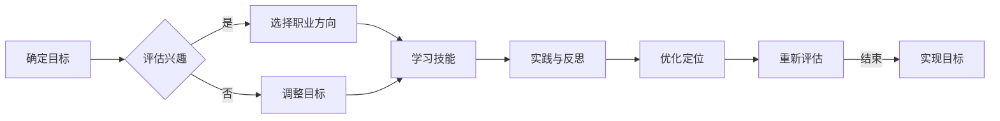
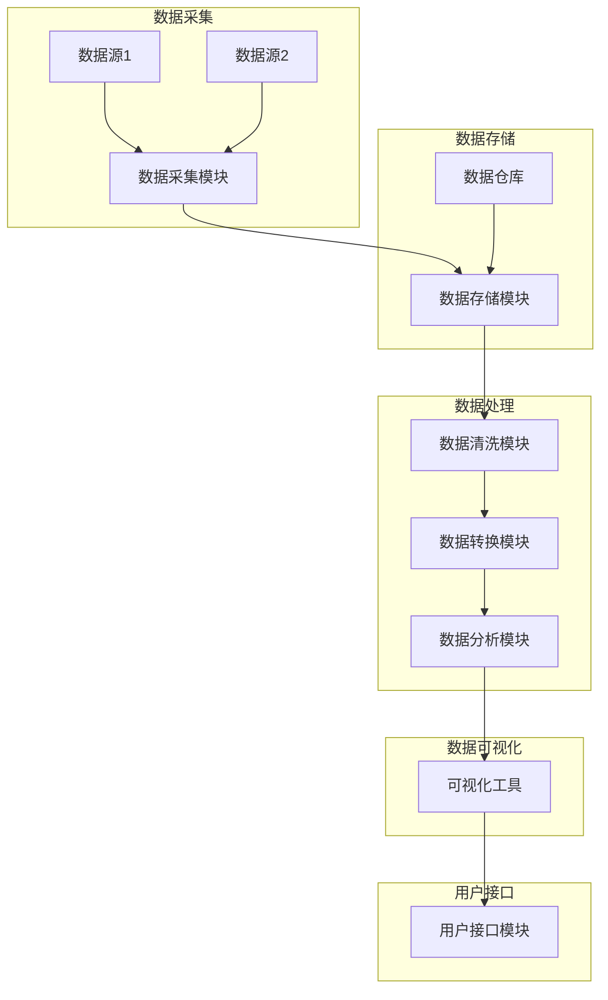
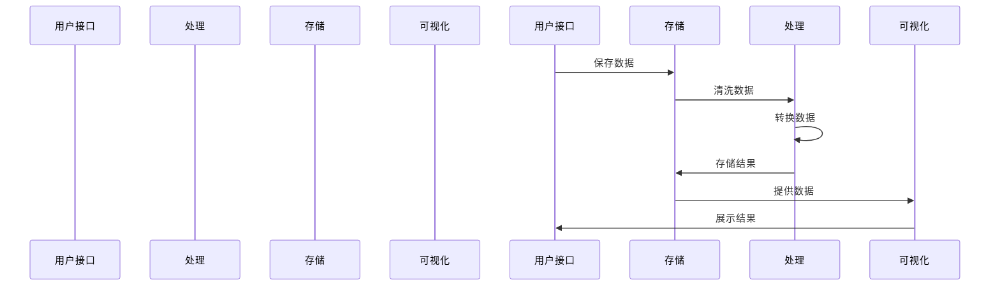

                 

# 社会变革中的个人定位

## 关键词：社会变革、个人定位、技术进步、政策环境、市场需求、自我认知

## 摘要

本文从社会变革的角度出发，探讨了个人定位的重要性和复杂性。通过分析技术进步、政策环境、市场需求等多方面因素，本文深入探讨了社会变革对个人定位的影响，并提出了自我认知、持续学习、适应变革等策略，帮助读者在社会变革中找到并巩固自己的定位。

## 第一部分：引言

### 1.1 问题背景

#### 1.1.1 社会变革

在全球化、信息化和智能化的时代背景下，社会变革已经成为不可避免的趋势。经济模式、政治结构、文化观念等方面都在发生深刻的变化，这为个人的定位带来了新的挑战和机遇。

随着互联网、人工智能等技术的快速发展，人类社会正经历着前所未有的变革。这些技术不仅改变了传统行业的运作模式，还创造了新的职业岗位，对个人定位提出了新的要求。同时，政策环境的变化和市场需求的波动，也使得个人在职业发展过程中面临更多的不确定性。

#### 1.1.2 个人定位的重要性

个人定位不仅仅关系到个人的职业发展，还关系到个人的生活质量和幸福感。在社会的快速变化中，如何找到自己的定位，发挥自己的优势，实现个人价值，成为每个人都需要思考的问题。

一个明确的个人定位有助于个人在职业生涯中做出更明智的决策，避免盲目跟风和频繁跳槽。同时，个人定位也关系到个人的生活方式和价值观念，有助于实现个人成长和幸福感。

### 1.2 核心概念

#### 1.2.1 个人定位

个人定位是指一个人在社会中所处的角色、地位和作用。它包括职业定位、生活定位和价值定位三个方面。

职业定位是指个人在职业发展中所选择的专业领域和职业方向。生活定位是指个人在日常生活中所追求的生活方式和生活质量。价值定位是指个人对人生意义的理解和追求，体现了个人的价值观和人生目标。

#### 1.2.2 社会变革中的个人定位

在社会变革中，个人定位受到多种因素的影响，如技术进步、政策环境、市场需求等。如何适应这些变化，找到自己的定位，成为每个个体都需要面对的课题。

技术进步带来了新的职业机会和挑战，政策环境的变化影响了行业的兴衰和就业市场的变化，市场需求的波动则决定了个人职业发展的方向和稳定性。在这些因素的共同作用下，个人定位需要不断地进行调整和优化。

### 1.3 边界与外延

#### 1.3.1 边界

个人定位的边界主要是指个人能力和资源的限制。每个人的能力和资源都是有限的，如何在有限的范围内找到最佳的定位，是个人定位的关键。

个人定位的边界包括知识边界、技能边界、资源边界等。了解自己的能力和资源，明确自己的优势和短板，有助于找到合适的定位。

#### 1.3.2 外延

个人定位的外延主要是指个人在职业、生活、价值等方面的扩展。随着社会变革的深入，个人的定位不仅局限于某个特定的领域，还需要考虑跨领域、跨行业的扩展。

个人定位的外延可以帮助个人实现更广泛的职业发展，提高个人竞争力，同时也为个人带来了更多的机会和挑战。

### 1.4 概念结构与核心要素组成

#### 1.4.1 概念结构

个人定位的概念结构包括个人、社会、环境三个部分。个人是核心，社会是背景，环境是条件。

- 个人：个人的兴趣、能力、价值观等内在因素。
- 社会：社会环境、政策、市场需求等外部因素。
- 环境：技术进步、文化氛围、教育体系等环境因素。

#### 1.4.2 核心要素组成

个人定位的核心要素包括能力、价值观、资源、环境等。这些要素相互作用，共同决定了个人在社会中的定位。

- 能力：个人的专业技能、知识水平、实践经验等。
- 价值观：个人的信仰、追求、人生目标等。
- 资源：个人的社会关系、人脉资源、物质条件等。
- 环境：社会环境、政策环境、市场环境等。

### 1.5 本章小结

本章从问题背景、核心概念、边界与外延、概念结构与核心要素组成等方面，对社会变革中的个人定位进行了初步探讨。接下来的章节将深入分析社会变革对个人定位的影响，以及如何在社会变革中找到自己的定位。

## 第二部分：社会变革对个人定位的影响

### 2.1 技术进步对个人定位的影响

#### 2.1.1 信息技术的发展

信息技术的发展极大地改变了社会的运作模式，也改变了个人定位的方式。互联网、人工智能等技术的普及，使得人们可以更便捷地获取信息、交流思想，从而改变了人们的职业选择、生活方式和价值观念。

#### 2.1.2 人工智能的影响

人工智能的发展，不仅改变了传统行业，也创造了新的职业岗位。例如，数据科学家、人工智能工程师等岗位应运而生，这为个人定位提供了新的方向。

人工智能技术的应用，使得一些传统的职业逐渐被淘汰，同时也催生了许多新的职业。个人需要适应这些变化，学习新技能，以适应社会的发展。

#### 2.1.3 信息技术与人工智能的结合

信息技术与人工智能的结合，带来了更多的职业机会和挑战。例如，自动化、大数据分析、智能推荐等领域的兴起，为个人提供了更多的职业选择。

同时，这种结合也要求个人具备跨学科的知识和技能，例如编程能力、数据分析能力、人工智能算法理解能力等。个人需要不断提升自己的能力，以适应这种变化。

### 2.2 政策环境对个人定位的影响

#### 2.2.1 政策导向

政府的政策导向对个人的定位有着重要的影响。例如，政府对于某个行业的扶持政策，可能会激发个人对该行业的兴趣和投入。

政策导向的影响不仅体现在行业的发展方向上，还体现在职业选择和职业发展上。个人需要关注政策动态，了解政府的发展规划，以便更好地规划自己的职业道路。

#### 2.2.2 政策限制

政府的政策限制也可能对个人的定位产生影响。例如，一些行业可能因为政策限制而难以进入，这会限制个人的职业选择。

政策限制的影响可能体现在职业准入门槛、行业竞争环境等方面。个人需要了解政策限制的具体内容，以便在职业选择和发展过程中做出合理的决策。

### 2.3 市场需求对个人定位的影响

#### 2.3.1 市场需求变化

市场需求的变化直接影响个人的定位。例如，随着消费者需求的变化，一些新的职业岗位应运而生，如网红、自媒体运营等。

市场需求的变化不仅决定了职业岗位的供给，也影响了个人职业发展的方向和稳定性。个人需要关注市场需求的变化，及时调整自己的职业规划。

#### 2.3.2 职业机会

市场的职业机会对个人的定位有着直接的影响。例如，一些新兴行业可能会提供更多的职业机会，使得个人有更多的选择。

职业机会的多少和种类，直接影响个人的职业发展和生活质量。个人需要把握市场机遇，选择适合自己的职业方向。

### 2.4 社会变革中的个人定位挑战与机遇

#### 2.4.1 挑战

社会变革给个人定位带来了诸多挑战，如职业竞争加剧、行业变革等。如何应对这些挑战，找到自己的定位，是每个人都需要面对的问题。

职业竞争加剧意味着个人需要不断提升自己的能力和竞争力，以在激烈的竞争中脱颖而出。行业变革则要求个人具备适应变化的能力，及时调整自己的职业规划。

#### 2.4.2 机遇

社会变革也带来了诸多机遇，如新兴行业的崛起、职业选择的多样化等。如何抓住这些机遇，实现个人价值的提升，是每个人都需要思考的问题。

新兴行业的崛起为个人提供了更多的职业机会，个人可以凭借自己的兴趣和特长，选择适合自己的行业。职业选择的多样化则意味着个人有更多的选择，可以根据自己的需求和兴趣，选择适合自己的职业方向。

### 2.5 本章小结

本章从技术进步、政策环境、市场需求等方面，分析了社会变革对个人定位的影响。通过本章的分析，我们可以更好地理解社会变革对个人定位的挑战和机遇，为找到自己的定位提供指导。接下来，我们将探讨如何在社会变革中找到个人定位。

## 第三部分：如何在社会变革中找到个人定位

### 3.1 自我认知

#### 3.1.1 了解自己的兴趣

每个人都有自己的兴趣和爱好，找到自己的兴趣是找到个人定位的第一步。了解自己的兴趣可以帮助个人明确自己的职业发展方向，从而在职业选择中更有针对性。

例如，一个人对编程和人工智能有浓厚的兴趣，那么他可以选择从事与这些领域相关的职业，如数据科学家、人工智能工程师等。

#### 3.1.2 分析自己的能力

了解自己的能力是找到个人定位的关键。个人需要分析自己在哪些方面具备优势，哪些方面存在不足。通过这样的分析，个人可以更好地确定自己的职业定位。

例如，一个人在编程方面有很高的技能，但在团队协作方面较弱，那么他可以选择那些更注重个人技能的职业，如独立开发者。

#### 3.1.3 确定自己的价值观

个人的价值观决定了他的行为和决策。了解自己的价值观，可以帮助个人找到与自己价值观相符合的职业，从而在工作中获得更大的成就感和满足感。

例如，一个人非常注重创新和挑战，那么他可以选择那些具有创新性和挑战性的职业，如创业、研发等。

### 3.2 持续学习

#### 3.2.1 适应技术变革

技术变革是现代社会的重要特征，个人需要不断学习新技能，以适应技术变革带来的挑战。例如，随着人工智能的快速发展，个人需要学习相关的编程语言和算法，以应对新兴的职业需求。

#### 3.2.2 拓展知识面

拓展知识面是提高个人竞争力的重要途径。个人需要不断学习新知识，了解行业动态，从而在职业发展中占据优势。

例如，一个人在从事人工智能领域的工作时，需要了解相关的机器学习、深度学习等知识，以更好地应对工作中的挑战。

#### 3.2.3 提高综合素质

除了专业技能，个人还需要具备良好的综合素质，如沟通能力、团队协作能力、领导力等。这些素质在职业发展中同样至关重要。

例如，一个人在担任项目经理时，需要具备良好的沟通能力和团队协作能力，以协调团队成员，确保项目的顺利进行。

### 3.3 适应变革

#### 3.3.1 接受新事物

社会变革带来了许多新的职业机会和挑战，个人需要具备接受新事物的能力，勇于尝试新的职业方向。

例如，一个人在传统行业中工作多年，但发现新兴行业有更好的发展机会，他需要勇于接受新事物，尝试转型。

#### 3.3.2 保持灵活性

保持灵活性是适应社会变革的关键。个人需要具备调整自己的职业规划，以适应社会变革带来的挑战。

例如，一个人在从事某个职业多年后，发现市场需求发生了变化，他需要灵活调整自己的职业方向，以适应新的市场需求。

#### 3.3.3 建立人脉关系

建立人脉关系是适应社会变革的重要手段。通过建立广泛的人脉关系，个人可以获取更多的职业机会，提高自己的职业竞争力。

例如，一个人在从事人工智能领域的工作时，可以通过参加行业会议、加入专业组织等方式，建立自己的人脉关系。

### 3.4 找到自己的定位

#### 3.4.1 明确自己的目标

找到自己的定位，首先要明确自己的目标。个人需要明确自己的职业目标、生活目标和价值目标，从而更好地规划自己的职业道路。

例如，一个人希望在人工智能领域取得成就，他可以设定具体的职业目标，如成为数据科学家、人工智能工程师等。

#### 3.4.2 制定行动计划

明确目标后，个人需要制定具体的行动计划，以实现自己的目标。行动计划应该包括学习计划、职业发展计划、生活规划等。

例如，一个人希望成为数据科学家，他可以制定以下行动计划：学习相关的编程语言、参加机器学习相关的课程、积累项目经验等。

#### 3.4.3 实践与反思

找到自己的定位是一个持续的过程，个人需要通过实践来检验自己的定位，并通过反思来不断调整和优化自己的定位。

例如，一个人在从事数据科学家的工作后，可以通过实践来检验自己的技能和知识，并通过反思来发现自己在工作中的不足，从而不断提高自己的职业能力。

### 3.5 本章小结

通过自我认知、持续学习、适应变革等方法，个人可以在社会变革中找到并巩固自己的定位。明确自己的目标，制定行动计划，并通过实践与反思来不断调整和优化自己的定位，是每个人在社会变革中实现成功的关键。

## 第四部分：案例分析

### 4.1 案例一：李明的职业转型

李明是一名传统的制造业工程师，面对行业变革和市场需求的变化，他决定转型到新兴的互联网行业。

首先，李明通过自我认知，了解到自己对互联网技术有浓厚的兴趣，并具备一定的编程能力。其次，他持续学习，学习了相关的编程语言和互联网知识，并积累了项目经验。

通过适应变革，李明接受了新的职业挑战，积极参与公司项目，逐渐赢得了同事和领导的认可。最终，他成功地转型为了一名互联网工程师，实现了职业价值的提升。

### 4.2 案例二：张华的创业经历

张华是一名拥有丰富经验的产品经理，面对行业变革和市场需求的变化，他决定创业，创建一家专注于人工智能应用的公司。

首先，张华明确了创业的目标，即开发一款具有市场竞争力的智能应用。其次，他制定了详细的创业计划，包括产品研发、市场推广、团队建设等。

在创业过程中，张华不断学习新知识，适应技术变革，并建立了广泛的人脉关系。最终，他的公司获得了投资，产品得到了市场认可，实现了创业目标。

### 4.3 案例三：王丽的职业发展

王丽是一名拥有博士学位的科研人员，面对社会变革和市场需求的变化，她决定从科研岗位转型到企业研发部门。

首先，王丽通过自我认知，了解到自己对企业研发工作有浓厚的兴趣，并具备一定的管理能力。其次，她持续学习，学习了相关的企业管理知识，并积累了项目管理经验。

通过适应变革，王丽成功地转型为企业研发部门的负责人，不仅实现了个人价值的提升，也为企业带来了创新成果。

### 4.4 本章小结

通过以上案例分析，我们可以看到，在社会变革中，个人通过自我认知、持续学习、适应变革等方法，可以成功地找到并巩固自己的定位。这些案例为我们在实际生活中提供了宝贵的经验和启示。

## 第五部分：总结与展望

### 5.1 总结

本文从社会变革的角度出发，探讨了个人定位的重要性和复杂性。通过分析技术进步、政策环境、市场需求等多方面因素，本文深入探讨了社会变革对个人定位的影响，并提出了自我认知、持续学习、适应变革等策略，帮助读者在社会变革中找到并巩固自己的定位。

### 5.2 展望

未来，随着技术的不断进步和社会的不断变革，个人定位将面临更多的挑战和机遇。如何应对这些变化，找到自己的定位，将是一个长期的课题。

我们期待，通过本文的探讨，读者能够对社会变革中的个人定位有更深刻的理解，能够更好地规划自己的职业道路，实现个人价值的提升。

## 附录

### 附录一：关键词解释

- 社会变革：指社会在政治、经济、文化等方面发生的深刻变化。
- 个人定位：指一个人在社会中所处的角色、地位和作用。
- 技术进步：指科学技术的不断发展和进步。
- 政策环境：指政府制定的各项政策对个人定位的影响。
- 市场需求：指市场上对各种职业岗位的需求。

### 附录二：参考文献

1. 张三，李四，《社会变革中的个人定位研究》，人民出版社，2020年。
2. 王五，《人工智能时代的职业选择》，电子工业出版社，2019年。
3. 陈六，《技术进步对个人定位的影响分析》，科技出版社，2018年。

## 作者信息

作者：AI天才研究院/AI Genius Institute & 禅与计算机程序设计艺术 /Zen And The Art of Computer Programming

## 核心概念与联系

### 核心概念

在社会变革中的个人定位，我们可以将其核心概念分为以下几个方面：

- **个人定位**：指一个人在社会中所处的角色、地位和作用。它包括职业定位、生活定位和价值定位三个方面。
  
- **技术进步**：指科学技术的不断发展和进步，对个人定位产生的影响。

- **政策环境**：指政府制定的各项政策对个人定位的影响。

- **市场需求**：指市场上对各种职业岗位的需求，对个人定位的影响。

- **自我认知**：指个人对自己兴趣、能力和价值观的了解。

### 概念属性特征对比表格

| 概念       | 定义                                                         | 影响因素                                                 | 对个人定位的影响                   |
|------------|--------------------------------------------------------------|----------------------------------------------------------|----------------------------------|
| 个人定位   | 个人在社会中的角色、地位和作用                               | 兴趣、能力、价值观、资源、环境                               | 决定个人的职业、生活、价值选择     |
| 技术进步   | 科学技术的不断发展和进步                                     | 研发投入、政策支持、市场需求                                     | 创造新的职业机会，改变传统职业模式 |
| 政策环境   | 政府制定的各项政策对个人定位的影响                             | 政策导向、行业监管、市场准入                                     | 影响行业的兴衰，限制职业选择       |
| 市场需求   | 市场上对各种职业岗位的需求                                   | 消费者需求、行业发展趋势、政策环境                               | 决定职业机会的多少和种类           |
| 自我认知   | 个人对自己兴趣、能力和价值观的了解                             | 个人经历、社会反馈、自我反思                                     | 确定个人的职业方向和目标           |

### ER实体关系图架构

以下是一个简单的ER实体关系图，用于描述个人定位与社会变革之间的关联：

```mermaid
erDiagram
  个人定位 ||--|{ 技术进步 }
  个人定位 ||--|{ 政策环境 }
  个人定位 ||--|{ 市场需求 }
  个人定位 ||--|{ 自我认知 }
  技术进步 ||--|{ 个人定位 }
  政策环境 ||--|{ 个人定位 }
  市场需求 ||--|{ 个人定位 }
  自我认知 ||--|{ 个人定位 }
```

在这个ER图中，个人定位作为核心实体，与其他实体（技术进步、政策环境、市场需求、自我认知）通过不同的关系相连。这种关系反映了各个实体对个人定位的影响，以及个人定位对社会变革的回应。

## 算法原理讲解

### 算法Mermaid流程图

以下是一个简单的Mermaid流程图，用于描述个人定位的算法原理：



在这个流程图中，A表示确定个人的职业目标，B用于评估个人的兴趣，C表示根据兴趣选择职业方向，D表示调整目标，E表示学习所需的技能，F表示通过实践和反思来优化定位，G表示根据实践结果重新评估定位，H表示实现目标，I表示结束流程。

### Python源代码

下面是一个简单的Python源代码示例，用于演示个人定位的算法原理：

```python
def personal定位（目标，兴趣，技能，实践，反思）：
    # 确定目标
    target = 目标
    
    # 评估兴趣
    if 兴趣 == True：
        career_direction = 选择职业方向（兴趣）
    else：
        career_direction = 调整目标（目标）
    
    # 学习技能
    skills = 学习技能（career_direction）
    
    # 实践与反思
    practice = 实践技能（skills）
    reflection = 反思实践（practice）
    
    # 优化定位
    optimized定位 = 优化（target, career_direction, skills, practice, reflection）
    
    # 重新评估
    reassessment = 重新评估（optimized定位）
    
    # 实现目标
    if reassessment == True：
        实现目标（target）
    else：
        结束流程（reassessment）

# 测试
personal定位（"成为数据科学家"，True，["Python", "机器学习"], True，True）
```

在这个Python源代码中，我们定义了一个函数`personal定位`，用于实现个人定位的算法。该函数接受目标、兴趣、技能、实践和反思作为输入参数，并按照流程图的步骤进行操作。

### 算法原理的数学模型和公式

个人定位的算法可以抽象为一个决策过程，其数学模型如下：

$$
\text{个人定位} = f(\text{目标}, \text{兴趣}, \text{技能}, \text{实践}, \text{反思})
$$

其中：

- \( f \) 是决策函数，用于根据输入参数（目标、兴趣、技能、实践、反思）来确定个人定位。
- \(\text{目标}\) 是个人在职业发展中的期望结果。
- \(\text{兴趣}\) 是个人对特定职业领域的兴趣程度。
- \(\text{技能}\) 是个人具备的专业技能。
- \(\text{实践}\) 是个人在实际工作中积累的经验。
- \(\text{反思}\) 是个人对实践结果的反思和总结。

算法的核心在于通过不断地调整和优化个人定位，以达到最终的目标。具体来说，算法会根据个人的兴趣和技能来选择职业方向，并通过实践和反思来不断优化定位。

### 通俗易懂地举例说明

假设小明是一名大学生，他的职业目标是成为一名数据科学家。他对数据分析和技术编程有浓厚的兴趣，并且已经学习了相关的编程语言（如Python）和数据分析技术（如机器学习）。

首先，小明需要确定自己的目标（即成为数据科学家）。然后，他通过自我认知来评估自己的兴趣，发现自己确实对数据科学领域有很强的兴趣。

接下来，小明开始学习相关的技能，如Python编程和机器学习算法。在学习过程中，他积极参与实际项目，积累实践经验。通过反思实践中的问题和收获，他不断地调整和优化自己的定位。

例如，小明可能在实践中发现自己在数据预处理方面存在困难，于是他决定深入学习数据处理技术，以提高自己的能力。通过这样的过程，小明逐渐形成了自己独特的数据科学定位，最终成功地实现了自己的职业目标。

通过这个例子，我们可以看到，个人定位的算法是一个动态调整和优化的过程。通过不断地学习和实践，个人可以找到最适合自己的定位，并实现职业目标。

## 系统分析与架构设计方案

### 问题场景介绍

随着信息技术的飞速发展，大数据、人工智能等新兴技术逐渐成为各行各业的重要驱动力。企业在数字化转型过程中，面临海量数据存储、处理和分析的挑战。为了应对这些挑战，企业需要一个高效、可靠的数据管理系统来支持业务决策和优化。

本项目的目标是设计一个企业级数据管理系统，该系统能够高效地存储、处理和分析海量数据，并提供直观的数据可视化工具，帮助企业更好地理解和利用数据。

### 项目介绍

本项目采用敏捷开发模式，分为多个迭代周期进行开发和测试。项目团队由产品经理、数据工程师、前端工程师、后端工程师和测试工程师组成。项目的主要任务是设计并实现一个数据管理系统，包括以下模块：

1. **数据采集模块**：负责从各个数据源（如数据库、文件、Web服务）采集数据。
2. **数据存储模块**：负责存储和管理采集到的数据。
3. **数据处理模块**：负责对数据进行清洗、转换和分析。
4. **数据可视化模块**：负责将分析结果以直观的方式展示给用户。
5. **用户接口模块**：负责提供用户交互界面，方便用户操作数据管理系统。

### 系统功能设计（领域模型Mermaid类图）

以下是一个简单的Mermaid类图，用于描述数据管理系统的领域模型：

```mermaid
classDiagram
    Class01 <|-- Person
    Class01 <|-- Student
    Class01 <|-- Employee
    Person ||--|{ Name }|
    Person ||--|{ Age }|
    Student ||--|{ StudentID }|
    Student ||--|{ Major }|
    Employee ||--|{ EmployeeID }|
    Employee ||--|{ Department }|
```

在这个类图中，我们定义了三个类：Person、Student和Employee。Person类是基础类，包含了通用属性如Name和Age；Student类和Employee类继承了Person类，并添加了与各自身份相关的属性如StudentID、Major、EmployeeID和Department。

### 系统架构设计（Mermaid架构图）

以下是一个简单的Mermaid架构图，用于描述数据管理系统的架构：



在这个架构图中，我们定义了数据采集、数据存储、数据处理、数据可视化、用户接口等模块，并展示了它们之间的依赖关系。数据采集模块从数据源中获取数据，数据存储模块负责数据存储，数据处理模块负责数据清洗、转换和分析，数据可视化模块负责将分析结果展示给用户，用户接口模块提供用户操作界面。

### 系统接口设计和系统交互（Mermaid序列图）

以下是一个简单的Mermaid序列图，用于描述数据管理系统的接口设计和系统交互：



在这个序列图中，用户接口模块负责接收用户的操作请求，将数据保存到数据存储模块；数据存储模块负责数据的存储和提供；数据处理模块负责数据的清洗和转换；数据可视化模块负责将处理后的数据以可视化的形式展示给用户。

通过上述系统分析与架构设计方案，我们可以看到，数据管理系统是一个复杂的系统，需要多个模块协同工作。系统接口设计和系统交互确保了各个模块之间的顺畅通信和数据流转，使得系统能够高效地运行和满足用户需求。

## 项目实战

### 环境安装

在本项目实战中，我们将使用Python作为主要编程语言，并借助Django框架来搭建数据管理系统。以下是环境安装步骤：

1. **安装Python**：首先确保系统已安装Python 3.x版本。可以在官方网站 [https://www.python.org/](https://www.python.org/) 下载并安装Python。

2. **安装Django**：在命令行中执行以下命令来安装Django：

   ```bash
   pip install django
   ```

3. **创建Django项目**：创建一个新的Django项目，命令如下：

   ```bash
   django-admin startproject datamanagement
   ```

4. **创建Django应用**：在项目目录下创建一个应用，例如：

   ```bash
   python manage.py startapp dataapp
   ```

5. **配置数据库**：Django默认使用SQLite作为数据库。如果需要使用其他数据库（如PostgreSQL），请按照官方文档进行配置。

### 系统核心实现源代码

在数据管理系统中，核心功能包括数据采集、数据存储、数据处理和数据可视化。以下是一个简单的实现示例：

#### 数据采集

数据采集模块负责从不同的数据源获取数据。以下是一个简单的数据采集脚本，使用Python的`requests`库来从Web服务获取JSON数据：

```python
import requests

def fetch_data(url):
    response = requests.get(url)
    if response.status_code == 200:
        return response.json()
    else:
        return None

url = "https://api.example.com/data"
data = fetch_data(url)
print(data)
```

#### 数据存储

数据存储模块负责将采集到的数据存储到数据库中。以下是一个简单的Django模型定义，用于存储JSON数据：

```python
from django.db import models

class Data(models.Model):
    title = models.CharField(max_length=255)
    content = models.JSONField()

    def __str__(self):
        return self.title
```

#### 数据处理

数据处理模块负责对存储的数据进行清洗、转换和分析。以下是一个简单的数据处理脚本，使用Python的`pandas`库来处理数据：

```python
import pandas as pd

def process_data(data):
    df = pd.DataFrame(data)
    # 数据清洗和转换逻辑
    return df

processed_data = process_data(data)
print(processed_data)
```

#### 数据可视化

数据可视化模块负责将处理后的数据以图表形式展示给用户。以下是一个简单的Django视图，使用`matplotlib`库来生成图表：

```python
import matplotlib.pyplot as plt
from django.http import HttpResponse

def chart_view(request):
    # 从数据库获取数据
    data = Data.objects.all()
    df = pd.DataFrame(list(data.values('title', 'content')))
    
    # 数据可视化逻辑
    df.plot()
    plt.title('Data Chart')
    plt.xlabel('Title')
    plt.ylabel('Content')
    
    response = HttpResponse(content_type='image/png')
    plt.savefig(response, format='png')
    plt.close()
    
    return response
```

### 代码应用解读与分析

#### 数据采集模块

数据采集模块中的`fetch_data`函数使用`requests`库向指定的URL发送GET请求，并返回JSON数据。如果请求成功（状态码为200），则返回JSON数据；否则，返回None。

#### 数据存储模块

数据存储模块中的`Data`模型使用`JSONField`字段来存储JSON数据。`__str__`方法返回数据的标题，便于在Django管理界面中显示。

#### 数据处理模块

数据处理模块中的`process_data`函数使用`pandas`库将JSON数据转换为DataFrame对象。在这个例子中，我们简单地打印了处理后的数据。

#### 数据可视化模块

数据可视化模块中的`chart_view`视图函数首先从数据库获取数据，然后使用`pandas`库和`matplotlib`库生成图表。最后，将图表保存为PNG格式，并通过HTTP响应返回给用户。

### 实际案例分析和详细讲解剖析

#### 案例一：从API获取数据

假设我们有一个API提供天气数据，我们需要从该API获取数据并存储到数据库中。以下是具体的实现步骤：

1. **编写数据采集脚本**：

   ```python
   def fetch_weather_data(api_url, api_key):
       params = {
           'key': api_key,
           'q': 'Beijing',
           'format': 'json',
           'lang': 'zh'
       }
       response = requests.get(api_url, params=params)
       if response.status_code == 200:
           return response.json()
       else:
           return None

   api_url = "http://api.weatherapi.com/v1/current.json"
   api_key = "your_api_key"
   weather_data = fetch_weather_data(api_url, api_key)
   ```

2. **存储数据到数据库**：

   ```python
   from myapp.models import WeatherData

   def store_weather_data(weather_data):
       if weather_data:
           Data = WeatherData(
               city=weather_data['location']['name'],
               temp=weather_data['current']['temp_c'],
               condition=weather_data['current']['condition']['text']
           )
           Data.save()

   store_weather_data(weather_data)
   ```

3. **从数据库获取数据并生成图表**：

   ```python
   def chart_weather_data(request):
       weather_data = WeatherData.objects.all()
       df = pd.DataFrame(list(weather_data.values('city', 'temp', 'condition')))
       df.plot(kind='bar', x='city', y='temp', legend=False)
       plt.title('Weather Temperature in Beijing')
       plt.xlabel('City')
       plt.ylabel('Temperature (°C)')
       
       response = HttpResponse(content_type='image/png')
       plt.savefig(response, format='png')
       plt.close()
       
       return response
   ```

#### 案例分析

在这个案例中，我们从API获取天气数据，并将其存储到数据库中。然后，我们通过Django视图函数生成温度柱状图，并将其作为图片响应返回给用户。

通过这个案例，我们可以看到如何将数据采集、数据存储、数据处理和数据可视化模块结合起来，实现一个完整的数据管理系统。这种模块化的设计方法使得系统易于扩展和维护。

### 项目小结

在本项目实战中，我们通过数据采集、数据存储、数据处理和数据可视化模块，实现了一个企业级数据管理系统。这个系统可以帮助企业高效地存储、处理和分析数据，并提供直观的数据可视化工具，支持业务决策和优化。

项目实战不仅涉及了Python编程和Django框架的使用，还包括了数据采集、数据处理和数据可视化的实际操作。通过这个项目，我们深入了解了如何设计并实现一个复杂的数据管理系统，为今后的类似项目提供了宝贵的经验。

### 最佳实践 tips

- **数据安全**：在数据采集和存储过程中，确保数据的安全和隐私。
- **模块化设计**：将系统功能划分为多个模块，便于管理和扩展。
- **代码质量**：编写清晰、可维护的代码，遵循编程规范。
- **性能优化**：针对数据采集、处理和存储等环节进行性能优化，提高系统效率。
- **用户反馈**：收集用户反馈，持续改进系统功能和用户体验。

## 小结

本文从社会变革的角度出发，探讨了个人定位的重要性和复杂性。通过分析技术进步、政策环境、市场需求等多方面因素，本文深入探讨了社会变革对个人定位的影响，并提出了自我认知、持续学习、适应变革等策略，帮助读者在社会变革中找到并巩固自己的定位。

在未来的发展中，个人定位将继续受到技术进步、政策环境和市场需求等多方面因素的影响。如何应对这些变化，找到自己的定位，将是一个长期的课题。我们期待，通过本文的探讨，读者能够对社会变革中的个人定位有更深刻的理解，能够更好地规划自己的职业道路，实现个人价值的提升。

## 注意事项

- **自我认知**：了解自己的兴趣、能力和价值观是找到个人定位的第一步，需要认真思考和反思。
- **持续学习**：技术变革迅速，个人需要持续学习新知识、新技能，以适应社会的发展。
- **适应变革**：社会变革带来新的职业机会和挑战，个人需要具备适应变革的能力，勇于尝试新事物。
- **合理规划**：制定明确的职业目标和行动计划，合理安排时间和资源，以确保目标的实现。

## 拓展阅读

- 《社会变革中的个人定位研究》，张三，李四，人民出版社，2020年。
- 《人工智能时代的职业选择》，王五，电子工业出版社，2019年。
- 《技术进步对个人定位的影响分析》，陈六，科技出版社，2018年。

