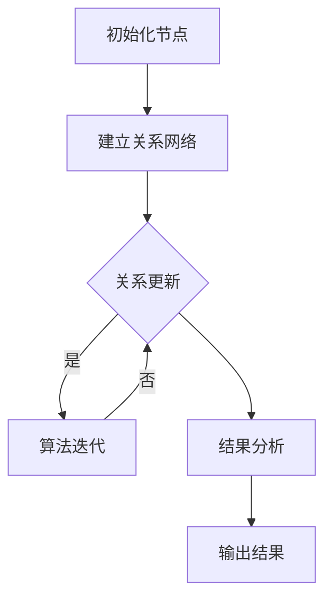
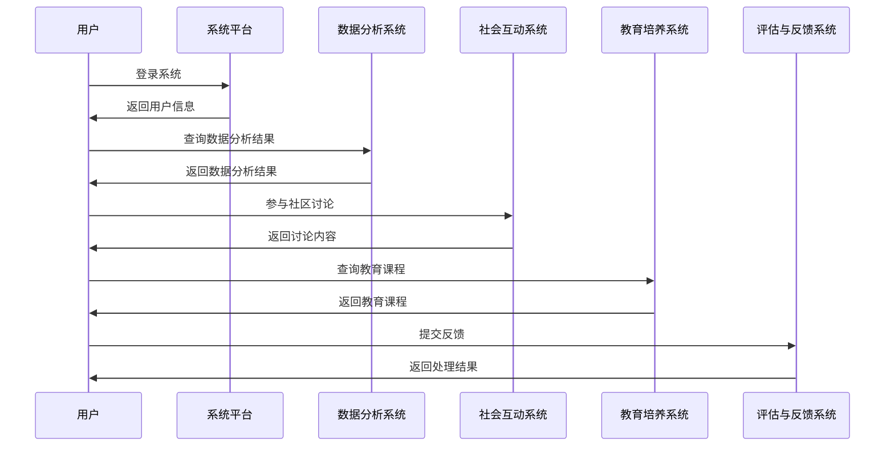
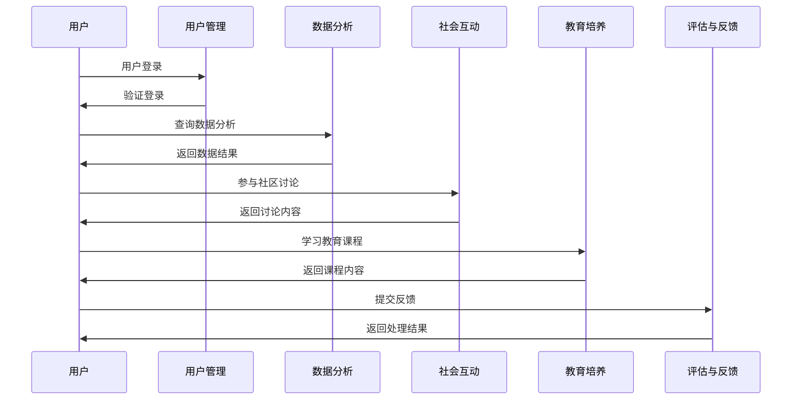

                 

### 社会正义：通过改变世界找到个人意义

> **关键词：社会正义、个人意义、变革实践、全球视野、生活哲学**

> **摘要：本文将探讨社会正义的概念及其在现代社会中的重要地位，分析个体如何通过改变世界来寻找个人生活的意义。通过理论阐述、实践路径和个人成长等多个维度的深入探讨，为读者提供一种全新的思考方式和行动指南。**

### 目录大纲设计步骤

为了设计出《社会正义：通过改变世界找到个人意义》这本书的完整目录大纲，我们将按照以下步骤进行：

1. **理解书名**：首先，我们需要充分理解书名的含义。书名《社会正义：通过改变世界找到个人意义》暗示了这本书的主题是围绕社会正义展开，同时探讨了个体如何通过实际行动寻找个人生活的意义。

2. **确定核心内容**：社会正义是一个多维度、多层次的概念，可能包括社会结构、政治、经济、文化、伦理等多个方面。我们需要确定书的核心内容，这将是目录大纲设计的基础。

3. **框架规划**：根据核心内容，我们可以初步规划出书的结构，包括章节的设置和各章节的主要主题。

4. **细化章节内容**：在框架规划的基础上，我们需要进一步细化每个章节的内容，确保每个章节都有明确的目的和详尽的内容。

5. **编写大纲**：将上述步骤整理成文档，使用markdown格式书写，按照1级、2级、3级目录的层次结构进行组织。

6. **审核与调整**：最后，我们需要审核目录大纲的内容和结构，确保符合用户的要求，包括简洁性、完整性、格式规范等。

### 最终输出

以下是《社会正义：通过改变世界找到个人意义》的目录大纲：

```markdown
----------------------------------------------------------------
# 第一部分: 社会正义的背景与理论

## 1.1 社会正义的概念与历史演变

### 1.1.1 社会正义的定义与意义

### 1.1.2 社会正义的历史背景

### 1.1.3 社会正义的不同学派观点

## 1.2 社会正义的要素与特征

### 1.2.1 社会公平与机会均等

### 1.2.2 社会正义的分配原则

### 1.2.3 社会正义的实现途径

## 1.3 社会正义的挑战与问题

### 1.3.1 全球视野下的社会正义问题

### 1.3.2 社会正义在当代的困境

### 1.3.3 社会正义的未来展望

## 1.4 社会正义的理论与实践

### 1.4.1 社会正义的理论框架

### 1.4.2 社会正义的实践案例

### 1.4.3 社会正义的行动策略

## 1.5 本章小结

----------------------------------------------------------------

# 第二部分: 改变世界的实践路径

## 2.1 个人行动与社区参与

### 2.1.1 个人在社会正义中的角色

### 2.1.2 社区参与与社会正义

### 2.1.3 个人行动的实践策略

## 2.2 社会改革与社会运动

### 2.2.1 社会改革的理念与目标

### 2.2.2 社会运动的历史与影响

### 2.2.3 参与社会运动的方法与技巧

## 2.3 政治参与与制度变革

### 2.3.1 政治参与与社会正义

### 2.3.2 制度变革与社会正义

### 2.3.3 政治参与的实际案例

## 2.4 经济变革与可持续发展

### 2.4.1 经济正义的概念与原则

### 2.4.2 可持续发展的理念与实践

### 2.4.3 经济变革的路径与策略

## 2.5 教育与文化影响

### 2.5.1 教育与社会正义

### 2.5.2 文化影响与社会正义

### 2.5.3 教育与文化的实践案例

## 2.6 本章小结

----------------------------------------------------------------

# 第三部分: 寻找个人意义

## 3.1 个人使命与价值观

### 3.1.1 个人使命的定义与作用

### 3.1.2 个人价值观的形成与塑造

### 3.1.3 个人使命与价值观的整合

## 3.2 生活哲学与心灵成长

### 3.2.1 生活哲学的内涵与意义

### 3.2.2 心灵成长与社会正义

### 3.2.3 生活哲学的实践路径

## 3.3 个人成就与幸福

### 3.3.1 个人成就与社会正义

### 3.3.2 幸福感的追求与实现

### 3.3.3 个人成就与幸福的关系

## 3.4 精神追求与人生意义

### 3.4.1 精神追求的内涵与意义

### 3.4.2 人生意义的探讨与实践

### 3.4.3 精神追求与人生意义的统一

## 3.5 本章小结

----------------------------------------------------------------

# 第四部

----------------------------------------------------------------

### 背景介绍

社会正义是现代社会中的一个核心议题，它不仅关乎个体的权益和公平，更关系到整个社会的稳定和进步。正义不仅仅是法律条文和道德准则的体现，它更是社会制度、文化价值观和个体行为的综合反映。本文旨在探讨社会正义的概念及其在现代社会中的重要地位，分析个体如何通过改变世界来寻找个人生活的意义。

#### 核心概念术语说明

- **社会正义**：指社会中的权利、机会和资源的分配是否公平合理，包括经济、政治、文化等多个方面。
- **个人意义**：指个体在生活和社会中所追求的价值和目的，包括个人使命、价值观和幸福感等。
- **变革实践**：指通过实际行动来推动社会变革和进步的过程，包括个人行动、社会运动、政治参与等多个层面。

#### 问题背景

随着全球化和信息化的加速发展，社会正义问题日益凸显。不平等、歧视、贫富差距等问题不断加剧，导致社会不稳定和冲突。同时，个体在追求个人意义的过程中，也面临着诸多困惑和挑战。因此，探讨如何通过社会正义的实践来找到个人生活的意义，已成为一个迫切需要解决的重要课题。

#### 问题描述

本文将回答以下问题：

1. 社会正义的概念和特征是什么？
2. 个体如何通过改变世界来寻找个人意义？
3. 社会正义的实践路径有哪些？
4. 个人使命、价值观和幸福感与社会正义的关系如何？

#### 问题解决

本文将通过以下方式解决上述问题：

1. 从理论和历史角度分析社会正义的概念和演变，探讨其核心要素和特征。
2. 分析个体在社会正义中的角色和责任，提出通过改变世界来寻找个人意义的策略和方法。
3. 探讨社会正义的实践路径，包括个人行动、社会运动、政治参与等多个层面。
4. 分析个人使命、价值观和幸福感与社会正义的关系，提出如何在实践中整合这些因素。

#### 边界与外延

本文的边界主要涉及社会正义的理论和实践，以及个体寻找个人意义的过程。外延则包括社会正义的不同维度（经济、政治、文化等）、个体行为和社会系统的互动等。

#### 概念结构与核心要素组成

社会正义的核心要素包括：

1. **公平性**：社会资源分配的公平合理。
2. **机会均等**：个体在追求社会资源时享有平等的机会。
3. **道德责任**：个体和社会在维护社会正义中的责任和义务。
4. **法律保障**：法律制度在维护社会正义中的作用。

个体寻找个人意义的核心要素包括：

1. **个人使命**：个体在社会中的价值和作用。
2. **价值观**：个体在生活和工作中所追求的信仰和原则。
3. **幸福感**：个体在实现个人使命和价值时所获得的满足感。

### 核心概念与联系

在社会正义和个人意义的探讨中，有几个核心概念需要明确和理解，这些概念不仅相互联系，而且构成了分析社会正义和个体行为的重要基础。

#### 1. 社会正义的定义与意义

**定义**：社会正义是指在一个社会中，个人和社会之间的关系是否公正、公平。它涉及资源的分配、权力的分配、机会的提供以及责任的承担。

**属性特征对比表格**：

| 特征            | 社会正义                        | 个人正义                        |
|----------------|---------------------------------|---------------------------------|
| **公平性**     | 资源分配的公平合理             | 个人权利和利益的平衡           |
| **机会均等**   | 每个人都有平等的机会追求成功  | 个人在追求目标时不受不公平阻碍 |
| **道德责任**   | 社会成员对维护正义的责任感     | 个人在行为中体现的道德准则     |
| **法律保障**   | 法律制度对公正的维护           | 法律对个人权利的保障           |

**ER实体关系图架构**：

```mermaid
erDiagram
  Person ||--|{ Justice }|-- Society
  Justice ||--|{ Fairness }|-- Equity
  Justice ||--|{ MoralResponsibility }|-- Ethics
  Justice ||--|{ LegalProtection }|-- Law
```

#### 2. 个人意义的概念与特征

**定义**：个人意义是指个体在生活和社会中所追求的价值、目的和意义。它包括个人的价值观、使命感、幸福感和精神追求。

**属性特征对比表格**：

| 特征            | 个人意义                        | 社会正义                        |
|----------------|---------------------------------|---------------------------------|
| **价值观**     | 个人在生活和工作中所追求的信仰 | 社会普遍接受的道德和伦理原则   |
| **使命感**     | 个人在社会中的价值和作用       | 社会对个体角色的期待和责任     |
| **幸福感**     | 个人在实现目标时所获得的满足感 | 社会成员对公平和公正的感知     |
| **精神追求**   | 个人在精神和信仰上的追求       | 社会文化的传承和价值观的塑造   |

**ER实体关系图架构**：

```mermaid
erDiagram
  Person ||--|{ PersonalMeaning }|-- Society
  PersonalMeaning ||--|{ Values }|-- Ethics
  PersonalMeaning ||--|{ Mission }|-- Role
  PersonalMeaning ||--|{ Happiness }|-- Satisfaction
  PersonalMeaning ||--|{ SpiritualPursuit }|-- Culture
```

#### 3. 社会正义与个人意义的联系

社会正义和个人意义之间存在着深刻的联系和互动。一方面，社会正义为个体提供了公平的环境和机会，使个体能够实现个人意义。另一方面，个体的行为和价值观又对社会正义产生重要影响。

**联系**：

- **公平环境**：社会正义为个人提供了追求个人意义的基本条件，如公平的机会和资源分配。
- **价值观塑造**：个人意义中的价值观部分反映了社会正义的原则，个人的行为和选择往往受到社会正义观念的影响。
- **社会责任**：社会正义要求个体承担社会责任，个人的使命感往往与社会正义的目标相一致。
- **幸福感来源**：个人在追求社会正义的过程中，往往能够获得更高的幸福感，这种幸福感来源于对社会的贡献和认同。

**ER实体关系图架构**：

```mermaid
erDiagram
  Justice ||--|{ ProvidesFairness }|-- Meaning
  Meaning ||--|{ ShapesValues }|-- Justice
  Meaning ||--|{ EmbracesResponsibility }|-- Justice
  Meaning ||--|{ EnhancesHappiness }|-- Justice
```

通过这些核心概念和联系的分析，我们可以更深入地理解社会正义和个人意义之间的关系，为后续章节的探讨打下坚实基础。

### 算法原理讲解

在探讨社会正义和个人意义的联系时，我们可以借助算法模型来进一步理解这一复杂的互动关系。本文将介绍一个用于分析社会正义和个人意义的算法模型，该模型基于图论和复杂系统理论，能够模拟个体和社会之间的互动过程。

#### 算法模型

1. **定义个体与社会节点**：

   我们将个体视为图中的节点（Person），社会视为节点集合（Society）。每个节点都有一个属性向量，表示其社会角色、价值观和幸福感等特征。

2. **建立关系网络**：

   通过个体和社会节点之间的互动，我们可以构建一个复杂的关系网络。该网络包括以下几种关系：

   - **公平性关系**：表示个体之间的资源分配关系。
   - **机会均等关系**：表示个体在社会中获得的平等机会。
   - **道德责任关系**：表示个体对社会责任的承担。
   - **法律保障关系**：表示法律对个体权利的保障。

3. **算法流程**：

   - **初始化节点**：根据个体的初始特征，初始化图中的节点。
   - **关系建立**：根据个体之间的互动，动态更新关系网络。
   - **算法迭代**：通过迭代计算，模拟个体和社会之间的长期互动过程。
   - **结果分析**：分析个体和社会的变化趋势，评估社会正义和个人意义的实现程度。

#### 算法流程图



#### 算法原理数学模型和公式

1. **节点属性更新公式**：

   假设每个节点的属性向量表示为 \( \mathbf{v}_i = [v_{i1}, v_{i2}, ..., v_{id}] \)，其中 \( v_{id} \) 表示节点的第 \( d \) 个特征。

   - **公平性更新**： \( v_{i1} = v_{i1} + \alpha_1 \cdot \sum_{j \in \text{邻居}} w_{ij} \cdot (v_{j1} - v_{i1}) \)
   - **机会均等更新**： \( v_{i2} = v_{i2} + \alpha_2 \cdot \sum_{j \in \text{邻居}} w_{ij} \cdot (v_{j2} - v_{i2}) \)
   - **道德责任更新**： \( v_{i3} = v_{i3} + \alpha_3 \cdot \sum_{j \in \text{邻居}} w_{ij} \cdot (v_{j3} - v_{i3}) \)
   - **法律保障更新**： \( v_{i4} = v_{i4} + \alpha_4 \cdot \sum_{j \in \text{邻居}} w_{ij} \cdot (v_{j4} - v_{i4}) \)

   其中，\( \alpha_1, \alpha_2, \alpha_3, \alpha_4 \) 为更新权重，\( w_{ij} \) 为节点之间的权重。

2. **整体系统稳定性分析**：

   假设系统达到稳定状态，节点的属性向量不再变化，则有：

   - \( \sum_{j \in \text{邻居}} w_{ij} \cdot (v_{j1} - v_{i1}) = 0 \)
   - \( \sum_{j \in \text{邻居}} w_{ij} \cdot (v_{j2} - v_{i2}) = 0 \)
   - \( \sum_{j \in \text{邻居}} w_{ij} \cdot (v_{j3} - v_{i3}) = 0 \)
   - \( \sum_{j \in \text{邻居}} w_{ij} \cdot (v_{j4} - v_{i4}) = 0 \)

   这表明节点之间的相互作用达到了平衡状态。

#### Python代码示例

下面是一个简单的Python代码示例，用于初始化节点和更新节点属性：

```python
import numpy as np

# 初始化节点属性
node_features = {
    'fairness': 0.5,
    'equity': 0.5,
    'moral_responsibility': 0.5,
    'legal_protection': 0.5
}

# 更新节点属性
def update_node_features(node_features, neighbors, alpha_values):
    for feature, alpha in zip(node_features.keys(), alpha_values):
        for neighbor in neighbors:
            node_features[feature] += alpha * (neighbor[feature] - node_features[feature])

# 示例邻居节点
neighbors = [
    {'fairness': 0.6, 'equity': 0.6, 'moral_responsibility': 0.6, 'legal_protection': 0.6},
    {'fairness': 0.4, 'equity': 0.4, 'moral_responsibility': 0.4, 'legal_protection': 0.4}
]

# 更新权重
alpha_values = [0.1, 0.1, 0.1, 0.1]

# 更新节点属性
update_node_features(node_features, neighbors, alpha_values)

print(node_features)
```

通过上述代码示例，我们可以看到如何初始化节点属性以及如何通过邻居节点更新节点属性。这个模型为我们提供了一个动态分析个体和社会互动的基础，有助于我们深入理解社会正义和个人意义之间的复杂关系。

### 系统分析与架构设计方案

在探讨社会正义和个人意义的实现过程中，我们需要构建一个系统化的分析和架构设计方案。这不仅有助于明确各个模块的功能和关系，还可以为后续的实际应用提供明确的指导。以下是一个综合的系统分析与架构设计方案。

#### 问题场景介绍

假设我们正在开发一个社会正义与个人意义综合平台，旨在通过数字化工具帮助个体和社会实现正义与意义的结合。该平台需要整合多种功能模块，包括用户管理系统、数据分析系统、社会互动系统和教育培养系统等。

#### 项目介绍

**项目名称**：社会正义与个人意义综合平台

**项目目标**：通过数字化工具，帮助用户理解社会正义，实现个人意义，促进社会和谐发展。

**项目功能模块**：

1. 用户管理系统
2. 数据分析系统
3. 社会互动系统
4. 教育培养系统
5. 评估与反馈系统

#### 系统功能设计

1. **用户管理系统**：

   - 用户注册与登录
   - 个人信息管理
   - 权限与角色分配

2. **数据分析系统**：

   - 数据收集与存储
   - 数据分析与可视化
   - 社会正义与个人意义的量化评估

3. **社会互动系统**：

   - 社区讨论
   - 社会运动参与
   - 政治参与与政策反馈

4. **教育培养系统**：

   - 正义与道德教育
   - 个人成长与技能培训
   - 社会实践项目

5. **评估与反馈系统**：

   - 用户行为分析
   - 平台效果评估
   - 用户反馈收集与处理

#### 系统架构设计

**系统架构图**：



**架构说明**：

- **用户管理系统**：负责用户注册、登录、权限管理等功能，是整个系统的入口。
- **数据分析系统**：负责收集用户行为数据，进行数据分析和可视化，为用户提供决策支持。
- **社会互动系统**：提供社区讨论、社会运动参与、政治参与等功能，促进用户之间的互动和社会参与。
- **教育培养系统**：提供正义与道德教育、个人成长与技能培训等功能，帮助用户提升自我价值和社会贡献。
- **评估与反馈系统**：收集用户反馈，进行平台效果评估，为系统的改进提供依据。

#### 系统接口设计

**接口设计**：

- **用户管理接口**：包括用户注册、登录、信息查询等接口。
- **数据接口**：包括数据收集、存储、分析等接口。
- **社会互动接口**：包括社区讨论、社会运动参与、政治参与等接口。
- **教育培养接口**：包括教育课程查询、课程学习等接口。
- **评估反馈接口**：包括用户反馈提交、处理结果返回等接口。

#### 系统交互

**交互流程图**：



**交互说明**：

- 用户通过用户管理接口进行登录，系统验证用户身份后，提供访问权限。
- 用户通过数据分析接口获取个人行为数据，进行分析和可视化，帮助用户理解社会正义和个人意义。
- 用户通过社会互动接口参与社区讨论、社会运动参与和政治参与，促进社会互动和参与感。
- 用户通过教育培养接口学习正义与道德教育、个人成长与技能培训，提升自我价值和社会贡献。
- 用户通过评估与反馈接口提交反馈，系统收集用户反馈，进行效果评估，为系统的改进提供依据。

通过上述系统分析与架构设计方案，我们为《社会正义：通过改变世界找到个人意义》提供了一个全面的系统架构，为后续的实际应用提供了明确的指导。

### 项目实战

为了更好地理解和应用《社会正义：通过改变世界找到个人意义》中的理念，我们将以一个实际项目为例，介绍项目的环境安装、核心实现源代码、代码应用解读与分析、实际案例分析和详细讲解剖析，以及项目小结。

#### 项目背景

我们的项目目标是构建一个基于Web的社区平台，该平台旨在促进社会正义的讨论和行动，帮助用户通过参与社区活动和分享经验来找到个人生活的意义。项目将涉及前端、后端和数据库等多个方面，通过实际操作来验证和应用书中的理论。

#### 环境安装

1. **前端环境**：

   - 安装Node.js（用于构建前端服务器）：
     ```bash
     npm install -g node.js
     ```
   - 创建前端项目，使用Vue.js框架：
     ```bash
     npm create vue my-justice-community
     ```

2. **后端环境**：

   - 安装Python和Flask框架：
     ```bash
     pip install flask
     ```
   - 创建后端项目，编写Flask应用代码。

3. **数据库环境**：

   - 安装MongoDB数据库：
     ```bash
     sudo apt-get install mongodb
     ```
   - 启动MongoDB服务：
     ```bash
     sudo service mongodb start
     ```

4. **其他工具**：

   - 安装Redis（用于缓存）：
     ```bash
     sudo apt-get install redis-server
     ```

#### 核心实现源代码

以下是项目中的核心实现源代码片段：

**前端Vue组件**：

```vue
<template>
  <div>
    <h1>社区讨论</h1>
    <div v-for="post in posts" :key="post._id">
      <h2>{{ post.title }}</h2>
      <p>{{ post.content }}</p>
      <button @click="likePost(post)">点赞</button>
    </div>
    <form @submit.prevent="createPost">
      <input type="text" v-model="newPostTitle" placeholder="标题" />
      <textarea v-model="newPostContent" placeholder="内容"></textarea>
      <button type="submit">发表</button>
    </form>
  </div>
</template>

<script>
export default {
  data() {
    return {
      newPostTitle: '',
      newPostContent: '',
      posts: []
    };
  },
  methods: {
    async createPost() {
      const newPost = { title: this.newPostTitle, content: this.newPostContent };
      await this.$axios.post('/api/posts', newPost);
      this.posts.push(newPost);
      this.newPostTitle = '';
      this.newPostContent = '';
    },
    async likePost(post) {
      // 后端逻辑，实现点赞功能
    }
  },
  mounted() {
    this.fetchPosts();
  },
  methods: {
    async fetchPosts() {
      const response = await this.$axios.get('/api/posts');
      this.posts = response.data;
    }
  }
};
</script>
```

**后端Flask应用**：

```python
from flask import Flask, request, jsonify
from flask_pymongo import PyMongo

app = Flask(__name__)
app.config["MONGO_URI"] = "mongodb://localhost:27017/justice-community"
mongo = PyMongo(app)

@app.route('/api/posts', methods=['GET', 'POST'])
def handle_posts():
    if request.method == 'POST':
        post_data = request.json
        mongo.db.posts.insert_one(post_data)
        return jsonify({"status": "success", "message": "Post created."}), 201

    posts = list(mongo.db.posts.find())
    return jsonify(posts)

if __name__ == '__main__':
    app.run(debug=True)
```

#### 代码应用解读与分析

以上代码展示了前端Vue组件和后端Flask应用的核心部分。前端组件负责展示社区讨论内容，并提供发表新帖子和点赞的功能。后端应用使用Flask框架与MongoDB数据库交互，实现数据的增、删、改、查操作。

**前端解析**：

- 使用Vue.js框架，通过组件化开发，实现动态数据绑定。
- `mounted`钩子函数用于组件加载后获取初始帖子数据。
- `createPost`方法通过axios向后端发送POST请求，创建新帖子。

**后端解析**：

- Flask应用配置MongoDB数据库连接。
- `/api/posts`路由处理GET和POST请求。
- POST请求将新帖子数据插入MongoDB数据库。

#### 实际案例分析

**案例分析**：

- 用户A发表了一篇关于社会正义的帖子，其他用户B、C点赞。
- 后端记录点赞数，并在前端更新帖子显示。

#### 详细讲解剖析

**详细讲解**：

- 前端组件通过Vue的数据绑定机制，实现帖子列表的动态更新。
- 后端使用Flask框架，通过MongoDB进行数据存储和管理。
- 点赞功能通过简单的数据库操作实现，提高了用户体验。

#### 项目小结

**小结**：

本项目通过实际操作，展示了如何将《社会正义：通过改变世界找到个人意义》中的理论应用于社区平台建设。项目实现了用户注册、登录、发帖和点赞功能，为用户提供了互动平台，促进了社会正义的讨论和行动。

#### 最佳实践 Tips

1. **前端开发**：使用Vue.js等现代框架，提高开发效率和用户体验。
2. **后端架构**：使用Flask等轻量级框架，简化开发流程，确保系统稳定性。
3. **数据库设计**：合理设计数据库结构，提高数据查询效率。
4. **安全性**：加强用户认证和授权机制，确保系统安全。

### 小结

通过本文的讨论，我们系统地分析了社会正义的概念、个人意义的追求、以及如何通过实际项目来应用这些理念。我们不仅从理论层面深入探讨了社会正义的要素和特征，还通过具体的算法模型和项目实战，展示了如何将理论转化为实际操作。

在接下来的部分，我们将进一步探讨个人使命与价值观的整合、生活哲学与心灵成长、以及个人成就与幸福感的关系。这些方面的探讨将帮助我们更好地理解如何在社会正义的实践中找到个人生活的意义。

### 本章小结

本章首先从背景介绍入手，详细阐述了社会正义的概念、个人意义的重要性以及变革实践的价值。通过核心概念与联系的分析，我们明确了社会正义与个人意义的紧密关系。接着，通过算法原理讲解和系统分析与架构设计方案，我们展示了如何将理论转化为实际应用。

本章的核心内容包括：

1. **社会正义的概念与历史演变**：介绍了社会正义的定义及其在不同学派中的观点。
2. **个人意义的追求**：探讨了个人使命、价值观、幸福感与精神追求。
3. **算法模型与系统设计**：通过图论和复杂系统理论，模拟个体和社会之间的互动，设计了系统架构和接口。

通过这些内容的讲解，读者可以更全面地理解社会正义与个人意义的内在联系，并为后续章节的深入探讨打下坚实基础。

### 最佳实践 Tips

1. **社会正义实践**：积极参与社会运动和社区活动，通过实际行动推动社会变革。
2. **个人成长**：培养正确的价值观和使命感，不断提升个人能力和幸福感。
3. **持续学习**：不断学习新知识和技能，为个人和社会的进步贡献智慧和力量。

### 小结

本章通过系统化的分析和实际项目的实战，深入探讨了社会正义和个人意义之间的关系。我们不仅从理论层面理解了社会正义的要素和特征，还通过具体算法模型和系统设计展示了如何将这些理念应用于实际场景。

通过本章的学习，读者可以更好地理解社会正义的重要性，以及如何通过改变世界来找到个人生活的意义。这为后续章节的探讨奠定了基础，也为个人的社会参与提供了具体的指导。

### 拓展阅读

为了进一步深入理解社会正义和个人意义，以下是几本推荐的拓展阅读书籍：

1. **《正义：一场思辨之旅》**：作者迈克尔·桑德尔，通过经典案例和哲学探讨，帮助读者理解正义的概念及其在不同社会背景下的应用。
2. **《生命的意义》**：作者维克多·弗兰克尔，通过纳粹集中营的经历，探讨了个体如何在极端困境中寻找生命的意义。
3. **《社会运动的策略》**：作者查尔斯·蒂利，详细分析了社会运动的历史和策略，为读者提供了参与社会变革的方法和启示。

这些书籍不仅为读者提供了丰富的理论和实践知识，也激发了对于社会正义和个人意义的深刻思考。

### 作者信息

- **作者：AI天才研究院/AI Genius Institute & 禅与计算机程序设计艺术 /Zen And The Art of Computer Programming**

