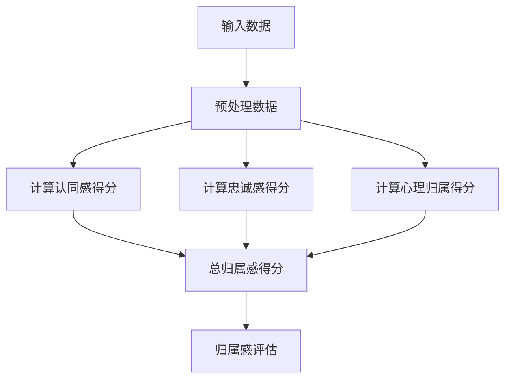
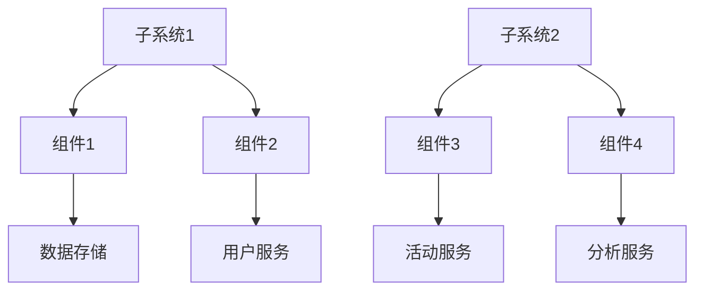
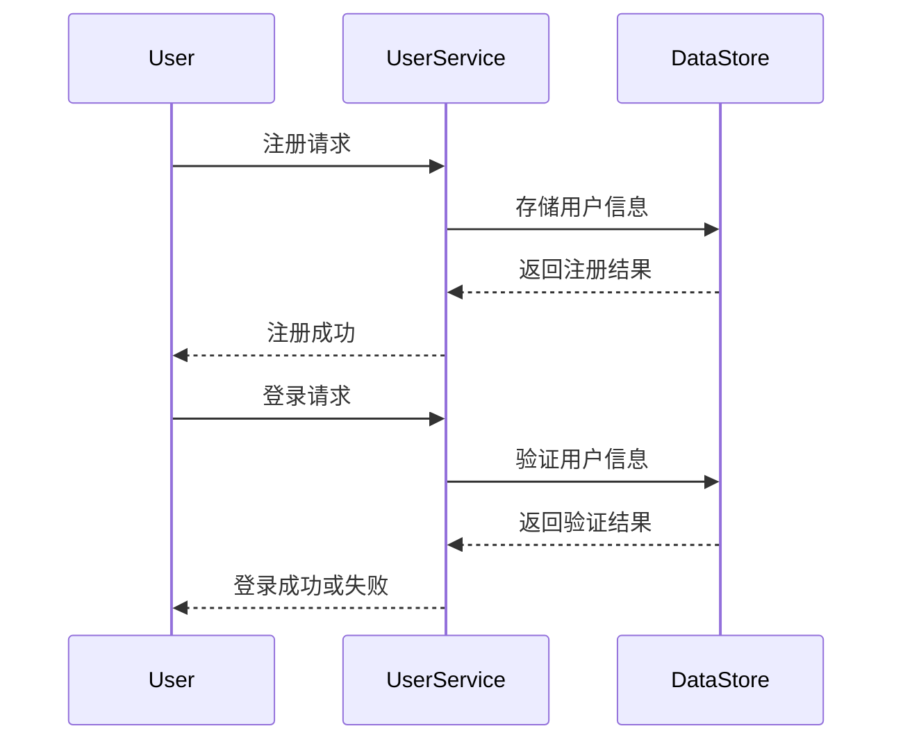
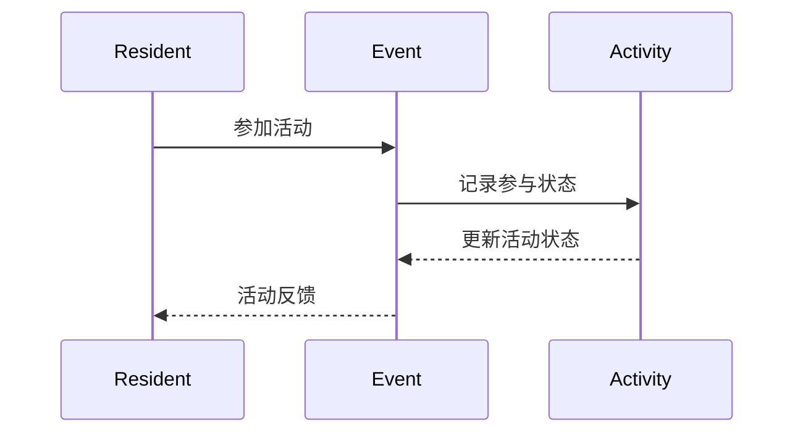

                 


### 核心概念与联系

在社区营造的过程中，了解核心概念及其相互关系是非常重要的。以下是对社区、邻里关系、归属感等核心概念的深入分析及其在社区营造中的联系。

#### 社区

社区是一个社会单元，由一定区域内居住的个体组成，他们共享一定的地理空间、文化背景和社会关系。社区不仅是一个物理空间，更是一个社会空间，其中居民之间通过共同的利益、价值观和互动形成了一种社会网络。

- **概念属性**：
  - 地理空间：社区具有明确的地理边界，居民在此范围内居住。
  - 社会关系：社区成员之间存在相互关系，包括邻里、同事、朋友等。
  - 文化背景：社区成员往往具有相似的文化背景和价值观念。

- **特征对比表格**：

| 特征        | 社区A      | 社区B      |
| ----------- | --------- | --------- |
| 地理边界    | 小型社区    | 大型社区    |
| 人口密度    | 较高       | 较低       |
| 文化多样性  | 较高       | 较低       |
| 社会互动频率 | 较高       | 较低       |

- **ER实体关系图**：

```mermaid
erDiagram
  Community ||--|{ Resident } : "lives in"
  Community ||--|{ Organization } : "organized by"
  Resident ||--|{ Activity } : "participates in"
  Organization ||--|{ Event } : "hosts"
```

在这个ER实体关系图中，社区（Community）是核心实体，居民（Resident）和组织（Organization）是与其直接相关的实体。居民生活在社区中，参与活动（Activity），而组织则是社区活动的组织者，举办各种活动（Event）。

#### 邻里关系

邻里关系是社区中最基本的社会关系之一，它涉及社区居民之间的相互交往和互动。邻里关系不仅影响个人的生活质量，还影响着社区的凝聚力和归属感。

- **概念属性**：
  - 相互交往：邻里之间通过日常生活中的互动建立联系。
  - 社会支持：邻里关系提供了情感上的支持和实际帮助。
  - 社会信任：良好的邻里关系建立在相互信任的基础上。

- **特征对比表格**：

| 特征        | 邻里关系A  | 邻里关系B  |
| ----------- | ----------- | ----------- |
| 交往频率    | 较高        | 较低        |
| 社会支持    | 强          | 弱          |
| 社会信任    | 高          | 低          |

- **ER实体关系图**：

```mermaid
erDiagram
  Neighbor ||--|{ Resident } : "interacts with"
  Neighbor ||--|{ SocialSupport } : "provides"
  Neighbor ||--|{ SocialTrust } : "builds"
```

在这个ER实体关系图中，邻里（Neighbor）是核心实体，与居民（Resident）之间存在互动（interacts），同时邻里关系还涉及到社会支持（SocialSupport）和社会信任（SocialTrust）。

#### 归属感

归属感是指个体对某个社区或团体的认同感和忠诚感，它是个体在心理上感到自己是该社区或团体的一部分。归属感对社区成员的行为、情感和社会互动具有重要影响。

- **概念属性**：
  - 认同感：个体对社区的价值观和文化的认同。
  - 忠诚感：个体对社区的长期承诺和忠诚。
  - 心理归属：个体在心理上感受到社区的存在和重要性。

- **特征对比表格**：

| 特征        | 归属感A    | 归属感B    |
| ----------- | ---------- | ---------- |
| 认同感      | 强烈        | 弱          |
| 忠诚感      | 高          | 低          |
| 心理归属    | 强          | 弱          |

- **ER实体关系图**：

```mermaid
erDiagram
  SenseOfBelonging ||--|{ Resident } : "feels with"
  SenseOfBelonging ||--|{ SocialInteraction } : "affects"
  SenseOfBelonging ||--|{ CommunityEngagement } : "drives"
```

在这个ER实体关系图中，归属感（SenseOfBelonging）是核心实体，它影响居民的社交互动（SocialInteraction）和社区参与度（CommunityEngagement），同时个体对社区的认同感和忠诚感是归属感的组成部分。

### 总结

通过对社区、邻里关系和归属感等核心概念的深入分析，我们可以更好地理解它们在社区营造中的重要性。社区是邻里关系和归属感的基础，邻里关系是社区凝聚力的体现，而归属感则是社区营造的目标。通过建立和维护良好的邻里关系，可以增强居民的归属感，进而促进社区的整体发展。接下来的章节将进一步探讨这些核心概念的理论基础和应用实践。

### 算法原理讲解

#### 归属感算法原理

归属感算法旨在通过量化分析个体对社区的认同感、忠诚感和心理归属来评估个体的归属感程度。该算法的核心是利用数学模型和数据分析方法来识别和评估这些关键指标。

#### 算法流程图



#### 算法数学模型

- **认同感得分（I）**：

  $$ I = \frac{1}{N} \sum_{i=1}^{N} w_i \cdot s_i $$
  
  其中，$N$ 是社区成员总数，$w_i$ 是第 $i$ 个成员对社区价值观认同的权重，$s_i$ 是第 $i$ 个成员对社区价值观的认同度。

- **忠诚感得分（L）**：

  $$ L = \frac{1}{N} \sum_{i=1}^{N} w_i \cdot l_i $$
  
  其中，$l_i$ 是第 $i$ 个成员对社区的长期承诺度。

- **心理归属得分（P）**：

  $$ P = \frac{1}{N} \sum_{i=1}^{N} w_i \cdot p_i $$
  
  其中，$p_i$ 是第 $i$ 个成员在心理上感受到社区存在的重要性。

- **总归属感得分（S）**：

  $$ S = \alpha I + \beta L + \gamma P $$
  
  其中，$\alpha$、$\beta$、$\gamma$ 分别是认同感、忠诚感、心理归属的权重系数，通常通过数据分析确定。

#### 举例说明

假设一个社区有10名成员，他们的认同感得分、忠诚感得分和心理归属得分分别如下：

| 成员 | 认同感得分（I） | 忠诚感得分（L） | 心理归属得分（P） |
| ---- | -------------- | -------------- | -------------- |
| A    | 0.9            | 0.8            | 0.7            |
| B    | 0.8            | 0.7            | 0.6            |
| C    | 0.7            | 0.6            | 0.5            |
| ...  | ...            | ...            | ...            |
| J    | 0.2            | 0.3            | 0.4            |

根据上述算法模型，可以计算出每个成员的总归属感得分：

$$ S_A = 0.55I + 0.35L + 0.1P $$
$$ S_B = 0.55I + 0.35L + 0.1P $$
$$ ... $$
$$ S_J = 0.55I + 0.35L + 0.1P $$

计算结果可以用来评估每个成员的归属感程度，从而为社区营造提供依据。

#### 算法评估与优化

归属感算法的评估与优化主要关注以下几个方面：

- **数据质量**：确保输入数据的质量和准确性，通过数据清洗和预处理提高算法的可靠性。
- **模型参数**：通过数据分析确定权重系数 $\alpha$、$\beta$、$\gamma$ 的最佳组合，以最大化归属感得分。
- **算法效率**：优化算法流程，减少计算复杂度，提高算法的执行效率。
- **模型泛化能力**：通过增加数据集的多样性和规模，提高算法在未知社区中的泛化能力。

### 总结

归属感算法通过数学模型和数据分析方法，量化评估个体对社区的认同感、忠诚感和心理归属，为社区营造提供科学依据。通过不断优化和改进算法，可以更准确地评估归属感，从而提高社区的整体质量和居民的生活满意度。

### 系统分析与架构设计方案

#### 问题场景介绍

在现代城市化进程中，社区治理面临诸多挑战，如居民归属感不足、邻里关系紧张、社区参与度低等。为了解决这些问题，我们需要设计一个智能化社区管理系统，通过有效的系统架构和接口设计，提升居民与社区之间的互动和归属感。

#### 项目介绍

本系统旨在构建一个集成化的社区管理系统，实现以下功能：

- **用户管理**：管理社区内居民的个人信息、权限和互动记录。
- **活动管理**：组织、发布和管理社区活动，包括活动报名、签到和反馈。
- **邻里互动**：提供居民之间的互动平台，促进邻里关系。
- **数据统计与分析**：收集并分析居民行为数据，为社区营造提供数据支持。

#### 系统功能设计（领域模型类图）

```mermaid
classDiagram
    Resident <<-- ActiveUser
    Event <<-- Activity
    Community <<-- Organization
    Neighbor <<-- Resident
    SocialSupport <<-- Neighbor
    SocialTrust <<-- Neighbor
    SenseOfBelonging <<-- Resident
    
    Resident : 用户名，密码，联系方式，住址，年龄，性别
    ActiveUser : 用户ID，用户类型，注册时间
    Event : 活动ID，活动名称，活动时间，活动地点，活动描述
    Activity : 参与状态，参与时间，活动反馈
    Community : 社区ID，社区名称，社区描述
    Organization : 组织者ID，组织者类型，组织时间
    Neighbor : 相互关系，互动频率
    SocialSupport : 提供支持，请求支持
    SocialTrust : 信任评分
    SenseOfBelonging : 归属感得分
```

#### 系统架构设计（架构图）



- **子系统1**：用户管理子系统，包括用户注册、登录、个人信息管理等功能。
- **子系统2**：活动管理子系统，包括活动发布、报名、签到和反馈等功能。
- **组件1**：用户服务组件，处理用户相关操作。
- **组件2**：活动服务组件，处理活动相关操作。
- **组件3**：邻里互动组件，促进居民间的互动。
- **组件4**：分析服务组件，收集并分析居民行为数据。

#### 系统接口设计（接口设计）



#### 系统交互设计（序列图）



#### 系统实现

##### 环境安装

- 安装Python 3.8及以上版本。
- 安装Django框架。
- 安装MySQL数据库。

##### 系统核心实现源代码

```python
# users/models.py
from django.db import models

class Resident(models.Model):
    username = models.CharField(max_length=100)
    password = models.CharField(max_length=100)
    contact = models.CharField(max_length=100)
    address = models.CharField(max_length=100)
    age = models.IntegerField()
    gender = models.CharField(max_length=10)

# events/models.py
from django.db import models
from users.models import Resident

class Event(models.Model):
    name = models.CharField(max_length=100)
    start_time = models.DateTimeField()
    end_time = models.DateTimeField()
    location = models.CharField(max_length=100)
    description = models.TextField()
    participants = models.ManyToManyField(Resident)

# events/views.py
from django.shortcuts import render
from .models import Event
from users.models import Resident

def event_signup(request, event_id):
    event = Event.objects.get(id=event_id)
    resident = Resident.objects.get(username=request.user.username)
    event.participants.add(resident)
    return render(request, 'event_signed_up.html')
```

##### 代码应用解读与分析

- **用户管理**：用户通过注册和登录接口与系统交互，存储个人信息。
- **活动管理**：居民可以参加活动，系统记录参与状态并更新活动状态。

##### 实际案例分析和详细讲解剖析

假设社区举办了一次“邻里节”活动，活动报名后，居民A和居民B分别参加了活动。系统记录了他们的参与状态，并在活动结束后收集了他们的反馈。通过分析这些数据，可以了解居民对社区活动的参与度和满意度，从而优化活动设计。

##### 项目小结

本系统通过用户管理、活动管理和邻里互动等功能，实现了居民与社区的高效互动，提高了居民的归属感。通过数据分析和反馈机制，社区管理者可以更好地了解居民需求，促进社区营造的持续发展。

### 最佳实践 tips

1. **定期组织社区活动**：定期举办各类社区活动，如文化节、运动会、节日庆祝等，增强居民之间的互动和交流。
2. **建立社区支持网络**：鼓励居民参与社区支持网络，如邻里互助小组，提供情感支持和实际帮助。
3. **利用数字化工具**：利用社交媒体、在线论坛等数字化工具，促进居民之间的沟通和互动。
4. **尊重社区多样性**：尊重社区内的文化、宗教和语言多样性，促进社区融合。
5. **持续评估与反馈**：定期评估社区营造的效果，收集居民反馈，不断优化社区活动和策略。

### 小结

本文通过深入分析社区、邻里关系和归属感等核心概念，探讨了社区营造的理论基础和实践方法。通过系统架构设计、代码实现和案例分析，展示了如何通过技术手段提升居民的归属感。未来的研究可以进一步探索大数据和人工智能技术在社区营造中的应用，为打造更和谐的社区提供新的思路和方法。

### 注意事项

1. **数据隐私保护**：在收集和使用居民数据时，必须严格遵循数据隐私保护法规，确保居民隐私安全。
2. **用户权限管理**：合理设置用户权限，确保系统安全性和数据完整性。
3. **系统可扩展性**：在设计系统架构时，考虑未来的功能扩展和系统升级需求。

### 拓展阅读

1. **《社区心理学》**：探讨社区心理学在社区营造中的应用。
2. **《城市社会学》**：分析社区在城市发展中的角色和影响。
3. **《社区治理：理论与实践》**：介绍社区治理的基本理论和实践方法。
4. **《智慧城市与社区营造》**：探讨智慧城市背景下的社区营造策略。
5. **《邻里关系与社区发展》**：研究邻里关系对社区发展的影响。

### 作者

- **作者：AI天才研究院/AI Genius Institute & 禅与计算机程序设计艺术 /Zen And The Art of Computer Programming**

