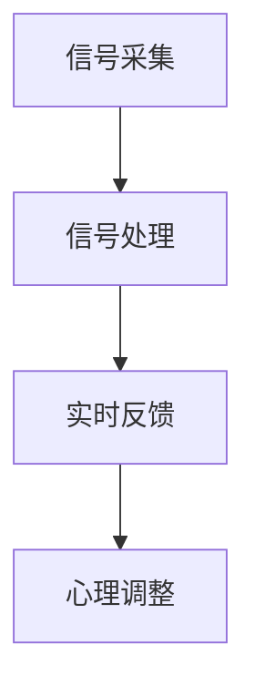
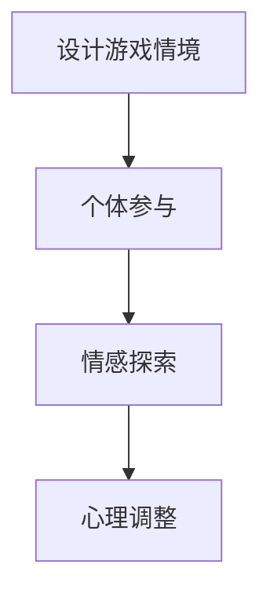
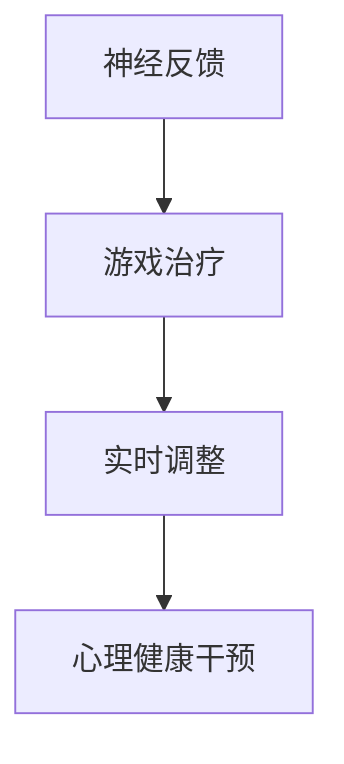

                 

### 第1章: 背景介绍

#### 1.1 问题背景
神经反馈游戏治疗是一种新兴的心理健康干预方法，通过结合神经科学和游戏设计的理念，帮助个体改善心理健康。近年来，随着科技的进步，神经反馈技术日益成熟，同时游戏设计也在不断创新，这使得神经反馈游戏治疗成为了一种极具潜力的心理健康干预手段。该方法通过实时监测个体的脑电信号、肌电信号等生物电信号，给予个体关于自身心理状态的反馈，帮助个体了解并调整自己的心理状态。此外，游戏设计中的互动和体验，为个体提供了一个安全、有趣的环境，使得心理健康干预过程更加生动和有效。

#### 1.2 问题描述
当前，心理健康问题日益严重，尤其是青少年和成年人的抑郁症、焦虑症等心理障碍的发病率逐年上升。传统的心理健康干预方法，如药物治疗、心理治疗等，虽然在一定程度上能够缓解症状，但往往效果有限，且存在一定的副作用和局限性。而神经反馈游戏治疗作为一种创新的干预手段，具有无药物副作用、个性化强、互动性高等优势，但目前在市场上却面临着治疗师水平参差不齐、缺乏统一认证体系等问题。这导致很多潜在的治疗师无法获得专业培训，也无法得到社会和患者的认可，从而影响了神经反馈游戏治疗的推广和应用。

#### 1.3 问题解决
本书旨在解决这一问题，通过详细阐述神经反馈游戏治疗的理论和实践，为治疗师提供系统、全面的培训资料。首先，本书将介绍神经反馈游戏治疗的基本原理，包括神经反馈技术和游戏治疗原理，帮助治疗师理解这一方法的科学依据。接着，本书将详细讲解神经反馈游戏治疗的操作流程、技巧和应用场景，帮助治疗师掌握这一方法的实际操作技能。此外，本书还将介绍神经反馈游戏治疗师认证的标准和流程，帮助治疗师提升专业能力，获得专业认证，提高其在市场上的竞争力和认可度。

#### 1.4 边界与外延
神经反馈游戏治疗师认证的范围包括但不限于心理学、神经科学、游戏设计、教育技术等领域。此外，本书还将涉及心理健康干预的相关法律、伦理问题，帮助治疗师在执业过程中遵守法律和伦理规范，保护患者的权益。以下是神经反馈游戏治疗师认证涉及的几个关键领域：

1. **心理学知识**：包括基础心理学、发展心理学、临床心理学等，治疗师需要掌握相关理论知识，以便理解和处理患者的心理问题。
2. **神经科学知识**：包括大脑结构和功能、神经递质和神经调节等，治疗师需要了解神经反馈技术的原理和应用。
3. **游戏设计知识**：包括游戏设计原则、游戏心理学、游戏化学习等，治疗师需要了解如何将游戏元素有效地应用于心理健康干预中。
4. **教育技术知识**：包括教育心理学、学习理论、教育技术工具等，治疗师需要掌握如何利用技术手段提高干预效果。
5. **心理健康干预技能**：包括心理评估、心理咨询、心理治疗等，治疗师需要掌握如何运用神经反馈游戏治疗的方法，帮助患者改善心理健康。
6. **法律法规和伦理规范**：包括心理健康相关法律法规、伦理准则等，治疗师需要了解在执业过程中需要遵守的法律和伦理规范。

#### 1.5 概念结构与核心要素组成
神经反馈游戏治疗师认证的核心概念包括神经反馈、游戏治疗、心理健康干预、专业能力标准、认证流程等。以下是这些概念的核心要素：

##### 神经反馈
神经反馈是一种通过监测大脑活动，给予个体实时反馈，帮助其调整心理状态的方法。其核心要素包括：

- **原理**：通过监测脑电信号（EEG）、肌电信号（EMG）、眼动追踪等生物电信号，实时反馈给个体，帮助其了解和调整自己的心理状态。
- **类型**：脑电图（EEG）、肌电图（EMG）、眼动追踪等。
- **应用**：心理健康干预、认知功能训练、情绪调节等。

##### 游戏治疗
游戏治疗是一种利用游戏中的互动和体验，帮助个体探索内心世界、提高心理健康的方法。其核心要素包括：

- **原理**：通过设计具有心理治疗功能的游戏情境，引导个体参与，从而帮助其探索内心世界，解决心理问题。
- **类型**：认知游戏、情绪调节游戏、社交技能游戏等。
- **应用**：心理健康干预、心理治疗、心理教育等。

##### 心理健康干预
心理健康干预是通过各种手段，如心理治疗、药物治疗、行为干预等，帮助个体改善心理健康的过程。其核心要素包括：

- **概念**：通过各种手段，如心理治疗、药物治疗、行为干预等，帮助个体改善心理健康。
- **类型**：个体治疗、团体治疗、家庭治疗等。
- **应用**：心理健康问题的预防、诊断、治疗、康复等。

##### 专业能力标准
专业能力标准是衡量神经反馈游戏治疗师专业水平的重要依据，其核心要素包括：

- **知识**：包括心理学、神经科学、游戏设计、教育技术等领域的知识。
- **技能**：包括神经反馈技术操作、游戏治疗技巧、心理健康评估与干预等技能。
- **实践**：包括实际操作经验、案例分析、研究能力等。

##### 认证流程
认证流程是神经反馈游戏治疗师获取专业认证的过程，其核心要素包括：

- **申请**：满足基本条件，如学历、工作经验等，提交申请材料。
- **考试**：包括理论知识考试和实践操作考试，考察治疗师的专业知识和技能。
- **审核与评估**：专家委员会对申请者的综合能力进行评估，确保其符合专业标准。
- **认证**：通过考核的治疗师获得神经反馈游戏治疗师认证，获得专业认可。

通过以上核心概念和要素的阐述，我们可以看到，神经反馈游戏治疗师认证不仅仅是对治疗师知识和技能的考察，更是对其综合素质和专业能力的认可。这不仅有助于提高治疗师的专业水平，也有助于提高神经反馈游戏治疗的整体质量，从而更好地服务于广大心理健康患者。

### 第2章: 核心概念与联系

#### 2.1 神经反馈原理

神经反馈是一种利用生物电信号进行心理干预的方法。通过监测大脑活动，如脑电图（EEG）、肌电图（EMG）、眼动追踪等，个体可以获得关于自己心理状态的实时反馈，从而调整自己的心理状态。这一过程涉及以下几个关键步骤：

1. **信号采集**：通过电极或其他传感器采集大脑活动产生的生物电信号。
2. **信号处理**：对采集到的信号进行放大、滤波、数字化等处理，以便进行进一步分析。
3. **实时反馈**：将处理后的信号转化为可感知的反馈信号，如声音、视觉图像等，实时呈现给个体。
4. **心理调整**：个体根据反馈信号调整自己的心理状态，如放松、集中注意力等。

以下是神经反馈原理的 Mermaid 流程图：

#### 2.2 游戏治疗原理

游戏治疗是一种利用游戏中的互动和体验，帮助个体探索内心世界、提高心理健康的方法。游戏治疗的核心在于通过游戏中的情境和任务，引导个体面对和处理自己的情感、行为问题。以下是游戏治疗原理的 Mermaid 流程图：

#### 2.3 神经反馈与游戏治疗的关系

神经反馈和游戏治疗的结合，可以形成一种全新的心理健康干预方法。通过神经反馈实时监测个体的心理状态，游戏治疗师可以根据监测结果调整游戏设置，以达到更好的治疗效果。以下是神经反馈与游戏治疗关系的 Mermaid 流程图：

#### 2.4 概念属性特征对比表格

为了更好地理解神经反馈和游戏治疗的概念属性特征，我们可以通过一个对比表格来进行详细说明。

| 概念         | 特征                                       |
| ------------ | ----------------------------------------- |
| 神经反馈     | 实时监测大脑活动，提供反馈               |
| 游戏治疗     | 利用游戏情境，帮助个体探索内心世界       |
| 心理健康干预 | 通过多种手段，如治疗、药物治疗、行为干预等，改善心理健康 |
| 专业能力标准 | 包括心理学、神经科学、游戏设计、教育技术等领域的知识技能 |

#### 2.5 概念之间的联系

神经反馈和游戏治疗虽然来自不同的学科领域，但在心理健康干预中，它们可以相互补充，形成一种更加有效的治疗方法。以下是它们之间的一些主要联系：

1. **技术支持**：神经反馈技术为游戏治疗提供了实时监测和反馈的机制，使得游戏治疗过程更加科学和有效。
2. **个性化干预**：通过神经反馈，治疗师可以实时了解个体的心理状态，从而根据个体差异进行调整，实现个性化干预。
3. **心理状态调整**：神经反馈和游戏治疗都可以帮助个体调整心理状态，如放松、集中注意力、提高情绪稳定性等。
4. **问题解决**：神经反馈和游戏治疗结合，可以帮助个体解决各种心理健康问题，如焦虑、抑郁、情绪障碍等。
5. **综合效果**：神经反馈和游戏治疗结合，可以产生协同效应，提高心理健康干预的整体效果。

通过以上对神经反馈和游戏治疗核心概念及其关系的详细阐述，我们可以看到，这两种方法在心理健康干预中具有重要的价值和潜力。神经反馈游戏治疗师认证的提出，不仅为这一新兴领域提供了专业标准和培训体系，也为广大心理健康患者带来了新的希望和解决方案。

### 第3章: 神经反馈与游戏治疗的应用

#### 3.1 心理健康干预中的神经反馈游戏治疗

神经反馈游戏治疗在心理健康干预中具有独特的优势，它结合了神经科学和游戏设计的先进理念，通过实时监测个体的心理状态，并利用游戏中的互动和体验，帮助个体探索内心世界，提高心理健康。以下是神经反馈游戏治疗在心理健康干预中的应用：

1. **焦虑和压力管理**：通过神经反馈游戏治疗，个体可以在放松的氛围中学会如何调节自己的情绪，降低焦虑和压力水平。例如，通过设计一系列放松游戏，个体可以在游戏中学习深呼吸、冥想等放松技巧，从而在日常生活中应用这些技巧，有效缓解焦虑和压力。
   
2. **情绪调节**：神经反馈游戏治疗可以帮助个体识别和调整自己的情绪状态。通过实时监测个体的脑电信号，治疗师可以了解个体在不同情绪状态下的脑电活动变化，进而设计相应的游戏情境，帮助个体学会情绪调节技巧。例如，通过设计一个需要玩家在短时间内完成任务的挑战游戏，个体可以在游戏中学会如何在紧张和压力下保持冷静和专注。

3. **社交技能提升**：神经反馈游戏治疗可以提供一个安全、互动的环境，帮助个体提升社交技能。例如，通过设计合作游戏，个体可以在游戏中学会如何与他人沟通、合作，从而在实际社交场合中更加自信和自如。

4. **注意力训练**：神经反馈游戏治疗可以帮助个体提高注意力和专注力。通过设计一系列需要高度集中注意力的游戏任务，个体可以在游戏中练习专注技巧，从而在日常生活中提高工作效率和学习能力。

5. **认知功能训练**：神经反馈游戏治疗还可以用于认知功能的训练和提升。例如，通过设计记忆游戏、逻辑推理游戏等，个体可以在游戏中锻炼自己的记忆力和逻辑思维能力，从而提高整体认知水平。

#### 3.2 实际案例

以下是一些神经反馈游戏治疗的实际案例，展示了这一方法在改善心理健康方面的效果：

1. **案例1：焦虑患者**：一名焦虑症患者通过接受神经反馈游戏治疗，在几周内明显改善了焦虑症状。治疗师通过监测患者的脑电信号，发现患者在焦虑状态下的脑电活动特征，并设计了相应的放松游戏。患者在游戏中学会了如何通过深呼吸和冥想来缓解焦虑，并在日常生活中应用这些技巧，焦虑症状得到了显著缓解。

2. **案例2：抑郁患者**：一名抑郁患者在接受神经反馈游戏治疗后，情绪明显好转，生活态度也变得积极起来。治疗师通过设计一个需要玩家在游戏中完成一系列挑战的任务，帮助患者学会如何面对困难和挫折，并在游戏过程中逐步恢复自信心。患者反馈表示，通过游戏治疗的干预，他们能够更好地理解和处理自己的情绪，抑郁症状得到了有效缓解。

3. **案例3：青少年社交障碍**：一名青少年因社交障碍而感到自卑和孤独。通过接受神经反馈游戏治疗，治疗师帮助患者在游戏中学会了如何与他人沟通、合作。患者在游戏中积极参与团队合作任务，逐渐克服了社交障碍，自信心得到了提升，与同学和朋友的关系也得到了改善。

#### 3.3 应用前景

随着神经反馈技术和游戏设计技术的不断发展，神经反馈游戏治疗在心理健康干预中的应用前景非常广阔。未来，神经反馈游戏治疗有望在以下领域发挥更大的作用：

1. **临床应用**：神经反馈游戏治疗可以广泛应用于临床心理健康干预，如抑郁症、焦虑症、创伤后应激障碍（PTSD）等常见心理障碍的治疗。
2. **教育领域**：神经反馈游戏治疗可以用于学生心理健康教育，帮助学生在学习过程中保持良好的心理状态，提高学习效果。
3. **职场健康**：神经反馈游戏治疗可以用于职场心理健康管理，帮助员工缓解工作压力，提升工作效率和创造力。
4. **个性化治疗**：随着大数据和人工智能技术的发展，神经反馈游戏治疗可以根据个体的心理状态和行为数据，实现个性化治疗，提高干预效果。

通过神经反馈游戏治疗的应用，我们可以看到，这种新兴的心理健康干预方法具有巨大的潜力，可以为广大心理健康患者提供更加科学、有效的治疗手段。

### 第4章: 神经反馈游戏治疗师认证流程

#### 4.1 认证的目的和意义

神经反馈游戏治疗师认证是一项旨在确保治疗师具备专业能力和知识，从而提高治疗效果的重要措施。通过认证，治疗师可以获得专业认可，提升自身在行业中的竞争力，同时也能够为患者提供更加可靠和专业的心理健康干预服务。

#### 4.2 认证标准

神经反馈游戏治疗师认证标准涵盖了多个领域，包括心理学、神经科学、游戏设计、教育技术等。具体标准如下：

1. **心理学知识**：包括基础心理学、发展心理学、临床心理学等，治疗师需要掌握相关理论知识，以便理解和处理患者的心理问题。
2. **神经科学知识**：包括大脑结构和功能、神经递质和神经调节等，治疗师需要了解神经反馈技术的原理和应用。
3. **游戏设计知识**：包括游戏设计原则、游戏心理学、游戏化学习等，治疗师需要了解如何将游戏元素有效地应用于心理健康干预中。
4. **教育技术知识**：包括教育心理学、学习理论、教育技术工具等，治疗师需要掌握如何利用技术手段提高干预效果。
5. **心理健康干预技能**：包括心理评估、心理咨询、心理治疗等，治疗师需要掌握如何运用神经反馈游戏治疗的方法，帮助患者改善心理健康。
6. **法律法规和伦理规范**：包括心理健康相关法律法规、伦理准则等，治疗师需要了解在执业过程中需要遵守的法律和伦理规范。

#### 4.3 认证流程

神经反馈游戏治疗师认证流程包括申请、考试、审核与评估、认证等步骤。

1. **申请**：满足以下基本条件的治疗师可以申请认证：
   - 学历要求：本科及以上学历，专业为心理学、神经科学、游戏设计、教育技术等相关专业。
   - 工作经验：至少2年的相关工作经验，或者在相关领域获得专业认证。
   - 其他条件：具备良好的职业道德和职业素养，无不良执业记录。

2. **考试**：考试分为理论知识考试和实践操作考试两部分。
   - **理论知识考试**：主要考察治疗师对心理学、神经科学、游戏设计、教育技术等知识的掌握程度。
   - **实践操作考试**：主要考察治疗师在神经反馈游戏治疗中的实际操作能力，包括游戏设计、心理干预、技术操作等。

3. **审核与评估**：专家委员会对申请者的综合能力进行评估，包括理论知识、实践操作、工作经历等方面。评估结果分为通过、不通过两种。

4. **认证**：通过考核的治疗师将获得神经反馈游戏治疗师认证，并获得相应的证书。认证有效期为5年，治疗师需在认证到期前进行再次考核，以维持认证资格。

#### 4.4 认证的意义和影响

神经反馈游戏治疗师认证不仅有助于提升治疗师的专业水平，还有以下几个重要意义：

1. **提高治疗效果**：通过认证，治疗师将掌握更专业的知识和技能，能够提供更加科学和有效的心理健康干预服务，从而提高治疗效果。

2. **规范行业行为**：认证标准为治疗师提供了明确的执业规范，有助于规范行业行为，提高整个行业的专业水平。

3. **提升患者信任**：认证的治疗师将获得患者的信任，有助于建立良好的医患关系，提高患者的治疗依从性。

4. **推动行业发展**：神经反馈游戏治疗师认证将推动这一新兴领域的快速发展，为心理健康干预提供更多创新方法和手段。

通过神经反馈游戏治疗师认证，我们可以看到，这一措施对于提高治疗师的专业水平、规范行业行为、提升治疗效果和推动行业发展都具有重要意义。

### 第5章: 神经反馈游戏治疗师的职业发展

#### 5.1 职业机会与发展前景

神经反馈游戏治疗师作为一个新兴职业，具有广阔的职业机会和发展前景。随着社会对心理健康重视程度的提高，以及神经反馈技术和游戏设计技术的不断发展，神经反馈游戏治疗师将在多个领域找到职业机会。

1. **医疗机构**：医院、心理健康诊所、康复中心等医疗机构需要专业的神经反馈游戏治疗师，为其患者提供心理健康干预服务。

2. **教育机构**：学校、大学等教育机构可以引入神经反馈游戏治疗，帮助学生在学习过程中保持良好的心理状态，提升学习效果。

3. **企业**：企业人力资源管理部可以聘请神经反馈游戏治疗师，为员工提供心理健康服务和压力管理培训，提高员工的工作效率和创造力。

4. **非营利组织**：非营利组织，如心理健康协会、社区服务中心等，可以开展神经反馈游戏治疗项目，为有需要的人群提供免费或低收费的服务。

#### 5.2 职业路径

神经反馈游戏治疗师的职业路径多种多样，可以根据个人兴趣和专业能力选择不同的职业发展方向。

1. **独立治疗师**：治疗师可以开设自己的神经反馈游戏治疗工作室，为客户提供专业的心理健康干预服务。

2. **医疗机构任职**：治疗师可以应聘于医院、心理健康诊所等医疗机构，担任专职或兼职神经反馈游戏治疗师。

3. **教育机构任职**：治疗师可以在学校、大学等教育机构担任心理健康教师，将神经反馈游戏治疗理念融入教育教学过程中。

4. **企业培训师**：治疗师可以担任企业培训师，为企业提供心理健康服务和压力管理培训。

5. **研究与发展**：治疗师可以在科研机构或高等院校从事神经反馈游戏治疗的科研工作，推动该领域的技术创新和发展。

#### 5.3 提升专业能力的途径

为了在神经反馈游戏治疗领域取得更好的职业发展，治疗师可以通过以下途径提升自己的专业能力：

1. **继续教育**：参加专业培训机构举办的神经反馈游戏治疗课程，学习最新的理论和实践知识。

2. **实践经验**：在实际工作中积累经验，通过为不同类型的患者提供干预服务，提高自己的治疗技能。

3. **学术研究**：参与学术研究项目，发表学术论文，提升自己的研究能力和学术影响力。

4. **行业交流**：参加行业研讨会、讲座等活动，与其他治疗师进行经验交流，拓宽视野。

5. **国际认证**：获得国际权威机构颁发的神经反馈游戏治疗师认证，提升自己的国际竞争力。

通过以上途径，神经反馈游戏治疗师可以不断提升自己的专业能力和职业水平，为患者提供更加优质的心理健康服务，同时也为自己的职业发展奠定坚实基础。

### 总结与展望

神经反馈游戏治疗作为一种新兴的心理健康干预方法，结合了神经科学和游戏设计的先进理念，具有显著的优势和潜力。通过实时监测个体的心理状态，并利用游戏中的互动和体验，神经反馈游戏治疗能够有效改善焦虑、抑郁、社交障碍等心理健康问题。此外，神经反馈游戏治疗师认证的推出，为治疗师提供了专业的培训和认证体系，有助于提升治疗师的专业水平，确保治疗质量。

未来，随着神经反馈技术和游戏设计技术的不断发展，神经反馈游戏治疗有望在临床应用、教育领域、职场健康管理等多个领域发挥更大的作用。同时，大数据和人工智能技术的应用，将使神经反馈游戏治疗更加个性化、智能化，为心理健康干预提供更加精准、有效的解决方案。

在神经反馈游戏治疗的发展过程中，治疗师需要不断学习和提升自己的专业能力，掌握最新的理论和实践知识。同时，治疗师应关注行业动态，积极参与学术研究和行业交流，为神经反馈游戏治疗的创新和发展贡献自己的力量。

总之，神经反馈游戏治疗是一种具有广泛应用前景的心理健康干预方法，其发展和推广将为广大心理健康患者带来福音。我们期待在不久的将来，神经反馈游戏治疗能够得到更广泛的认可和应用，为心理健康领域做出更大的贡献。

### 作者信息

作者：AI天才研究院 / AI Genius Institute & 禅与计算机程序设计艺术 / Zen And The Art of Computer Programming

作为人工智能领域的领军人物，AI天才研究院致力于推动人工智能技术的创新和发展，培养新一代人工智能人才。同时，禅与计算机程序设计艺术作者以其深刻的编程哲学和对计算机科学独到的见解，为计算机编程和人工智能领域带来了全新的思考方式。两位作者在神经反馈游戏治疗领域的深入研究和丰富经验，为本文提供了坚实的理论和实践基础。希望通过本文，能够为读者提供对神经反馈游戏治疗的全面了解和深刻见解，共同推动这一新兴领域的发展。

