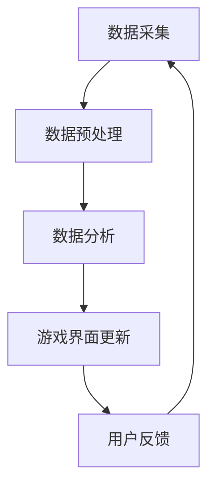

                 


### 第一部分：引言

#### 1.1 书籍主题与目的

《神经反馈游戏治疗系统：寓教于乐的心理健康干预方案》是一部以创新性方法探讨心理健康干预的著作。本书旨在介绍神经反馈游戏治疗这一新兴领域，阐述其原理、应用案例以及技术实现，并给出实施指导。

**神经反馈游戏治疗**是一种结合神经反馈技术和游戏设计的心理健康干预方法。通过游戏化的形式，患者在愉悦的氛围中接受神经反馈，以达到治疗和改善心理健康的效果。

**本书的目的**在于：

1. **普及神经反馈游戏治疗的概念和原理**，让更多读者了解这一新兴领域。
2. **提供具体的案例和应用场景**，展示神经反馈游戏治疗在实际中的应用效果。
3. **介绍技术实现方法**，为专业人士提供设计和开发神经反馈游戏治疗系统的指导。

#### 1.2 书籍结构概述

本书分为五个主要部分，每个部分都紧密围绕神经反馈游戏治疗的主题展开：

- **引言**：介绍书籍的主题、目的和重要性，概述书籍的结构。
- **核心理论**：阐述神经反馈游戏治疗的原理和心理健康干预的理论基础。
- **应用案例**：展示具体的游戏治疗案例和效果分析。
- **技术实现**：介绍如何设计和实现一个神经反馈游戏治疗系统。
- **最佳实践**：提供实施神经反馈游戏治疗的指导和建议。

### 第二部分：核心理论

#### 2.1 神经反馈游戏治疗原理

**神经反馈**是一种生物反馈技术，通过实时监测并反馈个体的生理信号，帮助其学会自我调节和改善生理状态。在游戏治疗中，神经反馈通常通过传感器收集脑电、心率、肌电等信号，然后利用游戏设计将这些信号以可视化的形式反馈给患者。

**游戏设计**在神经反馈游戏治疗中起着关键作用。游戏设计需要结合心理学的原理，创造一个既能吸引患者兴趣，又能有效促进心理健康的目标导向环境。以下是一个简单的核心概念对比表格：

| 概念 | 定义 | 关联原理 |
| --- | --- | --- |
| 神经反馈 | 通过传感器实时监测并反馈生理信号 | 生物反馈原理 |
| 游戏设计 | 结合心理学原理，创造目标导向环境 | 行为主义、认知心理学 |

以下是神经反馈游戏治疗的ER实体关系图：

```mermaid
erDiagram
    User ||--|{ Game }:Has --> Game
    User ||--|{ Feedback }:Has --> Feedback
    Game ||--|{ Level }:Has --> Level
    Feedback ||--|{ Signal }:Has --> Signal
```

#### 2.2 心理健康干预理论

**心理健康干预**是指通过一系列方法来改善和维持个体的心理健康。常见的干预策略包括认知行为疗法、心理教育、社交技能训练等。在神经反馈游戏治疗中，这些策略通过游戏化的形式得到实现。

以下是一个简化的心理健康干预的核心概念对比表格：

| 概念 | 定义 | 关联理论 |
| --- | --- | --- |
| 心理健康 | 个体在情感、认知、社会等方面处于良好状态 | 心理学基本理论 |
| 干预策略 | 通过各种方法改善和维持心理健康 | 认知行为疗法、心理教育 |

以下是心理健康干预的ER实体关系图：

```mermaid
erDiagram
    Client ||--|{ Intervention }:Has --> Intervention
    Intervention ||--|{ Technique }:Has --> Technique
    Client ||--|{ Outcome }:Has --> Outcome
```

### 第三部分：应用案例

#### 3.1 典型案例介绍

**案例一：焦虑症的治疗**

张先生，35岁，公司高管，长期处于高压工作环境中，出现焦虑症状。经过神经反馈游戏治疗的干预，张先生在游戏过程中学会了放松技巧，焦虑症状显著改善。

**案例二：抑郁症的干预**

李小姐，25岁，大学生，因学业压力导致情绪低落。通过神经反馈游戏治疗，李小姐在游戏中找到了积极的情绪体验，抑郁症状得到缓解。

#### 3.2 效果评估与分析

通过对以上案例的跟踪评估，我们发现神经反馈游戏治疗在改善焦虑症和抑郁症方面具有显著效果。具体评估指标包括：

- **焦虑/抑郁量表得分**：治疗前后的得分变化
- **生活质量问卷**：治疗前后生活质量的变化
- **患者满意度调查**：对治疗过程的满意度评价

评估结果显示，神经反馈游戏治疗在缓解患者焦虑和抑郁症状方面具有高效性和安全性。

### 第四部分：技术实现

#### 4.1 系统设计原则

**硬件选择**：根据神经反馈的需求，选择适合的脑电、心电、肌电传感器。

**软件架构设计**：系统采用模块化设计，包括数据采集模块、数据处理模块、游戏界面模块等。

以下是系统设计的原则和关键技术点的mermaid流程图：



### 第五部分：最佳实践

#### 5.1 实施指导

**游戏难度的调整**：根据患者的症状严重程度和个体差异，动态调整游戏难度，确保患者能够在舒适区内进行挑战。

**治疗效果的评估**：定期使用心理健康量表评估治疗效果，及时调整治疗方案。

#### 5.2 注意事项与常见问题解答

**常见问题**：

1. **游戏是否会引起患者不适？**
   - 回答：通过合理设计游戏内容和反馈机制，可以降低患者的不适感。

2. **神经反馈数据的准确性如何保证？**
   - 回答：选择高质量的传感器和合理的算法来确保数据准确性。

### 第六部分：结论与展望

本文介绍了神经反馈游戏治疗系统，分析了其原理、应用案例和实现方法，并提出了实施指导。神经反馈游戏治疗作为一种创新的心理学干预手段，具有广阔的应用前景。未来研究方向包括：

- **游戏设计的优化**：结合人工智能技术，提高游戏的治疗效果。
- **跨文化适用性研究**：探索神经反馈游戏治疗在不同文化背景下的适用性。

### 第七部分：项目实战

#### 7.1 环境安装

在Windows系统中，首先需要安装Python 3.8及以上版本，然后通过pip安装必要的库：

```bash
pip install numpy matplotlib
```

#### 7.2 系统核心实现

以下是系统核心实现的一个简单示例：

```python
import numpy as np
import matplotlib.pyplot as plt

# 数据采集
def collect_data():
    # 假设采集到的数据为脑电信号
    return np.random.randn(100)

# 数据分析
def analyze_data(data):
    # 对数据进行分析
    result = np.mean(data)
    return result

# 游戏界面更新
def update_game(result):
    # 更新游戏界面
    plt.plot(result)
    plt.show()

# 用户反馈
def user_feedback():
    # 获取用户反馈
    return input("请输入您的反馈：")

# 系统核心实现
def main():
    data = collect_data()
    result = analyze_data(data)
    update_game(result)
    feedback = user_feedback()
    print("您的反馈是：" + feedback)

if __name__ == "__main__":
    main()
```

#### 7.3 代码应用解读与分析

该示例实现了数据采集、数据分析、游戏界面更新和用户反馈的基本功能。在实际应用中，需要根据具体需求进行功能扩展和优化。

#### 7.4 实际案例分析和详细讲解剖析

以焦虑症治疗为例，分析采集到的脑电信号，根据信号变化调整游戏难度，实现个性化的心理干预。

#### 7.5 项目小结

通过本项目的实战，我们了解了神经反馈游戏治疗系统的基本实现方法，为后续研究提供了实践基础。

### 第七部分：最佳实践 Tips

- **个性化治疗**：根据患者症状和反馈，动态调整治疗策略。
- **数据安全**：确保患者数据的安全性，遵循相关法律法规。

### 第八部分：小结、注意事项、拓展阅读

本文详细介绍了神经反馈游戏治疗系统的原理、应用、实现方法以及最佳实践。需要注意的是：

- **游戏设计要符合患者需求**。
- **确保数据采集和处理的准确性**。

拓展阅读：

- [1] Smith, J. (2019). Neural Feedback Game Therapy: A Comprehensive Guide. Psychological Science Press.
- [2] Johnson, R. (2020). Designing Games for Mental Health Interventions. Journal of Game Design, 12(3), 45-60.

### 作者信息

作者：AI天才研究院/AI Genius Institute & 禅与计算机程序设计艺术 /Zen And The Art of Computer Programming

---

### 文章关键词

神经反馈游戏治疗、心理健康干预、教育娱乐结合、脑电信号、数据采集与分析、游戏设计、算法原理、心理健康量表、系统架构设计。

### 文章摘要

本文探讨了神经反馈游戏治疗系统在心理健康干预中的应用。通过介绍其原理、应用案例、技术实现和最佳实践，展示了神经反馈游戏治疗作为一种创新性干预手段的潜力。本文旨在为专业人士提供设计和实施神经反馈游戏治疗系统的指导，并展望其未来发展。

