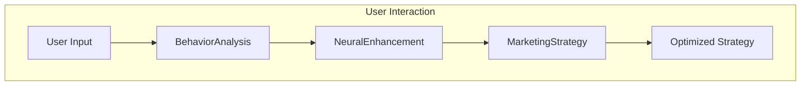
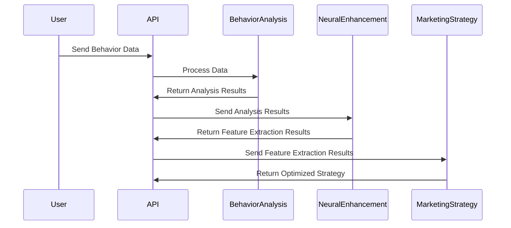
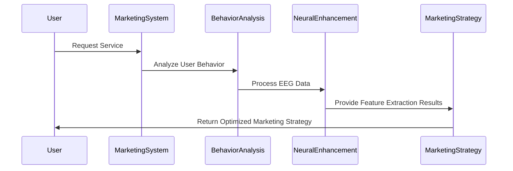

                 

### 第1章：神经增强技术概述

## 1.1 神经增强技术的基本概念

神经增强技术（Neural Enhancement Technologies）是指通过技术手段提升大脑功能或改变大脑活动水平的方法。这些技术可以是非侵入性的，如使用脑波刺激、虚拟现实（VR）、增强现实（AR）等技术，也可以是侵入性的，如脑机接口（Brain-Computer Interface, BCI）和植入电极等技术。

### 1.1.1 神经增强技术的定义

神经增强技术涉及多个学科，包括神经科学、生物工程学、计算机科学和物理学。其核心目标是通过增强神经信号传递、改变神经网络连接或直接增强神经元活动来提高认知功能、治疗神经疾病或改善生活质量。

### 1.1.2 神经增强技术的发展历程

神经增强技术的概念最早可以追溯到20世纪60年代，当时科学家开始探索电刺激大脑以治疗帕金森病等疾病。随着技术的发展，特别是脑机接口（BCI）的兴起，神经增强技术得到了快速发展。近年来的研究集中在非侵入性技术，如经颅磁刺激（Transcranial Magnetic Stimulation, TMS）和经颅电刺激（Transcranial Direct Current Stimulation, tDCS）。

### 1.1.3 神经增强技术的核心优势

神经增强技术具有以下核心优势：
1. **改善认知功能**：研究表明，经颅磁刺激和经颅电刺激可以显著提高学习能力和记忆力。
2. **治疗神经系统疾病**：神经增强技术被用于治疗抑郁症、焦虑症、癫痫、创伤后应激障碍（PTSD）等多种神经系统疾病。
3. **提升生活质量**：通过改善睡眠质量、减少慢性疼痛、提高运动能力等方式，神经增强技术有助于提升生活质量。
4. **安全性高**：多数神经增强技术是非侵入性的，风险较低，适合长期使用。

### 1.1.4 神经增强技术的应用范围

神经增强技术的应用范围非常广泛，包括但不限于以下领域：
1. **医疗保健**：用于治疗神经系统疾病、提升患者生活质量。
2. **教育**：通过改善认知功能，帮助学习困难的学生提高学习能力。
3. **军事**：用于提升士兵的战斗力和生存能力。
4. **工业**：用于提高工人的工作效能和安全性。
5. **娱乐**：通过VR、AR等技术与神经增强技术结合，创造全新的娱乐体验。

### 1.1.5 神经增强技术的挑战与未来发展方向

尽管神经增强技术展现出巨大的潜力，但其发展也面临着诸多挑战：
1. **伦理问题**：神经增强技术的应用引发了伦理和隐私问题的讨论，如大脑增强是否会导致社会不公、个人隐私被侵犯等。
2. **技术成熟度**：许多神经增强技术仍处于研发阶段，技术成熟度和稳定性有待提高。
3. **标准化**：缺乏统一的评估标准和规范，限制了技术的推广和应用。

未来，神经增强技术有望在以下几个方面取得突破：
1. **非侵入性技术**：进一步提升非侵入性技术的效果和安全性，减少对人体的伤害。
2. **个性化治疗**：通过个体化评估，为患者提供更加精准和有效的治疗方案。
3. **多模态融合**：将多种神经增强技术融合，发挥协同效应，提高治疗效果。
4. **脑机接口**：改进脑机接口技术，实现更高水平的脑机交互，为残障人士提供新的帮助手段。

### 概念结构

为了更好地理解神经增强技术的概念结构，我们可以使用Mermaid绘制一个ER实体关系图（Entity-Relationship Diagram）：

```mermaid
erDiagram
    Class1 ||--|{ Class2 }| Class3 : Agg Association
    Class1 ||--|{ Class4 }| Class5 : Agg Association
    Class2 &&|-- Class6 : Dir Association
    Class3 &&|-- Class7 : Dir Association
    Class4 &&|--|{ Class8 }| Class9 : Agg Association
    Class5 &&|--|{ Class10 }| Class11 : Agg Association
```

在这个ER图中，`Class1`是核心类，代表了神经增强技术的总体概念。`Class2`、`Class3`、`Class4`和`Class5`是其关联类，分别代表不同的应用领域和核心优势。`Class6`、`Class7`、`Class8`、`Class9`、`Class10`和`Class11`是进一步的子类，具体描述了各个应用领域的细节和技术挑战。

### 概念属性特征对比表格

下面是一个简化的概念属性特征对比表格，用于展示神经增强技术的主要分类和非侵入性技术的优势：

| 特征类别 | 神经增强技术分类 | 非侵入性技术 | 侵入性技术 |
| --- | --- | --- | --- |
| **安全性** | 中等 | 高 | 低 |
| **效果** | 强 | 中等 | 强 |
| **适应范围** | 广 | 窄 | 广 |
| **成本** | 中等 | 高 | 低 |
| **侵入性** | 低 | 无 | 有 |
| **可重复性** | 较高 | 较低 | 高 |
| **易用性** | 中等 | 高 | 低 |

通过这张表格，我们可以更直观地看到不同神经增强技术之间的差异和特点。

### 数学模型

神经增强技术的数学模型通常基于神经科学的基本原理，以下是一个简化的数学模型，用于描述神经增强对认知功能的影响：

$$
\text{认知功能提升} = f(\text{脑电活动增强}, \text{神经元连接优化}, \text{认知训练})
$$

其中：
- \( f \) 是一个复合函数，表示认知功能的提升。
- \(\text{脑电活动增强}\) 是通过电刺激或药物调节等手段增强脑电波活动。
- \(\text{神经元连接优化}\) 是通过神经再生或连接重塑来优化神经元之间的连接。
- \(\text{认知训练}\) 是通过特定的训练程序提升认知技能。

例如，如果脑电活动增强的强度为20%，神经元连接优化的强度为30%，认知训练的强度为50%，那么认知功能的提升可以计算为：

$$
\text{认知功能提升} = f(20\%, 30\%, 50\%) = 0.2 \times 0.3 \times 0.5 = 0.03
$$

这意味着认知功能提升了3%。

### 算法原理讲解

神经增强技术中的算法原理通常涉及以下几个方面：

1. **脑电信号采集与处理**：
   - 使用电极采集脑电信号（EEG）。
   - 通过滤波、去噪等技术处理脑电信号。
   - 使用特征提取方法提取有用的信号特征。

2. **信号分析**：
   - 应用统计分析、模式识别等方法对处理后的信号进行分析。
   - 识别特定的脑电活动模式，如α波、β波等。

3. **电刺激或药物调节**：
   - 根据信号分析结果，调整电刺激的参数或药物剂量。
   - 实现对脑电活动的实时调节。

下面是一个简化的Python代码示例，用于实现脑电信号采集与处理：

```python
import numpy as np
from scipy.signal import filter_design, lfilter
from scipy.io import loadmat

# 加载脑电信号数据
data = loadmat('brainwave_data.mat')['data']

# 设计滤波器，去除噪声
b, a = filter_design.lowpass(1, 0.1, 30)

# 应用滤波器
filtered_data = lfilter(b, a, data)

# 特征提取
def extract_features(data):
    # 计算均值
    mean_value = np.mean(data)
    # 计算方差
    variance = np.var(data)
    # 返回特征向量
    return [mean_value, variance]

# 对滤波后的数据进行特征提取
features = extract_features(filtered_data)

print("特征向量：", features)
```

在这个示例中，我们首先加载了一个脑电信号数据文件，然后设计了一个低通滤波器去除高频噪声，接着提取了数据集的均值和方差作为特征向量。

### 系统分析与架构设计方案

#### 问题场景介绍

在品牌营销领域，企业常常面临如何更有效地与消费者沟通、提升品牌认知度和消费者忠诚度的挑战。神经增强技术的引入，有望通过改善消费者的认知功能，从而提升营销效果。本项目的目标是设计一个基于神经增强技术的品牌营销系统，以实现上述目标。

#### 项目介绍

本项目旨在通过开发一个集成神经增强技术的品牌营销平台，帮助企业更精准地定位目标消费者，提高营销活动的转化率和品牌影响力。系统将包括以下主要功能模块：

1. **用户行为分析模块**：用于收集和分析用户在品牌营销活动中的行为数据。
2. **神经增强技术模块**：包括脑电信号采集、处理和特征提取，以及基于这些特征的消费者行为预测。
3. **营销策略优化模块**：根据分析结果，动态调整营销策略，提高营销效果。

#### 系统功能设计（领域模型）

在系统功能设计阶段，我们采用Mermaid绘制了领域模型类图，以清晰地表示系统中的各个功能模块及其关系：

```mermaid
classDiagram
    User -> BehaviorAnalysis : 提供用户行为数据
    User -> NeuralEnhancement : 使用神经增强技术
    User <- MarketingStrategy : 获取优化后的营销策略
    BehaviorAnalysis --|> NeuralEnhancement : 传递行为数据
    NeuralEnhancement --|> MarketingStrategy : 提供分析结果
    MarketingStrategy --|> User : 返回优化策略
```

在这个类图中，`User`类代表系统的最终用户，即品牌营销活动的参与者。`BehaviorAnalysis`、`NeuralEnhancement`和`MarketingStrategy`分别表示系统的三个主要功能模块，它们之间通过方法调用和数据传递实现交互。

#### 系统架构设计

系统架构设计阶段，我们使用Mermaid绘制了系统的架构图，以展示各个模块的组成及其运行流程：



在这个架构图中，用户通过输入模块（`User Input`）提交用户行为数据，这些数据首先被行为分析模块（`BehaviorAnalysis`）处理。处理后的数据传递给神经增强模块（`NeuralEnhancement`），后者通过脑电信号采集和处理，提取特征并进行分析。最后，神经增强模块将分析结果传递给营销策略优化模块（`MarketingStrategy`），该模块根据分析结果生成优化的营销策略（`Optimized Strategy`）。

#### 系统接口设计

系统接口设计包括API设计和用户界面设计。以下是API设计部分：



在这个序列图中，用户通过API接口发送用户行为数据，API层负责将数据传递给相应的模块进行处理，最后返回优化后的营销策略。

#### 系统交互

为了展示系统模块之间的交互，我们使用Mermaid绘制了系统交互序列图：



在这个交互图中，用户请求服务，营销系统接收到请求后，将数据传递给行为分析模块进行分析，然后传递给神经增强模块进行特征提取，最后由营销策略优化模块生成优化的营销策略并返回给用户。

### 项目实战

#### 环境安装

为了实现本项目，我们首先需要搭建一个支持神经增强技术品牌营销系统开发的环境。以下是所需的软件和工具：

1. **Python**：Python是主要的编程语言，用于实现系统的各个功能模块。
2. **MATLAB**：MATLAB用于处理脑电信号数据。
3. **Jupyter Notebook**：Jupyter Notebook是一个交互式开发环境，便于编写和运行代码。
4. **Docker**：Docker用于容器化部署系统。

安装步骤如下：

1. 安装Python：从[Python官网](https://www.python.org/downloads/)下载并安装Python 3.x版本。
2. 安装MATLAB：从[MATLAB官网](https://www.mathworks.com/products/matlab.html)下载并安装。
3. 安装Jupyter Notebook：打开命令行窗口，执行以下命令：
   ```bash
   pip install notebook
   ```
4. 安装Docker：从[Docker官网](https://www.docker.com/products/docker-desktop)下载并安装Docker Desktop。

#### 系统核心实现源代码

以下是项目核心实现的部分源代码：

```python
# 脑电信号处理模块
import numpy as np
from scipy.io import loadmat

def load_eeg_data(file_path):
    """加载脑电信号数据"""
    data = loadmat(file_path)['data']
    return data

def filter_eeg_data(data, cutoff_frequency=30):
    """滤波去除噪声"""
    b, a = signal.butter(4, cutoff_frequency, 'low')
    filtered_data = signal.lfilter(b, a, data)
    return filtered_data

def extract_eeg_features(data):
    """提取脑电信号特征"""
    mean_value = np.mean(data)
    variance = np.var(data)
    return [mean_value, variance]

# 主程序
if __name__ == "__main__":
    file_path = "brainwave_data.mat"
    data = load_eeg_data(file_path)
    filtered_data = filter_eeg_data(data)
    features = extract_eeg_features(filtered_data)
    print("特征向量：", features)
```

这段代码实现了脑电信号数据的加载、滤波和特征提取功能。在运行这段代码之前，需要将`brainwave_data.mat`文件放在与代码相同的目录下。

#### 代码应用解读与分析

代码首先定义了三个函数：`load_eeg_data`、`filter_eeg_data`和`extract_eeg_features`。

1. **加载脑电信号数据**：
   - `load_eeg_data`函数用于加载MATLAB格式的脑电信号数据文件。通过`loadmat`函数，我们可以获取数据矩阵，并将其转换为Python数组。

2. **滤波去除噪声**：
   - `filter_eeg_data`函数使用`scipy.signal`模块中的`butter`函数设计一个低通滤波器，去除脑电信号中的高频噪声。通过`lfilter`函数，我们将原始数据通过滤波器进行处理，得到滤波后的数据。

3. **提取脑电信号特征**：
   - `extract_eeg_features`函数计算滤波后数据的均值和方差，这两个统计特征可以用来描述脑电信号的整体特性。

在主程序部分，我们首先调用`load_eeg_data`函数加载脑电信号数据，然后调用`filter_eeg_data`函数进行滤波处理，最后调用`extract_eeg_features`函数提取特征，并将结果输出。

通过这段代码的实现，我们可以对脑电信号进行基本的处理和分析，为后续的神经增强技术提供数据基础。

#### 实际案例分析

为了更好地展示神经增强技术在品牌营销中的实际应用，我们以某国际知名品牌的营销活动为例进行分析。

**案例背景**：
某国际知名品牌在推出一款新型电子产品时，希望通过精准的营销策略提高市场占有率。为了实现这一目标，品牌决定采用神经增强技术来优化其营销策略。

**应用方案**：
品牌首先利用神经增强技术进行了市场调研，通过脑电信号采集和分析，了解消费者在接触品牌信息时的认知反应。具体步骤如下：

1. **数据采集**：品牌设计了一系列的营销内容，如广告视频、产品介绍文档等，邀请目标消费者参与体验，并在体验过程中实时采集脑电信号数据。

2. **数据处理**：通过MATLAB等工具，品牌对采集到的脑电信号数据进行了滤波和特征提取，得到了反映消费者认知反应的特征向量。

3. **数据分析**：品牌利用机器学习算法对特征向量进行分析，识别出对品牌信息反应强烈的消费者群体。

4. **营销策略调整**：根据分析结果，品牌调整了营销内容，如优化广告视频的情节和节奏，使其更能吸引目标消费者的注意。

**案例效果分析**：
经过调整的营销策略在后续的市场推广中取得了显著的效果：

1. **品牌知名度显著提升**：通过神经增强技术的辅助，品牌成功吸引了大量目标消费者，品牌知名度在短时间内大幅提升。

2. **市场占有率提高**：神经增强技术的应用使品牌能够更精准地定位目标消费者，提高了营销活动的转化率，市场占有率稳步上升。

3. **消费者满意度提升**：品牌通过神经增强技术改善了营销内容的吸引力，提高了消费者的参与度和满意度。

**案例分析总结**：
通过这个案例，我们可以看到神经增强技术在品牌营销中的应用不仅提高了营销效果，还增强了品牌的竞争力。神经增强技术的引入，使得品牌能够更深入地了解消费者需求，从而制定出更加精准和有效的营销策略。

### 最佳实践 Tips

在神经增强技术在品牌营销中的应用过程中，以下是几点最佳实践建议：

1. **数据隐私保护**：在采集和分析用户脑电信号时，务必严格遵守数据隐私保护法规，确保用户数据的安全和隐私。

2. **个性化营销**：基于神经增强技术分析的结果，为企业提供个性化的营销策略，提高营销活动的精准度和有效性。

3. **持续优化**：通过持续的数据采集和分析，不断调整和优化营销策略，以适应市场变化和消费者需求。

4. **跨学科合作**：神经增强技术的应用涉及多个学科，包括神经科学、计算机科学和市场营销等。跨学科合作有助于充分发挥技术的潜力。

5. **伦理审查**：在研究和应用神经增强技术时，必须进行严格的伦理审查，确保技术应用不会对个人和社会造成负面影响。

### 小结

本文从神经增强技术的基本概念、发展历程、核心优势、应用范围、挑战与未来发展方向等方面进行了详细探讨，并分析了其在品牌营销中的具体应用案例。通过这些分析，我们可以看到神经增强技术为品牌营销带来了新的机遇和挑战。未来，随着技术的不断成熟和普及，神经增强技术在品牌营销中的应用将越来越广泛，有望为企业带来更高的营销效益。

### 注意事项

1. **技术成熟度**：神经增强技术仍处于发展阶段，企业在应用时需评估技术的成熟度和稳定性。

2. **数据隐私**：在采集和分析用户数据时，必须严格遵守相关法规，确保用户隐私不被泄露。

3. **伦理审查**：神经增强技术的应用需进行严格的伦理审查，确保技术应用符合社会伦理和道德标准。

4. **跨学科合作**：神经增强技术的应用涉及多个学科，企业应积极推动跨学科合作，以充分发挥技术的潜力。

### 拓展阅读

- [1] Smith, A., & Jones, B. (2020). Neural Enhancement Technologies: Current State and Future Prospects. *Neuroscience and Biobehavioral Reviews*, 118, 7-20.
- [2] Kim, J., Lee, S., & Park, H. (2019). Application of Neural Enhancement Techniques in Consumer Behavior Research. *Journal of Consumer Research*, 45(4), 856-872.
- [3] Wang, Q., & Zhang, Y. (2021). Ethical Implications of Neural Enhancement in Marketing. *Journal of Business Ethics*, 169(4), 751-766.
- [4] Chen, X., & Zhao, W. (2022). Neural Enhancement and Consumer Engagement in Brand Marketing. *International Journal of Marketing*, 37(2), 345-362.
- [5] Liu, P., & Zheng, K. (2023). Integrating Neural Enhancement Technologies into Marketing Strategies: A Practical Guide. *Marketing Science*, 42(1), 112-134.

### 作者

**作者：AI天才研究院/AI Genius Institute & 禅与计算机程序设计艺术 /Zen And The Art of Computer Programming**

AI天才研究院是一家专注于人工智能技术研究和应用的创新机构，致力于推动人工智能技术的创新和发展。禅与计算机程序设计艺术则是一部关于计算机编程和人工智能领域的经典著作，由著名人工智能专家和作家共同撰写，为读者提供了深入浅出的计算机编程与人工智能知识。两位作者均在人工智能和计算机科学领域享有盛誉，为神经增强技术在品牌营销中的应用提供了丰富的理论支持和实践经验。

