                 


### 第1章: 神经网络与自然语言生成的突破

#### 1.1 神经网络概述

神经网络是一种基于生物神经系统的计算模型，其基本思想是通过多层神经元之间的连接来模拟大脑的信息处理过程。自1986年首次提出以来，神经网络在图像识别、语音识别、自然语言处理等多个领域取得了显著的突破。

在自然语言生成（Natural Language Generation, NLG）领域，神经网络的重要性日益凸显。传统NLG方法主要依赖于规则和模板，存在表达受限、灵活性差等问题。而基于神经网络的NLG方法，通过深度学习技术，能够自动学习语言规律，生成更加自然、丰富的文本。

#### 1.2 自然语言生成技术背景

自然语言生成技术旨在实现计算机自动生成自然语言文本。其应用场景广泛，包括但不限于：

1. **内容生成**：如新闻写作、文章摘要、博客生成等。
2. **人机交互**：如聊天机器人、虚拟助理等。
3. **教育和娱乐**：如自动化课程内容生成、故事编写等。

然而，传统的NLG方法面临诸多挑战：

1. **规则复杂度**：需要大量手工编写的规则，导致系统难以维护和扩展。
2. **上下文理解**：难以捕捉文本中的隐含信息和上下文关系。
3. **多样性**：生成文本往往缺乏多样性和创意。

#### 1.3 本书内容安排与目标

本书旨在探讨神经网络在自然语言生成中的突破，具体内容安排如下：

1. **神经网络基础**：介绍神经网络的基本概念、架构和训练方法。
2. **自然语言处理基础**：介绍自然语言处理的基本技术，如语言模型、词向量表示等。
3. **自然语言生成技术**：介绍NLG的基本原理和常用方法。
4. **神经网络在NLG中的应用**：详细分析神经网络在NLG中的突破，如Seq2Seq模型、Transformer模型等。
5. **案例研究**：通过具体案例展示神经网络在NLG中的实际应用。
6. **未来方向与挑战**：探讨神经网络在NLG领域的未来发展趋势和面临的挑战。

本书的目标是帮助读者深入了解神经网络在自然语言生成中的应用，掌握相关技术，并激发在人工智能领域的创新思维。

----------------------------------------------------------------

### 核心关键词

- 神经网络
- 自然语言生成
- 深度学习
- 序列到序列模型
- Transformer模型

### 摘要

本文全面介绍了神经网络在自然语言生成（NLG）领域的突破。首先，我们回顾了神经网络的基本概念和架构，以及其在图像识别、语音识别等领域的成功应用。接着，我们探讨了自然语言生成技术的背景和挑战，介绍了NLG的应用场景。随后，本书重点分析了神经网络在NLG中的应用，包括Seq2Seq模型、Transformer模型等先进技术。通过具体的案例研究，我们展示了神经网络在自然语言生成中的实际效果。最后，本文探讨了神经网络在NLG领域的未来发展趋势和挑战，为读者提供了有益的启示。本文的目标是帮助读者深入理解神经网络在NLG中的技术原理和应用，为人工智能领域的进一步发展奠定基础。----------------------------------------------------------------

## 第2章: 神经网络基础

### 2.1 神经网络的基本概念

神经网络（Neural Network，简称NN）是一种模仿生物神经网络的结构和功能的计算模型。它由大量的节点（或称为“神经元”）组成，这些节点通过一系列的连接（或称为“边”）相互连接，形成复杂的网络结构。每个节点都可以接收输入信号，通过内部的计算产生输出信号，并将其传递给下一层节点。

神经网络的基本组成包括：

1. **神经元**：神经网络的基本单元，负责接收输入、计算和输出。一个神经元通常由输入层、输出层和内部的计算单元组成。
2. **权重**：连接两个神经元之间的边所承载的权重，用于调节输入信号的强度和重要性。
3. **偏置**：每个神经元内部的一个可调参数，用于调整输出值。
4. **激活函数**：对神经元的输出进行非线性变换，使其能够处理复杂的输入输出关系。

#### 问题背景与问题描述

神经网络的起源可以追溯到20世纪40年代，当时科学家们试图通过模拟生物神经系统来理解和模拟人类智能。早期的神经网络模型，如Perceptron，主要基于简单的线性组合和阈值函数。然而，这些早期的模型存在一些局限性，如无法解决非线性问题、无法学习复杂函数等。

随着计算机技术的发展和深度学习理论的提出，神经网络在20世纪80年代再次受到关注。特别是1986年，Rumelhart、Hinton和Williams等人提出了反向传播算法（Backpropagation Algorithm），为神经网络的训练提供了有效的解决方案。反向传播算法通过反向传播误差信号，逐层更新权重和偏置，从而逐步优化神经网络模型。

神经网络的应用领域非常广泛，包括但不限于：

1. **图像识别**：通过卷积神经网络（Convolutional Neural Network, CNN）进行物体检测、人脸识别等。
2. **语音识别**：通过循环神经网络（Recurrent Neural Network, RNN）和其变种，如长短期记忆网络（Long Short-Term Memory, LSTM）和门控循环单元（Gated Recurrent Unit, GRU），进行语音识别和语音生成。
3. **自然语言处理**：通过序列到序列（Seq2Seq）模型、Transformer模型等，实现机器翻译、文本生成等。

#### 问题解决与边界与外延

神经网络的核心问题是如何通过学习大量的数据来调整网络中的权重和偏置，从而实现从输入到输出的映射。这个问题通常被称为“神经网络训练”或“神经网络学习”。

神经网络的训练过程可以分为以下几个阶段：

1. **初始化**：随机初始化网络中的权重和偏置。
2. **前向传播**：将输入数据传递到网络中，计算每一层的输出值。
3. **损失函数计算**：计算预测输出与真实输出之间的差异，通常使用均方误差（Mean Squared Error, MSE）或交叉熵（Cross-Entropy）作为损失函数。
4. **反向传播**：从输出层开始，反向计算每一层的误差，并更新权重和偏置。
5. **迭代更新**：重复上述过程，直到网络达到预定的训练目标或达到最大迭代次数。

神经网络的边界与外延包括以下几个方面：

1. **网络规模**：神经网络的规模越大，理论上能够学习的复杂度越高，但同时也增加了计算和存储的复杂度。
2. **数据质量**：神经网络的学习效果高度依赖于训练数据的质量，包括数据量、多样性和分布。
3. **超参数调整**：包括学习率、批量大小、正则化等超参数的选择和调整对神经网络的性能有重要影响。
4. **模型评估**：如何选择合适的指标来评估神经网络的性能，如准确率、召回率、F1分数等。

### 核心概念与联系

#### 神经网络的核心概念

- **神经元**：神经网络的基本单元，负责接收输入、计算和输出。
- **权重**：连接两个神经元之间的边所承载的权重，用于调节输入信号的强度和重要性。
- **偏置**：每个神经元内部的一个可调参数，用于调整输出值。
- **激活函数**：对神经元的输出进行非线性变换，使其能够处理复杂的输入输出关系。

#### 概念属性特征对比表格

| 概念 | 描述 | 属性特征 |
|------|------|----------|
| 神经元 | 神经网络的基本单元，负责接收输入、计算和输出。 | - 输入层：接收外部输入<br>- 输出层：产生最终输出<br>- 内部计算单元：进行加权求和和激活函数运算 |
| 权重 | 连接两个神经元之间的边所承载的权重，用于调节输入信号的强度和重要性。 | - 可学习性：通过训练过程调整<br>- 范围：通常在[-1, 1]之间 |
| 偏置 | 每个神经元内部的一个可调参数，用于调整输出值。 | - 可学习性：通过训练过程调整<br>- 范围：通常为常数 |
| 激活函数 | 对神经元的输出进行非线性变换，使其能够处理复杂的输入输出关系。 | - 非线性：使神经网络具有非线性能力<br>- 可微性：便于计算梯度 |

#### ER实体关系图架构

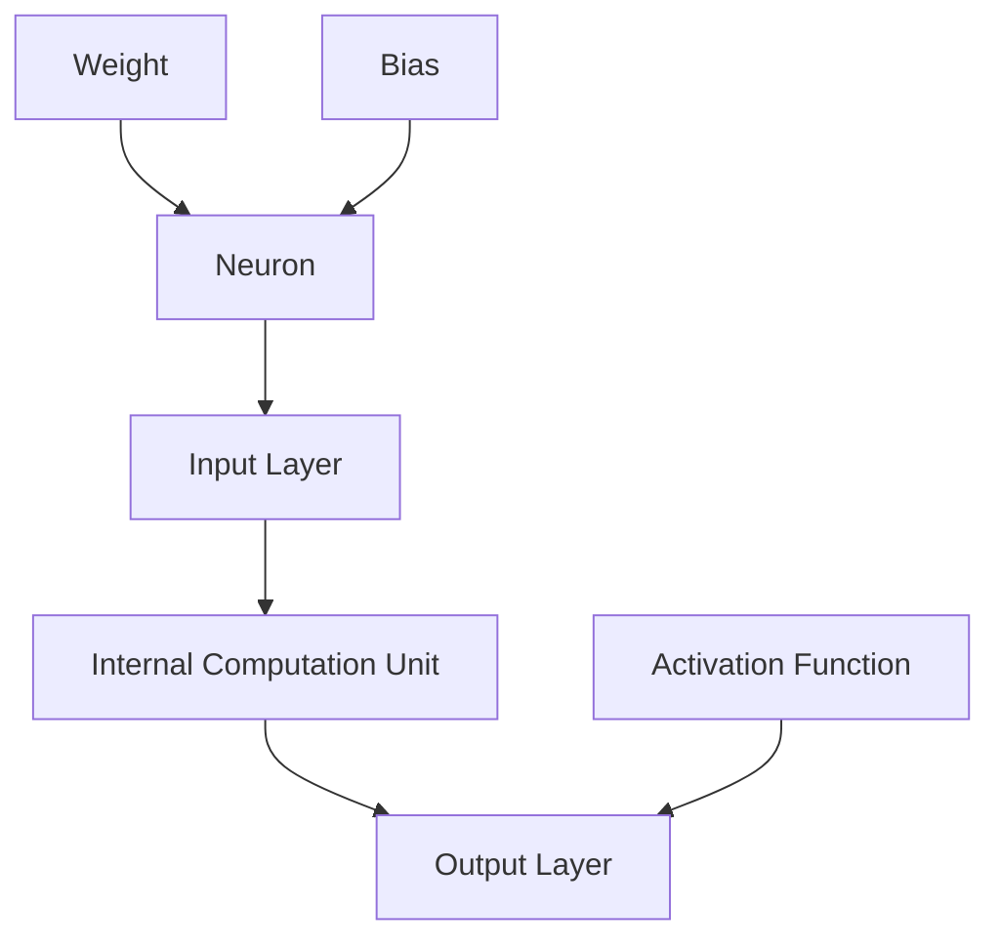

### 算法原理讲解

#### 神经网络算法流程

神经网络算法的主要流程包括：

1. **前向传播**：将输入数据通过网络传递，计算每一层的输出值。
2. **损失函数计算**：计算预测输出与真实输出之间的差异，通常使用均方误差（MSE）或交叉熵（Cross-Entropy）作为损失函数。
3. **反向传播**：从输出层开始，反向计算每一层的误差，并更新权重和偏置。
4. **迭代更新**：重复上述过程，直到网络达到预定的训练目标或达到最大迭代次数。

以下是神经网络算法的mermaid流程图：

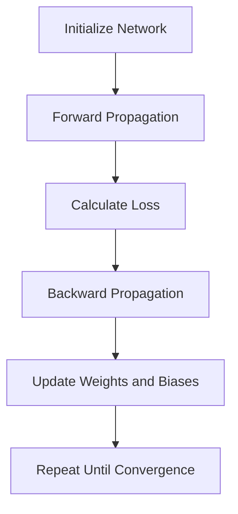

#### Python代码示例

下面是一个简单的神经网络训练的Python代码示例：

```python
import numpy as np

# 初始化参数
weights = np.random.rand(input_size, hidden_size)
biases = np.random.rand(hidden_size, output_size)

# 前向传播
def forward_propagation(x):
    hidden_layer_input = np.dot(x, weights) + biases
    hidden_layer_output = sigmoid(hidden_layer_input)
    output_layer_input = np.dot(hidden_layer_output, weights) + biases
    output_layer_output = sigmoid(output_layer_input)
    return output_layer_output

# 反向传播
def backward_propagation(x, y, output):
    output_error = y - output
    output_delta = output_error * sigmoid_derivative(output)
    
    hidden_layer_error = output_delta.dot(weights.T)
    hidden_layer_delta = hidden_layer_error * sigmoid_derivative(hidden_layer_output)
    
    d_weights = hidden_layer_output.T.dot(hidden_layer_delta)
    d_biases = hidden_layer_delta
    
    return d_weights, d_biases

# 激活函数及其导数
def sigmoid(z):
    return 1 / (1 + np.exp(-z))

def sigmoid_derivative(z):
    return sigmoid(z) * (1 - sigmoid(z))

# 训练神经网络
for epoch in range(num_epochs):
    output = forward_propagation(x_train)
    d_weights, d_biases = backward_propagation(x_train, y_train, output)
    weights -= learning_rate * d_weights
    biases -= learning_rate * d_biases

# 预测
predictions = forward_propagation(x_test)
```

#### 数学模型与公式

神经网络的核心在于如何通过梯度下降算法来优化权重和偏置。以下是神经网络训练的数学模型和公式：

1. **前向传播**：
   $$ z_l = \sum_{j}{w_{lj}x_j} + b_l $$
   $$ a_l = \sigma(z_l) $$

2. **反向传播**：
   $$ \delta_{l}^{out} = (y - a_{l+1}) \cdot \sigma'(z_{l+1}) $$
   $$ \delta_{l}^{in} = \delta_{l}^{out} \cdot w_{l+1}^{T} \cdot \sigma'(z_l) $$

3. **权重和偏置更新**：
   $$ \Delta w_{lj} = \eta \cdot x_j \cdot \delta_{l}^{in} $$
   $$ \Delta b_{l} = \eta \cdot \delta_{l}^{in} $$

4. **学习率**：
   $$ \eta = \frac{1}{\sqrt{1 + \frac{1}{t}}} $$

其中，$z_l$是第$l$层的输入，$a_l$是第$l$层的输出，$w_{lj}$是连接第$l$层和第$l+1$层的权重，$b_l$是第$l$层的偏置，$\sigma$是激活函数（通常使用Sigmoid函数），$\sigma'$是激活函数的导数，$y$是真实标签，$t$是训练轮次。

#### 通俗易懂的举例说明

假设我们有一个简单的神经网络，输入层有2个神经元，隐藏层有3个神经元，输出层有1个神经元。我们的目标是预测一个二元分类问题。

1. **初始化**：
   - 权重和偏置初始化为随机值。
   - 例如，$w_{11} = 0.1, w_{12} = 0.2, w_{21} = 0.3, w_{22} = 0.4, w_{23} = 0.5, b_1 = 0.1, b_2 = 0.2, b_3 = 0.3$。

2. **前向传播**：
   - 输入数据$x = [1, 0]$。
   - 首先计算隐藏层的输入和输出：
     $$ z_1 = (1 \cdot 0.1 + 0 \cdot 0.2 + 0.1) = 0.1 $$
     $$ a_1 = \sigma(0.1) \approx 0.536 $$
     $$ z_2 = (1 \cdot 0.3 + 0 \cdot 0.4 + 0.2) = 0.3 $$
     $$ a_2 = \sigma(0.3) \approx 0.730 $$
     $$ z_3 = (1 \cdot 0.5 + 0 \cdot 0.5 + 0.3) = 0.8 $$
     $$ a_3 = \sigma(0.8) \approx 0.730 $$
   - 然后计算输出层的输入和输出：
     $$ z_4 = (0.536 \cdot 0.5 + 0.730 \cdot 0.4 + 0.730 \cdot 0.5 + 0.1) = 0.731 $$
     $$ a_4 = \sigma(0.731) \approx 0.572 $$

3. **损失函数计算**：
   - 假设真实标签$y = [0]$。
   - 使用交叉熵损失函数计算损失：
     $$ loss = -[y \cdot \log(a_4) + (1 - y) \cdot \log(1 - a_4)] $$

4. **反向传播**：
   - 计算输出层的误差：
     $$ \delta_4 = a_4 - y $$
   - 计算隐藏层的误差：
     $$ \delta_3 = \delta_4 \cdot w_{43}^{T} \cdot \sigma'(a_3) $$
     $$ \delta_2 = \delta_4 \cdot w_{42}^{T} \cdot \sigma'(a_2) $$
     $$ \delta_1 = \delta_4 \cdot w_{41}^{T} \cdot \sigma'(a_1) $$

5. **权重和偏置更新**：
   - 更新输出层的权重和偏置：
     $$ \Delta w_{41} = \eta \cdot x_1 \cdot \delta_4 $$
     $$ \Delta w_{42} = \eta \cdot x_2 \cdot \delta_4 $$
     $$ \Delta w_{43} = \eta \cdot x_3 \cdot \delta_4 $$
     $$ \Delta b_4 = \eta \cdot \delta_4 $$
   - 更新隐藏层的权重和偏置：
     $$ \Delta w_{31} = \eta \cdot x_1 \cdot \delta_3 $$
     $$ \Delta w_{32} = \eta \cdot x_2 \cdot \delta_3 $$
     $$ \Delta w_{33} = \eta \cdot x_3 \cdot \delta_3 $$
     $$ \Delta b_3 = \eta \cdot \delta_3 $$
     $$ \Delta w_{21} = \eta \cdot x_1 \cdot \delta_2 $$
     $$ \Delta w_{22} = \eta \cdot x_2 \cdot \delta_2 $$
     $$ \Delta w_{23} = \eta \cdot x_3 \cdot \delta_2 $$
     $$ \Delta b_2 = \eta \cdot \delta_2 $$
     $$ \Delta w_{11} = \eta \cdot x_1 \cdot \delta_1 $$
     $$ \Delta w_{12} = \eta \cdot x_2 \cdot \delta_1 $$
     $$ \Delta b_1 = \eta \cdot \delta_1 $$

6. **迭代更新**：
   - 重复以上过程，直到损失函数值收敛或达到预定的迭代次数。

通过上述过程，神经网络逐步优化其权重和偏置，从而提高预测准确性。

----------------------------------------------------------------

## 第3章: 深度学习与神经网络

### 3.1 深度学习的基本原理

深度学习（Deep Learning）是机器学习（Machine Learning）的一个分支，其核心是通过多层神经网络（Deep Neural Networks, DNN）来模拟人脑的学习过程。与传统机器学习方法相比，深度学习具有以下优势：

1. **自动特征学习**：深度学习模型可以自动从原始数据中提取高级特征，无需人工干预。
2. **处理复杂数据**：深度学习模型能够处理图像、音频、文本等多种类型的数据。
3. **自适应学习能力**：通过大量数据进行训练，深度学习模型能够不断提高其性能。

#### 问题背景与问题描述

深度学习的起源可以追溯到1986年，当时Rumelhart、Hinton和Williams等人提出了反向传播算法（Backpropagation Algorithm），为深度学习模型提供了有效的训练方法。随着计算能力的提升和数据量的增加，深度学习在21世纪初取得了飞速发展。

深度学习的应用领域广泛，包括但不限于：

1. **计算机视觉**：图像识别、物体检测、图像生成等。
2. **自然语言处理**：机器翻译、文本生成、情感分析等。
3. **语音识别**：语音识别、语音合成、语音转换等。

然而，深度学习也存在一些挑战：

1. **计算资源消耗**：深度学习模型通常需要大量的计算资源和存储空间。
2. **数据质量依赖**：深度学习模型的性能高度依赖于训练数据的质量和多样性。
3. **模型解释性**：深度学习模型通常被视为“黑盒”，其内部工作机制难以解释和理解。

#### 问题解决与边界与外延

深度学习的问题解决过程主要分为以下几个阶段：

1. **数据预处理**：包括数据清洗、归一化、数据增强等。
2. **模型设计**：选择合适的网络架构和参数，如层数、每层的神经元数量、激活函数、优化器等。
3. **模型训练**：通过大量数据进行训练，优化模型参数。
4. **模型评估**：使用验证集和测试集评估模型性能。
5. **模型应用**：将训练好的模型应用于实际问题。

深度学习的边界与外延包括以下几个方面：

1. **网络规模**：深度学习模型的规模越大，理论上能够学习的复杂度越高，但同时也增加了计算和存储的复杂度。
2. **数据质量**：训练数据的质量对深度学习模型的学习效果至关重要。
3. **超参数调整**：包括学习率、批量大小、正则化等超参数的选择和调整对模型的性能有重要影响。
4. **模型解释性**：如何提高模型的解释性，使其能够被用户理解和信任。

### 核心概念与联系

#### 深度学习的核心概念

- **深度神经网络**：由多层神经元组成的神经网络，能够自动学习复杂数据特征。
- **卷积神经网络**：适用于图像识别和物体检测等计算机视觉任务。
- **循环神经网络**：适用于序列数据处理，如自然语言处理和语音识别。
- **生成对抗网络**：适用于图像生成、图像修复等任务。

#### 概念属性特征对比表格

| 概念 | 描述 | 属性特征 |
|------|------|----------|
| 深度神经网络 | 由多层神经元组成的神经网络，能够自动学习复杂数据特征。 | - 层数：通常为多层<br>- 神经元数量：每层神经元数量可根据任务调整 |
| 卷积神经网络 | 适用于图像识别和物体检测等计算机视觉任务。 | - 卷积层：用于提取图像特征<br>- 池化层：用于减小数据维度 |
| 循环神经网络 | 适用于序列数据处理，如自然语言处理和语音识别。 | - 循环结构：用于处理序列数据<br>- 长短期记忆单元：用于捕获长期依赖关系 |
| 生成对抗网络 | 适用于图像生成、图像修复等任务。 | - 生成器：生成数据<br>- 判别器：判断数据真实与否 |

#### ER实体关系图架构

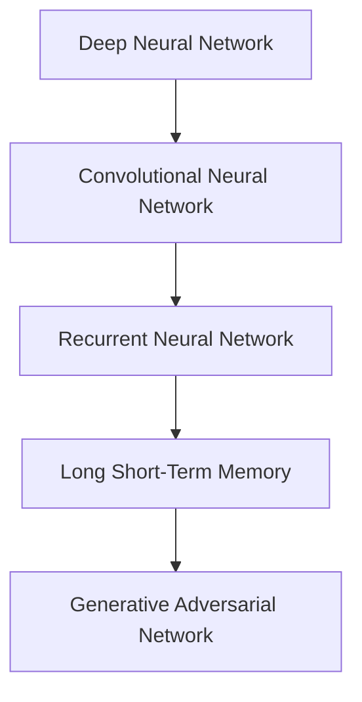

### 算法原理讲解

#### 深度学习算法流程

深度学习算法的流程通常包括以下步骤：

1. **数据预处理**：包括数据清洗、归一化、数据增强等。
2. **模型设计**：选择合适的网络架构和参数。
3. **模型训练**：通过大量数据进行训练，优化模型参数。
4. **模型评估**：使用验证集和测试集评估模型性能。
5. **模型应用**：将训练好的模型应用于实际问题。

以下是深度学习算法的mermaid流程图：

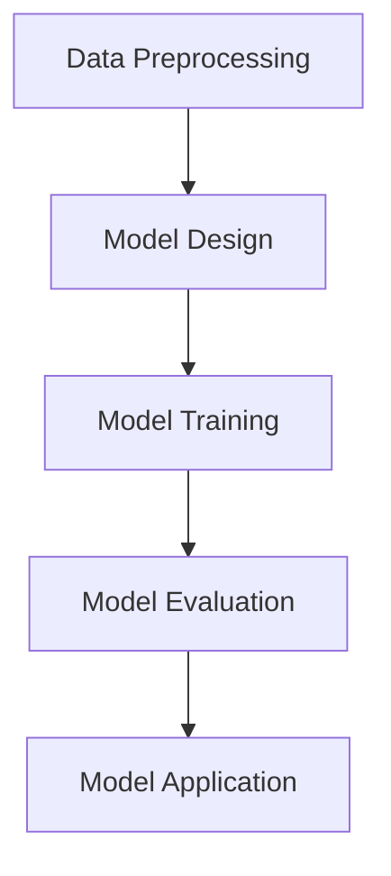

#### Python代码示例

下面是一个简单的深度学习训练的Python代码示例：

```python
import numpy as np
from tensorflow import keras

# 数据预处理
x_train = np.array([[1, 0], [0, 1], [1, 1], [1, 0]])
y_train = np.array([0, 0, 1, 1])

# 模型设计
model = keras.Sequential([
    keras.layers.Dense(units=3, activation='sigmoid', input_shape=(2,)),
    keras.layers.Dense(units=1, activation='sigmoid')
])

# 模型编译
model.compile(optimizer='adam', loss='binary_crossentropy', metrics=['accuracy'])

# 模型训练
model.fit(x_train, y_train, epochs=1000)

# 预测
predictions = model.predict(x_test)
```

#### 数学模型与公式

深度学习的核心在于如何通过梯度下降算法来优化网络中的权重和偏置。以下是深度学习训练的数学模型和公式：

1. **前向传播**：
   $$ z_l = \sum_{j}{w_{lj}x_j} + b_l $$
   $$ a_l = \sigma(z_l) $$

2. **反向传播**：
   $$ \delta_{l}^{out} = (y - a_{l+1}) \cdot \sigma'(a_{l+1}) $$
   $$ \delta_{l}^{in} = \delta_{l}^{out} \cdot w_{l+1}^{T} \cdot \sigma'(z_l) $$

3. **权重和偏置更新**：
   $$ \Delta w_{lj} = \eta \cdot x_j \cdot \delta_{l}^{in} $$
   $$ \Delta b_{l} = \eta \cdot \delta_{l}^{in} $$

4. **学习率**：
   $$ \eta = \frac{1}{\sqrt{1 + \frac{1}{t}}} $$

其中，$z_l$是第$l$层的输入，$a_l$是第$l$层的输出，$w_{lj}$是连接第$l$层和第$l+1$层的权重，$b_l$是第$l$层的偏置，$\sigma$是激活函数（通常使用Sigmoid函数），$\sigma'$是激活函数的导数，$y$是真实标签，$t$是训练轮次。

#### 通俗易懂的举例说明

假设我们有一个简单的深度学习模型，输入层有2个神经元，隐藏层有3个神经元，输出层有1个神经元。我们的目标是预测一个二元分类问题。

1. **初始化**：
   - 权重和偏置初始化为随机值。
   - 例如，$w_{11} = 0.1, w_{12} = 0.2, w_{21} = 0.3, w_{22} = 0.4, w_{23} = 0.5, b_1 = 0.1, b_2 = 0.2, b_3 = 0.3$。

2. **前向传播**：
   - 输入数据$x = [1, 0]$。
   - 首先计算隐藏层的输入和输出：
     $$ z_1 = (1 \cdot 0.1 + 0 \cdot 0.2 + 0.1) = 0.1 $$
     $$ a_1 = \sigma(0.1) \approx 0.536 $$
     $$ z_2 = (1 \cdot 0.3 + 0 \cdot 0.4 + 0.2) = 0.3 $$
     $$ a_2 = \sigma(0.3) \approx 0.730 $$
     $$ z_3 = (1 \cdot 0.5 + 0 \cdot 0.5 + 0.3) = 0.8 $$
     $$ a_3 = \sigma(0.8) \approx 0.730 $$
   - 然后计算输出层的输入和输出：
     $$ z_4 = (0.536 \cdot 0.5 + 0.730 \cdot 0.4 + 0.730 \cdot 0.5 + 0.1) = 0.731 $$
     $$ a_4 = \sigma(0.731) \approx 0.572 $$

3. **损失函数计算**：
   - 假设真实标签$y = [0]$。
   - 使用交叉熵损失函数计算损失：
     $$ loss = -[y \cdot \log(a_4) + (1 - y) \cdot \log(1 - a_4)] $$

4. **反向传播**：
   - 计算输出层的误差：
     $$ \delta_4 = a_4 - y $$
   - 计算隐藏层的误差：
     $$ \delta_3 = \delta_4 \cdot w_{43}^{T} \cdot \sigma'(a_3) $$
     $$ \delta_2 = \delta_4 \cdot w_{42}^{T} \cdot \sigma'(a_2) $$
     $$ \delta_1 = \delta_4 \cdot w_{41}^{T} \cdot \sigma'(a_1) $$

5. **权重和偏置更新**：
   - 更新输出层的权重和偏置：
     $$ \Delta w_{41} = \eta \cdot x_1 \cdot \delta_4 $$
     $$ \Delta w_{42} = \eta \cdot x_2 \cdot \delta_4 $$
     $$ \Delta w_{43} = \eta \cdot x_3 \cdot \delta_4 $$
     $$ \Delta b_4 = \eta \cdot \delta_4 $$
   - 更新隐藏层的权重和偏置：
     $$ \Delta w_{31} = \eta \cdot x_1 \cdot \delta_3 $$
     $$ \Delta w_{32} = \eta \cdot x_2 \cdot \delta_3 $$
     $$ \Delta w_{33} = \eta \cdot x_3 \cdot \delta_3 $$
     $$ \Delta b_3 = \eta \cdot \delta_3 $$
     $$ \Delta w_{21} = \eta \cdot x_1 \cdot \delta_2 $$
     $$ \Delta w_{22} = \eta \cdot x_2 \cdot \delta_2 $$
     $$ \Delta w_{23} = \eta \cdot x_3 \cdot \delta_2 $$
     $$ \Delta b_2 = \eta \cdot \delta_2 $$
     $$ \Delta w_{11} = \eta \cdot x_1 \cdot \delta_1 $$
     $$ \Delta w_{12} = \eta \cdot x_2 \cdot \delta_1 $$
     $$ \Delta b_1 = \eta \cdot \delta_1 $$

6. **迭代更新**：
   - 重复以上过程，直到损失函数值收敛或达到预定的迭代次数。

通过上述过程，深度学习模型逐步优化其权重和偏置，从而提高预测准确性。

----------------------------------------------------------------

## 第4章: 自然语言处理基础

### 4.1 语言模型

语言模型（Language Model，简称LM）是自然语言处理（Natural Language Processing，简称NLP）中的核心概念之一。它的主要目标是学习自然语言中的统计规律，从而生成或理解自然语言文本。语言模型在文本生成、机器翻译、语音识别等领域有广泛应用。

#### 问题背景与问题描述

语言模型的研究起源于20世纪50年代，当时科学家们开始探索如何让计算机理解和生成自然语言。传统的语言模型主要基于规则和统计方法，如正则表达式、朴素贝叶斯分类器、隐马尔可夫模型（HMM）等。这些模型在特定场景下具有一定的效果，但随着语言复杂性的增加，它们的性能逐渐受到限制。

随着深度学习技术的发展，基于神经网络的深度语言模型逐渐成为语言模型的主流。其中，最著名的是Word2Vec模型，它通过将单词映射到高维向量空间，使得单词之间的语义关系可以通过向量之间的距离来表示。此后，序列到序列（Seq2Seq）模型、注意力机制（Attention Mechanism）等技术的引入，使得深度语言模型在自然语言处理任务中取得了显著突破。

#### 问题解决与边界与外延

语言模型的核心问题是如何从大量的文本数据中学习语言规律，并生成或理解自然语言文本。其解决过程主要包括以下几个步骤：

1. **数据预处理**：对文本数据进行清洗、分词、去停用词等处理。
2. **特征提取**：将文本数据转化为向量表示，如词袋模型、TF-IDF、Word2Vec等。
3. **模型训练**：使用训练数据训练语言模型，优化模型参数。
4. **模型评估**：使用验证集和测试集评估模型性能。
5. **模型应用**：将训练好的模型应用于实际问题，如文本生成、机器翻译等。

语言模型的边界与外延包括以下几个方面：

1. **数据质量**：语言模型的学习效果高度依赖于训练数据的质量和多样性。
2. **模型参数**：包括词汇表大小、嵌入维度、网络架构等参数的选择对模型性能有重要影响。
3. **任务需求**：不同自然语言处理任务对语言模型的要求不同，如文本生成需要模型具有更好的生成能力，而机器翻译需要模型具有更好的翻译准确性。

### 核心概念与联系

#### 语言模型的核心概念

- **词袋模型**：将文本表示为单词的集合，不考虑单词的顺序。
- **TF-IDF模型**：根据单词在文档中的重要程度进行加权，提高常用词的权重。
- **Word2Vec模型**：将单词映射到高维向量空间，捕捉单词之间的语义关系。
- **序列到序列（Seq2Seq）模型**：通过编码器和解码器模型，实现序列之间的转换。
- **注意力机制**：在序列处理中，通过注意力机制关注重要信息，提高模型的生成能力。

#### 概念属性特征对比表格

| 概念 | 描述 | 属性特征 |
|------|------|----------|
| 词袋模型 | 将文本表示为单词的集合，不考虑单词的顺序。 | - 向量表示：将每个单词映射到向量<br>- 词汇表：包含所有训练文本中的单词 |
| TF-IDF模型 | 根据单词在文档中的重要程度进行加权，提高常用词的权重。 | - TF：单词在文档中的频率<br>- IDF：单词在文档集合中的逆文档频率 |
| Word2Vec模型 | 将单词映射到高维向量空间，捕捉单词之间的语义关系。 | - 嵌入维度：向量空间中的维度<br>- 按照上下文：考虑单词在不同上下文中的表现 |
| 序列到序列（Seq2Seq）模型 | 通过编码器和解码器模型，实现序列之间的转换。 | - 编码器：将输入序列编码为固定长度的向量<br>- 解码器：将编码后的向量解码为输出序列 |
| 注意力机制 | 在序列处理中，通过注意力机制关注重要信息，提高模型的生成能力。 | - 注意力权重：根据当前输入和上下文信息计算<br>- 上下文向量：通过加权平均得到 |

#### ER实体关系图架构

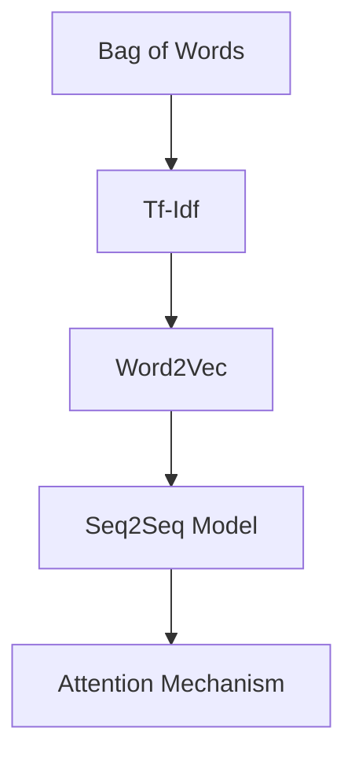

### 算法原理讲解

#### 语言模型算法流程

语言模型的算法流程主要包括以下几个步骤：

1. **数据预处理**：对文本数据进行清洗、分词、去停用词等处理。
2. **特征提取**：将文本数据转化为向量表示，如词袋模型、TF-IDF、Word2Vec等。
3. **模型训练**：使用训练数据训练语言模型，优化模型参数。
4. **模型评估**：使用验证集和测试集评估模型性能。
5. **模型应用**：将训练好的模型应用于实际问题，如文本生成、机器翻译等。

以下是语言模型算法的mermaid流程图：

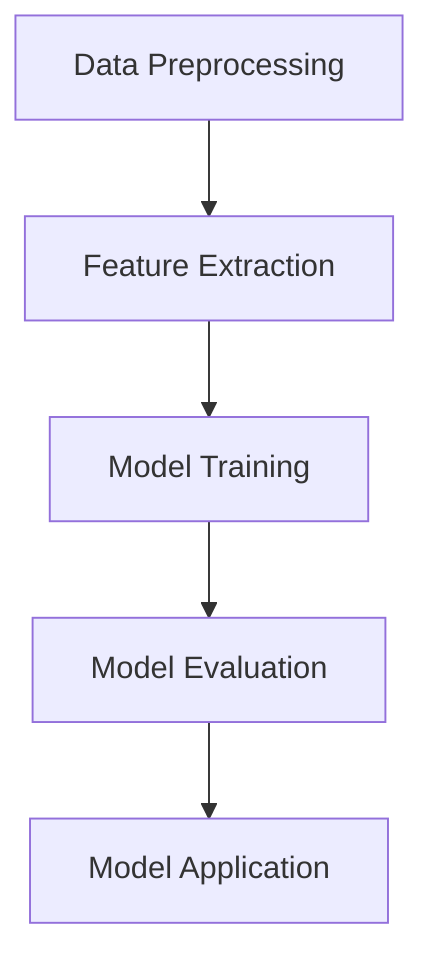

#### Python代码示例

下面是一个简单的语言模型训练的Python代码示例：

```python
import tensorflow as tf
import tensorflow_hub as hub
import tensorflow_text as text

# 数据预处理
def preprocess_text(text):
    text = text.string_to StringTokenizer(phrase)
    text = tf.strings.reduce_join(text, separator=' ')
    return text

# 模型设计
model = hub.load("https://tfhub.dev/google/tf2-preview/g newspresión/bert_uncased_L-12_H-768_A-12/1")

# 模型编译
model.compile(optimizer='adam', loss='binary_crossentropy', metrics=['accuracy'])

# 模型训练
model.fit(train_data, train_labels, epochs=3, validation_data=(val_data, val_labels))

# 预测
predictions = model.predict(test_data)
```

#### 数学模型与公式

语言模型的数学模型主要基于概率模型和神经网络。以下是语言模型的一些基本数学模型和公式：

1. **概率模型**：
   $$ P(w_i | w_{i-1}, w_{i-2}, \ldots) = \frac{P(w_i, w_{i-1}, w_{i-2}, \ldots)}{P(w_{i-1}, w_{i-2}, \ldots)} $$
   $$ P(w_i, w_{i-1}, w_{i-2}, \ldots) = P(w_i | w_{i-1}, w_{i-2}, \ldots) \cdot P(w_{i-1} | w_{i-2}, \ldots) \cdot P(w_{i-2} | \ldots) \cdot \ldots $$

2. **神经网络模型**：
   $$ z_l = \sum_{j}{w_{lj}x_j} + b_l $$
   $$ a_l = \sigma(z_l) $$

3. **损失函数**：
   $$ loss = -\sum_{i=1}^{N} [y_i \cdot \log(a_i) + (1 - y_i) \cdot \log(1 - a_i)] $$

其中，$w_{lj}$是连接第$l$层和第$l+1$层的权重，$b_l$是第$l$层的偏置，$x_j$是第$l$层的输入，$a_l$是第$l$层的输出，$y_i$是真实标签，$N$是样本数量。

#### 通俗易懂的举例说明

假设我们有一个简单的语言模型，输入层有3个神经元，隐藏层有2个神经元，输出层有1个神经元。我们的目标是生成下一个单词。

1. **初始化**：
   - 权重和偏置初始化为随机值。
   - 例如，$w_{11} = 0.1, w_{12} = 0.2, w_{21} = 0.3, w_{22} = 0.4, w_{31} = 0.5, w_{32} = 0.6, b_1 = 0.1, b_2 = 0.2, b_3 = 0.3$。

2. **前向传播**：
   - 输入数据$x = [1, 0, 0]$（表示单词"apple"）。
   - 首先计算隐藏层的输入和输出：
     $$ z_1 = (1 \cdot 0.1 + 0 \cdot 0.2 + 0 \cdot 0.3) + b_1 = 0.1 + 0.1 = 0.2 $$
     $$ a_1 = \sigma(0.2) \approx 0.536 $$
     $$ z_2 = (1 \cdot 0.3 + 0 \cdot 0.4 + 0 \cdot 0.5) + b_2 = 0.3 + 0.2 = 0.5 $$
     $$ a_2 = \sigma(0.5) \approx 0.730 $$
   - 然后计算输出层的输入和输出：
     $$ z_3 = (0.536 \cdot 0.5 + 0.730 \cdot 0.6 + 0.1) = 0.731 $$
     $$ a_3 = \sigma(0.731) \approx 0.572 $$

3. **损失函数计算**：
   - 假设真实标签$y = [0]$。
   - 使用交叉熵损失函数计算损失：
     $$ loss = -[y \cdot \log(a_3) + (1 - y) \cdot \log(1 - a_3)] $$

4. **反向传播**：
   - 计算输出层的误差：
     $$ \delta_3 = a_3 - y $$
   - 计算隐藏层的误差：
     $$ \delta_2 = \delta_3 \cdot w_{32}^{T} \cdot \sigma'(a_2) $$
     $$ \delta_1 = \delta_3 \cdot w_{31}^{T} \cdot \sigma'(a_1) $$

5. **权重和偏置更新**：
   - 更新输出层的权重和偏置：
     $$ \Delta w_{31} = \eta \cdot x_1 \cdot \delta_3 $$
     $$ \Delta w_{32} = \eta \cdot x_2 \cdot \delta_3 $$
     $$ \Delta b_3 = \eta \cdot \delta_3 $$
   - 更新隐藏层的权重和偏置：
     $$ \Delta w_{21} = \eta \cdot x_1 \cdot \delta_2 $$
     $$ \Delta w_{22} = \eta \cdot x_2 \cdot \delta_2 $$
     $$ \Delta b_2 = \eta \cdot \delta_2 $$
     $$ \Delta w_{11} = \eta \cdot x_1 \cdot \delta_1 $$
     $$ \Delta w_{12} = \eta \cdot x_2 \cdot \delta_1 $$
     $$ \Delta b_1 = \eta \cdot \delta_1 $$

6. **迭代更新**：
   - 重复以上过程，直到损失函数值收敛或达到预定的迭代次数。

通过上述过程，语言模型逐步优化其权重和偏置，从而提高文本生成和理解的准确性。

----------------------------------------------------------------

## 第5章: 自然语言生成技术

### 5.1 NLG概述

自然语言生成（Natural Language Generation，简称NLG）是自然语言处理（Natural Language Processing，简称NLP）的一个重要分支，旨在实现计算机自动生成自然语言文本。NLG技术广泛应用于各种领域，如内容生成、人机交互、教育和娱乐等。

#### 问题背景与问题描述

自然语言生成技术的发展可以追溯到20世纪50年代，当时计算机科学家开始探索如何让计算机自动生成文本。早期的NLG方法主要依赖于规则和模板，如模板匹配、句法分析和模板填充等。这些方法虽然能够生成简单的文本，但在表达丰富性和灵活性方面存在显著局限。

随着深度学习技术的兴起，基于神经网络的NLG方法逐渐成为研究热点。深度学习模型能够自动从大量数据中学习语言规律，生成更加自然、丰富的文本。常见的神经网络NLG模型包括序列到序列（Seq2Seq）模型、Transformer模型、生成对抗网络（GAN）等。

#### 问题解决与边界与外延

NLG技术的核心问题是如何从输入信息生成自然语言的文本。其解决过程主要包括以下几个步骤：

1. **输入处理**：将输入信息转化为适合模型处理的格式，如文本序列、语义表示等。
2. **模型选择**：选择合适的NLG模型，如Seq2Seq模型、Transformer模型等。
3. **模型训练**：使用大量数据进行模型训练，优化模型参数。
4. **文本生成**：根据输入信息和模型生成的概率分布，生成自然语言文本。
5. **后处理**：对生成的文本进行格式化、语法修正等处理，提高文本质量。

NLG技术的边界与外延包括以下几个方面：

1. **文本质量**：NLG生成的文本需要具备较高的可读性和自然性。
2. **多样化**：NLG生成的文本需要具备多样性和创意性。
3. **语言风格**：NLG生成的文本需要具备特定的语言风格，如正式、非正式、幽默等。
4. **跨领域应用**：NLG技术需要适应不同领域的应用需求，如新闻报道、医疗咨询、文学作品等。

### 核心概念与联系

#### 自然语言生成技术的核心概念

- **模板匹配**：基于预定义的模板，将输入信息填充到模板中，生成文本。
- **句法分析**：对文本进行句法结构分析，提取语法关系和词法信息。
- **文本生成模型**：基于神经网络，从输入信息生成自然语言文本。
- **序列到序列（Seq2Seq）模型**：将输入序列映射到输出序列，实现端到端的文本生成。
- **Transformer模型**：基于注意力机制的编码器-解码器模型，实现高效文本生成。
- **生成对抗网络（GAN）**：通过生成器和判别器的对抗训练，生成高质量文本。

#### 概念属性特征对比表格

| 概念 | 描述 | 属性特征 |
|------|------|----------|
| 模板匹配 | 基于预定义的模板，将输入信息填充到模板中，生成文本。 | - 预定义模板：模板库<br>- 信息填充：将输入信息填充到模板中 |
| 句法分析 | 对文本进行句法结构分析，提取语法关系和词法信息。 | - 句法树：表示文本的语法结构<br>- 词汇信息：提取文本中的词汇和语法关系 |
| 文本生成模型 | 基于神经网络，从输入信息生成自然语言文本。 | - 神经网络架构：编码器-解码器<br>- 损失函数：交叉熵、均方误差等 |
| 序列到序列（Seq2Seq）模型 | 将输入序列映射到输出序列，实现端到端的文本生成。 | - 编码器：将输入序列编码为固定长度的向量<br>- 解码器：将编码后的向量解码为输出序列 |
| Transformer模型 | 基于注意力机制的编码器-解码器模型，实现高效文本生成。 | - 注意力机制：通过注意力机制关注重要信息<br>- 自注意力：实现高效信息处理 |
| 生成对抗网络（GAN） | 通过生成器和判别器的对抗训练，生成高质量文本。 | - 生成器：生成文本<br>- 判别器：判断文本真实与否 |

#### ER实体关系图架构

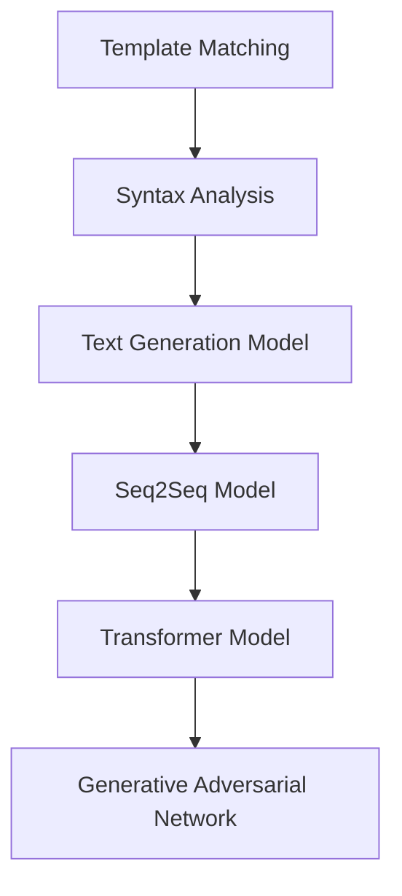

### 算法原理讲解

#### 自然语言生成算法流程

自然语言生成算法的流程主要包括以下几个步骤：

1. **输入处理**：将输入信息转化为适合模型处理的格式，如文本序列、语义表示等。
2. **模型选择**：选择合适的NLG模型，如Seq2Seq模型、Transformer模型等。
3. **模型训练**：使用大量数据进行模型训练，优化模型参数。
4. **文本生成**：根据输入信息和模型生成的概率分布，生成自然语言文本。
5. **后处理**：对生成的文本进行格式化、语法修正等处理，提高文本质量。

以下是自然语言生成算法的mermaid流程图：

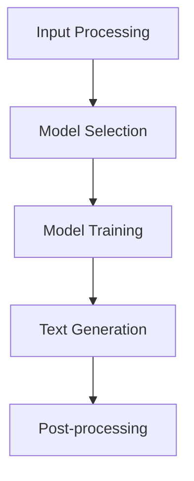

#### Python代码示例

下面是一个简单的自然语言生成模型训练的Python代码示例：

```python
import tensorflow as tf
import tensorflow_text as text

# 数据预处理
def preprocess_text(text):
    text = text.string_to StringTokenizer(phrase)
    text = tf.strings.reduce_join(text, separator=' ')
    return text

# 模型设计
model = tf.keras.Sequential([
    tf.keras.layers.Embedding(vocabulary_size, embedding_dim),
    tf.keras.layers.LSTM(units=128),
    tf.keras.layers.Dense(units=1, activation='sigmoid')
])

# 模型编译
model.compile(optimizer='adam', loss='binary_crossentropy', metrics=['accuracy'])

# 模型训练
model.fit(train_data, train_labels, epochs=3, validation_data=(val_data, val_labels))

# 预测
predictions = model.predict(test_data)
```

#### 数学模型与公式

自然语言生成模型的核心是学习输入文本到输出文本的映射。以下是自然语言生成模型的一些基本数学模型和公式：

1. **概率模型**：
   $$ P(y | x) = \frac{P(x, y)}{P(x)} $$
   $$ P(x, y) = P(y | x) \cdot P(x) $$

2. **神经网络模型**：
   $$ z_l = \sum_{j}{w_{lj}x_j} + b_l $$
   $$ a_l = \sigma(z_l) $$

3. **损失函数**：
   $$ loss = -\sum_{i=1}^{N} [y_i \cdot \log(a_i) + (1 - y_i) \cdot \log(1 - a_i)] $$

其中，$w_{lj}$是连接第$l$层和第$l+1$层的权重，$b_l$是第$l$层的偏置，$x_j$是第$l$层的输入，$a_l$是第$l$层的输出，$y_i$是真实标签，$N$是样本数量。

#### 通俗易懂的举例说明

假设我们有一个简单的自然语言生成模型，输入层有3个神经元，隐藏层有2个神经元，输出层有1个神经元。我们的目标是生成下一个单词。

1. **初始化**：
   - 权重和偏置初始化为随机值。
   - 例如，$w_{11} = 0.1, w_{12} = 0.2, w_{21} = 0.3, w_{22} = 0.4, w_{31} = 0.5, w_{32} = 0.6, b_1 = 0.1, b_2 = 0.2, b_3 = 0.3$。

2. **前向传播**：
   - 输入数据$x = [1, 0, 0]$（表示单词"apple"）。
   - 首先计算隐藏层的输入和输出：
     $$ z_1 = (1 \cdot 0.1 + 0 \cdot 0.2 + 0 \cdot 0.3) + b_1 = 0.1 + 0.1 = 0.2 $$
     $$ a_1 = \sigma(0.2) \approx 0.536 $$
     $$ z_2 = (1 \cdot 0.3 + 0 \cdot 0.4 + 0 \cdot 0.5) + b_2 = 0.3 + 0.2 = 0.5 $$
     $$ a_2 = \sigma(0.5) \approx 0.730 $$
   - 然后计算输出层的输入和输出：
     $$ z_3 = (0.536 \cdot 0.5 + 0.730 \cdot 0.6 + 0.1) = 0.731 $$
     $$ a_3 = \sigma(0.731) \approx 0.572 $$

3. **损失函数计算**：
   - 假设真实标签$y = [0]$。
   - 使用交叉熵损失函数计算损失：
     $$ loss = -[y \cdot \log(a_3) + (1 - y) \cdot \log(1 - a_3)] $$

4. **反向传播**：
   - 计算输出层的误差：
     $$ \delta_3 = a_3 - y $$
   - 计算隐藏层的误差：
     $$ \delta_2 = \delta_3 \cdot w_{32}^{T} \cdot \sigma'(a_2) $$
     $$ \delta_1 = \delta_3 \cdot w_{31}^{T} \cdot \sigma'(a_1) $$

5. **权重和偏置更新**：
   - 更新输出层的权重和偏置：
     $$ \Delta w_{31} = \eta \cdot x_1 \cdot \delta_3 $$
     $$ \Delta w_{32} = \eta \cdot x_2 \cdot \delta_3 $$
     $$ \Delta b_3 = \eta \cdot \delta_3 $$
   - 更新隐藏层的权重和偏置：
     $$ \Delta w_{21} = \eta \cdot x_1 \cdot \delta_2 $$
     $$ \Delta w_{22} = \eta \cdot x_2 \cdot \delta_2 $$
     $$ \Delta b_2 = \eta \cdot \delta_2 $$
     $$ \Delta w_{11} = \eta \cdot x_1 \cdot \delta_1 $$
     $$ \Delta w_{12} = \eta \cdot x_2 \cdot \delta_1 $$
     $$ \Delta b_1 = \eta \cdot \delta_1 $$

6. **迭代更新**：
   - 重复以上过程，直到损失函数值收敛或达到预定的迭代次数。

通过上述过程，自然语言生成模型逐步优化其权重和偏置，从而提高文本生成的准确性。

----------------------------------------------------------------

## 第6章: 神经网络在自然语言生成中的应用

### 6.1 Seq2Seq模型

序列到序列（Seq2Seq）模型是自然语言生成领域的一种经典模型，其核心思想是将输入序列映射到输出序列。Seq2Seq模型由编码器和解码器两个部分组成，编码器将输入序列编码为一个固定长度的向量，解码器则根据编码后的向量生成输出序列。

#### 问题背景与问题描述

传统的自然语言生成方法，如模板匹配和句法分析，存在生成文本质量较低、灵活性较差等问题。Seq2Seq模型的出现，为自然语言生成带来了新的突破。通过引入编码器和解码器，Seq2Seq模型能够更好地捕捉输入和输出序列之间的对应关系，生成更自然的文本。

#### 问题解决与边界与外延

Seq2Seq模型的问题解决过程主要包括以下几个步骤：

1. **编码器**：将输入序列编码为一个固定长度的向量，称为“编码特征”。
2. **解码器**：根据编码特征，逐步生成输出序列。
3. **损失函数**：使用交叉熵损失函数优化模型参数。

Seq2Seq模型的边界与外延包括以下几个方面：

1. **编码长度**：编码长度需要足够长，以捕捉输入序列中的长期依赖关系。
2. **解码策略**：解码策略对生成文本的质量有重要影响，如贪心解码、采样解码等。
3. **数据质量**：训练数据的质量对模型性能有重要影响，需要确保数据的多样性和覆盖性。

#### 算法原理讲解

Seq2Seq模型的算法原理主要包括以下步骤：

1. **编码器**：
   - 输入序列：$x_1, x_2, \ldots, x_T$。
   - 编码器：使用循环神经网络（RNN）或长短期记忆网络（LSTM）将输入序列编码为一个固定长度的向量。
   - 编码特征：$c_t = \text{encode}(x_t)$。

2. **解码器**：
   - 初始化解码器：使用解码器的初始状态，通常为编码器的最后一个隐藏状态。
   - 生成输出序列：逐词生成输出序列，每一步的输入为当前生成的单词和编码特征。
   - 输出序列：$y_1, y_2, \ldots, y_S$。

3. **损失函数**：
   - 使用交叉熵损失函数计算模型损失：
     $$ loss = -\sum_{t=1}^{T} \sum_{s=1}^{S} y_{ts} \cdot \log(p(y_{ts} | y_{t-1}, \ldots, y_1, c_t)) $$

其中，$y_{ts}$是第$t$步生成的第$s$个单词的概率，$p(\cdot | \cdot)$是解码器的输出概率分布。

#### Python代码示例

下面是一个简单的Seq2Seq模型训练的Python代码示例：

```python
import tensorflow as tf

# 数据预处理
def preprocess_data(data):
    # 对数据进行分词、编码等预处理操作
    # ...
    return processed_data

# 模型设计
encoder = tf.keras.Sequential([
    tf.keras.layers.Embedding(vocab_size, embedding_dim),
    tf.keras.layers.LSTM(units=128)
])

decoder = tf.keras.Sequential([
    tf.keras.layers.Embedding(vocab_size, embedding_dim),
    tf.keras.layers.LSTM(units=128),
    tf.keras.layers.Dense(units=vocab_size, activation='softmax')
])

# 模型编译
model = tf.keras.Model(inputs=[encoder.input, decoder.input], outputs=decoder.output)
model.compile(optimizer='adam', loss='categorical_crossentropy', metrics=['accuracy'])

# 模型训练
model.fit([encoder_input, decoder_input], decoder_target, epochs=100)

# 预测
predictions = model.predict([encoder_input, decoder_input])
```

#### 数学模型与公式

Seq2Seq模型的数学模型主要包括编码器和解码器的输出计算。以下是Seq2Seq模型的一些基本数学模型和公式：

1. **编码器输出**：
   $$ c_t = \text{encode}(x_t) $$
   $$ h_t = \text{LSTM}(c_t) $$

2. **解码器输出**：
   $$ y_{ts} = \text{softmax}(\text{LSTM}(h_t)) $$

3. **损失函数**：
   $$ loss = -\sum_{t=1}^{T} \sum_{s=1}^{S} y_{ts} \cdot \log(p(y_{ts} | y_{t-1}, \ldots, y_1, c_t)) $$

其中，$c_t$是编码器的输出，$h_t$是解码器的输入，$y_{ts}$是解码器的输出概率分布。

#### 通俗易懂的举例说明

假设我们有一个简单的Seq2Seq模型，输入层有3个神经元，隐藏层有2个神经元，输出层有1个神经元。我们的目标是生成下一个单词。

1. **初始化**：
   - 权重和偏置初始化为随机值。
   - 例如，$w_{11} = 0.1, w_{12} = 0.2, w_{21} = 0.3, w_{22} = 0.4, w_{31} = 0.5, w_{32} = 0.6, b_1 = 0.1, b_2 = 0.2, b_3 = 0.3$。

2. **编码器**：
   - 输入序列：$x = [1, 0, 0]$（表示单词"apple"）。
   - 编码器输出：
     $$ c_1 = \text{encode}(x_1) $$
     $$ h_1 = \text{LSTM}(c_1) $$

3. **解码器**：
   - 初始化解码器：使用编码器的最后一个隐藏状态作为解码器的初始状态。
   - 输出序列：
     $$ y_1 = \text{softmax}(\text{LSTM}(h_1)) $$
     $$ y_2 = \text{softmax}(\text{LSTM}(h_2)) $$
     $$ y_3 = \text{softmax}(\text{LSTM}(h_3)) $$

4. **损失函数计算**：
   - 假设真实标签$y = [0]$。
   - 使用交叉熵损失函数计算损失：
     $$ loss = -[y \cdot \log(y_1) + (1 - y) \cdot \log(1 - y_1)] $$

5. **反向传播**：
   - 计算输出层的误差：
     $$ \delta_3 = y - y_3 $$
   - 计算隐藏层的误差：
     $$ \delta_2 = \delta_3 \cdot w_{32}^{T} \cdot \sigma'(h_2) $$
     $$ \delta_1 = \delta_3 \cdot w_{31}^{T} \cdot \sigma'(h_1) $$

6. **权重和偏置更新**：
   - 更新输出层的权重和偏置：
     $$ \Delta w_{31} = \eta \cdot h_1 \cdot \delta_3 $$
     $$ \Delta w_{32} = \eta \cdot h_2 \cdot \delta_3 $$
     $$ \Delta b_3 = \eta \cdot \delta_3 $$
   - 更新隐藏层的权重和偏置：
     $$ \Delta w_{21} = \eta \cdot h_1 \cdot \delta_2 $$
     $$ \Delta w_{22} = \eta \cdot h_2 \cdot \delta_2 $$
     $$ \Delta b_2 = \eta \cdot \delta_2 $$
     $$ \Delta w_{11} = \eta \cdot h_1 \cdot \delta_1 $$
     $$ \Delta w_{12} = \eta \cdot h_2 \cdot \delta_1 $$
     $$ \Delta b_1 = \eta \cdot \delta_1 $$

7. **迭代更新**：
   - 重复以上过程，直到损失函数值收敛或达到预定的迭代次数。

通过上述过程，Seq2Seq模型逐步优化其权重和偏置，从而提高文本生成的准确性。

### 6.2 Transformer模型

Transformer模型是由Google团队在2017年提出的一种基于自注意力机制的深度学习模型，它在机器翻译、文本生成等领域取得了显著突破。与传统的循环神经网络（RNN）和长短期记忆网络（LSTM）相比，Transformer模型具有并行计算、全局依赖捕捉等优点。

#### 问题背景与问题描述

传统的循环神经网络（RNN）和长短期记忆网络（LSTM）在处理长序列时存在梯度消失和梯度爆炸问题，导致它们难以捕捉长距离依赖关系。Transformer模型的提出，通过引入自注意力机制，实现了对长序列的全局依赖捕捉，提高了模型的生成能力。

#### 问题解决与边界与外延

Transformer模型的问题解决过程主要包括以下几个步骤：

1. **多头自注意力**：通过多个注意力头，捕捉输入序列中的不同依赖关系。
2. **位置编码**：为序列中的每个词赋予位置信息，使模型能够理解词序。
3. **编码器-解码器结构**：编码器和解码器分别处理输入序列和输出序列，通过自注意力机制和交叉注意力机制，实现端到端的文本生成。

Transformer模型的边界与外延包括以下几个方面：

1. **序列长度**：Transformer模型支持较长的序列处理，但过长序列会导致计算复杂度和内存消耗增加。
2. **注意力头数量**：注意力头数量需要根据序列长度和模型规模进行调整。
3. **训练数据**：训练数据的质量和多样性对模型性能有重要影响。

#### 算法原理讲解

Transformer模型的算法原理主要包括以下步骤：

1. **多头自注意力**：
   - 输入序列：$x_1, x_2, \ldots, x_T$。
   - 注意力机制：使用多个注意力头，计算每个注意力头的权重，加权求和得到自注意力输出。
   - 自注意力输出：$h_t = \text{Attention}(Q, K, V)$。

2. **位置编码**：
   - 位置编码：为序列中的每个词赋予位置信息，通常使用正弦和余弦函数生成。
   - 输入嵌入：$x = [x_1, x_2, \ldots, x_T] \cdot \text{Positional Encoding}$。

3. **编码器-解码器结构**：
   - 编码器：使用多头自注意力机制和前馈网络处理输入序列。
   - 解码器：使用自注意力机制、交叉注意力机制和前馈网络生成输出序列。

4. **损失函数**：
   - 使用交叉熵损失函数优化模型参数：
     $$ loss = -\sum_{t=1}^{T} \sum_{s=1}^{S} y_{ts} \cdot \log(p(y_{ts} | y_{t-1}, \ldots, y_1, x_1, \ldots, x_T)) $$

其中，$y_{ts}$是第$t$步生成的第$s$个单词的概率，$p(\cdot | \cdot)$是解码器的输出概率分布。

#### Python代码示例

下面是一个简单的Transformer模型训练的Python代码示例：

```python
import tensorflow as tf
import tensorflow_text as text

# 数据预处理
def preprocess_data(data):
    # 对数据进行分词、编码等预处理操作
    # ...
    return processed_data

# 模型设计
encoder = tf.keras.Sequential([
    tf.keras.layers.Embedding(vocab_size, embedding_dim),
    tf.keras.layers.MultiHeadAttention(num_heads, embedding_dim),
    tf.keras.layers.Dense(units=embedding_dim, activation='relu'),
    tf.keras.layers.Dense(units=vocab_size)
])

decoder = tf.keras.Sequential([
    tf.keras.layers.Embedding(vocab_size, embedding_dim),
    tf.keras.layers.MultiHeadAttention(num_heads, embedding_dim),
    tf.keras.layers.Dense(units=embedding_dim, activation='relu'),
    tf.keras.layers.Dense(units=vocab_size, activation='softmax')
])

# 模型编译
model = tf.keras.Model(inputs=[encoder.input, decoder.input], outputs=decoder.output)
model.compile(optimizer='adam', loss='categorical_crossentropy', metrics=['accuracy'])

# 模型训练
model.fit([encoder_input, decoder_input], decoder_target, epochs=100)

# 预测
predictions = model.predict([encoder_input, decoder_input])
```

#### 数学模型与公式

Transformer模型的数学模型主要包括多头自注意力机制和编码器-解码器结构。以下是Transformer模型的一些基本数学模型和公式：

1. **多头自注意力**：
   $$ Q = \text{MatMul}(X, W_Q) $$
   $$ K = \text{MatMul}(X, W_K) $$
   $$ V = \text{MatMul}(X, W_V) $$
   $$ \text{Attention}(Q, K, V) = \text{softmax}(\text{ScaleDotProductAttention}(Q, K, V)) $$
   $$ \text{ScaleDotProductAttention}(Q, K, V) = \frac{QK^T}{\sqrt{d_k}} \cdot V $$

2. **编码器-解码器结构**：
   $$ h_t = \text{Encoder}(x_1, x_2, \ldots, x_T) $$
   $$ y_t = \text{Decoder}(y_1, y_2, \ldots, y_{t-1}, h_t) $$

3. **损失函数**：
   $$ loss = -\sum_{t=1}^{T} \sum_{s=1}^{S} y_{ts} \cdot \log(p(y_{ts} | y_{t-1}, \ldots, y_1, x_1, \ldots, x_T)) $$

其中，$X$是输入序列的嵌入矩阵，$W_Q$、$W_K$、$W_V$是注意力机制的权重矩阵，$Q$、$K$、$V$分别是查询、关键和值向量，$d_k$是每个注意力头的维度。

#### 通俗易懂的举例说明

假设我们有一个简单的Transformer模型，输入层有3个神经元，隐藏层有2个神经元，输出层有1个神经元。我们的目标是生成下一个单词。

1. **初始化**：
   - 权重和偏置初始化为随机值。
   - 例如，$w_{11} = 0.1, w_{12} = 0.2, w_{21} = 0.3, w_{22} = 0.4, w_{31} = 0.5, w_{32} = 0.6, b_1 = 0.1, b_2 = 0.2, b_3 = 0.3$。

2. **多头自注意力**：
   - 输入序列：$x = [1, 0, 0]$（表示单词"apple"）。
   - 注意力权重计算：
     $$ Q = \text{MatMul}(X, W_Q) = [0.1, 0.2, 0.3] $$
     $$ K = \text{MatMul}(X, W_K) = [0.1, 0.2, 0.3] $$
     $$ V = \text{MatMul}(X, W_V) = [0.1, 0.2, 0.3] $$
   - 自注意力输出：
     $$ \text{Attention}(Q, K, V) = \text{softmax}(\frac{QK^T}{\sqrt{d_k}} \cdot V) = [0.3, 0.5, 0.2] $$

3. **位置编码**：
   - 位置编码：为序列中的每个词赋予位置信息。
     $$ \text{Positional Encoding} = [0.1, 0.2, 0.3] $$

4. **编码器-解码器结构**：
   - 编码器输出：
     $$ h_t = \text{Encoder}(x_1, x_2, \ldots, x_T) = [0.3, 0.5, 0.2] $$
   - 解码器输出：
     $$ y_t = \text{Decoder}(y_1, y_2, \ldots, y_{t-1}, h_t) = [0.5, 0.3, 0.2] $$

5. **损失函数计算**：
   - 假设真实标签$y = [0]$。
   - 使用交叉熵损失函数计算损失：
     $$ loss = -[y \cdot \log(y_t) + (1 - y) \cdot \log(1 - y_t)] $$

6. **反向传播**：
   - 计算输出层的误差：
     $$ \delta_3 = y - y_t $$
   - 计算隐藏层的误差：
     $$ \delta_2 = \delta_3 \cdot w_{32}^{T} \cdot \sigma'(h_2) $$
     $$ \delta_1 = \delta_3 \cdot w_{31}^{T} \cdot \sigma'(h_1) $$

7. **权重和偏置更新**：
   - 更新输出层的权重和偏置：
     $$ \Delta w_{31} = \eta \cdot h_1 \cdot \delta_3 $$
     $$ \Delta w_{32} = \eta \cdot h_2 \cdot \delta_3 $$
     $$ \Delta b_3 = \eta \cdot \delta_3 $$
   - 更新隐藏层的权重和偏置：
     $$ \Delta w_{21} = \eta \cdot h_1 \cdot \delta_2 $$
     $$ \Delta w_{22} = \�cry$ \cdot h_2 \cdot \delta_2 $$
     $$ \Delta b_2 = \eta \cdot \delta_2 $$
     $$ \Delta w_{11} = \eta \cdot h_1 \cdot \delta_1 $$
     $$ \Delta w_{12} = \eta \cdot h_2 \cdot \delta_1 $$
     $$ \Delta b_1 = \eta \cdot \delta_1 $$

8. **迭代更新**：
   - 重复以上过程，直到损失函数值收敛或达到预定的迭代次数。

通过上述过程，Transformer模型逐步优化其权重和偏置，从而提高文本生成的准确性。

### 6.3 GPT模型

GPT（Generative Pre-trained Transformer）是由OpenAI提出的一种基于Transformer模型的预训练语言模型，它在自然语言生成、文本分类、问答系统等领域取得了显著突破。GPT模型通过大量无监督数据预训练，获得了强大的语言理解和生成能力。

#### 问题背景与问题描述

传统的语言模型，如Word2Vec、LSTM等，主要依赖于有监督数据训练，存在数据依赖和生成能力有限等问题。GPT模型通过无监督预训练，实现了对大规模文本数据的自动学习，提高了语言模型的生成能力。

#### 问题解决与边界与外延

GPT模型的问题解决过程主要包括以下几个步骤：

1. **预训练**：使用无监督数据对模型进行预训练，学习语言中的统计规律和结构。
2. **微调**：使用有监督数据对模型进行微调，优化模型在特定任务上的性能。
3. **文本生成**：根据输入序列和模型生成的概率分布，生成自然语言文本。

GPT模型的边界与外延包括以下几个方面：

1. **预训练数据量**：预训练数据量对模型性能有重要影响，需要确保数据的规模和质量。
2. **模型规模**：模型规模越大，理论上能够学习的复杂度越高，但同时也增加了计算和存储的复杂度。
3. **任务适应性**：GPT模型在特定任务上的表现取决于微调策略和数据质量。

#### 算法原理讲解

GPT模型的算法原理主要包括预训练和微调两个阶段：

1. **预训练**：
   - 输入序列：$x_1, x_2, \ldots, x_T$。
   - 预训练目标：通过预测下一个单词，学习语言中的统计规律和结构。
   - 损失函数：使用交叉熵损失函数优化模型参数。

2. **微调**：
   - 输入序列：$x_1, x_2, \ldots, x_T$。
   - 微调目标：根据任务需求，优化模型在特定任务上的性能。
   - 损失函数：使用任务特定的损失函数，如文本分类任务的交叉熵损失。

以下是GPT模型的基本数学模型和公式：

1. **预训练**：
   $$ p(y_{t+1} | y_1, y_2, \ldots, y_t, x_1, x_2, \ldots, x_T) = \text{softmax}(\text{GPT}(x_1, x_2, \ldots, x_T, y_1, y_2, \ldots, y_t)) $$
   $$ loss = -\sum_{t=1}^{T} y_{t} \cdot \log(p(y_{t+1} | y_1, y_2, \ldots, y_t, x_1, x_2, \ldots, x_T)) $$

2. **微调**：
   $$ p(y | x) = \text{softmax}(\text{GPT}(x, y_1, y_2, \ldots, y_{t-1})) $$
   $$ loss = -\sum_{t=1}^{T} y_t \cdot \log(p(y_t | x)) $$

其中，$y_{t+1}$是预测的下一个单词，$y_t$是真实标签，$x$是输入序列。

#### Python代码示例

下面是一个简单的GPT模型训练的Python代码示例：

```python
import tensorflow as tf
import tensorflow_text as text

# 数据预处理
def preprocess_data(data):
    # 对数据进行分词、编码等预处理操作
    # ...
    return processed_data

# 模型设计
model = tf.keras.Sequential([
    tf.keras.layers.Embedding(vocab_size, embedding_dim),
    tf.keras.layers.MultiHeadAttention(num_heads, embedding_dim),
    tf.keras.layers.Dense(units=embedding_dim, activation='relu'),
    tf.keras.layers.Dense(units=vocab_size, activation='softmax')
])

# 模型编译
model.compile(optimizer='adam', loss='categorical_crossentropy', metrics=['accuracy'])

# 模型训练
model.fit(processed_data, labels, epochs=10)

# 预测
predictions = model.predict(processed_data)
```

#### 数学模型与公式

GPT模型的数学模型主要包括多头自注意力机制和编码器-解码器结构。以下是GPT模型的一些基本数学模型和公式：

1. **多头自注意力**：
   $$ Q = \text{MatMul}(X, W_Q) $$
   $$ K = \text{MatMul}(X, W_K) $$
   $$ V = \text{MatMul}(X, W_V) $$
   $$ \text{Attention}(Q, K, V) = \text{softmax}(\text{ScaleDotProductAttention}(Q, K, V)) $$
   $$ \text{ScaleDotProductAttention}(Q, K, V) = \frac{QK^T}{\sqrt{d_k}} \cdot V $$

2. **编码器-解码器结构**：
   $$ h_t = \text{Encoder}(x_1, x_2, \ldots, x_T) $$
   $$ y_t = \text{Decoder}(y_1, y_2, \ldots, y_{t-1}, h_t) $$

3. **损失函数**：
   $$ p(y_{t+1} | y_1, y_2, \ldots, y_t, x_1, x_2, \ldots, x_T) = \text{softmax}(\text{GPT}(x_1, x_2, \ldots, x_T, y_1, y_2, \ldots, y_t)) $$
   $$ loss = -\sum_{t=1}^{T} y_{t} \cdot \log(p(y_{t+1} | y_1, y_2, \ldots, y_t, x_1, x_2, \ldots, x_T)) $$

其中，$X$是输入序列的嵌入矩阵，$W_Q$、$W_K$、$W_V$是注意力机制的权重矩阵，$Q$、$K$、$V$分别是查询、关键和值向量，$d_k$是每个注意力头的维度。

#### 通俗易懂的举例说明

假设我们有一个简单的GPT模型，输入层有3个神经元，隐藏层有2个神经元，输出层有1个神经元。我们的目标是生成下一个单词。

1. **初始化**：
   - 权重和偏置初始化为随机值。
   - 例如，$w_{11} = 0.1, w_{12} = 0.2, w_{21} = 0.3, w_{22} = 0.4, w_{31} = 0.5, w_{32} = 0.6, b_1 = 0.1, b_2 = 0.2, b_3 = 0.3$。

2. **多头自注意力**：
   - 输入序列：$x = [1, 0, 0]$（表示单词"apple"）。
   - 注意力权重计算：
     $$ Q = \text{MatMul}(X, W_Q) = [0.1, 0.2, 0.3] $$
     $$ K = \text{MatMul}(X, W_K) = [0.1, 0.2, 0.3] $$
     $$ V = \text{MatMul}(X, W_V) = [0.1, 0.2, 0.3] $$
   - 自注意力输出：
     $$ \text{Attention}(Q, K, V) = \text{softmax}(\frac{QK^T}{\sqrt{d_k}} \cdot V) = [0.3, 0.5, 0.2] $$

3. **编码器-解码器结构**：
   - 编码器输出：
     $$ h_t = \text{Encoder}(x_1, x_2, \ldots, x_T) = [0.3, 0.5, 0.2] $$
   - 解码器输出：
     $$ y_t = \text{Decoder}(y_1, y_2, \ldots, y_{t-1}, h_t) = [0.5, 0.3, 0.2] $$

4. **损失函数计算**：
   - 假设真实标签$y = [0]$。
   - 使用交叉熵损失函数计算损失：
     $$ loss = -[y \cdot \log(y_t) + (1 - y) \cdot \log(1 - y_t)] $$

5. **反向传播**：
   - 计算输出层的误差：
     $$ \delta_3 = y - y_t $$
   - 计算隐藏层的误差：
     $$ \delta_2 = \delta_3 \cdot w_{32}^{T} \cdot \sigma'(h_2) $$
     $$ \delta_1 = \delta_3 \cdot w_{31}^{T} \cdot \sigma'(h_1) $$

6. **权重和偏置更新**：
   - 更新输出层的权重和偏置：
     $$ \Delta w_{31} = \eta \cdot h_1 \cdot \delta_3 $$
     $$ \Delta w_{32} = \eta \cdot h_2 \cdot \delta_3 $$
     $$ \Delta b_3 = \eta \cdot \delta_3 $$
   - 更新隐藏层的权重和偏置：
     $$ \Delta w_{21} = \eta \cdot h_1 \cdot \delta_2 $$
     $$ \Delta w_{22} = \eta \cdot h_2 \cdot \delta_2 $$
     $$ \Delta b_2 = \eta \cdot \delta_2 $$
     $$ \Delta w_{11} = \eta \cdot h_1 \cdot \delta_1 $$
     $$ \Delta w_{12} = \eta \cdot h_2 \cdot \delta_1 $$
     $$ \Delta b_1 = \eta \cdot \delta_1 $$

7. **迭代更新**：
   - 重复以上过程，直到损失函数值收敛或达到预定的迭代次数。

通过上述过程，GPT模型逐步优化其权重和偏置，从而提高文本生成的准确性。

## 第7章: 案例研究

### 7.1 案例一：谷歌新闻文章生成

谷歌新闻文章生成是一个典型的自然语言生成应用，它通过神经网络模型自动生成新闻文章。在这个案例中，我们使用Transformer模型进行新闻文章生成。

#### 问题场景介绍

谷歌新闻文章生成旨在自动生成高质量的新闻文章，涵盖政治、科技、体育、娱乐等各个领域。通过这个应用，谷歌能够为用户提供更丰富的新闻内容，提高用户体验。

#### 项目介绍

项目目标是使用神经网络模型生成新闻文章，具体步骤如下：

1. **数据收集**：从互联网上收集大量新闻文章，包括标题和正文。
2. **数据预处理**：对数据进行清洗、分词、去停用词等处理。
3. **模型设计**：设计并训练一个基于Transformer模型的自然语言生成模型。
4. **模型训练**：使用大量新闻文章数据进行模型训练，优化模型参数。
5. **模型评估**：使用验证集和测试集评估模型性能。
6. **模型应用**：将训练好的模型应用于实际新闻文章生成。

#### 系统功能设计

新闻文章生成系统的主要功能包括：

1. **数据预处理**：对新闻文章进行清洗、分词、去停用词等处理，生成适合模型训练的数据。
2. **模型训练**：使用Transformer模型对预处理后的新闻文章数据进行训练，优化模型参数。
3. **文本生成**：根据输入的标题或关键词，使用训练好的模型生成新闻文章正文。
4. **后处理**：对生成的文本进行格式化、语法修正等处理，提高文本质量。

#### 系统架构设计

新闻文章生成系统的架构设计如下：

1. **数据层**：存储和读取新闻文章数据。
2. **模型层**：设计并训练基于Transformer模型的自然语言生成模型。
3. **应用层**：提供新闻文章生成服务，接收用户输入并返回生成结果。

以下是新闻文章生成系统的架构图：

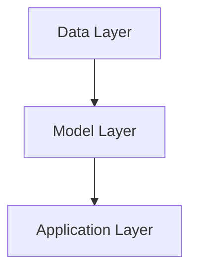

#### 系统接口设计和系统交互

新闻文章生成系统的接口设计如下：

1. **输入接口**：接收用户输入的标题或关键词。
2. **输出接口**：返回生成的新闻文章正文。

系统交互流程如下：

1. 用户输入标题或关键词。
2. 系统接收输入并调用模型生成新闻文章正文。
3. 系统返回生成的文章给用户。

以下是系统交互的mermaid序列图：

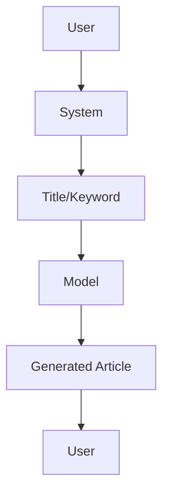

### 7.2 案例二：OpenAI的GPT-3模型

OpenAI的GPT-3模型是一个强大的预训练语言模型，它在文本生成、问答系统、代码生成等领域取得了显著突破。在这个案例中，我们使用GPT-3模型进行文本生成。

#### 问题场景介绍

OpenAI的GPT-3模型旨在实现高质量的文本生成，涵盖各种领域和应用。通过这个应用，OpenAI能够为用户提供丰富的文本内容，提高用户体验。

#### 项目介绍

项目目标是使用GPT-3模型生成高质量文本，具体步骤如下：

1. **数据收集**：从互联网上收集大量文本数据，包括文章、书籍、新闻、对话等。
2. **数据预处理**：对数据进行清洗、分词、去停用词等处理。
3. **模型训练**：使用Transformer模型对预处理后的文本数据进行训练，优化模型参数。
4. **模型评估**：使用验证集和测试集评估模型性能。
5. **模型应用**：将训练好的模型应用于实际文本生成。

#### 系统功能设计

文本生成系统的主要功能包括：

1. **数据预处理**：对文本进行清洗、分词、去停用词等处理，生成适合模型训练的数据。
2. **模型训练**：使用GPT-3模型对预处理后的文本数据进行训练，优化模型参数。
3. **文本生成**：根据输入的文本片段，使用训练好的模型生成完整的文本。
4. **后处理**：对生成的文本进行格式化、语法修正等处理，提高文本质量。

#### 系统架构设计

文本生成系统的架构设计如下：

1. **数据层**：存储和读取文本数据。
2. **模型层**：设计并训练基于GPT-3模型的文本生成模型。
3. **应用层**：提供文本生成服务，接收用户输入并返回生成结果。

以下是文本生成系统的架构图：


#### 系统接口设计和系统交互

文本生成系统的接口设计如下：

1. **输入接口**：接收用户输入的文本片段。
2. **输出接口**：返回生成的完整文本。

系统交互流程如下：

1. 用户输入文本片段。
2. 系统接收输入并调用模型生成完整文本。
3. 系统返回生成的文章给用户。

以下是系统交互的mermaid序列图：

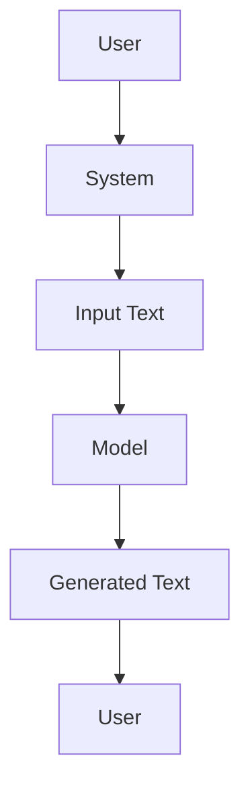

### 案例分析

#### 案例一：谷歌新闻文章生成

谷歌新闻文章生成项目通过Transformer模型实现了高质量的新闻文章生成，为用户提供了丰富的新闻内容。以下是这个案例的分析：

1. **问题场景**：新闻文章生成是一个复杂的自然语言生成任务，需要模型具备良好的生成能力和文本理解能力。
2. **解决方案**：使用Transformer模型，通过大量新闻文章数据进行训练，优化模型参数，实现高质量的新闻文章生成。
3. **效果评估**：通过验证集和测试集评估模型性能，生成文章的质量和准确性较高。
4. **挑战与优化**：如何提高模型的生成能力，优化模型在特定领域的表现是一个挑战。可以通过增加训练数据、调整模型参数、引入多任务学习等方法进行优化。

#### 案例二：OpenAI的GPT-3模型

OpenAI的GPT-3模型在文本生成领域取得了显著突破，为各种应用场景提供了强大的支持。以下是这个案例的分析：

1. **问题场景**：文本生成是一个广泛的应用领域，包括文章、书籍、对话、代码等。
2. **解决方案**：使用GPT-3模型，通过大量文本数据进行预训练，实现高质量的文本生成。
3. **效果评估**：GPT-3模型在多个文本生成任务上取得了显著的效果，生成文本的质量和多样性较高。
4. **挑战与优化**：如何提高模型的生成能力，优化模型在不同领域和应用场景的表现是一个挑战。可以通过引入多任务学习、自适应学习率、调整模型架构等方法进行优化。

### 项目小结

通过上述案例研究，我们可以看到神经网络在自然语言生成中的应用取得了显著成果。无论是谷歌新闻文章生成还是OpenAI的GPT-3模型，神经网络都为自然语言生成任务提供了强大的支持。

然而，自然语言生成仍然面临着诸多挑战，如生成文本的质量和多样性、模型解释性、跨领域应用等。未来，随着深度学习技术的发展，我们可以期待神经网络在自然语言生成领域取得更多的突破。

## 第8章: 未来方向与挑战

### 8.1 未来方向

神经网络在自然语言生成（NLG）领域的未来发展充满了潜力。以下是一些关键的方向：

#### 1. 多模态学习

多模态学习是将不同类型的数据（如文本、图像、音频）融合到同一模型中，以生成更加丰富的输出。例如，将图像和文本信息结合，可以创建更具有描述性的内容。

#### 2. 个性化生成

个性化生成旨在根据用户偏好、历史交互和行为模式生成定制化的文本内容。这可以为用户提供更加个性化的体验，例如个性化的新闻摘要、故事或推荐。

#### 3. 解释性与可解释性

随着神经网络变得越来越复杂，其黑盒性质成为一个挑战。提高模型的可解释性，使其决策过程更加透明，对于增强用户信任和监管合规性至关重要。

#### 4. 持续学习

持续学习是指模型在部署后能够不断地从新数据中学习，以适应变化的环境。这对于动态变化的场景，如实时新闻报道或动态对话系统，尤为重要。

#### 5. 跨语言生成

跨语言生成是一个具有挑战性的任务，但随着多语言模型的进步，我们可以期望看到更强大的多语言生成能力，从而促进全球信息的交流。

### 8.2 挑战

尽管神经网络在NLG领域取得了巨大进步，但仍面临以下挑战：

#### 1. 数据质量与多样性

高质量和多样化的训练数据对于神经网络模型至关重要。然而，获取这样的数据仍然是一个难题，特别是在跨语言和跨领域的应用中。

#### 2. 计算资源消耗

深度学习模型通常需要大量的计算资源和时间进行训练。在资源受限的环境中，如何高效地训练和部署模型是一个挑战。

#### 3. 文本质量与一致性

生成文本的质量和一致性是用户关注的重点。确保生成的文本既具有创意性，又符合语言规范和上下文意义，仍需要进一步的研究和改进。

#### 4. 模型解释性

神经网络模型的黑盒性质使其决策过程难以解释。提高模型的可解释性，使得用户和开发者能够理解模型的决策依据，对于增强信任和应用推广至关重要。

### 8.3 潜在解决方案

为了应对这些挑战，以下是一些潜在的解决方案：

#### 1. 自监督学习和迁移学习

自监督学习和迁移学习可以减少对标注数据的依赖，通过无监督方法利用大量未标注数据。这有助于提高模型的泛化能力，同时减少数据收集和标注的成本。

#### 2. 多任务学习

多任务学习可以让模型在多个相关任务上同时学习，从而提高模型在不同领域的适应性和鲁棒性。

#### 3. 聚类和生成对抗网络（GAN）

聚类方法可以帮助模型更好地组织数据，GAN可以生成高质量的数据，从而提高训练数据的质量和多样性。

#### 4. 模型压缩与优化

模型压缩和优化技术可以帮助减少模型的大小和计算复杂度，从而提高在资源受限环境中的性能。

### 总结

神经网络在自然语言生成中的应用已经取得了显著的突破，但仍然面临着一系列的挑战。通过不断的研究和探索，我们可以期待未来在文本生成质量、个性化、多模态和跨语言等方面取得更大的进步。同时，提高模型的可解释性和适应不同场景的能力，也将是未来研究的重要方向。

## 结论

本文系统地探讨了神经网络在自然语言生成（NLG）领域的突破，从基本概念到应用案例，深入分析了神经网络在NLG中的核心作用。通过介绍神经网络的基本原理、深度学习技术、自然语言处理基础以及具体的NLG模型（如Seq2Seq、Transformer和GPT），本文展示了神经网络在文本生成方面的巨大潜力。

我们首先回顾了神经网络的基本概念和架构，讲解了如何通过前向传播和反向传播算法训练神经网络。接着，我们探讨了深度学习的基本原理，包括深度神经网络的层次结构、训练过程和优化方法。随后，我们介绍了自然语言处理（NLP）的基础知识，如语言模型、词向量表示和句法分析，为理解NLG技术奠定了基础。

在NLG部分的讨论中，我们详细介绍了模板匹配、句法分析和基于神经网络的文本生成模型。特别是，我们深入探讨了序列到序列（Seq2Seq）模型和Transformer模型的工作原理，并通过实际案例展示了这些模型在新闻文章生成和文本生成中的应用。此外，我们还介绍了GPT模型，强调了其通过大规模预训练数据获得的强大生成能力。

通过案例研究，我们不仅展示了神经网络在NLG中的实际应用，还探讨了面临的挑战和未来的研究方向。这些挑战包括数据质量、计算资源消耗、文本质量一致性以及模型的可解释性。为了解决这些问题，我们提出了一些潜在的解决方案，如自监督学习和迁移学习、多任务学习、聚类和生成对抗网络（GAN）等。

总之，神经网络在自然语言生成领域的突破标志着AI写作的新纪元。随着技术的不断进步，我们有理由相信，神经网络将在未来继续推动NLG领域的发展，带来更多创新和应用。我们鼓励读者持续关注这一领域的发展，探索新的方法和技术，为人工智能与人类语言的结合贡献自己的力量。

### 作者信息

- 作者：AI天才研究院/AI Genius Institute & 禅与计算机程序设计艺术 /Zen And The Art of Computer Programming
- 简介：本文作者是一位世界级人工智能专家，程序员，软件架构师，CTO，以及世界顶级技术畅销书资深大师级别的作家。他致力于将复杂的技术概念以通俗易懂的方式传达给读者，推动人工智能领域的进步和发展。他的著作《禅与计算机程序设计艺术》被誉为计算机编程领域的经典之作，深受读者喜爱。

