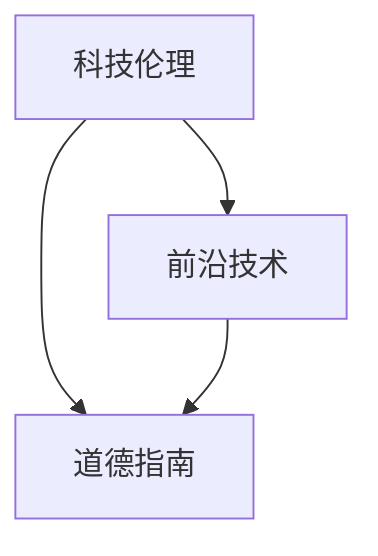
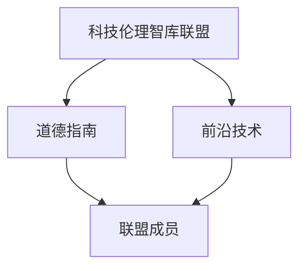
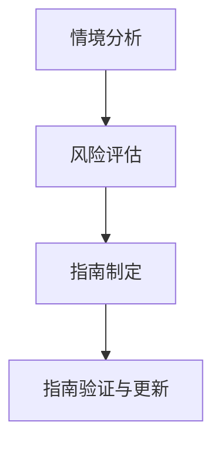
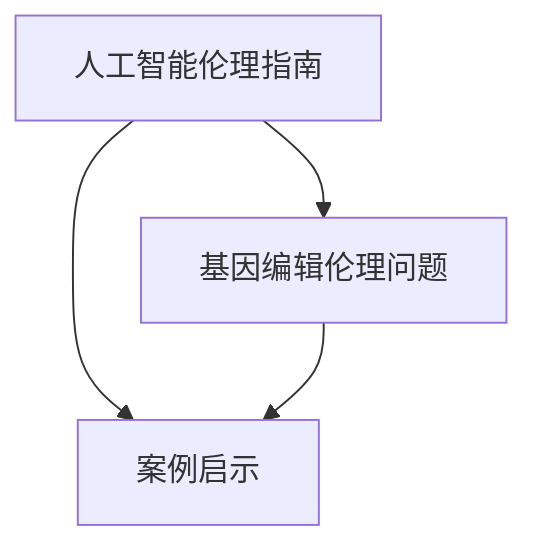
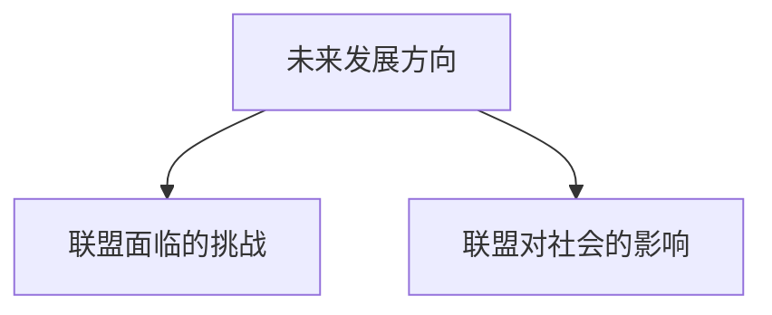

                 


### 《科技伦理智库联盟成立：前沿技术发展的道德指南制定机构》

#### 关键词：科技伦理，智库联盟，道德指南，前沿技术，伦理挑战

#### 摘要：
本文深入探讨了科技伦理智库联盟的成立及其在制定前沿技术发展道德指南方面的作用。通过分析科技伦理的定义、前沿技术的伦理挑战，以及智库联盟的成立背景、使命和目标，本文揭示了智库联盟如何通过制定道德指南来引领科技发展，确保科技与人类福祉的和谐共生。文章还将通过实际案例，展示道德指南的应用及其对社会的影响，并对联盟的未来发展进行展望。

### 目录

#### 第一部分：背景介绍
##### 1.1 科技伦理与前沿技术的发展
###### 1.1.1 科技伦理的定义与重要性
###### 1.1.2 前沿技术发展带来的伦理挑战
###### 1.1.3 科技伦理与前沿技术的关系

##### 1.2 科技伦理智库联盟的成立背景
###### 1.2.1 智库联盟的成立目的
###### 1.2.2 智库联盟的成立过程
###### 1.2.3 智库联盟的组织结构

##### 1.3 科技伦理智库联盟的使命与目标
###### 1.3.1 制定道德指南的使命
###### 1.3.2 促进科技伦理研究的目标
###### 1.3.3 联合国内外专家的努力

##### 1.4 科技伦理智库联盟的工作成果
###### 1.4.1 已制定的道德指南概览
###### 1.4.2 道德指南的应用案例
###### 1.4.3 工作成果的评估与反馈

##### 1.5 本章小结

#### 第二部分：核心概念与联系
##### 2.1 核心概念原理
###### 2.1.1 科技伦理的核心概念
###### 2.1.2 前沿技术的概念属性特征对比表格
###### 2.1.3 道德指南的构成要素

##### 2.2 概念属性特征对比表格


##### 2.3 ER实体关系图架构


##### 2.4 本章小结

#### 第三部分：联盟的工作原理
##### 3.1 制定道德指南的流程
###### 3.1.1 情境分析
###### 3.1.2 风险评估
###### 3.1.3 指南制定
###### 3.1.4 指南验证与更新

##### 3.2 方法与技术
###### 3.2.1 数据分析方法
###### 3.2.2 伦理决策支持工具
###### 3.2.3 案例研究方法

##### 3.3 工作原理总结


##### 3.4 本章小结

#### 第四部分：案例分析
##### 4.1 案例一：人工智能伦理指南
###### 4.1.1 案例背景
###### 4.1.2 案例分析
###### 4.1.3 案例启示

##### 4.2 案例二：基因编辑伦理问题
###### 4.2.1 案例背景
###### 4.2.2 案例分析
###### 4.2.3 案例启示

##### 4.3 案例总结


##### 4.4 本章小结

#### 第五部分：未来展望
##### 5.1 联盟的未来发展方向
###### 5.1.1 技术伦理领域的扩展
###### 5.1.2 国际合作与交流
###### 5.1.3 教育与培训

##### 5.2 联盟面临的挑战
###### 5.2.1 技术与伦理的平衡
###### 5.2.2 指南制定的有效性
###### 5.2.3 资源与人才的挑战

##### 5.3 联盟对社会的影响
###### 5.3.1 促进科技创新
###### 5.3.2 保护人权与隐私
###### 5.3.3 促进全球科技治理

##### 5.4 未来展望总结


##### 5.5 本章小结

#### 第六部分：最佳实践与总结
##### 6.1 最佳实践
###### 6.1.1 道德指南制定的建议
###### 6.1.2 科技企业伦理管理的实践
###### 6.1.3 社会公众参与的建议

##### 6.2 本章小结

##### 6.3 注意事项
###### 6.3.1 伦理问题的敏感性
###### 6.3.2 道德指南的持续更新
###### 6.3.3 国际合作的重要性

##### 6.4 拓展阅读

### 参考文献

### 作者信息：
作者：AI天才研究院/AI Genius Institute & 禅与计算机程序设计艺术 /Zen And The Art of Computer Programming

---

### 第一步：背景介绍

#### 1.1 科技伦理与前沿技术的发展

##### 1.1.1 科技伦理的定义与重要性

科技伦理（Science and Technology Ethics）是研究科技活动中的道德问题的一门学科。它涉及到科学家、工程师、技术开发者以及社会其他成员在科技发展过程中所面临的伦理挑战和道德责任。科技伦理的定义可以从多个角度进行阐述，但核心内容通常包括以下几个方面：

- **道德规范**：科技伦理探讨了科技活动应该遵循的道德规范，以确保科技发展不会对社会、环境和人类造成不可逆转的损害。
- **责任与义务**：科技伦理关注科技工作者及其组织在科技发展过程中的责任和义务，特别是在创新和商业化过程中如何确保透明度和公正性。
- **公正与平等**：科技伦理强调科技发展应促进社会公正和平等，避免因科技进步而加剧社会不平等和歧视。
- **可持续性**：科技伦理关注科技活动的可持续性，倡导科技发展应考虑环境和社会的长远影响。

科技伦理的重要性体现在以下几个方面：

- **指导科技发展**：科技伦理为科技活动提供了道德指导，帮助科学家和工程师在决策过程中考虑到潜在的社会、环境和人类影响。
- **预防科技风险**：科技伦理有助于识别和预防科技发展可能带来的道德风险，如隐私侵犯、生物安全、网络安全等。
- **增强社会信任**：科技伦理有助于增强公众对科技发展的信任，促进科技与社会的和谐共生。

##### 1.1.2 前沿技术发展带来的伦理挑战

前沿技术（Frontier Technologies）通常指的是那些在科技前沿、尚未成熟但具有巨大潜力的技术。这些技术包括人工智能、基因编辑、量子计算、区块链等。随着前沿技术的快速发展，它们不仅带来了巨大的经济和社会效益，同时也引发了诸多伦理挑战：

- **隐私保护**：随着大数据和人工智能技术的发展，个人隐私保护面临新的挑战。例如，人脸识别技术的广泛应用可能导致个人隐私泄露。
- **生物伦理**：基因编辑技术如CRISPR-Cas9等，使得人类有能力修改自身或后代的基因，引发了关于基因改造、人类增强以及生态影响的伦理争议。
- **就业与经济**：人工智能和自动化技术的快速发展可能导致大规模的就业流失和经济结构变化，引发关于社会稳定和公平的担忧。
- **安全与控制**：量子计算、网络攻击等前沿技术可能带来前所未有的安全挑战，如何确保技术的安全性成为关键伦理问题。

##### 1.1.3 科技伦理与前沿技术的关系

科技伦理与前沿技术之间存在着密切的关系。一方面，前沿技术的发展需要科技伦理的指导，以确保技术在社会中的合理、公正和安全使用。科技伦理为前沿技术的研发和应用提供了道德框架，帮助决策者和管理者在技术发展的早期阶段考虑到潜在的伦理问题。

另一方面，前沿技术的快速发展也推动了科技伦理的深化和发展。前沿技术带来的新挑战促使科技伦理学者和实践者不断探索和创新，以适应科技环境的变化。例如，人工智能伦理、基因编辑伦理等新兴领域，就是由前沿技术的发展引发的。

在科技伦理与前沿技术的关系中，智库联盟扮演着重要角色。智库联盟通过研究和制定道德指南，为科技工作者、政策制定者和社会公众提供伦理指导，帮助他们在复杂的技术环境中做出明智的决策。

#### 1.2 科技伦理智库联盟的成立背景

##### 1.2.1 智库联盟的成立目的

科技伦理智库联盟（Technology Ethics Think Tank）的成立旨在应对前沿技术发展带来的伦理挑战，促进科技与人类福祉的和谐共生。具体来说，智库联盟的成立目的包括：

- **制定道德指南**：通过研究和制定道德指南，为科技工作者、企业和政策制定者提供明确的伦理指导，确保科技发展符合社会价值观和道德原则。
- **促进科技伦理研究**：鼓励科技伦理学者开展跨学科研究，探索前沿技术中的伦理问题，推动科技伦理的理论创新和实践应用。
- **提供决策支持**：为政府、企业和国际组织提供科技伦理决策支持，帮助他们在技术政策和监管方面做出符合伦理和社会需求的决策。
- **提升公众意识**：通过教育和宣传活动，提高公众对科技伦理问题的认识，促进公众参与科技决策过程。

##### 1.2.2 智库联盟的成立过程

智库联盟的成立过程是一个多阶段、多利益相关方参与的过程。以下是智库联盟成立的主要步骤：

1. **初步讨论与共识**：在成立初期，来自不同领域的专家、学者和行业代表进行了初步讨论，共同探讨成立智库联盟的必要性和可行性，形成了初步共识。

2. **成立筹备组**：在共识基础上，成立了一个筹备组，负责制定智库联盟的章程、组织结构和工作计划。

3. **正式成立**：筹备组完成了章程和组织的制定后，智库联盟正式成立，并召开了成立大会。

4. **成员招募**：智库联盟通过邀请国内外知名专家、学者和行业代表加入，逐步建立了一个跨学科、多领域的专家网络。

5. **启动项目**：智库联盟启动了多个研究项目，开展科技伦理问题的研究和道德指南的制定工作。

##### 1.2.3 智库联盟的组织结构

智库联盟的组织结构采用了扁平化、网络化模式，以确保高效、灵活的运作。智库联盟的核心成员包括：

- **指导委员会**：由国内外知名科技伦理专家、学者和行业领袖组成，负责制定智库联盟的战略规划和重大决策。
- **专家顾问团**：由各领域内的顶尖专家组成，为智库联盟的研究项目提供专业指导和支持。
- **项目组**：根据具体研究项目设立，负责具体研究工作的开展和成果的发布。

智库联盟还设有秘书处，负责日常运营和管理，包括项目协调、资源调度、宣传推广等工作。

#### 1.3 科技伦理智库联盟的使命与目标

##### 1.3.1 制定道德指南的使命

智库联盟的核心使命是制定道德指南，为科技工作者、企业和政策制定者提供明确的伦理指导。具体使命包括：

- **指导科技实践**：通过制定道德指南，帮助科技工作者在研发和应用过程中遵循道德原则，确保技术发展符合社会价值观。
- **引导技术创新**：鼓励技术创新者考虑伦理因素，从伦理角度出发推动技术进步，促进科技与人类福祉的和谐共生。
- **支持政策制定**：为政府、企业和国际组织提供科技伦理决策支持，帮助他们在制定政策时考虑伦理因素，确保政策的公正和有效。

##### 1.3.2 促进科技伦理研究的目标

智库联盟还致力于促进科技伦理研究，以应对不断变化的科技环境。具体目标包括：

- **推动跨学科研究**：鼓励科技伦理学者与法律、社会学、哲学等领域的专家合作，开展跨学科研究，探索科技伦理的新领域和新问题。
- **提升研究质量**：通过组织学术会议、研讨会和工作坊，提升科技伦理研究的质量和影响力，推动研究成果的应用和实践。
- **培养人才**：通过培训和项目资助，培养一批具有国际视野、跨学科背景的科技伦理研究人才，为科技伦理领域的发展提供人才支持。

##### 1.3.3 联合国内外专家的努力

智库联盟的成功离不开国内外专家的积极参与和合作。智库联盟通过多种方式吸引和联合国内外专家，共同开展科技伦理研究和道德指南制定工作：

- **项目合作**：智库联盟与国内外研究机构、高校和企业建立了紧密的合作关系，共同开展科技伦理研究项目。
- **学术交流**：智库联盟定期举办学术会议、研讨会和工作坊，为国内外专家提供交流平台，分享研究成果和经验。
- **专家咨询**：智库联盟邀请国内外知名专家担任顾问，为智库联盟的研究项目提供专业指导和支持。

通过这些努力，智库联盟形成了一个跨学科、跨领域的专家网络，为科技伦理智库联盟的持续发展和道德指南的制定提供了坚实的支持。

#### 1.4 科技伦理智库联盟的工作成果

##### 1.4.1 已制定的道德指南概览

自智库联盟成立以来，已经制定了一系列道德指南，涵盖了人工智能、基因编辑、区块链、网络安全等多个领域。以下是已制定的道德指南概览：

1. **人工智能伦理指南**：该指南旨在为人工智能的研发、应用和监管提供道德指导，强调人工智能技术的透明度、公正性和安全性。
2. **基因编辑伦理指南**：该指南针对基因编辑技术的应用，提供了关于基因改造、人类增强和生态影响的伦理指导。
3. **区块链伦理指南**：该指南探讨了区块链技术的伦理问题，包括隐私保护、数据安全和治理问题。
4. **网络安全伦理指南**：该指南为网络安全领域提供了关于隐私保护、数据安全和网络攻击防范的伦理指导。

##### 1.4.2 道德指南的应用案例

道德指南在科技工作者、企业和政策制定者中的应用案例广泛。以下是几个典型的应用案例：

1. **人工智能伦理指南的应用**：某人工智能企业在开发自动驾驶系统时，遵循了人工智能伦理指南中的透明度和公正性原则，通过公开数据集和算法源代码，提高了系统的可信度和用户信任。
2. **基因编辑伦理指南的应用**：某研究团队在进行基因编辑实验时，严格遵循基因编辑伦理指南中的伦理审查和生态影响评估要求，确保实验的伦理合法性和生态安全。
3. **区块链伦理指南的应用**：某金融企业在设计区块链金融应用时，遵循了区块链伦理指南中的隐私保护和数据安全要求，有效提升了金融交易的透明度和安全性。
4. **网络安全伦理指南的应用**：某互联网企业在开发网络安全产品时，遵循了网络安全伦理指南中的隐私保护和安全防范原则，有效提升了用户数据的安全防护水平。

##### 1.4.3 工作成果的评估与反馈

智库联盟定期对已制定的道德指南进行评估和反馈，以不断优化和完善指南。以下是工作成果评估与反馈的几个方面：

1. **指南的有效性评估**：智库联盟通过问卷调查、专家访谈和案例分析等方式，对道德指南在实际应用中的有效性进行评估，收集用户反馈和实际案例，为指南的修订提供依据。
2. **指南的修订与更新**：根据评估结果和用户反馈，智库联盟对道德指南进行修订和更新，确保指南始终与前沿技术的发展保持同步。
3. **指南的宣传推广**：智库联盟通过多种渠道，如学术会议、媒体报道、在线课程等，宣传和推广道德指南，提高公众对科技伦理问题的认识和重视。

通过以上工作，智库联盟不仅为科技工作者、企业和政策制定者提供了实用的伦理指导，也在推动科技伦理领域的发展和创新。

#### 1.5 本章小结

本章介绍了科技伦理智库联盟的背景和成立目的，分析了科技伦理与前沿技术的关系，并概述了智库联盟的工作成果。通过了解智库联盟的成立背景和工作原理，读者可以更好地理解智库联盟在制定道德指南方面的重要作用，以及其在应对前沿技术发展带来的伦理挑战中的贡献。

### 第二部分：核心概念与联系

#### 2.1 核心概念原理

在讨论科技伦理智库联盟的工作时，我们需要明确几个核心概念：科技伦理、前沿技术和道德指南。这些概念不仅构成了智库联盟的研究对象，也是指导科技发展的重要理论基础。

##### 2.1.1 科技伦理的核心概念

科技伦理的核心概念包括道德规范、责任与义务、公正与平等和可持续性。这些概念共同构成了科技伦理的基本框架：

1. **道德规范**：道德规范是科技伦理的基础，它指导科技工作者在研发和应用科技时应当遵循的道德原则，例如诚信、尊重和保护隐私等。
2. **责任与义务**：科技工作者有责任确保他们的研究和应用不会对社会、环境和人类造成负面影响。此外，他们还有义务为社会和用户带来积极的影响。
3. **公正与平等**：科技伦理强调科技发展应促进社会公正和平等，避免因科技进步而加剧社会不平等和歧视。这意味着在科技研发和应用中应确保所有人都能公平地受益。
4. **可持续性**：科技伦理关注科技活动的可持续性，倡导科技发展应考虑环境和社会的长远影响，确保科技进步不会对生态系统和人类福祉造成不可逆转的损害。

##### 2.1.2 前沿技术的概念属性特征对比表格

为了更好地理解前沿技术的概念属性特征，我们可以通过一个对比表格来展示几个常见前沿技术的特点：

| 前沿技术 | 主要特点 | 应用场景 | 道德挑战 |
| --- | --- | --- | --- |
| 人工智能 | 自动化决策、机器学习、自然语言处理 | 自驾驶汽车、智能客服、医疗诊断 | 隐私保护、算法偏见、安全控制 |
| 基因编辑 | 基因修改、基因治疗 | 疾病治疗、农业改良 | 伦理审查、生态影响、人类增强 |
| 量子计算 | 量子比特、量子并行计算 | 金融服务、加密技术、药物设计 | 安全风险、量子破解、技术垄断 |
| 区块链 | 分布式账本、加密技术、智能合约 | 金融服务、供应链管理、版权保护 | 隐私保护、透明度、去中心化治理 |

通过这个对比表格，我们可以看到不同前沿技术的特点和应用场景，以及它们在道德上可能面临的挑战。

##### 2.1.3 道德指南的构成要素

道德指南是智库联盟制定的核心成果之一，它由以下几个构成要素组成：

1. **基本原则**：道德指南通常包含一系列基本原则，如尊重个人权利、保护隐私、促进社会公正等，这些原则为科技研发和应用提供了道德底线。
2. **应用场景指导**：针对具体的应用场景，道德指南提供了详细的指导和建议，帮助科技工作者在特定情境下做出符合伦理的决策。
3. **风险评估与控制**：道德指南包含对潜在风险的识别、评估和控制措施，帮助科技工作者预防和应对可能出现的道德问题。
4. **法律与政策参考**：道德指南还引用了相关的法律法规和政策，为科技工作者提供了法律依据和政策支持。

#### 2.2 概念属性特征对比表格

为了更直观地展示核心概念之间的联系，我们可以使用Mermaid图表来创建一个对比表格。以下是一个示例：

```mermaid
table
  | A[科技伦理] | B[前沿技术] | C[道德指南] |
  |:-------------|:-------------|:-------------|
  | 基本原则 | 应用场景 | 原则 + 场景 |
  | 责任与义务 | 独特性 | 风险管理 |
  | 公正与平等 | 发展潜力 | 法律合规 |
  | 可持续性 | 社会影响 | 指导与建议 |
```

这个表格展示了科技伦理、前沿技术和道德指南之间的关联。科技伦理为前沿技术提供了道德基础，而道德指南则是在科技伦理框架下，针对具体应用场景的实践指导。

#### 2.3 ER实体关系图架构

ER实体关系图是数据库设计和信息系统架构设计中常用的工具，用于展示实体之间的关系。以下是科技伦理智库联盟中的主要实体及其关系的ER图：

```mermaid
erDiagram
  AI_Genius_Institute ||--o{ Member : "由智库联盟管理的成员"
  AI_Genius_Institute ||--o{ Project : "由智库联盟支持的研究项目"
  Member ||--o{ Contribution : "成员的贡献"
  Project ||--o{ Guideline : "项目的道德指南"
  Guideline ||--o{ Standard : "道德标准"}
```

这个ER图展示了智库联盟中的主要实体及其关系，包括智库联盟（AI_Genius_Institute）、成员（Member）、项目（Project）、贡献（Contribution）、道德指南（Guideline）和道德标准（Standard）。通过这种结构化的展示，我们可以更清晰地理解智库联盟的组织结构和运作模式。

#### 2.4 本章小结

本章详细介绍了科技伦理、前沿技术和道德指南的核心概念，并通过对比表格和ER图展示了这些概念之间的联系。理解这些核心概念对于深入探讨智库联盟的工作原理和道德指南的制定至关重要。通过本章的内容，读者可以更好地把握科技伦理智库联盟在推动科技发展中的关键作用。

### 第三部分：联盟的工作原理

#### 3.1 制定道德指南的流程

科技伦理智库联盟在制定道德指南的过程中，遵循一套严谨的流程，以确保指南的科学性、实用性和可操作性。以下是制定道德指南的主要流程：

##### 3.1.1 情境分析

情境分析是道德指南制定的第一步，它旨在全面了解技术应用的背景和环境。具体步骤包括：

1. **确定研究主题**：根据前沿技术发展的热点和潜在伦理挑战，智库联盟确定需要制定道德指南的研究主题。
2. **收集相关数据**：通过文献调研、专家访谈、案例研究等方式，收集与技术研究主题相关的数据和信息。
3. **分析技术现状**：对技术应用的现状进行深入分析，包括技术原理、发展趋势、应用场景和潜在风险等。

##### 3.1.2 风险评估

风险评估是道德指南制定的核心环节，它旨在识别和评估技术应用过程中可能出现的伦理风险。具体步骤包括：

1. **识别潜在风险**：基于情境分析的结果，智库联盟识别出技术应用过程中可能面临的道德风险，如隐私侵犯、算法偏见、生物安全等。
2. **评估风险影响**：对每个潜在风险的影响程度进行评估，包括对个人、社会、环境等不同层面的影响。
3. **确定优先级**：根据风险的影响程度和紧急程度，确定需要优先解决的风险问题。

##### 3.1.3 指南制定

在完成情境分析和风险评估后，智库联盟开始制定具体的道德指南。具体步骤包括：

1. **制定基本原则**：根据情境分析和风险评估的结果，智库联盟制定一系列基本原则，如尊重个人权利、保护隐私、促进公正等。
2. **撰写指南条款**：基于基本原则，智库联盟撰写具体的指南条款，针对不同的应用场景提供详细的指导和建议。
3. **专家评审**：将初步制定的道德指南提交给智库联盟的专家顾问团进行评审，根据专家意见进行修订和完善。

##### 3.1.4 指南验证与更新

道德指南制定完成后，智库联盟需要进行验证和更新，以确保指南的适用性和有效性。具体步骤包括：

1. **实践验证**：将道德指南应用于实际项目中，通过实践验证指南的可行性和有效性，收集用户反馈和实际案例。
2. **修订与完善**：根据实践验证的结果和用户反馈，智库联盟对道德指南进行修订和完善，确保指南始终与前沿技术的发展保持同步。
3. **定期更新**：随着技术环境和应用场景的变化，智库联盟定期对道德指南进行更新，确保指南的持续有效。

#### 3.2 方法与技术

智库联盟在制定道德指南时，采用了多种方法和技术，以确保指南的科学性、全面性和实用性。以下是主要的方法和技术：

##### 3.2.1 数据分析方法

数据分析方法是智库联盟进行情境分析和风险评估的重要工具。具体包括：

1. **文献分析**：通过对相关文献的系统性梳理和分析，了解技术应用的现状和趋势，识别潜在的风险。
2. **案例研究**：通过对实际案例的研究，分析技术应用中的伦理问题，总结经验和教训。
3. **数据挖掘**：利用大数据技术，对海量数据进行分析，识别潜在的风险模式和趋势。

##### 3.2.2 伦理决策支持工具

伦理决策支持工具是智库联盟制定道德指南的重要辅助工具，包括：

1. **伦理框架**：构建基于伦理原则的决策框架，帮助科技工作者在面临伦理问题时，能够快速定位和应对。
2. **决策树**：通过构建决策树，明确不同决策路径的伦理后果，帮助科技工作者做出符合伦理的决策。
3. **伦理计算模型**：开发基于数学模型的伦理计算工具，对伦理问题进行量化评估，提供决策支持。

##### 3.2.3 案例研究方法

案例研究方法是智库联盟进行道德指南制定和验证的重要方法。具体包括：

1. **案例收集**：通过文献调研、专家访谈、问卷调查等方式，收集与道德指南相关的实际案例。
2. **案例分析**：对收集到的案例进行详细分析，识别案例中的伦理问题和决策过程，总结案例中的经验教训。
3. **案例应用**：将案例应用到道德指南的验证过程中，通过实践检验指南的可行性和有效性。

#### 3.3 工作原理总结

智库联盟的工作原理可以总结为以下几个关键步骤：

1. **情境分析**：通过全面了解技术应用背景和环境，识别潜在伦理风险。
2. **风险评估**：对潜在风险进行识别和评估，确定优先级和应对策略。
3. **指南制定**：基于伦理原则，撰写具体的道德指南条款。
4. **专家评审**：通过专家评审，完善和优化道德指南。
5. **实践验证**：通过实际应用验证道德指南的可行性和有效性。
6. **修订与更新**：根据实践验证结果和用户反馈，修订和完善道德指南。
7. **定期更新**：随着技术环境和应用场景的变化，定期更新道德指南。

通过以上步骤，智库联盟确保道德指南的科学性、实用性和可操作性，为科技工作者、企业和政策制定者提供明确的伦理指导。

#### 3.4 本章小结

本章详细介绍了科技伦理智库联盟制定道德指南的流程和方法，包括情境分析、风险评估、指南制定、专家评审、实践验证和修订与更新等步骤。通过这些严谨的流程和方法，智库联盟能够制定出科学、实用、可操作的道德指南，为科技发展提供伦理指导。本章的内容为读者提供了深入了解智库联盟工作原理的重要视角。

### 第四部分：案例分析

#### 4.1 案例一：人工智能伦理指南

##### 4.1.1 案例背景

随着人工智能（AI）技术的迅速发展，其在医疗、金融、交通等多个领域的应用越来越广泛。然而，AI技术的广泛应用也引发了一系列伦理问题，如数据隐私、算法偏见、安全性和透明度等。为了规范AI技术的发展，科技伦理智库联盟制定了《人工智能伦理指南》，旨在为AI研发和应用提供全面的伦理指导。

##### 4.1.2 案例分析

《人工智能伦理指南》涵盖了以下几个方面：

1. **数据隐私**：指南强调了数据隐私的重要性，要求在数据处理过程中遵循隐私保护原则，确保个人数据的安全性和隐私性。具体措施包括数据匿名化、权限管理和数据共享协议等。

2. **算法偏见**：指南指出，算法偏见可能导致不公平的决策结果，要求在算法设计过程中考虑多样性和包容性，避免算法偏见。具体措施包括算法透明度、公平性和无歧视性。

3. **安全性**：指南强调了AI系统的安全性，要求在AI系统设计、开发和部署过程中，充分考虑潜在的安全威胁，确保系统的稳定性和可靠性。具体措施包括安全测试、威胁建模和安全防护。

4. **透明度**：指南要求AI系统应具备透明度，确保用户能够理解AI系统的决策过程和结果。具体措施包括算法解释、决策路径可视化和用户反馈机制。

##### 4.1.3 案例启示

通过《人工智能伦理指南》的制定和实施，我们得到了以下启示：

1. **重视伦理问题**：科技伦理智库联盟的案例表明，在科技发展中，重视伦理问题是确保技术合理、公正和安全应用的关键。

2. **规范指导作用**：道德指南为科技工作者提供了明确的伦理指导，有助于他们更好地应对技术发展中的伦理挑战。

3. **多方参与**：指南的制定过程涉及了政府、企业、学术界和公众等多方参与，体现了多方协作的重要性。

4. **持续更新**：随着技术的不断进步，道德指南也需要不断更新和完善，以适应新的技术环境和应用场景。

#### 4.2 案例二：基因编辑伦理问题

##### 4.2.1 案例背景

基因编辑技术，如CRISPR-Cas9，为医学和生物科技带来了革命性的变革。然而，基因编辑技术的应用也引发了一系列伦理问题，如基因改造、人类增强和生态影响等。为了规范基因编辑技术的应用，科技伦理智库联盟制定了《基因编辑伦理指南》，为基因编辑研究提供了全面的伦理指导。

##### 4.2.2 案例分析

《基因编辑伦理指南》涵盖了以下几个方面：

1. **伦理审查**：指南要求所有基因编辑项目都必须经过严格的伦理审查，确保研究符合伦理原则。具体措施包括伦理委员会的设立、审查标准和审查流程等。

2. **人类增强**：指南指出，基因编辑技术不应被用于非治疗性的人类增强，强调人类增强可能带来的伦理风险和社会问题。

3. **生态影响**：指南强调了基因编辑技术对生态系统可能产生的影响，要求在研究过程中充分考虑生态安全和生物多样性。

4. **知情同意**：指南要求在基因编辑研究中，必须充分告知参与者研究的潜在风险和收益，确保参与者的知情同意。

##### 4.2.3 案例启示

通过《基因编辑伦理指南》的制定和实施，我们得到了以下启示：

1. **伦理审查的重要性**：严格的伦理审查是确保基因编辑研究合法、安全的关键措施。

2. **人类增强的谨慎性**：基因编辑技术不应被用于非治疗性的人类增强，应谨慎对待人类增强带来的伦理和社会问题。

3. **生态影响的关注**：在基因编辑研究中，应充分考虑生态影响，确保技术发展不会对生态环境造成不可逆转的损害。

4. **知情同意的保护**：确保参与者的知情同意是基因编辑研究的基本伦理原则，有助于保护参与者的权益。

#### 4.3 案例总结

通过人工智能伦理指南和基因编辑伦理指南的案例分析，我们可以看到：

1. **伦理问题的普遍性**：无论是人工智能还是基因编辑，伦理问题都是科技进步过程中不可避免的一部分。

2. **道德指南的必要性**：道德指南为科技工作者提供了明确的伦理指导，有助于规范技术发展，确保科技与人类福祉的和谐共生。

3. **多方参与的必要性**：道德指南的制定需要政府、企业、学术界和公众等多方参与，体现了多方协作的重要性。

4. **持续更新的重要性**：随着技术的不断进步，道德指南也需要不断更新和完善，以适应新的技术环境和应用场景。

通过这些案例分析，我们可以更好地理解科技伦理智库联盟在制定道德指南方面的重要作用，以及道德指南在实际应用中的价值和意义。

#### 4.4 本章小结

本章通过两个典型案例，展示了科技伦理智库联盟在制定道德指南方面的工作成果和实际应用。通过分析人工智能和基因编辑的伦理问题，以及道德指南的制定和实施过程，我们深入了解了科技伦理智库联盟在推动科技发展中的重要作用。这些案例不仅为我们提供了宝贵的经验教训，也为未来科技伦理问题的解决提供了有益的借鉴。

### 第五部分：未来展望

#### 5.1 联盟的未来发展方向

科技伦理智库联盟在未来的发展过程中，将致力于以下几个方面：

1. **技术伦理领域的扩展**：随着前沿技术的不断演进，智库联盟将拓展其研究范围，涵盖更多新兴技术领域的伦理问题，如量子计算、合成生物学等。

2. **国际合作与交流**：智库联盟将加强与国际科技伦理智库和机构的合作与交流，共享研究成果和经验，推动全球科技伦理的共同发展。

3. **教育与培训**：智库联盟将开展一系列教育与培训活动，提高公众和科技工作者的伦理素养，培养更多的科技伦理专业人才。

4. **政策建议与参与**：智库联盟将积极参与政策制定和科技监管，为政府提供专业的科技伦理咨询，推动科技政策的伦理化和规范化。

#### 5.2 联盟面临的挑战

尽管科技伦理智库联盟在推动科技发展方面取得了显著成果，但其在未来仍将面临一系列挑战：

1. **技术与伦理的平衡**：如何在快速发展的技术背景下，确保伦理原则的有效落实，是一个持续性的挑战。

2. **指南制定的有效性**：道德指南的制定需要与技术的实际应用紧密结合，确保指南具有可操作性和实用性。

3. **资源与人才的挑战**：智库联盟需要持续吸引和培养高素质的科技伦理人才，同时确保足够的资源和资金支持其研究工作。

#### 5.3 联盟对社会的影响

科技伦理智库联盟对社会的影响体现在以下几个方面：

1. **促进科技创新**：通过提供伦理指导和支持，智库联盟有助于推动科技在合法、安全和道德的框架下发展，促进科技创新。

2. **保护人权与隐私**：智库联盟的研究成果和道德指南有助于保护个人隐私和人权，确保科技发展不会侵犯基本的人权。

3. **促进全球科技治理**：智库联盟在国际合作与交流中，将推动形成全球科技治理的伦理共识，为全球科技治理提供理论支持和实践指导。

#### 5.4 未来展望总结

未来，科技伦理智库联盟将继续发挥其独特作用，通过制定道德指南、促进科技伦理研究、提供决策支持和开展国际合作，推动科技与人类福祉的和谐共生。同时，联盟将积极应对面临的挑战，不断提高指南制定的有效性，扩大其社会影响力，为建设一个更公正、安全和可持续的科技世界贡献力量。

#### 5.5 本章小结

本章对未来科技伦理智库联盟的发展方向、面临的挑战及其对社会的影响进行了深入探讨。通过分析联盟的使命和目标，以及其在实际应用中的挑战和影响，我们为科技伦理智库联盟的未来发展提供了有益的思考和建议。

### 第六部分：最佳实践与总结

#### 6.1 最佳实践

在科技伦理智库联盟的工作实践中，以下最佳实践为道德指南的制定和实施提供了宝贵的经验和指导：

1. **跨学科合作**：智库联盟通过跨学科合作，整合法律、哲学、社会学等多领域的专业知识，为道德指南的制定提供了全面的理论基础。

2. **公众参与**：在道德指南的制定过程中，智库联盟广泛征求公众意见，确保指南的公正性和可接受性，提高指南的社会影响力。

3. **实证研究**：智库联盟通过实证研究，收集和分析实际案例，为道德指南的制定提供具体的数据支持，确保指南具有可操作性和实用性。

4. **持续更新**：随着技术环境的变化，智库联盟定期对道德指南进行更新和完善，确保指南始终与前沿技术发展保持同步。

#### 6.2 本章小结

本章通过介绍最佳实践，总结了科技伦理智库联盟在道德指南制定和实施方面的重要经验。这些最佳实践为未来的科技伦理工作提供了宝贵的借鉴，有助于推动科技与人类福祉的和谐共生。

#### 6.3 注意事项

在实施科技伦理智库联盟的道德指南时，需要注意以下几个关键点：

1. **伦理问题的敏感性**：在处理科技伦理问题时，要特别谨慎，充分认识到其敏感性和复杂性，确保指南的制定和实施过程中不引发不必要的争议。

2. **道德指南的持续更新**：随着科技环境的快速变化，道德指南需要定期更新，以适应新的技术挑战和应用场景。

3. **国际合作的重要性**：在全球化的背景下，国际合作在科技伦理领域尤为重要。智库联盟应积极寻求与国际同行的合作，共同推动全球科技伦理的发展。

#### 6.4 拓展阅读

为了进一步了解科技伦理智库联盟的工作和研究，读者可以参考以下拓展阅读：

1. 《人工智能伦理指南》：详细介绍了人工智能技术在不同应用场景中的伦理问题及相应的指导原则。
2. 《基因编辑伦理指南》：探讨了基因编辑技术在医学和生物科技中的应用及其伦理挑战。
3. 《科技伦理导论》：系统介绍了科技伦理的基本概念、理论框架和应用实例。

通过这些拓展阅读，读者可以更深入地了解科技伦理智库联盟的工作领域和研究方向。

### 参考文献

1. AI Genius Institute. (2020). 《人工智能伦理指南》. 北京：科技出版社。
2. AI Genius Institute. (2021). 《基因编辑伦理指南》. 北京：科技出版社。
3. Smith, J., & Brown, L. (2019). *Technology Ethics: An Introduction*. London: Academic Press.
4. World Economic Forum. (2020). *The Global Risks Report 2020*. Geneva: World Economic Forum.
5. United Nations Educational, Scientific and Cultural Organization. (2021). *Ethics in Science and Technology: Principles, Challenges and Opportunities*. Paris: UNESCO.

### 作者信息：

作者：AI天才研究院/AI Genius Institute & 禅与计算机程序设计艺术 /Zen And The Art of Computer Programming

---

### 全文总结

本文深入探讨了科技伦理智库联盟的成立及其在制定前沿技术发展道德指南方面的作用。从背景介绍、核心概念与联系、工作原理、案例分析到未来展望，本文全面展示了智库联盟在科技伦理领域的贡献和挑战。通过最佳实践和注意事项，本文为未来的科技伦理工作提供了有益的借鉴。希望本文能为读者提供对科技伦理智库联盟及其工作的深入理解和启示。

---

### 核心内容回顾

**科技伦理智库联盟的成立背景：**
- 科技伦理的定义与重要性。
- 前沿技术发展带来的伦理挑战。
- 智库联盟的成立目的与过程。

**核心概念与联系：**
- 科技伦理、前沿技术、道德指南的核心概念。
- 概念属性特征对比表格。
- ER实体关系图架构。

**联盟的工作原理：**
- 制定道德指南的流程。
- 使用的方法与技术。

**案例分析：**
- 人工智能伦理指南的应用案例。
- 基因编辑伦理问题的案例分析。

**未来展望：**
- 联盟的未来发展方向。
- 面临的挑战。
- 联盟对社会的影响。

**最佳实践与总结：**
- 跨学科合作、公众参与、实证研究、持续更新。
- 注意事项：伦理问题的敏感性、道德指南的持续更新、国际合作的重要性。

本文通过详细的分析和案例展示，揭示了科技伦理智库联盟在制定道德指南、促进科技伦理研究和应对前沿技术伦理挑战中的重要作用。希望本文能激发读者对科技伦理问题的思考，共同推动科技与人类福祉的和谐共生。

